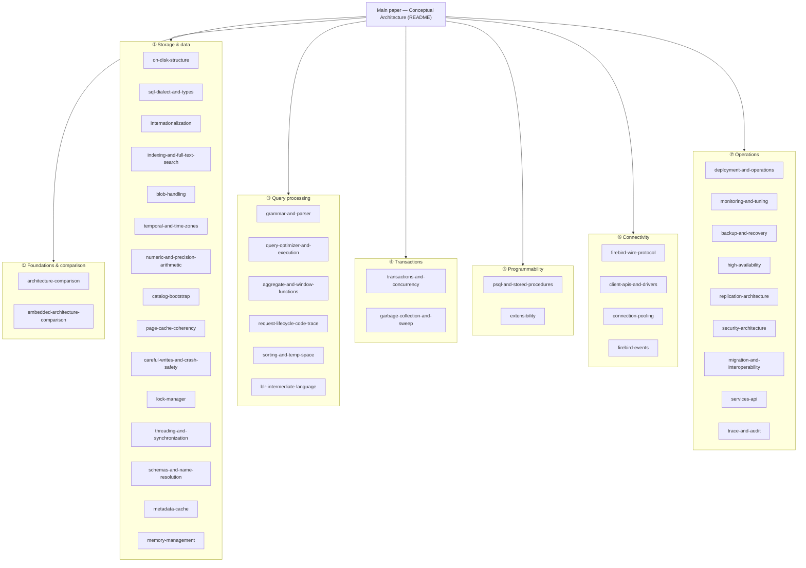

# Reading Guide: The Firebird Architecture Collection

This repository grew from a single 2005 student paper on Firebird's conceptual architecture into a **collection of forty companion documents** that dissect Firebird 6 subsystem by subsystem and compare each with PostgreSQL, MySQL and SQLite — every claim grounded in the vendored [`extern/firebird`](extern/firebird) source and, wherever possible, verified live against a running Firebird 6 server. This guide is the map: it organizes the collection into themed tracks, offers reading paths for different goals, and draws out the ideas that recur across documents.

Start with the [main paper](README.md) itself — the conceptual architecture (pipe-and-filter top level, REMOTE / DSQL / JRD / LOCK, the Y-valve, and the [evolution from Firebird 3 to 6](README.md#architectural-evolution-firebird-3-to-6)) — then follow whichever track below fits your goal.

## The map

_The collection in seven tracks, all rooted in the main paper_

## The seven tracks

### ① Foundations and comparison
The big picture and the four-engine lens used throughout.
- **[Architecture Comparison](architecture-comparison.md)** — Firebird vs PostgreSQL, MySQL and SQLite along five axes (process model, query pipeline, concurrency, storage/durability, extensibility). The single best orientation to *how these four engines differ*.
- **[Embedded Architecture: Firebird vs SQLite](embedded-architecture-comparison.md)** — the two embedded databases contrasted; the decisive difference is concurrency (SQLite single-writer vs Firebird's full MVCC engine in-process). Introduces the recurring *embedded-vs-server* theme.

### ② Storage and data
How bytes and types are laid out on disk.
- **[On-Disk Structure](on-disk-structure.md)** — the ODS 14 page format from `ods.h`, the multi-generational record versions, and why Firebird needs neither a WAL nor an undo log. The physical foundation everything else rests on.
- **[SQL Dialect and Data Types](sql-dialect-and-types.md)** — dialects 1/2/3, the type system (INT128, DECFLOAT, named-zone timestamps), and strict-vs-dynamic typing.
- **[Internationalization](internationalization.md)** — the INTL subsystem, per-column character sets, ICU-backed collations, and transliteration.
- **[Indexing and Full-Text Search](indexing-and-full-text-search.md)** — the B-tree internals (prefix compression, jump nodes), the index variants (expression, partial, descending), query-time bitmap combining, and the native full-text-search gap.
- **[BLOB and Large-Object Handling](blob-handling.md)** — the separate-storage model (record holds only a blob id), multi-level page addressing, subtypes and text charsets, segmented/stream access, and `BLOB_APPEND`/`RDB$BLOB_UTIL`.
- **[Temporal Features and Time-Zone Handling](temporal-and-time-zones.md)** — the FB4 `WITH TIME ZONE` types (stored as UTC + a zone id that *preserves the named zone*), the session time zone, `AT TIME ZONE`, DST rules, and `DATEADD`/`DATEDIFF`.
- **[Numeric and Exact-Precision Arithmetic](numeric-and-precision-arithmetic.md)** — exact integers (`INT128`), scaled-integer `NUMERIC`, binary vs decimal floating point, and `DECFLOAT` (IEEE decimal64/128) with `SET DECFLOAT ROUND`/`TRAPS`.
- **[How the Engine Bootstraps Its Own Catalog](catalog-bootstrap.md)** — the chicken-and-egg of reading `RDB$RELATIONS` before knowing its format, cut by two fixed points: system-table formats compiled into the binary (`ini.epp`, `relations.h`) and one header word (`hdr_PAGES`) anchoring the self-describing `RDB$PAGES`. With a hex-level walk of a fresh database and the `initdb`/BKI and SQLite-page-1 comparison. The prequel to the [request trace](request-lifecycle-code-trace.md).
- **[The Page Cache and Cross-Process Coherency](page-cache-coherency.md)** — how Classic processes and embedded attachments keep private page caches coherent: the three arbitration layers (OS file lock, `LCK_database` probe, per-buffer `LCK_bdb` locks), the blocking-AST flush-and-downgrade protocol, and data traveling cache-to-cache *through the disk* — live-proven with `fb_lock_print` showing two processes sharing 106 page locks. The load-bearing use of the lock manager.
- **[Careful Writes and Crash Safety](careful-writes-and-crash-safety.md)** — the precedence graph (`cch.cpp`'s `Precedence` blocks, `check_precedence`/`related`/`write_buffer` recursion) that lets Firebird guarantee crash-consistent files with no write-ahead log, the concrete page-ordering rules it encodes (pip → pointer page → data page, split bucket → parent, and more), the deferred header-write amortization, and the honest gaps (no page checksums, no log-based PITR) — proven live with five `kill -9`s mid-write and a `gfix`/`gbak` cleanup of the resulting orphan pages. The mechanism behind the on-disk-structure document's headline claim.
- **[The Lock Manager and the Lock Protocol](lock-manager.md)** — the subsystem every other document reaches for, treated as a subject: the `SRQ_PTR` shared-memory arena (`lhb`/`lbl`/`lrq`/`own`/`prc`), the 7×7 compatibility matrix that *is* the entire arbitration policy, the `enqueue` path and its three-way `lck_wait` contract, blocking-AST delivery across process boundaries (`post_blockage` → `signal_owner` → `blocking_action_thread`, with the arena mutex released around every callback), periodic wait-for-graph deadlock detection, and a tour of all thirty-six `lck_t` series — with all three wait outcomes measured live (0.06 s conflict, 3.06 s timeout, a real deadlock caught 10 s late by the scanner).
- **[Memory Management](memory-management.md)** — the `MemoryPool&` in almost every constructor quoted in this collection, finally opened. Pools mirror the object hierarchy (database → attachment → transaction → statement → request) because **the pool is the lifetime**: destruction releases raw extents without visiting a single object, and the few objects needing cleanup register a `Finalizer`. Underneath is a hand-written arena — three size classes, 64 KB extents — plus the `PARENT_REDIRECT_THRESHOLD` trick where a child pool satisfies sub-48 KB requests out of its *parent's* extents. That trick is visible from SQL: every attachment, transaction and statement pool reports real `MON$MEMORY_USED` and **zero** `MON$MEMORY_ALLOCATED`, while a compiled-statement pool maps exactly 65,536 bytes — one `DEFAULT_ALLOCATION`. Closest peer in the collection's four-engine lens: PostgreSQL's `MemoryContext`, arrived at independently for the same reason.
- **[The Metadata Cache](metadata-cache.md)** — what a resolved name actually points at, and the subsystem [catalog bootstrap](catalog-bootstrap.md) hands off to without describing: seven cached families split into `Versioned` and `Permanent` halves, each object a **chain of versions** stamped with the transaction that made them, `ERASED` tombstones for dropped objects, and dead versions reclaimed twice over — by **hazard pointers** from the vendored libcds at instruction scale, and by the **oldest-active-transaction barrier** (the same one that governs record GC) at transaction scale. Cross-process invalidation is a blocking AST on the six `LCK_*_rescan` series carrying one transaction number, which the receiver turns into a new local version. The headline is a correction worth having: the structure is multi-generational, but the visibility rule is **read-committed, not snapshot** — proven live in both directions, including a committed `ALTER` that becomes visible inside an older open snapshot, and the `newVersion: table 128 is used by transaction 51` error traced back to the exact `raiseFmt` that produced it.
- **[Schemas and Name Resolution](schemas-and-name-resolution.md)** — the defining change of Firebird 6, and what it takes to retrofit a namespace into a catalog that never had one: a name is now a schema/object/package triple (`BaseQualifiedName`), 32 of the 60 catalog relations gained a schema field, and `RDB$SCHEMAS` lands at **relation 56** — append-only allocation again. The architecture is three refusals to let late binding spread: `SET SEARCH_PATH` re-appends `SYSTEM` if you omit it, the engine's own queries run on an immutable `SYSTEM`-only path, and stored code resolves against **its own schema** rather than the caller's — proven live by a procedure that keeps meaning `APP.CUSTOMERS` after the session switches to `PUBLIC`, and by BLR that contains no schema at all (which is why schemas needed no `blr_version6`). Ends with the search-path shadowing hazard, measured live and contrasted with PostgreSQL's CVE-2018-1058.
- **[Threading and Synchronization](threading-and-synchronization.md)** — the other half of the concurrency story, and an explanation of the `thread_db* tdbb` that opens nearly every code excerpt in this collection: what a thread carries (object stack, memory pool, four-level statistics, held latches, and a *cooperative* scheduling quantum with `SWEEP_QUANTUM = 10` "to make sweeps less disruptive"), how contexts nest, the `SyncObject` reader-writer latch whose entire state is one `AtomicCounter`, a precise latch-vs-lock table, and a census of every long-lived engine thread with its real declaration site and priority — measured live: 4 idle threads → 12 under load → **10 retained**, proving threads are pooled, plus the Cache Writer and Garbage Collector visible as named system attachments in `MON$ATTACHMENTS`.

### ③ Query processing
Text to results — the query lifecycle.
- **[SQL Grammar and Parser](grammar-and-parser.md)** — the BtYacc grammar, a regenerable full-grammar Mermaid diagram, and the parser-generator comparison. Ships a reproducible generator ([`tools/grammar_to_mermaid.py`](tools/grammar_to_mermaid.py)).
- **[Query Optimizer and Execution Engine](query-optimizer-and-execution.md)** — the cost-based optimizer, access paths, join methods, and the Volcano record-source executor, with real plans. Together these two close the arc **parse → optimize → execute**.
- **[Aggregate, Window and Analytical Functions](aggregate-and-window-functions.md)** — `GROUP BY` aggregates (`FILTER`, `LISTAGG`, statistical), window functions (frames, ranking, navigational), and ordered/hypothetical-set aggregates (`PERCENTILE_CONT`), and how the `SortedStream`/`AggregatedStream`/`WindowedStream` operators execute them.
- **[Tracing a Request Through the Source Code](request-lifecycle-code-trace.md)** — the main paper's metadata-update scenario replayed against the real Firebird 6 sources: Y-valve → Remote client → XDR/INET wire → Remote server → DSQL → CMP → EXE → the DDL nodes and MET → the Lock manager's shared-memory table → deferred work at commit → CCH careful writes → per-OS `PIO_write`, with the key structure (`rem_port`, `Rsr`, `thread_db`, `Lock`, `lhb`, `BufferDesc`) described at every hop. The capstone of the query-lifecycle arc.
- **[Sorting and Temporary Space](sorting-and-temp-space.md)** — the one executor operator the optimizer document leaves as a black box: `sort.cpp`'s external merge sort (diddled keys → memcmp, 128 KB buffers, 8-way run merges), TempSpace's memory-then-unlinked-scratch-file spill (`TempCacheLimit`/`TempBlockSize`/`TempDirectories`), the `InlineSortThreshold` refetch mode — with a live-captured 448 MB invisible scratch file, vs PostgreSQL `work_mem`, MySQL filesort, SQLite.
- **[BLR, the Binary Language Representation](blr-intermediate-language.md)** — the IR the whole collection names but never explains: a prefix-encoded, name-bound, *declarative* AST that is stored in twelve catalog columns, shipped over the wire as message descriptions, and compiled into the engine by GPRE. Covers the encoding (annotated byte by byte from a real computed column), the seven opcode families, both directions of translation (`GEN_statement` / `PAR_parse`), why BLR is emphatically **not** a plan, and why `blr_version6` is still commented out after four engine releases — append-only opcode allocation, the same discipline as lock series and relation ids. Disassembled live from the `employee` database with nothing but `SET BLOB ALL`.

### ④ Transactions and concurrency
- **[Transactions, Concurrency and Isolation Levels](transactions-and-concurrency.md)** — the multi-generational (no-undo MVCC) model, the three isolation levels, commit-order snapshots, and conflict handling, with live concurrent-transaction demos.
- **[Garbage Collection, Sweep and the Record-Version Lifecycle](garbage-collection-and-sweep.md)** — how versions *die*: the oldest-snapshot barrier, cooperative/background/intermediate GC, sweep and OIT advancement, the four header counters — with live demos (a pinned snapshot, a rolled-back stump, `gfix -sweep`) and the VACUUM/InnoDB-purge comparison. Completes the MGA arc.

### ⑤ Programmability
Extending the engine, in-language and in native code.
- **[PSQL, Stored Procedures and Triggers](psql-and-stored-procedures.md)** — the procedural language (selectable procedures, packages, DML/DDL/database triggers), with side-by-side examples in PL/pgSQL, MySQL and SQLite.
- **[Extensibility: UDR, Plugins and External Engines](extensibility.md)** — the plugin architecture (even the engine is a plugin), external engines, and UDR, with a live-run native routine.

### ⑥ Connectivity
Getting from an application to the engine.
- **[The Firebird 6 Wire Protocol and SRP Authentication](firebird-wire-protocol.md)** — the on-the-wire protocol byte-by-byte, the SRP handshake and its deviations from the RFCs, wire encryption, and a protocol comparison. Includes runnable Node.js and C++ [`samples/`](samples/).
- **[Client APIs and Drivers Across Languages](client-apis-and-drivers.md)** — the OO and ISC C APIs, and the native-binding vs pure-protocol driver split.
- **[Connection Pooling and External Connections](connection-pooling.md)** — inbound vs outbound pooling, the built-in EDS pool, and the PgBouncer/ProxySQL contrast.
- **[The Event Subsystem](firebird-events.md)** — `POST_EVENT` as commit-time deferred work, the shared-memory event manager, one-shot interests and count deltas, the auxiliary wire connection (`RemoteAuxPort`), a live C++ demo ([`samples/events_demo.cpp`](samples/events_demo.cpp)), and the `LISTEN/NOTIFY` comparison. The one channel where the server calls the client.

### ⑦ Operations
Running Firebird in production.
- **[Deployment and Operations](deployment-and-operations.md)** — install layout, config files, `ServerMode`, aliases, and containers.
- **[Monitoring and Performance Tuning](monitoring-and-tuning.md)** — the MON$ tables, trace/profiler, query plans, and the tuning knobs.
- **[Backup and Recovery](backup-and-recovery.md)** — `gbak`, `nbackup`, crash recovery without a log, and validation.
- **[High Availability and Clustering](high-availability.md)** — shadows, replication-based standbys, and failover.
- **[Replication Architecture](replication-architecture.md)** — the evolution from FB3 (none) to FB4+ logical replication, with a validated setup.
- **[Security Architecture](security-architecture.md)** — authentication, wire and at-rest encryption, and authorization.
- **[Migration and Interoperability](migration-and-interoperability.md)** — version upgrades, engine-to-engine migration with type mapping, and runtime interoperability.
- **[The Services API](services-api.md)** — the channel every other operations document quietly uses: `service_mgr`, the `services[]` dispatch table whose entry points *are* `BURP_main`/`ALICE_main`/`GSEC_main`/`main_gstat`, the `UtilSvc` seam that lets one function serve both the command line and the network, SPB→argv conversion, the 1 KB output ring buffer that blocks the worker when undrained, and the two-layer authorization model — with the operational headline proven live: a service backup writes **on the server, as the server's user**, byte-identical to the CLI's output.
- **[Trace and Audit](trace-and-audit.md)** — the event *stream* that complements the `MON$` *snapshot*, and a case study in observing without interfering: the three-step `needs()` gate that makes a traceable site cost one branch when nobody is listening, the 23-event mask whose out-of-order tail is append-only ABI discipline, the shared-memory session registry that exists because `Classic` puts attachments in different processes, per-attachment authorization enforced by *not creating the plugin* (`TRACE_ANY_ATTACHMENT`), and — the headline — a log that never blocks the engine but **suspends its own session** when the consumer falls behind, measured live: a suspended session costs 2.555 s against a 2.611 s untraced baseline.

## Reading paths by goal

- **New to Firebird's architecture** → [main paper](README.md) → [Architecture Comparison](architecture-comparison.md) → [On-Disk Structure](on-disk-structure.md) → [Transactions](transactions-and-concurrency.md) → [Query Optimizer](query-optimizer-and-execution.md).
- **How the engine knows what a table *is*** → [Catalog Bootstrap](catalog-bootstrap.md) → [Schemas and Name Resolution](schemas-and-name-resolution.md) → [The Metadata Cache](metadata-cache.md) → [BLR](blr-intermediate-language.md) — read in that order, the arc runs from the first bytes of a fresh database to a compiled, name-bound request.
- **Application developer** → [SQL Dialect and Types](sql-dialect-and-types.md) → [Schemas and Name Resolution](schemas-and-name-resolution.md) → [PSQL](psql-and-stored-procedures.md) → [Client APIs](client-apis-and-drivers.md) → [Wire Protocol](firebird-wire-protocol.md) → [Internationalization](internationalization.md).
- **Reading the engine's C++ directly** → [Memory Management](memory-management.md) (the `MemoryPool&` in every constructor) → [Threading and Synchronization](threading-and-synchronization.md) (the `thread_db* tdbb` in every signature) → [The Metadata Cache](metadata-cache.md) → [Request Lifecycle Code Trace](request-lifecycle-code-trace.md) — the three ambient parameters first, then the walk-through that uses them.
- **DBA / operations** → [Deployment](deployment-and-operations.md) → [Monitoring & Tuning](monitoring-and-tuning.md) → [Backup & Recovery](backup-and-recovery.md) → [High Availability](high-availability.md) → [Replication](replication-architecture.md) → [Security](security-architecture.md) → [Connection Pooling](connection-pooling.md) → [Trace and Audit](trace-and-audit.md).
- **Evaluating Firebird vs PostgreSQL / MySQL / SQLite** → [Architecture Comparison](architecture-comparison.md) → [Embedded Comparison](embedded-architecture-comparison.md) → [On-Disk Structure](on-disk-structure.md) → [Transactions](transactions-and-concurrency.md) → [Replication](replication-architecture.md) → [Security](security-architecture.md) (every document ends with a four-way comparison).
- **Building a driver or protocol tool** → [Wire Protocol](firebird-wire-protocol.md) → [Client APIs](client-apis-and-drivers.md) → [Grammar and Parser](grammar-and-parser.md), with the [`samples/`](samples/).
- **Migrating in or out** → [Migration & Interoperability](migration-and-interoperability.md) → [SQL Dialect and Types](sql-dialect-and-types.md) → [Schemas and Name Resolution](schemas-and-name-resolution.md) (ODS 14 arrives with schemas — a restore, not a flag) → [Backup & Recovery](backup-and-recovery.md).

## Ideas that recur across the collection

The documents were written independently, but a handful of architectural decisions echo through nearly all of them — and understanding these five is understanding Firebird:

- **No-undo MVCC (the multi-generational architecture).** Old row versions live on the data page as deltas and *are* the undo information. This one choice explains the [on-disk layout](on-disk-structure.md), the [isolation levels](transactions-and-concurrency.md), the [visibility rules](transactions-and-concurrency.md#commit-order-snapshots-firebird-4), garbage collection and the OIT/OAT health signal in [tuning](monitoring-and-tuning.md), and the version-cleanup contrast in the [architecture comparison](architecture-comparison.md).
- **No write-ahead log; crash safety by careful write ordering.** The file is consistent by construction, so [recovery](backup-and-recovery.md#crash-recovery-consistency-without-a-log) is instant — but there is no log to replay for PITR, which is exactly why the [replication journal](replication-architecture.md#firebird-evolution-3--4--5--6--future) had to be *added* in FB4. Traced in [on-disk structure](on-disk-structure.md#advantages-of-the-firebird-on-disk-structure) and [backup](backup-and-recovery.md), and mechanized in the [precedence graph](careful-writes-and-crash-safety.md) — proven live with five `kill -9`s mid-write.
- **One library is both client and embedded engine, dispatched by the Y-valve.** The same `fbclient` serves networked and embedded connections, chosen by connection string. This underlies the [embedded comparison](embedded-architecture-comparison.md), [client APIs](client-apis-and-drivers.md), [deployment](deployment-and-operations.md), and [pooling](connection-pooling.md).
- **Plugins around a single storage core.** Providers, authentication, encryption, trace and external engines are all [plugins](extensibility.md) — even the engine itself — while the storage engine stays single and integrated. Seen in [security](security-architecture.md), the [wire protocol](firebird-wire-protocol.md), [replication](replication-architecture.md), and [monitoring](monitoring-and-tuning.md).
- **BLR, a stable intermediate language.** SQL (and PSQL) compile to BLR, which is stored and executed — the counterpart to SQLite's VDBE bytecode, though BLR is declarative and persisted where VDBE is procedural and ephemeral. Now has its own document, [BLR](blr-intermediate-language.md); also appears in the [grammar](grammar-and-parser.md), [wire protocol](firebird-wire-protocol.md), [PSQL](psql-and-stored-procedures.md), and [architecture comparison](architecture-comparison.md).
- **Append-only durability.** A number that escapes into a durable artifact can never be reused, so Firebird grows rather than renumbers: [`lck_t` lock series](lock-manager.md) (read from shared memory by mixed-version processes), [system relation ids](catalog-bootstrap.md) (baked into the binary as array positions), and [BLR opcodes](blr-intermediate-language.md) (a database written by an older engine must still execute). Same constraint, same answer, three subsystems.

A meta-theme sits above these: the **embedded-vs-server split**. Again and again, SQLite optimizes for a tiny library that stays out of the way while the three server engines invest in machinery (concurrency, replication, plugins, deployment tooling) — and Firebird is the unusual engine that is *both*, a full server that also runs embedded from the same binary.

## What backs the collection

- **Source of truth:** the [`extern/firebird`](extern/firebird) submodule (Firebird 6 `master`) — headers, docs and code are cited throughout, not paraphrased from memory.
- **Live verification:** query plans, `gstat`/`gfix` output, concurrent-transaction behavior, replication, UDR execution, collations, the connection pool and more were run against a real Firebird 6 server and the actual output is quoted.
- **Runnable code:** [`samples/`](samples/) (OO-API C++ clients, pure-JS driver use, and a from-scratch SRP/Arc4 wire handshake) and [`tools/grammar_to_mermaid.py`](tools/grammar_to_mermaid.py) (the grammar-diagram generator), with generated [`diagrams/`](diagrams/).
- **Every external link checked**, and every Mermaid diagram validated with the parser before commit.

This guide is the entry point; the [main paper](README.md) is the beginning of the story.
