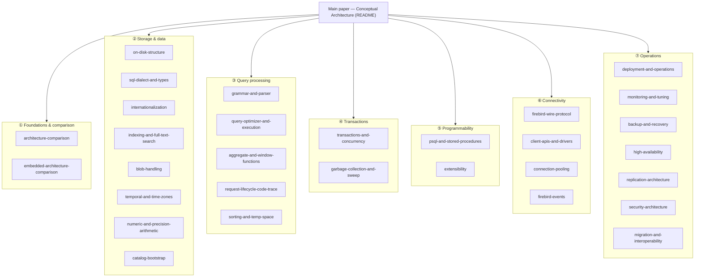

# Reading Guide: The Firebird Architecture Collection

This repository grew from a single 2005 student paper on Firebird's conceptual architecture into a **collection of thirty companion documents** that dissect Firebird 6 subsystem by subsystem and compare each with PostgreSQL, MySQL and SQLite — every claim grounded in the vendored [`extern/firebird`](extern/firebird) source and, wherever possible, verified live against a running Firebird 6 server. This guide is the map: it organizes the collection into themed tracks, offers reading paths for different goals, and draws out the ideas that recur across documents.

Start with the [main paper](README.md) itself — the conceptual architecture (pipe-and-filter top level, REMOTE / DSQL / JRD / LOCK, the Y-valve, and the [evolution from Firebird 3 to 6](README.md#architectural-evolution-firebird-3-to-6)) — then follow whichever track below fits your goal.

## The map

_The collection in seven tracks, all rooted in the main paper_

## The seven tracks

### ① Foundations and comparison
The big picture and the four-engine lens used throughout.
- **[Architecture Comparison](architecture-comparison.md)** — Firebird vs PostgreSQL, MySQL and SQLite along five axes (process model, query pipeline, concurrency, storage/durability, extensibility). The single best orientation to *how these four engines differ*.
- **[Embedded Architecture: Firebird vs SQLite](embedded-architecture-comparison.md)** — the two embedded databases contrasted; the decisive difference is concurrency (SQLite single-writer vs Firebird's full MVCC engine in-process). Introduces the recurring *embedded-vs-server* theme.

### ② Storage and data
How bytes and types are laid out on disk.
- **[On-Disk Structure](on-disk-structure.md)** — the ODS 14 page format from `ods.h`, the multi-generational record versions, and why Firebird needs neither a WAL nor an undo log. The physical foundation everything else rests on.
- **[SQL Dialect and Data Types](sql-dialect-and-types.md)** — dialects 1/2/3, the type system (INT128, DECFLOAT, named-zone timestamps), and strict-vs-dynamic typing.
- **[Internationalization](internationalization.md)** — the INTL subsystem, per-column character sets, ICU-backed collations, and transliteration.
- **[Indexing and Full-Text Search](indexing-and-full-text-search.md)** — the B-tree internals (prefix compression, jump nodes), the index variants (expression, partial, descending), query-time bitmap combining, and the native full-text-search gap.
- **[BLOB and Large-Object Handling](blob-handling.md)** — the separate-storage model (record holds only a blob id), multi-level page addressing, subtypes and text charsets, segmented/stream access, and `BLOB_APPEND`/`RDB$BLOB_UTIL`.
- **[Temporal Features and Time-Zone Handling](temporal-and-time-zones.md)** — the FB4 `WITH TIME ZONE` types (stored as UTC + a zone id that *preserves the named zone*), the session time zone, `AT TIME ZONE`, DST rules, and `DATEADD`/`DATEDIFF`.
- **[Numeric and Exact-Precision Arithmetic](numeric-and-precision-arithmetic.md)** — exact integers (`INT128`), scaled-integer `NUMERIC`, binary vs decimal floating point, and `DECFLOAT` (IEEE decimal64/128) with `SET DECFLOAT ROUND`/`TRAPS`.
- **[How the Engine Bootstraps Its Own Catalog](catalog-bootstrap.md)** — the chicken-and-egg of reading `RDB$RELATIONS` before knowing its format, cut by two fixed points: system-table formats compiled into the binary (`ini.epp`, `relations.h`) and one header word (`hdr_PAGES`) anchoring the self-describing `RDB$PAGES`. With a hex-level walk of a fresh database and the `initdb`/BKI and SQLite-page-1 comparison. The prequel to the [request trace](request-lifecycle-code-trace.md).

### ③ Query processing
Text to results — the query lifecycle.
- **[SQL Grammar and Parser](grammar-and-parser.md)** — the BtYacc grammar, a regenerable full-grammar Mermaid diagram, and the parser-generator comparison. Ships a reproducible generator ([`tools/grammar_to_mermaid.py`](tools/grammar_to_mermaid.py)).
- **[Query Optimizer and Execution Engine](query-optimizer-and-execution.md)** — the cost-based optimizer, access paths, join methods, and the Volcano record-source executor, with real plans. Together these two close the arc **parse → optimize → execute**.
- **[Aggregate, Window and Analytical Functions](aggregate-and-window-functions.md)** — `GROUP BY` aggregates (`FILTER`, `LISTAGG`, statistical), window functions (frames, ranking, navigational), and ordered/hypothetical-set aggregates (`PERCENTILE_CONT`), and how the `SortedStream`/`AggregatedStream`/`WindowedStream` operators execute them.
- **[Tracing a Request Through the Source Code](request-lifecycle-code-trace.md)** — the main paper's metadata-update scenario replayed against the real Firebird 6 sources: Y-valve → Remote client → XDR/INET wire → Remote server → DSQL → CMP → EXE → the DDL nodes and MET → the Lock manager's shared-memory table → deferred work at commit → CCH careful writes → per-OS `PIO_write`, with the key structure (`rem_port`, `Rsr`, `thread_db`, `Lock`, `lhb`, `BufferDesc`) described at every hop. The capstone of the query-lifecycle arc.
- **[Sorting and Temporary Space](sorting-and-temp-space.md)** — the one executor operator the optimizer document leaves as a black box: `sort.cpp`'s external merge sort (diddled keys → memcmp, 128 KB buffers, 8-way run merges), TempSpace's memory-then-unlinked-scratch-file spill (`TempCacheLimit`/`TempBlockSize`/`TempDirectories`), the `InlineSortThreshold` refetch mode — with a live-captured 448 MB invisible scratch file, vs PostgreSQL `work_mem`, MySQL filesort, SQLite.

### ④ Transactions and concurrency
- **[Transactions, Concurrency and Isolation Levels](transactions-and-concurrency.md)** — the multi-generational (no-undo MVCC) model, the three isolation levels, commit-order snapshots, and conflict handling, with live concurrent-transaction demos.
- **[Garbage Collection, Sweep and the Record-Version Lifecycle](garbage-collection-and-sweep.md)** — how versions *die*: the oldest-snapshot barrier, cooperative/background/intermediate GC, sweep and OIT advancement, the four header counters — with live demos (a pinned snapshot, a rolled-back stump, `gfix -sweep`) and the VACUUM/InnoDB-purge comparison. Completes the MGA arc.

### ⑤ Programmability
Extending the engine, in-language and in native code.
- **[PSQL, Stored Procedures and Triggers](psql-and-stored-procedures.md)** — the procedural language (selectable procedures, packages, DML/DDL/database triggers), with side-by-side examples in PL/pgSQL, MySQL and SQLite.
- **[Extensibility: UDR, Plugins and External Engines](extensibility.md)** — the plugin architecture (even the engine is a plugin), external engines, and UDR, with a live-run native routine.

### ⑥ Connectivity
Getting from an application to the engine.
- **[The Firebird 6 Wire Protocol and SRP Authentication](firebird-wire-protocol.md)** — the on-the-wire protocol byte-by-byte, the SRP handshake and its deviations from the RFCs, wire encryption, and a protocol comparison. Includes runnable Node.js and C++ [`samples/`](samples/).
- **[Client APIs and Drivers Across Languages](client-apis-and-drivers.md)** — the OO and ISC C APIs, and the native-binding vs pure-protocol driver split.
- **[Connection Pooling and External Connections](connection-pooling.md)** — inbound vs outbound pooling, the built-in EDS pool, and the PgBouncer/ProxySQL contrast.
- **[The Event Subsystem](firebird-events.md)** — `POST_EVENT` as commit-time deferred work, the shared-memory event manager, one-shot interests and count deltas, the auxiliary wire connection (`RemoteAuxPort`), a live C++ demo ([`samples/events_demo.cpp`](samples/events_demo.cpp)), and the `LISTEN/NOTIFY` comparison. The one channel where the server calls the client.

### ⑦ Operations
Running Firebird in production.
- **[Deployment and Operations](deployment-and-operations.md)** — install layout, config files, `ServerMode`, aliases, and containers.
- **[Monitoring and Performance Tuning](monitoring-and-tuning.md)** — the MON$ tables, trace/profiler, query plans, and the tuning knobs.
- **[Backup and Recovery](backup-and-recovery.md)** — `gbak`, `nbackup`, crash recovery without a log, and validation.
- **[High Availability and Clustering](high-availability.md)** — shadows, replication-based standbys, and failover.
- **[Replication Architecture](replication-architecture.md)** — the evolution from FB3 (none) to FB4+ logical replication, with a validated setup.
- **[Security Architecture](security-architecture.md)** — authentication, wire and at-rest encryption, and authorization.
- **[Migration and Interoperability](migration-and-interoperability.md)** — version upgrades, engine-to-engine migration with type mapping, and runtime interoperability.

## Reading paths by goal

- **New to Firebird's architecture** → [main paper](README.md) → [Architecture Comparison](architecture-comparison.md) → [On-Disk Structure](on-disk-structure.md) → [Transactions](transactions-and-concurrency.md) → [Query Optimizer](query-optimizer-and-execution.md).
- **Application developer** → [SQL Dialect and Types](sql-dialect-and-types.md) → [PSQL](psql-and-stored-procedures.md) → [Client APIs](client-apis-and-drivers.md) → [Wire Protocol](firebird-wire-protocol.md) → [Internationalization](internationalization.md).
- **DBA / operations** → [Deployment](deployment-and-operations.md) → [Monitoring & Tuning](monitoring-and-tuning.md) → [Backup & Recovery](backup-and-recovery.md) → [High Availability](high-availability.md) → [Replication](replication-architecture.md) → [Security](security-architecture.md) → [Connection Pooling](connection-pooling.md).
- **Evaluating Firebird vs PostgreSQL / MySQL / SQLite** → [Architecture Comparison](architecture-comparison.md) → [Embedded Comparison](embedded-architecture-comparison.md) → [On-Disk Structure](on-disk-structure.md) → [Transactions](transactions-and-concurrency.md) → [Replication](replication-architecture.md) → [Security](security-architecture.md) (every document ends with a four-way comparison).
- **Building a driver or protocol tool** → [Wire Protocol](firebird-wire-protocol.md) → [Client APIs](client-apis-and-drivers.md) → [Grammar and Parser](grammar-and-parser.md), with the [`samples/`](samples/).
- **Migrating in or out** → [Migration & Interoperability](migration-and-interoperability.md) → [SQL Dialect and Types](sql-dialect-and-types.md) → [Backup & Recovery](backup-and-recovery.md).

## Ideas that recur across the collection

The documents were written independently, but a handful of architectural decisions echo through nearly all of them — and understanding these five is understanding Firebird:

- **No-undo MVCC (the multi-generational architecture).** Old row versions live on the data page as deltas and *are* the undo information. This one choice explains the [on-disk layout](on-disk-structure.md), the [isolation levels](transactions-and-concurrency.md), the [visibility rules](transactions-and-concurrency.md#commit-order-snapshots-firebird-4), garbage collection and the OIT/OAT health signal in [tuning](monitoring-and-tuning.md), and the version-cleanup contrast in the [architecture comparison](architecture-comparison.md).
- **No write-ahead log; crash safety by careful write ordering.** The file is consistent by construction, so [recovery](backup-and-recovery.md#crash-recovery-consistency-without-a-log) is instant — but there is no log to replay for PITR, which is exactly why the [replication journal](replication-architecture.md#firebird-evolution-3--4--5--6--future) had to be *added* in FB4. Traced in [on-disk structure](on-disk-structure.md#advantages-of-the-firebird-on-disk-structure) and [backup](backup-and-recovery.md).
- **One library is both client and embedded engine, dispatched by the Y-valve.** The same `fbclient` serves networked and embedded connections, chosen by connection string. This underlies the [embedded comparison](embedded-architecture-comparison.md), [client APIs](client-apis-and-drivers.md), [deployment](deployment-and-operations.md), and [pooling](connection-pooling.md).
- **Plugins around a single storage core.** Providers, authentication, encryption, trace and external engines are all [plugins](extensibility.md) — even the engine itself — while the storage engine stays single and integrated. Seen in [security](security-architecture.md), the [wire protocol](firebird-wire-protocol.md), [replication](replication-architecture.md), and [monitoring](monitoring-and-tuning.md).
- **BLR, a stable intermediate language.** SQL (and PSQL) compile to BLR, which is stored and executed — the counterpart to SQLite's VDBE bytecode. Appears in the [grammar](grammar-and-parser.md), [wire protocol](firebird-wire-protocol.md), [PSQL](psql-and-stored-procedures.md), and [architecture comparison](architecture-comparison.md).

A meta-theme sits above these: the **embedded-vs-server split**. Again and again, SQLite optimizes for a tiny library that stays out of the way while the three server engines invest in machinery (concurrency, replication, plugins, deployment tooling) — and Firebird is the unusual engine that is *both*, a full server that also runs embedded from the same binary.

## What backs the collection

- **Source of truth:** the [`extern/firebird`](extern/firebird) submodule (Firebird 6 `master`) — headers, docs and code are cited throughout, not paraphrased from memory.
- **Live verification:** query plans, `gstat`/`gfix` output, concurrent-transaction behavior, replication, UDR execution, collations, the connection pool and more were run against a real Firebird 6 server and the actual output is quoted.
- **Runnable code:** [`samples/`](samples/) (OO-API C++ clients, pure-JS driver use, and a from-scratch SRP/Arc4 wire handshake) and [`tools/grammar_to_mermaid.py`](tools/grammar_to_mermaid.py) (the grammar-diagram generator), with generated [`diagrams/`](diagrams/).
- **Every external link checked**, and every Mermaid diagram validated with the parser before commit.

This guide is the entry point; the [main paper](README.md) is the beginning of the story.
