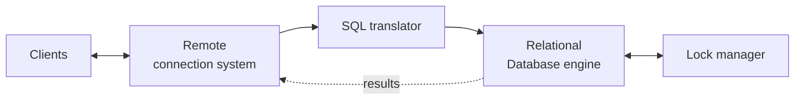
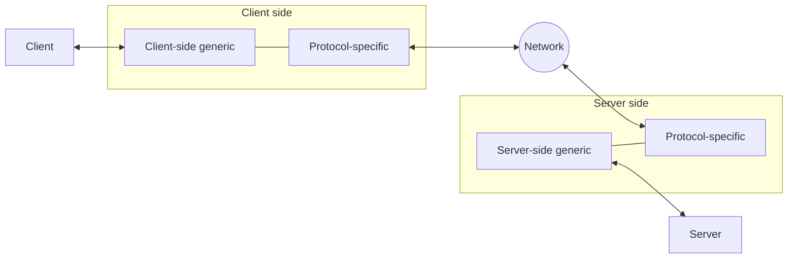
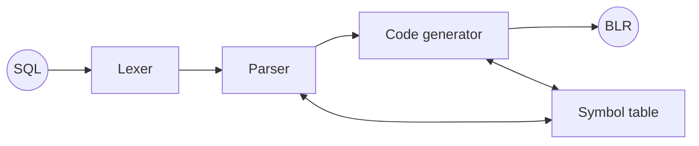
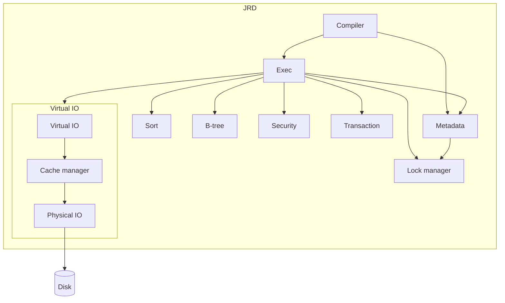
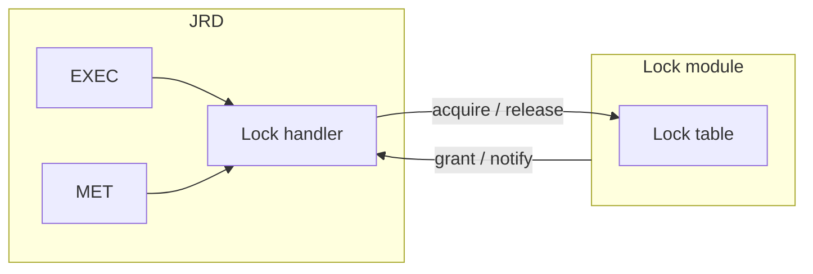
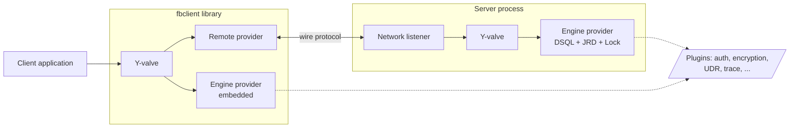

# Conceptual Architecture for Firebird

**Authors:** Hubert Chan and Dmytro Yashkir  
**Institution:** Faculty of Mathematical, Statistical and Computer Sciences, University of Waterloo, Canada  
**Updated by:** Popa Adrian Marius

## Abstract

In this paper, we investigate the conceptual architecture for the Firebird database. We identify the major components of the database system and their interactions. Some of these components themselves have their own architectures, which we will also discuss. We present some scenarios which illustrate the interactions between the components. We show that the top-level architecture is styled after a pipe and filter architecture, while each component may have its own architectural style.

**Table of Contents**

* [Introduction](#introduction)
* [Top-level architecture](#top-level-architecture)
* [Remote communication](#remote-communication)
* [SQL translator](#sql-translator)
* [JRD](#jrd)
* [JRD and Lock module](#jrd-and-lock-module)
* [Use scenarios](#use-scenarios)
* [Extensibility of Firebird](#extensibility-of-firebird)
* [References](#references)

**📚 [Reading Guide](READING-GUIDE.md) — start here for the full collection of forty-three companion documents, organized into themed tracks with reading paths.** The individual companions:

* Companion document: [Architecture Comparison — Firebird, PostgreSQL, MySQL, SQLite](architecture-comparison.md)
* Companion document: [The Firebird 6 Wire Protocol and SRP Authentication](firebird-wire-protocol.md)
* Companion document: [Embedded Architecture — Firebird vs SQLite](embedded-architecture-comparison.md)
* Companion document: [Replication Architecture — Firebird, PostgreSQL, MySQL, SQLite](replication-architecture.md)
* Companion document: [On-Disk Structure — Firebird ODS vs PostgreSQL, InnoDB, SQLite](on-disk-structure.md)
* Companion document: [Security Architecture — authentication, encryption, authorization](security-architecture.md)
* Companion document: [Monitoring and Performance Tuning — MON$ tables, trace, optimizer, config](monitoring-and-tuning.md)
* Companion document: [Backup and Recovery — gbak, nbackup, crash recovery, validation](backup-and-recovery.md)
* Companion document: [High Availability and Clustering — shadows, replication, failover](high-availability.md)
* Companion document: [SQL Dialect and Data Types — Firebird vs PostgreSQL, MySQL, SQLite](sql-dialect-and-types.md)
* Companion document: [SQL Grammar and Parser — full grammar diagram + generator](grammar-and-parser.md)
* Companion document: [Query Optimizer and Execution Engine — cost model, plans, record sources](query-optimizer-and-execution.md)
* Companion document: [Transactions, Concurrency and Isolation Levels — MGA, snapshots, conflicts](transactions-and-concurrency.md)
* Companion document: [PSQL, Stored Procedures and Triggers — the procedural language](psql-and-stored-procedures.md)
* Companion document: [Extensibility — UDR, plugins and external engines](extensibility.md)
* Companion document: [Internationalization — character sets, collations, ICU](internationalization.md)
* Companion document: [Client APIs and Drivers Across Languages — OO/ISC API, native vs pure drivers](client-apis-and-drivers.md)
* Companion document: [Connection Pooling and External Connections — EDS pool, PgBouncer/ProxySQL contrast](connection-pooling.md)
* Companion document: [Deployment and Operations — install layout, config files, ServerMode, containers](deployment-and-operations.md)
* Companion document: [Migration and Interoperability — version upgrades, engine migration, federation](migration-and-interoperability.md)
* Companion document: [Indexing and Full-Text Search — B-tree internals, index variants, FTS gap](indexing-and-full-text-search.md)
* Companion document: [BLOB and Large-Object Handling — separate storage, subtypes, streaming](blob-handling.md)
* Companion document: [Temporal Features and Time-Zone Handling — WITH TIME ZONE, session zone, DST](temporal-and-time-zones.md)
* Companion document: [Numeric and Exact-Precision Arithmetic — INT128, DECFLOAT, NUMERIC internals, rounding](numeric-and-precision-arithmetic.md)
* Companion document: [Aggregate, Window and Analytical Functions — OVER, frames, ordered-set aggregates](aggregate-and-window-functions.md)
* Companion document: [Tracing a Request Through the Source Code — the paper's scenario, function by function](request-lifecycle-code-trace.md)
* Companion document: [Garbage Collection, Sweep and the Record-Version Lifecycle — how versions die](garbage-collection-and-sweep.md)
* Companion document: [The Event Subsystem — POST_EVENT, the auxiliary connection, LISTEN/NOTIFY contrast](firebird-events.md)
* Companion document: [How the Engine Bootstraps Its Own Catalog — formats as code, hdr_PAGES, the self-describing RDB$PAGES](catalog-bootstrap.md)
* Companion document: [Sorting and Temporary Space — the external merge sort, TempSpace spill, refetch](sorting-and-temp-space.md)
* Companion document: [The Page Cache and Cross-Process Coherency — LCK_bdb page locks, blocking ASTs, Classic vs Super](page-cache-coherency.md)
* Companion document: [Careful Writes and Crash Safety — the precedence graph, no-log recovery, a live kill -9 demo](careful-writes-and-crash-safety.md)
* Companion document: [The Lock Manager and the Lock Protocol — the shared-memory DLM, blocking ASTs, deadlock detection, all 36 lock series](lock-manager.md)
* Companion document: [The Services API — service_mgr, how gbak/gstat/gsec run server-side through one channel](services-api.md)
* Companion document: [BLR, the Binary Language Representation — Firebird's stored intermediate language, disassembled](blr-intermediate-language.md)
* Companion document: [Threading and Synchronization — ServerMode topologies, tdbb, latches vs locks, the engine's thread census](threading-and-synchronization.md)
* Companion document: [Trace and Audit — the event stream, the `needs()` gate, and a session that suspends itself](trace-and-audit.md)
* Companion document: [Schemas and Name Resolution — the namespace Firebird 6 retrofitted into a forty-year-old catalog](schemas-and-name-resolution.md)
* Companion document: [The Metadata Cache — versioned objects, hazard pointers, and an invalidation that crosses processes](metadata-cache.md)
* Companion document: [Memory Management — pools as lifetimes, and the allocator underneath](memory-management.md)
* Companion document: [The Profiler — where the time went, measured from inside](profiler.md)
* Companion document: [Parallel Workers — parallelism built out of attachments](parallel-workers.md)
* Companion document: [The Compiled Statement Cache — what makes two statements the same](statement-cache.md)

## Introduction

Software architecture presents developers with a tool for organizing large, complex software systems into various components, allowing the developers to better understand the system as a whole by reducing the number of components which must be kept in mind. It allows each developer to focus on a smaller part of the system, and enables the development team to integrate its work together by specifying the interfaces between the various parts in a clear and well defined manner.

There are several different types of architectural views. The conceptual architecture is a high-level view, with relatively few details, and is particularly well suited for describing the functionality of a system.

In this paper, we investigate the conceptual architecture for the Firebird database.

Firebird includes many tools and utilities for developing and administering a database, and the code base includes code from older versions, as well as some experimental branches (Firebird 6 development branch: [master](https://github.com/FirebirdSQL/firebird)). We will not be considering these in our analysis.

> **Note on this revision.** The diagrams below were originally raster images (GIF/PNG); they have been re-drawn as inline [Mermaid](https://mermaid.js.org/) diagrams so they render directly on GitHub and stay editable in text. The source-tree links have been updated from the legacy `B2_5_Release` branch of the `core` mirror to the current [Firebird 6 `master` branch](https://github.com/FirebirdSQL/firebird). Runnable C++ examples that exercise the architecture described here live in [`samples/`](samples/), and a new section, [Architectural evolution: Firebird 3 to 6](#architectural-evolution-firebird-3-to-6), tracks how the architecture has changed since the paper was written. A collection of forty-three companion documents extends it — dissecting Firebird 6 subsystem by subsystem and comparing each with PostgreSQL, MySQL and SQLite, grounded in the vendored source and verified against a live server. The **[Reading Guide](READING-GUIDE.md)** organizes them into themed tracks with reading paths; the individual companions are listed above.

We begin by discussing the overall architecture of the system. We then look at the architectures of some of the subsystems, and we finally present scenarios which illustrate the behaviour of the system in response to queries generated by clients.

## Top-level architecture

Firebird can be divided into four major components (see Figure 1): the remote connection system, the SQL translator, the relational database engine, and the lock manager. The arrows in the diagram indicate the flow of data. We include the clients in the diagram to illustrate their relationship with the rest of the system.

_Figure 1: Top-level architecture_

**remote connection system [(REMOTE)](https://github.com/FirebirdSQL/firebird/tree/master/src/remote/):** This subsystem allows remote clients to connect to the database over different network protocols. It is composed of two parts: a client-side component and a server-side component. In Firebird 6 the client and server both enter the engine through the **[Y-valve](https://github.com/FirebirdSQL/firebird/tree/master/src/yvalve/)** dispatch layer, which routes calls to the appropriate provider.

**SQL translator [(DSQL)](https://github.com/FirebirdSQL/firebird/tree/master/src/dsql/):** This subsystem translates requests from SQL into BLR, the native language of the database.

**relational database engine [(JRD)](https://github.com/FirebirdSQL/firebird/tree/master/src/jrd/):** This subsystem performs the actual queries.

**lock manager [(LOCK)](https://github.com/FirebirdSQL/firebird/tree/master/src/lock/):** This subsystem handles synchronization among transactions.

The arrangement of the remote connection system, SQL translator, and relational database engine, can be seen as a pipe and filter style of architecture: a request flows through the remote connection system, to the SQL translator, where it is converted to BLR. The BLR goes through the relational database, which returns a request through the remote connection system.

## Remote communication

The remote communication subsystem, REMOTE, allows clients to communicate remotely, or locally, with the server. It enables communication over several different network protocols, such as TCP/IP, [XNET](https://github.com/FirebirdSQL/firebird/blob/master/src/remote/os/win32/xnet.cpp) (Firebird's implementation of the local transport protocol, Windows-only in current versions; on POSIX, local connections go through the embedded engine provider). The subsystem is split roughly into two parts: a server side, and a client side. It contains generic code for client-server communication, as well as protocol-specific code.

It can be viewed as a layered system: conceptually, the client sends requests to the server, through a generic communication layer. The generic layers communicate through a protocol-specific layer, and the protocol-specific layers communicate through the operating system's network stack. This is much like to a two-layered version of the OSI reference network model.

_Figure 2: Remote connection_

The client can also communicate with the server locally, using a module which emulates a network connection by using shared memory.

## SQL translator

The SQL translator, DSQL, converts SQL queries into the native BLR language. Its architecture is like that of a simplified compiler: it contains a lexer, parser, symbol table, and code generator.

_Figure 3: SQL translator (the lower box in the original raster figure was a mislabeled **symbol table**)_

As in all compilers, the lexer, parser, and code generator are arranged, conceptually, as a pipeline. The lexer divides the input into tokens, the parser determines the meaning of the input, based on the tokens, and the code generator emits BLR code which is equivalent to the original SQL.

## JRD

The JRD subsystem executes requests and returns their results. It handles the access to the disk through a virtual IO system, verifies that security constraints are followed, and ensures that transactions are handled atomically.

Requests first pass through a compiler, which translates from BLR into an internal representation of the request. It calls the metadata subsystem, MET, to get metadata pertaining to the request, and to ensure that the requested tables are present.

_Figure 4: Relational database engine_

The Exec subsystem then processes the requests, using the B-tree subsystem for indexing, the security subsystem to check user privileges, the transaction subsystem to ensure atomic execution of a series of requests, the sort subsystem to sort, and the lock manager to ensure concurrency. It uses a virtual IO system to access the disk, and it uses the metadata subsystem to operate on metadata.

The virtual IO subsystem is a layered system with three layers. The top layer presents an abstract method for accessing the data on the disk. The second layer, the cache manager, handles caching of the data, to speed up data access. It is the last layer which has a concept of structured data in the database.
The final layer is a physical IO layer which is specific to the operating system on which the engine is run, and makes the system calls to access the disk.

## JRD and Lock module

The main purpose of the lock module is concurrency control, when multiple users are accessing same database file simultaneously. Such situations are a common occurrence during the normal operation of any DBMS.

Lock handling is separated into two major parts: the lock handler sub-module inside the JRD and the Lock module that handles concurrent access to the lock table. Figure 5 illustrates relationship between these parts.

_Figure 5: JRD and Lock module_

Requests that need access to the lock mechanism are divided into two major categories, metadata modification requests and usual data requests. Both of these categories use lock the handler to be able to access the lock mechanism.

Normally when modification is needed, a lock on the appropriate data is requested. Then modification is performed and the lock is released. If it is impossible to gain a lock, the lock handler can wait certain amount of time for the other lock handler to release the lock and then resume normal execution.

The Lock module itself waits for the requests from lock handlers. From their requests it performs modifications to the lock table.

## Use scenarios

This section describes two common scenarios of the Firebird operation. These help better understanding of the DBMS architecture.

### Scenario 1: New table creation

This scenario describes the creation of a new table in the database. When reading through the following description, please refer to the appropriate diagrams above.

1. Request originates from the user application, and is passed to Remote module client side
2. Requests is packaged depending on the network used and passed through the network to the Remote server side
3. DSQL is called to transform request from SQL to BLR
4. JRD is called, CMP is called to compile the request
5. Exec is called to execute the request, MET is called
6. Request begins execution in MET since it modifies metadata for the DB
7. Lock handler is called to obtain a lock on the metadata of the DB
8. Lock handler calls Lock, which adds appropriate lock to the lock table
9. MET calls virtual IO library to commit changes to the disk
10. Appropriate disk handling routine is called depending on the file system
11. MET calls Lock handler, which calls Lock to remove lock from the Lock table
12. JRD calls Remote module to return success message to the user program
13. Remote moves the message through the network and get it to the user application

### Scenario 2: Search for a row by index field

This scenario describes simple search request to the database.

1. Request is created in the user application and passed to the Remote client side
2. Remote moves request to the server side and calls DSQL
3. DSQL transform SQL of the request into BLR
4. JRD is called and CMP compiles the request
5. EXEC starts executing the request
6. Virtual IO is called to get appropriate table
7. Cache is checked for the data requested
8. Search routine in B-tree module is called to find row with appropriate index
9. Remote is called and returns result of the search to the user application

## Extensibility of Firebird

A good test for any system architecture is how it can accommodate future changes and expansions. Firebird existed under different names since 1985; obviously large number of changes and enhancements was implemented since then. However the basic conceptual architecture did not change.

First, let's examine some changes made in the Remote module. With the appearance of a large number of new LAN standards, Remote was modified to allow it to work with them. Since all of the network communication routines are isolated in the remote module, these changes do not affect other parts of the system. An example of such a modification is the addition of the IPSERVER module inside Remote. It was added to allow users to run Firebird on a single Windows-based machine where client and server share one machine. This modification was relatively simple, even though there is no LAN involved whatsoever in this implementation. Firebird has replaced the former implementation of the local transport protocol (IPServer) with a new one, named XNET. It serves exactly the same goal, to provide an efficient way to connect to server located on the same machine as the connecting client without a remote node name in the connection string. The new implementation is different and addresses the known issues with the old protocol.

Like the old IPServer implementation, the XNET implementation uses shared memory for inter-process communication. However, XNET eliminates the use of window messages to deliver attachment requests and it also implements a different synchronization logic.

A second example of modifications is the addition of the Windows file system to the Virtual IO module. To add the ability to run Firebird on a machine using the Windows file system, the only modification required was to add another subsystem in the IO system that enables operation with the Windows file system.

## Architectural evolution: Firebird 3 to 6

The analysis above describes Firebird as it stood in the 2.x era. The conceptual core has proven remarkably stable — the pipe-and-filter flow from the remote layer through the SQL translator into the engine still corresponds directly to the [`src/remote/`](https://github.com/FirebirdSQL/firebird/tree/master/src/remote/), [`src/dsql/`](https://github.com/FirebirdSQL/firebird/tree/master/src/dsql/), [`src/jrd/`](https://github.com/FirebirdSQL/firebird/tree/master/src/jrd/) and [`src/lock/`](https://github.com/FirebirdSQL/firebird/tree/master/src/lock/) directories of today's tree — but each major release since then has restructured a significant part of the system. This section summarizes those changes, using the official [release notes](https://firebirdsql.org/en/release-notes/) and the [source repository](https://github.com/FirebirdSQL/firebird) as sources.

### Firebird 3 (2016): unified server, providers and plugins

Firebird 3 was the largest architectural change in the product's history ([release notes](https://firebirdsql.org/file/documentation/release_notes/html/en/3_0/rlsnotes30.html), chapter "Remodelled Architecture"):

- **Unified server.** The formerly separate SuperServer, Classic and SuperClassic builds were merged into a single engine library. The execution model is now chosen at run time by the `ServerMode` configuration parameter, which selects the locking and page-cache modes: `Super` (one process, shared page cache, true SMP support), `SuperClassic` (one process, private caches) or `Classic` (process per connection). Per-database configuration moved into `databases.conf`.
- **Y-valve and providers as an explicit subsystem.** The dispatch layer described in this paper's references (OSRI, Jim Starkey's Y-valve) became concrete, separately built code in [`src/yvalve/`](https://github.com/FirebirdSQL/firebird/tree/master/src/yvalve/). On an attach call the Y-valve tries each configured provider — `Remote` (network syntax), `Engine` (embedded, in-process engine) and `Loopback` — until one accepts the database name; established connections are then routed with near-zero overhead (see [`doc/README.providers.html`](https://github.com/FirebirdSQL/firebird/blob/master/doc/README.providers.html)). Any client is therefore also an embedded server: no separate embedded library exists any more.
- **Object-oriented C++ API.** A new interface-based client API (`IMaster`, `IProvider`, `IAttachment`, …) supplements the legacy ISC C API; it is the interface used by [`samples/client_test.cpp`](samples/client_test.cpp) in this repository.
- **Plugin architecture.** Authentication (SRP with secure key exchange), wire encryption, database (page-level) encryption, tracing, external engines and the providers themselves are loadable plugins (see [`doc/README.plugins.html`](https://github.com/FirebirdSQL/firebird/blob/master/doc/README.plugins.html) and [`src/plugins/`](https://github.com/FirebirdSQL/firebird/tree/master/src/plugins/)). The UDR (User Defined Routines) engine allows stored procedures, functions and triggers to be written as external modules running safely inside engine space.

The top-level view of Figure 1 accordingly gains a dispatch layer on both sides of the wire:

_Figure 6: Firebird 3+ provider architecture — the same engine library serves embedded and networked connections_

### Firebird 4 (2021): replication, commit-order snapshots, resource control

Firebird 4 ([release notes](https://firebirdsql.org/file/documentation/release_notes/html/en/4_0/rlsnotes40.html)) added two new engine-level subsystems and reworked the transaction snapshot mechanism:

- **Built-in logical replication.** A new engine subsystem ([`src/jrd/replication/`](https://github.com/FirebirdSQL/firebird/tree/master/src/jrd/replication/) — `Publisher`, `ChangeLog`, `Replicator`, `Applier`) provides uni-directional record-level replication, either synchronous or asynchronous via journal segment files, preserving commit order (see [`doc/README.replication.md`](https://github.com/FirebirdSQL/firebird/blob/master/doc/README.replication.md)).
- **Commit-order snapshots and read consistency.** Database snapshots are now captured using commit numbers instead of transaction-state bitmaps. This gives statement-level read consistency in READ COMMITTED transactions and enables more optimal garbage collection — a significant change to the multi-generational concurrency machinery described in the JRD section above.
- **Resource control.** Idle-session and statement timeouts, plus a server-side pool for external (`EXECUTE STATEMENT ... ON EXTERNAL`) connections.
- **Format and protocol.** New on-disk structure (ODS 13), maximum page size raised to 32 KB, wire encryption gained the ChaCha plugin, and time-zone support was added throughout the type system, API and wire protocol. The legacy UDF mechanism was deprecated in favour of UDR.

### Firebird 5 (2024): parallel execution inside the engine

Firebird 5 ([release notes](https://firebirdsql.org/file/documentation/release_notes/html/en/5_0/rlsnotes50.html)) focused on exploiting multiple cores within a single task, rather than only across connections:

- **Parallel operations.** The engine can run sweep, index creation, and gbak backup/restore with multiple worker threads, implemented as internal worker attachments controlled by the `ParallelWorkers`/`MaxParallelWorkers` settings (see [`doc/README.parallel_features`](https://github.com/FirebirdSQL/firebird/blob/master/doc/README.parallel_features), and the [parallel workers companion](parallel-workers.md) — note that this does *not* include parallel query execution).
- **Compiled statement cache.** Compiled requests are now cached and shared across attachments; repeated preparation of the same SQL skips the DSQL-to-BLR-to-execution-tree pipeline described above. Opened in [the statement cache companion](statement-cache.md) — which also shows that the related `MON$COMPILED_STATEMENTS` table reports live requests rather than the cache's contents.
- **SQL/PSQL profiler.** A profiler implemented as a plugin plus the `RDB$PROFILER` system package records per-statement and per-record-source timings into `PLG$PROF_*` tables — opened in [the profiler companion](profiler.md).
- **Storage and optimizer.** A denser record-level RLE compression, inline minor ODS upgrades (13.0 → 13.1 without backup/restore), network support for scrollable cursors, and a cost-based choice between nested-loop and hash joins in the optimizer (now living in [`src/jrd/optimizer/`](https://github.com/FirebirdSQL/firebird/tree/master/src/jrd/optimizer/) with the record-source implementations in [`src/jrd/recsrc/`](https://github.com/FirebirdSQL/firebird/tree/master/src/jrd/recsrc/)).

### Firebird 6 (in development): schemas and ODS 14

Firebird 6, under development on the [`master` branch](https://github.com/FirebirdSQL/firebird) at the time of this revision (the branch this paper's source links point to), brings the first restructuring of the metadata namespace itself ([draft release notes](https://github.com/FirebirdSQL/firebird-documentation/tree/master/src/docs/asciidoc/en/rlsnotes/rlsnotes60)):

- **SQL schemas.** Every database now contains a `SYSTEM` schema holding the `RDB$`/`MON$` system objects and a `PUBLIC` schema for user objects; object resolution uses a configurable search path. Schemas are not optional — the metadata subsystem (MET) now resolves every object name through them.
- **New on-disk structure.** ODS is raised to 14 ([`src/jrd/ods.h`](https://github.com/FirebirdSQL/firebird/blob/master/src/jrd/ods.h)); the maximum record size grows to 1 MiB, and multi-file database support is removed.
- **Created local temporary tables.** A new kind of temporary table with transactional DDL, created and dropped within a session without touching the shared metadata.

Viewed against the extensibility argument of the previous section, the pattern holds: forty years on, the remote/translator/engine/lock decomposition of Figure 1 is still visible in the source tree, while whole subsystems (providers, plugins, replication, parallel workers, schemas) have been added around and inside it without overturning the conceptual architecture.

## References

* [Garlan, David](https://www.cs.cmu.edu/~garlan/) and [Shaw, Mary](https://www.cs.cmu.edu/afs/cs.cmu.edu/user/shaw/www/Shaw-home.html), "[An Introduction to Software Architecture](https://www.cs.cmu.edu/afs/cs/project/able/www/paper_abstracts/intro_softarch.html)", _Advances in Software Engineering and Knowledge Engineering_, Volume 1, World Scientific Publishing Co., 1993.

* Harrison, Ann and Beach, Paul; "[A Cut Out and Keep Guide to the Firebird Source Code](https://web.archive.org/web/20220525071255/https://www.ibphoenix.com/resources/documents/development/doc_32)" (archived); IBPhoenix; October 2001.

* Harrison, Ann; "[High-level Description of the InterBase 6.0 Source Code](https://web.archive.org/web/20220614101606/https://www.ibphoenix.com/resources/documents/development/doc_31)" (archived); IBPhoenix.

* Kruchten, Phillipe B., [The 4+1 Views Model of Architecture](http://www.cs.ubc.ca/~gregor/teaching/papers/4+1view-architecture.pdf), IEEE Software, Nov 95, pp 42-50.

* [Y-Valve Architecture](https://web.archive.org/web/20220525071622/https://www.ibphoenix.com/resources/documents/development/doc_119) (archived), From Jim Starkey on the Firebird Development List 13th December 2003.

* [Vulcan Architecture](https://web.archive.org/web/20221005031906/http://www.ibphoenix.com/resources/documents/attic/doc_116) (archived) 30th Apr 2004 Vulcan Development page.

* [OSRI Architecture](https://web.archive.org/web/20231119063720/https://www.ibphoenix.com/resources/documents/design/doc_33) (archived) The Philosophy, The Model, The API, Layering and Implementation Rules.

* [DDL execution architecture in Firebird](https://asfernandes.blogspot.com/2009/08/ddl-execution-architecture-in-firebird_4841.html) - Why we need to move on (in Firebird 3)

* [Understanding Firebird optimizer](https://www.slideshare.net/ibsurgeon/undestandung-firebird-optimizer-by-dmitry-yemanov-in-english), by Dmitry Yemanov

* [How Firebird transactions work](https://www.slideshare.net/ibsurgeon/3-how-transactionswork), by Alexey Kovyazin

* [Firebird transaction Simulator](http://www.felix-colibri.com/papers/db/firebird_transaction_simulator/firebird_transaction_simulator.html), by Felix J. Colibri 

* Firebird Release Notes: [3.0](https://firebirdsql.org/file/documentation/release_notes/html/en/3_0/rlsnotes30.html), [4.0](https://firebirdsql.org/file/documentation/release_notes/html/en/4_0/rlsnotes40.html), [5.0](https://firebirdsql.org/file/documentation/release_notes/html/en/5_0/rlsnotes50.html), [6.0 (draft, in the firebird-documentation repository)](https://github.com/FirebirdSQL/firebird-documentation/tree/master/src/docs/asciidoc/en/rlsnotes/rlsnotes60)

* In-tree architecture documents: [Providers](https://github.com/FirebirdSQL/firebird/blob/master/doc/README.providers.html), [Plugins](https://github.com/FirebirdSQL/firebird/blob/master/doc/README.plugins.html), [Replication](https://github.com/FirebirdSQL/firebird/blob/master/doc/README.replication.md), [Read consistency](https://github.com/FirebirdSQL/firebird/blob/master/doc/README.read_consistency.md), [Parallel features](https://github.com/FirebirdSQL/firebird/blob/master/doc/README.parallel_features)
