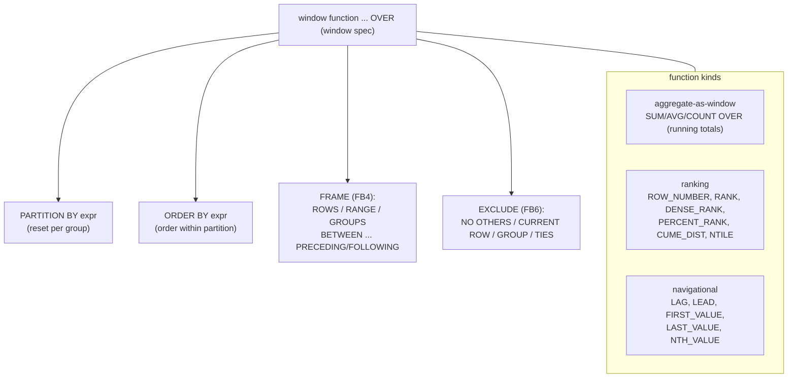

# Aggregate, Window and Analytical Functions

Analytics — "total sales per region", "each row's rank", "running balance", "the median" — is where SQL stops being a lookup language and becomes a computation language. This document describes Firebird 6's aggregate, window and analytical function support and how the engine executes it (the `recsrc` aggregated and windowed streams), grounded in the vendored source and demonstrated live, then compares the analytics surface with PostgreSQL, MySQL and SQLite.

It sits in the [reading guide](READING-GUIDE.md)'s Query-processing track alongside the [query optimizer document](query-optimizer-and-execution.md) (the record-source executor these functions run in) and complements the [numeric arithmetic document](numeric-and-precision-arithmetic.md) (the exact types aggregates accumulate into).

**Table of Contents**

* [Three ways to compute over groups](#three-ways-to-compute-over-groups)
* [Aggregate functions](#aggregate-functions)
* [Window functions](#window-functions)
* [Ordered-set and hypothetical-set aggregates](#ordered-set-and-hypothetical-set-aggregates)
* [How the engine executes them](#how-the-engine-executes-them)
* [Analytics in action (validated)](#analytics-in-action-validated)
* [Comparison: PostgreSQL, MySQL, SQLite](#comparison-postgresql-mysql-sqlite)
* [Discussion](#discussion)
* [Further research](#further-research)

## Three ways to compute over groups

SQL offers three related ways to compute across multiple rows, and Firebird supports all three:

- **Aggregate functions with `GROUP BY`** — collapse each group to one row (`SUM`, `COUNT`, `AVG`, `LISTAGG`, …).
- **Window functions with `OVER`** — compute across a set of rows but *keep every row* (ranking, running totals, `LAG`/`LEAD`). Per the SQL spec, a window function "is a kind of aggregation that does not filter the result set" (`README.window_functions.md`).
- **Ordered-set / hypothetical-set aggregates with `WITHIN GROUP`** — aggregates whose result depends on an ordering (`PERCENTILE_CONT`, `RANK … WITHIN GROUP`).

## Aggregate functions

Beyond the standard `COUNT`/`SUM`/`AVG`/`MIN`/`MAX`, Firebird provides a broad aggregate set:

- **String aggregation** — `LIST` (Firebird-specific) and the SQL-standard **`LISTAGG(expr, sep) WITHIN GROUP (ORDER BY …)`** ([`README.listagg`](https://github.com/FirebirdSQL/firebird/blob/master/doc/sql.extensions/README.listagg)) concatenate group values.
- **Statistical** — `STDDEV_POP`/`STDDEV_SAMP`, `VAR_POP`/`VAR_SAMP`, `CORR`, `COVAR_POP`/`COVAR_SAMP` (`README.statistical_functions.txt`).
- **Linear regression** — the `REGR_*` family (`REGR_SLOPE`, `REGR_INTERCEPT`, `REGR_R2`, …).
- **The `FILTER` clause** (Firebird 5, [`README.aggregate_filter.md`](https://github.com/FirebirdSQL/firebird/blob/master/doc/sql.extensions/README.aggregate_filter.md)) — `COUNT(*) FILTER (WHERE amount > 150)` aggregates only the matching rows, a clean shorthand for the old `SUM(CASE WHEN … THEN 1 ELSE 0 END)` idiom.
- **Custom aggregates** — user-defined aggregate functions via [UDR](extensibility.md) ([`README.custom_aggregate_functions.md`](https://github.com/FirebirdSQL/firebird/blob/master/doc/sql.extensions/README.custom_aggregate_functions.md)).

A notable gap: Firebird has **no `GROUP BY ROLLUP`/`CUBE`/`GROUPING SETS`** — the multi-level subtotal extensions — where PostgreSQL does. Subtotals must be assembled with `UNION ALL` or computed client-side.

## Window functions

Window functions are Firebird's most developed analytical feature, and they have grown across releases:



_Figure 1: A Firebird window specification — partition, order, frame (FB4) and frame exclusion (FB6) — with the three kinds of window function_

- **Aggregate-as-window** — any aggregate used with `OVER` (`SUM(amount) OVER (PARTITION BY region ORDER BY id)`), giving running totals. With `ORDER BY` and no explicit frame, the default frame is `RANGE BETWEEN UNBOUNDED PRECEDING AND CURRENT ROW`.
- **Ranking** — `ROW_NUMBER`, `RANK`, `DENSE_RANK`, `PERCENT_RANK`, `CUME_DIST`, `NTILE`.
- **Navigational** — `LAG`, `LEAD`, `FIRST_VALUE`, `LAST_VALUE`, `NTH_VALUE`.
- **Frames** (FB4) — `ROWS`/`RANGE`/`GROUPS` with `BETWEEN … PRECEDING/FOLLOWING/CURRENT ROW`, so a window can be a sliding N-row or value-range window, not just the whole partition.
- **Frame exclusion** (FB6) — `EXCLUDE {NO OTHERS | CURRENT ROW | GROUP | TIES}`, the SQL:2016 refinement for excluding peers.
- **Named windows** — a `WINDOW` clause defines a spec once and reuses it across several functions.

This is a complete, standard-conforming window-function implementation, on par with PostgreSQL.

## Ordered-set and hypothetical-set aggregates

Two SQL:2016 aggregate families depend on ordering the group:

- **Ordered-set aggregates** ([`README.percentile_disc_cont.md`](https://github.com/FirebirdSQL/firebird/blob/master/doc/sql.extensions/README.percentile_disc_cont.md)) — `PERCENTILE_CONT(f) WITHIN GROUP (ORDER BY expr)` (continuous, interpolated — `PERCENTILE_CONT(0.5)` is the median) and `PERCENTILE_DISC(f)` (discrete).
- **Hypothetical-set aggregates** ([`README.hypothetical_set_agg_functions.md`](https://github.com/FirebirdSQL/firebird/blob/master/doc/sql.extensions/README.hypothetical_set_agg_functions.md)) — `RANK`, `DENSE_RANK`, `PERCENT_RANK`, `CUME_DIST` used as `… WITHIN GROUP (ORDER BY expr)` to answer "what rank *would* this value have in the group". These are the same functions as the ranking window functions, but ordered within a *group* rather than a *window*.

Having both puts Firebird in the small club (with PostgreSQL) of engines with full SQL-standard ordered-set analytics — MySQL and SQLite have neither.

## How the engine executes them

Analytics map onto three of the [record-source operators](query-optimizer-and-execution.md#the-execution-engine-a-volcano-iterator-tree) in `src/jrd/recsrc/`:

- **`SortedStream`** — sorts the input; grouping and partitioning are done by *sorting on the group/partition keys* so equal keys are adjacent.
- **`AggregatedStream`** — consumes the sorted stream and collapses each group (`GROUP BY`).
- **`WindowedStream`** — consumes the sorted stream and computes window functions per partition/frame, emitting every row.

So both `GROUP BY` and `OVER` are, underneath, a **sort followed by a group-wise pass** — which is exactly what the query plans show: `PLAN SORT (SALES NATURAL)` for both an aggregate and a window query (verified live). The sort is the shared cost of analytics, and an index that already provides the required order can sometimes avoid it.

## Analytics in action (validated)

Real output from a live Firebird 6 server (a `sales` table, regions East/West). **Window functions** — ranking, a framed running total, and `LAG`:

```sql
SELECT region, amount,
       ROW_NUMBER() OVER (PARTITION BY region ORDER BY amount)  AS rn,
       RANK()       OVER (ORDER BY amount DESC)                 AS overall_rank,
       SUM(amount)  OVER (PARTITION BY region ORDER BY id
                          ROWS BETWEEN UNBOUNDED PRECEDING AND CURRENT ROW) AS running_total,
       LAG(amount)  OVER (PARTITION BY region ORDER BY id)      AS prev_amount
FROM sales;
```
```text
region amount  rn  overall_rank  running_total  prev_amount
East    100.00  1        6            100.00       <null>
East    200.00  3        4            300.00       100.00
East    150.00  2        5            450.00       200.00
West    300.00  2        2            300.00       <null>
West    250.00  1        3            550.00       300.00
West    400.00  3        1            950.00       250.00
```

**Aggregates** — `FILTER`, `LISTAGG`, and a statistical function:

```sql
SELECT region, count(*) AS n,
       count(*) FILTER (WHERE amount > 150)                 AS big_sales,
       LISTAGG(amount, ',') WITHIN GROUP (ORDER BY amount)  AS amounts,
       CAST(STDDEV_POP(amount) AS NUMERIC(10,2))            AS stddev
FROM sales GROUP BY region;
```
```text
region  n  big_sales  amounts                  stddev
East    3      1       100.00,150.00,200.00     40.82
West    3      3       250.00,300.00,400.00     62.36
```

**Ordered-set aggregate** — the median via `PERCENTILE_CONT`:

```sql
SELECT region, PERCENTILE_CONT(0.5) WITHIN GROUP (ORDER BY amount) AS median FROM sales GROUP BY region;
--   East 150.0   West 300.0
```

Every feature worked: per-partition `ROW_NUMBER`, cross-partition `RANK`, a `ROWS`-framed running total, `LAG` (null at each partition's first row), the FB5 `FILTER` clause, `LISTAGG` ordered concatenation, `STDDEV_POP`, and `PERCENTILE_CONT` medians — a full analytical toolkit.

## Comparison: PostgreSQL, MySQL, SQLite

| Feature | **Firebird** | **PostgreSQL** | **MySQL** | **SQLite** |
|---|---|---|---|---|
| Window functions | Yes | Yes | Yes (8.0+) | Yes (3.25+) |
| Window frames (ROWS/RANGE/GROUPS) | Yes (FB4) | Yes | ROWS/RANGE (no GROUPS) | Yes |
| Frame `EXCLUDE` | **Yes (FB6)** | Yes | No | Yes |
| Named windows (`WINDOW` clause) | Yes | Yes | Yes | Yes |
| `FILTER` clause | **Yes (FB5)** | Yes | No (use `CASE`) | Yes |
| Ordered-set (`PERCENTILE_*`) | **Yes** | Yes | No | No |
| Hypothetical-set (`RANK … WITHIN GROUP`) | **Yes** | Yes | No | No |
| String aggregation | `LIST` / `LISTAGG` | `string_agg` | `GROUP_CONCAT` | `group_concat` |
| Statistical / regression | `STDDEV`/`VAR`/`CORR`/`REGR_*` | Full | `STDDEV`/`VAR` (no `REGR_*`) | via extension |
| `ROLLUP`/`CUBE`/`GROUPING SETS` | **No** | **Yes** (all) | `WITH ROLLUP` only | No |
| Custom aggregates | UDR | `CREATE AGGREGATE` | No (UDF limited) | App-defined (C) |

## Discussion

**Firebird's analytics are much stronger than its low profile suggests — essentially matching PostgreSQL except for grouping sets.** Full window functions with FB4 frames and FB6 frame exclusion, the `FILTER` clause, `LISTAGG`, statistical and regression aggregates, and — the discriminator — **ordered-set and hypothetical-set aggregates** (`PERCENTILE_CONT`, `RANK … WITHIN GROUP`) put Firebird in the top tier of SQL analytics. Only PostgreSQL matches that full set among the four, and the one place PostgreSQL pulls ahead is `ROLLUP`/`CUBE`/`GROUPING SETS`, which Firebird lacks. For reporting and analytical workloads, Firebird is far more capable than its reputation as a lightweight OLTP engine implies.

**MySQL and SQLite have window functions but stop short of the standard's analytical aggregates.** Both added window functions relatively recently (MySQL 8.0, SQLite 3.25) and cover the common cases — ranking, navigation, frames — well. SQLite is notably complete for such a tiny engine (frames, `EXCLUDE`, named windows, `FILTER`), which fits its "small but correct" ethos. But neither has ordered-set (`PERCENTILE_*`) or hypothetical-set aggregates, so computing a median or a percentile requires manual workarounds. MySQL also lacks the `FILTER` clause (the `CASE` idiom stands in). These are the SQL:2016 analytical features that separate the OLTP-plus-basic-reporting engines from the full analytical ones.

**Under the hood, analytics is "sort then scan", uniformly.** All four compute grouping and windowing by ordering rows so group members are adjacent, then making a group-wise pass — Firebird's `SortedStream` → `AggregatedStream`/`WindowedStream` is a textbook instance, and its plans expose it (`SORT (… NATURAL)`). This is why an appropriate index (providing the sort order for free) or adequate sort memory ([`TempCacheLimit`, `InlineSortThreshold`](monitoring-and-tuning.md#firebird-performance-tuning-knobs)) matters so much for analytical query performance, and why the [optimizer](query-optimizer-and-execution.md)'s sort avoidance is a key lever. The feature surface differs across the four, but the execution shape is the same everywhere.

## Further research

**Firebird**

- [`doc/sql.extensions/README.window_functions.md`](https://github.com/FirebirdSQL/firebird/blob/master/doc/sql.extensions/README.window_functions.md) — the complete window-function reference (partitions, frames, exclusions, named windows); [`README.aggregate_filter.md`](https://github.com/FirebirdSQL/firebird/blob/master/doc/sql.extensions/README.aggregate_filter.md), [`README.listagg`](https://github.com/FirebirdSQL/firebird/blob/master/doc/sql.extensions/README.listagg), [`README.percentile_disc_cont.md`](https://github.com/FirebirdSQL/firebird/blob/master/doc/sql.extensions/README.percentile_disc_cont.md), [`README.hypothetical_set_agg_functions.md`](https://github.com/FirebirdSQL/firebird/blob/master/doc/sql.extensions/README.hypothetical_set_agg_functions.md), [`README.custom_aggregate_functions.md`](https://github.com/FirebirdSQL/firebird/blob/master/doc/sql.extensions/README.custom_aggregate_functions.md).
- [`src/jrd/recsrc/`](https://github.com/FirebirdSQL/firebird/tree/master/src/jrd/recsrc) — `AggregatedStream`, `WindowedStream`, `SortedStream`; and the [query optimizer document](query-optimizer-and-execution.md) for the executor context.

**PostgreSQL, MySQL, SQLite**

- PostgreSQL: [Window functions](https://www.postgresql.org/docs/current/functions-window.html) (+ [tutorial](https://www.postgresql.org/docs/current/tutorial-window.html)), [Aggregate functions](https://www.postgresql.org/docs/current/functions-aggregate.html), [GROUPING SETS/CUBE/ROLLUP](https://www.postgresql.org/docs/current/queries-table-expressions.html#QUERIES-GROUPING-SETS).
- MySQL: [Window functions](https://dev.mysql.com/doc/refman/8.4/en/window-functions.html), [Aggregate functions](https://dev.mysql.com/doc/refman/8.4/en/aggregate-functions.html), [GROUP BY modifiers (WITH ROLLUP)](https://dev.mysql.com/doc/refman/8.4/en/group-by-modifiers.html); MariaDB's [window functions](https://mariadb.com/kb/en/window-functions/).
- SQLite: [Window functions](https://sqlite.org/windowfunctions.html), [Aggregate functions](https://sqlite.org/lang_aggfunc.html).

**Standards**

- [Window function (SQL)](https://en.wikipedia.org/wiki/Window_function_(SQL)) — the SQL:2003/2011/2016 analytical features all four build on.
