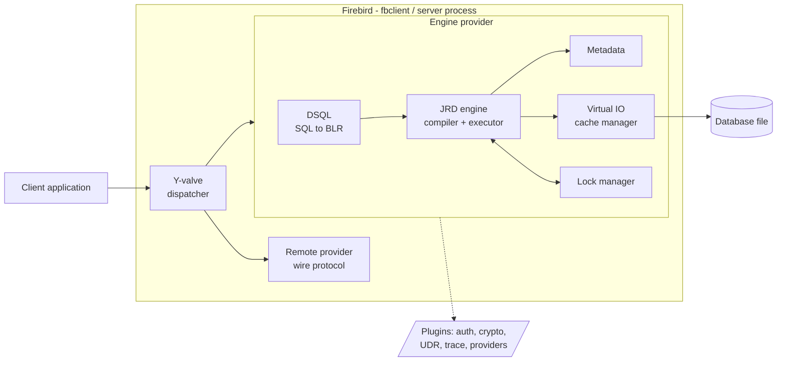
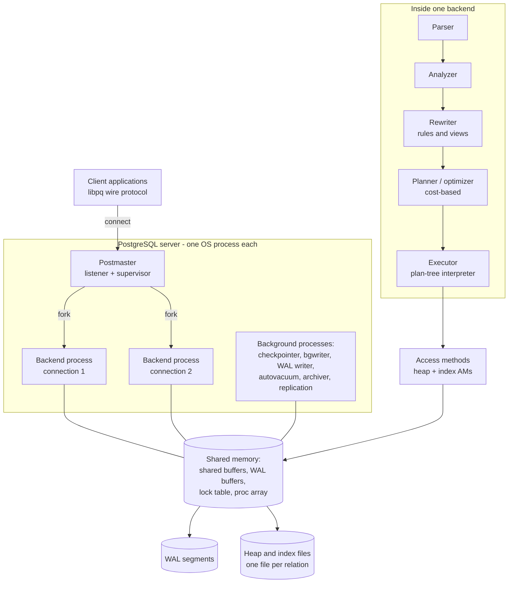
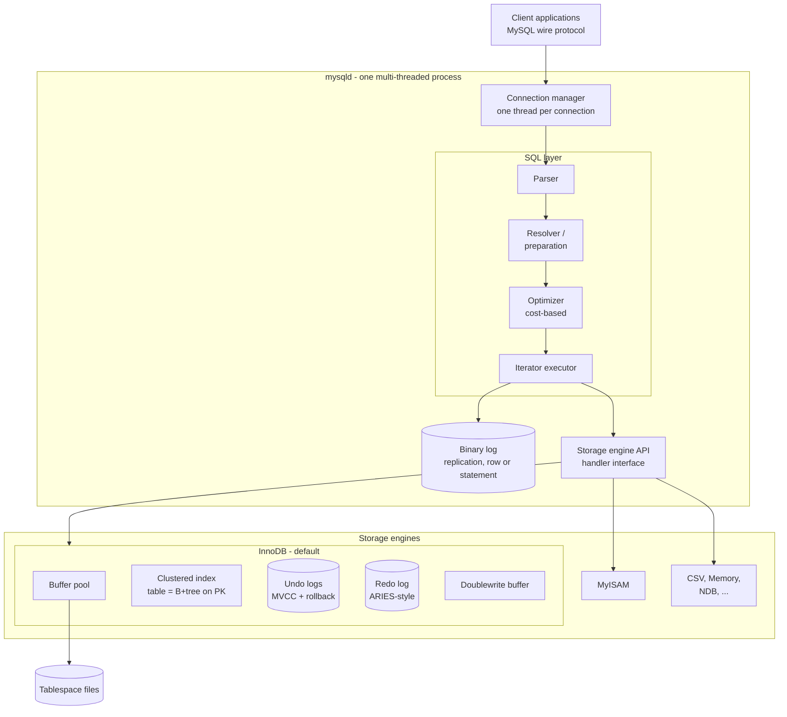
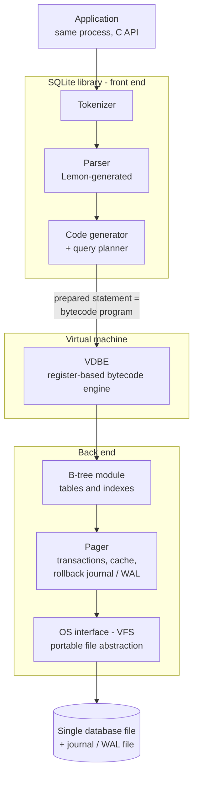

# Architecture Comparison: Firebird, PostgreSQL, MySQL and SQLite

This companion document to [Conceptual Architecture for Firebird](README.md) places Firebird's architecture side by side with three other widely used open-source relational database systems: PostgreSQL, MySQL and SQLite. The goal is the same as in the main paper — a *conceptual* view, concerned with major components, their interactions and the architectural styles they embody, rather than with feature lists or benchmarks.

To keep the comparison honest, each system is described along the same five axes:

1. **Deployment and process model** — how the DBMS runs: server processes, threads, or an in-process library.
2. **Query pipeline** — how SQL text becomes an executable request, and what intermediate representation is used.
3. **Transactions and concurrency** — how isolation is achieved: multi-versioning, locking, or both.
4. **Storage and durability** — how data reaches the disk and how the system survives a crash.
5. **Extensibility** — where the architecture allows new behaviour to be plugged in.

**Table of Contents**

* [Firebird (recap)](#firebird-recap)
* [PostgreSQL](#postgresql)
* [MySQL](#mysql)
* [SQLite](#sqlite)
* [Side-by-side comparison](#side-by-side-comparison)
* [Discussion: what the contrasts illuminate](#discussion-what-the-contrasts-illuminate)
* [Further research: repositories, papers and videos](#further-research-repositories-papers-and-videos)

## Firebird (recap)

Firebird ([repository](https://github.com/FirebirdSQL/firebird)) descends from InterBase (1984) and is analysed in depth in the [main paper](README.md). Only the essentials needed for comparison are repeated here.

_Figure 1: Firebird 3+ conceptual architecture (condensed from the main paper)_

- **Deployment.** One engine library serves every mode. The **Y-valve** dispatcher routes an attach call to a provider: `Remote` (network client), `Engine` (embedded, in-process) or `Loopback`. The `ServerMode` setting selects, at run time, one process with a shared page cache (**Super**), one process with private caches (**SuperClassic**) or a process per connection (**Classic**). Any application linking `fbclient` is therefore also a complete embedded server.
- **Query pipeline.** DSQL translates SQL into **BLR** (Binary Language Representation), a tree-structured request language; the JRD compiler (CMP) turns BLR into an executable request tree, and since Firebird 5 compiled statements are cached and shared per attachment.
- **Concurrency.** The **multi-generational architecture (MGA)**: an update creates a new record version and keeps the older version as a *delta* chained behind the newest one, usually on the same data page. Transaction states live in Transaction Inventory Pages inside the database itself; snapshots since Firebird 4 are captured by commit order. Garbage collection of dead versions is *cooperative* (any reader that stumbles on garbage may clean it) and/or performed by a dedicated thread and by `sweep`.
- **Durability.** Historically Firebird's most distinctive trait: there is **no write-ahead log**. Consistency after a crash is guaranteed by **careful write ordering** — pages are written in an order such that the on-disk state is always consistent; an aborted transaction is simply left for version garbage collection. Firebird 4 added an optional journal, but only as the transport for built-in logical **replication**.
- **Extensibility.** Plugin architecture (authentication, wire and database encryption, UDR external routines, trace, providers) plus the provider chain of the Y-valve itself.

## PostgreSQL

PostgreSQL ([repository](https://github.com/postgres/postgres)) descends from the Berkeley POSTGRES research project (1986, Michael Stonebraker); the SQL version has been developed as a community project since 1996. Its architecture is the canonical example of the **process-per-connection** server described in [Hellerstein, Stonebraker and Hamilton's *Architecture of a Database System*](https://dsf.berkeley.edu/papers/fntdb07-architecture.pdf).

_Figure 2: PostgreSQL process and query architecture_

**Deployment and process model.** A supervisor process (the *postmaster*) listens for connections and **forks one backend process per connection**; backends cooperate through a large shared-memory segment holding the buffer pool ("shared buffers"), WAL buffers and lock tables. A fleet of long-lived background processes — checkpointer, background writer, WAL writer, autovacuum launcher and workers, archiver, replication walsenders/walreceiver — performs maintenance asynchronously. Since 9.6, individual queries can also fan out to parallel worker processes. The process-per-connection model isolates failures well but makes connections expensive, which is why production deployments almost always add an external connection pooler (PgBouncer, pgpool). Compare Firebird, where the same decision — processes versus shared cache — is a *runtime configuration choice* (`ServerMode`) over one binary.

**Query pipeline.** SQL passes through a five-stage pipeline inside the backend: **parser** (grammar only) → **analyzer** (semantic analysis against the catalogs) → **rewriter** (applies the rule system; views are rewritten here) → **planner/optimizer** (cost-based, System-R style dynamic programming, switching to a genetic algorithm for very large join problems) → **executor**, which interprets the plan tree in the classic Volcano pull/iterator style. The intermediate representation is a *plan tree of typed nodes*, never serialized to an external format — unlike Firebird's BLR, which is a stable, externally visible language (procedures are stored as BLR). The official [flow-of-a-query overview](https://www.postgresql.org/developer/backend/) and the [backend flowchart](https://wiki.postgresql.org/wiki/Backend_flowchart) map these stages directly onto source directories.

**Transactions and concurrency.** PostgreSQL is, with Firebird/InterBase, one of the two main lineages of **no-undo multi-versioning**. An `UPDATE` writes a *complete new tuple* into the heap and leaves the old one in place; visibility is decided per tuple from `xmin`/`xmax` transaction IDs checked against the transaction status log (*clog*) and the snapshot. Dead tuples are reclaimed by **VACUUM** (normally the autovacuum workers). Contrast the Firebird design: back versions are *deltas* chained from the newest version, so an updated row usually stays on its page and garbage collection is cooperative, while PostgreSQL pays with table bloat and a periodic vacuum debt but gets simpler tuple-at-a-time processing and index-only optimizations. Neither system uses an undo log — the third design, undo-based MVCC, is InnoDB's (below). Locking exists at row level for writes (recorded in tuple headers) with a separate in-memory lock manager for objects and predicate locks for SERIALIZABLE (SSI — PostgreSQL implements true serializability via *Serializable Snapshot Isolation*, a published research result).

**Storage and durability.** Each table and index is a file (segmented at 1 GB) of fixed-size pages managed through shared buffers. Durability is classic **ARIES-style write-ahead logging**: every page modification is WAL-logged first; checkpoints bound recovery time; the same WAL stream drives physical replication (streaming replication, hot standby) and point-in-time recovery. This is the sharpest single contrast with Firebird, which achieves crash safety with *no log at all* through careful write ordering — PostgreSQL buys faster bulk writes, physical replication and PITR at the price of WAL volume, checkpoints and `full_page_writes`.

**Extensibility.** PostgreSQL is arguably the most extensible of the four: `CREATE EXTENSION` packages (PostGIS being the flagship), user-defined types, operators and functions in many languages, **index access methods** as first-class extensions (GiST, GIN, SP-GiST, BRIN and out-of-tree ones), **foreign data wrappers** to query external systems, custom background workers, logical decoding plugins, and since v12 pluggable **table access methods** (the hook the OrioleDB and Citus columnar engines use). Where Firebird exposes extension points as loadable *plugins around a single engine* (auth, crypto, UDR), PostgreSQL lets extensions reach *inside* the engine, including the storage layer — the closest analogue to MySQL's storage-engine API, but grafted onto a single-engine design.

## MySQL

MySQL ([repository](https://github.com/mysql/mysql-server)) was created in 1995 by Michael "Monty" Widenius and David Axmark and is now developed by Oracle (with MariaDB as a prominent community fork). Its defining architectural idea is the split between a **SQL server layer** and **pluggable storage engines** underneath a handler API.

_Figure 3: MySQL server layer over pluggable storage engines_

**Deployment and process model.** A single multi-threaded process, `mysqld`, with **one thread per connection** (a thread-pool plugin exists in enterprise/Percona builds). This sits between PostgreSQL's process-per-connection and Firebird SuperServer's threads-in-one-process — MySQL took the threaded path earliest and most completely of the classic client-server systems.

**Query pipeline.** Parser → resolver/preparation → cost-based **optimizer** → executor. Historically the executor was a bespoke nested-loop machine; MySQL 8.0 rebuilt it as a clean Volcano-style **iterator executor** and added hash joins, making the pipeline much closer to the textbook (and PostgreSQL) design. There is no stable external IR comparable to BLR — prepared statements cache parse trees internally. The [MySQL source documentation (Doxygen)](https://dev.mysql.com/doc/dev/mysql-server/latest/) documents these stages directly from the source.

**Transactions and concurrency.** Concurrency is delegated to the storage engine, and the engine that matters is **InnoDB**. InnoDB implements the *third* MVCC design of this comparison: **undo-based multi-versioning**. The newest row version lives in the clustered index; older versions are *reconstructed on demand* by walking rollback segments (undo logs). Readers get consistent snapshots without blocking; writers take row locks, and InnoDB adds **gap/next-key locks** at REPEATABLE READ to block phantoms — a locking flavour absent from Firebird and PostgreSQL, which are pure snapshot systems at that level. Rollback is cheap to decide but must physically undo changes; long-running transactions hold back purge of undo history (the counterpart of Firebird's "oldest interesting transaction" and PostgreSQL's vacuum horizon — every MVCC system has this failure mode, each in its own dialect).

**Storage and durability.** An InnoDB table *is* a B+tree: rows are stored in the leaves of the clustered index on the primary key, and secondary indexes point at primary-key values, not physical addresses (Jeremy Cole's [InnoDB internals series](https://blog.jcole.us/innodb/) dissects the on-disk format page by page). Durability is ARIES-style **redo logging** through the buffer pool, hardened by the doublewrite buffer against torn pages. Uniquely among the four, MySQL keeps **two logs**: InnoDB's redo log and the server-layer **binary log** that drives replication, coordinated by an internal two-phase commit on every transaction — a direct architectural cost of the engine/server split. Replication (asynchronous, semi-synchronous, or Group Replication) is logical, from the binlog, which is why it predates every other system here in ubiquity.

**Extensibility.** The signature mechanism is the **storage engine API** itself — MyISAM, Memory, CSV, NDB Cluster, and historically third-party engines (InnoDB itself was one before Oracle acquired both). In practice the ecosystem has consolidated on InnoDB, and MySQL 8.0 deepened the dependency by moving the data dictionary out of `.frm` files into transactional InnoDB tables. Beyond engines there are plugin interfaces for authentication, the optimizer's cost model, replication, and loadable components/UDFs. Compared with Firebird: both are "one server, pluggable parts", but MySQL modularized the *storage layer* while Firebird modularized the *access path to one storage engine* (providers, auth, crypto).

## SQLite

SQLite ([repository mirror](https://github.com/sqlite/sqlite); canonical source is [sqlite.org](https://sqlite.org/)) was created by D. Richard Hipp in 2000. It is not a client-server system at all: it is an **in-process library** whose "server" is a single database file, and it is probably the most widely deployed database engine in existence (every browser, phone and countless embedded devices). Its [official architecture document](https://sqlite.org/arch.html) describes the structure the diagram below follows.

_Figure 4: SQLite layered architecture (after sqlite.org/arch.html)_

**Deployment and process model.** There is no server, no processes, no threads of its own, no configuration: the library runs inside the application's process and the database is **one ordinary file** whose format is stable, documented and portable across architectures ([recommended by the US Library of Congress as an archival format](https://sqlite.org/locrsf.html)). Concurrency control therefore happens through **file locks** negotiated via the OS. This is the pure form of the embedded model that Firebird also offers — but with a crucial difference: Firebird's embedded mode loads a *full multi-writer MVCC server engine* into the process (and the same file can be served over the network by switching connection string), whereas SQLite deliberately trades multi-writer concurrency for radical simplicity.

**Query pipeline.** Tokenizer → parser (generated by Lemon, SQLite's own parser generator) → **code generator with query planner**, which emits a program for the **VDBE** (Virtual DataBase Engine), a register-based bytecode virtual machine. A prepared statement *is* a bytecode program (inspect it with `EXPLAIN`; see the [VDBE](https://sqlite.org/vdbe.html) and [opcode](https://sqlite.org/opcode.html) documents). Among the four systems this is the most compiler-like pipeline, and it makes an illuminating pair with Firebird: **both lower SQL into a stable intermediate language** (tree-structured BLR interpreted over a request tree; linear bytecode executed on a VM) where PostgreSQL and MySQL execute in-memory plan trees directly.

**Transactions and concurrency.** SQLite is the only system here whose baseline is **locking, not MVCC**: transactions are serialized by whole-database file locks, allowing many readers or one writer. In **WAL mode** ([write-ahead log](https://sqlite.org/wal.html)) readers get snapshot isolation against the WAL while a single writer appends — two version states, as opposed to the unbounded version chains of the MVCC systems. The [locking and rollback-journal protocol](https://sqlite.org/lockingv3.html) is documented to the byte. For its target — one application owning its data file — the single-writer constraint is usually irrelevant, and the payoff is an engine (~150 K lines) small enough to be tested to aviation-grade coverage ([how SQLite is tested](https://sqlite.org/testing.html), 100% MC/DC).

**Storage and durability.** The B-tree module stores both tables and indexes in one file (tables as B+trees keyed by rowid, indexes as B-trees); the **pager** provides atomic commit and crash recovery through either the rollback journal (undo-style: save old pages, roll back on crash) or the WAL (redo-style: append new pages, checkpoint back). The **VFS** layer isolates every OS dependency and is itself a plugin point — the mechanism behind encrypted VFSes and the in-browser WASM builds.

**Extensibility.** Run-time loadable extensions: application-defined SQL functions, collations, **virtual tables** (the analogue of PostgreSQL's foreign data wrappers — full-text search FTS5, the JSON functions and R-tree module are virtual tables), and custom VFSes. What it deliberately does not have: user management, wire protocol, stored procedures — [an explicit philosophy of doing less](https://sqlite.org/whentouse.html).

## Side-by-side comparison

| Axis | **Firebird** | **PostgreSQL** | **MySQL (InnoDB)** | **SQLite** |
|---|---|---|---|---|
| Lineage / first release | InterBase 1984 → Firebird 2000 | POSTGRES 1986 → PostgreSQL 1996 | 1995 | 2000 |
| Deployment model | Client-server **and** embedded, same engine (Y-valve providers) | Client-server only | Client-server only | Embedded only |
| Process model | Configurable at runtime: threads + shared cache, or process per connection (`ServerMode`) | Process per connection + background processes, shared memory | One process, thread per connection | Runs in the application's process |
| SQL intermediate form | **BLR** — stable, stored tree language | In-memory plan tree of nodes | In-memory plan; iterator executor (8.0+) | **VDBE bytecode** — register-based VM program |
| Optimizer | Cost-based; nested-loop + hash joins (FB5) | Cost-based, System-R style; GEQO for large joins; parallel query | Cost-based; hash joins since 8.0 | Simpler cost-based planner (NGQP) |
| Concurrency mechanism | **MVCC, no undo log**: delta back-versions chained in-page (MGA); commit-order snapshots (FB4+) | **MVCC, no undo log**: full new tuples in heap; snapshots + SSI serializability | **MVCC with undo log**: newest row in clustered index, old versions rebuilt from rollback segments; gap locks | **Locking**: single writer; WAL mode adds snapshot reads |
| Version cleanup | Cooperative + background GC, sweep; "oldest interesting transaction" horizon | VACUUM / autovacuum; xmin horizon | Purge of undo history; long transactions block purge | None needed (WAL checkpoint) |
| Crash recovery | **Careful write ordering — no log** | Write-ahead log (ARIES-style redo) | Redo log + doublewrite **+ binlog** (internal 2PC) | Rollback journal (undo) or WAL (redo) |
| Table storage | Record versions on data pages; indexes point to record numbers | Heap files; indexes point to tuple TIDs | Table **is** the clustered B+tree on the PK; secondary indexes hold PK values | B+trees in one file, keyed by rowid / PK |
| Replication | Built-in logical, commit-order journal (FB4+) | Physical (WAL streaming) + logical decoding | Logical from binlog; async / semi-sync / Group Replication | None (file copy; third-party: Litestream etc.) |
| Extensibility focus | Plugins: auth, encryption, UDR, trace, providers | Extensions reaching inside the engine: types, index & table AMs, FDWs, languages | Pluggable **storage engines**; auth/replication plugins, components | Loadable extensions: functions, virtual tables, VFS |
| Typical niche | Embedded-to-midrange client-server, zero-admin deployments | General-purpose server, extensibility platform | Web/OLTP workloads, replication-heavy fleets | Application file format, edge/embedded |
| License | IDPL / IPL (MPL-family) | PostgreSQL License (BSD-like) | GPLv2 / commercial | Public domain |

## Discussion: what the contrasts illuminate

**Four answers to "where do old row versions live?"** The single most instructive comparison is MVCC design space, of which these systems cover essentially all of it: Firebird chains *deltas* behind the newest version in place; PostgreSQL writes *whole new tuples* beside the old ones and vacuums later; InnoDB keeps only the newest version in place and *reconstructs* old ones from undo logs; SQLite skips row versioning entirely and versions *the whole database* (two states, main file vs WAL). Every subsequent trade-off — vacuum debt, undo purge lag, sweep, gap locks — follows from that one decision.

**Logging is a choice, not a law.** Textbook architecture (ARIES) says a database needs a write-ahead log. PostgreSQL and InnoDB follow the textbook; SQLite offers both undo-style and redo-style journaling; Firebird demonstrates a fourth way — careful write ordering with no log at all, with MVCC absorbing the role of undo. The cost surfaces elsewhere: Firebird had to *add* a journal in version 4 when it wanted built-in replication, because a log is also a change stream, which is exactly why MySQL's binlog made it the replication workhorse of the web era.

**The embedded/server axis is not binary.** SQLite and PostgreSQL sit at the poles (pure library vs pure server); MySQL is a pure server with a modular storage basement; Firebird is the unusual middle case — one engine that is *simultaneously* an embeddable library and a network server, selected per connection string by the Y-valve. The paper's original observation that Firebird's top level is a pipe-and-filter over stable subsystems is what makes that duality cheap: the pipeline doesn't care which provider feeds it.

**Where the plugin seam is placed defines the ecosystem.** MySQL put the seam under the SQL layer (storage engines) and got a marketplace of engines that ultimately consolidated on one. PostgreSQL put many small seams everywhere (types, AMs, FDWs) and got the richest extension ecosystem. Firebird put the seam around the engine (providers, auth, crypto, UDR) preserving a single storage core. SQLite put it at the file-system boundary (VFS) and at virtual tables. Same architectural instinct — isolate variation — four different placements, four different ecosystems.

## Further research: repositories, papers and videos

### Source repositories

* Firebird — <https://github.com/FirebirdSQL/firebird> (also vendored here as the [`extern/firebird`](extern/firebird) submodule)
* PostgreSQL — <https://github.com/postgres/postgres> (mirror of the canonical git repository)
* MySQL Server — <https://github.com/mysql/mysql-server>
* SQLite — <https://github.com/sqlite/sqlite> (official mirror; canonical repository is Fossil at [sqlite.org/src](https://sqlite.org/src/doc/trunk/README.md))

### Papers and books

* Hellerstein, Stonebraker, Hamilton — [Architecture of a Database System](https://dsf.berkeley.edu/papers/fntdb07-architecture.pdf) (*Foundations and Trends in Databases*, 2007). The standard survey of exactly the territory this comparison covers: process models, query processing, storage, transactions.
* Hellerstein, Stonebraker (eds.) — [Readings in Database Systems ("the Red Book")](http://www.redbook.io/), 5th edition.
* Hironobu Suzuki — [The Internals of PostgreSQL](https://www.interdb.jp/pg/) — free, book-length, chapter-per-subsystem; the best single companion to Figure 2.
* Bruce Momjian — [PostgreSQL Internals Through Pictures](https://www.postgresql.org/files/developer/internalpics.pdf) (slides) and his other [internals presentations](https://momjian.us/main/presentations/internals.html).
* Jeremy Cole — [InnoDB internals blog series](https://blog.jcole.us/innodb/) ("InnoDB: A journey to the core") — page-level dissection of InnoDB's on-disk structures.
* SQLite official documents — [Architecture](https://sqlite.org/arch.html), [VDBE](https://sqlite.org/vdbe.html), [WAL](https://sqlite.org/wal.html), [Locking and concurrency](https://sqlite.org/lockingv3.html), [How SQLite works](https://sqlite.org/howitworks.html), [Testing](https://sqlite.org/testing.html).
* MySQL reference — [InnoDB architecture](https://dev.mysql.com/doc/refman/8.4/en/innodb-architecture.html) (with the official architecture diagram), [pluggable storage engine overview](https://dev.mysql.com/doc/refman/8.4/en/pluggable-storage-overview.html), and the [source-code Doxygen documentation](https://dev.mysql.com/doc/dev/mysql-server/latest/).
* PostgreSQL reference — [architecture chapter of the tutorial](https://www.postgresql.org/docs/current/tutorial-arch.html), [the path of a query](https://www.postgresql.org/developer/backend/), [backend flowchart](https://wiki.postgresql.org/wiki/Backend_flowchart).
* Firebird — the release-notes and in-tree architecture documents already collected in the [main paper's references](README.md#references).
* Database of Databases (CMU) — structured architectural fact sheets for [Firebird](https://dbdb.io/db/firebird), [PostgreSQL](https://dbdb.io/db/postgresql), [MySQL](https://dbdb.io/db/mysql), [SQLite](https://dbdb.io/db/sqlite).

### Videos and courses

* D. Richard Hipp — [SQLite (CMU Databaseology Lectures, 2015)](https://www.youtube.com/watch?v=gpxnbly9bz4) ([event page](https://db.cs.cmu.edu/events/databaseology-2015-richard-hipp-sqlite/)) — the creator walking through the architecture of Figure 4. See also the [CoRecursive podcast episode on SQLite's history](https://corecursive.com/066-sqlite-with-richard-hipp/).
* Bruce Momjian — [PostgreSQL Internals Through Pictures (PGConf SV 2015)](https://www.youtube.com/watch?v=JFh22atXTRQ) — shared memory, processes, and the life of a query.
* Dmitry Yemanov — [Firebird 3: Initial Review (Firebird Conference 2012)](https://www.youtube.com/watch?v=qmHstvyOrp4) — the unified-server / providers redesign, by Firebird's lead developer; and [Firebird on the road from v4 to v5 (2019)](https://www.youtube.com/watch?v=4NDGpwCTlEs).
* Percona — [InnoDB Architecture and Performance Optimization for MySQL 8.0](https://learn.percona.com/innodb-architecture-and-performance-optimization-for-mysql-8-0) (tutorial recording).
* CMU 15-445/645 *Database Systems* — [course site](https://15445.courses.cs.cmu.edu/) and the [CMU Database Group YouTube channel](https://www.youtube.com/@CMUDatabaseGroup) — full lecture series covering every mechanism in the table above (buffer pools, MVCC flavours, logging schemes, query execution), with these four systems as recurring case studies.
