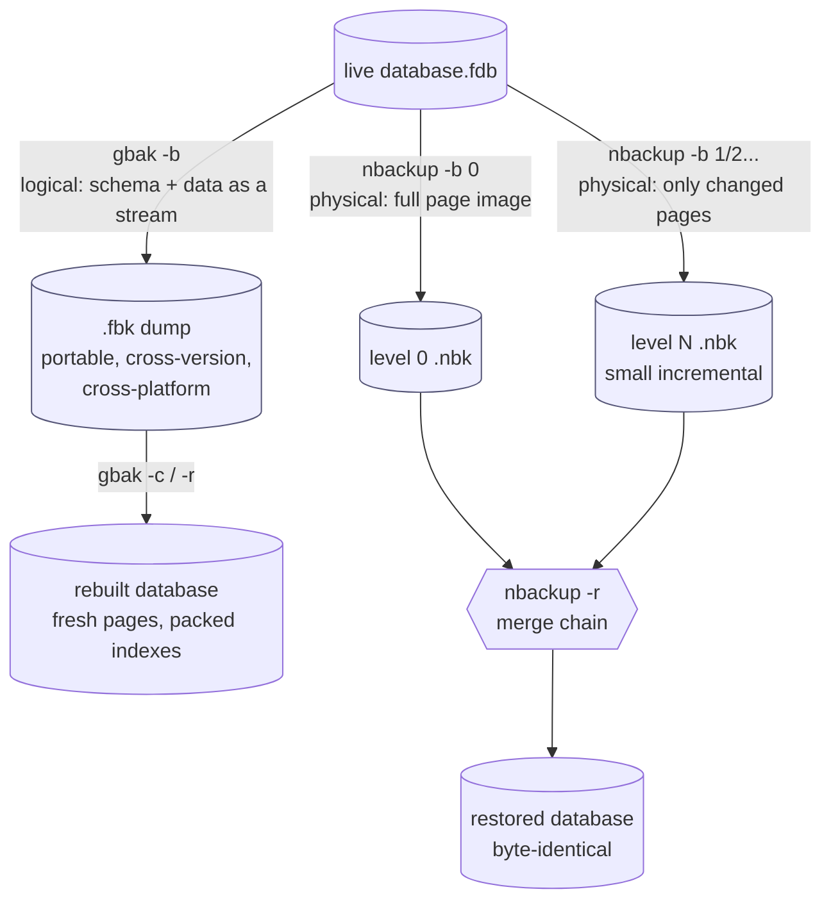
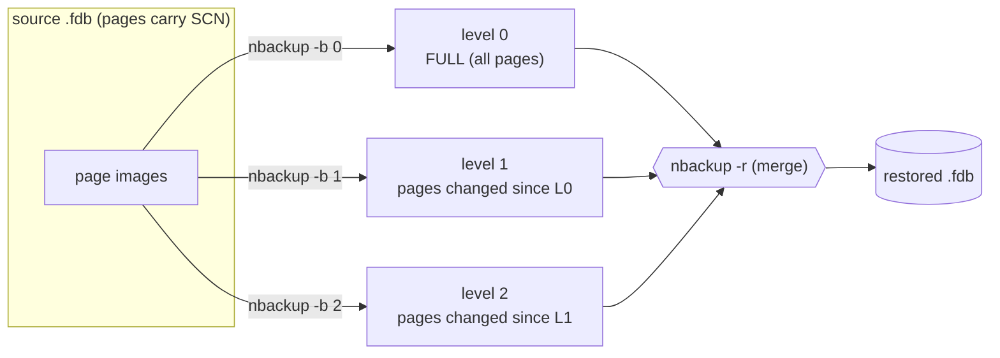

# Backup and Recovery Architecture

Backup and recovery answer two different questions. **Backup** is deliberate: how do you make a copy you can restore from — logically (a portable dump of schema and data) or physically (a copy of the bytes on disk), fully or incrementally, and can you do it while the database is live? **Recovery** is what happens after a crash or a corruption: does the engine come back consistent on its own, and what tools repair or rebuild it when it does not. This document describes both for Firebird 6 — grounded in the vendored source (`doc/README.gbak`, `doc/README.online_validation`, `src/jrd/ods.h`) and verified with a live server — and compares them with PostgreSQL, MySQL and SQLite.

It is a companion to the [main paper](README.md) and the other comparison documents, and leans on two in particular: the [on-disk-structure document](on-disk-structure.md) explains why Firebird recovers without a write-ahead log, and the [replication document](replication-architecture.md) covers the journal/replica path that doubles as disaster recovery (and how `nbackup` seeds a replica).

**Table of Contents**

* [Two axes: logical vs physical, full vs incremental](#two-axes-logical-vs-physical-full-vs-incremental)
* [gbak: logical backup](#gbak-logical-backup)
* [nbackup: physical incremental backup](#nbackup-physical-incremental-backup)
* [Crash recovery: consistency without a log](#crash-recovery-consistency-without-a-log)
* [Validation and repair](#validation-and-repair)
* [Shadows and the replica path](#shadows-and-the-replica-path)
* [Backup/recovery workflow (validated walk-through)](#backuprecovery-workflow-validated-walk-through)
* [Comparison: PostgreSQL, MySQL, SQLite](#comparison-postgresql-mysql-sqlite)
* [Discussion](#discussion)
* [Further research](#further-research)

## Two axes: logical vs physical, full vs incremental

_Figure 1: Firebird's two backup tools — `gbak` (logical, portable, rebuilding) and `nbackup` (physical, incremental, byte-exact)_

The two tools are complementary: `gbak` produces a small, portable, *rebuilding* backup (the restore lays out fresh pages and repacks indexes — it also defragments and migrates across ODS versions); `nbackup` produces a fast, physical, *incremental* backup (only the pages that changed since the last level), ideal for large databases where a full logical dump is too slow to run often.

## gbak: logical backup

`gbak` reads the whole database through a normal connection and writes a transportable backup file (`.fbk`) containing the metadata and data as a logical stream; `gbak -c` (create) or `-r` (replace) rebuilds a database from it. Key architectural properties:

- **Online.** It backs up a live database by running in a snapshot (consistency) transaction, so it captures a coherent point-in-time image without blocking users.
- **Portable and rebuilding.** The restore recreates every page from scratch, so it **defragments** data, **rebuilds indexes**, reclaims dead-version space, and can move a database **across platforms and across a major ODS change** (the supported migration path — see the [on-disk-structure ODS table](on-disk-structure.md#ods-versions)). This makes a periodic gbak backup/restore cycle a genuine health measure, not just a copy.
- **Selective** (Firebird 4+): `-SKIP_DATA` / `-INCLUDE_DATA` patterns back up structure without (or with only some) table data.
- **Parallel** (Firebird 5): `-PARALLEL N` reads on backup and loads on restore with multiple worker threads sharing one snapshot; restore can also build indexes in parallel (`doc/README.gbak`).

Verified live on Firebird 6: `gbak -b src.fdb dump.fbk` then `gbak -c dump.fbk restored.fdb` reproduced all rows in the rebuilt database, from a 3 KB `.fbk`.

## nbackup: physical incremental backup

`nbackup` copies the database at the **page level** and supports a **multi-level incremental** scheme built on the header's difference-file mechanism. Each backup level records only the pages whose SCN (system change number, in every page header — see [on-disk structure](on-disk-structure.md#the-big-picture-one-file-many-pages)) changed since the previous level:

_Figure 2: `nbackup` incremental levels — each level captures only pages changed since the previous, restored by merging the chain in order_

Under the hood, `nbackup -b` (or `ALTER DATABASE BEGIN BACKUP`) briefly puts the main file into a **stalled** state and diverts new writes to a **difference (delta) file**, so the main file is frozen and safe to copy; `END BACKUP` merges the delta back. The header records this with `hdr_backup_mode` (`hdr_nbak_normal` / `hdr_nbak_stalled` / `hdr_nbak_merge`, from `ods.h`). Restore merges a level-0 image with each successive incremental in order.

Verified live: a level-0 backup of a database was ~2.5 MB (full), a level-1 incremental after inserting one row was only ~131 KB (just the changed pages), and `nbackup -r` merging level 0 + level 1 produced a restored database with all three rows — the incremental captured exactly the delta.

## Crash recovery: consistency without a log

This is where Firebird differs most sharply from the WAL-based engines. Firebird keeps **no write-ahead log**; instead it uses **careful write ordering** — the engine flushes pages in an order that guarantees the on-disk file is *always* in a consistent state, so there is no "replay the log to reach consistency" step (see the [on-disk-structure discussion](on-disk-structure.md#advantages-of-the-firebird-on-disk-structure)). What "recovery" means for Firebird is therefore narrower and cheaper:

- **Automatic on attach.** After a crash the file is already structurally consistent. Uncommitted work from the crashed session is simply invisible — its record versions carry a transaction id whose TIP state is not "committed", so the multi-generational visibility rules skip it, and the space is reclaimed later by garbage collection / sweep. There is no recovery phase to wait through.
- **Limbo (two-phase) transactions.** The one case needing attention is a distributed transaction that crashed between prepare and commit. `gfix -list` shows limbo transactions and `gfix -commit` / `-rollback` (or automatic recovery) resolves them.
- **Durability tuning.** `Forced Writes` (the `hdr_force_write` flag) makes commits flush synchronously; turning it off trades crash-durability for speed. `MaxUnflushedWrites` bounds how much can be buffered (see the [tuning document](monitoring-and-tuning.md#firebird-performance-tuning-knobs)).

The trade-off, stated honestly: because there is no log, Firebird has no *log-replay* point-in-time recovery the way WAL systems do. Its equivalents are `nbackup` incrementals (restore to the last increment) and the Firebird 4+ replication **journal** (replay committed changes to a replica — see the [replication document](replication-architecture.md)).

## Validation and repair

When corruption is suspected (bad hardware, a killed `Forced Writes = Off` server), Firebird has layered checks:

- **`gfix -validate -full`** — low-level consistency check of on-disk structures; can fix some minor corruptions. Verified clean on the live demo database.
- **Online validation** ([`doc/README.online_validation`](https://github.com/FirebirdSQL/firebird/blob/master/doc/README.online_validation)) — validates user tables and indexes **without exclusive access**: readers proceed, writers to the table under validation wait, garbage collection on it pauses. This lets a large production database be checked without downtime (system tables and header/PIP/TIP checks still need the offline `gfix`).
- **`gfix -mend`** + backup/restore — marks damaged records for removal and, combined with a `gbak` cycle, rebuilds a clean database from the salvageable data. A successful `gbak` backup **and restore** is itself the strongest proof a database is healthy, because it touches every record and rebuilds every index.

## Shadows and the replica path

Two more mechanisms provide continuity rather than point-in-time backup:

- **Database shadows** (`CREATE SHADOW`) — a synchronous, page-level mirror the engine maintains automatically. If the main file's disk fails, the shadow takes over. It protects against media failure, not against logical error (a bad `DELETE` is mirrored faithfully).
- **The replication journal** (Firebird 4+) — the async journal that feeds a replica is also a disaster-recovery stream: a warm read-only replica can be promoted after a primary failure (`gfix -replica none`). The full mechanism is in the [replication document](replication-architecture.md), including how `nbackup` seeds the initial replica.

## Backup/recovery workflow (validated walk-through)

A layered strategy, using the tools verified above:

1. **Nightly logical backup** for portability and defragmentation: `gbak -b -PARALLEL 4 prod.fdb nightly.fbk` (online, snapshot-consistent). Periodically **test the restore** (`gbak -c nightly.fbk test.fdb`) — an untested backup is a hope, not a backup, and the restore also proves the database is healthy.
2. **Frequent physical incrementals** for large databases: `nbackup -b 0` weekly, `nbackup -b 1` daily (only changed pages — the ~131 KB vs ~2.5 MB result above). Restore by merging the chain: `nbackup -r new.fdb level0.nbk level1.nbk ...` (the target must not already exist).
3. **Continuity** beyond backups: a database **shadow** for media failure, and/or a **replica** (replication journal) for fast failover and offloaded reads.
4. **Health checks**: `gfix -validate -full` offline, or **online validation** for large live databases, on a schedule.
5. **After a crash**: just reconnect — the file is consistent by construction; check `gfix -list` for limbo transactions only if distributed transactions are in use.

## Comparison: PostgreSQL, MySQL, SQLite

| Aspect | **Firebird** | **PostgreSQL** | **MySQL** | **SQLite** |
|---|---|---|---|---|
| Logical backup | `gbak` (online, rebuilding, parallel) | [`pg_dump` / `pg_dumpall`](https://www.postgresql.org/docs/current/backup-dump.html) | [`mysqldump`](https://dev.mysql.com/doc/refman/8.4/en/mysqldump.html) / `mysqlpump` | [`.dump`](https://sqlite.org/backup.html), [`VACUUM INTO`](https://sqlite.org/lang_vacuum.html) |
| Physical backup | `nbackup` (multi-level incremental) | [`pg_basebackup`](https://www.postgresql.org/docs/current/app-pgbasebackup.html) | [MySQL Enterprise Backup / XtraBackup](https://docs.percona.com/percona-xtrabackup/8.0/) / [MariaDB Backup](https://mariadb.com/kb/en/mariadb-backup/) | [Online Backup API](https://sqlite.org/backup.html) / file copy |
| Incremental backup | **Yes, native** (`nbackup` levels) | Via WAL archiving (differential base backups) | XtraBackup incremental | No (whole-file) |
| Point-in-time recovery | No log-replay PITR (nbackup + journal) | **Yes** ([WAL archiving + replay](https://www.postgresql.org/docs/current/continuous-archiving.html)) | **Yes** ([binlog replay](https://dev.mysql.com/doc/refman/8.4/en/point-in-time-recovery-binlog.html)) | No (file-level tools, e.g. Litestream) |
| Crash recovery basis | **Careful writes — no log** | [WAL replay](https://www.postgresql.org/docs/current/wal-intro.html) | [InnoDB redo replay](https://dev.mysql.com/doc/refman/8.4/en/innodb-recovery.html) + doublewrite | Rollback journal / WAL replay |
| Recovery phase after crash | None (consistent by construction) | Replay WAL since last checkpoint | Replay redo, apply/rollback undo | Roll back journal / checkpoint WAL |
| Validation / repair | `gfix -validate`, online validation, `gfix -mend` | `amcheck`, `pg_amcheck` | `CHECK TABLE`, InnoDB force-recovery | [`PRAGMA integrity_check`](https://sqlite.org/pragma.html#pragma_integrity_check) |
| Backup while live | Yes (both tools) | Yes | Yes (hot backup tools) | Yes (backup API) |
| Continuity / DR | Shadow; replica (journal) | Streaming standby; PITR | Replica; Group Replication | Litestream / LiteFS |

## Discussion

**The presence or absence of a log defines the recovery story.** PostgreSQL and MySQL/InnoDB recover by *replaying* their write-ahead / redo logs to bring a possibly-inconsistent file forward to the last durable state — and that same log gives them **point-in-time recovery**: archive the log stream and you can restore to any moment. Firebird made the opposite choice (careful writes, no log — see the [on-disk structure](on-disk-structure.md#advantages-of-the-firebird-on-disk-structure)): its file is consistent at all times, so crash recovery is essentially *free and instant*, but it has no log to replay for PITR. This is the same trade-off that runs through the whole Firebird design, and it is exactly why the [replication journal was added in v4](replication-architecture.md#firebird-evolution-3--4--5--6--future) — when the project wanted a replayable change stream, it had to build one, because recovery didn't already produce one.

**Everyone offers logical + physical + incremental, but incremental is where they differ.** Firebird ships native multi-level physical incrementals in `nbackup`; PostgreSQL builds incrementals on WAL archiving; MySQL relies on XtraBackup/Enterprise Backup for physical/incremental; SQLite has only whole-file backup (its incremental story is external, via Litestream shipping the WAL — see the [replication comparison](replication-architecture.md#sqlite-replication-as-a-bolt-on)). The pattern mirrors the [embedded/serverless split](embedded-architecture-comparison.md): the servers bake rich backup tooling into the engine, SQLite keeps the engine tiny and pushes it outside.

**Firebird's gbak restore is quietly a maintenance tool.** Because a logical restore rebuilds every page and index from scratch, the gbak backup/restore cycle simultaneously backs up, defragments, reclaims dead-version space, and migrates ODS versions — a single operation doing what several separate ones do elsewhere (`pg_dump` + `REINDEX` + `VACUUM FULL`). It is slower than a physical copy, which is exactly why `nbackup` exists alongside it for large databases.

## Further research

**Firebird**

- [`doc/README.gbak`](https://github.com/FirebirdSQL/firebird/blob/master/doc/README.gbak) — gbak enhancements (selective, parallel).
- [`doc/README.online_validation`](https://github.com/FirebirdSQL/firebird/blob/master/doc/README.online_validation) — online validation without exclusive access.
- The [on-disk-structure document](on-disk-structure.md) for the careful-write / no-WAL recovery basis and the SCN used by `nbackup`, and the [replication document](replication-architecture.md) for the journal/replica DR path.

**PostgreSQL**

- [Backup and restore](https://www.postgresql.org/docs/current/backup.html), [SQL dump](https://www.postgresql.org/docs/current/backup-dump.html), [Continuous archiving and PITR](https://www.postgresql.org/docs/current/continuous-archiving.html), [`pg_basebackup`](https://www.postgresql.org/docs/current/app-pgbasebackup.html), [WAL](https://www.postgresql.org/docs/current/wal-intro.html).

**MySQL**

- [Backup and recovery methods](https://dev.mysql.com/doc/refman/8.4/en/backup-methods.html), [`mysqldump`](https://dev.mysql.com/doc/refman/8.4/en/mysqldump.html), [Point-in-time recovery via binlog](https://dev.mysql.com/doc/refman/8.4/en/point-in-time-recovery-binlog.html), [InnoDB recovery](https://dev.mysql.com/doc/refman/8.4/en/innodb-recovery.html); [Percona XtraBackup](https://docs.percona.com/percona-xtrabackup/8.0/), [MariaDB Backup](https://mariadb.com/kb/en/mariadb-backup/).

**SQLite**

- [Backup API](https://sqlite.org/backup.html), [`VACUUM` / `VACUUM INTO`](https://sqlite.org/lang_vacuum.html), [`PRAGMA integrity_check`](https://sqlite.org/pragma.html#pragma_integrity_check), [How to corrupt a database](https://sqlite.org/howtocorrupt.html).
