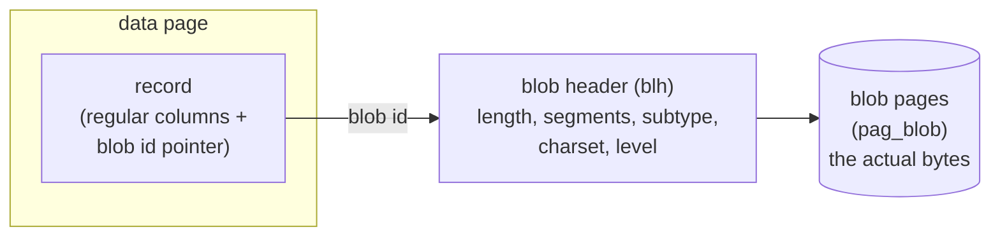
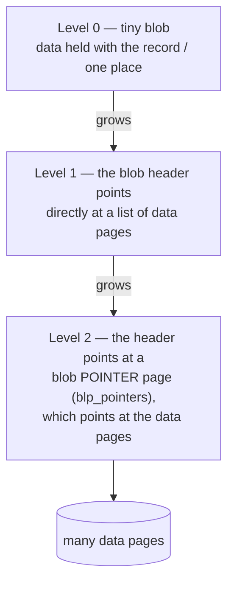

# BLOB and Large-Object Handling

Rows are for small, fixed-ish values; documents, images, JSON blobs and multi-megabyte text need a different storage path. This document describes how Firebird 6 stores and manipulates **BLOBs** (Binary Large OBjects) — the separate-storage model, the multi-level page addressing, subtypes and charsets, segmented and stream access, and the FB4/FB5 manipulation functions — grounded in the vendored source (`ods.h`, `blb.cpp`, the blob SQL-extension docs) and demonstrated live, then compares the large-object story with PostgreSQL, MySQL and SQLite.

It builds on the [on-disk structure document](on-disk-structure.md) (blob pages in the file), the [SQL dialect and data types document](sql-dialect-and-types.md) (BLOB as a type), the [internationalization document](internationalization.md) (text-blob charsets), and the [wire-protocol document](firebird-wire-protocol.md) (blob transfer on the wire).

**Table of Contents**

* [BLOBs live outside the record](#blobs-live-outside-the-record)
* [Multi-level page addressing](#multi-level-page-addressing)
* [Subtypes, charsets and filters](#subtypes-charsets-and-filters)
* [Segmented and stream access](#segmented-and-stream-access)
* [Manipulating BLOBs: BLOB_APPEND and RDB$BLOB_UTIL](#manipulating-blobs-blob_append-and-rdbblob_util)
* [BLOB internals in action (validated)](#blob-internals-in-action-validated)
* [Comparison: PostgreSQL, MySQL, SQLite](#comparison-postgresql-mysql-sqlite)
* [Discussion](#discussion)
* [Further research](#further-research)

## BLOBs live outside the record

The defining Firebird decision: a BLOB's *data* is stored **separately from the record**. The record (on its [data page](on-disk-structure.md#inside-a-data-page-records-and-version-deltas)) holds only a small **blob id** — a pointer — while the bytes live on their own **blob pages** (`pag_blob`). A **blob header** (`struct blh` in `ods.h`) describes each BLOB: the lead page, page count (`blh_max_sequence`), segment count (`blh_count`), total length (`blh_length`, a 64-bit value), longest segment, subtype, charset, and the addressing **level**.



_Figure 1: A record holds only a blob id; the BLOB's bytes live on separate blob pages, described by a blob header_

This is why, in the live demo below, a table with multi-kilobyte text blobs still reports an **average record length of ~15 bytes** — the blob bytes are not in the record. It keeps records small and uniform (good for the [MVCC page layout](transactions-and-concurrency.md)), lets a query that doesn't touch the blob column avoid reading blob pages entirely, and means updating a row's scalar columns doesn't rewrite the blob.

## Multi-level page addressing

Firebird addresses a BLOB's pages with up to three levels (`blb.cpp`, `blh_level`), so one mechanism scales from a few bytes to gigabytes:



_Figure 2: BLOB address levels — small BLOBs are stored directly, larger ones through a page list, the largest through a pointer page (a level of indirection), so the maximum size scales with page size_

- **Level 0** — a very small BLOB kept in place.
- **Level 1** — the header references data pages directly; suits BLOBs up to roughly a page-list's worth.
- **Level 2** — the header references a **blob pointer page** (`blp_pointers` flag) whose entries reference the data pages, adding one level of indirection so very large BLOBs fit. With a 32 KB [page size](on-disk-structure.md#setup-and-administration) the ceiling reaches into the gigabytes.

The engine promotes a BLOB to a higher level automatically as it grows; the application never chooses a level.

## Subtypes, charsets and filters

Unlike a plain "bag of bytes", a Firebird BLOB is **typed** by a subtype (`blh_sub_type`, from `consts_pub.h`):

| Subtype | Name | Meaning |
|---|---|---|
| 0 | `BINARY` (untyped) | Arbitrary bytes |
| 1 | `TEXT` | Text, with an associated character set |
| 2 | `BLR` | Compiled procedure/trigger code (internal) |
| 3–6 | ACL, ranges, summary, format | Internal engine uses |
| negative | user-defined | Application-defined subtypes |

**Text BLOBs carry a character set** (`blh_charset`) just like a `VARCHAR` — so `SUBSTRING`, `UPPER`, and comparison work correctly on large text, tying into the [internationalization subsystem](internationalization.md). A **BLOB filter** is a pluggable converter between subtypes (registered with `DECLARE FILTER`); reading a BLOB "as" another subtype runs it through the filter — a small, unusual extensibility point for on-the-fly transformation.

## Segmented and stream access

BLOBs are not read or written as one monolithic value but in **segments** — chunks delivered one at a time, so a gigabyte BLOB never needs to be fully in memory. The [OO API](client-apis-and-drivers.md)'s `IBlob` exposes `getSegment`/`putSegment`, and the [wire protocol](firebird-wire-protocol.md#packet-model-opcodes-and-xdr) has dedicated opcodes (`op_get_segment`, `op_put_segment`, `op_open_blob`, `op_create_blob`). A BLOB is either **segmented** (the classic mode, remembering segment boundaries — `blh_count`, longest segment) or a **stream BLOB** (`rhd_stream_blob`, a flat byte stream with no segment structure, better for random access via seek). Firebird 5 also added **inline BLOBs** on the wire (`op_inline_blob`, protocol 19 — see the [wire-protocol version table](firebird-wire-protocol.md#protocol-versions)): small BLOBs are shipped *with* the result row instead of requiring a separate open/fetch round-trip, a meaningful latency win for rows with small blobs.

## Manipulating BLOBs: BLOB_APPEND and RDB$BLOB_UTIL

Historically, building a BLOB in SQL/PSQL meant concatenation that recopied the whole value each time. Firebird added efficient primitives:

- **`BLOB_APPEND`** (FB4, [`README.blob_append.md`](https://github.com/FirebirdSQL/firebird/blob/master/doc/sql.extensions/README.blob_append.md)) — appends fragments to a BLOB in **temporary storage** without recopying, e.g. `BLOB_APPEND(base, 'a', 'b', 'c')`. Ideal for assembling large text in a loop.
- **`RDB$BLOB_UTIL`** package (FB5, [`README.blob_util.md`](https://github.com/FirebirdSQL/firebird/blob/master/doc/sql.extensions/README.blob_util.md)) — lower-level BLOB manipulation that standard functions can't do or do slowly: `NEW_BLOB` (create with explicit `SEGMENTED`/`TEMP_STORAGE` options), plus reading, seeking and info functions operating on binary data directly, even for text BLOBs.

Temporary BLOBs (what `BLOB_APPEND` creates) have transient ids until materialized; the [`SET TRANSACTION`](transactions-and-concurrency.md#savepoints-explicit-locks-and-autonomous-transactions) `AUTO RELEASE TEMP BLOBID` option manages their memory for mass inserts.

## BLOB internals in action (validated)

Real output from a live Firebird 6 server (a `docs` table with a text BLOB and a binary BLOB):

```sql
CREATE TABLE docs (
  id INTEGER PRIMARY KEY,
  note BLOB SUB_TYPE TEXT CHARACTER SET UTF8,   -- subtype 1, charset-aware
  data BLOB SUB_TYPE BINARY                       -- subtype 0
);
INSERT INTO docs (id, note) VALUES (3, BLOB_APPEND(CAST('' AS BLOB SUB_TYPE TEXT), 'part1-', 'part2-', 'part3'));
```

The blob columns' subtype and charset, from the catalog:

```text
FIELD    SUBTYPE    CHARSET
note        1       UTF8       -- text blob: subtype 1, carries a charset
data        0       <null>     -- binary blob: subtype 0, no charset
```

Blob lengths and the `BLOB_APPEND` result:

```text
ID   NOTE_BYTES   NOTE_CHARS
1        10           10        -- 'short note'
2      3903         3903        -- larger text (multi-page blob)
3        17           17        -- BLOB_APPEND('part1-','part2-','part3') = 'part1-part2-part3'
```

And the proof that BLOB data lives outside the record — `gstat` on the same table:

```text
"PUBLIC"."DOCS" (128)
    Average record length: 14.67, total records: 3
```

The average record is **~15 bytes** even though row 2 holds ~3.9 KB of text — because the record stores only the blob id, and the 3.9 KB lives on separate blob pages. This is the separate-storage model made visible.

## Comparison: PostgreSQL, MySQL, SQLite

| Aspect | **Firebird** | **PostgreSQL** | **MySQL** | **SQLite** |
|---|---|---|---|---|
| Model | **Out-of-line** blob pages + blob id | [TOAST](https://www.postgresql.org/docs/current/storage-toast.html) (auto off-page) *or* [large objects](https://www.postgresql.org/docs/current/largeobjects.html) | Inline + [off-page overflow](https://dev.mysql.com/doc/refman/8.4/en/innodb-row-format.html) (row format) | Inline + [overflow pages](https://sqlite.org/intern-v-extern-blob.html) |
| Types | `BLOB SUB_TYPE TEXT/BINARY` (+ user subtypes) | `bytea` / `text` (TOAST); LO `oid` | `TINY..LONGBLOB`/`TEXT` | `BLOB` storage class |
| Typed / charset | **Subtypes + text charset** | text encoding (DB-wide) | charset on TEXT | none |
| Streaming API | **Segments** (`IBlob`, wire opcodes) | LO [`lo_read`/`lo_write`](https://www.postgresql.org/docs/current/largeobjects.html); `bytea` whole | whole value (no core streaming) | [Incremental BLOB I/O](https://sqlite.org/c3ref/blob_open.html) |
| Build/append efficiently | `BLOB_APPEND`, `RDB$BLOB_UTIL` | `||` (rewrites) / LO writes | `CONCAT` (rewrites) | `||` / incremental write |
| Max size | Page-size dependent (GB range) | 1 GB (`bytea`/TOAST); 4 TB (LO) | 4 GB (`LONGBLOB`) | ~2 GB ([limits](https://sqlite.org/limits.html)) |
| Read without loading column | Yes (record excludes blob) | Yes (TOAST/LO on demand) | Depends on row format | Yes (incremental I/O) |
| Filters / transform | **BLOB filters** (subtype converters) | via functions/extensions | via functions | via app functions |

## Discussion

**Firebird and PostgreSQL large objects share the out-of-line philosophy; TOAST, MySQL and SQLite lean inline-with-overflow.** Firebird always stores BLOB bytes on separate pages referenced by a blob id — the record never carries the payload, so scalar-only queries and updates never touch blob storage, and records stay small and uniform. PostgreSQL's *large objects* work similarly (a separate `pg_largeobject` store with an oid handle and a streaming API), but its *default* path for `bytea`/`text` is TOAST: the value lives inline until it's big, then is compressed and pushed to a side table transparently. MySQL and SQLite are inline-first too, spilling to overflow pages when a value won't fit. Firebird's always-separate model is the most consistent — no size threshold, no row-format subtlety — at the cost that even small BLOBs pay a little indirection (which FB5's inline-blob wire optimization specifically claws back).

**Firebird's typed, charset-aware BLOBs are distinctive.** Alone among the four, Firebird gives BLOBs a **subtype** (text vs binary vs user-defined) and text BLOBs a **character set**, so large text participates in collation and string functions the same way a `VARCHAR` does, and applications can tag BLOBs with their own subtypes and register **filters** to convert between them. The others treat a large object as essentially untyped bytes (with a text/binary distinction and, for text, a database-wide encoding). This typing is a small but real expressiveness advantage for document-oriented data.

**Streaming is the shared necessity, solved four ways.** Nobody wants a gigabyte value fully in memory, so each engine offers incremental access: Firebird's segment API and wire opcodes, PostgreSQL's large-object `lo_read`/`lo_write`, SQLite's incremental BLOB I/O (`sqlite3_blob_open`). MySQL is the laggard here — its core protocol transfers whole values, so streaming is an application concern. This mirrors a theme from the [client-APIs document](client-apis-and-drivers.md): Firebird's protocol and API were designed around chunked large-object transfer from the start, part of the same design that produced its separate-storage model.

## Further research

**Firebird**

- [`doc/sql.extensions/README.blob_append.md`](https://github.com/FirebirdSQL/firebird/blob/master/doc/sql.extensions/README.blob_append.md) and [`README.blob_util.md`](https://github.com/FirebirdSQL/firebird/blob/master/doc/sql.extensions/README.blob_util.md) — the FB4/FB5 BLOB manipulation functions; [`src/jrd/blb.cpp`](https://github.com/FirebirdSQL/firebird/blob/master/src/jrd/blb.cpp) — the BLOB engine (levels, segments).
- The [on-disk structure document](on-disk-structure.md) (blob pages, `gstat`), [SQL dialect and data types](sql-dialect-and-types.md) (BLOB as a type), [internationalization](internationalization.md) (text-blob charsets), and the [wire-protocol document](firebird-wire-protocol.md) (blob opcodes, FB5 inline blobs).

**PostgreSQL**

- [Binary data (`bytea`)](https://www.postgresql.org/docs/current/datatype-binary.html), [TOAST](https://www.postgresql.org/docs/current/storage-toast.html), [Large objects](https://www.postgresql.org/docs/current/largeobjects.html).

**MySQL**

- [BLOB and TEXT types](https://dev.mysql.com/doc/refman/8.4/en/blob.html), [InnoDB row formats](https://dev.mysql.com/doc/refman/8.4/en/innodb-row-format.html) (off-page storage); MariaDB's [BLOB](https://mariadb.com/kb/en/blob/).

**SQLite**

- [Datatypes (BLOB)](https://sqlite.org/datatype3.html), [Incremental BLOB I/O](https://sqlite.org/c3ref/blob_open.html), [internal vs external BLOBs](https://sqlite.org/intern-v-extern-blob.html), [limits](https://sqlite.org/limits.html).
