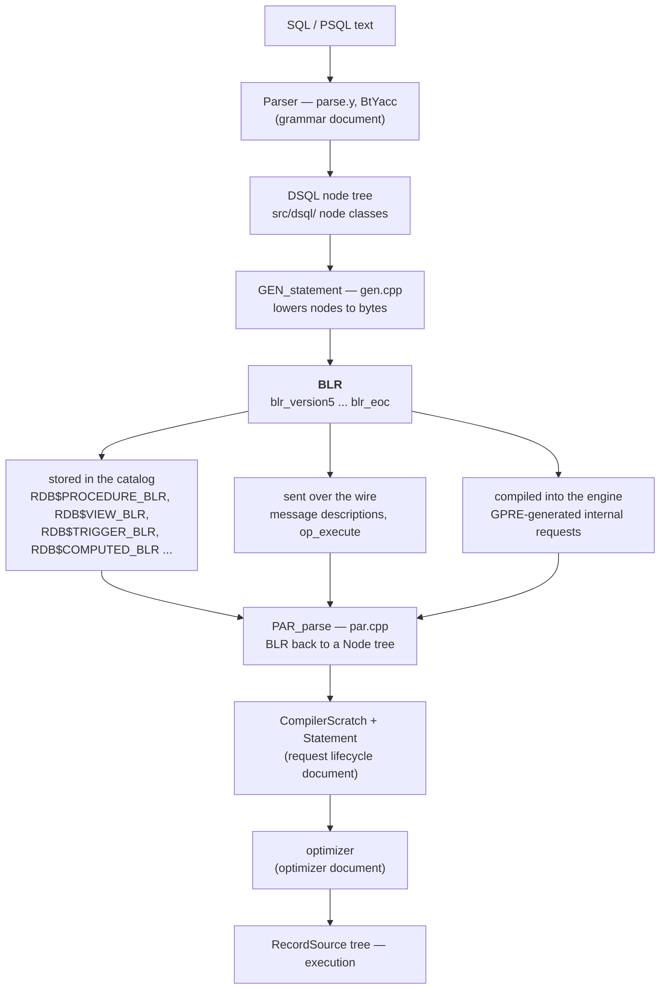

# BLR: The Binary Language Representation

Eleven documents in this collection mention BLR. The [grammar document](grammar-and-parser.md) says the parser lowers to it; the [request trace](request-lifecycle-code-trace.md) watches `GEN_statement` produce it and `PAR_parse` consume it; the [PSQL document](psql-and-stored-procedures.md) notes that procedures are *stored* as it; the [catalog bootstrap](catalog-bootstrap.md) mentions that the engine's own catalog access runs as internal BLR requests; the [Reading Guide](READING-GUIDE.md) names it as one of five recurring themes. Not one of them says what it actually is.

**BLR — Binary Language Representation — is Firebird's stored intermediate language.** Every executable thing in a Firebird database, from a stored procedure to a computed column to a partial index's `WHERE` clause, is kept in the catalog as BLR, not as SQL text. It is the durable contract between the compiler and the engine, and it is remarkably stable: the version tag has read `blr_version5` since the InterBase era, through Firebird 3, 4, 5 and 6, while the language above it gained `DECFLOAT`, `INT128`, time zones, window frames and schemas.

This document explains the encoding, shows real BLR disassembled from a live database, and makes the case that BLR's stability is not an accident but a consequence of one design rule — **the opcode space is append-only** — which is the same rule that governs [`lck_t` lock series](lock-manager.md) and [system relation ids](catalog-bootstrap.md).

Grounded in [`src/include/firebird/impl/blr.h`](https://github.com/FirebirdSQL/firebird/blob/master/src/include/firebird/impl/blr.h) (554 lines, 367 opcodes), [`src/dsql/gen.cpp`](https://github.com/FirebirdSQL/firebird/blob/master/src/dsql/gen.cpp) and [`src/jrd/par.cpp`](https://github.com/FirebirdSQL/firebird/blob/master/src/jrd/par.cpp).

**Table of Contents**

* [Where BLR sits](#where-blr-sits)
* [A worked example](#a-worked-example)
* [The encoding](#the-encoding)
* [Opcode families](#opcode-families)
* [Why the version is still 5](#why-the-version-is-still-5)
* [Both directions of translation](#both-directions-of-translation)
* [The three homes of BLR](#the-three-homes-of-blr)
* [BLR is not a plan](#blr-is-not-a-plan)
* [BLR in action (validated)](#blr-in-action-validated)
* [Comparison: PostgreSQL, MySQL, SQLite](#comparison-postgresql-mysql-sqlite)
* [Discussion](#discussion)
* [Further research](#further-research)

## Where BLR sits

Firebird's pipeline has a shape more like a compiler than like most relational engines, and BLR is the object file in the middle.



_Figure 1: BLR as the durable middle — everything above it is compile-time, everything below is run-time_

The essential property is the one that makes it worth a document: **BLR is the form that persists.** SQL text for a stored procedure is retained only for humans (`RDB$PROCEDURE_SOURCE`); the engine never reads it back to execute anything. Drop the source and the procedure still runs. What the engine executes is compiled from the BLR every time the procedure is loaded.

## A worked example

The `employee` database that ships with Firebird has a computed column, `FULL_NAME`, defined as `LAST_NAME || ', ' || FIRST_NAME`. Its stored BLR, read straight out of the catalog on a live Firebird 6 server, is nine lines:

```
blr_version5,
blr_concatenate,
   blr_concatenate,
      blr_field, 0, 9, 'L','A','S','T','_','N','A','M','E',
      blr_literal, blr_text2, 0,0, 2,0, 44,32,
   blr_field, 0, 10, 'F','I','R','S','T','_','N','A','M','E',
blr_eoc
```

Read byte by byte, the whole design is on display:

| Bytes | Meaning |
|---|---|
| `blr_version5` | the version tag that opens every BLR stream |
| `blr_concatenate` | an operator, written **prefix** — its two operands follow |
| `blr_field, 0, 9, 'LAST_NAME'` | field reference: context 0, then a **length-prefixed name** (9 characters) |
| `blr_literal, blr_text2, 0,0, 2,0, 44,32` | a literal: type `blr_text2`, character set 0, collation 0, length 2, then the bytes `44,32` — ASCII `,` and space, i.e. `", "` |
| `blr_eoc` | end of command (opcode 76) |

Three structural facts fall out of these nine lines.

**BLR is a prefix-encoded tree, not a stack machine.** `blr_concatenate` is followed by exactly its two operands, each of which may itself be an operator. There is no stack, no jump table, no register allocation — it is an abstract syntax tree flattened into bytes. This is the deepest difference between BLR and SQLite's VDBE, which really is a bytecode for a virtual machine.

**References are by name, not by id.** `blr_field, 0, 9, 'LAST_NAME'` names the column. So does `blr_relation, 16, 'EMPLOYEE_PROJECT', 0` in the procedure example below. Names are resolved when the BLR is parsed, not when it is generated — which is exactly why the catalog carries `RDB$VALID_BLR` columns alongside the BLR itself: DDL can invalidate stored BLR by removing or changing something it names, and the engine tracks whether a given blob still resolves.

**Everything is length-prefixed.** Names, literals and messages all carry explicit lengths, so a reader can skip a construct it does not need to interpret. That is what lets the same byte stream be walked by the engine's parser, by the pretty-printer, and by a BLOB filter that has no idea what the opcodes mean semantically.

## The encoding

BLR is a byte stream. The general shape is:

```
blr_version5  <statement or expression>  blr_eoc
```

Opcodes are single bytes (`(unsigned char)` in the header), and each opcode's operands are positional and implied by the opcode — there is no self-describing tag/length framing at the opcode level, so **you must know the opcode table to walk the stream**. A few conventions recur:

- **Counted lists** — `blr_begin` … `blr_end`, where `blr_end` is `255`, the sentinel that terminates a statement list.
- **Length-prefixed strings** — one byte of length followed by the characters, for identifiers.
- **Two-byte little-endian lengths** — for messages and literals (`2,0` above is length 2).
- **Contexts** — numbered stream aliases (`blr_field, 0, ...` means "field of context 0"), assigned by the generator and used to disambiguate joins and correlated references.
- **Subcodes** — newer, richer constructs use a nested tag space rather than new top-level opcodes. `blr_invoke_agg_function` (237) is followed by subcodes `blr_invoke_agg_function_id` (1), `_arg_names` (2), `_args` (3), `_filter` (4). This is how complex FB4/5/6 features are added without consuming scarce top-level opcode numbers.

There are two accepted version tags. [`par.cpp`](https://github.com/FirebirdSQL/firebird/blob/master/src/jrd/par.cpp) takes either:

```c
case blr_version4:
case blr_version5:
```

and rejects anything else with an error citing the accepted range — where the source still carries the commented-out future:

```c
Arg::Num(blr_version4) << Arg::Num(blr_version5/*6*/) << Arg::Num(version));
```

The generator picks between them in [`gen.cpp`](https://github.com/FirebirdSQL/firebird/blob/master/src/dsql/gen.cpp) (`appendUChar(blr_version4)` / `appendUChar(blr_version5)`), with version 4 retained for [dialect-1 compatibility](sql-dialect-and-types.md). Everything modern is version 5.

## Opcode families

The 367 opcodes in [`blr.h`](https://github.com/FirebirdSQL/firebird/blob/master/src/include/firebird/impl/blr.h) group into a handful of families, and the grouping is a decent map of what the engine considers primitive.

| Family | Examples | Role |
|---|---|---|
| **Data types** | `blr_short` 7, `blr_long` 8, `blr_text` 14, `blr_varying` 37, `blr_blob` 261, `blr_bool` 23, `blr_int128` 26, `blr_dec64`/`blr_dec128` 24/25, `blr_timestamp_tz` 29 | describe a datum's type in messages, literals and declarations |
| **Statements** | `blr_begin`, `blr_end` 255, `blr_assignment`, `blr_if`, `blr_loop`, `blr_label`, `blr_leave`, `blr_stall` | the procedural skeleton — this is what makes [PSQL](psql-and-stored-procedures.md) expressible |
| **Data manipulation** | `blr_store`, `blr_modify`, `blr_erase`, `blr_for`, `blr_receive`, `blr_send` | the DML verbs and the record-stream loop |
| **Record selection** | `blr_rse`, `blr_relation`, `blr_boolean`, `blr_sort`, `blr_first`, `blr_join` (`blr_inner`/`blr_left`/`blr_right`) | the **RSE** — record selection expression, the declarative query core |
| **Expressions** | `blr_add`, `blr_concatenate`, `blr_field`, `blr_literal`, `blr_parameter`, `blr_variable`, `blr_cast` | ordinary expression trees |
| **Invocation** | `blr_procedure`, `blr_function`, `blr_exec_sql`, `blr_invoke_agg_function` 237 | calling other objects |
| **Newer features** | `blr_gen_id3` 231, `blr_default2` 232, `blr_current_schema` 233, `blr_flags` 234, `blr_within_group_order` 235, `blr_package_reference` 236 | FB4/5/6 additions, all at the high end |

The family worth pausing on is **record selection**. `blr_rse` is not a plan or an operator — it is a *declarative* description of what rows are wanted: which relations, which boolean, which sort, which join type. The optimizer receives this and decides how to satisfy it. That BLR's query core is declarative rather than procedural is what allows a stored procedure compiled a decade ago to benefit from an optimizer improvement shipped last year — a point developed [below](#blr-is-not-a-plan).

## Why the version is still 5

The header's version block is the most eloquent thing in the file:

```c
#define blr_version4		(unsigned char)4
#define blr_version5		(unsigned char)5
//#define blr_version6		(unsigned char)6
```

Version 6 is written down and commented out. In the span covered by this collection — Firebird 3 through 6 — the language gained `BOOLEAN`, `INT128`, `DECFLOAT`, `TIME`/`TIMESTAMP WITH TIME ZONE`, window frames, `WITHIN GROUP` ordered-set aggregates, packages, and in FB6 [schemas](schemas-and-name-resolution.md). None of it required a new BLR version — in the schema case because stored BLR [carries no schema at all](schemas-and-name-resolution.md#why-blr-did-not-need-a-new-version), resolving unqualified names against the owning object's schema at parse time.

The mechanism is **append-only opcode allocation**. New capabilities become new opcodes at the high end of the number space, and existing opcodes never change meaning or operand layout. The evidence is visible just by sorting the header numerically: the highest allocations are `blr_gen_id3` (231), `blr_default2` (232), `blr_current_schema` (233), `blr_flags` (234), `blr_within_group_order` (235), `blr_package_reference` (236), `blr_invoke_agg_function` (237). `blr_current_schema` is a Firebird **6** feature sitting quietly at opcode 233 in a version-5 stream.

The `2`/`3` suffixes tell the same story from another angle. When a construct needs richer operands, the answer is not to change the existing opcode but to add a successor — `blr_gen_id`, `blr_gen_id2`, `blr_gen_id3`; `blr_domain_name`, `blr_domain_name2`, `blr_domain_name3`. Old streams keep parsing because the old opcode is still there, still meaning exactly what it meant.

This is the same discipline the collection has now met three times: [`lck_t` series numbers](lock-manager.md) are append-only because they appear in a shared-memory structure that mixed-version processes read; [system relation ids](catalog-bootstrap.md) are append-only because they are baked into the binary as array positions; BLR opcodes are append-only because a database written by an older engine must still execute. In each case the constraint is the same — *a number that escaped into a durable artifact can never be reused* — and in each case Firebird's answer is to grow rather than renumber.

The cost is honest: the opcode space is finite, the header accumulates near-duplicates (`blr_domain_name3` is the third spelling of one idea), and nothing is ever cleaned up. Version 6 stays commented out because bumping it would mean supporting both forever, which is a larger cost than the clutter.

## Both directions of translation

**Down: DSQL nodes to bytes.** [`gen.cpp`](https://github.com/FirebirdSQL/firebird/blob/master/src/dsql/gen.cpp) is small — about 725 lines — because the real work is distributed across the node classes: `GEN_statement` walks the DSQL node tree and each node emits its own opcodes through a `DsqlCompilerScratch` that appends bytes. Lowering is a tree walk with an output buffer.

**Up: bytes to a Node tree.** [`par.cpp`](https://github.com/FirebirdSQL/firebird/blob/master/src/jrd/par.cpp), at 1 744 lines, is the larger half, because parsing must reconstruct semantic structure and resolve every name:

```c
CompilerScratch* PAR_parse(thread_db* tdbb, const UCHAR* blr, ULONG blr_length,
	bool internal_flag, ULONG dbginfo_length, const UCHAR* dbginfo)
{
	...
	MemoryPool& pool = *tdbb->getDefaultPool();
	AutoPtr<CompilerScratch> csb(FB_NEW_POOL(pool) CompilerScratch(pool));

	csb->csb_blr_reader = BlrReader(blr, blr_length);
```

`PAR_parse` returns a **`CompilerScratch`** — the working state from which [`CMP_compile` builds a `Statement`](request-lifecycle-code-trace.md), the shared executable form. The `internal_flag` parameter distinguishes engine-internal BLR (which may reference system relations directly and skips some checks) from user BLR.

Note the asymmetry: generation is mechanical, parsing is where meaning is re-established. That is the price of a name-based, resolution-deferred encoding — and the reason BLR can be *stored* at all. An id-based encoding would be faster to parse and impossible to keep valid across DDL.

The optional `dbginfo` argument carries the debug information that maps BLR offsets back to PSQL source lines — the machinery behind the line numbers in [PSQL exception stack traces](psql-and-stored-procedures.md).

## The three homes of BLR

**The catalog.** Twelve columns across eight system tables hold BLR, enumerated from a live database:

```
RDB$CONSTANTS.RDB$CONSTANT_BLR
RDB$FIELDS.RDB$COMPUTED_BLR
RDB$FIELDS.RDB$VALIDATION_BLR
RDB$FUNCTIONS.RDB$FUNCTION_BLR
RDB$FUNCTIONS.RDB$VALID_BLR
RDB$INDICES.RDB$CONDITION_BLR
RDB$INDICES.RDB$EXPRESSION_BLR
RDB$PROCEDURES.RDB$PROCEDURE_BLR
RDB$PROCEDURES.RDB$VALID_BLR
RDB$RELATIONS.RDB$VIEW_BLR
RDB$TRIGGERS.RDB$TRIGGER_BLR
RDB$TRIGGERS.RDB$VALID_BLR
```

Every executable artifact is here: procedure and function bodies, trigger bodies, view definitions, computed-column and domain-validation expressions, and — connecting to the [indexing document](indexing-and-full-text-search.md) — the expression of an expression index (`RDB$EXPRESSION_BLR`) and the `WHERE` clause of a partial index (`RDB$CONDITION_BLR`). When that document says a partial index stores its predicate, this is the column and this is the format.

The `RDB$VALID_BLR` columns are the counterpart to name-based binding: a flag recording whether the stored BLR still resolves after subsequent DDL.

**The wire.** BLR crosses the network as part of the [protocol](firebird-wire-protocol.md). Message descriptions — the binary layout of a statement's input and output rows — are BLR type sequences, which is what `BlrFromMessage` in the [request trace](request-lifecycle-code-trace.md) constructs before `op_execute`. This is also why the legacy ISC API's `isc_dsql_prepare` deals in BLR: the client and server agree on row layout in the same language the engine compiles.

**Compiled into the engine.** The engine's own catalog access is written in embedded SQL and preprocessed by **GPRE**, which emits BLR *at build time* as static byte arrays. The [catalog bootstrap document](catalog-bootstrap.md) notes that `INI_format`'s `STORE` statements run "as internal BLR requests through `EXE`" — that is this: the engine reads its own catalog by executing precompiled BLR through the same `PAR_parse` → `CMP_compile` → execute path a user query takes. There is no privileged internal access path.

That third home is the strongest argument for BLR's design. A single execution machinery serves user SQL, stored procedures, and the engine's own bootstrap, because all three arrive as the same bytes.

## BLR is not a plan

This is the distinction most likely to be misread, so it is worth stating flatly: **BLR is pre-optimization.** It records *what* is wanted, not *how* to get it.

A `blr_rse` names relations, a boolean, a sort and a join type. It does not name indexes, join order, or access methods. Those are decided later, by the [optimizer](query-optimizer-and-execution.md), which turns the parsed request into a `RecordSource` tree — and it is the `RecordSource` tree, not the BLR, that the `PLAN` output describes.

Two consequences follow, and both are load-bearing claims made elsewhere in this collection:

- **Stored procedures inherit optimizer improvements.** Because the stored artifact is declarative, a procedure written for Firebird 3 gets Firebird 5's hash joins with no recompilation of the stored form. The BLR did not change; what the optimizer does with it did.
- **`PLAN` and BLR answer different questions.** If you want to know what a procedure *means*, read its BLR. If you want to know how a query will *run*, read its plan. Conflating them leads to expecting index choices to be visible in the BLR, where they never appear.

There is one deliberate exception. BLR can carry an explicit plan (the `PLAN` clause survives into the stored form), which is how a user overrides the optimizer — the escape hatch, not the norm.

## BLR in action (validated)

All output below is from the live Firebird 6 server against the shipped `employee` database. No special tooling is required: `isql`'s `SET BLOB ALL` renders BLR blobs through the engine's own BLR **BLOB filter** ([`src/jrd/filters.cpp`](https://github.com/FirebirdSQL/firebird/blob/master/src/jrd/filters.cpp)), which disassembles the byte stream into symbolic opcode names. BLR is, in effect, self-documenting from any SQL client.

**A computed column** — the worked example above, retrieved with:

```sql
SET BLOB ALL;
SELECT FIRST 1 RDB$FIELD_NAME, RDB$COMPUTED_BLR
  FROM RDB$FIELDS WHERE RDB$COMPUTED_BLR IS NOT NULL;
```

```
blr_version5,
blr_concatenate,
   blr_concatenate,
      blr_field, 0, 9, 'L','A','S','T','_','N','A','M','E',
      blr_literal, blr_text2, 0,0, 2,0, 44,32,
   blr_field, 0, 10, 'F','I','R','S','T','_','N','A','M','E',
blr_eoc
```

**A stored procedure** — `GET_EMP_PROJ`, showing the procedural and record-selection families together:

```
blr_version5,
blr_begin,
   blr_message, 0, 2,0,
      blr_short, 0,
      blr_short, 0,
   blr_message, 1, 3,0,
      blr_text2, 0,0, 5,0,
      blr_short, 0,
      blr_short, 0,
   blr_receive, 0,
      blr_begin,
         blr_declare, 0,0, blr_text2, 0,0, 5,0,
         blr_assignment,
            blr_null,
            blr_variable, 0,0,
         blr_stall,
         blr_label, 0,
            blr_begin,
               blr_begin,
                  blr_label, 1,
                     blr_for,
                        blr_rse, 1,
                           blr_relation, 16, 'E','M','P','L','O','Y','E','E','_','P','R','O','J','E','C','T', 0,
                           blr_boolean,
```

Everything the document has claimed is visible in this fragment. The **message declarations** (`blr_message, 0, 2,0` — message 0 with two fields) are the input/output row layouts that also travel over the wire. `blr_receive` marks where parameters arrive. `blr_declare` and `blr_assignment` are ordinary PSQL local-variable machinery. `blr_stall` is the [selectable-procedure `SUSPEND`](psql-and-stored-procedures.md) mechanism. And `blr_for` + `blr_rse` is the declarative query core — with the relation named as a **length-prefixed literal** (`16, 'EMPLOYEE_PROJECT'`), not an id, and **no index named anywhere**, because that decision belongs to the optimizer.

**The catalog inventory** was produced with:

```sql
SELECT TRIM(rf.RDB$RELATION_NAME) || '.' || TRIM(rf.RDB$FIELD_NAME)
  FROM RDB$RELATION_FIELDS rf
 WHERE rf.RDB$FIELD_NAME CONTAINING 'BLR' AND rf.RDB$SYSTEM_FLAG = 1
 ORDER BY 1;
```

returning the twelve columns listed [above](#the-three-homes-of-blr).

**The version claim** is confirmed from both ends: every blob dumped from this Firebird 6 database opens with `blr_version5`, while the header's `blr_version6` remains commented out and `par.cpp` accepts only versions 4 and 5.

## Comparison: PostgreSQL, MySQL, SQLite

| | **Firebird** | **PostgreSQL** | **MySQL** | **SQLite** |
|---|---|---|---|---|
| Intermediate form | **BLR** — binary, prefix-encoded AST | in-memory parse/query tree (`Query`) | in-memory parse tree | **VDBE bytecode** — register machine |
| Persisted? | **yes** — in the catalog | function bodies stored as **source text** | routine bodies stored as **source text** | no — schema stored as SQL text |
| What executes | BLR compiled to a `RecordSource` tree | plan tree from the planner | iterator tree | VDBE program |
| Declarative or procedural | **declarative core** (`blr_rse`) | declarative (rewritten `Query`) | declarative | **procedural** — explicit opcodes, jumps, cursors |
| Stability guarantee | **version tag unchanged since v5** | n/a (nothing persisted) | n/a | bytecode is an internal detail, freely changed |
| Visible to users | yes — BLOB filter disassembles it | `EXPLAIN` shows plans, not IR | `EXPLAIN` | `EXPLAIN` shows VDBE program |

The instructive pairing is **Firebird and SQLite**, because both are genuine compilers with a real IR, and they made opposite choices about what the IR is *for*.

SQLite's VDBE is a procedural bytecode — registers, jumps, explicit cursor operations — generated fresh on every prepare and never stored. It can be changed freely between releases precisely because nothing outside the process ever sees it. It is a compilation target.

BLR is a *declarative* AST that is stored, shipped over the network, and must be readable by future engine versions. It is an interchange format. That is why it is prefix-encoded rather than register-based, why it binds by name rather than by id, and why its version number is frozen — every one of those choices trades execution convenience for durability.

PostgreSQL and MySQL sidestep the question by not persisting an IR at all: routine bodies are stored as text and re-parsed. That is simpler and infinitely flexible, at the cost of re-parsing on every cache miss and of having no artifact that can outlive the parser.

## Discussion

BLR is the clearest case in this collection of a design decision whose consequences are still visible forty years later. Choosing to persist a *declarative* IR — rather than source text like PostgreSQL and MySQL, or a procedural bytecode like SQLite — bought Firebird three things that keep showing up in other documents.

It bought **one execution path**. User SQL, PSQL bodies, and the engine's own GPRE-compiled catalog access all arrive as BLR and go through the same `PAR_parse` → `CMP_compile` → optimizer → `RecordSource` machinery. The [catalog bootstrap](catalog-bootstrap.md) document's observation that the engine reads its catalog through ordinary requests is only possible because there is a single IR that both the engine and its users speak.

It bought **forward compatibility for stored logic**, in the strong sense: not merely that old procedures keep running, but that they keep *improving*, because the stored form never committed to an execution strategy.

And it bought **a wire format for free**. Message layouts on the network are BLR type sequences because BLR already had a vocabulary for describing data.

What it costs is equally clear from the header. Name-based binding makes parsing expensive and requires `RDB$VALID_BLR` bookkeeping to survive DDL. The append-only opcode space accumulates `_2` and `_3` variants that can never be tidied. And the whole thing is undocumented in any normative sense — `blr.h` is the specification, which is a thin foundation for something clients and third-party drivers depend on.

The recurring theme this document adds evidence to is **append-only durability**. Three subsystems now — [lock series](lock-manager.md), [system relation ids](catalog-bootstrap.md), BLR opcodes — follow the identical rule, for the identical reason: the number escaped into something durable that a future version must still read. Firebird's answer is always the same, and always to grow rather than renumber. `//#define blr_version6` is that philosophy in a single commented-out line.

## Further research

* [`src/include/firebird/impl/blr.h`](https://github.com/FirebirdSQL/firebird/blob/master/src/include/firebird/impl/blr.h) — the specification, such as it is. Read it sorted numerically to see the historical layers.
* [`src/jrd/par.cpp`](https://github.com/FirebirdSQL/firebird/blob/master/src/jrd/par.cpp) — `PAR_parse` and the per-opcode parsers; the best place to learn any opcode's exact operand layout.
* [`src/dsql/gen.cpp`](https://github.com/FirebirdSQL/firebird/blob/master/src/dsql/gen.cpp) — `GEN_statement` and the version selection; the node classes in `src/dsql/` do the per-construct emission.
* [`src/common/pretty.cpp`](https://github.com/FirebirdSQL/firebird/blob/master/src/common/pretty.cpp) — the BLR pretty-printer behind `fb_print_blr`, and a complete opcode-to-name table.
* [`src/jrd/filters.cpp`](https://github.com/FirebirdSQL/firebird/blob/master/src/jrd/filters.cpp) — the BLOB filter that makes `SET BLOB ALL` disassemble BLR from any SQL client.
* `src/gpre/` — the preprocessor that compiles the engine's own embedded SQL to static BLR arrays.
* Companion docs: [grammar and parser](grammar-and-parser.md) (what produces BLR) · [query optimizer and execution](query-optimizer-and-execution.md) (what consumes it) · [request lifecycle trace](request-lifecycle-code-trace.md) (both, in one round trip) · [PSQL](psql-and-stored-procedures.md) (the language BLR stores) · [catalog bootstrap](catalog-bootstrap.md) (BLR compiled into the engine) · [wire protocol](firebird-wire-protocol.md) (BLR as message description).
