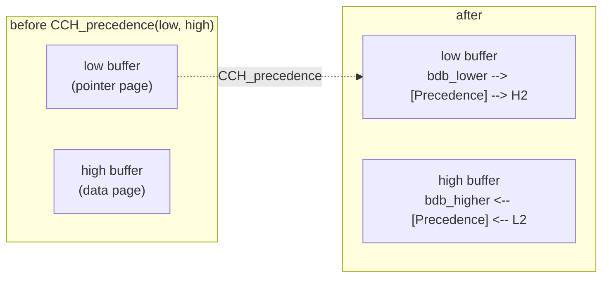
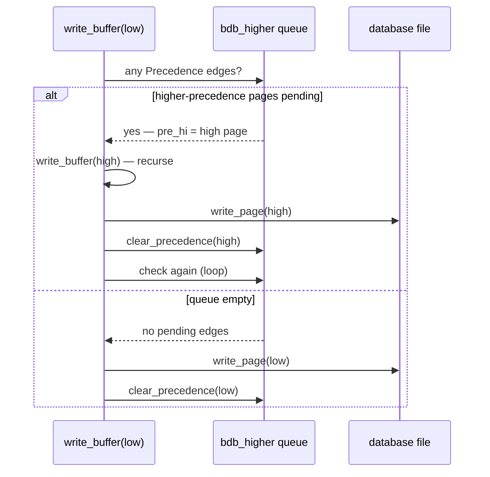

# Careful Writes and Crash Safety: the Precedence Graph

The [on-disk-structure document](on-disk-structure.md#advantages-of-the-firebird-on-disk-structure) named the headline claim — Firebird needs no undo log (old record versions serve that role) and no redo/write-ahead log, because "pages are written in a careful order that always leaves the file consistent." The [page-cache-coherency document](page-cache-coherency.md#the-page-lock-protocol-pr-ex-and-the-blocking-ast) leaned on the same mechanism when a dirty buffer has to be flushed before a lock can be given away. Neither document opened the mechanism itself. This one does: **the precedence graph** in [`src/jrd/cch.cpp`](https://github.com/FirebirdSQL/firebird/blob/master/src/jrd/cch.cpp) — a small in-memory dependency graph over dirty buffers, built by every code path that writes related pages, walked before every physical write — and then proves the payoff live: 2.5 million uncommitted rows and five `kill -9`s later, the database attaches instantly, structurally intact, with every committed row present and every uncommitted row gone.

**Table of Contents**

* [The problem: two pages, one crash](#the-problem-two-pages-one-crash)
* [The Precedence block: a graph over dirty buffers](#the-precedence-block-a-graph-over-dirty-buffers)
* [Establishing edges: `CCH_precedence`](#establishing-edges-cch_precedence)
* [Enforcing edges: `write_buffer`'s recursion](#enforcing-edges-write_buffers-recursion)
* [What gets ordered, concretely](#what-gets-ordered-concretely)
* [Cycles and the search limit](#cycles-and-the-search-limit)
* [The header page: a special, deferred case](#the-header-page-a-special-deferred-case)
* [What careful writes do *not* give you](#what-careful-writes-do-not-give-you)
* [Crash safety, live](#crash-safety-live)
* [Comparison: PostgreSQL, MySQL/InnoDB, SQLite](#comparison-postgresql-mysqlinnodb-sqlite)
* [Discussion](#discussion)
* [Further research](#further-research)

## The problem: two pages, one crash

Almost every structural change in Firebird touches more than one page. Allocating a data page clears a bit on a page-inventory (PIP) page and links it from a pointer page. Splitting a B-tree bucket writes a new page and rewrites its parent to point at it. Deleting a record's overflow fragment updates a pointer page's byte and, previously, the data page itself. If the OS (or a power cut, or a `kill -9`) lets one of those writes reach disk and not the other, the file's next reader sees an inconsistency: a pointer page claiming a data page exists when the PIP says its space is free, or a B-tree parent pointing at a bucket whose fields were never written.

A write-ahead log solves this by writing the *intention* first, replaying it if the follow-through didn't finish. Firebird solves it without a log, by controlling **which of the two writes reaches disk first**: if the referenced page (PIP, child bucket, sibling) always hits disk before the page that references it, then a crash between the two writes leaves the file in a state that existed at some real earlier instant — the referencing page just hasn't caught up yet, which is exactly the state before the change was made. No replay is needed because the file was never made inconsistent in the first place; it was only ever behind.

## The Precedence block: a graph over dirty buffers

Every in-cache page is a `BufferDesc` (`bdb`). Two of its fields are queue heads:

```cpp
// src/jrd/cch.h
que  bdb_lower;   // pages that must be written before this one
que  bdb_higher;  // pages that must wait for this one to be written first
```

An edge is a heap-allocated `Precedence` block (`cch.h`) linking exactly two buffers:

```cpp
class Precedence : public pool_alloc<type_pre>
{
public:
    BufferDesc* pre_hi;   // written first
    BufferDesc* pre_low;  // written after pre_hi
    que  pre_lower;   // threaded onto pre_hi->bdb_lower
    que  pre_higher;  // threaded onto pre_low->bdb_higher
    SSHORT pre_flags; // PRE_cleared once satisfied
};
```

"High precedence" is confusing terminology at first glance — it means *goes out first*, not *more important*. The graph lives in `BufferControl` (`bcb_free` — a free-list of recycled `Precedence` blocks; `bcb_syncPrecedence` — the mutex serializing the whole structure) and is purely a **per-attachment, in-memory** structure: it exists only to sequence writes still sitting in the cache and is torn down (`clear_precedence`) as soon as each edge's high page is confirmed on disk.



_Figure 1: establishing precedence links two buffers with one `Precedence` block, threaded onto both queues_

## Establishing edges: `CCH_precedence`

Code that is about to modify a "low" page whose correctness depends on an already-modified "high" page first fetches and marks the high page, then calls:

```cpp
void CCH_precedence(thread_db* tdbb, WIN* window, PageNumber page);
```

which delegates to `check_precedence` (`cch.cpp`). The function's own comment states the contract plainly: *"Given a window accessed for write and a page number, establish a precedence relationship such that the specified page will always be written before the page associated with the window."* Concretely it:

1. Looks up the high page's `BufferDesc` in the hash table. If it isn't in cache, or isn't dirty, or is the *same* page as `window`, there's nothing to order — return.
2. Under `bcb_syncPrecedence` (exclusive), checks whether the relationship already exists by walking the existing graph (`related()`, below) — no point creating a duplicate edge.
3. Checks the *reverse* direction too — if `low` is already (transitively) higher-precedence than `high`, creating this edge would form a cycle; the code breaks the tie by writing `low` immediately instead (more in [Cycles](#cycles-and-the-search-limit)).
4. Otherwise allocates (or reuses, from `bcb_free`) a `Precedence` block and threads it onto both queues.

A companion entry point, `CCH_tra_precedence(tdbb, window, traNum)`, exists for the one non-page dependency in the system: a page can carry a *transaction id* that must appear on the header page before the page itself is safe to write (covered in [The header page](#the-header-page-a-special-deferred-case)).

## Enforcing edges: `write_buffer`'s recursion

Establishing edges is only half the mechanism; the other half is that every physical write path *respects* them. `write_buffer` (`cch.cpp`), the function that actually calls `write_page`, opens with exactly this check:

```cpp
// If there are buffers that must be written first, write them now.
if (QUE_NOT_EMPTY(bdb->bdb_higher))
{
    ...
    QUE que_inst = bdb->bdb_higher.que_forward;
    Precedence* precedence = BLOCK(que_inst, Precedence, pre_higher);
    ...
    BufferDesc* hi_bdb = precedence->pre_hi;
    write_status = write_buffer(tdbb, hi_bdb, hi_page, write_thru, status, false);
    ...
}
```

Before a buffer's own bytes go to disk, `write_buffer` walks its `bdb_higher` queue and **recursively writes every page that must precede it** — clearing each `Precedence` block as it goes (`clear_precedence`, called both here and whenever a page stops being dirty by other means). Only once the higher-precedence queue is empty does the function fall through to the actual `write_page` call. This is what makes the graph load-bearing rather than advisory: whichever code path first tries to flush a "low" page — the buffer-replacement algorithm reclaiming cache slots, a checkpoint-style `CCH_flush`, or the page-lock `down_grade` path from the [coherency document](page-cache-coherency.md#the-page-lock-protocol-pr-ex-and-the-blocking-ast) — is forced through the same ordering, because the ordering lives on the buffer itself, not in whichever routine happens to be flushing it.



_Figure 2: `write_buffer` drains a buffer's higher-precedence queue, recursively, before writing the buffer itself_

## What gets ordered, concretely

The graph is general-purpose, but every call site encodes a specific structural invariant. Reading the call sites (`grep -rn CCH_precedence`) across `dpm.epp`, `btr.cpp`, `pag.cpp`, `blb.cpp`, `BulkInsert.cpp` and `vio.cpp` turns the abstract mechanism into a concrete list of *what must never outrun what*:

| Low page (written after) | High page (written first) | Why (from the source comments) |
|---|---|---|
| New data page's pointer-page entry | The new data page itself | A pointer page must never reference a page that isn't there yet |
| Deallocated page's removal from pointer page | Page-inventory (PIP) bit clear | `dpm.epp`: *"the resulting 'must-be-written-after' graph is: pip → pp → deallocated page → prior_page"* — freeing a page's space (PIP) must be visible before the pointer that named it disappears |
| Fragment's prior-page link update | The fragment page being chained | A DPM record chain must not point forward into unwritten pages |
| New B-tree top-level bucket | The split bucket below it | `btr.cpp`: *"make sure the new page has higher precedence so that it will be written out first — this will make sure that the root page doesn't point into space"* |
| Right sibling after a bucket merge/GC | Parent page | Sibling links must not survive a parent that no longer expects them |
| Left sibling after GC | Right sibling (or parent) | Same rule applied down the sibling chain |
| Pointer page (extent/data page bit) | Every data page in the extent | `BulkInsert.cpp`: bulk-loaded pages are marked visible on the pointer page only after all their bytes are on disk |
| Blob pointer-page level | Blob data pages | Multi-level blob addressing ([blob document](blob-handling.md#blobs-live-outside-the-record)) needs the same before-you-point-there discipline |
| SCN slot page | The page whose SCN it records | Incremental-backup bookkeeping (`nbackup`, [backup document](backup-and-recovery.md#nbackup-physical-incremental-backup)) must not claim a newer SCN than the page shows |

Every row is the same shape: **the thing pointed to precedes the thing that points to it.** That single rule, applied consistently at every page-relationship in the engine, is what "careful writes" cashes out to in code.

## Cycles and the search limit

A general precedence graph could, in principle, deadlock against itself — page A must precede B, and some other change wants B to precede A. `check_precedence` guards against this explicitly: before adding the new edge it walks `low`'s *existing* higher-precedence chain (the `related()` function, a bounded depth-first search) to see whether `high` is already reachable from `low`. If it is, adding `low → high` would close a cycle, so instead of creating the edge the code **writes `low` to disk immediately** (dropping any need for the relationship — the write happens now, not later) and retries.

The search itself is bounded: `PRE_SEARCH_LIMIT = 256`. If a chain of pending relationships is deeper than that, `related()` gives up and returns `PRE_UNKNOWN` rather than searching indefinitely — and the caller's fallback is the same: **write the high page now**, un-conditionally, rather than risk building an untracked cycle. The design's whole safety margin rests on one principle: *when in doubt about ordering, force a write rather than guess.* An unnecessary extra I/O is cheap; a page written in the wrong order is a corruption.

## The header page: a special, deferred case

Most orderings above are page-to-page. One is page-to-*fact*: many record and DPM operations need the reader to be able to tell, from the transaction id stamped in a page, whether the transaction that wrote the page has actually been recorded as active on the header page. Writing the header page on every single transaction start would be a huge overhead, so Firebird batches it — `TRA_header_write`'s own comment: *"The idea is to amortize the cost of header page I/O across multiple transactions."* `dbb_last_header_write` (`Database.h`) tracks the highest transaction id the header page has actually recorded.

`CCH_tra_precedence(tdbb, window, traNum)` is the bridge: if `traNum <= dbb_last_header_write`, the header is already caught up and nothing is needed; otherwise it treats the header page as the "high" page for this write, via the ordinary `check_precedence` path (transaction page-space numbers are mapped to the real header page number inside `check_precedence`'s own `switch`). `write_buffer` has a matching guard for `#ifdef SUPERSERVER_V2`: if a page's `bdb_mark_transaction` is newer than `dbb_last_header_write`, it forces `TRA_header_write` before proceeding. Either path, the invariant holds: **no page naming transaction N can reach disk before the header page acknowledges transaction N exists** — otherwise a crash could leave a page whose transaction id the header (and hence the TIP-lookup machinery) has never heard of.

`TRA_set_state` (`tra.cpp`), which flips a transaction's TIP bits to committed, makes the same amortization trade-off explicit at commit time — it distinguishes `CCH_MARK` (lazy — piggybacks on the next natural write of that TIP page) from `CCH_MARK_MUST_WRITE` (forces the write now), choosing the synchronous path specifically when the database isn't in shared cache mode, or the transaction did real writes, or the state transition is anything other than the ordinary active→committed case. This is the same "force it now when in doubt" posture as the precedence search limit, applied to durability rather than structural ordering.

## What careful writes do *not* give you

Two honest gaps, visible directly in the source:

* **No page checksums.** The universal page header `struct pag` (`ods.h`) carries `pag_type`, `pag_generation`, `pag_scn`, and `pag_pageno` ("for validation" — cross-checked against the slot the page was fetched from) — but no checksum of the page body. PostgreSQL's optional `data_checksums` and InnoDB's mandatory page checksums both exist to catch storage-level bit rot and torn writes that leave a page's on-disk bytes internally inconsistent; Firebird's careful-write scheme guarantees *ordering between pages*, not the *integrity of bytes within one page*. That job falls to `gfix -validate`, the filesystem/disk, and (optionally) at-rest encryption's own integrity properties — not to the write-ordering machinery itself.
* **No log-based point-in-time recovery.** Already noted in the [backup document](backup-and-recovery.md#crash-recovery-consistency-without-a-log): a system with no log has nothing to replay to an arbitrary past instant. `nbackup`'s incremental chain and the FB4+ replication journal are Firebird's answers, built as separate features rather than falling out of crash recovery for free.

## Crash safety, live

To watch the mechanism actually hold under real, repeated, mid-write process death — not a simulated fault — a database was built and then killed with `kill -9` five times, each time while the engine had actively-growing dirty pages in flight:

```
CREATE DATABASE 'cw.fdb' PAGE_SIZE 8192 ...
INSERT 10,000 committed rows, COMMIT.

for cycle in 1..5:
  INSERT one "marker" row (id 100000+cycle), COMMIT      -- must survive
  BEGIN an uncommitted EXECUTE BLOCK inserting 500,000 rows
  wait until the .fdb file has grown by > 4 MB since the block started
      (proof the engine is mid-flight writing real data pages)
  kill -9 the isql/engine process
```

Each cycle's file growth before the kill (fresh pages being written for the *uncommitted* transaction) ranged from ~950 KB to ~1.5 MB — the engine was killed with dirty, unflushed, uncommitted work genuinely in progress, not merely connected. Reattaching immediately after the fifth kill (no repair step, no wait):

```
SELECT COUNT(*) FROM t;                        →  10005
SELECT COUNT(*) FROM t WHERE id >= 1000000;     →  0
SELECT id, payload FROM t WHERE id BETWEEN 100001 AND 100005;
  100001  marker-committed-before-crash-1
  100002  marker-committed-before-crash-2
  100003  marker-committed-before-crash-3
  100004  marker-committed-before-crash-4
  100005  marker-committed-before-crash-5
```

Exactly the 10,000 original rows plus the five committed markers — **zero** of the 2.5 million uncommitted rows the crashed transactions were partway through inserting. No recovery phase ran; the `SELECT` above returned in 85 ms, immediately after the process that opened the file connected. This is the multi-generational visibility rule from the [transactions document](transactions-and-concurrency.md#the-multi-generational-foundation) doing the filtering, exactly as it does for any ordinary rolled-back transaction — a crash is, from the reader's perspective, indistinguishable from an unusually abrupt rollback.

`gfix -v -full` on the resulting file (no repair flag, pure diagnosis) found:

```
Number of index page warnings   : 1
Number of database page warnings: 579
```

— all of them, per `firebird.log`, **orphan pages**: 1,158 "Page N is an orphan" warnings plus 2 "Index N has orphan child page" warnings, **zero corruption errors**. An orphan page is a page the PIP no longer marks free but that no live structure references — exactly the leftover you'd predict from this design: each killed transaction had allocated and begun writing fresh data pages (their PIP-clear precedes their use, per the table above) whose *reservation* survived the crash even though the pointer-page link that would have made them reachable never got written, because that link was correctly ordered to go out *after* the data — and never got the chance. The file was never inconsistent; it just has some allocated-but-unreferenced space to reclaim, which is precisely what garbage collection (for record-level space) and a `gbak` cycle (for whole pages) are for. Rebuilding it logically confirmed this: `gbak -b` / `gbak -c` round-tripped cleanly, `gfix -v -full` on the rebuilt copy came back with **0 warnings, 0 errors**, all 10,005 rows intact, and the file shrank from 9,128 KB to 3,416 KB — the orphan pages reclaimed, nothing lost.

## Comparison: PostgreSQL, MySQL/InnoDB, SQLite

| | **Firebird** | **PostgreSQL** | **MySQL/InnoDB** | **SQLite** |
|---|---|---|---|---|
| Ordering mechanism | In-memory precedence graph over dirty buffers; recursive write-what-must-precede-first | Write-ahead log — the *intention* is durable before the data page | Redo log (physical/logical) + doublewrite buffer against torn pages | Rollback journal (copy-before-write) or WAL (append-then-checkpoint) |
| Crash recovery | None — file is consistent by construction; reattach is immediate | **Replay** WAL since the last checkpoint | **Replay** redo log; apply/rollback undo for in-flight transactions | Roll back the journal, or replay/checkpoint the WAL |
| Torn-page protection | None built into the write-ordering scheme itself (see [gaps](#what-careful-writes-do-not-give-you)) | `full_page_writes` — first change to a page after a checkpoint is logged whole | Doublewrite buffer — pages staged sequentially before the real write | Journal/WAL page images serve the same role |
| Leftover after crash | Orphan pages (allocated, unreferenced) — reclaimed by GC/`gbak` | None visible — WAL replay finishes the interrupted write | None visible — redo replay finishes it | None visible — journal/WAL undoes or completes it |
| Point-in-time recovery | No (no log to replay to an arbitrary instant) | Yes — archive the WAL stream | Yes — archive the binlog | No (file-level tools only) |
| Where the safety net lives | Every call site that touches related pages (`cch.cpp` callers) | One central log writer + `XLogFlush` | One central redo log + change buffer | One file (journal or `-wal`) beside the database |

The shapes genuinely differ, not just the vocabulary. WAL-based systems buy correctness by **writing more, once, in one dedicated place** (the log) before touching the real data — recovery is "finish what the log promised." Firebird buys the same correctness by **controlling the order of writes that were happening anyway**, with no separate durable artifact — recovery is "there is nothing to finish, only unreferenced space to notice." The trade-off is symmetric: WAL systems get PITR nearly for free from infrastructure they needed anyway; Firebird gets zero-log-volume, zero-log-replay-time crash recovery from infrastructure it needed anyway, and has to build PITR as a separate feature (the [replication journal](replication-architecture.md#firebird-evolution-3--4--5--6--future)) when it wants one.

## Discussion

The precedence graph is a small piece of code — one queue pair per buffer, one small `Precedence` allocation per edge, a bounded graph walk — carrying an outsized share of Firebird's durability story. Its elegance is that it needs **no global coordination point**: there is no single "flush the log" call anyone has to remember to make in the right place, because the ordering constraint travels with the buffer itself (`bdb_higher`/`bdb_lower`), so *any* code path that eventually writes a dirty page — cache eviction, an explicit flush, a lock being handed to another process — is automatically forced through the same order. That property is exactly what let the [page-cache coherency document](page-cache-coherency.md#the-page-lock-protocol-pr-ex-and-the-blocking-ast)'s `down_grade` reuse this machinery for free when a page has to be flushed *because another process wants it*, not because a transaction committed: durability and coherency share one substrate.

The honest cost is the one visible in the live demo: unlike a WAL replay, which leaves *no trace* of an interrupted operation, careful writes can leave **orphan pages** — correctly-ordered partial work that a crash caught before its final linking write. This is not corruption (nothing points at bad data; nothing is missing that anything expects), but it is accumulated debt that only sweep/GC and `gbak` clear, mirroring the same "delta-chain accumulation needs a periodic broom" pattern the [garbage-collection document](garbage-collection-and-sweep.md#gc-internals-in-action-validated) found in record versions. Careful writes and MGA are, in this sense, one design philosophy applied twice: never block on cleanup at write time, guarantee correctness through ordering and visibility rules instead, and sweep the leftovers later when it's cheap to do so.

## Hands-on: samples, tests and debugging

### C++ sample — [`samples/cpp/careful_writes.cpp`](samples/cpp/careful_writes.cpp)

A miniature of the [live crash test](#crash-safety-live) you can run yourself. The trick that makes it a *real* engine crash from 130 lines of client code: it attaches by plain local path with `FIREBIRD=/opt/firebird`, so the **embedded engine runs inside the process being killed**. The parent forks a writer child that commits one marker row, then bulk-inserts 500 000 rows in a transaction it never commits; the parent watches the `.fdb` grow (proof the engine is flushing freshly allocated data pages of *uncommitted* work), `kill -9`s the engine mid-flight, re-attaches, and counts.

```sh
cmake -B build samples && cmake --build build
FIREBIRD=/opt/firebird ./build/careful_writes    # default: /tmp/fbhandson/careful_writes.fdb
```

Verified output:

```text
[writer 200798] marker row committed (forced writes on)
file grew 1048576 -> 3284992 bytes; SIGKILL to engine pid 200798
re-attach + both counts took 111 ms
committed marker rows : 1   <- survived the crash
uncommitted rows      : 0   <- rolled back by visibility, not replay
```

The engine died with ~2 MB of the uncommitted transaction's pages already on disk, yet re-attach took 111 ms with no recovery phase — the [precedence graph](#the-precedence-block-a-graph-over-dirty-buffers) never let an inconsistent ordering reach the file, and the "rollback" of the dead transaction is just the [MGA visibility rule](transactions-and-concurrency.md#the-multi-generational-foundation) declining to show its record versions. `gstat -h` on the survivor confirms `Attributes: force write`.

### fb-cpp sample — [`samples/fb-cpp/careful_writes.cpp`](samples/fb-cpp/careful_writes.cpp)

The same experiment through [fb-cpp](https://github.com/asfernandes/fb-cpp) (vendored at [`extern/fb-cpp`](extern/fb-cpp)), the modern C++20 wrapper over the OO API — trick included: the forked child still attaches by plain local path with `FIREBIRD=/opt/firebird`, so the embedded engine runs inside the process being `kill -9`ed. fb-cpp changes nothing about that mechanism (embedded vs remote is the connection string at every abstraction level); what it absorbs is the ceremony around it — attach is one RAII `Attachment`, the survivor counts come back as `std::optional<std::int64_t>` from `queryScalar`, and no status vector appears anywhere in the file.

```sh
cmake -B build samples && cmake --build build   # needs libboost-dev + libboost-filesystem-dev
./build/fbcpp_careful_writes
```

Verified: the file grew `2260992 -> 7782400` bytes of uncommitted work before the `SIGKILL` to engine pid 6040; re-attach plus both counts took 33 ms with no recovery phase, and the counts read `committed marker rows : 1` and `uncommitted rows : 0` — same verdict as the OO-API run, this time with ~5 MB of dead transaction on disk at the moment of death.

### JavaScript sample — [`samples/nodejs/careful_writes.js`](samples/nodejs/careful_writes.js)

node-firebird speaks the wire protocol to a remote server, so it *cannot* crash the engine — an honest limitation worth stating. What a client can show is the reader-side half of the same guarantee: the sample spawns a writer process that commits a marker and then inserts uncommitted rows until the parent `SIGKILL`s it mid-transaction; the server treats the severed connection as an abrupt rollback (`cd samples/nodejs && node careful_writes.js`):

```text
WRITER: 4000 uncommitted rows
SIGKILL to writer pid 201306 (mid-transaction)
committed marker rows : 1   <- durable
uncommitted rows      : 0   <- gone with the killed writer
```

Same outcome, different failure domain: the C++ sample kills the engine under the transaction; the JS sample kills the client over it. That both converge on "committed survives, uncommitted vanishes, nobody replays anything" is the point — crash and rollback are the same operation in MGA.

### Things to try

- Rerun the C++ sample and then `gfix -v -full -user SYSDBA /tmp/fbhandson/careful_writes.fdb` (embedded, so run it with `FIREBIRD=/opt/firebird` while no server has the file): like the [live test](#crash-safety-live), you may see orphan-page warnings — allocated-but-never-linked pages, the designed leftover — and zero corruption errors.
- Turn forced writes off first (`gfix -write async`) and rerun several times: the guarantee now depends on the OS honoring write ordering to the platter, which a process `kill -9` cannot break (the pages are in the OS cache) but a power cut could.
- Raise the growth threshold from 2 MB to 20 MB so the kill lands deeper into the bulk insert — the counts do not change.
- In the JS sample, change the kill trigger from `4000` to `40000` rows: more work lost, same clean outcome.

### Debugging this in C++ (gdb)

With a [debug build of the engine](debugging-firebird.md) the graph itself is watchable — and because the C++ sample runs the engine embedded, the breakpoints land in the *writer child* of the sample:

```gdb
set follow-fork-mode child
break CCH_precedence      # cch.cpp:1825 — an edge being requested (low page, high page)
break check_precedence    # cch.cpp:3177 — dedup + cycle check, then edge creation
break related             # cch.cpp:4585 — the bounded DFS asking "already ordered?"
break write_buffer        # cch.cpp:4714 — watch it drain bdb_higher before write_page
break clear_precedence    # cch.cpp:3323 — an edge dying once its high page is on disk
break TRA_header_write    # tra.cpp:736  — the amortized header-page catch-up
```

Stopped in `write_buffer`, print `bdb->bdb_page` and walk `bdb->bdb_higher.que_forward` — each `Precedence` there names a `pre_hi` buffer that must reach disk first; step and watch the recursion write it. Stopped in `check_precedence` during the bulk insert, the backtrace runs from `store()`/`DPM_store` in the DPM layer down through `CCH_precedence` — the ["what gets ordered, concretely"](#what-gets-ordered-concretely) table, one row at a time, as live call stacks.

## Further research

* [`src/jrd/cch.cpp`](https://github.com/FirebirdSQL/firebird/blob/master/src/jrd/cch.cpp) — `CCH_precedence`/`CCH_tra_precedence`, `check_precedence`, `related`, `write_buffer`, `clear_precedence`; read them together, in that order.
* [`src/jrd/cch.h`](https://github.com/FirebirdSQL/firebird/blob/master/src/jrd/cch.h) — the `Precedence` class and `bdb_lower`/`bdb_higher` queue fields.
* [`src/jrd/dpm.epp`](https://github.com/FirebirdSQL/firebird/blob/master/src/jrd/dpm.epp) and [`src/jrd/btr.cpp`](https://github.com/FirebirdSQL/firebird/blob/master/src/jrd/btr.cpp) — the call sites that turn the abstract graph into concrete page-relationship rules (search `CCH_precedence`).
* [`src/jrd/tra.cpp`](https://github.com/FirebirdSQL/firebird/blob/master/src/jrd/tra.cpp) — `TRA_header_write` (the amortization comment) and `TRA_set_state` (`CCH_MARK` vs `CCH_MARK_MUST_WRITE`).
* [`src/jrd/ods.h`](https://github.com/FirebirdSQL/firebird/blob/master/src/jrd/ods.h) — `struct pag`, the universal page header (`pag_generation`, `pag_scn`, `pag_pageno`), and what it does and doesn't validate.
* PostgreSQL: [WAL reliability](https://www.postgresql.org/docs/current/wal-intro.html) and [`full_page_writes`](https://www.postgresql.org/docs/current/runtime-config-wal.html#GUC-FULL-PAGE-WRITES) · InnoDB: [crash recovery](https://dev.mysql.com/doc/refman/8.4/en/innodb-recovery.html) and the doublewrite buffer · SQLite: [Atomic Commit In SQLite](https://sqlite.org/atomiccommit.html) (the clearest public write-up of the torn-write problem this document's design sidesteps) · McKusick & Ganger, ["Soft Updates"](https://www.usenix.org/legacy/event/usenix99/full_papers/mckusick/mckusick.pdf) (FFS) — the closest kin to Firebird's approach outside a database engine: ordering writes instead of logging them.
* Companion docs: [on-disk structure](on-disk-structure.md) (the pages being ordered) · [page-cache coherency](page-cache-coherency.md) (`down_grade` reusing this same machinery under lock pressure) · [backup and recovery](backup-and-recovery.md) (the operational consequences: no PITR, `gfix`/`gbak` as the cleanup tools) · [garbage collection and sweep](garbage-collection-and-sweep.md) (the sibling "defer cleanup, sweep later" pattern for record versions).
