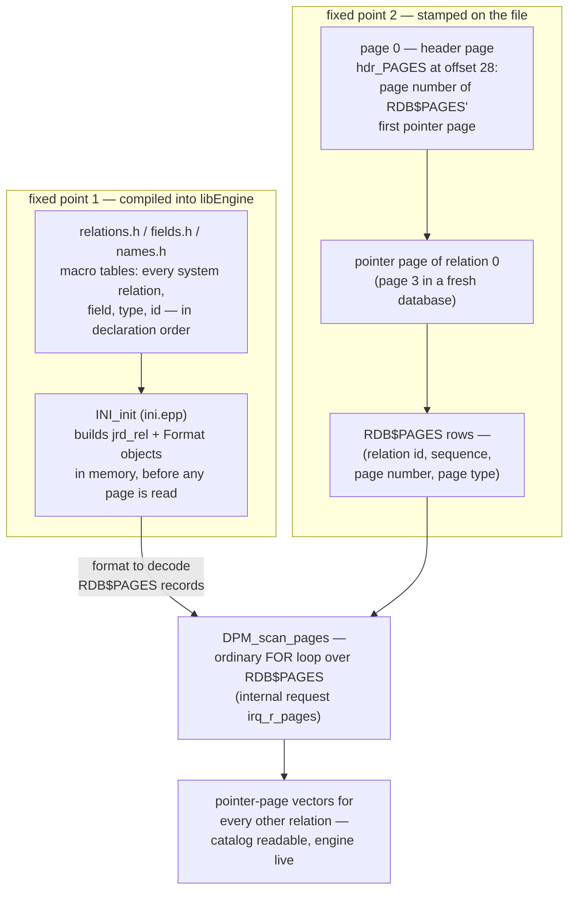
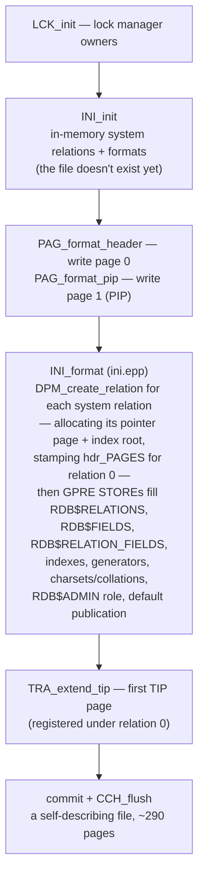

# How the Engine Bootstraps Its Own Catalog

Firebird stores everything it knows about a database — tables, columns, indexes, [record formats](on-disk-structure.md) — in system tables: `RDB$RELATIONS`, `RDB$FIELDS`, `RDB$PAGES`. The [request-trace document](request-lifecycle-code-trace.md) showed the engine reading and writing those tables with its own query machinery, through MET and the MetadataCache. Which raises the bootstrap question that this document answers: **to read `RDB$RELATIONS` you must know its record format and where its pages are — and both of those facts live in `RDB$RELATIONS` and its sibling tables.** The engine escapes the circle with exactly two fixed points: system-table formats **compiled into the binary** (`src/jrd/ini.epp` and the macro tables it includes), and **one page number stamped on the header page** (`hdr_PAGES`). Everything else — sixty system relations, hundreds of columns, every user table ever created — unwinds from those two anchors. All of it verified below on a freshly created database, down to the hex dump.

A short, deep-cut companion to the [request trace](request-lifecycle-code-trace.md) (MET/MetadataCache), [the metadata cache](metadata-cache.md) (what the objects built here become once the engine is running, and how they are versioned and invalidated), the [on-disk structure document](on-disk-structure.md) (page types, record formats) and the [DDL path](request-lifecycle-code-trace.md#stage-7-exe-and-the-ddl-path-into-met) (how the catalog is *modified* once it exists).

**Table of Contents**

* [The chicken-and-egg problem](#the-chicken-and-egg-problem)
* [Fixed point one: formats as code](#fixed-point-one-formats-as-code)
* [Fixed point two: hdr_PAGES and the self-describing RDB$PAGES](#fixed-point-two-hdr_pages-and-the-self-describing-rdbpages)
* [What CREATE DATABASE actually writes, in order](#what-create-database-actually-writes-in-order)
* [What attach actually reads, in order](#what-attach-actually-reads-in-order)
* [Bootstrap in action (validated)](#bootstrap-in-action-validated)
* [Comparison: PostgreSQL, MySQL, SQLite](#comparison-postgresql-mysql-sqlite)
* [Discussion](#discussion)
* [Further research](#further-research)

## The chicken-and-egg problem

To fetch a row the engine needs two things ([trace doc, DML section](request-lifecycle-code-trace.md#the-dml-counterpart-a-simple-select-and-a-join)): the relation's **pointer pages** (to find data pages) and its **record format** (to decode the bytes). For a user table both come from the catalog — pointer pages from `RDB$PAGES` rows, formats from `RDB$FORMATS` blobs. But the catalog *is a set of tables*: reading `RDB$PAGES` requires knowing `RDB$PAGES`' own pointer pages and format first. Two independent regressions, two independent fixed points:



_Figure 1: The two bootstrap anchors — formats compiled into the binary, one page number stamped on the header — and the scan that unwinds everything else from them_

## Fixed point one: formats as code

System-table shapes are not data; they are **source code**. Three macro-driven headers define the whole catalog:

* [`relations.h`](https://github.com/FirebirdSQL/firebird/blob/master/src/jrd/relations.h) — every system relation as a `RELATION(name, id, ods, type)` block listing its `FIELD`s. The comment at the top is the crucial contract: *"Order of relations in this file affect their IDs"* — `RDB$PAGES` is declared first and is relation 0 forever, `RDB$DATABASE` 1, `RDB$FIELDS` 2, `RDB$RELATIONS` 6. These ids are burned into every database file ever created, which is why the list may only be appended to.
* `fields.h` — the global field definitions behind them, materialized as the `gfld` array in [`ini.h`](https://github.com/FirebirdSQL/firebird/blob/master/src/jrd/ini.h): dtype, length, subtype, nullability, default-value BLR, and the ODS version each field appeared in.
* `names.h` — the string table both reference by index.

`ini.h` includes `relations.h` twice with different macro definitions (the classic [X-macro](https://en.wikipedia.org/wiki/X_macro) technique) to produce `relfields` — a flat integer array the runtime walks. **`INI_init`** ([`ini.epp`](https://github.com/FirebirdSQL/firebird/blob/master/src/jrd/ini.epp)) does the walk at every attach *before any page is read*: for each system relation it creates the in-memory relation object (`MetadataCache::getVersioned` with `AUTOCREATE | NOSCAN` — *no scan*, precisely because scanning would need what we're building) and then constructs its `Format` descriptors field by field — offsets, alignment, null-flag bytes — the same `Format` objects a [compiled request](request-lifecycle-code-trace.md#stage-6-cmp--compiling-blr-into-a-runnable-statement) uses to decode any record.

One subtlety shows the mechanism's age and care: `INI_init` builds a format **per ODS minor version** — it replays the field list against each historical minor version (`fld[RFLD_F_ODS]` gates fields by the ODS that introduced them), generating the full format *history* of each system table, so a database created by an older minor release still decodes correctly. Version evolution for user tables lives in `RDB$FORMATS`; for system tables it lives in this loop.

The proof that formats never touch disk is one query away, and it is stark: a freshly created database has **sixty** system relations with **598** columns — and **zero rows in `RDB$FORMATS`** (validated below). The engine can describe every system table while `RDB$FORMATS` is empty because the descriptions are in `libEngine`, not in the file.

## Fixed point two: hdr_PAGES and the self-describing RDB$PAGES

Formats decode records; something still has to *find* them. For every relation, the chain is pointer pages → data pages, and the pointer-page numbers come from **`RDB$PAGES`** — four columns: relation id, page sequence, page number, page type. For `RDB$PAGES` itself, the recursion is cut by a single `ULONG` on the header page: **`hdr_PAGES`**, at byte offset 28 of page 0 ([`ods.h`](https://github.com/FirebirdSQL/firebird/blob/master/src/jrd/ods.h) even `static_assert`s the offset) — the page number of relation 0's first pointer page. [`DPM`](https://github.com/FirebirdSQL/firebird/blob/master/src/jrd/dpm.epp) stamps it when that pointer page is allocated at creation; `PAG_init` reads it back at attach and seeds relation 0's in-memory page vector — with a comment noting the location *can never change* for the life of the file.

`DPM_scan_pages` then performs the bootstrap's prettiest move: it first extends relation 0's own vector by chasing the pointer pages' `ppg_next` links directly (RDB$PAGES' additional pointer pages can't be looked up in RDB$PAGES without infinite recursion — the code says so in a comment), and *then* runs an ordinary GPRE `FOR X IN RDB$PAGES` internal request to load every other relation's page vectors. From that moment the catalog is just tables.

Relation 0 moonlights as the anchor for pages that belong to no relation at all: [TIP pages](transactions-and-concurrency.md) (`pag_transactions`), generator pages (`pag_ids`) and [SCN pages](backup-and-recovery.md) are all registered in `RDB$PAGES` under relation id 0 — visible in the live query below.

## What CREATE DATABASE actually writes, in order

The creation path in [`jrd.cpp`](https://github.com/FirebirdSQL/firebird/blob/master/src/jrd/jrd.cpp) is the bootstrap run forward:



_Figure 2: Creation order — in-memory formats first, two fixed pages, then the engine INSERTs its own catalog into itself_

The remarkable part is step D: `INI_format` populates the system tables **using the engine's own storage path** — the GPRE `STORE` blocks compile to [internal BLR requests](request-lifecycle-code-trace.md#stage-7-exe-and-the-ddl-path-into-met) running through EXE → `VIO_store` → `DPM_store`, exactly like a user `INSERT`. The very first row ever written into a Firebird database is written by the same code path as every row after it. There is no special bootstrap writer, no BKI script, no dump to replay — the compiled-in formats plus the ordinary engine are sufficient.

## What attach actually reads, in order

Attaching to an existing file mirrors it: `LCK_init` → **`INI_init`** (in-memory formats, before any I/O) → `PAG_header_init`/`PAG_init` (read page 0, verify ODS, seed relation 0's page vector from `hdr_PAGES`) → `CCH_init` (page cache) → `DPM_scan_pages` (load all page vectors via the RDB$PAGES scan) → `INI_init_sys_relations` (upgrade formats of system relations that carry field defaults) → and from there, normal [MET/MetadataCache](request-lifecycle-code-trace.md#stage-7-exe-and-the-ddl-path-into-met) scans read whatever else is needed, lazily. User relations pull their formats from `RDB$FORMATS` blobs on first touch; system relations never look, because theirs were installed at step two.

## Bootstrap in action (validated)

A fresh database (`CREATE DATABASE`, page size 8192, nothing else) — first, the file itself. Byte 0 of every page is its type; the first twelve pages, plus the header word at offset 28:

```
page  0: type 1   pag_header
page  1: type 2   pag_pages        (PIP - page inventory)
page  2: type 10  pag_scns         (SCN inventory, nbackup)
page  3: type 4   pag_pointer      ← RDB$PAGES' pointer page
page  4: type 6   pag_root         ← RDB$PAGES' index root
page  5: type 5   pag_data
page  6: type 4   pag_pointer      (next system relation)
page  7: type 6   pag_root
...                                (pointer/root pairs continue)

hdr_PAGES (offset 28, 4 bytes LE) = 3
```

The header points at page 3, and pages 3 onward are `DPM_create_relation`'s per-relation pointer/root pairs, laid down in `relations.h` declaration order. Now the catalog view of the same facts — `RDB$PAGES` describing itself and carrying the no-relation pages under id 0:

```
RDB$PAGE_NUMBER RDB$RELATION_ID RDB$PAGE_SEQUENCE RDB$PAGE_TYPE
            287               0                 0             3   ← TIP
              3               0                 0             4   ← its own pointer page
              4               0                 0             6   ← its own index root
             85               0                 0             9   ← generator page
             16               6                 0             4   ← RDB$RELATIONS' pointer page
             17               6                 0             6
```

Row two is the bootstrap in one line: *the row that says where `RDB$PAGES` lives, stored in `RDB$PAGES`* — readable only because `hdr_PAGES` already told the engine the answer. The fixed ids check out (`RDB$PAGES` 0, `RDB$DATABASE` 1, `RDB$FIELDS` 2, `RDB$RELATIONS` 6), and the formats-as-code proof:

```
FORMATS_ROWS = 0        ← RDB$FORMATS is empty
SYS_RELATIONS = 60      ← yet 60 system relations exist
SYS_FIELDS   = 598      ← with 598 columns
```

Then `CREATE TABLE t1 (a INTEGER); ALTER TABLE t1 ADD b VARCHAR(10);` — and `RDB$FORMATS` gains exactly two rows, both for relation 128 (the first user id), formats 1 and 2. User tables version their shapes in the catalog; system tables version theirs in `INI_init`'s ODS loop.

## Comparison: PostgreSQL, MySQL, SQLite

Every engine with a self-hosted catalog faces the same regression and cuts it the same two ways — compiled-in shape knowledge plus a fixed disk anchor — but the engineering idioms differ tellingly:

| | **Firebird** | **PostgreSQL** | **MySQL 8.0+ / InnoDB** | **SQLite** |
|---|---|---|---|---|
| Catalog lives in | system tables (`RDB$…`), ordinary storage | system tables (`pg_class`, `pg_attribute`, …) | InnoDB data-dictionary tables (`mysql.ibd`) | one table: `sqlite_schema` |
| Compiled-in shape | `relations.h`/`fields.h` X-macros → `INI_init` formats | `Catalog.pm`/`genbki.pl` generate `postgres.bki` + `schemapg.h`; core catalogs' descriptors hard-wired in relcache | dictionary DDL compiled into the server (`dd::` bootstrap executes it at initialize) | `sqlite_schema`'s schema is defined by the file-format spec itself |
| Disk anchor | `hdr_PAGES` on page 0 → `RDB$PAGES` | `global/pg_filenode.map` (maps core catalog OIDs to files); fixed OIDs | dictionary-header page in the system tablespace | **page 1 is always `sqlite_schema`'s root** |
| Who writes the first catalog rows | the engine itself (`INI_format`, normal `VIO_store` path) | `initdb` replaying the generated BKI script in a special bootstrap mode | server in initialize mode executing compiled-in DDL | the library, on first `CREATE` |
| Bootstrap tool | none — `CREATE DATABASE` is an API call | `initdb` (mandatory external step) | `mysqld --initialize` | none |

* **SQLite** is the minimal fixed point: root page of the one catalog table is *always page 1*, its columns are frozen in the file format, done. Firebird's `hdr_PAGES` is the same idea with one indirection (the anchor is a pointer, not a fixed location).
* **PostgreSQL** is the maximal apparatus: a Perl generator emits both the C descriptors and a bootstrap script, and a dedicated `initdb` phase runs a special-mode backend to replay it. Where Firebird's `CREATE DATABASE` is one engine call writing ~290 self-describing pages, PostgreSQL cluster creation is an external program with its own mini-language.
* **MySQL** only joined this club in 8.0 — before that the dictionary was `.frm` files beside the storage engine, the source of a whole genre of inconsistency bugs; the move to transactional InnoDB-stored dictionary tables is an endorsement of the design Firebird (via InterBase) has had since the 1980s.

## Discussion

The bootstrap is a fitting capstone to the [request-trace](request-lifecycle-code-trace.md) story, because it is the same story run from nothing: the engine's *only* mechanism for durable data is relations-with-formats-on-pages, so the catalog is made of relations, and the two facts that can't be self-hosted — the shape of the shape-tables, the location of the location-table — are pinned in code and in one header word. Nothing else is special. The first row `CREATE DATABASE` writes goes through `VIO_store` like any user insert; `DPM_scan_pages` finds tables with an ordinary query; even system-table format evolution reuses the ODS versioning discipline. It is the collection's recurring theme — [existing machinery composed, not new machinery added](READING-GUIDE.md) — applied at the one place where there was, briefly, no machinery at all.

## Hands-on: samples, tests and debugging

### C++ sample — [`samples/cpp/catalog.cpp`](samples/cpp/catalog.cpp)

The whole bootstrap argument, replayed as four client queries against a database the sample drops and recreates on every run (so the numbers are always those of a *fresh* file). It shows the [fixed relation ids](#fixed-point-one-formats-as-code) (`RDB$PAGES` 0, `RDB$DATABASE` 1, `RDB$FIELDS` 2, `RDB$RELATIONS` 6), then `RDB$PAGES` describing itself and carrying the no-relation pages (TIP, generator page) under id 0 — and reads byte 28 of page 0 directly to prove [`hdr_PAGES`](#fixed-point-two-hdr_pages-and-the-self-describing-rdbpages) agrees with the catalog row. Then the formats-as-code proof (`RDB$FORMATS` empty against 60 system relations / 598 columns), and finally `CREATE TABLE` + `ALTER TABLE` planting the first user formats. Run it on the server machine (it reads the file the server wrote).

```sh
cmake -B build samples && cmake --build build
./build/catalog        # default: inet://localhost//tmp/fbhandson/catalog.fdb
```

Verified output:

```text
-- 1. fixed relation ids (relations.h declaration order) --
ID NAME
-- -------------
0  RDB$PAGES
1  RDB$DATABASE
2  RDB$FIELDS
6  RDB$RELATIONS

-- 2. RDB$PAGES describing relation 0 (itself) and relation 6 (RDB$RELATIONS) --
RDB$PAGE_NUMBER RDB$RELATION_ID RDB$PAGE_SEQUENCE RDB$PAGE_TYPE
--------------- --------------- ----------------- -------------
287             0               0                 3
3               0               0                 4
4               0               0                 6
85              0               0                 9
16              6               0                 4
17              6               0                 6

hdr_PAGES (page 0, offset 28) = 3  <- matches the (relation 0, type 4) row above

-- 3. formats as code: zero stored formats, yet a full catalog --
FORMATS_ROWS SYS_RELATIONS SYS_FIELDS
------------ ------------- ----------
0            60            598

-- 4. user DDL writes formats into the catalog --
RDB$RELATION_ID RDB$FORMAT DESCRIPTOR_BYTES
--------------- ---------- ----------------
128             1          16
128             2          28

(relation id of T1: 128 — the first user id; system tables still contribute no rows)
done.
```

Section 2's second row is this document's [thesis in one line](#bootstrap-in-action-validated): the row saying where `RDB$PAGES` lives, stored in `RDB$PAGES`, readable only because `hdr_PAGES` already said "page 3".

### JavaScript sample — [`samples/nodejs/catalog.js`](samples/nodejs/catalog.js)

The same four steps over the wire protocol (`cd samples/nodejs && node catalog.js`), with the `hdr_PAGES` cross-check done the Node way — `fs.readSync` of four bytes at offset 28, `readUInt32LE`. Verified output matches the C++ run (same fixed ids, same `0 / 60 / 598`, same two format rows for relation 128); only incidental page numbers differ (e.g. the TIP landed on page 223 rather than 287 — allocation order is not part of the contract, the fixed points are). One driver note: `Firebird.drop()` holds its socket open, so the sample ends with an explicit `process.exit(0)`.

### Things to try

- Add a third DDL statement (`ALTER TABLE t1 ALTER b TYPE VARCHAR(20)`) and watch `RDB$FORMATS` grow to format 3 — then `SELECT` the table and see all rows decode, the lazy-conversion story of [the metadata-cache document](metadata-cache.md#formats-the-on-disk-half-of-the-same-idea).
- Extend query 2 to `rdb$relation_id in (0, 1, 2, 6, 128)`: after step 4, user table T1's pointer page and index root appear in `RDB$PAGES` exactly like the system relations' — one storage path for everything.
- List *all* rows with `rdb$relation_id = 0` on a database that has lived a while (many TIP pages, `rdb$page_sequence` counting up) — relation 0 as the registry of pages that belong to no table.
- Compare `select count(*) from rdb$relations where rdb$system_flag = 1 and rdb$relation_type = 0` with the total of 60: the difference is the virtual (`MON$`/`SEC$`) relations that own no pages at all.

### Debugging this in C++ (gdb)

With a [debug build of the engine](debugging-firebird.md) (note: `ini.epp`/`dpm.epp` are GPRE-preprocessed into `.cpp` at build time; the function names below survive unchanged):

```gdb
break INI_init            # src/jrd/ini.epp:973  — formats built from relations.h, before any I/O
break PAG_init            # src/jrd/pag.cpp:1173 — hdr_PAGES read, relation 0's vector seeded
break DPM_scan_pages      # src/jrd/dpm.epp:2150 — the RDB$PAGES scan that loads everyone else
break INI_format          # src/jrd/ini.epp:682  — creation only: the engine INSERTs its own catalog
break DPM_create_relation # src/jrd/dpm.epp:588  — a pointer-page/index-root pair being allocated
```

Attach (or create) a database under the debugger and the breakpoints fire in bootstrap order — `INI_init` before the file is even open, `PAG_init` with the header page in hand, then `DPM_scan_pages`. Inside `INI_init` the loop variables walk the `relfields` array (the X-macro output of `relations.h`); at `DPM_scan_pages` you can watch the anti-recursion step extend relation 0's own vector before the ordinary `FOR X IN RDB$PAGES` request runs; and on a `CREATE DATABASE`, `INI_format`'s backtrace bottoms out in `VIO_store`/`DPM_store` — the proof that the first catalog row travels the same path as every user row. See the [debugging guide](debugging-firebird.md) for the embedded-attach recipe.

## Further research

* [`src/jrd/ini.epp`](https://github.com/FirebirdSQL/firebird/blob/master/src/jrd/ini.epp) — `INI_init` (the format builder) and `INI_format` (the creation-time population); [`ini.h`](https://github.com/FirebirdSQL/firebird/blob/master/src/jrd/ini.h) for the `gfld` array and the double inclusion of `relations.h`.
* [`src/jrd/relations.h`](https://github.com/FirebirdSQL/firebird/blob/master/src/jrd/relations.h) — the catalog's source of truth; read the ordering comment first. [`ids.h`](https://github.com/FirebirdSQL/firebird/blob/master/src/jrd/ids.h) shows the same file generating the id enums.
* [`src/jrd/dpm.epp`](https://github.com/FirebirdSQL/firebird/blob/master/src/jrd/dpm.epp) — `DPM_scan_pages` (with the anti-recursion comment), `DPM_create_relation`, `DPM_pages`.
* [`src/jrd/ods.h`](https://github.com/FirebirdSQL/firebird/blob/master/src/jrd/ods.h) — `hdr_PAGES` and its offset assertion; the page-type constants decoded in the live demo.
* PostgreSQL: [System Catalog Declarations and Initial Contents](https://www.postgresql.org/docs/current/bki.html) — the BKI machinery, the direct counterpart to `ini.epp`.
* SQLite: [Database File Format](https://www.sqlite.org/fileformat2.html) — §1.6 and §2.1: page 1 and the `sqlite_schema` fixed point.
* Companion docs: [request trace](request-lifecycle-code-trace.md) (MET, internal requests, the DDL path this bootstrap precedes) · [on-disk structure](on-disk-structure.md) (page types, formats, ODS) · [architecture comparison](architecture-comparison.md).
