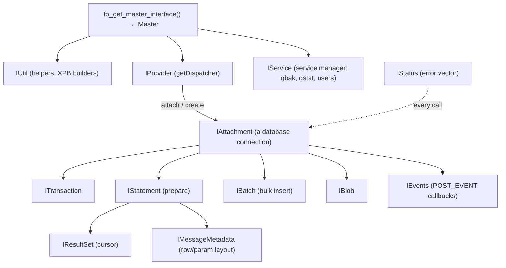
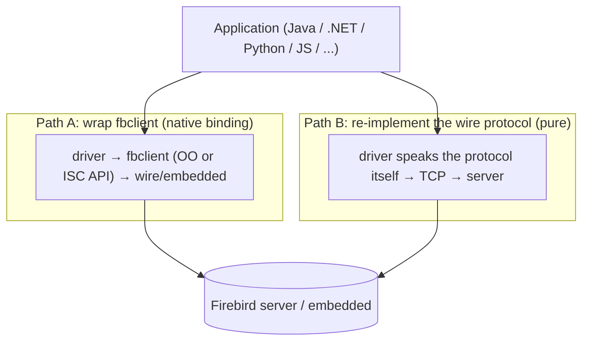

# Client APIs and Drivers Across Languages

An engine is only as useful as the ways you can talk to it. This document describes how applications connect to Firebird — the two C-level APIs the engine exposes (the modern **object-oriented API** and the legacy **ISC API**), the two architectural strategies drivers use to reach the server (wrap the client library, or re-implement the wire protocol), and the driver ecosystem across languages — grounded in the vendored headers and the runnable [`samples/`](samples/) in this repository, then compared with how PostgreSQL, MySQL and SQLite expose client access.

It is the natural bookend to the [wire-protocol document](firebird-wire-protocol.md) (what the pure-protocol drivers implement) and the [samples](samples/README.md) (working OO-API C++ and pure-JS clients), and it complements the [embedded comparison](embedded-architecture-comparison.md) (the same client library is also the embedded engine).

**Table of Contents**

* [Two C APIs: OO and ISC](#two-c-apis-oo-and-isc)
* [The object-oriented API](#the-object-oriented-api)
* [Two ways to build a driver](#two-ways-to-build-a-driver)
* [The driver ecosystem by language](#the-driver-ecosystem-by-language)
* [Worked examples in this repository](#worked-examples-in-this-repository)
* [Comparison: PostgreSQL, MySQL, SQLite](#comparison-postgresql-mysql-sqlite)
* [Discussion](#discussion)
* [Further research](#further-research)

## Two C APIs: OO and ISC

The Firebird client library (`fbclient`) exposes **two** C-level APIs, and every higher-level driver that wraps the library builds on one of them:

- **The ISC API** (`ibase.h`) — the original InterBase C API: flat `isc_*` functions (`isc_attach_database`, `isc_dsql_prepare`, `isc_dsql_execute`, `isc_dsql_fetch`, `isc_start_transaction`, …), status vectors, and the `XSQLDA` descriptor for binding columns and parameters. Stable, ubiquitous, and still fully supported, but verbose and untyped.
- **The object-oriented API** (`firebird/Interface.h`, since Firebird 3) — an interface-based C++ API obtained from a single entry point, `fb_get_master_interface()`. It is the *supported modern interface*, cleaner and safer, and the one used by this repository's [`samples/client_test.cpp`](samples/client_test.cpp) and [`samples/protocol_client.cpp`](samples/protocol_client.cpp).

Both APIs drive the same engine through the Y-valve (see the [main paper](README.md#top-level-architecture)); a program can even mix them. New code should use the OO API; the ISC API remains for compatibility and for the many mature drivers built on it.

## The object-oriented API

The OO API is a set of reference-counted C++ interfaces (`I*`) reached from the master interface. The object model an application walks:



_Figure 1: The Firebird OO API object model — from IMaster to a connection (IAttachment), transactions, prepared statements, cursors, batches, blobs, events and services_

Notable interfaces beyond the basics: **`IBatch`** for high-throughput bulk insert (batched round-trips), **`IEvents`** for the asynchronous event mechanism (`POST_EVENT` in a trigger notifies listening clients — a lightweight pub/sub), **`IService`** for the service manager (backup, statistics, user management without SQL), and **`IMessageMetadata`** which describes a row's exact binary layout for zero-copy fetch. Errors flow through **`IStatus`**; the `ThrowStatusWrapper` used in the samples turns them into C++ exceptions.

Because it is *interface-based* rather than a flat function table, the OO API is unusual among database C APIs — it looks more like COM/CORBA than like libpq. That design is what lets the same interfaces describe client calls, plugins (auth, crypt, external engines — see [extensibility](extensibility.md)), and the engine itself.

## Two ways to build a driver

Every Firebird driver for a higher-level language takes one of two architectural paths — the same split described in the [wire-protocol document](firebird-wire-protocol.md#client-implementations-nodejs--typescript-and-others):



_Figure 2: The two driver strategies — bind to the native `fbclient` library, or re-implement the wire protocol in the host language_

- **Path A — wrap `fbclient`.** The driver calls the OO or ISC API through a native binding (JNI, P/Invoke, `ctypes`, N-API). It inherits protocol support, wire encryption, authentication plugins and **embedded mode** automatically, but requires the client library to be installed and a native build step.
- **Path B — re-implement the protocol.** The driver speaks the [wire protocol](firebird-wire-protocol.md) directly over a socket, including the SRP handshake and `op_crypt`. It is dependency-free and portable (no native library, works everywhere the language runs), at the cost of tracking protocol changes by hand — and it cannot do embedded (there is no server to talk to).

Both paths reach the same server; the choice is a trade-off between zero-dependency portability and automatic feature parity. This repository demonstrates both in Node.js: [`samples/nodejs/query.js`](samples/nodejs/query.js) (Path B, pure JS) and the OO-API C++ clients (Path A).

## The driver ecosystem by language

| Language | Driver | Strategy | Notes |
|---|---|---|---|
| **C / C++** | fbclient OO API / ISC API | native (is the library) | [`Interface.h`](https://github.com/FirebirdSQL/firebird/blob/master/src/include/firebird/Interface.h) / [`ibase.h`](https://github.com/FirebirdSQL/firebird/blob/master/src/include/firebird/ibase.h); the samples here |
| **Java** | [Jaybird](https://github.com/FirebirdSQL/jaybird) (JDBC) | **pure** (+ optional native) | Pure-Java wire protocol; the reference JDBC driver |
| **.NET** | [FirebirdSql.Data.FirebirdClient](https://github.com/FirebirdSQL/NETProvider) (ADO.NET) | **pure** | Managed provider ([NuGet](https://www.nuget.org/packages/FirebirdSql.Data.FirebirdClient)); Entity Framework support |
| **Python** | [firebird-driver](https://github.com/FirebirdSQL/python3-driver) | native (OO API via ctypes) | Official; [PyPI](https://pypi.org/project/firebird-driver/); DB-API 2.0 |
| **Node.js / TS** | [node-firebird](https://github.com/hgourvest/node-firebird) | **pure** JS | Path B; used by the samples |
| | [node-firebird-driver-native](https://github.com/asfernandes/node-firebird-drivers) | native (OO API) | TypeScript, wraps fbclient |
| **PHP** | [PDO_Firebird](https://www.php.net/manual/en/ref.pdo-firebird.php) | native | Bundled PDO driver |
| **Perl** | [DBD::Firebird](https://github.com/pilcrow/perl-dbd-firebird) | native | DBI driver |
| **Go** | [nakagami/firebirdsql](https://pkg.go.dev/github.com/nakagami/firebirdsql) | **pure** Go | `database/sql` driver |
| **Delphi / C++Builder** | FireDAC / IBX | native | Native VCL/FMX access |
| **ODBC** | [Firebird ODBC driver](https://github.com/FirebirdSQL/firebird-odbc-driver) | native | For ODBC-consuming tools |

A pattern emerges: the **managed-runtime** drivers (Java, .NET, Go, and one of the Node options) tend to be **pure** re-implementations — because shipping a native library into a JVM/CLR/Go binary is painful, and the protocol is stable enough to track — while the **native-code** ecosystems (Python, PHP, Perl, Delphi, ODBC, C++) tend to **wrap fbclient**, inheriting embedded mode and every plugin for free.

## Worked examples in this repository

The [`samples/`](samples/) directory contains both driver strategies against the same server, all verified live (see [samples/README.md](samples/README.md) and the [wire-protocol document](firebird-wire-protocol.md#worked-examples)):

- [`samples/client_test.cpp`](samples/client_test.cpp) — the **OO API** in C++: `fb_get_master_interface()` → `IProvider` → `IAttachment` → `IStatement`/`IResultSet`, creating a database, running DDL and a cursor fetch (Path A, embedded).
- [`samples/protocol_client.cpp`](samples/protocol_client.cpp) — the OO API over TCP, introspecting the negotiated protocol/auth/crypt (Path A, networked).
- [`samples/nodejs/query.js`](samples/nodejs/query.js) — the pure-JS **node-firebird** driver (Path B).
- [`samples/nodejs/srp-handshake.js`](samples/nodejs/srp-handshake.js) — the wire protocol and SRP/Arc4 by hand, showing exactly what a Path-B driver must implement.

The essence of the OO API, from `client_test.cpp`:

```cpp
IMaster* master = fb_get_master_interface();
ThrowStatusWrapper status(master->getStatus());
IProvider* prov = master->getDispatcher();
IAttachment* att = prov->attachDatabase(&status, database, dpbLen, dpb);
ITransaction* tra = att->startTransaction(&status, 0, nullptr);
IResultSet* rs = att->openCursor(&status, tra, 0, sql, SQL_DIALECT_CURRENT,
                                 nullptr, nullptr, nullptr, nullptr, 0);
while (rs->fetchNext(&status, buffer) == IStatus::RESULT_OK) { /* ... */ }
```

versus the same round-trip in pure-JS node-firebird (`query.js`):

```js
Firebird.attach(options, (err, db) => {
  db.query('select ... from employee', (err, rows) => { /* ... */ });
});
```

## Comparison: PostgreSQL, MySQL, SQLite

| Aspect | **Firebird** | **PostgreSQL** | **MySQL** | **SQLite** |
|---|---|---|---|---|
| Native C client | `fbclient` (OO API + ISC API) | `libpq` | `libmysqlclient` / Connector/C | The library itself (`sqlite3.h`) |
| Client/server protocol | Yes (documented in tree) | Yes ([documented](https://www.postgresql.org/docs/current/protocol.html)) | Yes (documented) | **None** (in-process) |
| Pure-language drivers | Jaybird, .NET, node-firebird, Go | pgjdbc, Npgsql, node-postgres, … | Connector/J, mysql2, Go, … | **N/A** (bindings only) |
| Native-binding drivers | Python, PHP, Perl, ODBC, Delphi | psycopg (libpq), … | many (libmysqlclient) | **All** (every binding wraps the C lib) |
| Embedded via same lib | **Yes** (client lib = engine) | No | No | Yes (there is only the lib) |
| Standard API shape | OO C++ interfaces (+ flat ISC) | Flat C (`libpq`) | Flat C | Flat C |
| Async events | `IEvents` / `POST_EVENT` | `LISTEN`/`NOTIFY` | No (poll) | No |
| Service/admin API | `IService` (service manager) | libpq + SQL | C API + SQL | N/A |
| Connection pooling | Driver-level / external | Driver / PgBouncer | Driver / ProxySQL | N/A (no connections) |

## Discussion

**SQLite is the categorical outlier: it has no client API at all, only bindings.** Because it is an [in-process library](embedded-architecture-comparison.md), every "driver" (`better-sqlite3`, Python's stdlib `sqlite3`, Xerial JDBC) is a thin binding to the same C library linked into the process — there is no protocol, no connection, no network client. The three server databases each expose a C client library *and* a documented wire protocol, which is precisely what enables their rich ecosystems of both native-binding and pure-language drivers. This is the client-side reflection of the [embedded-vs-server divide](embedded-architecture-comparison.md) that runs through the whole series.

**Firebird's distinctive client-side trait is the OO API and the embedded/networked duality.** Where PostgreSQL, MySQL and SQLite all offer a *flat C* client API, Firebird's modern API is *interface-based* C++ — closer to COM than to libpq — and the same `fbclient` that a networked driver binds to is also the embedded engine, so a native-binding driver gets embedded mode for free (a driver for PostgreSQL or MySQL cannot). The cost is that the OO API is less trivially wrapped by a `ctypes`-style FFI than a flat C API, which is part of why several Firebird drivers chose the pure-protocol path.

**The native-vs-pure split is universal, and the runtime decides.** All three server databases show the same pattern Firebird does: managed runtimes (JVM, CLR, Go) favour pure-protocol drivers (pgjdbc, Npgsql, Connector/J, node-postgres, mysql2 all re-implement their protocol), while native ecosystems (Python's psycopg, PHP) often wrap the C client. The Firebird ecosystem is a faithful instance of this — Jaybird, .NET and node-firebird are pure; Python, PHP, Perl and ODBC wrap `fbclient`. The engineering trade-off is identical everywhere: zero-dependency portability versus automatic feature parity (encryption, new auth plugins, embedded) inherited from the vendor's library.

## Hands-on: samples, tests and debugging

### C++ sample — [`samples/cpp/api_styles.cpp`](samples/cpp/api_styles.cpp)

The [two C APIs](#two-c-apis-oo-and-isc) side by side in one file, running one identical `SELECT` (the engine version) through each. The ISC half is the full legacy liturgy: a DPB assembled byte by byte (tag, length, payload), a 20-slot `ISC_STATUS_ARRAY` checked after every call and rendered by walking the vector with `fb_interpret`, the `allocate → prepare → execute → fetch` DSQL lifecycle, and an `XSQLDA` descriptor whose one `XSQLVAR` the *caller* must point at storage honouring the declared type (a VARCHAR's 2-byte length prefix included). The OO half does the same work in five lines through [`fb_sample.h`](samples/cpp/fb_sample.h) — `IXpbBuilder` builds the DPB, `ThrowStatusWrapper` turns the status vector into exceptions, `IMessageMetadata` replaces the XSQLDA. Same process, same `fbclient`, same [Y-valve](README.md#top-level-architecture) underneath both. (For the OO API written out longhand rather than through the helper, see [`samples/client_test.cpp`](samples/client_test.cpp); for the pure-protocol Path B in C++-free form, the [wire-protocol document](firebird-wire-protocol.md#worked-examples).)

```sh
cmake -B build samples && cmake --build build
./build/api_styles               # default: inet://localhost/employee
```

Verified output:

```text
[ISC API] engine version = 6.0.0
[OO API ] engine version = 6.0.0
same engine, same Y-valve, two API styles. done.
```

### JavaScript sample — [`samples/nodejs/query.js`](samples/nodejs/query.js)

The JavaScript counterpart is the existing [`query.js`](samples/nodejs/query.js) (`cd samples/nodejs && node query.js`), and the architectural point is *which path it takes*: node-firebird is a **Path B** driver ([Figure 2](#two-ways-to-build-a-driver)) — no `fbclient` is loaded at all; the driver re-implements the wire protocol, SRP and Arc4 in JavaScript. So where `api_styles.cpp` shows two APIs over one client library, `query.js` shows no client library whatsoever — the two driver strategies of this document, both verified against the same server (re-run output in the [wire-protocol document](firebird-wire-protocol.md#worked-examples)).

### Things to try

- Break the password in `iscStyle()` and in `ooStyle()` and compare how the same `isc_login` error surfaces: `fb_interpret` loop output versus one `FbException` — the two error models of the [API table](#comparison-postgresql-mysql-sqlite).
- In the ISC half, set `out->sqln = 0` before `isc_dsql_prepare` and re-describe with `isc_dsql_describe` — the classic two-step dance every ISC-era driver performs when it doesn't know the column count in advance.
- Point the sample at an embedded path (`/tmp/fbhandson/api.fdb` with `FIREBIRD` unset, per the [debugging guide](debugging-firebird.md)) — both API styles work unchanged in-process: the embedded/networked duality of the [Discussion](#discussion).
- Change `SQL` to return two columns and extend the XSQLDA to `XSQLDA_LENGTH(2)` — the amount of new bookkeeping in the ISC half versus zero change in the OO half *is* the argument for the OO API.

### Debugging this in C++ (gdb)

The Y-valve is where the two styles converge, and a debug `fbclient` makes that visible (functions below verified in the vendored tree):

```gdb
break isc_attach_database        # src/yvalve/why.cpp:1640 — the ISC entry point...
break Dispatcher::attachDatabase # why.cpp:6492 — ...lands here, same as the OO call
break isc_dsql_prepare           # why.cpp:2671 — ISC prepare, XSQLDA in hand
break isc_dsql_fetch             # why.cpp:2545 — per-row fetch through the shim
break JProvider::attachDatabase  # src/jrd/jrd.cpp:1585 — engine side (embedded runs only)
```

The first two breakpoints demonstrate this document's central claim in a single backtrace: `isc_attach_database` (why.cpp:1640) does nothing but parse its handle-based arguments and call `dispatcher->attachDatabase(...)` (why.cpp:1661) — **the ISC API is a compatibility shim implemented on top of the OO API**, so `iscStyle()` and `ooStyle()` meet at the same `Dispatcher::attachDatabase`, which then walks the provider list (why.cpp:6585) exactly as Figure 6 of the main paper draws it. Run the sample against a local file path with `FIREBIRD` pointing at a debug build and the last breakpoint fires too, showing the whole journey ISC shim → Y-valve → Engine provider in one process; over TCP the trail instead disappears into the remote provider's `op_attach` (see the [wire-protocol hands-on](firebird-wire-protocol.md#hands-on-samples-tests-and-debugging)). Recipe: [debugging guide](debugging-firebird.md).

## Further research

**Firebird**

- [`doc/Using_OO_API.md`](https://github.com/FirebirdSQL/firebird/blob/master/doc/Using_OO_API.md) — the object-oriented API guide; [`Interface.h`](https://github.com/FirebirdSQL/firebird/blob/master/src/include/firebird/Interface.h) and [`ibase.h`](https://github.com/FirebirdSQL/firebird/blob/master/src/include/firebird/ibase.h) — the two APIs.
- This repository's [`samples/`](samples/README.md) (OO-API C++ and pure-JS clients) and the [wire-protocol document](firebird-wire-protocol.md) (what pure drivers implement).
- Drivers: [Jaybird (Java)](https://github.com/FirebirdSQL/jaybird), [.NET provider](https://github.com/FirebirdSQL/NETProvider), [Python firebird-driver](https://github.com/FirebirdSQL/python3-driver), [node-firebird](https://github.com/hgourvest/node-firebird) & [node-firebird-driver (TS)](https://github.com/asfernandes/node-firebird-drivers), [PDO_Firebird (PHP)](https://www.php.net/manual/en/ref.pdo-firebird.php), [DBD::Firebird (Perl)](https://github.com/pilcrow/perl-dbd-firebird), [firebirdsql (Go)](https://pkg.go.dev/github.com/nakagami/firebirdsql), [ODBC driver](https://github.com/FirebirdSQL/firebird-odbc-driver).

**PostgreSQL, MySQL, SQLite**

- PostgreSQL: [libpq](https://www.postgresql.org/docs/current/libpq.html) and the [frontend/backend protocol](https://www.postgresql.org/docs/current/protocol.html).
- MySQL: [C API (libmysqlclient)](https://dev.mysql.com/doc/c-api/8.4/en/) and [connectors](https://dev.mysql.com/doc/refman/8.4/en/connectors-apis.html).
- SQLite: [C/C++ interface](https://sqlite.org/c3ref/intro.html) — the only "driver" surface, wrapped by every language binding.
