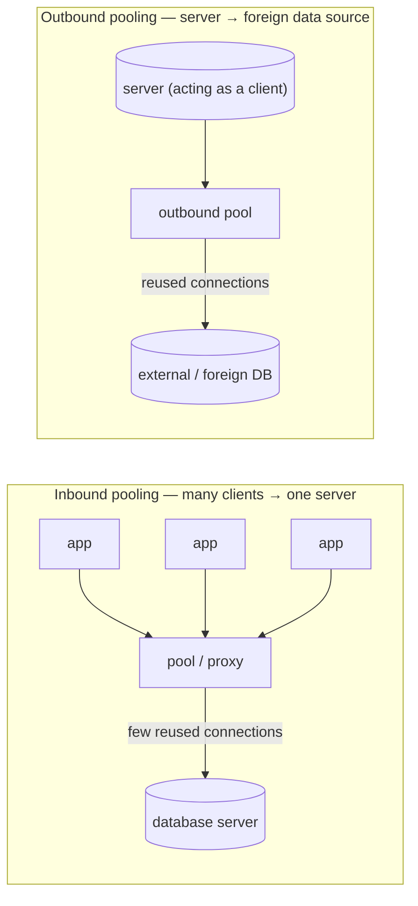
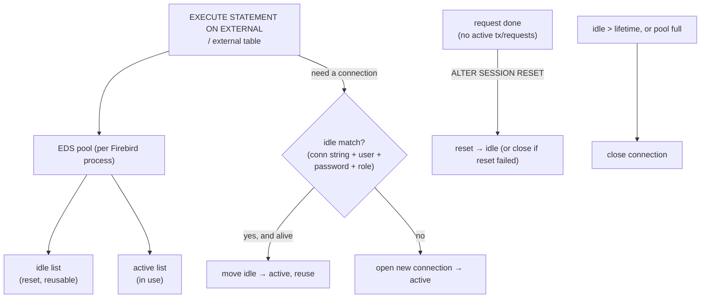

# Connection Pooling and External Connections

Opening a database connection is expensive — a TCP handshake, an [SRP authentication exchange](firebird-wire-protocol.md#srp-authentication-in-depth), and server-side setup — so systems that connect frequently reuse connections instead of re-establishing them. That reuse is **connection pooling**, and it comes in two distinct flavours that are easy to confuse. This document describes both for Firebird 6 — the built-in **external-connections pool** (grounded in `doc/sql.extensions/README.external_connections_pool` and demonstrated live) and Firebird's inbound-connection story — then compares them with PostgreSQL (PgBouncer, `postgres_fdw`), MySQL (thread pool, ProxySQL) and SQLite.

It builds on the [client APIs document](client-apis-and-drivers.md) (where connections come from), the [wire-protocol document](firebird-wire-protocol.md) (why a connect is costly), the [main paper's `ServerMode`](README.md#firebird-3-2016-unified-server-providers-and-plugins) (which decides how costly), and the [security document](security-architecture.md) (the `MODIFY_EXT_CONN_POOL` privilege).

**Table of Contents**

* [Two directions of pooling](#two-directions-of-pooling)
* [Firebird's external-connections pool](#firebirds-external-connections-pool)
* [Managing and observing the pool](#managing-and-observing-the-pool)
* [The pool in action (validated)](#the-pool-in-action-validated)
* [Firebird's inbound-connection story](#firebirds-inbound-connection-story)
* [Comparison: PostgreSQL, MySQL, SQLite](#comparison-postgresql-mysql-sqlite)
* [Discussion](#discussion)
* [Further research](#further-research)

## Two directions of pooling

The word "pooling" hides two opposite problems. Keeping them separate is the key to the whole comparison:



_Figure 1: Two directions of connection pooling — inbound (reducing the cost of many application connections) and outbound (reusing the server's own connections to other databases)_

- **Inbound pooling** reduces the cost of *application → server* connections. Its importance depends entirely on how expensive a server-side connection is: cheap for a threaded server, ruinous for a process-per-connection one.
- **Outbound pooling** reuses connections the *server itself* opens to *other* databases (for federated queries, cross-database statements, foreign tables).

Firebird ships a built-in solution for the **outbound** case; the **inbound** case it addresses through its server architecture (`ServerMode`) and driver-level pooling rather than a built-in proxy. The two are covered in turn.

## Firebird's external-connections pool

Firebird can act as a *client* of another database: `EXECUTE STATEMENT ... ON EXTERNAL DATA SOURCE` runs SQL on a remote Firebird (or, via the EDS subsystem, another engine), and external tables/procedures reach foreign data. Establishing those external connections repeatedly is slow, so Firebird 3.0.2+ includes a built-in **external-connections pool** (EDS pool) that keeps unused external connections warm ([`README.external_connections_pool`](https://github.com/FirebirdSQL/firebird/blob/master/doc/sql.extensions/README.external_connections_pool)):



_Figure 2: The EDS pool — connections are searched by (connection string, user, password, role), reused if a live idle match exists, reset back to idle when done, and closed on expiry_

The mechanics from the source:

- The pool is **per Firebird process** and **common to all external data sources** and all local attachments in that process. It keeps an **idle list** and an **active list**.
- On demand it searches the idle list by four case-sensitive keys — **connection string, username, password, role** — verifies the match is still alive, and reuses it (most-recently-used first); otherwise it opens a new one.
- When a connection becomes unused (no active request, no active transaction) it is **reset** via `ALTER SESSION RESET` and returned to the idle list — or closed if the reset failed. (A data source that doesn't support `ALTER SESSION RESET` is still pooled.)
- Idle connections are closed when they exceed their **lifetime** or when the pool is at its **size** limit (the oldest idle is evicted). There are no "eternal" external connections.

Configuration (`config.h`): `ExtConnPoolSize` (default **0 = disabled**, up to 1000 idle connections) and `ExtConnPoolLifeTime` (default **7200** seconds = 2 hours).

## Managing and observing the pool

The pool is runtime-tunable (immediately, not transactionally) with a DDL-shaped statement that requires the **`MODIFY_EXT_CONN_POOL`** [system privilege](security-architecture.md#firebird-authorization):

```sql
ALTER EXTERNAL CONNECTIONS POOL SET SIZE 100;                 -- 0..1000 idle (0 disables)
ALTER EXTERNAL CONNECTIONS POOL SET LIFETIME 30 SECOND;       -- 1 SECOND .. 24 HOUR
ALTER EXTERNAL CONNECTIONS POOL CLEAR ALL;                    -- close all idle now
ALTER EXTERNAL CONNECTIONS POOL CLEAR OLDEST;                 -- close expired idle
```

and its state is observable through `SYSTEM`-namespace context variables:

```sql
RDB$GET_CONTEXT('SYSTEM', 'EXT_CONN_POOL_SIZE')          -- configured idle size
RDB$GET_CONTEXT('SYSTEM', 'EXT_CONN_POOL_LIFETIME')      -- idle lifetime (seconds)
RDB$GET_CONTEXT('SYSTEM', 'EXT_CONN_POOL_IDLE_COUNT')    -- idle connections now
RDB$GET_CONTEXT('SYSTEM', 'EXT_CONN_POOL_ACTIVE_COUNT')  -- active connections now
```

Runtime changes are per-process and non-persistent (a restart reverts to `firebird.conf`), which matters in Classic mode where each process has its own pool.

## The pool in action (validated)

Run against a live Firebird 6 server — enable the pool, then make three `EXECUTE STATEMENT ON EXTERNAL` calls to the same data source (this database, over TCP):

```sql
ALTER EXTERNAL CONNECTIONS POOL SET SIZE 5;
ALTER EXTERNAL CONNECTIONS POOL SET LIFETIME 30 SECOND;
-- before: EXT_CONN_POOL_IDLE_COUNT = 0, EXT_CONN_POOL_ACTIVE_COUNT = 0

EXECUTE BLOCK ... AS BEGIN
  WHILE (i < 3) DO
    EXECUTE STATEMENT 'select 1 from rdb$database'
      ON EXTERNAL 'inet://localhost//tmp/pool_demo.fdb'
      AS USER 'SYSDBA' PASSWORD 'masterkey' INTO :v;
END
```

Real result — the three calls reused **one** external connection, not three:

```text
POOL_SIZE      5
IDLE_BEFORE    0     ACTIVE_BEFORE   0
...three EXECUTE STATEMENT ON EXTERNAL calls to the same DSN...
IDLE_AFTER     0     ACTIVE_AFTER    1
```

`ACTIVE_COUNT` is **1** after three calls (the same pooled connection, still associated with the running block) rather than three separate connects — the pool avoided two full connect/authenticate round-trips. Once the block finishes and the connection goes unused, it is reset and moves to the idle list for the next caller.

## Firebird's inbound-connection story

Firebird has **no built-in inbound connection pooler** (no PgBouncer equivalent shipped). Instead the inbound cost is governed by two things:

- **`ServerMode`** (see the [main paper](README.md#firebird-3-2016-unified-server-providers-and-plugins)). In **SuperServer** the engine is one multi-threaded process with a **shared page cache**, so a new connection is a thread and a modest allocation — inbound connections are relatively cheap, and the pressure for an external pooler is low. **Classic** (process per connection) and **SuperClassic** trade that shared cache for process isolation, making connections heavier — closer to PostgreSQL's model and more likely to benefit from limiting/pooling.
- **Driver-level pooling.** The client drivers ([client APIs document](client-apis-and-drivers.md)) implement inbound pooling on the application side — the .NET provider and Jaybird maintain connection pools, as do most ADO.NET/JDBC-style stacks — so a typical app server reuses its own connections without any server-side proxy.

For very high inbound concurrency you can still front Firebird with a generic TCP proxy or connection limiter, but it is not the routine necessity it is for a process-per-connection database.

## Comparison: PostgreSQL, MySQL, SQLite

| Aspect | **Firebird** | **PostgreSQL** | **MySQL** | **SQLite** |
|---|---|---|---|---|
| Server connection model | `ServerMode`: threads (Super) or process (Classic) | **Process per connection** | Thread per connection (+ [thread pool](https://dev.mysql.com/doc/refman/8.4/en/thread-pool.html)) | **None** (in-process library) |
| Inbound connection cost | Low (Super) / higher (Classic) | **High** (fork + backend setup) | Moderate | N/A |
| Built-in inbound pooler | No | No | No (thread pool mitigates) | N/A |
| External inbound pooler | Generic TCP proxy (rare) | **[PgBouncer](https://www.pgbouncer.org/) / [pgpool](https://www.pgpool.net/)** (common) | **[ProxySQL](https://proxysql.com/)** | N/A |
| Driver-side pooling | .NET / Jaybird / etc. | Most drivers / HikariCP | Most drivers | N/A |
| Outbound / foreign pool | **Built-in EDS pool** | [`postgres_fdw`](https://www.postgresql.org/docs/current/postgres-fdw.html) connection caching; [`dblink`](https://www.postgresql.org/docs/current/dblink.html) | [FEDERATED](https://dev.mysql.com/doc/refman/8.4/en/federated-storage-engine.html) engine | [`ATTACH`](https://sqlite.org/lang_attach.html) (local files only) |
| Foreign-pool tuning | `ALTER EXTERNAL CONNECTIONS POOL`; `ExtConnPool*` | FDW options / server-level | Limited | None |
| Cross-DB statement | `EXECUTE STATEMENT ON EXTERNAL` | `dblink` / FDW | FEDERATED tables | `ATTACH` + query |

## Discussion

**The inbound pooling story is decided by the server's connection model, and PostgreSQL sits at the painful end.** Because PostgreSQL forks a full backend *process* per connection (see the [architecture comparison](architecture-comparison.md#postgresql)), a connection is genuinely expensive and a fleet of short-lived app connections can exhaust the server — which is exactly why **PgBouncer** is near-mandatory in production PostgreSQL. Firebird in **SuperServer** mode largely sidesteps this: a shared-cache threaded server makes connections cheap enough that no external pooler is usually needed, and driver-side pools handle the rest. MySQL's thread-per-connection sits in between, with an optional thread pool and ProxySQL for scale. SQLite has no inbound pooling *concept* at all — there are no connections, only a library linked into the process ([embedded comparison](embedded-architecture-comparison.md)). So "do I need a connection pooler?" is really a question about the engine's process model, and the four give four different answers.

**Firebird is unusual in shipping outbound pooling as a first-class, tunable feature.** The EDS pool is built into the engine, common to the whole process, tunable at runtime with `ALTER EXTERNAL CONNECTIONS POOL`, observable through context variables, and gated by a dedicated privilege — a more managed outbound-pooling story than PostgreSQL's `postgres_fdw`/`dblink` connection caching or MySQL's FEDERATED engine, and something SQLite (whose only "external" reach is `ATTACH`-ing local files) has no analogue for. For workloads that fan out to other databases from stored procedures, this built-in pool removes a connect/authenticate cost that would otherwise dominate.

**The two pooling directions answer to different parts of the architecture.** Inbound pooling is a *deployment* concern shaped by the server's process model and usually solved *outside* the engine (PgBouncer, ProxySQL, driver pools); outbound pooling is an *engine feature* shaped by how the database federates to others, and Firebird chose to solve it *inside* the engine. Keeping the two straight — and matching each to the engine you run — is the whole practical lesson.

## Hands-on: samples, tests and debugging

### C++ sample — [`samples/cpp/pooling.cpp`](samples/cpp/pooling.cpp)

The whole EDS-pool lifecycle of [Figure 2](#firebirds-external-connections-pool), watched from client code. The sample tunes the pool at runtime (`ALTER EXTERNAL CONNECTIONS POOL SET SIZE / SET LIFETIME` — the [`MODIFY_EXT_CONN_POOL`](security-architecture.md#firebird-authorization)-gated statement), then runs an `EXECUTE BLOCK` making **three** `EXECUTE STATEMENT ON EXTERNAL` calls to the same DSN with the same user — the pool's four-part key — and reads the `EXT_CONN_POOL_*` context variables at each stage: before, inside the block, after commit, after `CLEAR ALL`.

```sh
cmake -B build samples && cmake --build build
./build/pooling                  # default: inet://localhost/employee, external DSN likewise
```

Verified output:

```text
before:            size=5 lifetime=30s idle=0 active=0
inside the block:  idle=0 active=1   (3 calls, 1 outbound connection)
after commit:      size=5 lifetime=30s idle=1 active=0
after CLEAR ALL:   size=5 lifetime=30s idle=0 active=0
done.
```

Three external calls, one outbound connection (`active=1`, never 3); after the **full** commit it is reset via `ALTER SESSION RESET` and parked (`idle=1`); `CLEAR ALL` evicts it. One subtlety found while writing the sample: with `COMMIT RETAINING` the transaction context survives, so the pooled connection stays `active` — only a real commit boundary releases it to the idle list.

### fb-cpp sample — [`samples/fb-cpp/pooling.cpp`](samples/fb-cpp/pooling.cpp)

Both directions of pooling through [fb-cpp](https://github.com/asfernandes/fb-cpp) (vendored at [`extern/fb-cpp`](extern/fb-cpp)), the modern C++20 wrapper over the OO API. The first half replays the outbound EDS experiment (the context variables come back as `std::optional<std::string>` via `getString(i).value_or("?")`); the second half is what the OO-API sample cannot show: fb-cpp ships an *inbound*, client-side pool — `AttachmentPool`, configured with the `AttachmentPoolOptions` builder (`setMaxSize(2)`, `setAcquireTimeout(300 ms)`, `setSessionResetOnRelease(true)` — the same `ALTER SESSION RESET` EDS runs before parking) and handing out `PooledAttachment` RAII leases — the driver-level pooling this document names as Firebird's inbound story, here in C++ rather than in a driver.

```sh
cmake -B build samples && cmake --build build   # needs libboost-dev + libboost-filesystem-dev
./build/fbcpp_pooling
```

Verified: the outbound half matches the OO-API run line for line (`inside the block: idle=0 active=1` for 3 calls, `idle=1` after commit, `idle=0` after `CLEAR ALL`); the inbound half shows `took 2 of max 2: total=2 available=0 inUse=2`, a third `tryAcquire()` timing out after exactly 300 ms with the pool exhausted, and — after one lease is released — the third ask served with `CURRENT_CONNECTION = 6`.

### JavaScript sample — [`samples/nodejs/pooling.js`](samples/nodejs/pooling.js)

Both [directions of pooling](#two-directions-of-pooling) in one run (`cd samples/nodejs && node pooling.js`). The **outbound** half replays the same SQL through node-firebird with the same counts. The **inbound** half is what the C++ sample cannot show: node-firebird's *client-side* pool (`Firebird.pool(2, …)`) — the driver-level pooling this document names as Firebird's inbound story. With both slots taken, a third `get()` queues (`waiting=1`) and is served only when a connection is released:

```text
took 2 of max 2:  total=2 active=2 waiting=0
asked for a 3rd:  total=2 active=2 waiting=1
released one:     3rd get served after 202 ms
pooled attachment works: CURRENT_CONNECTION = 364
```

Note the asymmetry: `db.detach()` on a pooled connection releases the *slot* without an `op_detach` on the wire, while `pool.destroy()` really detaches — the client pool trades protocol round-trips for reuse exactly as the server's EDS pool does with its idle list.

### Rust sample — [`samples/rust/src/bin/pooling.rs`](samples/rust/src/bin/pooling.rs)

Both directions through [rsfbclient](https://github.com/fernandobatels/rsfbclient), Rust's Firebird client (`cd samples/rust && cargo run --bin pooling`). The outbound half is the same SQL as everyone else's — `ALTER EXTERNAL CONNECTIONS POOL SET SIZE / SET LIFETIME`, the three-call `EXECUTE BLOCK`, the `EXT_CONN_POOL_*` context variables read as a tuple of `Option<String>` (context variables are nullable, and the type system makes you say so). The inbound half differs from *both* neighbours: rsfbclient ships no pool of its own — that layer lives in a separate crate, `r2d2_firebird`, the r2d2 adapter maintained in the rsfbclient repository — so instead of exercising a bundled pool the sample shows exactly what such a pool caches: two extra attachments appear as two `MON$ATTACHMENTS` rows, the same `CURRENT_CONNECTION` serves query after query (what a pool would hand out again), and `drop(a)` is a *real* detach whose row vanishes — the round trip a checkout/checkin layer exists to avoid.

Verified: the outbound half matches the C++ runs line for line — `before: size=5 lifetime=30s idle=0 active=0`, `inside the block: idle=0 active=1` for 3 calls, `idle=1` after the full commit, `idle=0` after `CLEAR ALL`; the inbound half opens attachments 619 and 620 (`2 rows in MON$ATTACHMENTS`), reuses `CURRENT_CONNECTION` 619, and after `drop(a)` reports `1 row left — detach really detached`.

### Free Pascal sample — [`samples/fpc/pooling.pas`](samples/fpc/pooling.pas)

The outbound half through [fbintf](https://github.com/MWASoftware/fbintf) (vendored at [`extern/fbintf`](extern/fbintf)), MWA Software's Firebird Pascal API — the layer under IBX (`make -C samples/fpc bin/pooling && samples/fpc/bin/pooling`). Everything is plain SQL via `IAttachment.ExecuteSQL` / `OpenCursorAtStart` — the `ALTER EXTERNAL CONNECTIONS POOL` tuning, the three-call `EXECUTE BLOCK`, the four `EXT_CONN_POOL_*` context variables read in one `RDB$GET_CONTEXT` SELECT — and the stage separation rides on fbintf spelling the two commit forms as distinct `ITransaction` methods: `CommitRetaining` keeps the transaction context (and with it the ACTIVE pooled connection) alive, while only the real `Commit` lets the external connection be reset and parked on the idle list. On the inbound side fbintf, like the raw client API it wraps, ships no client-side pool — in the Pascal stack that layer belongs to components above it (IBX or application code) — so unlike the node-firebird twin this sample is purely the server-side EDS story.

Verified: `before: size=5 lifetime=30s idle=0 active=0`; inside the block `idle=0 active=1` for the three `EXECUTE STATEMENT ON EXTERNAL` calls — one outbound connection; after the full commit `idle=1 active=0`; after `CLEAR ALL` back to `idle=0 active=0` — line for line the same pool arithmetic as the C++ and Rust runs.

### Things to try

- Run `./build/pooling` twice within 30 seconds: the second run starts with `idle=1` — the pool is per **server process** and outlives your attachment. Wait past the 30-second lifetime (or run `CLEAR OLDEST`) and it starts at `idle=0` again.
- Change the external user (`AS USER`) between the three calls in the block: `active` climbs to 2 — user is part of the (connection string, user, password, role) pool key.
- In `pooling.js`, point two *different* local databases' `EXECUTE STATEMENT` at the same external DSN — the counts are shared: one pool per process, common to all attachments.
- Set `SET SIZE 0` and re-run: every call opens a fresh external connection (`idle` stays 0 — pooling disabled, the configuration default).

### Debugging this in C++ (gdb)

The EDS pool lives in the engine at `src/jrd/extds/ExtDS.cpp` (all verified in the vendored tree), so these breakpoints need a [debug engine](debugging-firebird.md) — attach the debugger to the server, or run the sample against a local path with `FIREBIRD=<debug root>` so the engine (and its pool) is in your process:

```gdb
break EDS::Manager::getConnection          # ExtDS.cpp:197 — every ON EXTERNAL lands here first
break EDS::ConnectionsPool::getConnection  # ExtDS.cpp:931 — the idle-list search by key hash
break EDS::ConnectionsPool::addConnection  # ExtDS.cpp:1066 — a miss: new connection enters the pool
break EDS::ConnectionsPool::putConnection  # ExtDS.cpp:962 — reset done, connection parked idle
break EDS::ConnectionsPool::setMaxCount    # ExtDS.cpp:1132 — ALTER ... POOL SET SIZE arrives
```

Run the sample's block under these and the counters explain themselves: the first `EXECUTE STATEMENT` reaches `Manager::getConnection`, misses in `ConnectionsPool::getConnection` (the pool searches by the hash of connection string + user + password + role) and calls `addConnection`; the second and third calls never get past `Manager::getConnection`'s first lookup — `getBoundConnection` (ExtDS.cpp:218) returns the connection already bound to the attachment before the pool is even consulted. After commit, the release path (`ExtDS.cpp:494`) calls the virtual `resetSession` — `ALTER SESSION RESET` on the external side — and only if that succeeds does `putConnection` file it as idle, exactly the "reset → idle (or close if reset failed)" edge in Figure 2. `setMaxCount` firing from the sample's first statement shows the runtime-tuning path, per-process and non-persistent as the [management section](#managing-and-observing-the-pool) states.

## Further research

**Firebird**

- [`doc/sql.extensions/README.external_connections_pool`](https://github.com/FirebirdSQL/firebird/blob/master/doc/sql.extensions/README.external_connections_pool) — the EDS pool mechanism, management statement, and context variables.
- [`doc/sql.extensions/README.execute_statement2`](https://github.com/FirebirdSQL/firebird/blob/master/doc/sql.extensions/README.execute_statement2) — `EXECUTE STATEMENT ... ON EXTERNAL` syntax.
- The [main paper](README.md#firebird-3-2016-unified-server-providers-and-plugins) (`ServerMode`), [client APIs document](client-apis-and-drivers.md) (driver pooling), and [security document](security-architecture.md) (`MODIFY_EXT_CONN_POOL`).

**PostgreSQL**

- [Connection settings](https://www.postgresql.org/docs/current/runtime-config-connection.html), [Number of database connections](https://wiki.postgresql.org/wiki/Number_Of_Database_Connections), [PgBouncer](https://www.pgbouncer.org/), [pgpool-II](https://www.pgpool.net/), [`postgres_fdw`](https://www.postgresql.org/docs/current/postgres-fdw.html), [`dblink`](https://www.postgresql.org/docs/current/dblink.html).

**MySQL**

- [Connection interfaces](https://dev.mysql.com/doc/refman/8.4/en/connection-interfaces.html), [Thread pool](https://dev.mysql.com/doc/refman/8.4/en/thread-pool.html), [ProxySQL](https://proxysql.com/), [FEDERATED storage engine](https://dev.mysql.com/doc/refman/8.4/en/federated-storage-engine.html).

**SQLite**

- [`ATTACH DATABASE`](https://sqlite.org/lang_attach.html) and [WAL mode](https://sqlite.org/wal.html) — the closest SQLite comes to multi-database and concurrent access.
