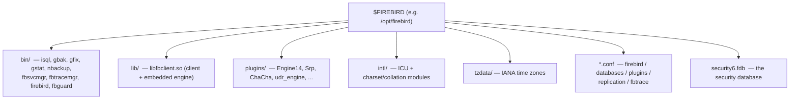
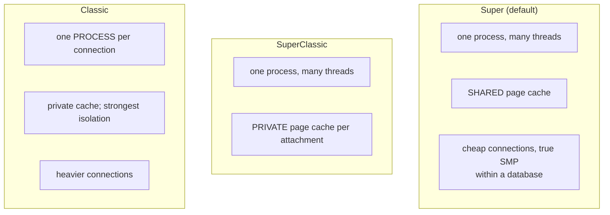

# Deployment and Operations

Running a database in production is a different discipline from designing one: how it is packaged and installed, how it is configured, which execution model it runs, and how it is supervised. This document describes Firebird 6 deployment and operations — the install layout, the configuration files, `ServerMode`, aliases and per-database settings, and containerization — grounded in the actual files on a live server, then compares the operational model with PostgreSQL, MySQL and SQLite.

It is the operational bookend to the [high-availability](high-availability.md), [backup-and-recovery](backup-and-recovery.md), [monitoring-and-tuning](monitoring-and-tuning.md) and [connection-pooling](connection-pooling.md) documents, and it draws on the [main paper's `ServerMode` discussion](README.md#firebird-3-2016-unified-server-providers-and-plugins) and the [security document](security-architecture.md) (the access-control settings).

**Table of Contents**

* [What "deployment" means for each engine](#what-deployment-means-for-each-engine)
* [The Firebird install layout](#the-firebird-install-layout)
* [The configuration files](#the-configuration-files)
* [ServerMode: three execution models](#servermode-three-execution-models)
* [Aliases and per-database configuration](#aliases-and-per-database-configuration)
* [Service supervision and containers](#service-supervision-and-containers)
* [Comparison: PostgreSQL, MySQL, SQLite](#comparison-postgresql-mysql-sqlite)
* [Discussion](#discussion)
* [Further research](#further-research)

## What "deployment" means for each engine

The word means something fundamentally different depending on the engine's architecture — the same [embedded-vs-server divide](embedded-architecture-comparison.md) that runs through the series:

- For **Firebird, PostgreSQL and MySQL** (servers), deployment is: install packages, edit config files, choose an execution model, provision a data directory, and run and supervise a service on a port.
- For **SQLite** (a library), there is *no deployment* in this sense — no install of a server, no config files, no port, no service. "Operations" is file management: where the `.fdb`… the `.sqlite` file lives, how it is backed up, and which journal mode it uses. Firebird's own [embedded mode](embedded-architecture-comparison.md) sits here too — ship the client library, no server to run.

The rest of this document is about the server case; SQLite appears in the comparison as the deliberate absence of most of it.

## The Firebird install layout

A Firebird installation (verified on a live `/opt/firebird`) is a self-contained tree:



_Figure 1: The Firebird install tree — binaries, the client/embedded library, plugins, INTL/tzdata, the config files, and the security database_

The whole engine, its [plugins](extensibility.md), the [INTL subsystem](internationalization.md), time-zone data and the [security database](security-architecture.md) live under one root. `libfbclient.so` is both the network client and the embedded engine ([embedded comparison](embedded-architecture-comparison.md)). Distributions ship this as `.deb`/`.rpm` packages, a Linux tarball, or a Windows installer; the default network port is **3050**.

## The configuration files

Firebird's behaviour is governed by a small set of text files at the install root, each with a clear scope:

| File | Scope | Governs |
|---|---|---|
| **`firebird.conf`** | Global (whole server) | `ServerMode`, port, cache, auth, wire crypt, providers, temp dirs, parallelism, access policy |
| **`databases.conf`** | Per database (and aliases) | Database aliases, and per-database overrides of most `firebird.conf` settings |
| **`plugins.conf`** | Plugins | Which plugin modules exist and their config (see [extensibility](extensibility.md)) |
| **`replication.conf`** | Replication | Journal/replica settings (see [replication](replication-architecture.md)) |
| **`fbtrace.conf`** | Trace/audit | System audit session config (see [monitoring](monitoring-and-tuning.md)) |

`firebird.conf` is the master switchboard. Settings that matter operationally (with their defaults, from the live file and `config.h`): `ServerMode = Super`, `RemoteServicePort = 3050`, `DefaultDbCachePages`, `AuthServer = Srp256`, `WireCrypt`, `Providers = Remote,Engine14,Loopback`, `TempDirectories`, `MaxParallelWorkers`, and the **`DatabaseAccess`** policy (`Full` / `None` / `Restrict <paths>`) that controls which filesystem locations may be opened as databases — a key hardening lever. Most settings can be overridden per database in `databases.conf`.

## ServerMode: three execution models

Firebird's most consequential deployment choice is `ServerMode`, which selects how the engine handles concurrency and caching (see the [main paper](README.md#firebird-3-2016-unified-server-providers-and-plugins) and [transactions document](transactions-and-concurrency.md)):



_Figure 2: The three `ServerMode` models — Super (threads + shared cache), SuperClassic (threads + private caches), Classic (process per connection)_

- **Super** (default) — a single multi-threaded process with **one shared page cache**. Connections are cheap (a thread), and multiple CPUs are used within a single database. Best general-purpose choice, and why Firebird rarely needs an [inbound connection pooler](connection-pooling.md#firebirds-inbound-connection-story).
- **SuperClassic** — multi-threaded, but each attachment has its **own** page cache.
- **Classic** — a **separate process per connection**, maximum isolation (a crash in one connection can't take others down) at the cost of heavier connections — closer to PostgreSQL's model.

Since Firebird 3 all three come from the *same binary*; switching is a configuration change (the shipped `changeServerMode.sh` helper flips it and restarts). This is unusual — most databases have one fixed process model; Firebird lets you pick per deployment.

## Aliases and per-database configuration

`databases.conf` decouples the *name* a client connects to from the *file* on disk, and attaches per-database settings. From the live file:

```
employee = $(dir_sampleDb)/employee.fdb          # alias → path
security.db = $(dir_secDb)/security6.fdb
{
    RemoteAccess = false                          # per-database overrides
    DefaultDbCachePages = 256
}
```

So a client connects to `inet://host/employee` (an alias) rather than exposing the filesystem path, and each database can carry its own cache size, access policy, replication settings, and more — overriding the global `firebird.conf`. The `$(dir_*)` macros keep paths relocatable. Aliases are also a **security** measure: with `DatabaseAccess = Restrict` plus aliases, clients can reach only the databases you name, never arbitrary files.

## Service supervision and containers

On the live host Firebird runs as a **systemd service** (`firebird.service`, verified active). Under it, **`fbguard`** is the guardian process that launches and, if it dies, **respawns** the `firebird` server — the built-in supervision that keeps the server up. On Windows it runs as a Windows service.

For containers, Firebird publishes an **official Docker image** ([`firebirdsql/firebird`](https://hub.docker.com/r/firebirdsql/firebird), built from [`firebird-docker`](https://github.com/FirebirdSQL/firebird-docker)): environment variables set the SYSDBA password, create a database, and select `ServerMode`, with the database directory mounted as a volume for persistence. This is the modern deployment path — an immutable image plus a mounted data volume, the same pattern as the other server databases.

## Comparison: PostgreSQL, MySQL, SQLite

| Aspect | **Firebird** | **PostgreSQL** | **MySQL** | **SQLite** |
|---|---|---|---|---|
| Deployment unit | Server install + `.fdb` files | Server + data cluster | Server + data dir | **A file (+ linked library)** |
| Primary config | `firebird.conf` | [`postgresql.conf`](https://www.postgresql.org/docs/current/runtime-config.html) | [`my.cnf`](https://dev.mysql.com/doc/refman/8.4/en/option-files.html) | **None** (PRAGMAs at runtime) |
| Access/auth config | `databases.conf`, `DatabaseAccess` | [`pg_hba.conf`](https://www.postgresql.org/docs/current/auth-pg-hba-conf.html) / `pg_ident.conf` | user table / config | Filesystem permissions |
| Data initialization | `create database` / `gbak` restore | [`initdb`](https://www.postgresql.org/docs/current/creating-cluster.html) (create cluster) | `mysqld --initialize` | Created on first open |
| One instance holds | Many databases (files) | Many databases (one cluster) | Many databases | **One** database (the file) |
| Execution model | **Configurable** (`ServerMode`) | Process per connection (fixed) | Thread per connection (fixed) | In-process (no server) |
| Name → storage | **Aliases** (`databases.conf`) | Database name in cluster | Database name | File path |
| Default port | 3050 | 5432 | 3306 | none |
| Supervision | systemd + `fbguard` | systemd / pg_ctl | systemd / mysqld_safe | none |
| Official container | [`firebirdsql/firebird`](https://hub.docker.com/r/firebirdsql/firebird) | [`postgres`](https://hub.docker.com/_/postgres) | [`mysql`](https://hub.docker.com/_/mysql) | none (bundle the lib) |
| Hardening surface | `DatabaseAccess`, aliases, WireCrypt | `pg_hba.conf`, TLS, `listen_addresses` | bind-address, TLS, users | file permissions |

## Discussion

**Firebird's operational signatures are the configurable `ServerMode` and the alias layer.** No other server here lets you choose the process/threading model as a *deployment setting* from one binary — PostgreSQL is always process-per-connection, MySQL always thread-per-connection. That flexibility lets one Firebird package serve an embedded-like single-user deployment, a shared-cache OLTP server, or a process-isolated Classic setup, tuned to the workload. The `databases.conf` **alias** layer is the other distinctive touch: clients connect to logical names, not paths, and per-database overrides plus `DatabaseAccess = Restrict` give a clean, file-oriented security and configuration boundary that PostgreSQL and MySQL express differently (through `pg_hba.conf` rules and the cluster/data-dir model).

**The config-file philosophies rhyme but differ in structure.** All three servers centre on a master config file (`firebird.conf` ≈ `postgresql.conf` ≈ `my.cnf`) plus auxiliary files. PostgreSQL notably splits *authentication and host-based access* into a dedicated `pg_hba.conf` — a powerful, rule-based client-authentication matrix that Firebird handles through `AuthServer`/`databases.conf`/`DatabaseAccess` and MySQL through its user table. The structural difference reflects lineage, not capability; each can express host restrictions, auth-method selection and TLS requirements, just organized differently.

**Containers have converged the deployment story — except for SQLite, which never needed it.** Firebird, PostgreSQL and MySQL all ship official images following the same idiom (immutable image + mounted data volume + env-var bootstrap), so operationally they now look alike from the outside: a container, a volume, a port, some environment variables. SQLite stands apart by design — there is nothing to deploy, supervise, or expose; you ship a file and a library and the "database server" is your own process ([embedded comparison](embedded-architecture-comparison.md)). The whole series' recurring split — invest in server machinery, or deliberately do without it — is nowhere more visible than in what it takes to *run* each of these.

## Further research

**Firebird**

- The config files themselves (`firebird.conf`, `databases.conf`, `plugins.conf`, `replication.conf`) are the primary reference, each heavily commented; [`doc/README.superclassic`](https://github.com/FirebirdSQL/firebird/blob/master/doc/README.superclassic) for the `ServerMode` variants.
- [`firebirdsql/firebird` Docker image](https://hub.docker.com/r/firebirdsql/firebird) and [`firebird-docker`](https://github.com/FirebirdSQL/firebird-docker) — the official container.
- The [main paper](README.md#firebird-3-2016-unified-server-providers-and-plugins) (`ServerMode`, providers), and the [HA](high-availability.md), [backup](backup-and-recovery.md), [monitoring](monitoring-and-tuning.md) and [pooling](connection-pooling.md) documents for the operational tasks around a running server.

**PostgreSQL**

- [Server configuration](https://www.postgresql.org/docs/current/runtime-config.html), [`pg_hba.conf`](https://www.postgresql.org/docs/current/auth-pg-hba-conf.html), [Creating a database cluster](https://www.postgresql.org/docs/current/creating-cluster.html), [official `postgres` image](https://hub.docker.com/_/postgres).

**MySQL**

- [Option files](https://dev.mysql.com/doc/refman/8.4/en/option-files.html), [official `mysql` image](https://hub.docker.com/_/mysql).

**SQLite**

- [The One-File Advantage](https://sqlite.org/onefile.html) — why SQLite's "deployment" is just a file.
