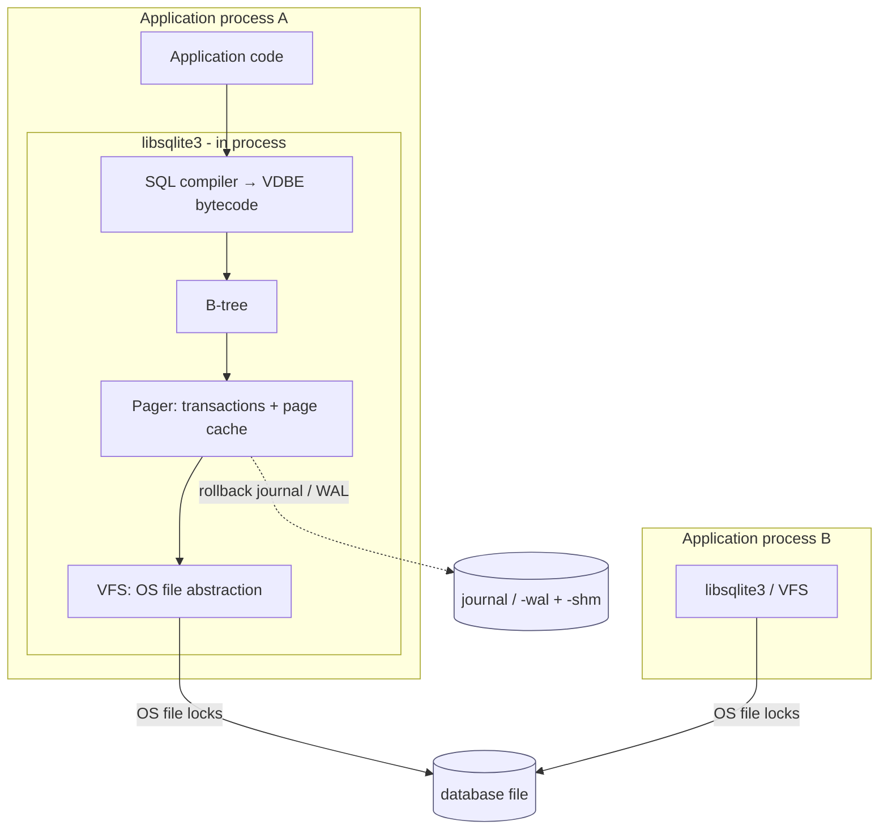
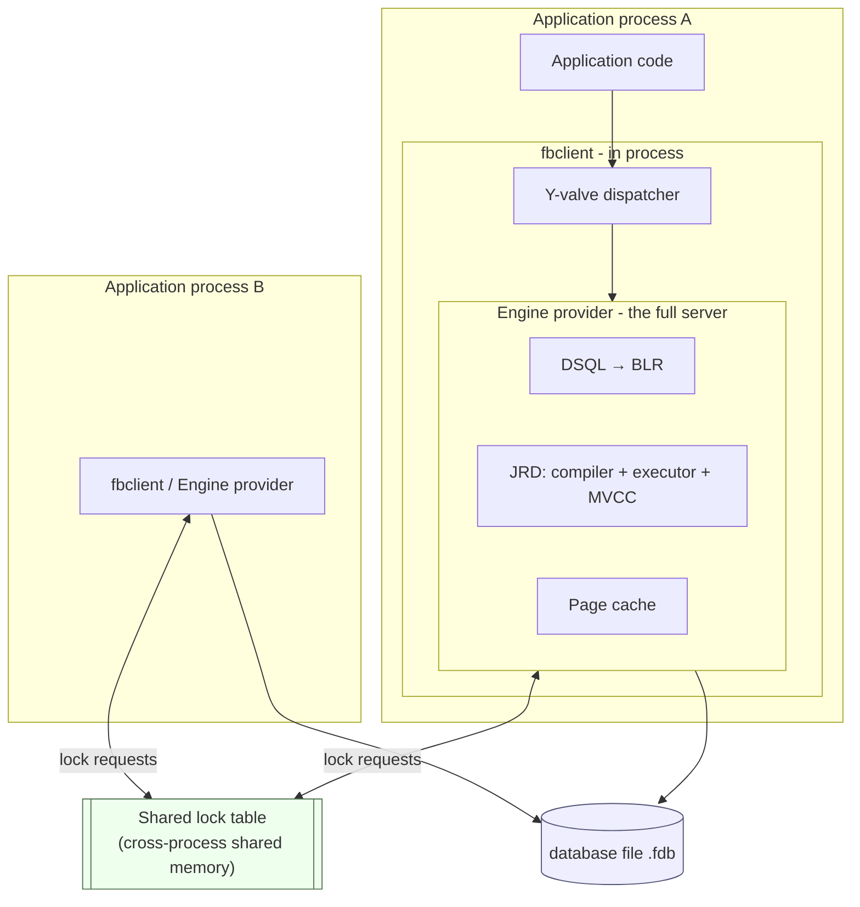
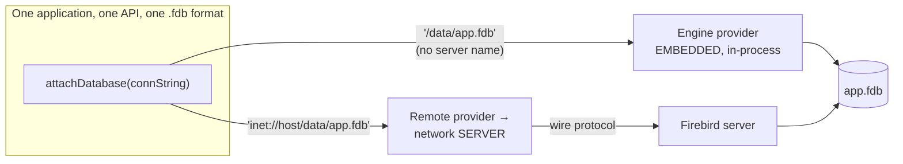

# Embedded Architecture: Firebird vs SQLite

Both Firebird and SQLite can run *embedded* — linked into an application as a library, with the database living in an ordinary file and no separate server process to administer. This makes them natural competitors for the same niche: desktop and mobile apps, edge devices, application file formats, test fixtures, and any deployment where "install and run a database server" is unwelcome. But underneath the shared "just a library and a file" surface, the two are architecturally opposite in the decision that matters most — **what happens when more than one thing writes to the database at once**.

This document compares the two embedded architectures with diagrams, focusing on that decision and everything that follows from it. It is a companion to the [main paper](README.md), the broader four-engine [architecture comparison](architecture-comparison.md) (which covers PostgreSQL and MySQL as well), and the [wire-protocol document](firebird-wire-protocol.md) (which covers Firebird's *networked* mode). The Firebird embedded facts here are grounded in the vendored source and its [`doc/README.user.embedded`](https://github.com/FirebirdSQL/firebird/blob/master/doc/README.user.embedded) and [`doc/README.providers.html`](https://github.com/FirebirdSQL/firebird/blob/master/doc/README.providers.html); the SQLite facts in its [architecture](https://sqlite.org/arch.html) and [file-locking](https://sqlite.org/lockingv3.html) documents. The runnable C++ example [`samples/client_test.cpp`](samples/client_test.cpp) *is* a Firebird embedded program: it creates and queries a local `.fdb` file with no server running.

**Table of Contents**

* [The shared surface](#the-shared-surface)
* [SQLite: a library around a file](#sqlite-a-library-around-a-file)
* [Firebird embedded: a full engine in your process](#firebird-embedded-a-full-engine-in-your-process)
* [The decisive difference: concurrency](#the-decisive-difference-concurrency)
* [The Firebird continuum: embedded and server are the same engine](#the-firebird-continuum-embedded-and-server-are-the-same-engine)
* [Side-by-side comparison](#side-by-side-comparison)
* [Choosing between them](#choosing-between-them)
* [Further research](#further-research)

## The shared surface

Before the differences, the genuine common ground — this is why they are compared at all:

- **No server process to run.** The database engine executes inside the application's own process; there is nothing to start, stop, or supervise.
- **The database is a file.** A single file (plus small, transient side files) is the whole database; copying it copies the database.
- **Zero-to-minimal administration.** No accounts to provision, no network to secure, no configuration required to get going.
- **ACID transactions.** Both are fully transactional with durable commit and crash recovery — neither is a "toy" store.
- **Embeddable across platforms.** Both run on the major desktop and mobile operating systems and expose a C API other languages bind to.

Everything below is where they diverge.

## SQLite: a library around a file

SQLite ([sqlite.org](https://sqlite.org/), [architecture](https://sqlite.org/arch.html)) is *serverless by design* ([its own term](https://sqlite.org/serverless.html)): the library is the entire database system. There is no engine process even conceptually — the code that parses SQL, walks B-trees and reads pages all runs on the application's call stack, and the only thing outside the process is the file (and, in WAL mode, a shared-memory index and a write-ahead log file beside it).



_Figure 1: SQLite — the library is the whole engine; cross-process coordination is by OS file locks_

- **Linkage.** One small library (~150 K lines, one `sqlite3.c` amalgamation) with no dependencies; often statically linked. There is no separate "embedded build" because there is no other build.
- **Query pipeline.** Tokenizer → parser → code generator producing **VDBE** bytecode, executed by a register virtual machine. (Detailed in the [architecture comparison](architecture-comparison.md#sqlite).)
- **Storage.** Tables and indexes are B-trees in one file; the **pager** provides atomic commit and recovery via a rollback journal (undo) or [WAL](https://sqlite.org/wal.html) (redo).
- **Cross-process coordination.** SQLite has no shared engine to mediate access, so when two *processes* open the same file they coordinate purely through **OS advisory file locks** ([locking protocol](https://sqlite.org/lockingv3.html)): a reader takes a SHARED lock, a writer escalates through RESERVED and PENDING to EXCLUSIVE. WAL mode adds a small `-shm` shared-memory file so multiple readers can run concurrently with one writer, but the ceiling is unchanged: **one writer at a time for the whole database.**
- **Security.** None built in — no users, no passwords, no privileges. Access control is the file system's job. (Encryption is available via commercial/third-party VFS extensions.)
- **Extensibility.** Application-defined functions and collations, **virtual tables** (FTS5 full-text search, R-tree, JSON are virtual tables), and custom **VFS** implementations (the hook for encryption and for the in-browser WASM build).

## Firebird embedded: a full engine in your process

Firebird embedded is a fundamentally different thing wearing the same clothes: it is the **complete Firebird server engine**, loaded into the application's address space as a library rather than reached over a socket. Its own documentation is blunt about this — "The embedded server is a fully functional server linked as a dynamic library … It has exactly the same features as the usual server." Since Firebird 3 there is no separate embedded library at all: the ordinary client library (`fbclient`) contains the engine, and the **Y-valve** dispatcher chooses at attach time between the **Remote** provider (network) and the **Engine** provider (in-process, embedded) based on the connection string. A bare file path with no server name gets the Engine provider — and you have an embedded database.



_Figure 2: Firebird embedded — the full engine runs in-process, but a shared lock table lets independent processes be concurrent writers to one file_

- **Linkage.** Linking `fbclient` pulls in the entire engine plus its dependencies (ICU for collations, plugins for INTL and UDR). It is a much larger dependency than SQLite — because it is a whole database server, not a library around a file.
- **Query pipeline and storage.** Identical to the server described in the paper: DSQL compiles SQL to **BLR**, the JRD engine executes it with full **multi-generational (MVCC)** concurrency, and durability comes from **careful write ordering — no WAL** (see the [main paper's JRD section](README.md#jrd) and the [architecture comparison](architecture-comparison.md#firebird-recap)).
- **Cross-process coordination.** This is the crux. Firebird embedded still coordinates through the **shared lock table** — the same lock manager (`src/lock/`) the server uses, living in cross-process shared memory. Per `README.user.embedded`: "The database file can be accessed by multiple client programs. The database consistency in this case is guaranteed internally (by the shared lock table)." Multiple independent processes running embedded — and a running Firebird *server* at the same time — all attach to the same file and coordinate through that shared structure.
- **Security.** In embedded mode there is **no authentication** — no security database is consulted and any user name is accepted, because client and engine share an address space and any barrier "can be easily compromised" anyway. But note the important subtlety: **SQL privileges are still checked.** GRANT/REVOKE, roles and view-level permissions all apply; what is skipped is only *proving who you are*, not *what that identity may do*.
- **Extensibility.** The engine's full plugin surface: **UDR** external routines, INTL character-set/collation plugins, and (in server mode) auth/crypt/trace plugins. Stored procedures, triggers, and PSQL run inside the embedded engine exactly as on the server.

## The decisive difference: concurrency

Everything else is detail next to this: **how many writers can safely touch the database at once, from how many processes.**

- **SQLite: one writer, enforced by file locks.** Because there is no shared engine, the only cross-process referee is the operating system's file-locking. A writer must obtain an EXCLUSIVE lock over the database, which by construction excludes all other writers (and, outside WAL mode, all readers) for the duration of the write transaction. This is not a tuning limitation; it is the architecture. For SQLite's target — one application that owns its file — it is exactly right, and the reward is an engine small and simple enough to be [tested to aviation-grade coverage](https://sqlite.org/testing.html). SQLite's own guidance is that it is built for this case and that genuinely concurrent write workloads from many clients are what a client-server database is for.
- **Firebird embedded: many concurrent writers, mediated by MVCC and the shared lock table.** Because embedded is the full engine, it brings the full concurrency machinery with it. Multiple transactions — in the same process *or in different processes* — can write simultaneously; readers never block writers and writers never block readers, because each transaction sees its own consistent version of every row (the multi-generational architecture), and the shared lock table serializes only the genuine conflicts (two transactions updating the *same* row). The same `.fdb` can be under concurrent modification by several embedded applications and a network server at once.

Put concisely: **SQLite makes concurrency the file system's problem and answers it with "one writer"; Firebird embedded makes concurrency the engine's problem and answers it with "MVCC, just like the server."** That single divergence explains the footprint difference (an MVCC engine plus a lock manager is simply more code than a pager plus file locks), the recovery difference (version housekeeping and careful writes versus a rollback journal), and the deployment difference below.

## The Firebird continuum: embedded and server are the same engine

A consequence of Figure 2 that has no SQLite equivalent: because embedded Firebird *is* the server, moving between embedded and client-server is a change of **connection string**, not of code, driver, or file format.



_Figure 3: The same code, API and file switch between embedded and networked by connection string alone (the Y-valve routes the call)_

The identical file can be opened embedded today and served over TCP tomorrow with no migration; a single application can even do both at once. SQLite deliberately does not offer this — reaching a SQLite file from another machine means adding an external layer (a network file system, or a separate server product built on SQLite), and there is no in-tree "switch to server mode." Firebird's [Y-valve provider architecture](https://github.com/FirebirdSQL/firebird/blob/master/doc/README.providers.html) is precisely what makes the transition free, and it is the same mechanism documented in the [wire-protocol overview](firebird-wire-protocol.md#where-this-fits-in-the-architecture).

## Side-by-side comparison

| Aspect | **SQLite** | **Firebird embedded** |
|---|---|---|
| What the library contains | The whole engine (a library around a file) | The whole **server** engine, loaded in-process |
| Footprint / dependencies | Tiny (~150 K LOC, single amalgamation, no deps) | Large (`fbclient` + ICU + plugins) |
| Separate embedded build? | N/A — there is only one build | No — ordinary `fbclient`; Y-valve picks the Engine provider |
| Query pipeline | Tokenizer → VDBE bytecode → VM | DSQL → BLR → JRD execution tree |
| **Concurrent writers** | **One at a time** (whole-DB write lock) | **Many** (MVCC), across processes |
| Reader/writer blocking | Readers block writers (rollback journal); WAL: 1 writer + N readers | Readers and writers never block each other (MVCC) |
| Cross-process coordination | OS advisory **file locks** (+ `-shm` in WAL) | **Shared lock table** (lock manager in shared memory) |
| Concurrency ceiling | By design: single-writer | Full server concurrency in-process |
| Crash recovery | Rollback journal (undo) or WAL (redo) | Careful write ordering — **no WAL** |
| Authentication | None (filesystem permissions) | None in embedded (any user accepted) |
| SQL privileges (GRANT/roles) | Not applicable (no users) | **Enforced** even in embedded |
| Data types / SQL surface | Dynamic typing; a focused SQL subset | Static typing; full procedural SQL (PSQL), stored procedures, triggers |
| Extensibility | App functions, virtual tables, custom VFS | UDR routines, INTL plugins, PSQL |
| Path to client-server | External layer required (no native server mode) | **Change the connection string** — same engine, file, API |
| Ideal fit | One app owning its file; edge/mobile; app file format | Embedded app that may need multi-process or later networked access |
| License | Public domain | IDPL / IPL (MPL-family) |

## Choosing between them

The comparison points to a clean decision rule rather than a winner:

- **Choose SQLite** when a single application owns the database file, write concurrency is low or naturally serialized, and minimal footprint and zero operational surface are paramount — its canonical uses are application file formats, on-device storage for mobile and desktop apps, browser storage, caches, and test fixtures. If you will never need concurrent writers from multiple processes or a network server, SQLite's simplicity is a feature, not a compromise, and its testing pedigree is hard to match.
- **Choose Firebird embedded** when you want the ergonomics of an embedded database *but* expect several processes to write the same file, need real server-grade concurrency (MVCC) on the desktop, rely on stored procedures/triggers/roles, or want the option to expose the same database over the network later without re-platforming. You pay for it in footprint and dependencies, because you are shipping a full database server inside your application.

The deciding question is almost always the concurrency one: *will more than one process ever need to write this database at the same time, or might it need to become a networked service?* If yes, Firebird embedded's architecture is built for it; if no, SQLite's is built for staying out of your way.

## Hands-on: samples, tests and debugging

### C++ sample — [`samples/cpp/embedded_demo.cpp`](samples/cpp/embedded_demo.cpp)

Three demonstrations in one program (complementing [`samples/client_test.cpp`](samples/client_test.cpp), the longhand embedded walk-through). First, [Figure 2](#firebird-embedded-a-full-engine-in-your-process) made visible: the program prints its own `/proc/self/maps` before and after the local-path attach, catching the Y-valve loading `libEngine14.so` — the full server — into the process on demand. Second, real work with no server anywhere: it creates `/tmp/fbhandson/embedded_demo.fdb`, runs DDL and DML, and shows `NETWORK_PROTOCOL` is NULL while `MON$SERVER_PID` equals its own pid. Third, [the continuum](#the-firebird-continuum-embedded-and-server-are-the-same-engine) measured: the identical `attach()` call timed against a local path (in-process function calls) and against `inet://localhost/employee` (socket plus SRP handshake per attach).

```sh
cmake -B build samples && cmake --build build
./build/embedded_demo    # [local-path] [remote-db] to override
```

Verified output:

```text
before attach: libfbclient mapped=yes, libEngine14 mapped=no
after  attach: libfbclient mapped=yes, libEngine14 mapped=yes

rows=3  max(name)=sprocket  NETWORK_PROTOCOL=<null: in-process>
engine pid=199286, my pid=199286 — the 'server' is this process

attach+detach avg over 5 runs:
    embedded  /tmp/fbhandson/embedded_demo.fdb          6.28 ms
    remote    inet://localhost/employee                34.54 ms
done.
```

One honest footnote to the multi-process story in Figure 2: whether two *processes* may hold the same file open concurrently is governed by `ServerMode` even in embedded — with the default (`Super`) the second embedded attach fails with SQLSTATE 08001 *"Database already opened with engine instance, incompatible with current"*; the shared-lock-table coexistence described by `README.user.embedded` requires `ServerMode = Classic`/`SuperClassic` in the `firebird.conf` the embedded engine reads (settable per application via the `FIREBIRD` environment variable). The concurrency that needs no configuration is *within* the process: many attachments and writing transactions, full MVCC.

### fb-cpp sample — [`samples/fb-cpp/embedded_demo.cpp`](samples/fb-cpp/embedded_demo.cpp)

The same demonstration through [fb-cpp](https://github.com/asfernandes/fb-cpp) (vendored at [`extern/fb-cpp`](extern/fb-cpp)), the modern C++20 wrapper over the OO API — with one extra rung on the ladder. Because `Client{"fbclient"}` loads even the *client* library at runtime (via Boost.DLL) instead of link-time `libfbclient` dependency, `/proc/self/maps` now shows three states rather than two: before `Client{}` not even `libfbclient` is mapped; after `Client{}` the client is in but the engine is not; after the first local-path attach the Y-valve has pulled `libEngine14.so` — the full server — into the process. The rest is the same experiment one abstraction up: detach becomes `~Attachment()` running at scope exit (which is what the timing loop measures), and the count/protocol/pid row comes back through typed `getInt64`/`getString`/`getInt32` accessors returning `std::optional`, so in-process `NETWORK_PROTOCOL` is an empty optional rather than a NULL indicator.

```sh
cmake -B build samples && cmake --build build   # needs libboost-dev + libboost-filesystem-dev
./build/fbcpp_embedded_demo
```

Verified: the three-state map progression printed exactly as described (`libfbclient mapped=no` → `yes` with `libEngine14 mapped=no` → both `yes`); `rows=3 max(name)=sprocket NETWORK_PROTOCOL=<null: in-process>` with `engine pid=6066, my pid=6066`; and the continuum measured at `2.11 ms` embedded vs `14.89 ms` remote attach+detach average over 5 runs — same order-of-magnitude gap as the OO-API run, both absolute numbers smaller on this pass.

### JavaScript sample — [`samples/nodejs/embedded-demo.js`](samples/nodejs/embedded-demo.js)

The twin (`cd samples/nodejs && node embedded-demo.js`) can only do the remote half, and says so: measured `48.73 ms` average attach+detach over the wire, and *no embedded number at all*. The gap is architectural — embedded mode is native engine code (`libEngine14.so`) loaded through the native client's Y-valve, and a driver that reimplements the wire protocol in pure JavaScript has no native code to load. A local path in its options would still be opened by a *server* process, not by node. This is the SQLite comparison inverted: SQLite bindings for node embed trivially (the engine is just C code in the process) but can never become a network client; node-firebird is the mirror image.

### Rust sample — [`samples/rust/src/bin/embedded_demo.rs`](samples/rust/src/bin/embedded_demo.rs)

The same three demonstrations through [rsfbclient](https://github.com/fernandobatels/rsfbclient), Rust's Firebird client (`cd samples/rust && cargo run --bin embedded_demo`). rsfbclient is the one driver here that contains *both* sides of the JavaScript section's dichotomy in a single crate: its pure-Rust backend reimplements the wire protocol like node-firebird and so can never embed, while the native backend used here (`builder_native().with_dyn_link().with_embedded()`) links the same libfbclient as the C++ samples — and the whole continuum opens up: a credential-free in-process attach (the builder gets a `user()` but no `pass()`), the Y-valve pulling `libEngine14.so` into the Rust process on first attach, and detach as `Drop` (the timing helper is literally `drop(f()?)` around an `Instant`). Because `with_dyn_link` binds libfbclient at build time, the `/proc/self/maps` ladder has two states like the OO-API sample's, not fb-cpp's runtime-loaded three.

Verified: `libEngine14 mapped=no` before the attach, `yes` after, with `libfbclient` mapped `yes` throughout; `rows=3 max(name)=sprocket NETWORK_PROTOCOL=<null: in-process>` and `engine pid=28054, my pid=28054 — the 'server' is this process`; the continuum measured at `1.34 ms` embedded vs `16.86 ms` remote attach+detach average over 5 runs — the same order-of-magnitude gap as both C++ runs.

### Free Pascal sample — [`samples/fpc/embedded_demo.pas`](samples/fpc/embedded_demo.pas)

The same three demonstrations through [fbintf](https://github.com/MWASoftware/fbintf) (vendored at [`extern/fbintf`](extern/fbintf)), MWA Software's Firebird Pascal API — the layer under IBX — driving the same libfbclient behind COM-style reference-counted interfaces (`make -C samples/fpc bin/embedded_demo && samples/fpc/bin/embedded_demo`). Like fb-cpp and unlike the link-time C++/Rust builds, fbintf dlopens libfbclient on first use of `FirebirdAPI`, so the `/proc/self/maps` ladder has three states: nothing mapped, client mapped after the first `FirebirdAPI.AllocateDPB`, engine mapped after the first local-path attach. The embedded attach is where fbintf's DPB surface earns its keep: `AllocateDPB` plus a single `Add(isc_dpb_lc_ctype).setAsString('UTF8')` builds a credential-free DPB — no user, no password, authentication is the OS login — and `OpenDatabase(localDb, EmbeddedDPB, false)` with `RaiseExceptionOnConnectError=false` returns `nil` instead of raising, so create-if-missing is a plain `if A = nil then CreateDatabase(...)`. Detach is an explicit `att.Disconnect` (reference counting alone would also do it), which is what the timing loop measures.

Verified: the three-state progression prints exactly as described (`libfbclient mapped=no` → `yes` with `libEngine14 mapped=no` → both `yes`); `rows=3 max(name)=sprocket NETWORK_PROTOCOL=<null: in-process>` with `engine pid=46710, my pid=46710`; and the continuum measured at `1.40 ms` embedded (`~/fbhandson/embedded_demo_fpc.fdb`) vs `17.60 ms` remote (`localhost:employee`) attach+detach average over 5 runs — the same order-of-magnitude gap as every native run above.

### Things to try

- Run `./build/embedded_demo` while `/opt/firebird/bin/isql /tmp/fbhandson/embedded_demo.fdb` sits attached in another shell — observe the 08001 exclusive-open error from the footnote above; then point both at a `FIREBIRD` root whose `firebird.conf` says `ServerMode = Classic` and watch them coexist.
- `ltrace -e 'dlopen*' ./build/embedded_demo 2>&1 | grep -i engine` (or `strace -e trace=openat`) to see exactly when `libEngine14.so` and the databases.conf/firebird.conf of the embedded root are pulled in.
- Raise the timing loop count and swap the remote target between `inet://localhost/...` and `inet://<lan-host>/...` — the embedded/remote gap widens with real network latency; the embedded number is the floor no server deployment can reach.
- Copy `embedded_demo.fdb` and serve the copy from the server (`inet://localhost//tmp/fbhandson/<copy>.fdb`, once owned by the server user) — same file format, both providers, the Figure 3 continuum in practice.

### Debugging this in C++ (gdb)

With a [debug build of the engine](debugging-firebird.md), the whole "server in your process" claim can be single-stepped, because for once *everything* is in one debuggee:

```gdb
break ModuleLoader::loadModule       # src/common/os/posix/mod_loader.cpp:130 — the dlopen of libEngine14.so (part 1 of the sample)
break JProvider::internalAttach      # src/jrd/jrd.cpp:1591 — the Engine provider accepting the local-path attach
break PIO_open                       # src/jrd/os/posix/unix.cpp:653 — the engine opening the .fdb with plain open(2), in your process
break lockDatabaseFile               # src/jrd/os/posix/unix.cpp:969 — the OS lock behind the exclusive-open footnote
break LockManager::LockManager       # src/lock/lock.cpp:168 — creating/attaching the shared lock table of Figure 2
```

Run the sample under gdb with `FIREBIRD=<debug root>` (breakpoints stay pending until `loadModule` brings the engine in — watching them flip from pending to resolved *is* demonstration 1). At `PIO_open` the backtrace runs from `main` through the Y-valve into JRD with no socket anywhere — the same stack that, for the remote attach, would end at a `send()` in the Remote provider. `lockDatabaseFile`'s `share` argument shows the `ServerMode` decision reaching the file system, and `LockManager`'s constructor argument names the shared-memory section two Classic-mode processes would rendezvous on.

## Further research

**SQLite**

- [SQLite architecture](https://sqlite.org/arch.html), [How SQLite works](https://sqlite.org/howitworks.html) — the structure of Figure 1.
- [File locking and concurrency](https://sqlite.org/lockingv3.html), [Write-Ahead Logging](https://sqlite.org/wal.html), [Atomic commit](https://sqlite.org/atomiccommit.html), [Isolation](https://sqlite.org/isolation.html) — the concurrency model in full detail.
- [Appropriate uses for SQLite](https://sqlite.org/whentouse.html) and [Serverless](https://sqlite.org/serverless.html) — SQLite's own account of the single-writer, application-owned-file niche.
- [How SQLite is tested](https://sqlite.org/testing.html) — the payoff of the small, simple architecture.
- D. Richard Hipp, [SQLite (CMU Databaseology Lecture)](https://www.youtube.com/watch?v=gpxnbly9bz4) — the creator on the design choices; [CoRecursive podcast on SQLite](https://corecursive.com/066-sqlite-with-richard-hipp/).

**Firebird embedded**

- [`doc/README.user.embedded`](https://github.com/FirebirdSQL/firebird/blob/master/doc/README.user.embedded) — the primary source for embedded behaviour (shared lock table, no auth, SQL privileges still enforced).
- [`doc/README.providers.html`](https://github.com/FirebirdSQL/firebird/blob/master/doc/README.providers.html) — how the Y-valve chooses Engine vs Remote vs Loopback; why no special embedded library is needed.
- [`src/lock/`](https://github.com/FirebirdSQL/firebird/tree/master/src/lock) — the lock manager and shared lock table that make cross-process embedded concurrency work.
- [`doc/Using_OO_API.md`](https://github.com/FirebirdSQL/firebird/blob/master/doc/Using_OO_API.md) — the OO API used by [`samples/client_test.cpp`](samples/client_test.cpp), a working embedded program.
- The [main paper](README.md) for the engine internals, and the [architecture comparison](architecture-comparison.md) for Firebird beside PostgreSQL, MySQL and SQLite on storage and transactions.

**Both, in context**

- [Architecture of a Database System](https://dsf.berkeley.edu/papers/fntdb07-architecture.pdf) (Hellerstein, Stonebraker, Hamilton) — process models and concurrency control, the theory under this comparison.
- [Database of Databases](https://dbdb.io/): [SQLite](https://dbdb.io/db/sqlite), [Firebird](https://dbdb.io/db/firebird) — structured fact sheets.
