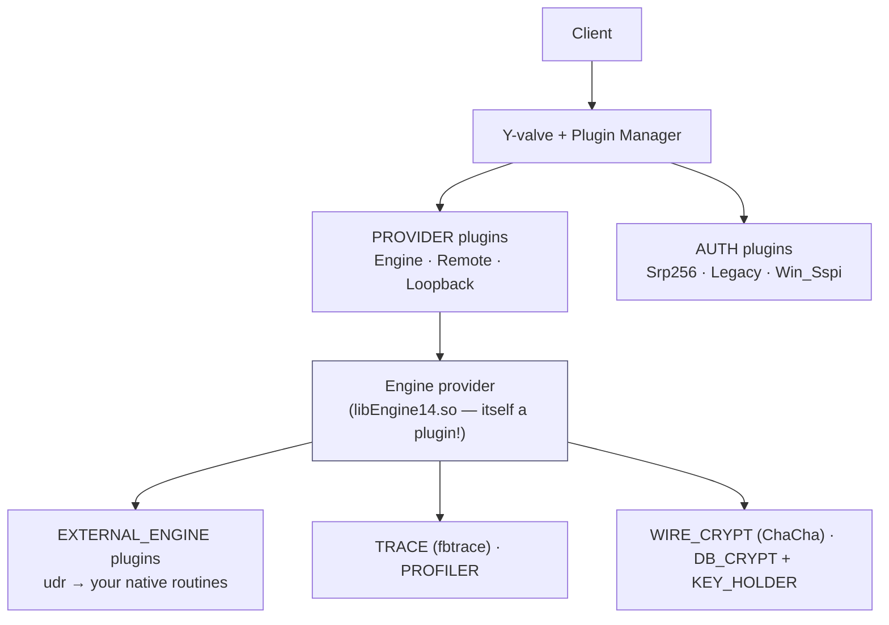
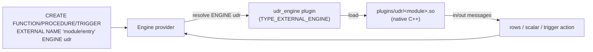
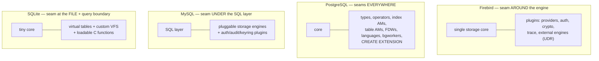

# Extensibility: UDR, Plugins and External Engines

A database's **extensibility** is how you add behaviour the shipped engine doesn't have — new functions in another language, new authentication schemes, new storage back-ends, new index types. Where a system places its extension "seams" shapes its whole ecosystem. This document describes Firebird 6's three extension mechanisms — the **plugin architecture**, **external engines**, and **UDR** (User Defined Routines) — grounded in the vendored source and verified by loading real plugins and running an external routine on a live server, then compares the approach with PostgreSQL, MySQL and SQLite.

It is a companion to the [main paper](README.md), whose [extensibility section](README.md#extensibility-of-firebird) and [Firebird 3 provider discussion](README.md#firebird-3-2016-unified-server-providers-and-plugins) introduce the plugin model, and it follows the [PSQL document](psql-and-stored-procedures.md), which covered the *in-engine* procedural language this one complements with *external* code. The [security](security-architecture.md), [wire-protocol](firebird-wire-protocol.md) and [replication](replication-architecture.md) documents each cover a specific plugin family in depth.

**Table of Contents**

* [Three ways to extend Firebird](#three-ways-to-extend-firebird)
* [The plugin architecture](#the-plugin-architecture)
* [External engines and UDR](#external-engines-and-udr)
* [A UDR routine, end to end (validated)](#a-udr-routine-end-to-end-validated)
* [Comparison: PostgreSQL, MySQL, SQLite](#comparison-postgresql-mysql-sqlite)
* [Where each system places its seams](#where-each-system-places-its-seams)
* [Discussion](#discussion)
* [Further research](#further-research)

## Three ways to extend Firebird

Firebird offers three distinct extension points, at three levels:

1. **PSQL** — logic *inside* the engine in Firebird's own procedural language (covered in the [PSQL document](psql-and-stored-procedures.md)).
2. **UDR / external routines** — procedures, functions and triggers whose body is *native code* (C++, or any language an external engine supports), declared with `EXTERNAL NAME ... ENGINE ...`.
3. **Plugins** — replaceable implementations of predefined engine roles (authentication, encryption, providers, external engines themselves, …), loaded from `$FIREBIRD/plugins`.

These are layered: a UDR routine is reached *through* an external-engine plugin, which is one of the plugin types below — so the plugin architecture is the foundation the other two extension points build on.

## The plugin architecture

Since Firebird 3, large parts of the engine are **plugins** — dynamic libraries in `$FIREBIRD/plugins` that implement a predefined C++ interface and are loaded on demand by the plugin manager ([`doc/README.plugins.html`](https://github.com/FirebirdSQL/firebird/blob/master/doc/README.plugins.html)). Strikingly, *core parts of Firebird are themselves plugins* — the engine that runs your queries is loaded as a plugin by the Y-valve. The plugin **types** (`IPluginManager` in `IdlFbInterfaces.h`):

| Type | # | Role | Shipped examples |
|---|---|---|---|
| `PROVIDER` | 1 | A whole engine/transport behind the Y-valve | Engine (the DB engine), Remote, Loopback |
| `AUTH_SERVER` / `AUTH_CLIENT` | 3 / 4 | Authentication | Srp, Srp256, Legacy_Auth, Win_Sspi |
| `AUTH_USER_MANAGEMENT` | 5 | The `CREATE USER` store | Srp, Legacy_UserManager |
| `EXTERNAL_ENGINE` | 6 | Runs external routines (UDR) | udr (C++), and custom engines |
| `TRACE` | 7 | Trace/audit sessions | fbtrace |
| `WIRE_CRYPT` | 8 | Wire encryption cipher | ChaCha, ChaCha64, Arc4 |
| `DB_CRYPT` | 9 | Page (at-rest) encryption | (site-supplied; see `examples/dbcrypt`) |
| `KEY_HOLDER` | 10 | Supplies the DB_CRYPT key | (site-supplied) |



_Figure 1: The Firebird plugin architecture — the Y-valve and plugin manager load providers, auth, external engines, trace, and crypto plugins; even the engine itself is a plugin_

Verified live: `$FIREBIRD/plugins` on the running server contains `libEngine14.so` (the FB6 engine provider), `libSrp.so` / `libLegacy_Auth.so` (auth), `libChaCha.so` (wire crypt), `libfbtrace.so` (trace), `libDefault_Profiler.so` (the FB5 profiler), and `libudr_engine.so` (the UDR external engine) — with `plugins.conf` wiring the UDR engine to the `plugins/udr` directory. Configuration selects which plugin fills each role (`Providers`, `AuthServer`, `UserManager`, `WireCryptPlugin`, …), so swapping an implementation is a config change, not a recompile.

## External engines and UDR

**UDR** (User Defined Routines) is Firebird's modern way to implement procedures, functions and triggers in native code. The declaration binds a SQL object to an entry point in an external module, run by a named **external engine** ([`doc/README.external_routines.txt`](https://github.com/FirebirdSQL/firebird/blob/master/doc/README.external_routines.txt)):

```sql
CREATE PROCEDURE gen_rows (start_n INTEGER, end_n INTEGER)
  RETURNS (n INTEGER)
  EXTERNAL NAME 'udrcpp_example!gen_rows'   -- module ! entry point
  ENGINE udr;                               -- which external engine runs it
```

The `udr` engine (the `libudr_engine.so` plugin, `TYPE_EXTERNAL_ENGINE`) loads the module from `plugins/udr/` and calls the entry point, passing input/output messages through the OO API. Because the *engine* is a plugin, UDR is not limited to C++: anyone can write an external-engine plugin that hosts another language (community engines exist for Java, .NET, etc.), and the SQL side is identical — only `ENGINE <name>` changes.



_Figure 2: A UDR call — the engine resolves `ENGINE udr` to the external-engine plugin, which loads the native module and runs the entry point in-process_

UDR **replaced the legacy UDF** mechanism (unsafe C functions with a fragile calling convention), which is deprecated; a `udf_compat` shim (`plugins/udr/libudf_compat.so`) eases migration. UDR routines run in engine space with a safe, versioned interface.

## A UDR routine, end to end (validated)

Using the shipped C++ example plugin (`plugins/udr/libudrcpp_example.so`), on a live Firebird 6 server:

```sql
CREATE PROCEDURE gen_rows (start_n INTEGER NOT NULL, end_n INTEGER NOT NULL)
  RETURNS (n INTEGER NOT NULL)
  EXTERNAL NAME 'udrcpp_example!gen_rows' ENGINE udr;

SELECT n FROM gen_rows(1, 5);
```

produced — with the row-generation logic executing in **C++ inside the engine**:

```text
N
=
1
2
3
4
5
```

The SQL object `gen_rows` is indistinguishable from a native selectable procedure at the call site (`SELECT ... FROM gen_rows(1,5)`), but its body is compiled native code loaded by the UDR plugin — the whole extension path (plugin → external engine → native module) exercised in one query.

## Comparison: PostgreSQL, MySQL, SQLite

| Extension point | **Firebird** | **PostgreSQL** | **MySQL** | **SQLite** |
|---|---|---|---|---|
| Native functions | UDR (`ENGINE udr`), C++ | [C functions](https://www.postgresql.org/docs/current/xfunc-c.html); many PLs | [Loadable functions (UDF)](https://dev.mysql.com/doc/extending-mysql/8.4/en/), components | [App-defined C functions](https://sqlite.org/appfunc.html) |
| Extra procedural languages | Via external engine (UDR) | **Pluggable PLs** (PL/Python, PL/Perl, PL/v8…) | No | No |
| Packaged extensions | Plugins (config-installed) | **[`CREATE EXTENSION`](https://www.postgresql.org/docs/current/sql-createextension.html)** (PostGIS…) | Components / plugins | [Run-time loadable extensions](https://sqlite.org/loadext.html) |
| Pluggable storage | No (single engine core) | [Table access methods](https://www.postgresql.org/docs/current/tableam.html) (v12+) | **[Storage engines](https://dev.mysql.com/doc/refman/8.4/en/pluggable-storage-overview.html)** (the signature) | No (one B-tree store) |
| Custom index types | No | **[Index access methods](https://www.postgresql.org/docs/current/xindex.html)** (GiST/GIN/BRIN…) | Full-text parser plugin | No (but [virtual tables](https://sqlite.org/vtab.html) can index) |
| External data sources | Via UDR / EXECUTE STATEMENT ON EXTERNAL | **[Foreign data wrappers](https://www.postgresql.org/docs/current/fdwhandler.html)** | FEDERATED engine | **[Virtual tables](https://sqlite.org/vtab.html)** (CSV, etc.) |
| Auth / crypto plugins | **Yes** (types 3–5, 8–10) | Yes (auth via libpq/GSS/LDAP) | [Plugin API](https://dev.mysql.com/doc/refman/8.4/en/plugin-api.html) (auth, audit, keyring) | No (in-process) |
| Custom types/operators | Domains only | **Rich** (`CREATE TYPE`/`OPERATOR`) | No | Type affinity only |
| Filesystem layer | No | No | No | **Custom [VFS](https://sqlite.org/vfs.html)** (encryption, WASM) |
| Background workers | Internal only | [Background workers](https://www.postgresql.org/docs/current/bgworker.html) | Thread pool | No |

## Where each system places its seams



_Figure 3: The same instinct — isolate variation behind an interface — placed at four different boundaries, yielding four different ecosystems_

This picture (developed in the [architecture comparison](architecture-comparison.md#discussion-what-the-contrasts-illuminate)) is the clearest way to see the difference: **MySQL** put the seam *under* the SQL layer (storage engines) and got a marketplace of engines that consolidated on InnoDB; **PostgreSQL** put *many* seams everywhere (types, index and table AMs, FDWs, languages) and got the richest extension ecosystem, reaching inside the engine including storage; **Firebird** put the seam *around* a single storage core (providers, auth, crypto, external engines) — extend the access paths and add native routines, but not the storage engine or index types; **SQLite** put it at the *filesystem and query* boundary (VFS, virtual tables, loadable functions).

## Discussion

**PostgreSQL is the extensibility champion, and it is not close.** It is the only one of the four that lets extensions reach *inside* the engine at nearly every layer — custom types and operators, pluggable index *and* table access methods, foreign data wrappers, multiple in-engine languages, background workers — all packaged with `CREATE EXTENSION`. PostGIS, which turns PostgreSQL into a first-class spatial database purely as an extension, is the proof. If "how much can I add without forking" is the question, PostgreSQL wins.

**Firebird's model is coherent and, since v3, genuinely modular — just aimed differently.** Firebird put its seams *around* the engine: you can replace authentication, wire and database encryption, tracing and providers, and you can add native routines in any language via external engines — and the architecture is clean enough that *the engine itself is a plugin* (verified: `libEngine14.so`). What you cannot do is swap the storage engine or add a new index type the way PostgreSQL or MySQL allow. That is a deliberate consequence of Firebird's single, strong storage core (the [multi-generational engine](transactions-and-concurrency.md)) — it trades pluggable storage for one well-integrated implementation. UDR is the workhorse: safe, versioned native code that looks like ordinary SQL at the call site.

**MySQL bet on one seam; SQLite bet on the smallest surface.** MySQL's storage-engine API is its defining extension point and its history — but the ecosystem consolidated on InnoDB, so in practice the seam matters more for the *concept* (server layer over storage) than for a live marketplace; beyond storage it offers auth/audit/keyring plugins and components. SQLite, true to its embedded design, keeps the core tiny and pushes extension to the boundaries an embedded library naturally has: **virtual tables** (FTS5 full-text, R-tree, JSON, CSV all ride this), custom **VFS** implementations (the mechanism behind encryption and the in-browser WASM build), and loadable C functions. It cannot host server plugins because there is no server — extension is compile-in or load-at-runtime C, which is exactly enough for its use case.

**The through-line:** all four share the instinct to isolate variation behind an interface; they simply chose different boundaries, and each boundary produced the ecosystem it could. Firebird's choice — plugins around a single core plus native UDR — gives operational flexibility (swap auth/crypto by config) and native-code escape hatches without surrendering the integration of one storage engine.

## Hands-on: samples, tests and debugging

### C++ sample — [`samples/cpp/extensibility.cpp`](samples/cpp/extensibility.cpp)

The [end-to-end UDR path](#a-udr-routine-end-to-end-validated) as a runnable program, on a scratch database. It binds two SQL names to entry points in the shipped example module (`plugins/udr/libudrcpp_example.so`, whose source is vendored at [`extern/firebird/examples/udr/`](extern/firebird/examples/udr/)) — the selectable procedure `gen_rows` and the variadic-style function `sum_args` — then calls both with plain SQL. It closes with the two SQL-visible surfaces of the plugin architecture: `RDB$PROCEDURES`/`RDB$FUNCTIONS` store the `module!entry` binding as ordinary metadata (`RDB$ENGINE_NAME`, `RDB$ENTRYPOINT`), and `RDB$CONFIG` names the plugin filling each role of [the plugin-type table](#the-plugin-architecture) above.

```sh
cmake -B build samples && cmake --build build
./build/extensibility        # default: inet://localhost//tmp/fbhandson/extensibility.fdb
```

Verified output (trimmed):

```text
select n from gen_rows(1, 5):
N
-
1
2
3
4
5

select sum_args(19, 20, 3):  42

external routines recorded in the system tables:
GEN_ROWS  ->  udrcpp_example!gen_rows  (engine UDR)
SUM_ARGS  ->  udrcpp_example!sum_args  (engine UDR)

plugins filling each role (rdb$config):
RDB$CONFIG_NAME       RDB$CONFIG_VALUE
--------------------- --------------------------
Providers             Remote, Engine14, Loopback
AuthServer            Srp256
UserManager           Srp
DefaultProfilerPlugin Default_Profiler
TracePlugin           fbtrace
WireCryptPlugin       ChaCha64, ChaCha, Arc4
```

### fb-cpp sample — [`samples/fb-cpp/extensibility.cpp`](samples/fb-cpp/extensibility.cpp)

The same UDR walk through [fb-cpp](https://github.com/asfernandes/fb-cpp) (vendored at [`extern/fb-cpp`](extern/fb-cpp)), the modern C++20 wrapper over the OO API. Because every extension seam in this document lives on the server side of the wire, the mirror is nearly 1:1 and the instructive diff is confined to client idiom: DDL and calls go through `Attachment::execute`, the single-value `sum_args` call becomes a one-liner `att.queryScalar<std::int32_t>(...)` returning `std::optional<int32_t>`, and the `gen_rows` and system-table listings are plain `Statement` fetch loops with `getInt32`/`getString` — no hand-rolled message metadata anywhere.

```sh
cmake -B build samples && cmake --build build   # needs libboost-dev + libboost-filesystem-dev
./build/fbcpp_extensibility
```

Verified: `gen_rows(1, 5)` yields `n = 1` through `n = 5`, `sum_args(19, 20, 3)` returns `42`, the system tables echo both bindings (`GEN_ROWS -> udrcpp_example!gen_rows (engine UDR)`, `SUM_ARGS -> udrcpp_example!sum_args (engine UDR)`), and the `RDB$CONFIG` plugin roster matches the OO-API run exactly — `Providers Remote, Engine14, Loopback` down to `WireCryptPlugin ChaCha64, ChaCha, Arc4`.

### JavaScript sample — [`samples/nodejs/extensibility.js`](samples/nodejs/extensibility.js)

The twin (`cd samples/nodejs && node extensibility.js`) does the same DDL, calls and `RDB$CONFIG` listing — and loses *nothing*, in instructive contrast to the [architecture](architecture-comparison.md) and [embedded](embedded-architecture-comparison.md) samples where the pure-JS driver could only reach half the story. The reason: this document's extension seams live on the **server** side of the wire. `EXTERNAL NAME ... ENGINE udr` is plain DDL and `gen_rows(1,5)` a plain `SELECT`; the `udr_engine` plugin loads the native module inside the server process, and the protocol neither knows nor cares that the rows were produced by compiled C++ (`gen_rows(1, 5) -> 1, 2, 3, 4, 5` verified).

### Rust sample — [`samples/rust/src/bin/extensibility.rs`](samples/rust/src/bin/extensibility.rs)

The same UDR walk through [rsfbclient](https://github.com/fernandobatels/rsfbclient), Rust's Firebird client (`cd samples/rust && cargo run --bin extensibility`). The JavaScript section's lesson — server-side seams cost a wire-protocol driver nothing — holds here for *both* of rsfbclient's backends, since `EXTERNAL NAME 'udrcpp_example!gen_rows' ENGINE udr` is just DDL through `tr.execute` and the calls are just queries. The client idiom is typed tuples rather than accessor methods: the table-valued `gen_rows` fetch is a `Vec<(i64,)>` from `tr.query`, the scalar `sum_args` call an `(i64,)` from `query_first`, and the nullable `RDB$CONFIG_VALUE` an `Option<String>` — note the `i64`, rsfbclient's one integer width for the `INTEGER` columns the fb-cpp sample reads with `getInt32`.

Verified: `gen_rows(1, 5)` yields `1` through `5`, `sum_args(19, 20, 3)` returns `42`, the system tables echo `GEN_ROWS -> udrcpp_example!gen_rows (engine UDR)` and `SUM_ARGS -> udrcpp_example!sum_args (engine UDR)`, and the plugin roster matches the other runs — `Providers Remote, Engine14, Loopback` through `WireCryptPlugin ChaCha64, ChaCha, Arc4`.

### Things to try

- Declare more of the shipped module: `gen_rows2` (same logic via typed `FB_UDR_MESSAGE`s), `mult`, or the `replicate` UDR *trigger* ([`extern/firebird/examples/udr/`](extern/firebird/examples/udr/) shows each declaration in a comment above its implementation).
- Break the binding: change the entry point to `'udrcpp_example!no_such'` or the engine to `ENGINE nope` — note *when* each error surfaces (DDL time vs first call) and what it says about lazy module loading.
- Call `sum_args(1, NULL, 3)` — verified to return NULL, but only because the example's C++ checks each null flag and decides to propagate ([`Functions.cpp`](extern/firebird/examples/udr/Functions.cpp)); a UDR sees raw null indicators and *chooses* its NULL semantics, unlike PSQL where SQL rules apply automatically.
- List the plugin *files* the config names: `ls /opt/firebird/plugins` next to the `RDB$CONFIG` output, and match `plugins.conf`'s `UDR_config` path to `plugins/udr/`.

### Debugging this in C++ (gdb)

With a [debug build of the engine](debugging-firebird.md), run the sample against a **local path** instead of `inet://` — then the engine, the `udr_engine` plugin *and* `libudrcpp_example.so` all load into the sample's own process and every seam in Figure 2 is a breakpoint:

```gdb
break PluginManager::getPlugins           # src/yvalve/PluginManager.cpp:1152 — every by-type plugin lookup
break ExtEngineManager::getEngine         # src/jrd/ExtEngineManager.cpp:2287 — resolving 'ENGINE udr' by name
break ExtEngineManager::makeProcedure     # src/jrd/ExtEngineManager.cpp:2044 — binding GEN_ROWS to the external engine
break Engine::loadModule                  # src/plugins/udr_engine/UdrEngine.cpp:590 — the dlopen of libudrcpp_example.so
break ExtEngineManager::Procedure::open   # src/jrd/ExtEngineManager.cpp:1346 — SELECT ... FROM gen_rows() entering native code
```

The order the breakpoints fire *is* the document's layering: the plugin manager finds the `EXTERNAL_ENGINE` plugin, `ExtEngineManager` resolves the engine name from the routine's metadata (watch `name` = `UDR`), `loadModule` maps the module named before the `!` in `RDB$ENTRYPOINT`, and `Procedure::open`'s backtrace shows a perfectly ordinary DSQL cursor (`Cursor::fetchNext` → …) whose leaf happens to be your compiled code — the call-site indistinguishability the [validated section](#a-udr-routine-end-to-end-validated) claims. From `Procedure::open`, `step` takes you straight into `examples/udr/Procedures.cpp`.

## Further research

**Firebird**

- [`doc/README.plugins.html`](https://github.com/FirebirdSQL/firebird/blob/master/doc/README.plugins.html) — the plugin architecture and types; [`doc/README.providers.html`](https://github.com/FirebirdSQL/firebird/blob/master/doc/README.providers.html) — providers and the Y-valve.
- [`doc/README.external_routines.txt`](https://github.com/FirebirdSQL/firebird/blob/master/doc/README.external_routines.txt) and [`examples/udr/`](https://github.com/FirebirdSQL/firebird/tree/master/examples/udr) — UDR syntax and the C++ example used above.
- The [security](security-architecture.md) (auth/crypt plugins), [wire-protocol](firebird-wire-protocol.md) (wire-crypt plugins) and [monitoring](monitoring-and-tuning.md) (trace/profiler plugins) documents for specific plugin families, and the [PSQL document](psql-and-stored-procedures.md) for the in-engine alternative to UDR.

**PostgreSQL**

- [Extending SQL](https://www.postgresql.org/docs/current/extend.html), [`CREATE EXTENSION`](https://www.postgresql.org/docs/current/sql-createextension.html), [C-language functions](https://www.postgresql.org/docs/current/xfunc-c.html), [Index access methods](https://www.postgresql.org/docs/current/xindex.html), [Table access methods](https://www.postgresql.org/docs/current/tableam.html), [Foreign data wrappers](https://www.postgresql.org/docs/current/fdwhandler.html), [Background worker processes](https://www.postgresql.org/docs/current/bgworker.html).

**MySQL**

- [Extending MySQL](https://dev.mysql.com/doc/extending-mysql/8.4/en/), [Pluggable storage engine overview](https://dev.mysql.com/doc/refman/8.4/en/pluggable-storage-overview.html), [Plugin API](https://dev.mysql.com/doc/refman/8.4/en/plugin-api.html), [Components](https://dev.mysql.com/doc/refman/8.4/en/component-loading.html).

**SQLite**

- [Run-time loadable extensions](https://sqlite.org/loadext.html), [Virtual table interface](https://sqlite.org/vtab.html), [VFS](https://sqlite.org/vfs.html), [FTS5](https://sqlite.org/fts5.html), [R-tree](https://sqlite.org/rtree.html).
