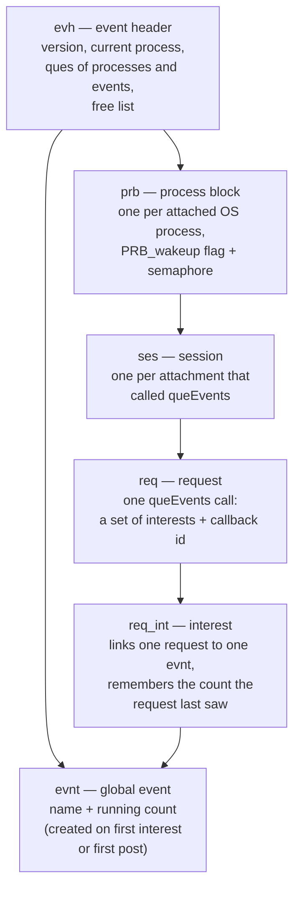
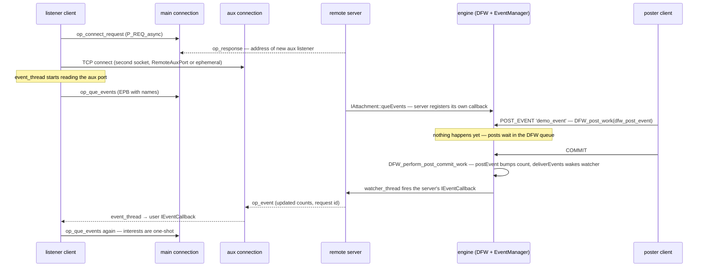

# The Event Subsystem — POST_EVENT and Asynchronous Notification

Everything in the collection so far has been request/response: a client asks, the server answers. Firebird's **event subsystem** is the one channel that points the other way — the *server* tells interested clients that something happened, without being asked. A trigger or procedure executes `POST_EVENT 'name'`, and every connection that registered interest in that name gets a callback — across attachments, across processes, across the network. This document dissects the whole path: the PSQL statement, the deferred-work commit coupling, the shared-memory event manager, the client API, and the **auxiliary wire connection** the notification travels on — then demonstrates the three defining semantics live with a new C++ sample ([`samples/events_demo.cpp`](samples/events_demo.cpp)) and compares with PostgreSQL's `LISTEN/NOTIFY`, MySQL and SQLite.

It extends the [wire-protocol document](firebird-wire-protocol.md) (the aux connection is the one channel that document didn't cover), reuses the deferred-work machinery from the [request-trace](request-lifecycle-code-trace.md#stage-7-exe-and-the-ddl-path-into-met) and [garbage-collection](garbage-collection-and-sweep.md) documents, and completes the [PSQL document](psql-and-stored-procedures.md)'s brief mention of `POST_EVENT`.

**Table of Contents**

* [What a Firebird event is — and is not](#what-a-firebird-event-is--and-is-not)
* [Posting: POST_EVENT is deferred work](#posting-post_event-is-deferred-work)
* [The event manager and its shared memory](#the-event-manager-and-its-shared-memory)
* [The client API: one-shot interests and count deltas](#the-client-api-one-shot-interests-and-count-deltas)
* [The wire: the auxiliary connection](#the-wire-the-auxiliary-connection)
* [Events in action (validated)](#events-in-action-validated)
* [Comparison: PostgreSQL, MySQL, SQLite](#comparison-postgresql-mysql-sqlite)
* [Discussion](#discussion)
* [Further research](#further-research)

## What a Firebird event is — and is not

A Firebird event is a **named counter**, nothing more: no payload, no message body, no queue of individual deliveries. Clients register interest in a set of names; the server delivers *"these names fired, this many times since you last looked."* Multiple posts coalesce into a count; concurrent posters of the same name don't create a backlog. This minimalism is a design position, not a limitation — it makes delivery idempotent (a lost wakeup costs nothing once the next one arrives), keeps the shared table bounded regardless of posting rate, and moves all questions of *what changed* back to SQL, where a woken client is expected to query for the details.

The name is a plain string (up to 127 bytes). The [grammar](grammar-and-parser.md) actually accepts an optional second argument — `POST_EVENT value event_argument_opt` in `parse.y`, carried into `PostEventNode::argument` — a vestigial slot that survives in the parse tree and deferred-work plumbing but delivers nothing to clients: counts are all a listener ever sees.

## Posting: POST_EVENT is deferred work

`POST_EVENT` is a PSQL statement, so it can appear in triggers, procedures and `EXECUTE BLOCK`. Its executor ([`StmtNodes.cpp`](https://github.com/FirebirdSQL/firebird/blob/master/src/dsql/StmtNodes.cpp), `PostEventNode::execute`) does *not* signal anyone. It posts a work item to the transaction:

```cpp
DeferredWork* work = DFW_post_work(transaction, dfw_post_event,
    EVL_expr(tdbb, request, event), nullptr, 0);
```

— the same **DFW** queue that carries [DDL side-effects to commit](request-lifecycle-code-trace.md#stage-7-exe-and-the-ddl-path-into-met). The consequences follow mechanically from that one choice:

* **Delivery is transactional.** `DFW_perform_post_commit_work` ([`dfw.epp`](https://github.com/FirebirdSQL/firebird/blob/master/src/jrd/dfw.epp)) runs *after* commit, walks the surviving work items, calls `EventManager::postEvent` for each `dfw_post_event`, then `deliverEvents()` once. Listeners never see events from uncommitted work.
* **Rollback swallows posts.** A rolled-back transaction's DFW queue is discarded; the events simply never happened (verified live below).
* **Posts coalesce per transaction.** Ten `POST_EVENT 'x'` in one transaction arrive as a count, in one delivery.

## The event manager and its shared memory

`EventManager` ([`event.cpp`](https://github.com/FirebirdSQL/firebird/blob/master/src/jrd/event.cpp)) is an `IpcObject` — like the [lock manager](request-lifecycle-code-trace.md#stage-8-the-lock-handler-and-the-lock-manager), it lives in a mapped shared-memory section (file pattern `fb_event_%s` in `file_params.h`, size `EventMemSize`, default 65 536 bytes, per-database configurable), so Classic processes, SuperServer threads and embedded attachments all see one table per database. Inside, the same 1980s offset-addressed (`SRQ_PTR`) arena style as the lock table:



_Figure 1: The shared-memory event table — processes own sessions, sessions own requests, and each request's interests link to global named counters_

The two halves of delivery:

* **`postEvent(length, name, count)`** — find or create the `evnt` block for the name, bump its count. Called once per surviving `POST_EVENT` at commit, cheap and lock-scoped.
* **`deliverEvents()`** — scan the `prb` que; every process with the `PRB_wakeup` flag gets its semaphore posted (`post_process`). Each process runs a **`watcher_thread`**; woken, it compares its sessions' interests against the current counts, and for every satisfied request fires the registered `IEventCallback` with the updated count block, then retires the request — *interests are one-shot*.

For an embedded attachment the callback lands directly in application code. For a networked client it lands in the remote **server**, which is itself just another event-API consumer — its callback forwards the notification down the wire.

## The client API: one-shot interests and count deltas

Registration flows through three helpers whose shapes explain the semantics:

* **`isc_event_block(&buffer, &result, n, name…)`** builds the **EPB** (event parameter block, `EPB_version1`): a version byte plus, per name, the string and a 4-byte count. It allocates *two* copies — the baseline (`buffer`) and the delivery target (`result`).
* **`IAttachment::queEvents(callback, length, buffer)`** registers the interest set and returns an `IEvents` handle (cancellable). The engine answers the *first* registration immediately with current counts — that initial callback is a baseline, not a notification (the live demo consumes and discards it).
* **`isc_event_counts(&total, len, buffer, result)`** subtracts baseline from delivery, yielding *how many times each name fired since you last looked*, and copies `result` over `buffer` so the next registration starts from the new baseline.

Because interests are one-shot, the idiomatic loop is: callback fires → compute deltas → **re-queue** → then react. The legacy C API mirrors this exactly (`isc_que_events` asynchronous, `isc_wait_for_event` as a blocking convenience); the OO API's `IEventCallback` is the same mechanism with a vtable.

## The wire: the auxiliary connection

A blocked `op_response` channel can't carry unsolicited data — the main connection is strictly request/response. So the first `queEvents` on an attachment builds a second, one-way channel ([`interface.cpp`](https://github.com/FirebirdSQL/firebird/blob/master/src/remote/client/interface.cpp)):

1. Client sends **`op_connect_request`** (`P_REQ_async`, opcode 53) on the main connection.
2. The server's `aux_request` ([`inet.cpp`](https://github.com/FirebirdSQL/firebird/blob/master/src/remote/inet.cpp)) binds a **new listening socket** — an ephemeral port by default, or a fixed one if `RemoteAuxPort` is set in `firebird.conf` (the setting that exists precisely so firewalls and NAT can pass this second connection) — and returns its address in the response.
3. The client's `aux_connect` opens a **second TCP connection** to that port, kept as `port_async` with the `PORT_async` flag, and starts a dedicated `event_thread` reading it.
4. **`op_que_events`** (opcode 48) then registers the interest set over the *main* connection; the server-side `rem_port::que_events` ([`server.cpp`](https://github.com/FirebirdSQL/firebird/blob/master/src/remote/server/server.cpp)) calls the engine's `queEvents` with a callback of its own.
5. When that callback fires, the server writes **`op_event`** (opcode 52) — attachment id, the updated EPB, the client's request id — onto the aux connection, where `event_thread` decodes it and invokes the user's `IEventCallback`.



_Figure 2: The event round trip — registration and posting travel the main connections, but the notification itself arrives on the dedicated auxiliary channel_

XNET (Windows local) does the same dance over a shared-memory channel instead of a socket. For an embedded attachment there is no wire at all — the watcher thread calls straight into the application.

## Events in action (validated)

[`samples/events_demo.cpp`](samples/events_demo.cpp) (built via the existing [`samples/CMakeLists.txt`](samples/CMakeLists.txt)) opens two attachments to the live server — a listener that registers `'demo_event'` with `queEvents`, and a poster that runs `EXECUTE BLOCK` statements. Output against `inet://localhost/employee`:

```
listener registered for 'demo_event' (baseline consumed)
after POST_EVENT + ROLLBACK: delivered count = 0  (correct - rollback swallows posts)
3 x POST_EVENT executed, not yet committed - waiting briefly...
before COMMIT: delivered count = 0  (correct - delivery is commit-time)
after COMMIT: delivered count = 3  (correct - one delivery, count 3)
PASS
```

All three semantics in one run: rollback delivered nothing; three executed `POST_EVENT`s delivered nothing *until* commit; commit delivered once with count 3 (`isc_event_counts` computing the delta).

The auxiliary connection is directly observable. With the demo paused after registration (`EVENTS_DEMO_PAUSE_MS=5000`), the process's sockets in `/proc/net/tcp`:

```
local 0100007F:E586  remote 0100007F:0BEA   ← attachment 1  (port 0x0BEA = 3050)
local 0100007F:E58E  remote 0100007F:0BEA   ← attachment 2
local 0100007F:9238  remote 0100007F:859D   ← aux event connection (ephemeral port 34205)
```

Two attachments, **three** TCP connections — the third to a server port that isn't 3050, exactly the `aux_request` ephemeral listener (pin it with `RemoteAuxPort` when a firewall sits between client and server; this "second connection to a random port" is the classic Firebird-events-through-firewall pitfall).

## Comparison: PostgreSQL, MySQL, SQLite

| | **Firebird events** | **PostgreSQL LISTEN/NOTIFY** | **MySQL** | **SQLite** |
|---|---|---|---|---|
| Primitive | named counter, no payload | named channel + optional **payload** (≤ ~8 KB) | — none | in-process hooks (`sqlite3_update_hook`, `commit_hook`) |
| Posted from | PSQL (`POST_EVENT` in trigger/proc/block) | SQL (`NOTIFY` / `pg_notify()`, incl. triggers) | — | C API only, same process |
| Transactional | yes — delivered at commit, rollback discards | yes — delivered at commit, rollback discards | — | update hook fires per row *as it happens*, commit hook at commit |
| Coalescing | posts collapse to a count | duplicate (channel, payload) pairs in one tx collapse to one | — | none |
| Delivery channel | dedicated **aux connection**, true push, callback thread | on the **same connection**, between queries — client must be idle or poll (`PQconsumeInput`) | — | direct callback in-process |
| Cross-machine | yes | yes | — | no (in-process by definition) |
| Typical substitute | — | — | polling, binlog readers (Debezium), MQ | polling `PRAGMA data_version` from other connections |

The interesting contrasts:

* **PostgreSQL** is the close cousin: transactional, commit-time, coalescing — the same semantics almost point for point. It adds a payload (with a queue, `pg_notification_queue_usage()`, and the size cap that comes with one) but delivers on the *main* connection: a client busy in a query, or mid-transaction, sees notifications only when it next touches the connection. Firebird's payload-free counters are weaker as a messaging primitive but its aux channel is genuine push — the callback fires in a dedicated thread no matter what the main connection is doing.
* **MySQL** simply has no server-push notification. The ecosystem answer is polling tables, external message queues, or tailing the binlog (the Debezium pattern) — a whole infrastructure category replacing one statement.
* **SQLite** inverts the problem: in-process, hooks are trivially available and synchronous, but they only observe *your own connection's* writes. Another process writing the same file is invisible except by polling `PRAGMA data_version`.
* **Everything here is signaling, not messaging.** Neither Firebird events nor `NOTIFY` guarantee delivery to a client that wasn't listening at commit time; there is no replay, no persistence, no ordering contract beyond the counter/queue. Applications needing those semantics build an outbox table (queryable, transactional, replayable) and use the event merely as the doorbell — which is precisely the design Firebird's payload-free counters push you toward from the start.

## Discussion

The event subsystem is small — one shared-memory table, four opcodes, one PSQL statement — but it closes the architectural loop this collection has traced: it reuses **DFW** (so notification honors transaction semantics for free), **IPC shared memory** in the lock-manager style (so it works identically for Classic processes and SuperServer threads), and the **remote proxy pattern** (the server consumes the same event API it re-exports, with one extra channel where the request/response discipline of the main connection couldn't fit). Nothing in it is new machinery; it is existing machinery composed — which is, in miniature, the recurring Firebird design story the [Reading Guide](READING-GUIDE.md) draws out.

## Hands-on: samples, tests and debugging

### C++ sample — [`samples/events_demo.cpp`](samples/events_demo.cpp)

The sample behind [Events in action](#events-in-action-validated): a listener attachment registers `'demo_event'` with `queEvents` (consuming the baseline callback), a poster attachment exercises the three semantics — rollback swallows posts, delivery waits for commit, posts coalesce to a count — with `isc_event_block`/`isc_event_counts` doing the [delta bookkeeping](#the-client-api-one-shot-interests-and-count-deltas).

```sh
cmake -B build samples && cmake --build build
./build/events_demo              # default: inet://localhost/employee
```

Verified output (re-run for this section, identical to the transcript above):

```text
listener registered for 'demo_event' (baseline consumed)
after POST_EVENT + ROLLBACK: delivered count = 0  (correct - rollback swallows posts)
3 x POST_EVENT executed, not yet committed - waiting briefly...
before COMMIT: delivered count = 0  (correct - delivery is commit-time)
after COMMIT: delivered count = 3  (correct - one delivery, count 3)
PASS
```

### fb-cpp sample — [`samples/fb-cpp/events.cpp`](samples/fb-cpp/events.cpp)

The same three semantics through [fb-cpp](https://github.com/asfernandes/fb-cpp) (vendored at [`extern/fb-cpp`](extern/fb-cpp)), the modern C++20 wrapper over the OO API. The instructive diff is how much of the client-side dance disappears: where the OO-API sample hand-rolls `isc_event_block` for the EPB, an `IEventCallback` with manual `addRef`/`release`, `isc_event_counts` for the delta, and an explicit re-queue after every one-shot delivery, fb-cpp's `EventListener` does all of that internally — it consumes the baseline, computes per-name deltas, re-queues itself, and hands the callback a `std::vector<EventCount>` of `{name, count}` pairs on a dispatcher thread. What remains for the sample to write is the genuinely application-level part: a mutex/condition-variable rendezvous between that dispatcher thread and `main`.

```sh
cmake -B build samples && cmake --build build   # needs libboost-dev + libboost-filesystem-dev
./build/fbcpp_events
```

Verified: `PASS`, with the same three checkpoints as the OO-API run — `delivered count = 0` after `POST_EVENT` + `ROLLBACK`, `0` before `COMMIT` of the triple post, `3` after it ("one delivery, count 3") — the only textual delta being the first line's "(baseline consumed by EventListener)", naming who swallowed the baseline this time.

### JavaScript sample — [`samples/nodejs/events.js`](samples/nodejs/events.js)

node-firebird implements the whole [auxiliary-channel dance](#the-wire-the-auxiliary-connection) in JavaScript — `db.attachEvent()` sends `op_connect_request` and opens the second socket (`lib/wire/eventConnection.js`), `registerEvent()` sends `op_que_events`, and each `op_event` is emitted as `'post_event'`, after which the driver re-queues the one-shot interest itself. Run: `cd samples/nodejs && node events.js`. Verified output:

```text
listener subscribed to 'demo_event' over the aux connection (baseline counter = 1)
after POST_EVENT + ROLLBACK : 0 deliveries (rollback swallows posts)
3 posts, before COMMIT      : 0 deliveries (delivery is commit-time)
after COMMIT                : 'demo_event' counter=4, delta=3 (one delivery, 3 posts coalesced)
done.
```

Same three semantics — with one instructive difference. Where `isc_event_counts` hands the C++ client a *delta*, node-firebird emits the **raw running counter** from the EPB, and that counter is `evnt_count + 1` (the engine adds one when serializing the delivery block — `event.cpp:884`): a fresh event block reports `1` at baseline and `4` after three posts. The C++ idiom never notices the `+1` because subtracting the baseline cancels it; a raw-counter client must do its own subtraction, as the sample does.

### Rust sample — [`samples/rust/src/bin/events.rs`](samples/rust/src/bin/events.rs)

The same commit semantics through [rsfbclient](https://github.com/fernandobatels/rsfbclient), Rust's Firebird client (`cd samples/rust && cargo run --bin events`). The driver offers two altitudes: `wait_for_event(name)` — the blocking `isc_wait_for_event` dance, run here on its own thread so `main` can watch whether it woke — and `listen_event(name, closure)`, which packages the one-shot re-queue loop: the closure runs after each delivery, gets the connection back (the sample runs SQL from inside it), and stops the loop by returning `false`. Two honest gaps against the sections above: the wakeup carries no counts — `wait_for_event` returns only `()`, so the "one delivery, count 3" that `isc_event_counts` and node-firebird's raw counter expose stays hidden inside the client library — and events are native-backend only, which the sample proves by making the same call on a pure-Rust connection.

Verified: the listener stays `still blocked` after `POST_EVENT` + `ROLLBACK` and again before the `COMMIT` of the triple post, then `wait_for_event returned` once it commits; `listen_event: handler fired 2 times over 2 committed posts` before its closure ended the re-queue loop; and the pure-Rust backend answers the identical call with `error: Events only works with the native client` — no auxiliary channel in the wire implementation yet.

### Free Pascal sample — [`samples/fpc/events.pas`](samples/fpc/events.pas)

The same three semantics through [fbintf](https://github.com/MWASoftware/fbintf) (vendored at [`extern/fbintf`](extern/fbintf)), MWA Software's Firebird Pascal API — the layer under IBX — driving the same libfbclient behind COM-style reference-counted interfaces (`make -C samples/fpc bin/events && samples/fpc/bin/events`). fbintf sits between fb-cpp's fully-automatic `EventListener` and rsfbclient's countless `wait_for_event`: `LA.GetEventHandler('demo_event')` returns an `IEvents`, `AsyncWaitForEvent` arms the auxiliary connection and fires a method-of-object callback on fbintf's event thread, and — unlike rsfbclient's `()` wakeup — `ExtractEventCounts` returns the per-name delivered deltas, the `isc_event_counts` arithmetic pre-packaged with the previous counts kept as baseline. What fbintf does *not* automate is the one-shot re-queue: every delivery disarms the wait, and the sample must call `AsyncWaitForEvent` again after each callback (it opens with a committed primer post precisely to prove that plumbing before the assertions start).

Verified: `PASS` — the primer post is delivered with count 1, `delivered count = 0` after `POST_EVENT` + `ROLLBACK`, still `0` before the `COMMIT` of the triple post, and `delivered count = 3 (correct - one delivery, count 3)` after it.

### Things to try

- Set `EVENTS_DEMO_PAUSE_MS=5000` and, during the pause, list the demo process's sockets (`ss -tnp | grep events_demo`): two attachments, **three** TCP connections — the third is the aux channel to a non-3050 ephemeral port, the [`RemoteAuxPort` firewall pitfall](#the-wire-the-auxiliary-connection) made visible.
- Run both samples at once: one `POST_EVENT` + commit from a third connection (isql) wakes *both* listeners — one `evnt` counter, many interests.
- In `events.js`, register a second name that is never posted and confirm it never appears: deliveries are per-satisfied-interest, not broadcast.
- Change the JS poster's three separate `POST_EVENT` blocks to one block posting three *different* names — one `op_event` arrives carrying all three, still one delivery.

### Debugging this in C++ (gdb)

The full posting path is breakpointable in a [debug engine](debugging-firebird.md) (attach to the server process, or run the demo against a local path with `FIREBIRD=<debug root>` for the embedded case where listener callbacks fire in *your* process):

```gdb
break PostEventNode::execute                 # src/dsql/StmtNodes.cpp:9097 — the PSQL statement: DFW_post_work, no signaling
break DFW_perform_post_commit_work           # src/jrd/dfw.epp:1556 — commit replays surviving work items
break EventManager::postEvent                # src/jrd/event.cpp:361 — the evnt counter bumps
break EventManager::deliverEvents            # event.cpp:401 — wake every process with PRB_wakeup
break EventManager::watcher_thread           # event.cpp:1297 — the per-process delivery thread
break aux_request                            # src/remote/inet.cpp:1599 — server binds the aux listener (server-side)
```

The first three breakpoints, hit in order by the demo's step 3, *are* this document's argument: `PostEventNode::execute` fires three times inside the transaction and nobody wakes (the backtrace ends at `DFW_post_work`); at commit, `DFW_perform_post_commit_work` walks the queue and calls `postEvent` — inspect `event->evnt_count` climbing — and only then does `deliverEvents` post semaphores. In the rollback run, breakpoints two and three never fire at all: the swallowed posts are visibly *absent* from the commit path. `watcher_thread` shows the delivery half asynchronously comparing `rint_count` against `evnt_count` (the one-shot interest retiring in the same pass), and on the wire path `aux_request` fires once per listening attachment — the moment the second socket of Figure 2 comes into being.

## Further research

* [`src/jrd/event.cpp`](https://github.com/FirebirdSQL/firebird/blob/master/src/jrd/event.cpp) / [`event.h`](https://github.com/FirebirdSQL/firebird/blob/master/src/jrd/event.h) — the manager and the shared structures (`evh`/`prb`/`ses`/`req`/`req_int`/`evnt`); `watcher_thread` and `post_process` are the delivery heart.
* [`src/jrd/dfw.epp`](https://github.com/FirebirdSQL/firebird/blob/master/src/jrd/dfw.epp) — `DFW_perform_post_commit_work`, the commit coupling.
* [`src/remote/inet.cpp`](https://github.com/FirebirdSQL/firebird/blob/master/src/remote/inet.cpp) — `aux_request`/`aux_connect`, the second socket; [`src/remote/server/server.cpp`](https://github.com/FirebirdSQL/firebird/blob/master/src/remote/server/server.cpp) — `rem_port::que_events` and the forwarding callback.
* [`examples/interfaces/08.events.cpp`](https://github.com/FirebirdSQL/firebird/blob/master/examples/interfaces/08.events.cpp) — the upstream OO-API example this repo's [`samples/events_demo.cpp`](samples/events_demo.cpp) extends with the rollback/commit-timing proofs.
* PostgreSQL docs: [NOTIFY](https://www.postgresql.org/docs/current/sql-notify.html) — read the "Notes" section side by side with this document; the semantic overlap is striking.
* Companion docs: [wire protocol](firebird-wire-protocol.md) (the main connection this one supplements) · [PSQL](psql-and-stored-procedures.md) (where `POST_EVENT` lives) · [request trace](request-lifecycle-code-trace.md) and [garbage collection](garbage-collection-and-sweep.md) (the DFW machinery events reuse).
