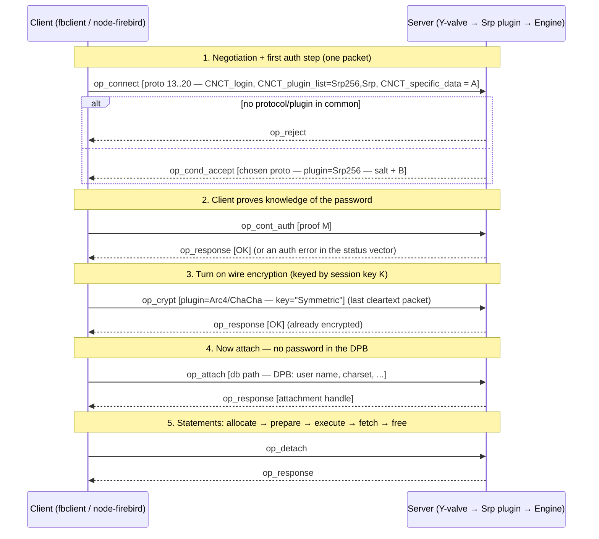
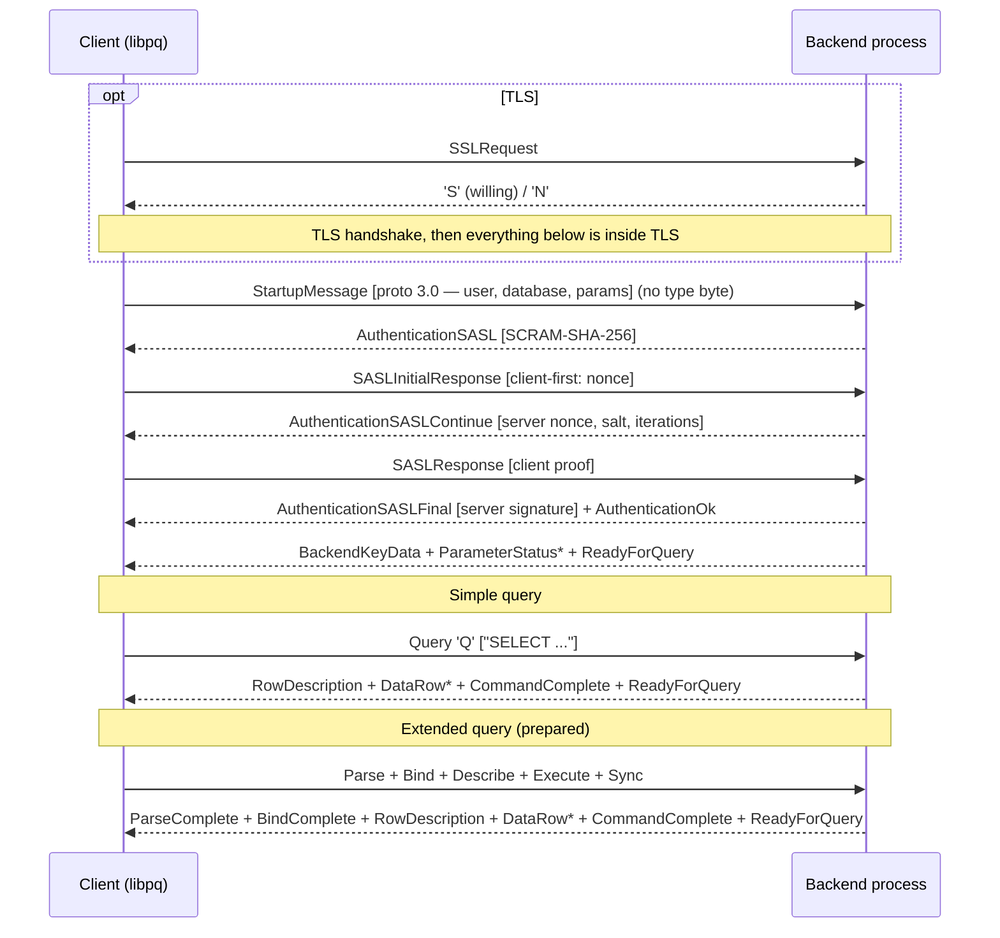
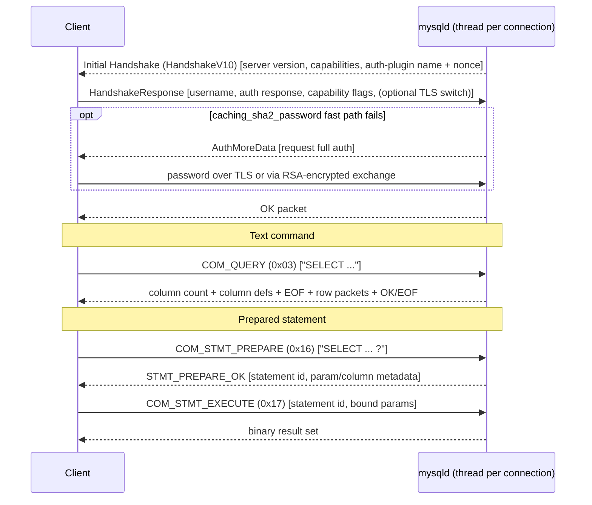

# The Firebird 6 Wire Protocol and SRP Authentication

This companion to [Conceptual Architecture for Firebird](README.md) documents the **REMOTE** subsystem from the outside: the bytes that travel between a client and a Firebird 6 server. It complements the architectural view (Figure 1's remote-connection system, and Figure 6's provider split) with the concrete packet exchange, then goes deep on **SRP** — the Secure Remote Password authentication Firebird has used since version 3 — including exactly where Firebird's implementation diverges from the SRP papers and RFCs, and what its `Srp256` variant improves.

Every protocol fact here is drawn from the Firebird source vendored in this repository at [`extern/firebird`](extern/firebird) (chiefly [`src/remote/protocol.h`](https://github.com/FirebirdSQL/firebird/blob/master/src/remote/protocol.h) and [`src/auth/SecureRemotePassword/`](https://github.com/FirebirdSQL/firebird/tree/master/src/auth/SecureRemotePassword)), and every code sample in [`samples/`](samples/) was run against a live Firebird 6.0 server.

**Table of Contents**

* [Where this fits in the architecture](#where-this-fits-in-the-architecture)
* [Packet model: opcodes and XDR](#packet-model-opcodes-and-xdr)
* [Protocol versions](#protocol-versions)
* [The connection lifecycle](#the-connection-lifecycle)
* [SRP authentication in depth](#srp-authentication-in-depth)
* [How Firebird's SRP differs from the papers](#how-firebirds-srp-differs-from-the-papers)
* [What Srp256 improves](#what-srp256-improves)
* [Wire encryption: from the session key to the cipher](#wire-encryption-from-the-session-key-to-the-cipher)
* [Protocol comparison: PostgreSQL and MySQL](#protocol-comparison-postgresql-and-mysql)
* [Worked examples](#worked-examples)
* [Client implementations (Node.js / TypeScript and others)](#client-implementations-nodejs--typescript-and-others)
* [Further research: papers, RFCs and videos](#further-research-papers-rfcs-and-videos)

## Where this fits in the architecture

In the paper's terms, everything below happens inside the **remote connection system (REMOTE)** and, on the server, up to the point where the **Y-valve** hands the attach call to the **Engine** provider. The client library (`fbclient`) contains the client half; a Firebird server process (or, for embedded, nothing at all — the Engine provider is loaded in-process and no wire protocol is used) contains the server half. The protocol is deliberately defined in terms of self-contained *blocks* rather than a stream of messages, "to separate the protocol from the transport layer" (comment in `protocol.h`), which is why the same opcodes run unchanged over TCP/IP, over the Windows-only XNET shared-memory transport, and over the WireCrypt-encrypted channel.

## Packet model: opcodes and XDR

A packet begins with a 4-byte **operation code** and is followed by operation-specific fields encoded in **XDR** (RFC 4506): 32-bit integers in big-endian, and variable-length "opaque" data as a 4-byte length, the bytes, then zero-padding up to a 4-byte boundary. `samples/nodejs/srp-handshake.js` implements exactly this encoding in its `Writer`/`Reader` classes.

The opcodes are the `enum` `P_OP` in [`protocol.h`](https://github.com/FirebirdSQL/firebird/blob/master/src/remote/protocol.h). The commented-out ranges (5, 7–8, 10–18, 45–47) are a fossil record of the architecture's history: the old page-server and lock-manager-over-the-wire operations that Vulcan and later the unified-server work removed. The opcodes still in use for a normal session are a small subset:

| Opcode | # | Meaning |
|---|---|---|
| `op_connect` | 1 | Client's opening packet: protocol versions offered + first auth data |
| `op_accept` | 3 | Server selects a protocol (pre-auth-plugin servers) |
| `op_reject` | 4 | No protocol/plugin in common |
| `op_response` | 9 | Generic response: object handle + status vector |
| `op_attach` / `op_create` | 19 / 20 | Attach to / create a database |
| `op_detach` / `op_drop_database` | 21 / 81 | Close / delete a database |
| `op_transaction` … `op_commit` … `op_rollback` | 29, 30, 31 | Transaction control |
| `op_allocate_statement` … `op_prepare_statement` … `op_execute` … `op_fetch` … `op_free_statement` | 62, 68, 63, 65, 67 | The DSQL statement lifecycle |
| `op_cont_auth` | 92 | Continue a multi-step authentication (SRP phase 2+) |
| `op_crypt` / `op_crypt_key_callback` | 96 / 97 | Start wire encryption / key callback for db encryption |
| `op_cond_accept` | 98 | Accept protocol **and** ask the client to continue auth before attach |
| `op_accept_data` | 94 | Accept protocol and return some auth data |
| `op_batch_create` … `op_batch_exec` … `op_batch_sync` | 99–111 | Batch API (protocol 17+) |
| `op_fetch_scroll` | 112 | Scrollable cursor fetch (protocol 18+) |
| `op_inline_blob` | 114 | Inline small blobs with the result row (protocol 19+) |

## Protocol versions

Since protocol 11, Firebird sets the high bit (`FB_PROTOCOL_FLAG = 0x8000`) in the version number to distinguish itself from the last Borland InterBase protocol. An `op_connect` packet offers a *list* of `(version, architecture, min-type, max-type, weight)` tuples; the server picks the highest it also supports and returns it. Because servers ignore versions they do not recognize, a client can safely offer the whole list — as `samples/nodejs/srp-handshake.js` does, offering 13 through 20.

The versions and the feature each one added (from the comments in `protocol.h`):

| Version | On the wire | Added |
|---|---|---|
| 10 | `10` | Warnings; no status-code encoding |
| 11 | `0x800B` | Separation from InterBase; user-auth operations (`op_authenticate_user`, `op_trusted_auth`) |
| 12 | `0x800C` | Asynchronous `op_cancel` |
| 13 | `0x800D` | **Authentication plugins** (`op_cont_auth`) and packed, null-aware SQL messages — the basis of SRP; **Firebird 3** |
| 14 | `0x800E` | Fix to the database crypt-key callback |
| 15 | `0x800F` | Crypt-key callback at connect phase |
| 16 | `0x8010` | Statement timeouts; **Firebird 4** |
| 17 | `0x8011` | `op_batch_*`, `op_info_batch` |
| 18 | `0x8012` | `op_fetch_scroll` (scrollable cursors over the wire); **Firebird 5** |
| 19 | `0x8013` | `op_inline_blob` |
| 20 | `0x8014` | Flags passed to `IStatement::prepare`; **Firebird 6** (verified: our FB6 server negotiates 20) |

The `architecture` field is almost always `arch_generic` (1); the historical per-CPU architecture negotiation for XDR shortcuts is effectively unused. The `min-type`/`max-type` fields negotiate the *packet type* (`ptype_batch_send`, `ptype_lazy_send`, …), and the high bit of the max-type carries the optional zlib **wire-compression** flag (`pflag_compress`), documented in [`doc/README.wire.compression.html`](https://github.com/FirebirdSQL/firebird/blob/master/doc/README.wire.compression.html).

## The connection lifecycle

A modern (protocol 13+) authenticated, encrypted session looks like this. Authentication runs in **cleartext** — that is the entire point of SRP, and is safe because an eavesdropper learns nothing usable — and wire encryption begins only afterwards, keyed by the secret the two sides just derived.



The `op_connect` packet carries a **user identification block**: a sequence of tag/length/value triples (`CNCT_login`, `CNCT_plugin_name`, `CNCT_plugin_list`, `CNCT_specific_data`, `CNCT_client_crypt`, …) defined near the bottom of `protocol.h`. `CNCT_specific_data` is chunked into ≤254-byte pieces each prefixed with a sequence byte, because the client's SRP public key is 1024 bits of hex text. `CNCT_client_crypt` announces the client's wire-encryption stance (`DISABLED`/`ENABLED`/`REQUIRED`); a server whose `WireCrypt = Enabled` (the default) rejects a `DISABLED` client with `isc_wirecrypt_incompatible` — a real error the samples had to account for.

`op_cond_accept` (opcode 98) is the key Firebird-3-era addition: it lets the server accept the protocol **and** demand that authentication complete *before* the `op_attach`, folding what used to be separate steps into the handshake.

## SRP authentication in depth

SRP is an **augmented password-authenticated key exchange (PAKE)**: the client proves it knows the password and both sides derive a shared session key, without the password (or anything from which it can be recovered offline by a passive eavesdropper) ever crossing the wire, and without the server storing the password itself. Firebird implements **SRP-6a** (Tom Wu; see [RFC 2945](https://www.rfc-editor.org/rfc/rfc2945) and, for the TLS parameter groups, [RFC 5054](https://www.rfc-editor.org/rfc/rfc5054)).

**Setup (at user creation).** The `Srp` user manager picks a random 32-byte **salt** `s` and stores, in the security database, the salt and a **verifier**

```
x = SHA1(s | SHA1(USERNAME ':' password))
v = g^x mod N
```

It never stores the password. `N` is a fixed 1024-bit safe prime and `g = 2` (both hard-coded in [`srp.cpp`](https://github.com/FirebirdSQL/firebird/blob/master/src/auth/SecureRemotePassword/srp.cpp); this is Tom Wu's original demonstration group, not one of the RFC 5054 appendix groups). Note the username is folded into `x`, so renaming a user invalidates the verifier — matching RFC 2945.

**The exchange** (numbered as in the "Order of battle" comment in [`srp.h`](https://github.com/FirebirdSQL/firebird/blob/master/src/auth/SecureRemotePassword/srp.h)):

1. Client picks a random private `a` and sends `A = g^a mod N` (in `op_connect`).
2. Server looks up `s` and `v`, picks a random private `b`, and sends `s` and `B = (k·v + g^b) mod N`, where `k = SHA1(N | PAD(g))` (in `op_cond_accept`).
3. Both compute the scramble `u = SHA1(A | B)` and the shared secret:
   * client: `S = (B − k·g^x) ^ (a + u·x) mod N`
   * server: `S = (A · v^u) ^ b mod N`
   These are algebraically equal. The **session key** is `K = SHA1(S)`.
4. Client sends the **proof** `M = H(H(N) ⊕ H(g), H(USERNAME), s, A, B, K)` (in `op_cont_auth`); the server recomputes it and compares. `H` is SHA-256 for `Srp256`, SHA-1 for legacy `Srp`.

The payoff is visible in the sample output: the password is never transmitted, and `K` — derived independently on both sides — becomes the wire-encryption key without itself ever being sent.

## How Firebird's SRP differs from the papers

Reading [`srp.cpp`](https://github.com/FirebirdSQL/firebird/blob/master/src/auth/SecureRemotePassword/srp.cpp) against RFC 2945/5054 turns up several deviations. They are self-consistent (client and server agree, so authentication works), but they matter to anyone writing an independent client — the pure-JS `node-firebird` driver carries code comments about bugs caused by exactly these points, reproduced in [`samples/nodejs/srp-handshake.js`](samples/nodejs/srp-handshake.js):

1. **`u` (and `S`) hash the *minimal* magnitude bytes, not the padded form.** RFC 5054 specifies `u = SHA1(PAD(A) | PAD(B))` with both operands zero-padded to `|N|` = 128 bytes. Firebird's `computeScramble()` calls `processStrippedInt`, which hashes the big-integer's minimal big-endian encoding and *strips* a leading zero byte. An independent client that pads here (or that carries a spurious leading zero) computes a different `u` whenever `A` or `B` has a high zero byte — roughly a 1-in-256 chance per connection, i.e. sporadic, maddening auth failures. (Only `k = SHA1(N | PAD(g))` uses padding, and only for `g`.)

2. **The session key `K` is a fixed-length digest that may start with `0x00`.** `K = SHA1(S)` is 20 raw bytes. Firebird hashes those 20 bytes directly into the proof (`digest.process(sessionKey)`) and uses them directly as the cipher key. A client that routes `K` through a big-integer type drops any leading zero byte (~1 connection in 256) and then both the proof and the derived cipher key diverge. The live run in [Worked examples](#worked-examples) actually produced a `K` beginning `00…`, exercising this path.

3. **The proof's `n1` uses modular *exponentiation*, not XOR.** RFC 2945 defines the first proof term as `H(N) XOR H(g)`. Firebird's `clientProof()` computes `n1 = H(N)^H(g) mod N` with `BigInteger::modPow` — the `^` in the source comment `H(H(prime) ^ H(g), ...)` was read as "power", not "xor". Harmless once both ends agree, but it means Firebird's proof is not the RFC's proof.

4. **The proof mixes hash functions.** In `Srp256`, the *outer* proof digest is SHA-256, but the *inner* hashes (`H(N)`, `H(g)`, `H(USERNAME)`) and the session key `K = SHA1(S)` remain **SHA-1** in every variant. Only the final proof digest changes with the plugin. This is the single most common mistake when adding `Srp256` support to a client that already spoke `Srp`.

5. **Fixed 1024-bit group.** Firebird ships exactly one group. There is no group negotiation, so the strength of the discrete-log problem underpinning SRP is capped at 1024 bits regardless of which hash the proof uses.

## What Srp256 improves

Firebird 3.0.0 shipped SRP using SHA-1 throughout. A later security review (documented in-tree in [`doc/README.SecureRemotePassword.html`](https://github.com/FirebirdSQL/firebird/blob/master/doc/README.SecureRemotePassword.html)) concluded, following [NIST SP 800-131A Rev. 1](https://doi.org/10.6028/NIST.SP.800-131Ar1) §9, that the **client proof** is a form of "Digital Signature Generation" for which SHA-1 is disallowed. The response, shipped in **Firebird 3.0.4** and the default ever since, was **`Srp256`**: a separate plugin that computes the client proof with **SHA-256**. The plugin registrations in [`SrpClient.cpp`](https://github.com/FirebirdSQL/firebird/blob/master/src/auth/SecureRemotePassword/client/SrpClient.cpp) actually cover `Srp`, `Srp224`, `Srp256`, `Srp384` and `Srp512`, the digest size being the only difference between them.

What Srp256 concretely improves, and what it does **not**:

- **Improves — proof integrity.** The proof is the value most like a signature over the exchange (`A`, `B`, salt, session key). Moving it to SHA-256 removes the SHA-1 collision/pre-image exposure that the review flagged as a path to recovering the shared session key — and hence the wire-encryption key — from a captured proof.
- **Improves — compliance.** It brings the one disallowed use of SHA-1 into line with NIST guidance, without a database migration: the **verifier, salt and user manager are unchanged**, so the same security database serves `Srp` and `Srp256` clients. The digest is a property of the *authentication exchange*, not of stored data.
- **Improves — defaults.** Since 3.0.4 the shipped config is `AuthServer = Srp256`, `AuthClient = Srp256, Srp, Legacy_Auth`, so new deployments get SHA-256 proofs automatically while remaining able to reach older servers.
- **Does not change — the session key.** `K = SHA1(S)` is still SHA-1 in `Srp256`. The review judged the session-key derivation an acceptable continued use of SHA-1; only the proof moved. So "Srp256" is precisely "SRP with a SHA-256 *client proof*", not "SRP with SHA-256 everywhere".
- **Does not change — the group.** Still 1024-bit `N`, `g = 2`. A stronger proof hash does not raise the discrete-log strength.
- **A downgrade caveat.** The in-tree document explicitly warns against deploying `Srp` (SHA-1) and `Srp256` together where an attacker can interfere: because the plugin is negotiated in the cleartext `op_connect`, an active man-in-the-middle could strip `Srp256` from the offered list and force the weaker SHA-1 proof. The mitigation is to not offer legacy `Srp` at all when both ends support `Srp256`.

## Wire encryption: from the session key to the cipher

Once authenticated, the client sends `op_crypt` naming a wire-crypt plugin and the key type `"Symmetric"`; this is the last cleartext packet. The session key `K` produced by SRP is handed to the plugin (`ICryptKey::setSymmetric` in `SrpClient.cpp`) and becomes the symmetric cipher key. Two plugins ship (`src/plugins/crypt/`):

- **Arc4** — RC4, with the 20-byte `K` used directly as the key. Each direction is an independent keystream. `samples/nodejs/srp-handshake.js` re-implements Firebird's `Cypher` (`src/plugins/crypt/arc4/Arc4.cpp`) in ~10 lines and completes an *encrypted* attach with it, proving the SRP session key really is the cipher key. (RC4 is disabled in modern OpenSSL, which is why the sample hand-rolls it rather than calling `node:crypto`.)
- **ChaCha** / **ChaCha64** — a modern stream cipher that **stretches** `K` with SHA-256 before use (`src/plugins/crypt/chacha/ChaCha.cpp`). This is fbclient's preferred plugin, which is why the C++ sample negotiates `ChaCha64` while node-firebird, whose default order prefers RC4, negotiates `Arc4` — a visible difference between two clients talking to the same server.

The security relationship is worth stating plainly: the strength of the *encrypted channel* rests on the secrecy of `K`, and `K` is derived from the SRP exchange. That is the whole reason the SHA-1-in-the-proof issue was treated as important — a break in the proof threatens `K`, and a break in `K` threatens every byte of the session.

## Protocol comparison: PostgreSQL and MySQL

Firebird, PostgreSQL and MySQL all put a binary request/response protocol over a raw TCP socket, but they made different decisions at every layer — framing, who speaks first, how authentication works, and (most tellingly) whether confidentiality is part of the database protocol or delegated to TLS underneath it. This section compares the three, so the Firebird handshake above has a frame of reference. It complements the storage-and-engine comparison in [architecture-comparison.md](architecture-comparison.md); here the subject is strictly *the bytes on the wire*.

### PostgreSQL: the frontend/backend protocol (v3.0)

PostgreSQL's [frontend/backend protocol](https://www.postgresql.org/docs/current/protocol.html) frames every message as a **1-byte type code** + **Int32 length** (big-endian, counting itself) + payload — with one exception: the opening **StartupMessage** has no type byte, because at that point the server does not yet know the protocol version. The client speaks first.



Two points bear on the Firebird comparison. First, **authentication is SASL [SCRAM-SHA-256](https://www.postgresql.org/docs/current/sasl-authentication.html)** ([RFC 5802](https://www.rfc-editor.org/rfc/rfc5802)/[RFC 7677](https://www.rfc-editor.org/rfc/rfc7677)) since PostgreSQL 10. Like Firebird's SRP, SCRAM is a challenge-response scheme in which the cleartext password never crosses the wire and the server stores only a salted derivation — but unlike SRP it is *not* a full PAKE: SCRAM does not by itself establish a shared secret usable to encrypt the channel, and it relies on channel binding to TLS to resist man-in-the-middle attacks. Second, and consequently, **PostgreSQL has no wire-encryption of its own**: confidentiality is TLS, negotiated *before* the StartupMessage via the typeless SSLRequest probe. Where Firebird's `op_crypt` turns the SRP session key into an Arc4/ChaCha key inside the protocol, PostgreSQL layers the entire protocol inside TLS and keeps encryption out of the message grammar.

The **extended query protocol** (Parse/Bind/Describe/Execute/Sync) is the direct analogue of Firebird's `op_prepare_statement` → `op_execute` → `op_fetch` DSQL sequence, and it enables the same things: server-side prepared statements, binary parameter binding, and — via omitting `Sync` between steps — pipelining.

### MySQL: the client/server protocol

MySQL frames every packet as a **3-byte little-endian payload length** + **1-byte sequence number** + payload ([MariaDB KB, "0 - Packet"](https://mariadb.com/kb/en/0-packet/)). The 3-byte length caps a single packet at 16 MiB − 1; larger payloads are split across consecutive packets and reassembled, and the sequence number (reset to 0 at the start of each command) lets both sides detect a lost or out-of-order packet. It is the only one of the three protocols that is **little-endian** and the only one where the **server speaks first**.



The MySQL handshake inverts Firebird's opening move: the server immediately sends a greeting (`HandshakeV10`) carrying its capabilities and the authentication plugin it wants to use, and the client answers. The default plugin since MySQL 8.0 is **`caching_sha2_password`**, a SHA-256 challenge-response with a server-side cache of verified credentials for a fast path; its slow path (cache miss) transmits the password and therefore *requires* either TLS or an RSA-encrypted exchange — again, confidentiality is delegated to TLS, which MySQL negotiates by the client setting a capability flag in its handshake response and switching to TLS mid-handshake. As in PostgreSQL, there is no protocol-native symmetric cipher keyed by the auth exchange the way Firebird's `op_crypt` is.

Command execution splits into a **text protocol** (`COM_QUERY`, immediate, results as text) and a **binary/prepared protocol** (`COM_STMT_PREPARE` → `COM_STMT_EXECUTE`, results in a binary row format) — the same immediate-vs-prepared split Firebird expresses with `op_exec_immediate` versus the allocate/prepare/execute opcodes.

### Side by side

| Dimension | **Firebird** | **PostgreSQL** | **MySQL** |
|---|---|---|---|
| Default port | 3050 | 5432 | 3306 |
| Frame | 4-byte opcode + XDR fields | 1-byte type + Int32 length | 3-byte length + 1-byte sequence |
| Byte order | Big-endian (XDR) | Big-endian | **Little-endian** |
| Who speaks first | **Client** (`op_connect`) | Client (StartupMessage) | **Server** (HandshakeV10) |
| Version negotiation | Client offers a *list* of protocol versions; server picks | Client states one version in StartupMessage | Capability bit-flags exchanged in handshake |
| Default authentication | **SRP-6a** (`Srp256`, SHA-256 proof) — a PAKE | **SCRAM-SHA-256** (SASL) | **caching_sha2_password** (SHA-256 challenge/cache) |
| Password on the wire | Never | Never | Never on fast path; on slow path only under TLS/RSA |
| Auth yields a session key? | **Yes** — SRP `K` | No (SCRAM proof only) | No |
| Confidentiality | **Protocol-native**: `op_crypt` Arc4/ChaCha keyed by `K` | **TLS** (SSLRequest before startup) | **TLS** (capability flag mid-handshake) |
| Immediate query | `op_exec_immediate` | Query `'Q'` (simple) | `COM_QUERY` (0x03) |
| Prepared query | `op_allocate_statement`/`op_prepare_statement`/`op_execute`/`op_fetch` | Parse/Bind/Describe/Execute/Sync | `COM_STMT_PREPARE`/`COM_STMT_EXECUTE` |
| Pipelining | Deferred (lazy-send) packets | Yes (omit `Sync`) | Limited (pipelining via multi-statements/scripts) |
| Query cancellation | `op_cancel` (async, same connection) | CancelRequest on a **new** connection (BackendKeyData) | `COM_PROCESS_KILL` / KILL on another connection |
| Reference | [`src/remote/protocol.h`](https://github.com/FirebirdSQL/firebird/blob/master/src/remote/protocol.h) | [protocol docs](https://www.postgresql.org/docs/current/protocol.html) | [MariaDB KB](https://mariadb.com/kb/en/clientserver-protocol/) / [MySQL internals](https://dev.mysql.com/doc/dev/mysql-server/latest/PAGE_PROTOCOL.html) |

### What the contrasts reveal

The single most distinctive Firebird decision is that **encryption is part of the database protocol, keyed by authentication**, whereas PostgreSQL and MySQL treat the wire as a dumb pipe and wrap it in TLS. This is a direct consequence of lineage: SRP is a *password-authenticated key exchange*, so Firebird got a shared secret "for free" from logging in and built its cipher on top of it — no certificate authority, no TLS stack, encryption available the instant authentication succeeds. The cost is that the cipher's strength is bounded by the SRP exchange (the fixed 1024-bit group and, historically, the SHA-1 proof — exactly the concern that produced `Srp256`), and that Firebird maintains its own crypto plugins rather than inheriting a hardened TLS library's. PostgreSQL and MySQL pay the operational cost of TLS (certificates, configuration) but inherit its maturity and its independence from the authentication method.

The other decisions are more matters of style than substance: big- versus little-endian, client-first versus server-first, a version *list* versus a single version or capability flags. All three converged on the same two-tier query model — an immediate text path and a prepared binary path — because both are genuinely useful, and all three now offer some form of pipelining to hide round-trip latency. The authentication schemes have also converged in spirit: Firebird SRP (2011), PostgreSQL SCRAM (2017) and MySQL `caching_sha2_password` (2018) are all salted, challenge-response, password-never-on-the-wire designs that replaced older hashed-password or cleartext mechanisms — arriving at similar security goals by different cryptographic routes.

## Worked examples

All four samples talk to the same server; the two Node samples live in [`samples/nodejs/`](samples/nodejs/), the two C++ samples in [`samples/`](samples/).

### Node.js, high level — [`samples/nodejs/query.js`](samples/nodejs/query.js)

Uses the pure-JavaScript [`node-firebird`](https://github.com/hgourvest/node-firebird) driver, which implements the wire protocol itself (no `fbclient`). Real output against Firebird 6:

```text
engine version : 6.0.0
protocol       : TCPv4
wire crypt     : Arc4
authenticated  : SYSDBA
employee 2: Robert Nelson
employee 4: Bruce Young
employee 5: Kim Lambert
```

> **Charset gotcha.** The sample passes `encoding: 'NONE'` deliberately. The stock `employee.fdb` is a charset-`NONE` database, and with node-firebird's default `encoding: 'UTF8'` a `SELECT` of any single-byte-charset text column longer than `length/4` characters fails with a spurious server-side `string right truncation` — the driver declares the column's native byte length while the connection charset makes the engine treat that buffer as holding only `floor(bytes/4)` UTF-8 characters. Filed upstream as [hgourvest/node-firebird#422](https://github.com/hgourvest/node-firebird/issues/422); until it is fixed, set `encoding` to a single-byte charset that matches the data.

### Node.js, from scratch — [`samples/nodejs/srp-handshake.js`](samples/nodejs/srp-handshake.js)

No dependencies: `BigInt`, `node:crypto` and `net` only. It performs `op_connect` → `op_cond_accept` → `op_cont_auth` → `op_crypt` → `op_attach`, printing every SRP value. Real output (note `K` beginning `00`, the leading-zero edge case discussed above):

```text
server replied op 98 (op_cond_accept):
  protocol version 20, architecture 1, packet type 3
  plugin Srp256, authenticated=0
[SRP] session key K=SHA1(S) = 00cada381d31e97c1d43f705dd196eab86cb9ea3 (SHA-1 even in Srp256!)
[SRP] proof M (SHA-256)     = e8e0b25f8d949986f57ff6ff532220cf3fa8cdde53240d79450796906ffa9122

authentication ACCEPTED — no password ever crossed the wire
wire encryption ON (Arc4 keyed by K) — the session key doubles as the cipher key
attached to 'employee' over the encrypted channel, attachment handle 0
detached. bye
```

This is the most direct way to *see* the protocol: it negotiates protocol 20 with a Firebird 6 server, authenticates with `Srp256`, and turns on `Arc4` encryption keyed by the derived session key.

### C++, high level — [`samples/protocol_client.cpp`](samples/protocol_client.cpp)

The OO-API counterpart to `query.js`: `fbclient` does the handshake, the sample reports what was negotiated. Note the different wire-crypt plugin:

```text
attached to inet://localhost/employee
engine version : 6.0.0
protocol       : TCPv4
wire crypt     : ChaCha64
authenticated  : SYSDBA
detached. bye
```

### C++, full round-trip — [`samples/client_test.cpp`](samples/client_test.cpp)

The original sample from the main paper: create/attach, DDL, insert, cursor fetch through the OO API. See [`samples/README.md`](samples/README.md) for build and run instructions for all four.

## Client implementations (Node.js / TypeScript and others)

Two fundamentally different approaches appear among Firebird clients, and the Node ecosystem happens to contain one of each:

- **Re-implement the wire protocol** in the host language (no `fbclient` dependency). Portable and dependency-free, at the cost of tracking protocol changes by hand.
  - [`node-firebird`](https://github.com/hgourvest/node-firebird) ([npm](https://www.npmjs.com/package/node-firebird)) — pure JavaScript; the driver used by `query.js`. Its `lib/wire/` directory is a readable, complete implementation of everything in this document, and its `lib/srp.js` carries instructive comments about the SRP deviations above.
- **Wrap `fbclient`** through a native binding. Inherits protocol support, encryption and plugins automatically; requires the client library to be installed.
  - [`node-firebird-driver-native`](https://www.npmjs.com/package/node-firebird-driver-native) + [`node-firebird-driver`](https://www.npmjs.com/package/node-firebird-driver) — **TypeScript**, in the [`asfernandes/node-firebird-drivers`](https://github.com/asfernandes/node-firebird-drivers) monorepo, maintained by a Firebird core developer; a thin, typed layer over the OO API used here in C++.

Other languages, for reference:

- [Jaybird](https://github.com/FirebirdSQL/jaybird) — the Firebird JDBC driver (Java); another from-scratch wire-protocol implementation, with extensive protocol notes in its source.
- [`firebird-driver`](https://pypi.org/project/firebird-driver/) ([`FirebirdSQL/python3-driver`](https://github.com/FirebirdSQL/python3-driver)) — the official Python driver, a `ctypes` wrapper over `fbclient`.

## Hands-on: samples, tests and debugging

This document's samples are the four programs of the [Worked examples](#worked-examples) above; every output shown there was re-verified against the live Firebird 6 server. This section adds the build/run recipes, a syscall-level view of the handshake, and where to set breakpoints in the client library's send path.

### C++ sample — [`samples/protocol_client.cpp`](samples/protocol_client.cpp)

`fbclient` runs the entire [connection lifecycle](#the-connection-lifecycle) — `op_connect` with the version list, `op_cond_accept`, the `Srp256` exchange, `op_crypt` — and the sample then asks the attachment, via `isc_info_*` items, what was actually negotiated: the protocol, the wire-crypt plugin and the authenticated user.

```sh
cmake -B build samples && cmake --build build
./build/protocol_client            # default: inet://localhost/employee
```

Verified output (re-run for this section):

```text
attached to inet://localhost/employee
engine version : 6.0.0
protocol       : TCPv4
wire crypt     : ChaCha64
authenticated  : SYSDBA
detached. bye
```

### fb-cpp sample — [`samples/fb-cpp/protocol.cpp`](samples/fb-cpp/protocol.cpp)

The same negotiated-session report through [fb-cpp](https://github.com/asfernandes/fb-cpp) (vendored at [`extern/fb-cpp`](extern/fb-cpp)), the modern C++20 wrapper over the OO API. The instructive diff is on both sides of the call: the DPB the OO-API sample assembles with `IXpbBuilder` becomes an `AttachmentOptions` builder (`defaultOptions().setConnectionCharSet("NONE")`), and where that sample hand-decodes each `RDB$GET_CONTEXT` answer out of the fetch buffer (2-byte length prefix, trailing blanks), here every answer is one `att.queryScalar<std::string>(...)` returning `std::optional` — with `value_or("(none)")` standing in for the NULL that `WIRE_CRYPT_PLUGIN` reports on an unencrypted connection. The `Attachment` constructor still runs the entire `op_connect` / `Srp256` / `op_crypt` handshake through fbclient; nothing changes on the wire.

```sh
cmake -B build samples && cmake --build build   # needs libboost-dev + libboost-filesystem-dev
./build/fbcpp_protocol
```

Verified: output matches the OO-API sample line for line — engine version `6.0.0`, protocol `TCPv4`, wire crypt `ChaCha64`, authenticated `SYSDBA`.

### JavaScript samples — [`samples/nodejs/query.js`](samples/nodejs/query.js) and [`samples/nodejs/srp-handshake.js`](samples/nodejs/srp-handshake.js)

`query.js` (`cd samples/nodejs && node query.js`) is the same report through node-firebird — re-verified, and still negotiating **Arc4** where fbclient picks ChaCha64, the two-clients-one-server contrast discussed [above](#wire-encryption-from-the-session-key-to-the-cipher). `srp-handshake.js` (`node srp-handshake.js`) is the from-scratch implementation: on re-run it again negotiated protocol 20 and plugin `Srp256` and attached over Arc4, but every SRP value differed from the transcript in [Worked examples](#worked-examples) — `a` and `b` are random per session, so `A`, `B`, `u`, `S`, `K` and the proof `M` are session-specific (this run's `K` did *not* start with `00`; the captured one did, which is exactly the 1-in-256 edge case of [deviation 2](#how-firebirds-srp-differs-from-the-papers)).

### Rust sample — [`samples/rust/src/bin/protocol.rs`](samples/rust/src/bin/protocol.rs)

One program, both kinds of client. [rsfbclient](https://github.com/fernandobatels/rsfbclient), Rust's Firebird client (`cd samples/rust && cargo run --bin protocol`), ships two interchangeable backends, and the sample attaches through each in turn and asks `MON$ATTACHMENTS` what was negotiated: the **native** backend loads libfbclient — the very library the C++ samples link, so its attachment is the Remote provider's handshake — while `rsfbclient::builder_pure_rust()` selects **rsfbclient-rust**, the crate's own wire-protocol implementation (XDR-encoded `op_connect`/`op_attach` packets, protocol versions 10–13, Srp with SHA-1 and Srp256 with SHA-256 client proofs, Arc4 wire encryption) with no fbclient anywhere in the call path — an independent re-implementation in the same spirit as node-firebird's, but switchable against the reference client without changing the program.

Verified: same server, same `SYSDBA`, same `Srp256` — but the native attachment reports wire protocol `P20`, wire crypt `ChaCha64` and client version `LI-T6.0.0.2076 Firebird 6.0 fd83f03`, while the pure-Rust attachment reports `P13`, `Arc4` and no client version string at all: the version-list negotiation meeting each client where it stands, recorded by the engine itself.

### Free Pascal sample — [`samples/fpc/protocol.pas`](samples/fpc/protocol.pas)

The same negotiated-session report through [fbintf](https://github.com/MWASoftware/fbintf) (vendored at [`extern/fbintf`](extern/fbintf)), MWA Software's Firebird Pascal API — the layer under IBX — behind COM-style reference-counted interfaces (`make -C samples/fpc bin/protocol && samples/fpc/bin/protocol`). Where node-firebird and rsfbclient-rust re-implement the wire protocol in their own languages, fbintf has no wire implementation at all: it ships bindings for both the legacy 2.5 API and the 3.0+ OO API, picks at load time (`FirebirdAPI.GetImplementationVersion`, `HasMasterIntf`), and drives libfbclient — the very library the C++ twins link — so its handshake *is* the Remote provider's. The sample asks `MON$ATTACHMENTS` what was negotiated, then reads the same facts client-side off `IAttachment` without a query: `GetRemoteProtocol`, `GetAuthenticationMethod`, `GetSecurityDatabase`, `GetODSMajorVersion`.

Verified: `fbintf 1.4.9 loaded libfbclient 6.0 -> Firebird 3+ OO API selected (HasMasterIntf = TRUE)`, and the engine records the identical session the C++ clients get — `Srp256`, wire protocol `P20`, wire crypt `ChaCha64`, client version `LI-T6.0.0.2076 Firebird 6.0 fd83f03` — where the pure-JS and pure-Rust re-implementations above sit at protocol 13 and Arc4. The `IAttachment` echo agrees: `TCPv4`, `Srp256`, security database `Default`, ODS major 14.

### Things to try

- In `srp-handshake.js`, offer only `Srp` instead of `Srp256,Srp` in `CNCT_plugin_list` — the server accepts and the proof drops to SHA-1: the downgrade the in-tree README [warns about](#what-srp256-improves), performed by hand.
- Change the scramble computation to the RFC 5054 form (`PAD(A) | PAD(B)`): authentication keeps working *except* when `A` or `B` happens to have a leading zero byte — run it in a loop and watch [deviation 1](#how-firebirds-srp-differs-from-the-papers) surface as a sporadic failure, the exact bug class independent drivers hit.
- Announce `CNCT_client_crypt = DISABLED` and watch the default-configured server reply with `isc_wirecrypt_incompatible` instead of accepting.
- Run `query.js` with `FB_HOST`/`FB_PORT` pointed at a Firebird 3 or 4 server (if you have one) and see the negotiated protocol drop from 20 to 13/16 with no client change — the version-list negotiation doing its job.

### Debugging this in C++ (gdb)

Before gdb, `strace` shows the protocol at the syscall boundary. Real (trimmed) trace of `protocol_client`:

```text
$ strace -f -e trace=network ./build/protocol_client
socket(AF_INET, SOCK_STREAM|SOCK_CLOEXEC, IPPROTO_TCP) = 3
setsockopt(3, SOL_TCP, TCP_NODELAY, [1], 4) = 0
connect(3, {sa_family=AF_INET, sin_port=htons(3050), sin_addr=inet_addr("127.0.0.1")}, 16) = 0
sendto(3, "\0\0\0\1\0\0\0\0\0\0\0\3\0\0\0$\0\0\0\10employee\0\0\0\v\0\0\1P\t\6SY"..., 592, 0, NULL, 0) = 592
recvfrom(3, "\0\0\0b\377\377\200\24\0\0\0\1\0\0\0\5\0\0\1D@\0F208B299C665C265DD"..., 8192, ...) = 364
sendto(3, "\0\0\0\\\0\0\0@F2FC13832051A0AE588A67F4CC9F4092"..., 116, 0, NULL, 0) = 116
sendto(3, "\0\0\0`\0\0\0\10ChaCha64\0\0\0\tSymmetric\0\0\0", 32, 0, NULL, 0) = 32
recvfrom(3, "\313Q\217&\205\27\300!\272)\354\254C\212\vq\")Pt\322\2\7\221\322lhG\370\202\3625", 8192, ...) = 32
```

The first `sendto` begins `\0\0\0\1` — `op_connect`, opcode 1 in XDR big-endian — and carries `employee` and the login in clear; the first `recvfrom` begins `\0\0\0b` (98, `op_cond_accept`) followed by `\377\377\200\24` = protocol version `0x8014` = 20, with the SRP salt readable as hex text; the `ChaCha64`/`Symmetric` packet is `op_crypt` (the last cleartext packet), and everything after it is ciphertext.

With a [debug build](debugging-firebird.md) you can then debug the *client* half of REMOTE — these functions live in `libfbclient`, so gdb the sample itself with `LD_LIBRARY_PATH` pointing at the debug build's `lib/` (several are `static`, so break by file:line):

```gdb
break INET_connect             # src/remote/inet.cpp:864 — transport connect, before any packet
break interface.cpp:7874       # analyze() — the protocol/plugin negotiation driver
break interface.cpp:7814       # authenticateStep0() — builds the CNCT block: login, plugin list, first SRP step
break SrpClient.cpp:76         # SrpClient::authenticate — each SRP phase; :152 computes the client proof M
break interface.cpp:9781       # send_packet() — every outgoing packet
break protocol.cpp:254         # xdr_protocol() — the XDR (de)serialization of each packet
```

`send_packet` is the choke point: every operation in the [opcode table](#packet-model-opcodes-and-xdr) passes through it, and `p packet->p_operation` names the opcode about to leave the process — set it and step through a whole `protocol_client` session watching `op_connect`, `op_cont_auth`, `op_crypt`, `op_attach`, `op_transaction`, then `op_allocate_statement` / `op_prepare_statement` / `op_execute` / `op_fetch` for each `MON$` query (the attachment-level `openCursor` is prepare-then-execute in `interface.cpp:3978`), and finally `op_detach` — exactly the lifecycle order of the sequence diagram above. At `SrpClient.cpp:152` the backtrace runs from `IProvider::attachDatabase` down through `analyze()` into the plugin, and `sessionKey` holds the 20 SHA-1 bytes that `op_crypt` will turn into the cipher key. See the [debugging guide](debugging-firebird.md) for the debug-build recipe.

## Further research: papers, RFCs and videos

**SRP and the cryptography**

- Thomas Wu, "[The Secure Remote Password Protocol](http://srp.stanford.edu/ndss.html)", Proceedings of the 1998 Internet Society Network and Distributed System Security Symposium (NDSS '98) — the original SRP paper; see also the [SRP project page](http://srp.stanford.edu/).
- [RFC 2945 — The SRP Authentication and Key Exchange System](https://www.rfc-editor.org/rfc/rfc2945) — SRP-3, the definition Firebird's proof structure follows (with the deviations noted above).
- [RFC 5054 — Using SRP for TLS Authentication](https://www.rfc-editor.org/rfc/rfc5054) — SRP-6a and the standard parameter groups; the source of the `PAD()` rules Firebird does *not* use for `u`.
- [Secure Remote Password protocol](https://en.wikipedia.org/wiki/Secure_Remote_Password_protocol) (Wikipedia) — a concise SRP-6a summary with the same variable names used here.
- [NIST SP 800-131A Rev. 1](https://doi.org/10.6028/NIST.SP.800-131Ar1) — the transition guidance on SHA-1 that motivated `Srp256`.

**Firebird protocol and authentication sources**

- [`doc/README.SecureRemotePassword.html`](https://github.com/FirebirdSQL/firebird/blob/master/doc/README.SecureRemotePassword.html) — Firebird's own rationale for the SHA-256 client proof; the primary source for [What Srp256 improves](#what-srp256-improves).
- [`src/remote/protocol.h`](https://github.com/FirebirdSQL/firebird/blob/master/src/remote/protocol.h) — the authoritative opcode and protocol-version list.
- [`src/auth/SecureRemotePassword/srp.cpp`](https://github.com/FirebirdSQL/firebird/blob/master/src/auth/SecureRemotePassword/srp.cpp) and [`srp.h`](https://github.com/FirebirdSQL/firebird/blob/master/src/auth/SecureRemotePassword/srp.h) — the SRP math and the "order of battle" comment.
- [`src/plugins/crypt/`](https://github.com/FirebirdSQL/firebird/tree/master/src/plugins/crypt) — the `Arc4` and `ChaCha` wire-crypt plugins.
- [`doc/README.wire.compression.html`](https://github.com/FirebirdSQL/firebird/blob/master/doc/README.wire.compression.html) — the optional zlib compression negotiated in `op_connect`.

**Videos**

- Dmitry Yemanov, "[Firebird on the road from v4 to v5](https://www.youtube.com/watch?v=4NDGpwCTlEs)" (Firebird Conference 2019) — features that added protocol operations (batch API, scrollable cursors), by the lead developer.
- The database-internals talks collected in the [companion architecture comparison](architecture-comparison.md#videos-and-courses) give the wider context for where authentication and the client/server split sit in a DBMS.
