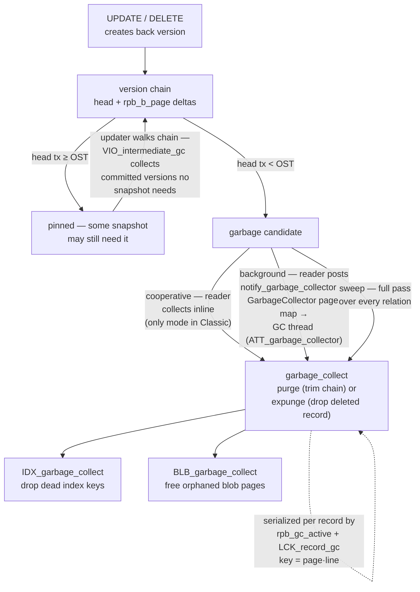
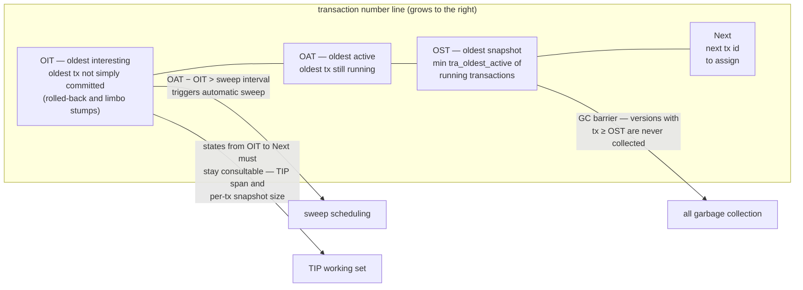

# Garbage Collection, Sweep and the Record-Version Lifecycle

The [transactions document](transactions-and-concurrency.md) explains how Firebird's multi-generational architecture *creates* record versions and decides who sees which; the [on-disk structure document](on-disk-structure.md) shows where the version chains live. This document covers the half of MGA nobody sees in a query: how versions **die**. Firebird has no VACUUM and no undo purge — instead it distributes cleanup across three cooperating mechanisms (cooperative, background and intermediate garbage collection) plus one periodic deep clean (**sweep**), all gated by the four transaction counters on the header page (OIT, OAT, OST, Next). Everything below is grounded in the vendored source (`vio.cpp`, `tra.cpp`, `GarbageCollector.h`) and demonstrated live on a scratch database.

It completes the MGA arc the way the [request-trace document](request-lifecycle-code-trace.md) completed the query arc, and it reuses that document's [lock machinery](request-lifecycle-code-trace.md#stage-8-the-lock-handler-and-the-lock-manager) — GC has its own lock series (`LCK_record_gc`, `LCK_rel_gc`, `LCK_sweep`). The comparison with PostgreSQL's VACUUM, InnoDB's purge and SQLite closes the loop opened in the [architecture comparison](architecture-comparison.md).

**Table of Contents**

* [When is a version garbage? The oldest-snapshot barrier](#when-is-a-version-garbage-the-oldest-snapshot-barrier)
* [Three collectors](#three-collectors)
* [Sweep: the deep clean that advances the OIT](#sweep-the-deep-clean-that-advances-the-oit)
* [The four counters and what each one gates](#the-four-counters-and-what-each-one-gates)
* [GC internals in action (validated)](#gc-internals-in-action-validated)
* [Comparison: PostgreSQL, InnoDB, SQLite](#comparison-postgresql-innodb-sqlite)
* [Discussion](#discussion)
* [Further research](#further-research)

## When is a version garbage? The oldest-snapshot barrier

Every UPDATE or DELETE leaves a **back version** behind the record head — a [delta against the newer version](on-disk-structure.md#inside-a-data-page-records-and-version-deltas), chained by `rpb_b_page`/`rpb_b_line`. A back version must survive as long as *any* snapshot might still need it. The cutoff is one number: the **oldest snapshot** (OST) — the oldest `tra_oldest_active` recorded by any transaction still running. The read path in [`vio.cpp`](https://github.com/FirebirdSQL/firebird/blob/master/src/jrd/vio.cpp) applies it directly: a version chain is left alone when its head transaction `rpb_transaction_nr >= oldest_snapshot`, and becomes a GC candidate the moment it drops below.

Death comes in two flavors, both static functions in `vio.cpp`:

* **`purge`** — the record lives on: rebuild the head, cut the chain of unneeded back versions, release their space.
* **`expunge`** — the head itself is a committed *delete* older than the OST: remove the record entirely, fragments and all.

Either way, `garbage_collect` gathers the *going* versions and hands them to `IDX_garbage_collect` (remove index entries whose keys no longer occur in any staying version — the [B-tree side](indexing-and-full-text-search.md) of version death) and `BLB_garbage_collect` (release orphaned [blob pages](blob-handling.md)). This is the reason Firebird's indexes carry multi-version keys but its tables never bloat unboundedly: index and blob cleanup ride along with record cleanup.

Two attachments must never collect the same record at once. The serialization is record-grained and cheap: the version chain's head is flagged `rpb_gc_active` while being collected, backed by an **`LCK_record_gc`** lock whose key packs the record's address — `(page << 16) | line` (`lockGCActive`/`checkGCActive`/`waitGCActive` in `vio.cpp`). A concurrent reader that trips over a record being collected simply waits on that lock rather than on any table-wide latch.

## Three collectors

Who actually calls `purge`/`expunge`? Three mechanisms, selected by the `GCPolicy` setting in `firebird.conf` and by [server mode](deployment-and-operations.md):

* **Cooperative GC** — *the reader pays.* Any statement whose `VIO_next_record`/`VIO_get` stumbles over a below-OST chain collects it inline before returning the row. This is the only mode for Classic (a non-shared database forces `DBB_gc_cooperative` in `jrd.cpp` regardless of config — separate processes have no shared thread to delegate to).
* **Background GC** — *a dedicated thread pays.* In SuperServer, readers don't collect; they call `notify_garbage_collector`, which posts the page number (plus the current transaction id) into a per-relation `BePlusTree` inside the **`GarbageCollector`** object ([`GarbageCollector.h`](https://github.com/FirebirdSQL/firebird/blob/master/src/jrd/GarbageCollector.h)) and releases `dbb_gc_sem`. The GC thread — a system attachment flagged `ATT_garbage_collector`, started on demand in `VIO_init` — wakes, asks `getPages(oldest_snapshot, …)` for pages whose *posting* transaction has dropped below the current OST, and revisits just those pages. Backup runs opt out: gbak attachments and `isc_dpb_no_garbage_collect` (`gbak -g`) don't notify, so a backup doesn't flood the collector.
* **Intermediate GC** (`VIO_intermediate_gc`, FB5+) — *the writer pays, mid-chain.* When an updater walks a version chain, committed versions that **no active snapshot needs** are collected even though the chain as a whole is still pinned by an older snapshot. This is why long chains no longer form under update-heavy load: the chain keeps only the head plus the specific versions some snapshot can still read (the live demo below shows 12 updates collapsing to 2 surviving versions *while* an old snapshot is open).

`GCPolicy` defaults to **`combined`** (cooperative + background) for SuperServer and **`cooperative`** for everything else (`config.cpp`, keyed on `ServerMode`); `combined` means readers collect what they trip over *and* notify the thread about the rest.



_Figure 1: The record-version lifecycle — versions become garbage when their transaction falls below the oldest snapshot, and one of four mechanisms (cooperative reader, background thread, intermediate GC, sweep) feeds them to `purge`/`expunge` with index and blob cleanup riding along_

## Sweep: the deep clean that advances the OIT

The three collectors are opportunistic — they clean what queries touch. **Sweep** (`TRA_sweep` in [`tra.cpp`](https://github.com/FirebirdSQL/firebird/blob/master/src/jrd/tra.cpp)) is the systematic pass: `VIO_sweep` walks *every* relation, garbage-collecting as it goes. It exists for two reasons the collectors can't cover:

1. **Untouched garbage.** A rarely-read table full of dead versions never triggers cooperative GC.
2. **Rolled-back transactions.** A transaction marked *rolled back* in the [TIP](transactions-and-concurrency.md) pins the **OIT** (oldest interesting transaction): every later transaction must keep checking its state to know its record versions are invalid. Only after a full sweep — which removes every version such a transaction left anywhere — is it safe to mark it *committed* in the TIP and stop caring. That is exactly what sweep does on completion: it rewrites rolled-back states and advances `hdr_oldest_transaction` on the [header page](on-disk-structure.md) to `MIN(oldest limbo/active, OAT − 1)`.

The mechanics mirror the rest of the engine's discipline. Sweep is triggered automatically at transaction start when `OAT − OIT > sweep interval` (default **20 000**, the `SWEEP_INTERVAL` constant in `jrd.cpp`; per-database override via `gfix -housekeeping n`, stored as the `HDR_sweep_interval` clumplet by `PAG_set_sweep_interval`; `0` disables automatic sweep; visible live in `MON$DATABASE.MON$SWEEP_INTERVAL`). `start_sweeper` launches it in its own thread with a dedicated system transaction — read-only, read-committed, `ignore_limbo`, flagged `TDBB_sweeper` — so sweep never blocks writers and sees through record locks. Exactly one sweeper may run per database, enforced across processes by a **`LCK_sweep`** lock plus the `DBB_sweep_starting`/`DBB_sweep_in_progress` flags ([`Database.cpp`](https://github.com/FirebirdSQL/firebird/blob/master/src/jrd/Database.cpp)) — the [same shared-memory lock table](request-lifecycle-code-trace.md#stage-8-the-lock-handler-and-the-lock-manager) that coordinates everything else. `gfix -sweep` runs the identical code path on demand.

## The four counters and what each one gates

Everything above is steered by four monotonic counters on the header page (`gstat -h` prints all four):



_Figure 2: The header-page counters — the OST gates what may be collected, the OIT–OAT gap schedules sweep, and the OIT–Next span is the transaction-state working set every transaction carries_

The practical reading: a **long-running snapshot holds the OST down**, so garbage accumulates (but, since FB5, intermediate GC keeps chains short even then); a **rolled-back stump holds the OIT down**, so the TIP working set grows and eventually the automatic sweep fires to reclaim it. "Stuck OIT" is Firebird's mild analogue of PostgreSQL's wraparound anxiety — except the consequence is a growing TIP and an eventual sweep, not a forced shutdown.

## GC internals in action (validated)

All on a scratch database (`/tmp/fbgc/gc.fdb`, SuperServer, default `GCPolicy = combined`), one table `counters` with one row. Statistics were read through the service manager (`fbsvcmgr action_db_stats … sts_record_versions`) because a direct `gstat -a` attach conflicts with the running SuperServer's exclusive engine instance.

**Intermediate GC keeps chains short under a pinned snapshot.** Connection A opened a SNAPSHOT transaction and read the row (`val = 0`); connection B then ran **12** separate `UPDATE … COMMIT` cycles on that row. With A still open:

```
Average record length: 12.00, total records: 1
Average version length: 9.00, total versions: 2, max versions: 2
```

Twelve updates, but only **two** surviving versions: the head (`val = 12`) and the one version A's snapshot actually needs (`val = 0`) — `VIO_intermediate_gc` collected the ten committed intermediates *while the chain was still pinned*. A re-read in the same snapshot still returned 0.

**Releasing the snapshot lets the rest die.** After A committed, one full-scan `SELECT` (returning `val = 12`) plus a moment for the background thread:

```
Average version length: 0.00, total versions: 0, max versions: 0
```

**A rolled-back stump pins the OIT; sweep advances it.** A transaction started with `isc_tpb_no_auto_undo` (TPB `[2, 20]` — no in-memory undo log, so rollback must mark the TIP) updated the row and rolled back:

```
--- header BEFORE sweep:          --- header AFTER sweep:
Oldest transaction  31            Oldest transaction  32
Oldest active       32            Oldest active       34
Oldest snapshot     32            Oldest snapshot     34
Next transaction    32            Next transaction    34
```

The OIT froze at the rolled-back transaction 31 and `gfix -sweep` moved it past — the live image of sweep's TIP rewrite. `MON$DATABASE.MON$SWEEP_INTERVAL` confirmed the automatic threshold: 20 000.

## Comparison: PostgreSQL, InnoDB, SQLite

Every MVCC engine must dispose of dead versions somewhere; the architectural choice is *where versions live* and *who pays for cleanup*.

| | **Firebird** | **PostgreSQL** | **MySQL / InnoDB** | **SQLite** |
|---|---|---|---|---|
| Old versions live | in table data pages (delta chain off the head) | in the heap (full dead tuples) | in **undo log** segments, off-table | nowhere — no row versioning |
| Cleaned by | cooperative readers + background thread + intermediate GC + sweep | `VACUUM` / autovacuum workers | purge threads (undo truncation) | nothing to clean (journal/WAL discarded on commit/checkpoint) |
| Trigger | continuous (on access / on notify); sweep at OAT−OIT > 20 000 | thresholds: dead-tuple counts, `autovacuum_*` settings, wraparound emergency | continuous; purge lag visible as **history list length** | checkpoint when WAL grows (different resource) |
| Long-transaction failure mode | OST pinned → garbage retained (chains stay short via intermediate GC); OIT pinned → TIP grows, sweep fires | dead tuples retained → **table and index bloat**; vacuum can't truncate; xid horizon held | undo grows → history list explodes, queries slow, disk fills | writers blocked entirely (single-writer lock) |
| Existential hazard | none — counters are 64-bit, sweep is incremental hygiene | **xid wraparound** → anti-wraparound autovacuum, forced shutdown at the limit | undo tablespace exhaustion | none |
| Admin knobs | `GCPolicy`, sweep interval (`gfix -h`), manual `gfix -sweep` | `autovacuum_*` family (a dozen+ settings), `VACUUM (FULL)`, `vacuum_freeze_*` | `innodb_purge_threads`, `innodb_max_purge_lag` | `PRAGMA incremental_vacuum` (free pages only) |

The contrasts worth internalizing:

* **PostgreSQL** leaves whole dead tuples in the heap and delegates *all* cleanup to a batch process. When autovacuum keeps up, it's invisible; when it doesn't (long transactions, aggressive churn, throttled workers), tables and indexes bloat and — uniquely among these systems — the 32-bit xid clock forces freezing on a deadline. An entire operational discipline (and a famous corner of PG war stories) exists around tuning it. HOT-pruning, which cleans dead heap-only tuples opportunistically during page access, is PostgreSQL's small step toward Firebird's cooperative model.
* **InnoDB** moves old versions *out* of the table into undo segments, so tables don't bloat — but now a long-running transaction shows up as an ever-growing history list, and purge is a background race that queries lose as the chain of undo records they must walk gets longer.
* **SQLite** simply doesn't have the problem — and pays for it upstream with the [single-writer model](embedded-architecture-comparison.md): no versions to collect because no reader/writer concurrency to serve.
* **Firebird** spreads the cost thinnest: readers tidy what they touch, a thread handles the rest, FB5's intermediate GC prevents chain buildup even under pinned snapshots, and sweep is periodic hygiene rather than a survival requirement. The price is the mirror image of PostgreSQL's: cleanup work can appear as latency inside an unlucky *read* rather than in a background window an administrator controls.

## Discussion

Garbage collection is where Firebird's no-undo MVCC design completes itself. Because [rollback never restores overwritten data](transactions-and-concurrency.md) — old versions *are* the rollback information, kept in place until nobody needs them — the system's health reduces to keeping two horizons moving: the OST (what snapshots need) and the OIT (what the TIP must remember). Everything in this document is machinery for advancing one or the other: the three collectors advance space reclamation behind the OST; sweep advances the OIT past rolled-back debris.

The design also explains a Firebird operational habit: **commit or roll back promptly, and let sweep run**. Nothing catastrophic happens if you don't — chains stay short since FB5, counters are 64-bit, sweep fires itself — but the OST/OIT gap is the single best health indicator a Firebird DBA has (`gstat -h`, one glance), which is precisely why the [monitoring document](monitoring-and-tuning.md) and every Firebird ops checklist start there.

## Hands-on: samples, tests and debugging

### C++ sample — [`samples/cpp/gc_sweep.cpp`](samples/cpp/gc_sweep.cpp)

The whole record-version lifecycle, observed from client code through `MON$RECORD_STATS` — whose database-level counters are literally this document's `vio.cpp` events: `MON$RECORD_IMGC` counts [`VIO_intermediate_gc`](#three-collectors) collections, `MON$RECORD_PURGES`/`MON$RECORD_EXPUNGES` count `purge()`/`expunge()`, and `MON$BACKVERSION_READS` counts the chain walks readers had to do. The sample pins a SNAPSHOT, commits twelve updates under it, releases the snapshot, scans, then deletes — and finally rolls back a `no_auto_undo` transaction to freeze the OIT (watched via `MON$DATABASE`'s four header counters).

```sh
cmake -B build samples && cmake --build build
./build/gc_sweep        # default: inet://localhost//tmp/fbhandson/gc_sweep.fdb
```

Verified output:

```text
pinned SNAPSHOT reads val = 0
before updates:                    upd=47   imgc=0   purges=0   expunges=0   backreads=0
after 12 updates (snapshot open):  upd=59   imgc=10  purges=0   expunges=0   backreads=32
pinned SNAPSHOT still reads val = 0
snapshot released; new reader sees val = 12
after release + scan + 1.5s:       upd=59   imgc=10  purges=1   expunges=0   backreads=35
after DELETE + scan + 1.5s:        upd=59   imgc=10  purges=1   expunges=1   backreads=37
header counters before rollback:   OIT=27 OAT=28 OST=28 Next=28 (sweep interval 20000)
after no_auto_undo rollback:       OIT=28 OAT=30 OST=30 Next=30 (sweep interval 20000)
run 'gfix -sweep' (or wait for OAT-OIT > interval) to move the OIT past the stump.
```

Every number is a claim from the sections above made live: `imgc=10` after twelve updates under a pinned snapshot is intermediate GC collecting exactly the ten committed intermediates (head + the snapshot's version survive — the same 12→2 collapse as the [validated experiment](#gc-internals-in-action-validated)); the post-release scan yields one `purge` (chain trimmed, record lives); the committed delete yields one `expunge` (record removed); and the rollback pins the OIT while OAT/OST/Next move on. (The `upd=47` baseline is DDL — MON$ database-level counters aggregate everything, including system-table updates.)

### JavaScript sample — [`samples/nodejs/gc_sweep.js`](samples/nodejs/gc_sweep.js)

The same experiment through node-firebird (`cd samples/nodejs && node gc_sweep.js`). Two instructive deltas in a real run made *after* the C++ one: the database-level counters are cumulative for the life of the loaded database, so the previous run's rolled-back stump is still visible — `OIT=28` stays pinned while `Next` has advanced to 59 — and the post-release cleanup was booked as `imgc=10→11` rather than a `purge`, showing that *which* collector disposes of a chain depends on which code path trips over it first, not on the garbage itself.

### Things to try

- Set the updates loop to 100: `imgc` grows to ~98 but `max versions` stays 2 (check with `fbsvcmgr localhost:service_mgr -user SYSDBA -password masterkey action_db_stats dbname /tmp/fbhandson/gc_sweep.fdb sts_record_versions`).
- Run `/opt/firebird/bin/gfix -sweep -user SYSDBA -password masterkey inet://localhost//tmp/fbhandson/gc_sweep.fdb` after the sample and re-query `MON$DATABASE`: the OIT jumps past the stump — sweep's TIP rewrite, live.
- Replace the pinned transaction's TPB with `isc_tpb_read_committed, isc_tpb_rec_version` and watch `imgc` stay near zero: a READ COMMITTED reader pins no snapshot, so the chain is simply collected below the OST instead.
- Attach with `isc_dpb_no_garbage_collect` (gbak's `-g` flag) and confirm the scanning attachment stops feeding the collectors.

### Debugging this in C++ (gdb)

With a [debug build of the engine](debugging-firebird.md), the three collectors and sweep are all breakpoints in one file:

```gdb
break vio.cpp:5583       # garbage_collect — every version disposal funnels through here
break vio.cpp:6977       # purge   — chain trim, record survives
break vio.cpp:5499       # expunge — committed delete removed entirely
break VIO_intermediate_gc        # vio.cpp:2595 — FB5 mid-chain collection by an updater
break notify_garbage_collector   # vio.cpp:6484 — reader posting a page to the GC thread
break TRA_sweep                  # tra.cpp:1802 — the deep clean
```

Run the C++ sample against the embedded engine and the first four fire in *your* thread (cooperative/intermediate GC — the reader/writer pays); to catch the background half instead, `break Database::garbage_collector` (`vio.cpp:5699`) and watch the dedicated thread wake on `dbb_gc_sem`, pull pages from the `GarbageCollector` map, and call the same `garbage_collect`. At any of these stops, `rpb->rpb_transaction_nr` versus `transaction->tra_oldest_active` in the backtrace is the [oldest-snapshot barrier](#when-is-a-version-garbage-the-oldest-snapshot-barrier) being evaluated, and the `staying` stack in `garbage_collect` holds precisely the versions some snapshot still needs.

## Further research

* [`src/jrd/vio.cpp`](https://github.com/FirebirdSQL/firebird/blob/master/src/jrd/vio.cpp) — the whole lifecycle in one file: `garbage_collect`, `purge`, `expunge`, `VIO_intermediate_gc`, `notify_garbage_collector`, the `garbage_collector` thread, and the `LCK_record_gc` helpers.
* [`src/jrd/GarbageCollector.h`](https://github.com/FirebirdSQL/firebird/blob/master/src/jrd/GarbageCollector.h) — the per-relation page map between readers and the GC thread.
* [`src/jrd/tra.cpp`](https://github.com/FirebirdSQL/firebird/blob/master/src/jrd/tra.cpp) — `TRA_sweep`, `start_sweeper`, and the sweep-trigger check at transaction start.
* Firebird documentation: [the gfix utility manual](https://www.firebirdsql.org/file/documentation/html/en/firebirddocs/gfix/firebird-gfix.html) — sweep and interval administration.
* PostgreSQL docs: [Routine Vacuuming](https://www.postgresql.org/docs/current/routine-vacuuming.html) — the full autovacuum/wraparound story, best read side-by-side with this document.
* MySQL docs: [InnoDB Purge Configuration](https://dev.mysql.com/doc/refman/8.4/en/innodb-purge-configuration.html) — purge threads and history-list lag.
* Companion docs: [transactions and concurrency](transactions-and-concurrency.md) (version creation and visibility) · [on-disk structure](on-disk-structure.md) (delta chains on the page) · [monitoring and tuning](monitoring-and-tuning.md) (watching the counters) · [backup and recovery](backup-and-recovery.md) (gbak's GC interactions).
