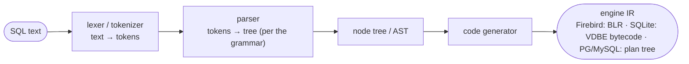

# SQL Grammar and Parser Architecture

Before a database can run a query it must **parse** it — turn SQL text into a tree the engine can execute. This document looks at Firebird's SQL grammar and the parser built from it, provides a **full, regenerable Mermaid diagram of the grammar's rule graph** (with the generator script and a how-to), and compares Firebird's parser architecture with PostgreSQL, MySQL and SQLite.

It is a companion to the [main paper](README.md), whose [SQL translator (DSQL) section](README.md#sql-translator) describes the lexer → parser → code-generator pipeline this document zooms into, and to the [SQL dialect and data types document](sql-dialect-and-types.md), which covers *what* the grammar accepts rather than *how* it is structured.

**Table of Contents**

* [From SQL text to an execution tree](#from-sql-text-to-an-execution-tree)
* [Firebird's grammar: BtYacc, not plain Yacc](#firebirds-grammar-btyacc-not-plain-yacc)
* [The grammar at the top level](#the-grammar-at-the-top-level)
* [The full grammar diagram](#the-full-grammar-diagram)
* [How to generate the diagram in Mermaid](#how-to-generate-the-diagram-in-mermaid)
* [Comparison: PostgreSQL, MySQL, SQLite](#comparison-postgresql-mysql-sqlite)
* [Discussion](#discussion)
* [Further research](#further-research)

## From SQL text to an execution tree

Every one of these databases runs the same conceptual pipeline — the one the [main paper](README.md#sql-translator) draws for Firebird:



_Figure 1: The universal parse pipeline — a lexer feeds a grammar-driven parser, whose tree a code generator lowers to the engine's internal representation_

The **grammar** is the formal specification the parser is built from: a set of production rules saying, for example, that a `statement` is a `dml_statement` or a `ddl_statement`, that a `select` is a `select_expr` with optional clauses, and so on. All four databases write their grammar in a **parser-generator** input file and compile it to C; the interesting differences are *which generator* and *what the parser emits*.

## Firebird's grammar: BtYacc, not plain Yacc

Firebird's entire SQL grammar is a single Bison/Yacc-style file, [`src/dsql/parse.y`](https://github.com/FirebirdSQL/firebird/blob/master/src/dsql/parse.y) — **10,576 lines**, and (per the generator below) **608 nonterminal rules** and **542 terminal tokens**. But it is not compiled with GNU Bison; Firebird ships and uses **[BtYacc](https://github.com/FirebirdSQL/firebird/tree/master/extern/btyacc)** (*backtracking Yacc*), a Berkeley-Yacc derivative that adds **backtracking** to the usual LALR(1) parsing.

Why this matters: a plain LALR(1) parser must decide each reduction with only one token of lookahead, and SQL has constructs that genuinely need more context to disambiguate. `parse.y` carries **153 shift/reduce and 7 reduce/reduce conflicts** (recorded in the in-tree `parse-conflicts.txt`); backtracking lets the parser *try* an interpretation and unwind if it hits a dead end, so the grammar can express those constructs directly instead of being contorted to fit LALR(1). It is a pragmatic middle ground between a strict LALR(1) grammar (PostgreSQL, MySQL) and a hand-written recursive-descent parser (which some databases use for exactly this flexibility).

The parser's actions build a tree of **DSQL node objects** (`src/dsql/`), which the code generator then lowers to **BLR** — Firebird's stable, stored intermediate language (see the [wire-protocol](firebird-wire-protocol.md) and [architecture comparison](architecture-comparison.md#firebird-recap) for BLR's role).

## The grammar at the top level

The rule graph rooted at `statement`, expanded two levels (generated by the script below — this is real output, not hand-drawn):

```mermaid
%% Firebird SQL grammar — 'statement' to depth 2
%% generated by tools/grammar_to_mermaid.py from Firebird's src/dsql/parse.y
flowchart LR
    r_statement["statement"]
    r_dml_statement["dml_statement"]
    r_ddl_statement["ddl_statement"]
    r_tra_statement["tra_statement"]
    r_mng_statement["mng_statement"]
    r_statement --> r_dml_statement
    r_statement --> r_ddl_statement
    r_statement --> r_tra_statement
    r_statement --> r_mng_statement
    r_dml_statement --> r_delete["delete"]
    r_dml_statement --> r_insert["insert"]
    r_dml_statement --> r_merge["merge"]
    r_dml_statement --> r_exec_procedure["exec_procedure"]
    r_dml_statement --> r_call["call"]
    r_dml_statement --> r_exec_block["exec_block"]
    r_dml_statement --> r_select["select"]
    r_dml_statement --> r_update["update"]
    r_dml_statement --> r_update_or_insert["update_or_insert"]
    r_dml_statement --> r_using["using"]
    r_ddl_statement --> r_alter["alter"]
    r_ddl_statement --> r_comment["comment"]
    r_ddl_statement --> r_create["create"]
    r_ddl_statement --> r_create_or_alter["create_or_alter"]
    r_ddl_statement --> r_declare["declare"]
    r_ddl_statement --> r_drop["drop"]
    r_ddl_statement --> r_grant["grant"]
    r_ddl_statement --> r_recreate["recreate"]
    r_ddl_statement --> r_revoke["revoke"]
    r_ddl_statement --> r_set_statistics["set_statistics"]
    r_tra_statement --> r_set_transaction["set_transaction"]
    r_tra_statement --> r_savepoint["savepoint"]
    r_tra_statement --> r_commit["commit"]
    r_tra_statement --> r_rollback["rollback"]
    r_mng_statement --> r_set_debug_option["set_debug_option"]
    r_mng_statement --> r_set_decfloat_round["set_decfloat_round"]
    r_mng_statement --> r_set_decfloat_traps["set_decfloat_traps"]
    r_mng_statement --> r_session_statement["session_statement"]
    r_mng_statement --> r_set_role["set_role"]
    r_mng_statement --> r_session_reset["session_reset"]
    r_mng_statement --> r_set_time_zone["set_time_zone"]
    r_mng_statement --> r_set_bind["set_bind"]
    r_mng_statement --> r_set_optimize["set_optimize"]
    r_mng_statement --> r_set_search_path["set_search_path"]
```



_Figure 2: The top of the Firebird grammar — `statement` branches into DML, DDL, transaction and session-management statements (auto-generated, depth 2)_

The four branches map exactly to the code in `parse.y` (`statement : dml_statement | ddl_statement | tra_statement | mng_statement`), and each expands further: `dml_statement` into the ten DML forms, `ddl_statement` into the DDL verbs, and so on. Node ids are prefixed `r_` so rule names that clash with Mermaid keywords (`call`, `end`, `class`, …) render safely.

## The full grammar diagram

The complete rule graph — all **608 rules and 1,083 edges** — is generated to a Mermaid file and committed here:

- **[`diagrams/firebird-grammar-full.mmd`](diagrams/firebird-grammar-full.mmd)** — the entire Firebird SQL grammar as one Mermaid `flowchart`.

A word of honesty about scale: at 1,083 edges this diagram is **too dense for GitHub's inline Mermaid renderer** (which caps diagram complexity), so it will not draw in the browser preview. It is meant to be rendered locally — with [`@mermaid-js/mermaid-cli`](https://github.com/mermaid-js/mermaid-cli) to SVG/PNG, or converted to Graphviz — where it becomes a navigable map of the whole grammar. For reading in the browser, generate a focused sub-graph rooted at whatever rule you care about (next section). A smaller, always-renderable top-level file is also committed: [`diagrams/firebird-grammar-top.mmd`](diagrams/firebird-grammar-top.mmd) (the source of Figure 2).

## How to generate the diagram in Mermaid

The diagrams above are produced by a small, dependency-free Python script committed in this repo, [`tools/grammar_to_mermaid.py`](tools/grammar_to_mermaid.py). It reads `parse.y` from the `extern/firebird` submodule, extracts the nonterminal rule graph (stripping C action blocks, comments and character literals so `;` correctly terminates each rule), and emits a Mermaid `flowchart`. It is fully reproducible — re-run it after any grammar change and the diagram updates.

**Prerequisites:** Python 3 and the Firebird submodule checked out:

```sh
git submodule update --init extern/firebird
```

**Generate the diagrams:**

```sh
# grammar size (rules, tokens, edges, most-connected rules)
python3 tools/grammar_to_mermaid.py --stats

# readable top-level view (Figure 2): the `statement` rule, depth 2
python3 tools/grammar_to_mermaid.py --root statement --depth 2 > diagrams/firebird-grammar-top.mmd

# a focused sub-graph rooted anywhere — e.g. the SELECT sublanguage
python3 tools/grammar_to_mermaid.py --root select_expr --depth 3 > diagrams/select.mmd

# the entire grammar (huge; render locally, not on GitHub)
python3 tools/grammar_to_mermaid.py --full > diagrams/firebird-grammar-full.mmd
```

**Render a `.mmd` file to an image** (for the full graph, which the browser won't draw):

```sh
npx @mermaid-js/mermaid-cli -i diagrams/firebird-grammar-full.mmd -o grammar.svg
```

To embed a generated sub-graph in Markdown, paste the file's contents inside a ` ```mermaid ` fence (as Figure 2 does). The script's `--root`/`--depth`/`--direction`/`--full` options are documented in its `--help`.

## Comparison: PostgreSQL, MySQL, SQLite

All four separate a lexer from a grammar-driven parser, but they differ in the generator they use and in what the parser produces.

| Aspect | **Firebird** | **PostgreSQL** | **MySQL** | **SQLite** |
|---|---|---|---|---|
| Grammar file | [`src/dsql/parse.y`](https://github.com/FirebirdSQL/firebird/blob/master/src/dsql/parse.y) | [`src/backend/parser/gram.y`](https://github.com/postgres/postgres/blob/master/src/backend/parser/gram.y) | [`sql/sql_yacc.yy`](https://github.com/mysql/mysql-server/blob/trunk/sql/sql_yacc.yy) | [`src/parse.y`](https://github.com/sqlite/sqlite/blob/master/src/parse.y) |
| Parser generator | **BtYacc** (backtracking Yacc) | **GNU Bison** (LALR) | **GNU Bison** (LALR) | **[Lemon](https://sqlite.org/lemon.html)** (SQLite's own) |
| Parsing algorithm | LALR(1) **+ backtracking** | LALR(1) | LALR(1) | LALR(1) |
| Lexer / tokenizer | Hand-written | flex (`scan.l`) | Hand-written (`sql_lex.cc`) | Hand-written |
| Parser output | DSQL node tree → **BLR** | Raw parse tree → analyzed tree | Parse tree (`Parse_tree_root`) | **VDBE bytecode** (via actions) |
| Reentrant / thread-safe | Yes | Yes (`%pure-parser`) | Yes | **Yes** (Lemon is by design) |
| Grammar size (rules) | ~608 nonterminals | ~1,000+ | ~1,600+ | ~350 |
| Notable trait | Backtracking resolves ambiguity | Large, standard-tracking | Very large, many extensions | Tiny, generated by a bespoke tool |

## Discussion

**Three of the four use a Yacc-family generator; SQLite rolled its own.** Firebird (BtYacc), PostgreSQL and MySQL (both Bison) all descend from the same Yacc lineage and write recognisably similar `.y` grammars. SQLite is the outlier: D. Richard Hipp wrote **[Lemon](https://sqlite.org/lemon.html)** specifically for SQLite — it is reentrant by construction, avoids Yacc's global state, produces a smaller and faster parser, and (fittingly for SQLite) has no external build dependency. This mirrors SQLite's whole philosophy of owning a small, self-contained toolchain rather than depending on the ecosystem (see the [embedded comparison](embedded-architecture-comparison.md)).

**Firebird's backtracking is the distinctive middle path.** Plain LALR(1) grammars (PostgreSQL, MySQL) must be carefully massaged to remove ambiguity, sometimes splitting rules or deferring decisions to semantic analysis; a hand-written recursive-descent parser can look arbitrarily far ahead but must be maintained by hand. Firebird's BtYacc keeps a declarative Yacc grammar *and* gets multi-token disambiguation via backtracking — the 153 shift/reduce conflicts it tolerates would be a problem in a strict LALR(1) build but are handled by trying and unwinding. It is a lesser-known but elegant answer to SQL's inherent grammar ambiguities.

**What the parser emits reveals the engine.** Firebird lowers to **BLR**, a *stored, stable* intermediate language (procedures are kept as BLR), and SQLite lowers straight to **VDBE bytecode** — both are true compiler back-ends producing a durable IR, which is why both have such compiler-like pipelines (a point the [architecture comparison](architecture-comparison.md#sqlite) also makes). PostgreSQL and MySQL instead build in-memory parse trees that are analyzed, rewritten and planned but never serialized to an external language. The grammar is the front door; what comes out of it is the clearest signal of how each engine is built.

## Hands-on: samples, tests and debugging

### C++ sample — [`samples/cpp/parser_errors.cpp`](samples/cpp/parser_errors.cpp)

The sample drives the parser this document describes from the client side, through `IAttachment::prepare` — every string it sends lands in `Parser::parse()` over the BtYacc-generated tables from `parse.y`. It shows four things: a **dynamic-SQL placeholder** (`?`) coming back as a typed input parameter (the parser builds the parameter node, the semantic pass resolves its type from the column — `sqltype=500` is `SQL_SHORT`, matching `EMP_NO`); the token `FIRST` accepted in **two grammatical roles** — the row-limit clause `SELECT FIRST 1 ...` and a plain column name — the kind of keyword/identifier ambiguity the [backtracking grammar](#firebirds-grammar-btyacc-not-plain-yacc) absorbs instead of reserving the word; two **syntax errors** whose status vectors carry the offending token with its exact line and column; and a **semantic error** (unknown column) proving position tracking survives past the parse into the DSQL pass. Everything runs read-only against the stock `employee` database.

```sh
cmake -B build samples && cmake --build build
./build/parser_errors            # default: inet://localhost/employee
```

Verified output:

```text
---- SELECT first_name FROM employee WHERE emp_no = ?
  parsed OK: type=SELECT, input params=1, output columns=1
    param 0: sqltype=500, length=2
---- SELECT FIRST 1 emp_no FROM employee
  parsed OK: type=SELECT, input params=0, output columns=1
---- SELECT first FROM (SELECT 1 AS first FROM rdb$database)
  parsed OK: type=SELECT, input params=0, output columns=1
---- SELEC 1 FROM rdb$database
  prepare failed:
Dynamic SQL Error
-SQL error code = -104
-Token unknown - line 1, column 1
-SELEC
---- SELECT emp_no
FROM employee
WHERE ORDER BY 1
  prepare failed:
Dynamic SQL Error
-SQL error code = -104
-Token unknown - line 3, column 7
-ORDER
---- SELECT frst_name
FROM employee
  prepare failed:
Dynamic SQL Error
-SQL error code = -206
-Column unknown
-"FRST_NAME"
-At line 1, column 8
```

### JavaScript sample — [`samples/nodejs/parser_errors.js`](samples/nodejs/parser_errors.js)

The same six statements through node-firebird (`cd samples/nodejs && node parser_errors.js`). The driver has no separate prepare step — each `query()` allocates, prepares and executes in one round trip — but the parser's status vector travels back over the [wire protocol](firebird-wire-protocol.md) unchanged, so the identical `Token unknown - line 3, column 7 / ORDER` report surfaces as the JavaScript error message. Successful parses are shown by the rows they return (`SELECT FIRST 1 emp_no` → `EMP_NO=2`), including the parameterised query executed with `[2]` bound to the `?`.

To *see* the grammar the parser is running, the repo's [`tools/grammar_to_mermaid.py`](tools/grammar_to_mermaid.py) (the [generator section](#how-to-generate-the-diagram-in-mermaid) above) renders any rule's neighbourhood — `--root select_expr --depth 3` maps exactly the sublanguage these statements exercise.

### Things to try

- Feed the C++ sample a statement using a *reserved* word as an identifier (`SELECT order FROM rdb$database`) and compare with the non-reserved `FIRST` case; the token lists at the top of [`parse.y`](https://github.com/FirebirdSQL/firebird/blob/master/src/dsql/parse.y) explain the difference.
- Add a statement with an unclosed quoted string or `/* comment` — lexer errors report positions too, but different ones (`Unexpected end of command`).
- Move the syntax error deeper into a long statement and watch the column number track it; then put two errors in one statement and confirm only the first is reported — the parse aborts at the first dead end even a backtracking parser cannot recover from.
- Run `python3 tools/grammar_to_mermaid.py --root delete --depth 2` and follow the diagram while stepping the equivalent SQL through the debugger below.

### Debugging this in C++ (gdb)

With a [debug build of the engine](debugging-firebird.md), the whole pipeline of this document is a handful of breakpoints:

```gdb
break Jrd::prepareStatement       # src/dsql/dsql.cpp:519 — DSQL entry: text + dialect in hand
break Jrd::Parser::parse          # src/dsql/Parser.cpp:121 — wraps the BtYacc-generated dsql_yyparse
break Jrd::Parser::yylexAux       # src/dsql/Parser.cpp:395 — the hand-written lexer, one token per call
break Jrd::Parser::yyerror_detailed  # src/dsql/Parser.cpp:1260 — builds "Token unknown - line N, column M"
```

`yylexAux` fires once per token — stepping through it on `SELEC 1 ...` shows the lexer happily returning `SELEC` as a plain identifier token; it is the *parser* that rejects it, landing in `yyerror_detailed` where `posn`'s first line/column pair becomes the numbers in the sample's output. On the `FIRST`-as-column statement, watch `parse()` return successfully despite the grammar conflicts: the backtracking machinery has tried and unwound the FIRST-clause interpretation. A breakpoint on `Jrd::PAR_error` (`src/jrd/par.cpp:854`) marks the *other* parser — the BLR parser of [blr-intermediate-language.md](blr-intermediate-language.md) — and never fires for these pure syntax errors, a clean demonstration that DSQL and JRD are separate layers. The [debugging guide](debugging-firebird.md) shows how to attach so these engine-side breakpoints land in the same process as the sample (embedded) or in the server.

## Further research

**Firebird**

- [`src/dsql/parse.y`](https://github.com/FirebirdSQL/firebird/blob/master/src/dsql/parse.y) — the complete SQL grammar; [`extern/btyacc/`](https://github.com/FirebirdSQL/firebird/tree/master/extern/btyacc) — the backtracking Yacc it is built with; [`src/dsql/`](https://github.com/FirebirdSQL/firebird/tree/master/src/dsql) — the DSQL node classes and the BLR code generator.
- [`tools/grammar_to_mermaid.py`](tools/grammar_to_mermaid.py) — the diagram generator; [`diagrams/`](diagrams/) — the generated `.mmd` files.
- The [main paper's SQL translator section](README.md#sql-translator) for the lexer/parser/code-generator pipeline in context.

**PostgreSQL, MySQL, SQLite**

- PostgreSQL: [`gram.y`](https://github.com/postgres/postgres/blob/master/src/backend/parser/gram.y) (Bison) and `scan.l` (flex).
- MySQL: [`sql_yacc.yy`](https://github.com/mysql/mysql-server/blob/trunk/sql/sql_yacc.yy) (Bison).
- SQLite: [`parse.y`](https://github.com/sqlite/sqlite/blob/master/src/parse.y) and [The Lemon Parser Generator](https://sqlite.org/lemon.html).

**Tools**

- [GNU Bison](https://www.gnu.org/software/bison/), [flex](https://westes.github.io/flex/manual/), [Lemon](https://sqlite.org/lemon.html), [`@mermaid-js/mermaid-cli`](https://github.com/mermaid-js/mermaid-cli) for rendering the full graph.
