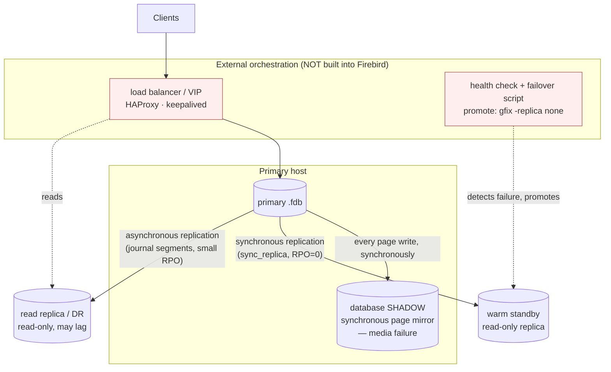
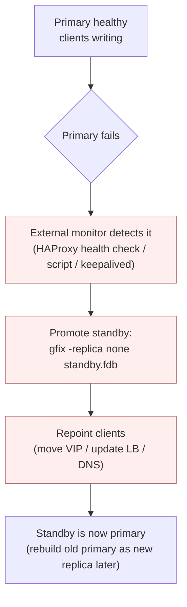
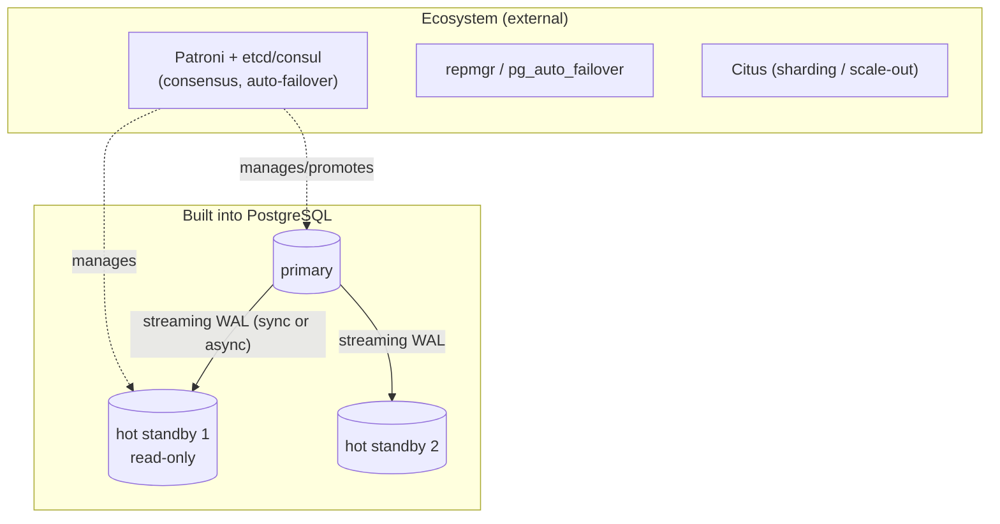
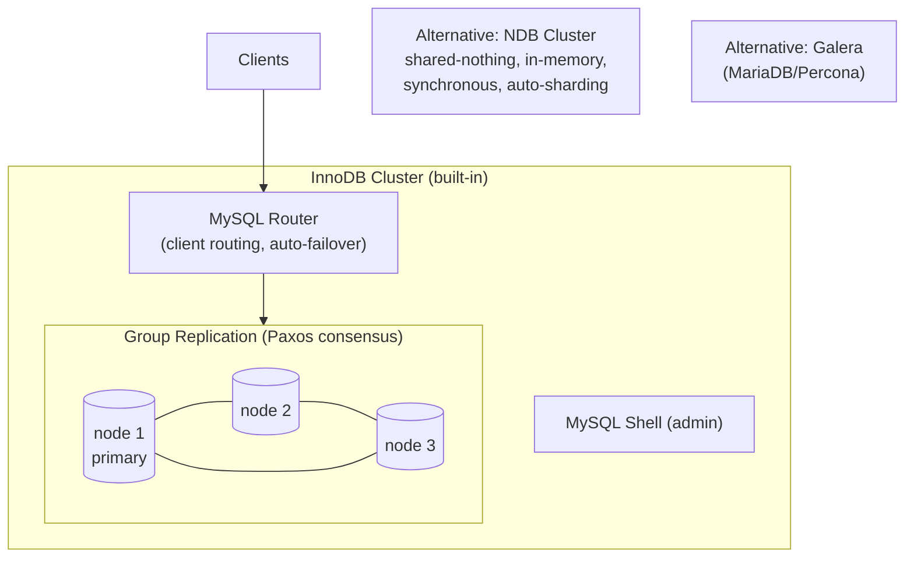

# High Availability and Clustering Architecture

High availability (HA) is about surviving failure: when a server, disk, or data centre dies, how quickly does the database come back, and how much committed data is lost? Two numbers frame every design — **RPO** (recovery point objective, how much data you can lose) and **RTO** (recovery time objective, how long you can be down). This document describes Firebird 6's HA building blocks — grounded in the vendored source and verified with a live server — and compares them with PostgreSQL, MySQL and SQLite, whose clustering stories differ far more than their single-node architectures do.

A distinction runs through the whole document: Firebird provides HA **primitives** (a synchronous mirror, synchronous/asynchronous replication) but deliberately leaves **clustering and automatic failover to external orchestration**, whereas MySQL ships a complete built-in cluster (Group Replication / InnoDB Cluster) and PostgreSQL sits in between (strong replication, failover via ecosystem tools). This is a genuine architectural choice, not a gap to apologise for — but it must be stated plainly.

It is a companion to the [main paper](README.md) and builds directly on the [replication document](replication-architecture.md) (the mechanism behind warm standbys), the [backup-and-recovery document](backup-and-recovery.md) (shadows, promotion) and the [architecture comparison](architecture-comparison.md).

**Table of Contents**

* [The vocabulary of HA](#the-vocabulary-of-ha)
* [Firebird HA building blocks](#firebird-ha-building-blocks)
* [Firebird failover: what is manual, what is external](#firebird-failover-what-is-manual-what-is-external)
* [Setup (validated walk-through)](#setup-validated-walk-through)
* [PostgreSQL HA and clustering](#postgresql-ha-and-clustering)
* [MySQL HA and clustering](#mysql-ha-and-clustering)
* [SQLite HA and clustering](#sqlite-ha-and-clustering)
* [Side-by-side comparison](#side-by-side-comparison)
* [Discussion](#discussion)
* [Further research](#further-research)

## The vocabulary of HA

- **Cold / warm / hot standby** — a standby that must be started from a backup (cold), one that is running and continuously receiving changes but not serving queries (warm), or one that receives changes *and* serves read queries (hot).
- **Synchronous vs asynchronous** — sync replication acknowledges a commit only after a replica has it (RPO = 0, no data loss, but commit latency); async acknowledges immediately and ships changes after (low latency, but a small data-loss window on failure).
- **Automatic vs manual failover** — does something detect the primary's death and promote a standby on its own (needs a failure detector and, to avoid **split-brain**, usually a **quorum/consensus** of an odd number of voters), or does an operator do it?
- **Read scaling vs HA** — replicas can also offload read traffic; that is a performance benefit that often rides on the same replication used for HA.
- **Sharding** — splitting one logical database across nodes for horizontal write scale; distinct from HA, though clustered systems often combine them.

## Firebird HA building blocks

Firebird gives you three engine-level primitives; higher-level HA is assembled from them plus external tooling.



_Figure 1: Firebird HA is assembled from engine primitives (shadow, sync/async replication) plus external orchestration for detection and failover_

- **Database shadows** (`CREATE SHADOW`) — a synchronous, page-level mirror the engine maintains automatically on another disk/volume. Every page write goes to the shadow too, so a **media failure** of the main file is survived instantly by activating the shadow. It protects against disk loss, *not* against logical error or host loss (a bad `DELETE` is mirrored faithfully, and a shadow on the same host dies with it). Verified live: `CREATE SHADOW 1 'main.shd'` produced a 2.4 MB synchronous mirror alongside a 2.4 MB database.
- **Synchronous replication** (`sync_replica`, Firebird 4+) — the primary holds a live connection to each replica and ships changes at commit time, so a **warm standby** is in lock-step (RPO = 0). This is the HA-focused mode.
- **Asynchronous replication** (journal segments, Firebird 4+) — changes are journalled and shipped with a small lag, giving a **read replica** or an off-site **DR** copy with a bounded data-loss window. Both modes and their setup are detailed in the [replication document](replication-architecture.md).

What Firebird does **not** ship: a built-in cluster manager, automatic failure detection, quorum/consensus, a shared-disk cluster, or multi-master. Those are provided — when needed — by external orchestration.

## Firebird failover: what is manual, what is external



_Figure 2: A Firebird failover — the promotion step is a single command, but detection and client redirection are the operator's (or an external tool's) job_

The promotion itself is trivial and was verified live: a `read_only replica` database (`gstat -h` shows `Attributes: force write, read-only replica`) becomes a normal read-write database with **`gfix -replica none`** (`gstat -h` then shows just `force write`). What Firebird leaves to you is everything *around* that command: noticing the primary died, deciding it really died (not a network blip — the split-brain risk), running the promotion, and redirecting clients. In practice this is wired up with a TCP/health-check load balancer (HAProxy), a floating virtual IP (keepalived), or a custom controller. There is no native "connect to host A, fall back to host B" in the connection string, so client redirection is an infrastructure concern.

## Setup (validated walk-through)

Assembling a warm-standby HA pair, using pieces verified here and in the [replication walk-through](replication-architecture.md#setting-up-firebird-replication-validated-walk-through):

1. **Seed the standby** from the primary: `nbackup -b 0` + copy + `nbackup -f` (see [backup and recovery](backup-and-recovery.md#nbackup-physical-incremental-backup)).
2. **Enable replication** on the primary (`ALTER DATABASE ENABLE PUBLICATION; ... INCLUDE ALL TO PUBLICATION`) and choose the mode in `replication.conf`:
   - Warm standby, no data loss: `sync_replica = SYSDBA:pw@standby-host:/data/standby.fdb` (synchronous).
   - Read replica / DR: `journal_directory` + `journal_archive_directory` + transport (asynchronous).
3. **Mark the standby read-only**: `gfix -replica read_only standby.fdb` — it now accepts only the replicator's writes and read-only user queries (offloading reads).
4. **Add a shadow** on the primary for media resilience: `CREATE SHADOW 1 '/other-disk/main.shd';`.
5. **Put a load balancer / VIP in front** for client redirection, with a health check against port 3050.
6. **On primary failure**: promote with `gfix -replica none standby.fdb`, move the VIP, and later rebuild the old primary as the new replica.

RPO/RTO for this design: with synchronous replication RPO = 0; RTO is however long detection + promotion + redirection take (seconds to minutes, depending on how automated steps 6 is).

## PostgreSQL HA and clustering

PostgreSQL has strong built-in **replication** but, like Firebird, leaves **automatic failover to ecosystem tools** — a middle position.



_Figure 3: PostgreSQL — built-in streaming replication and hot standbys; automatic failover and sharding via the ecosystem_

- **Streaming replication** (physical, WAL-based) with **hot standbys** that serve reads; synchronous commit is configurable (including quorum: "wait for any N of these standbys"). See the [replication document](replication-architecture.md#postgresql-replication).
- **Automatic failover** is not in core: [Patroni](https://patroni.readthedocs.io/en/latest/) (with etcd/Consul/ZooKeeper for consensus) is the de-facto standard, with [repmgr](https://repmgr.org/) and pg_auto_failover as alternatives.
- **Sharding / scale-out** via [Citus](https://github.com/citusdata/citus) (an extension) distributes tables across nodes.

## MySQL HA and clustering

MySQL is the outlier: it ships a **complete, built-in HA cluster** with automatic failover.



_Figure 4: MySQL — Group Replication (Paxos) + MySQL Router + Shell form InnoDB Cluster, a built-in auto-failover cluster; NDB Cluster and Galera are alternatives_

- **[Group Replication](https://dev.mysql.com/doc/refman/8.4/en/group-replication.html)** — a Paxos-based, fault-tolerant replication layer (single- or multi-primary) with quorum and automatic membership changes.
- **[InnoDB Cluster](https://dev.mysql.com/doc/refman/8.4/en/mysql-innodb-cluster-introduction.html)** = Group Replication + **[MySQL Router](https://dev.mysql.com/doc/refman/8.4/en/mysql-router.html)** (transparent client routing and failover) + MySQL Shell (orchestration) — the batteries-included answer.
- **[NDB Cluster](https://dev.mysql.com/doc/refman/8.4/en/mysql-cluster.html)** — a separate shared-nothing, in-memory, synchronous, auto-sharding engine for extreme availability.
- **[Galera](https://galeracluster.com/)** (MariaDB/Percona) — a popular synchronous multi-master alternative.

## SQLite HA and clustering

SQLite, an in-process library, has **no native HA** — HA means wrapping it in an external distributed layer (see the [replication document](replication-architecture.md#sqlite-replication-as-a-bolt-on) and [embedded comparison](embedded-architecture-comparison.md)):

- **[rqlite](https://rqlite.io/)** / **[dqlite](https://dqlite.io/)** — **Raft consensus** over SQLite: a cluster of nodes with automatic leader election and failover, turning SQLite into a small fault-tolerant distributed store.
- **[LiteFS](https://fly.io/docs/litefs/)** — FUSE-based leader/follower replication.
- **Litestream** — continuous streaming to object storage for DR (not HA — it is a backup/restore path).

## Side-by-side comparison

| Aspect | **Firebird** | **PostgreSQL** | **MySQL** | **SQLite** |
|---|---|---|---|---|
| Built-in replication | Yes (sync + async, FB4+) | Yes (streaming + logical) | Yes (async, semi-sync, group) | No (external) |
| Warm/hot standby | Read-only replica (hot for reads) | Hot standby (reads) | Replica / group member | Follower (LiteFS) |
| Synchronous (RPO=0) | Yes (`sync_replica`) | Yes (sync commit, quorum) | Semi-sync; Group Replication | Raft (rqlite/dqlite) |
| **Automatic failover** | **No (external)** | **No in core** (Patroni etc.) | **Yes** (InnoDB Cluster) | Yes (rqlite/dqlite Raft) |
| Consensus / quorum | None built-in | Via Patroni + etcd | **Built-in** (Group Repl. Paxos) | **Built-in** (Raft) |
| Multi-primary | No | No (core) | Group Repl. multi-primary; Galera | Single-leader (Raft) |
| Shared-nothing cluster | No | Citus (extension) | NDB Cluster | rqlite/dqlite |
| Client routing / failover | External (HAProxy/VIP) | External (LB/Patroni) | **MySQL Router** (built-in) | rqlite redirects to leader |
| Media-failure mirror | **Shadow** (built-in) | Filesystem/storage | Storage | Storage |
| Promotion command | `gfix -replica none` | `pg_ctl promote` | Automatic (or Shell) | Automatic (Raft) |
| Split-brain protection | Operator/external | Patroni + quorum | Group Replication quorum | Raft quorum |

## Discussion

**Three philosophies of failover.** MySQL bakes the whole cluster into the product — Group Replication provides consensus and automatic failover, MySQL Router hides it from clients, and InnoDB Cluster ties it together: you get HA out of the box, at the cost of running and understanding that machinery. SQLite (through rqlite/dqlite) also gives built-in consensus, but only by replacing the plain library with a Raft wrapper. PostgreSQL and Firebird share the opposite instinct: the engine provides excellent *replication* but treats *failure detection and promotion* as a separate concern for external tooling — Patroni + etcd for PostgreSQL, HAProxy/keepalived + scripts for Firebird. The upside is composability and no forced dependency on a specific cluster manager; the downside is that "HA" is assembly required, and split-brain avoidance is your responsibility.

**Firebird's HA is deliberately primitive-based, and lighter than it first appears.** The three building blocks cover the common failure modes cleanly: a **shadow** for a lost disk, a **synchronous replica** for a lost host with zero data loss, an **asynchronous replica** for a lost site. What is missing is the automation layer — and for many Firebird deployments (embedded, departmental, edge) that is proportionate, because they do not want an etcd quorum to babysit. Where sub-minute automatic failover is required, the promotion primitive (`gfix -replica none`, verified above) drops cleanly into an external controller. The honest limitation is the absence of built-in consensus: without it, *safe* automatic failover (guaranteed no split-brain) requires care in the external layer that MySQL's Paxos gives for free.

**Read scaling is the shared easy win.** Independent of failover, every replicated system here can point read traffic at a hot standby / read-only replica, and all four (via their replication) support it. Firebird's read-only replica (`gfix -replica read_only`) is a first-class way to offload analytics from the primary — an HA investment that pays off in performance every day, not just during a failure.

## Hands-on: samples, tests and debugging

### C++ sample — [`samples/cpp/ha.cpp`](samples/cpp/ha.cpp)

Of the three [HA building blocks](#firebird-ha-building-blocks), one is pure client-side SQL: the **shadow**. The sample creates a shadow on a scratch database, shows it registered in `RDB$FILES` (flag 1 = shadow), then `stat()`s both files — server and sample share a host here — to prove the mirror exists and grows in lock-step as 5000 rows are inserted, and finally retires it with `DROP SHADOW 1 DELETE FILE`. Replica promotion (`gfix -replica none`) and `sync_replica` need server-side configuration and stay as text in the sections above.

```sh
cmake -B build samples && cmake --build build
./build/ha        # default: inet://localhost//tmp/fbhandson/ha.fdb
```

Verified output:

```text
CREATE SHADOW 1 done — the engine dumped every page to the mirror

RDB$FILE_NAME         RDB$SHADOW_NUMBER RDB$FILE_FLAGS
--------------------- ----------------- --------------
/tmp/fbhandson/ha.shd 1                 1

after CREATE SHADOW:         main =  2564096 bytes, shadow =  2433024 bytes
after 5000 inserts:          main =  2899968 bytes, shadow =  2818048 bytes

DROP SHADOW 1 DELETE FILE done
after DROP SHADOW:           main =  2899968 bytes, shadow =       -1 bytes

RDB$FILES rows left: 0
done.
```

Both files grow by the same ~330 KB during the insert burst — every page write went to both, synchronously, exactly the "media failure" primitive of [Figure 1](#firebird-ha-building-blocks). (The shadow stays a page or two smaller than the main file: it mirrors used pages, not the main file's preallocation.)

### JavaScript sample — [`samples/nodejs/ha.js`](samples/nodejs/ha.js)

The identical exercise through node-firebird (`cd samples/nodejs && node ha.js`) — `CREATE SHADOW`/`DROP SHADOW` are ordinary DSQL statements, so the pure-JavaScript driver needs nothing special; `fs.statSync` plays the role of `stat()`. Verified: same lock-step growth, `RDB$FILES rows left: 0` after the drop. Run it twice: both samples clean up after themselves (`DROP SHADOW ... DELETE FILE` on entry), demonstrating that the shadow lifecycle is fully scriptable from a client.

### Things to try

- Create the shadow with `CREATE SHADOW 1 AUTO` vs `MANUAL` and read `RDB$FILE_FLAGS` again — the flag bits encode the [conditional/manual modes](#firebird-ha-building-blocks) that decide what happens when the shadow becomes unavailable.
- While the inserts run, watch both files from another terminal (`watch -n1 ls -l /tmp/fbhandson/ha.*`) to see the synchronous mirroring live.
- Simulate the failover path on the *replication* primitive instead: take any scratch database, `gfix -replica read_only` it, verify writes are refused, then promote it back with `gfix -replica none` — the two-command core of [Figure 2](#firebird-failover-what-is-manual-what-is-external).
- Point `DROP SHADOW 1 PRESERVE FILE` at it instead and inspect the orphaned `.shd` with `gstat -h` — it is a structurally complete database image frozen at drop time.

### Debugging this in C++ (gdb)

With a [debug build of the engine](debugging-firebird.md), the shadow machinery of `src/jrd/sdw.cpp` maps one-to-one onto the sample's phases:

```gdb
break SDW_add                  # src/jrd/sdw.cpp:70  — CREATE SHADOW arrives in the engine
break SDW_dump_pages           # sdw.cpp:267 — the initial full page dump into the mirror
break CCH_write_all_shadows    # src/jrd/cch.cpp:2435 — every subsequent page write, fanned out
break SDW_rollover_to_shadow   # sdw.cpp:576 — the failover: main file I/O fails, shadow takes over
break SDW_start                # sdw.cpp:755 — shadow files being opened on attach
```

`SDW_dump_pages` fires once, right after `CREATE SHADOW` — its loop over the page space *is* the "engine dumped every page" line in the output. During the insert burst, `CCH_write_all_shadows` fires on each page flush with the shadow list hanging off `dbb->dbb_shadow`; that call sitting inside the buffer-cache write path is the architectural fact that shadows are synchronous and page-level, not logical. `SDW_rollover_to_shadow` is the branch you hope never executes: reached when a write to the main file fails, it promotes the shadow in place — the built-in half of the failover story whose external half (detection, redirection) [Figure 2](#firebird-failover-what-is-manual-what-is-external) assigns to the operator.

## Further research

**Firebird**

- [`doc/README.replication.md`](https://github.com/FirebirdSQL/firebird/blob/master/doc/README.replication.md) — synchronous/asynchronous replication, read-only vs read-write replicas (the HA mechanism).
- The [replication document](replication-architecture.md) (setup and evolution), [backup and recovery](backup-and-recovery.md) (shadows, seeding a standby, promotion), and the [main paper](README.md) for `ServerMode` and the engine.

**PostgreSQL**

- [High availability, load balancing, replication](https://www.postgresql.org/docs/current/high-availability.html), [Failover](https://www.postgresql.org/docs/current/warm-standby-failover.html); [Patroni](https://patroni.readthedocs.io/en/latest/), [repmgr](https://repmgr.org/), [Citus](https://github.com/citusdata/citus).

**MySQL**

- [Group Replication](https://dev.mysql.com/doc/refman/8.4/en/group-replication.html), [InnoDB Cluster](https://dev.mysql.com/doc/refman/8.4/en/mysql-innodb-cluster-introduction.html), [MySQL Router](https://dev.mysql.com/doc/refman/8.4/en/mysql-router.html), [NDB Cluster](https://dev.mysql.com/doc/refman/8.4/en/mysql-cluster.html); [Galera Cluster](https://galeracluster.com/) and [MariaDB Galera](https://mariadb.com/kb/en/galera-cluster/).

**SQLite**

- [rqlite](https://rqlite.io/), [dqlite](https://dqlite.io/), [LiteFS](https://fly.io/docs/litefs/).

**Orchestration**

- [HAProxy](https://www.haproxy.org/), [keepalived](https://www.keepalived.org/), [etcd](https://etcd.io/).
