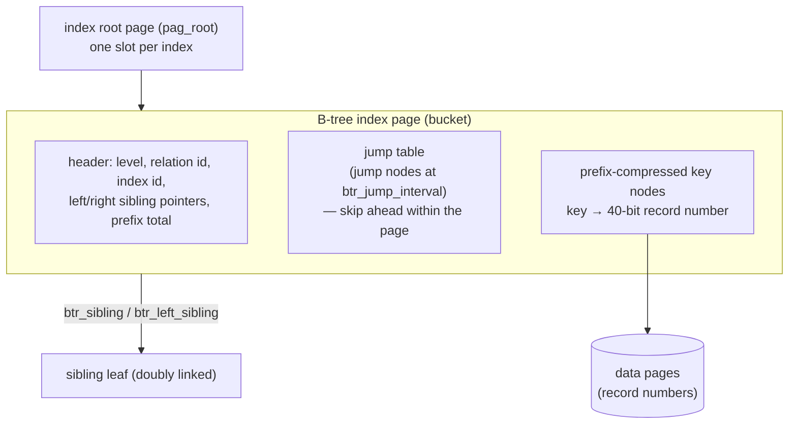

# Indexing and Full-Text Search

Indexes are how a database avoids reading every row, and full-text search is the specialized indexing that makes "find documents containing these words" fast. This document describes Firebird 6's indexing internals — a single, well-tuned B-tree with rich variants — and its (notably absent) native full-text story, grounded in the vendored source and demonstrated with real query plans on a live server, then compares both with PostgreSQL, MySQL and SQLite.

It builds directly on the [on-disk structure document](on-disk-structure.md) (index pages in the file) and the [query optimizer document](query-optimizer-and-execution.md) (how the optimizer chooses and combines indexes), and touches the [internationalization document](internationalization.md) (collation-aware indexing).

**Table of Contents**

* [Firebird's one index type: the B-tree](#firebirds-one-index-type-the-b-tree)
* [Index variants](#index-variants)
* [Combining indexes: bitmap/inversion](#combining-indexes-bitmapinversion)
* [Index variants in action (validated)](#index-variants-in-action-validated)
* [Full-text search in Firebird](#full-text-search-in-firebird)
* [Comparison: PostgreSQL, MySQL, SQLite](#comparison-postgresql-mysql-sqlite)
* [Discussion](#discussion)
* [Further research](#further-research)

## Firebird's one index type: the B-tree

Firebird has exactly one on-disk index structure: a **B-tree** (`pag_index` pages, `struct btree_page` in `ods.h`). There is no hash, GiST, GIN, BRIN or bitmap *index type* — one structure serves every index. But that B-tree is carefully engineered (`ods11-index-structure.html`):



_Figure 1: A Firebird B-tree index page — a header, an in-page jump table for fast search, and prefix-compressed key nodes pointing at 40-bit record numbers; leaves are doubly linked_

Three design points matter for performance:

- **Prefix compression** — each key stores only the bytes by which it differs from the previous key (`btr_prefix_total` tracks the savings). Verified in the [on-disk structure walk-through](on-disk-structure.md#inspecting-the-structure-validated-with-gstat): `gstat` reported an average prefix length of 1.72 on a sample index, so keys are stored far more compactly than their nominal width.
- **Jump nodes** — a small in-page jump table (`btr_jump_interval`, `btr_jump_size`) lets a search skip ahead within a bucket instead of scanning every node linearly — an in-page acceleration structure.
- **40-bit record numbers and larger keys** — the ODS 11+ structure raised record numbers beyond 32 bits and index-key size to ~1/4 of the page, and improved deletion of one key among many duplicates (a former garbage-collection pain point).

Keys are collation-aware (a text index sorts by its column's [collation](internationalization.md), so a `UNICODE_CI_AI` index groups case/accent variants), and leaves are doubly linked (`btr_sibling`/`btr_left_sibling`) so range scans and both-direction traversal are cheap.

## Index variants

The single B-tree structure supports a rich set of *logical* variants, all created with `CREATE INDEX`:

- **Unique** — `CREATE UNIQUE INDEX` (also the mechanism behind primary/unique keys).
- **Ascending / descending** — `CREATE DESCENDING INDEX` serves `ORDER BY … DESC` and `MAX()` efficiently.
- **Multi-segment (composite)** — an index on several columns `(a, b, c)`, usable for leading-column predicates.
- **Expression indexes** ([`README.expression_indices`](https://github.com/FirebirdSQL/firebird/blob/master/doc/sql.extensions/README.expression_indices)) — `CREATE INDEX … COMPUTED BY (expr)` indexes an arbitrary expression, so a predicate like `UPPER(title) = ?` can use an index.
- **Partial indexes** ([`README.partial_indices`](https://github.com/FirebirdSQL/firebird/blob/master/doc/sql.extensions/README.partial_indices)) — `CREATE INDEX … WHERE <condition>` indexes only the rows matching the condition, smaller and cheaper when queries always filter the same way (e.g. `WHERE status = 'active'`).

Expression and partial indexes can be combined (`COMPUTED BY (…) WHERE …`), and every variant is still one prefix-compressed B-tree underneath.

## Combining indexes: bitmap/inversion

Firebird has no bitmap *index type*, but the optimizer builds **bitmaps of record numbers at query time** from one or more B-trees and combines them with AND/OR before touching data pages — an "inversion" (see the [optimizer document](query-optimizer-and-execution.md#access-path-selection)). So a query with predicates on two separately-indexed columns can use *both* indexes, intersecting their bitmaps, without a composite index existing. This gives much of the multi-index flexibility that PostgreSQL's bitmap index scans provide, from the single B-tree structure.

## Index variants in action (validated)

Real query plans from a live Firebird 6 server (a `doc` table of 3,000 rows), showing each variant being chosen:

```sql
CREATE DESCENDING INDEX doc_id_desc ON doc (id);
CREATE INDEX doc_upper_title ON doc COMPUTED BY (UPPER(title));      -- expression
CREATE INDEX doc_active ON doc (status) WHERE status = 'active';     -- partial
```

```text
-- expression predicate → the expression index:
select id from doc where UPPER(title) = 'TITLE 5';
PLAN ("PUBLIC"."DOC" INDEX ("PUBLIC"."DOC_UPPER_TITLE"))

-- partial-index predicate → the partial index:
select id from doc where status = 'active';
PLAN ("PUBLIC"."DOC" INDEX ("PUBLIC"."DOC_ACTIVE"))

-- ORDER BY ... DESC → the descending index:
select first 1 id from doc order by id desc;
PLAN ("PUBLIC"."DOC" ORDER "PUBLIC"."DOC_ID_DESC")

-- substring search → NO index can help → full scan:
select id from doc where title CONTAINING 'itle 12';
PLAN ("PUBLIC"."DOC" NATURAL)
```

The first three show Firebird's B-tree variants working exactly as designed — the optimizer picked the expression index for a function predicate, the partial index for the matching filter, and the descending index for reverse ordering. The fourth is the crux of the next section: a **substring/word search (`CONTAINING`) cannot use a B-tree index and falls back to a full `NATURAL` scan** — a B-tree indexes whole keys and their prefixes, not the words or substrings inside them.

## Full-text search in Firebird

Firebird has **no native full-text search** — no `tsvector`, no `FULLTEXT` index, no FTS virtual table. What it offers are SQL text-*predicates*, none of which are index-accelerated for interior matches:

- **`LIKE 'foo%'`** / **`STARTING WITH 'foo'`** — a *prefix* match, which *can* use a B-tree (the prefix is the leading key bytes).
- **`LIKE '%foo%'`** / **`CONTAINING 'foo'`** — a case-insensitive *substring* match; always a full scan (verified above). `CONTAINING 'ITLE 1'` matched 1,111 rows on the demo table — correct, but by scanning every row.
- **`SIMILAR TO`** (regex, FB 2.5+) — pattern matching, also a full scan.

For real full-text needs, Firebird deployments reach outside the engine: an **external search engine** (Apache Lucene/Solr, Sphinx, Elasticsearch) fed from the application or via triggers, a **[UDR](extensibility.md)** that calls a native FTS library, or hand-built **trigram/keyword tables** (a companion table of word→row that *is* B-tree-indexed, maintained by triggers). This is the clearest functional gap in Firebird relative to the other three, and it is a direct consequence of having one general-purpose index type rather than the specialized inverted indexes full-text search requires.

## Comparison: PostgreSQL, MySQL, SQLite

| Aspect | **Firebird** | **PostgreSQL** | **MySQL** | **SQLite** |
|---|---|---|---|---|
| Index structures | **B-tree only** | **B-tree, Hash, [GiST](https://www.postgresql.org/docs/current/gist.html), SP-GiST, [GIN](https://www.postgresql.org/docs/current/gin.html), [BRIN](https://www.postgresql.org/docs/current/brin.html)** (+ extensions) | B+tree, Hash (Memory), FULLTEXT, R-tree (spatial) | B-tree (+ [R-tree](https://sqlite.org/rtree.html) extension) |
| Expression index | Yes (`COMPUTED BY`) | Yes | Yes (functional, 8.0) | [Yes](https://sqlite.org/expridx.html) |
| Partial index | Yes (`WHERE`) | [Yes](https://www.postgresql.org/docs/current/indexes-partial.html) | No (workaround via generated cols) | [Yes](https://sqlite.org/partialindex.html) |
| Descending index | Yes | Yes | Yes (8.0) | Yes |
| Covering index | Via multi-segment | `INCLUDE` columns | Yes (secondary) | Yes |
| Multi-index per query | **Bitmap/inversion** (query time) | Bitmap index scan | Index merge | Rarely |
| **Native full-text search** | **No** (external/UDR) | **[Yes](https://www.postgresql.org/docs/current/textsearch.html)** (`tsvector`/`tsquery` + GIN/GiST) | **[Yes](https://dev.mysql.com/doc/refman/8.4/en/fulltext-search.html)** (`FULLTEXT`, natural/boolean) | **[Yes](https://sqlite.org/fts5.html)** (FTS5 extension, BM25) |
| Fuzzy / trigram | External | [`pg_trgm`](https://www.postgresql.org/docs/current/pgtrgm.html) | `ngram` parser | FTS5 tokenizers |
| Spatial index | No (external) | GiST / SP-GiST | R-tree | R-tree extension |
| Text predicates | `LIKE`/`STARTING`/`CONTAINING`/`SIMILAR TO` | `LIKE`/`~`/`@@` | `LIKE`/`MATCH` | `LIKE`/`MATCH` (FTS) |

## Discussion

**On general-purpose indexing, Firebird is leaner than PostgreSQL but competitive.** PostgreSQL's six index access methods are unmatched — GIN for arrays/JSON/full-text, GiST/SP-GiST for geometry and ranges, BRIN for huge naturally-ordered tables — and flow from the same [extensibility](extensibility.md#comparison-postgresql-mysql-sqlite) that makes it the extension champion. Firebird deliberately ships one B-tree, but a good one: prefix-compressed, jump-accelerated, collation-aware, with **expression and partial indexes** and **query-time bitmap combining** that together cover the large majority of OLTP indexing needs. MySQL sits between (B+tree plus special-purpose FULLTEXT and spatial indexes), and SQLite is closest to Firebird (B-tree plus optional R-tree), also with expression and partial indexes. For ordinary equality/range/order workloads, all four are effective; the divergence is entirely in the *specialized* structures.

**Full-text search is Firebird's clearest feature gap.** It is the one place where the other three all ship something Firebird does not: PostgreSQL's `tsvector`/GIN with ranking and dictionaries is the most powerful, MySQL's InnoDB `FULLTEXT` (natural-language and boolean modes) is solid and built in, and SQLite's FTS5 — remarkably, in a tiny embedded library — offers a full inverted index with BM25 ranking as a bundled extension. Firebird offers only scan-based text predicates (`CONTAINING`, `SIMILAR TO`) and pushes real full-text to an external engine or a UDR. This gap is not accidental: full-text search needs an *inverted* index (word → documents), a fundamentally different structure from a B-tree, and Firebird's architecture bet on a single index type. For document-heavy or search-centric applications it is a genuine reason to look elsewhere or to bolt on Lucene/Elasticsearch.

**The pattern matches the whole series: one strong general mechanism vs many specialized ones.** Firebird's single, well-tuned B-tree mirrors its single storage engine and single procedural language — a coherent bet on depth over breadth. PostgreSQL's index-type marketplace mirrors its extension ecosystem. SQLite's "B-tree plus a couple of opt-in extensions (FTS5, R-tree)" mirrors its minimal-core-plus-loadable-modules design. The right choice is workload-shaped: transactional and reporting workloads are well served by Firebird's B-tree; search-, document-, geometry- or analytics-heavy workloads are where PostgreSQL's specialized indexes (or MySQL's/SQLite's targeted ones) earn their place.

## Further research

**Firebird**

- [`doc/ods11-index-structure.html`](https://github.com/FirebirdSQL/firebird/blob/master/doc/ods11-index-structure.html) — the enhanced B-tree structure (prefix compression, jump nodes, 40-bit record numbers).
- [`README.expression_indices`](https://github.com/FirebirdSQL/firebird/blob/master/doc/sql.extensions/README.expression_indices) and [`README.partial_indices`](https://github.com/FirebirdSQL/firebird/blob/master/doc/sql.extensions/README.partial_indices) — the two advanced index variants.
- The [on-disk structure document](on-disk-structure.md) (index pages, `gstat` statistics), the [query optimizer document](query-optimizer-and-execution.md) (access-path selection, bitmap/inversion), and the [internationalization document](internationalization.md) (collation-aware indexing). External FTS is typically integrated via [UDR / plugins](extensibility.md).

**PostgreSQL**

- [Index types](https://www.postgresql.org/docs/current/indexes-types.html), [GIN](https://www.postgresql.org/docs/current/gin.html), [GiST](https://www.postgresql.org/docs/current/gist.html), [BRIN](https://www.postgresql.org/docs/current/brin.html), [Partial indexes](https://www.postgresql.org/docs/current/indexes-partial.html), [Full text search](https://www.postgresql.org/docs/current/textsearch.html), [`pg_trgm`](https://www.postgresql.org/docs/current/pgtrgm.html).

**MySQL**

- [`CREATE INDEX`](https://dev.mysql.com/doc/refman/8.4/en/create-index.html), [Full-text search](https://dev.mysql.com/doc/refman/8.4/en/fulltext-search.html), [spatial index optimization](https://dev.mysql.com/doc/refman/8.4/en/spatial-index-optimization.html); MariaDB's [full-text index overview](https://mariadb.com/kb/en/full-text-index-overview/).

**SQLite**

- [FTS5](https://sqlite.org/fts5.html), [R-tree](https://sqlite.org/rtree.html), [Partial indexes](https://sqlite.org/partialindex.html), [Indexes on expressions](https://sqlite.org/expridx.html), [Query planner](https://sqlite.org/queryplanner.html).
