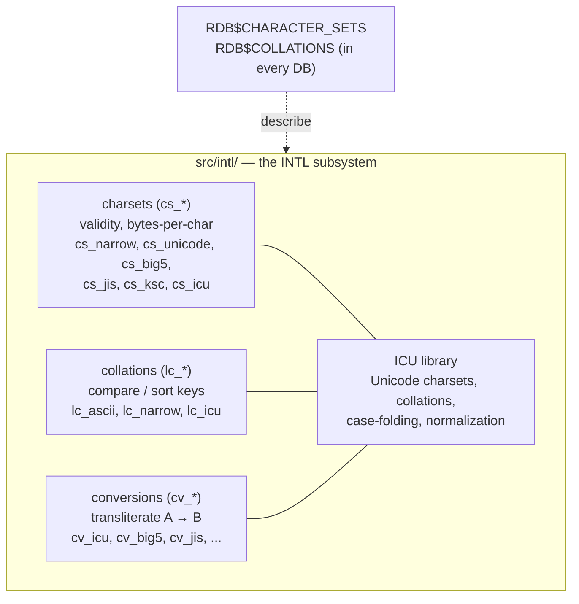
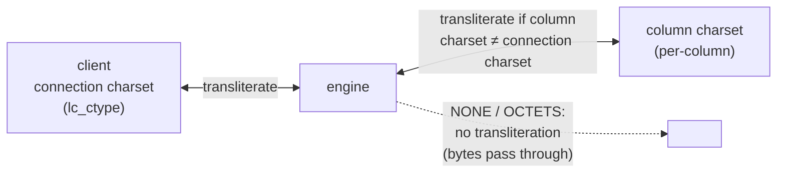

# Internationalization: Character Sets and Collations

Text is where databases meet the messiness of human language: which **character set** encodes the bytes, and which **collation** decides whether `café`, `CAFE` and `cafe` are equal or how they sort. Getting this wrong produces mojibake, wrong search results, and broken sorting. This document describes Firebird 6's internationalization (INTL) subsystem — grounded in the vendored `src/intl/` source and `doc/README.intl`, and demonstrated live on a server with real charsets and collations — then compares it with PostgreSQL, MySQL and SQLite.

It is a companion to the [main paper](README.md) and pairs closely with the [SQL dialect and data types document](sql-dialect-and-types.md) (per-column character sets are part of the type system) and the [wire-protocol document](firebird-wire-protocol.md) — the [node-firebird charset bug](firebird-wire-protocol.md#worked-examples) filed as issue [#422](https://github.com/hgourvest/node-firebird/issues/422) is, at heart, a transliteration mismatch of exactly the kind this document explains.

**Table of Contents**

* [Three concepts: charset, collation, transliteration](#three-concepts-charset-collation-transliteration)
* [The Firebird INTL subsystem](#the-firebird-intl-subsystem)
* [Character sets in Firebird](#character-sets-in-firebird)
* [Collations and ICU](#collations-and-icu)
* [Transliteration and the connection charset](#transliteration-and-the-connection-charset)
* [Worked examples (validated on Firebird 6)](#worked-examples-validated-on-firebird-6)
* [Comparison: PostgreSQL, MySQL, SQLite](#comparison-postgresql-mysql-sqlite)
* [Discussion](#discussion)
* [Further research](#further-research)

## Three concepts: charset, collation, transliteration

Keep three ideas distinct — most i18n confusion comes from conflating them:

- **Character set (encoding)** — the mapping between characters and bytes: `UTF8` (1–4 bytes/char), `WIN1252` (1 byte), `NONE` (uninterpreted bytes), `BIG_5` (2 bytes), etc. It determines *storage* and *validity*.
- **Collation** — the rules for *comparing and ordering* text within a character set: is comparison case-sensitive? accent-sensitive? does `ä` sort with `a` or after `z`? One character set can have many collations.
- **Transliteration** — converting text from one character set to another (e.g. a `WIN1252` column read by a `UTF8` client). Needed whenever two charsets meet, and a frequent source of truncation or data-loss bugs.

## The Firebird INTL subsystem

Firebird's INTL code (`src/intl/`) is organized exactly along those lines, with a fourth axis — conversion between pairs:



_Figure 1: Firebird's INTL subsystem — separate charset, collation and conversion modules, with ICU providing Unicode support; the catalog tables describe what a database has_

Two things are distinctive. First, INTL is **pluggable/data-driven**: character sets and collations are described in system tables (`RDB$CHARACTER_SETS`, `RDB$COLLATIONS`) and implemented by modules, and sites can add ICU-based collations for specific locales. Second, **ICU** (the International Components for Unicode library) backs all the Unicode charsets and the modern collations, while narrow (single-byte) and East-Asian multibyte charsets (Big5, GB2312, JIS/Kanji, KSC) have native implementations (`kanji.cpp`, `cs_big5.cpp`, …).

## Character sets in Firebird

A Firebird database has a **default character set** (chosen at `CREATE DATABASE`), and — unusually — **every text column can override it**: `VARCHAR(30) CHARACTER SET WIN1252`. Verified live: a Firebird 6 server ships **52 character sets**. The ones that matter most:

- **`UTF8`** — full Unicode, 1–4 bytes per character. The right default for new databases. Note the storage consequence covered in the [on-disk structure](on-disk-structure.md): a `CHAR(n)`/`VARCHAR(n)` reserves up to `4n` bytes, and coercing to `SQL_TEXT` pads to 4 bytes/char — the trap behind trailing-blank surprises.
- **`NONE`** — "no character set": bytes are stored and returned uninterpreted. Convenient for legacy data but dangerous, because the *client* decides how to read them, and transliterating a `NONE` column to a wider connection charset is exactly what triggered node-firebird issue [#422](https://github.com/hgourvest/node-firebird/issues/422).
- **`OCTETS`** — binary data (`CHAR(n) CHARACTER SET OCTETS`), the idiom for fixed-length binary keys and the [UUID workaround](sql-dialect-and-types.md#firebird-data-types-in-depth).
- **Single-byte** (`WIN1252`, `ISO8859_1`, `DOS437`, `CYRL`, …) and **multibyte** (`BIG_5`, `GB18030`, `SJIS_0208`, `EUCJ_0208`, `KSC_5601`, `UNICODE_FSS`) legacy encodings for interoperating with existing systems.

## Collations and ICU

A collation belongs to a character set and names the comparison/sort rules. The live server has **149 collations**; the Unicode ones (backed by ICU) are the powerful ones:

- **`UNICODE`** — the default Unicode collation (culture-neutral, case- and accent-*sensitive*).
- **`UNICODE_CI`** — **case-insensitive** (`Café` = `café`, but `Café` ≠ `cafe`).
- **`UNICODE_CI_AI`** — **case- and accent-insensitive** (`Café` = `CAFE` = `cafe`).
- **`UCS_BASIC`** — simple codepoint (binary) ordering, the fastest and most literal.
- Locale-specific ICU collations can be added for language-correct ordering (e.g. German phonebook, Spanish, Turkish `i`).

Collation is declared per column (`... COLLATE UNICODE_CI_AI`) or applied per expression (`ORDER BY name COLLATE UNICODE_CI`), so the same data can be compared different ways in different queries. This is the mechanism for accent-insensitive search, case-insensitive unique keys, and language-aware sorting.

## Transliteration and the connection charset

The **connection character set** (`isc_dpb_lc_ctype`, or `SET NAMES`) tells the server how the *client* wants text encoded on the wire. When a column's charset differs from the connection charset, Firebird **transliterates** between them.



_Figure 2: The transliteration path — text is converted between the per-column charset and the client's connection charset; NONE/OCTETS bypass conversion (bytes pass through)_

Two rules make everything predictable, and both underlie real bugs:

- **`NONE` and `OCTETS` are not transliterated** — bytes pass through unchanged, so the client must interpret them correctly. A `NONE` database read by a `UTF8` client is where [#422](https://github.com/hgourvest/node-firebird/issues/422) bites: the engine treats a `UTF8` connection's buffer as up to 4 bytes/char, so a narrow-charset value overflows the character-capacity check.
- **Connection charset should match, or safely widen, the column charset.** Reading `WIN1252` data on a `UTF8` connection transliterates correctly; reading it on a mismatched narrow connection produces mojibake. The [connection-string-charset rules](https://github.com/FirebirdSQL/firebird/blob/master/doc/README.connection_string_charset.txt) even handle the database *filename* encoding (`isc_dpb_utf8_filename`).

## Worked examples (validated on Firebird 6)

Real output from a live server. **Case- and accent-insensitive** matching with `UNICODE_CI_AI` versus a **binary** collation:

```sql
CREATE TABLE t (
  name_ci_ai VARCHAR(30) CHARACTER SET UTF8 COLLATE UNICODE_CI_AI,
  name_bin   VARCHAR(30) CHARACTER SET UTF8 COLLATE UCS_BASIC
);
INSERT INTO t VALUES ('Café','Café'), ('CAFE','CAFE'), ('cafe','cafe');

SELECT count(*) FROM t WHERE name_ci_ai = 'cafe';   -- 3  (Café = CAFE = cafe)
SELECT count(*) FROM t WHERE name_bin   = 'cafe';   -- 1  (exact match only)
SELECT upper('café èñ ß') FROM rdb$database;         -- CAFÉ ÈÑ ß  (UTF8-aware UPPER)
```

The `UNICODE_CI_AI` column treats `Café`, `CAFE` and `cafe` as equal (3 matches), while the `UCS_BASIC` column matches only the exact bytes (1) — and `UPPER` correctly upper-cases accented letters. This is accent-insensitive search and case-insensitive comparison working out of the box, purely through the collation choice.

Charset/collation inventory (also verified live): **52 character sets**, **149 collations**, including `UNICODE`, `UNICODE_CI`, `UNICODE_CI_AI`, and locale/legacy sets from `ASCII` and `WIN1252` to `BIG_5`, `GB18030` and `SJIS_0208`.

## Comparison: PostgreSQL, MySQL, SQLite

| Aspect | **Firebird** | **PostgreSQL** | **MySQL** | **SQLite** |
|---|---|---|---|---|
| Encoding granularity | **Per column** (+ DB default) | **Per database** (fixed at create) | **Per column** (+ server/db/table) | **Per database** (UTF-8/UTF-16, at create) |
| Recommended Unicode | `UTF8` | `UTF8` | **`utf8mb4`** (not `utf8`!) | UTF-8 (default) |
| Unicode collations | ICU: `UNICODE`, `UNICODE_CI`, `UNICODE_CI_AI` | ICU or libc (per-column `COLLATE`) | UCA: `utf8mb4_0900_ai_ci`, `_as_cs`, `_bin` | **None native** (BINARY, NOCASE=ASCII only) |
| Collation granularity | Per column / per expression | Per column / per expression | Per column | Per column / per expression (limited) |
| Case-insensitive | `..._CI` collation | `CITEXT` or nondeterministic ICU collation | `..._ci` collation | `NOCASE` (ASCII only) |
| Accent-insensitive | `..._CI_AI` collation | ICU nondeterministic collation | `..._ai_ci` collation | Not built-in |
| Custom collations | ICU locale-based | ICU / libc / user-defined | Limited | **App-defined C** (`create_collation`) |
| "No charset" mode | `NONE` / `OCTETS` | `SQL_ASCII` / `bytea` | `binary` / `_bin` | `BLOB` |
| Multibyte legacy sets | Big5, GB18030, SJIS, KSC, … | Many server encodings | Many | (UTF-8/16 only) |
| Backing library | **ICU** (Unicode) | ICU / libc | ICU-like UCA impl. | Codepoint only ([ICU via extension](https://github.com/sqlite/sqlite/blob/master/ext/icu/README.txt)) |
| Classic trap | `NONE` + wide connection (#422) | Immutable DB encoding | `utf8` = 3-byte (silently truncates 4-byte chars) | ASCII-only case folding |

## Discussion

**Firebird and MySQL share per-column charset granularity; PostgreSQL and SQLite fix it per database.** Firebird lets each column pick its own character set *and* collation — flexible for mixed-legacy data, and the reason the [#422 transliteration bug](firebird-wire-protocol.md#worked-examples) is a *per-column* phenomenon. MySQL is similarly granular (down to column). PostgreSQL, by contrast, fixes the encoding for the whole database at creation (changing it means a dump/reload) while keeping collation per-column; SQLite fixes UTF-8 or UTF-16 for the whole file. Per-column flexibility is powerful but is exactly what makes charset mismatches possible — a cost that comes with the capability.

**ICU is the common engine for real Unicode collation — except in SQLite.** Firebird's `UNICODE_*` collations, PostgreSQL's ICU provider (default-capable since PG 15), and MySQL's UCA-based `utf8mb4_0900_*` collations all deliver language-aware, case- and accent-configurable comparison. SQLite is the deliberate outlier: its built-in collations are `BINARY`, `NOCASE` (ASCII-only case folding) and `RTRIM`, with real Unicode collation available only by compiling in the [ICU extension](https://github.com/sqlite/sqlite/blob/master/ext/icu/README.txt) or supplying an app-defined collation in C. That is consistent with its minimal, embedded design (see the [embedded comparison](embedded-architecture-comparison.md)) — Unicode collation is heavy, and SQLite makes you opt in.

**Every system has a signature Unicode trap, and they are worth memorizing.** MySQL's is the notorious `utf8` alias, which is really 3-byte `utf8mb3` and silently mangles 4-byte characters (emoji, some CJK) — you must use `utf8mb4`. Firebird's is the `NONE` charset read over a wider connection (the [#422](https://github.com/hgourvest/node-firebird/issues/422) transliteration/capacity mismatch) plus the 4-bytes-per-char `CHAR` padding. PostgreSQL's is that database encoding is effectively immutable after creation. SQLite's is that "case-insensitive" (`NOCASE`) only folds ASCII, so `É` ≠ `é` without ICU. The trap in each case flows directly from the design choice above — per-column flexibility, DB-wide fixity, or minimalism — so knowing the architecture tells you where the sharp edge is.

## Further research

**Firebird**

- [`doc/README.intl`](https://github.com/FirebirdSQL/firebird/blob/master/doc/README.intl) and [`src/intl/`](https://github.com/FirebirdSQL/firebird/tree/master/src/intl) — the charset/collation/conversion modules and ICU integration.
- [`doc/README.connection_string_charset.txt`](https://github.com/FirebirdSQL/firebird/blob/master/doc/README.connection_string_charset.txt) — filename and connection charset handling.
- The [SQL dialect and data types document](sql-dialect-and-types.md) (per-column charsets in the type system), the [on-disk structure document](on-disk-structure.md) (UTF8 storage/padding), and the [wire-protocol document](firebird-wire-protocol.md#worked-examples) with node-firebird issue [#422](https://github.com/hgourvest/node-firebird/issues/422).

**PostgreSQL**

- [Character set support](https://www.postgresql.org/docs/current/multibyte.html), [Collation support](https://www.postgresql.org/docs/current/collation.html), [`citext`](https://www.postgresql.org/docs/current/citext.html).

**MySQL**

- [Character sets and collations](https://dev.mysql.com/doc/refman/8.4/en/charset.html), [The utf8mb4 character set](https://dev.mysql.com/doc/refman/8.4/en/charset-unicode-utf8mb4.html), [Collation names](https://dev.mysql.com/doc/refman/8.4/en/charset-collation-names.html); MariaDB's [character sets](https://mariadb.com/kb/en/character-sets/).

**SQLite**

- [Datatypes (text encoding)](https://sqlite.org/datatype3.html), [`COLLATE`](https://sqlite.org/lang_expr.html), [`sqlite3_create_collation()`](https://sqlite.org/c3ref/create_collation.html), [the ICU extension](https://github.com/sqlite/sqlite/blob/master/ext/icu/README.txt).

**Standards**

- [ICU — International Components for Unicode](https://icu.unicode.org/) and [Unicode Collation Algorithm (UTS #10)](https://www.unicode.org/reports/tr10/), the basis of the Unicode collations above.
