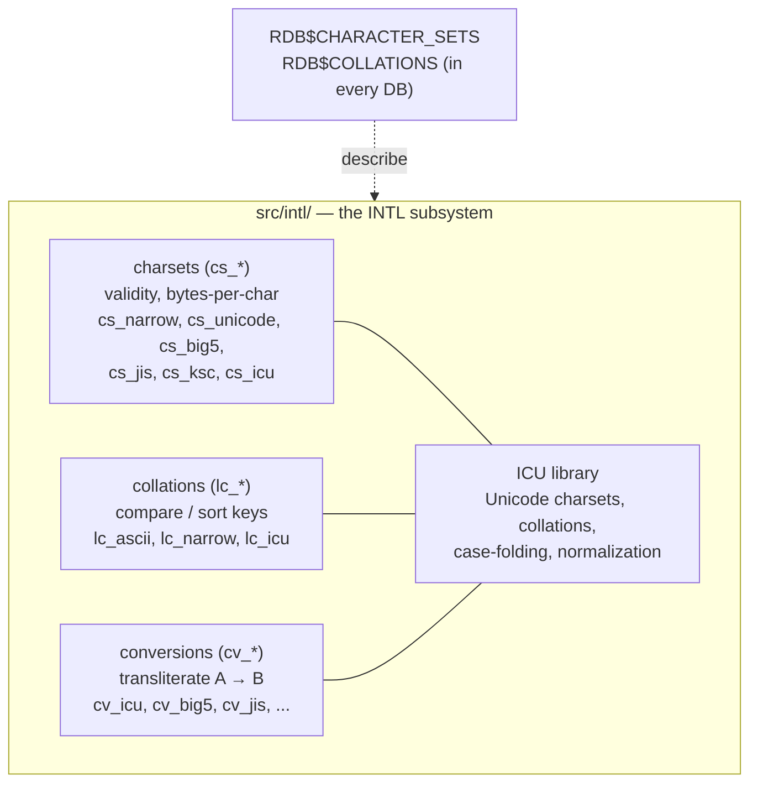
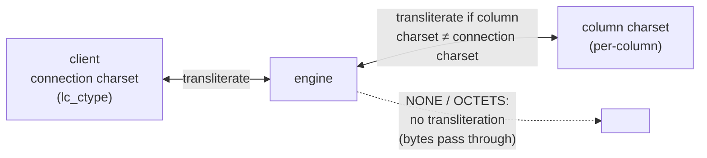

# Internationalization: Character Sets and Collations

Text is where databases meet the messiness of human language: which **character set** encodes the bytes, and which **collation** decides whether `café`, `CAFE` and `cafe` are equal or how they sort. Getting this wrong produces mojibake, wrong search results, and broken sorting. This document describes Firebird 6's internationalization (INTL) subsystem — grounded in the vendored `src/intl/` source and `doc/README.intl`, and demonstrated live on a server with real charsets and collations — then compares it with PostgreSQL, MySQL and SQLite.

It is a companion to the [main paper](README.md) and pairs closely with the [SQL dialect and data types document](sql-dialect-and-types.md) (per-column character sets are part of the type system) and the [wire-protocol document](firebird-wire-protocol.md) — the [node-firebird charset bug](firebird-wire-protocol.md#worked-examples) filed as issue [#422](https://github.com/hgourvest/node-firebird/issues/422) is, at heart, a transliteration mismatch of exactly the kind this document explains.

**Table of Contents**

* [Three concepts: charset, collation, transliteration](#three-concepts-charset-collation-transliteration)
* [The Firebird INTL subsystem](#the-firebird-intl-subsystem)
* [Character sets in Firebird](#character-sets-in-firebird)
* [Collations and ICU](#collations-and-icu)
* [What a collation decides — and why you cannot fake one](#what-a-collation-decides--and-why-you-cannot-fake-one)
* [Two laws of an ICU collation, read off the engine](#two-laws-of-an-icu-collation-read-off-the-engine)
* [Transliteration and the connection charset](#transliteration-and-the-connection-charset)
* [Worked examples (validated on Firebird 6)](#worked-examples-validated-on-firebird-6)
* [Comparison: PostgreSQL, MySQL, SQLite](#comparison-postgresql-mysql-sqlite)
* [Discussion](#discussion)
* [Further research](#further-research)

## Three concepts: charset, collation, transliteration

Keep three ideas distinct — most i18n confusion comes from conflating them:

- **Character set (encoding)** — the mapping between characters and bytes: `UTF8` (1–4 bytes/char), `WIN1252` (1 byte), `NONE` (uninterpreted bytes), `BIG_5` (2 bytes), etc. It determines *storage* and *validity*.
- **Collation** — the rules for *comparing and ordering* text within a character set: is comparison case-sensitive? accent-sensitive? does `ä` sort with `a` or after `z`? One character set can have many collations.
- **Transliteration** — converting text from one character set to another (e.g. a `WIN1252` column read by a `UTF8` client). Needed whenever two charsets meet, and a frequent source of truncation or data-loss bugs.

## The Firebird INTL subsystem

Firebird's INTL code (`src/intl/`) is organized exactly along those lines, with a fourth axis — conversion between pairs:


```mermaid
flowchart TB
    subgraph INTL["src/intl/ — the INTL subsystem"]
        CS["charsets (cs_*)<br/>validity, bytes-per-char<br/>cs_narrow, cs_unicode, cs_big5,<br/>cs_jis, cs_ksc, cs_icu"]
        LC["collations (lc_*)<br/>compare / sort keys<br/>lc_ascii, lc_narrow, lc_icu"]
        CV["conversions (cv_*)<br/>transliterate A → B<br/>cv_icu, cv_big5, cv_jis, ..."]
        ICU["ICU library<br/>Unicode charsets, collations,<br/>case-folding, normalization"]
        CS --- ICU
        LC --- ICU
        CV --- ICU
    end
    META["RDB$CHARACTER_SETS<br/>RDB$COLLATIONS (in every DB)"] -.describe.-> INTL
```

_Figure 1: Firebird's INTL subsystem — separate charset, collation and conversion modules, with ICU providing Unicode support; the catalog tables describe what a database has_

Two things are distinctive. First, INTL is **pluggable/data-driven**: character sets and collations are described in system tables (`RDB$CHARACTER_SETS`, `RDB$COLLATIONS`) and implemented by modules, and sites can add ICU-based collations for specific locales. Second, **ICU** (the International Components for Unicode library) backs all the Unicode charsets and the modern collations, while narrow (single-byte) and East-Asian multibyte charsets (Big5, GB2312, JIS/Kanji, KSC) have native implementations (`kanji.cpp`, `cs_big5.cpp`, …).

## Character sets in Firebird

A Firebird database has a **default character set** (chosen at `CREATE DATABASE`), and — unusually — **every text column can override it**: `VARCHAR(30) CHARACTER SET WIN1252`. Verified live: a Firebird 6 server ships **52 character sets**. The ones that matter most:

- **`UTF8`** — full Unicode, 1–4 bytes per character. The right default for new databases. Note the storage consequence covered in the [on-disk structure](on-disk-structure.md): a `CHAR(n)`/`VARCHAR(n)` reserves up to `4n` bytes, and coercing to `SQL_TEXT` pads to 4 bytes/char — the trap behind trailing-blank surprises.
- **`NONE`** — "no character set": bytes are stored and returned uninterpreted. Convenient for legacy data but dangerous, because the *client* decides how to read them, and transliterating a `NONE` column to a wider connection charset is exactly what triggered node-firebird issue [#422](https://github.com/hgourvest/node-firebird/issues/422).
- **`OCTETS`** — binary data (`CHAR(n) CHARACTER SET OCTETS`), the idiom for fixed-length binary keys and the [UUID workaround](sql-dialect-and-types.md#firebird-data-types-in-depth).
- **Single-byte** (`WIN1252`, `ISO8859_1`, `DOS437`, `CYRL`, …) and **multibyte** (`BIG_5`, `GB18030`, `SJIS_0208`, `EUCJ_0208`, `KSC_5601`, `UNICODE_FSS`) legacy encodings for interoperating with existing systems.

**The database default is resolved at CREATE time, not at read time.**
A column declared without a `CHARACTER SET` clause takes the database's
default, and the engine writes the *resolved* id into the column's
catalog row — so in a `DEFAULT CHARACTER SET UTF8` database a plain
`VARCHAR(10)` is charset 4 and occupies **forty** bytes, exactly as if
it had been spelled out. Two consequences follow: changing a database's
default later does not retype existing columns, and any tool that
writes catalog rows itself has to resolve the default the same way or
its columns will disagree with the engine's on charset, on byte length
and on every describe.

## Collations and ICU

A collation belongs to a character set and names the comparison/sort rules. The live server has **149 collations**; the Unicode ones (backed by ICU) are the powerful ones:

- **`UNICODE`** — the default Unicode collation (culture-neutral, case- and accent-*sensitive*).
- **`UNICODE_CI`** — **case-insensitive** (`Café` = `café`, but `Café` ≠ `cafe`).
- **`UNICODE_CI_AI`** — **case- and accent-insensitive** (`Café` = `CAFE` = `cafe`).
- **`UCS_BASIC`** — simple codepoint (binary) ordering, the fastest and most literal.
- Locale-specific ICU collations can be added for language-correct ordering (e.g. German phonebook, Spanish, Turkish `i`).

Collation is declared per column (`... COLLATE UNICODE_CI_AI`) or applied per expression (`ORDER BY name COLLATE UNICODE_CI`), so the same data can be compared different ways in different queries. This is the mechanism for accent-insensitive search, case-insensitive unique keys, and language-aware sorting.

## What a collation decides — and why you cannot fake one

It is worth being precise about *how much* of an answer a collation
owns, because the list is longer than "sort order":

| the operation | what the collation decides |
|---|---|
| `ORDER BY`, and a sort under `GROUP BY`/`DISTINCT` | the row order |
| `=`, `<`, `BETWEEN`, `IN`, `LIKE`, `STARTING WITH` | which rows match |
| `GROUP BY`, `DISTINCT`, `COUNT(DISTINCT …)`, a distinct `UNION` | which values are *the same value* |
| `MIN`/`MAX` | which row wins |
| a `UNIQUE` index or a primary key | whether an insert is a duplicate |
| a `FOREIGN KEY` | whether a parent exists |
| an index range scan | which keys the scan visits (index keys *are* collation keys) |

So a case-insensitive collation is not a display convenience: under
`UNICODE_CI`, `'apple'` and `'APPLE'` are one value everywhere in that
table — one group, one distinct row, one duplicate-key violation.

Mechanically, the engine does none of this by comparing characters. Each
texttype exposes a **key builder** (`INTL_string_to_key`) that turns a
string into a byte string whose plain `memcmp` order *is* the
collation's order, and the same keys are what an index stores. The
narrow (single-byte) collations carry small tables — a weight per byte,
with a few expansions (`ä` → `ae`) — while the Unicode ones call **ICU**
and get UCA sort keys, whose ordering is a large published table:
`'apple' < 'Ápple' < 'banana'`, because the accented `Á` shares a
primary weight with `A` and the accent only breaks ties.

That last point is the one worth carrying away for anyone reimplementing
this engine, and [fire-crab](firebird-rust-conversion.md) learned it the
expensive way: **a collation you cannot key is an answer you cannot
give.** Comparing the bytes instead looks like it works — the query
returns rows, in an order, with no error anywhere — and it is wrong in
whichever direction the data happens to fall: over one six-row fixture,
byte order answered `5,2,1,6,3,4` where the engine answers
`1,5,4,6,2,3`, `WHERE ci = 'APPLE'` found one row where the engine finds
two, and `GROUP BY ci` made six groups where the engine makes four. The
honest options are to carry the tables or to refuse the operation; there
is no third one, and "it is only the sort order" is not true.

## Two laws of an ICU collation, read off the engine

Carrying the tables turns out to be the smaller job, because the tables
are not yours to write: they are the UCA's, and there is a Rust
implementation of them ([ICU4X](https://docs.rs/icu/latest/icu/)). What
is *not* in any table is how Firebird uses them, and two rules decide
every answer. Both were measured against a live Firebird 6 server over
one four-row fixture — `apple`, `APPLE`, `Ápple`, `ápple` — held in
three columns collated `UNICODE`, `UNICODE_CI` and `UNICODE_CI_AI`:

**A sort is full strength, whatever the column's collation is.**

```sql
SELECT id FROM t ORDER BY u,  id;   -- 1 2 4 3
SELECT id FROM t ORDER BY ci, id;   -- 1 2 4 3
SELECT id FROM t ORDER BY ai, id;   -- 1 2 4 3
```

All three agree, and none of them is byte order (`APPLE` sorts *after*
`apple`, and both before the accented pair). A case-insensitive
collation does not make a sort unstable or arbitrary; it makes an
*equality* loose, which is a different thing.

**Equality and grouping read the collation's own strength.**

```sql
SELECT id FROM t WHERE u  = 'APPLE';   -- 2          (tertiary: exact)
SELECT id FROM t WHERE ci = 'APPLE';   -- 1 2        (secondary: case folds)
SELECT id FROM t WHERE ai = 'APPLE';   -- 1 2 3 4    (primary: accent folds too)
SELECT count(*) FROM t GROUP BY ci;    -- 2, 2       (two groups)
SELECT count(*) FROM t GROUP BY ai;    -- 4          (one group)
```

Both laws are the *same sort key* cut at a different level, which is why
one key builder answers both: sort at tertiary, compare at the
collation's strength. In ICU4X terms that is one `Collator` per strength
and `write_sort_key_to`; the resulting bytes compare with `memcmp`,
exactly as `INTL_string_to_key`'s do, so an engine's existing key-based
comparison machinery needs no new shape to hold them. Two details are
not optional: **trailing blanks are the pad and are not keyed**
(`'apple' = 'apple  '`, and the two land in one group), while a
*leading* blank is part of the value and weighs as a real collation
element — `' apple'` sorts before `'app le'` on the live engine, which
is the root table's non-ignorable variable weighting.

### The third law: a fold reads the collation's own strength

Ordering is full strength and equality is not, and a **fold** — `MIN`,
`MAX`, `COUNT(DISTINCT …)` — sits on the equality side of that line,
which is easy to get backwards. `MIN` over a `UNICODE_CI` column
holding `APPLE` and `apple` answered *whichever row came first*,
measured both ways round: to the fold the two are equal, so the
ordinary "keep unless strictly less" rule decides and the first one
seen wins. Had the fold used the sort's full-strength key instead, it
would have answered `'apple'` either way — the same key, cut at the
wrong level, gives a different answer to a question that looks like
pure ordering.

`COUNT(DISTINCT …)` is the same law from the other side, and it is
exactly as well defined as a `GROUP BY` *count*: five spellings of
apple, two accent classes and one banana come to 6 distinct values
under `UNICODE`, 5 under `UNICODE_CI` and 4 under `UNICODE_CI_AI`.

### What a sort key still cannot answer

Two things stay refusals even with the UCA in hand, and each is a
property of the *problem*, not of the implementation:

- **`LIKE`, `STARTING WITH`, `CONTAINING`, `SIMILAR TO`.** These match
  through the collation's own matcher, prefix by prefix, and a UCA sort
  key is not built prefix-wise: its levels are concatenated, so the key
  of `'app'` is no prefix of the key of `'apple'`. Measured,
  `ci STARTING WITH 'APP'` takes `'apple'` too — an answer no
  byte-prefix test and no key comparison produces.
- **`GROUP BY` and `DISTINCT` over a case- or accent-insensitive
  column.** Not the *count* — that is well defined — but the surviving
  **spelling**, which follows the engine's own sort's internal order.
  Three measurements, no rule between them: over {`apple`, `APPLE`},
  `GROUP BY ci` kept whichever row was inserted *second* (`'APPLE'` one
  way round, `'apple'` the other); over four spellings — `aPPle`,
  `APPLE`, `apple`, `ApPlE` — it kept `'apple'`, which is neither the
  first record nor the last, and went on keeping it after that row was
  deleted and re-inserted at the end; and `SELECT DISTINCT` answers a
  *different* survivor from `GROUP BY` over the same rows. A
  reimplementation can reproduce the group count exactly and the group
  *value* not at all.

Note how narrow the second one is. It is not the *count* that is
unanswerable, and it is not grouping in general: a **full-strength**
collation never calls two different strings one value, so `UNICODE`
groups and deduplicates as exactly as a binary collation does — and its
groups come back in the *collation's* order, which is its own trap. A
grouped result is sorted by its keys, so `GROUP BY name` under any
collation answers rows in that collation's sequence: `ae`, `ä`,
`apple`, `APPLE`, `banana` where the bytes would have said something
else entirely.

One more trap is not in that list, because it is not about keys at all
— and it is the subtlest of the family. A converted engine tends to grow
*two* execution paths — a query planner that knows column descriptors, and a
BLR interpreter for stored procedures that works on values. Text values
do not carry their collation. So the same statement answers correctly at
the prompt and incorrectly inside a procedure body: measured,
`SELECT count(*) FROM t WHERE ci = 'APPLE'` answered 2 typed directly
and 1 from a procedure, with no error on either side. The cheap, honest
fix is a guard rather than a second implementation — if the BLR names a
relation carrying a collated column, stand aside and let the
descriptor-aware path serve the call.

## Transliteration and the connection charset

The **connection character set** (`isc_dpb_lc_ctype`, or `SET NAMES`) tells the server how the *client* wants text encoded on the wire. When a column's charset differs from the connection charset, Firebird **transliterates** between them.


```mermaid
flowchart LR
    APP["client<br/>connection charset<br/>(lc_ctype)"] <-->|"transliterate"| ENG["engine"]
    ENG <-->|"transliterate if column<br/>charset ≠ connection charset"| COL["column charset<br/>(per-column)"]
    ENG -. "NONE / OCTETS:<br/>no transliteration<br/>(bytes pass through)" .-> NOTE[" "]
```

_Figure 2: The transliteration path — text is converted between the per-column charset and the client's connection charset; NONE/OCTETS bypass conversion (bytes pass through)_

Two rules make everything predictable, and both underlie real bugs:

- **`NONE` and `OCTETS` are not transliterated** — bytes pass through unchanged, so the client must interpret them correctly. A `NONE` database read by a `UTF8` client is where [#422](https://github.com/hgourvest/node-firebird/issues/422) bites: the engine treats a `UTF8` connection's buffer as up to 4 bytes/char, so a narrow-charset value overflows the character-capacity check.
- **Connection charset should match, or safely widen, the column charset.** Reading `WIN1252` data on a `UTF8` connection transliterates correctly; reading it on a mismatched narrow connection produces mojibake. The [connection-string-charset rules](https://github.com/FirebirdSQL/firebird/blob/master/doc/README.connection_string_charset.txt) even handle the database *filename* encoding (`isc_dpb_utf8_filename`).

## Worked examples (validated on Firebird 6)

Real output from a live server. **Case- and accent-insensitive** matching with `UNICODE_CI_AI` versus a **binary** collation:

```sql
CREATE TABLE t (
  name_ci_ai VARCHAR(30) CHARACTER SET UTF8 COLLATE UNICODE_CI_AI,
  name_bin   VARCHAR(30) CHARACTER SET UTF8 COLLATE UCS_BASIC
);
INSERT INTO t VALUES ('Café','Café'), ('CAFE','CAFE'), ('cafe','cafe');

SELECT count(*) FROM t WHERE name_ci_ai = 'cafe';   -- 3  (Café = CAFE = cafe)
SELECT count(*) FROM t WHERE name_bin   = 'cafe';   -- 1  (exact match only)
SELECT upper('café èñ ß') FROM rdb$database;         -- CAFÉ ÈÑ ß  (UTF8-aware UPPER)
```

The `UNICODE_CI_AI` column treats `Café`, `CAFE` and `cafe` as equal (3 matches), while the `UCS_BASIC` column matches only the exact bytes (1) — and `UPPER` correctly upper-cases accented letters. This is accent-insensitive search and case-insensitive comparison working out of the box, purely through the collation choice.

Charset/collation inventory (also verified live): **52 character sets**, **149 collations**, including `UNICODE`, `UNICODE_CI`, `UNICODE_CI_AI`, and locale/legacy sets from `ASCII` and `WIN1252` to `BIG_5`, `GB18030` and `SJIS_0208`.

## `OCTETS`: the character set whose space is a NUL

`OCTETS` is not "text with the checks turned off" — it is a character
set like any other, and every text law in the engine consults it. What
makes it singular is one value: **its space character is a zero byte**,
where every other set's is `0x20`. That single difference propagates
through padding, comparison, trimming and pattern matching, and it is
where binary columns surprise people. Each of the following was measured
against a live Firebird 6 server and traced to the code that decides it:

- **Padding.** A `CHAR(4) CHARACTER SET OCTETS` holding `x'6162'` reads
  back `61620000`, not `61622020` — `CVT_move` fills the slot with the
  charset's space ([`cvt.cpp`](https://github.com/FirebirdSQL/firebird/blob/master/src/common/cvt.cpp)).
- **Comparison.** As soon as *either* side is binary, the shorter side is
  padded with `0x00` and neither side is transliterated
  ([`CVT2_compare`](https://github.com/FirebirdSQL/firebird/blob/master/src/common/cvt2.cpp)).
  So `x'4100' = 'A'` is TRUE while `x'4120' = 'A'` is FALSE, and
  `x'41' < 'A '`.
- **`UPPER`/`LOWER` are the identity.** The binary text type installs a
  byte copy for both directions
  ([`intl_builtin.cpp`](https://github.com/FirebirdSQL/firebird/blob/master/src/intl/intl_builtin.cpp)),
  where `NONE` and `ASCII` — which share the internal family — upcase the
  ASCII range.
- **`TRIM` strips NULs, not blanks.** Its default character is the
  charset's space, so a trailing `0x20` survives a `TRIM` of a binary
  value and a trailing `0x00` does not; `LPAD`/`RPAD` fill with the same
  byte.
- **`LIKE` over a binary left operand has no wildcards at all.** `%` and
  `_` are converted *from Unicode* into the left operand's character set,
  and the binary converter is a UTF-16 byte dump, so each wildcard
  arrives as `{0x00,0x25}` / `{0x00,0x5F}`; the matcher reads the leading
  byte and its `sql_match_any` guard reads a zero as "no wildcard"
  ([`evl_string.h`](https://github.com/FirebirdSQL/firebird/blob/master/src/jrd/evl_string.h)).
  What remains is a literal byte match over the *full padded* value — a
  `CHAR(4)` holding `61620000` matches `x'61620000'` and not `x'6162'`. A
  `CHAR` left operand keeps its wildcards even when the *pattern* is
  binary, and `SIMILAR TO`, a different matcher entirely, keeps them for
  binary operands too.
- **The result character set absorbs.** One `OCTETS` operand makes the
  whole concatenation, `CASE`, `COALESCE` or `MIN` binary
  ([`DataTypeUtil::getResultTextType`](https://github.com/FirebirdSQL/firebird/blob/master/src/common/DataTypeUtil.cpp)),
  and a high byte then travels as one octet rather than its UTF-8 pair.

The literal form follows the same logic: `x'48656C6C6F'` describes as
`CHAR(5) CHARACTER SET OCTETS NOT NULL`, spaces inside it are ignored,
whitespace-separated segments continue the same literal, and an odd or
non-hex digit is a syntax error rather than a value error.

Together these explain the classic UUID-column complaints — a
`CHAR(16) CHARACTER SET OCTETS` compares against a 16-byte value
exactly, against a shorter one only when the remainder is NULs, and
never through a `LIKE` prefix.

## The character-set cast, and its three error classes

`CAST(<value> AS VARCHAR(n) CHARACTER SET <cs>)` is the explicit way a
value crosses between character sets — the SQL surface of the
transliteration path above. What makes it worth studying is that it can
fail in three *different* ways, and which one a value earns tells you
where it came from:

| what happens | when | SQLSTATE / message |
|---|---|---|
| the OCTETS travel unchanged | the destination is `NONE` or `OCTETS` — a byte carrier | — |
| the bytes are validated | the SOURCE is a byte carrier and the destination is a real set | `22000` *Malformed string* |
| the CHARACTERS are mapped | both sides are real character sets | `22018` *Cannot transliterate character between character sets* |

So `x'41FF'` cast to `UTF8` is a **malformed string** (those bytes are
not UTF-8), while a `UTF8` column holding `'Ω'` cast to `WIN1252` is a
**transliteration failure** (the character has no image in that
codepage) — two vectors for what looks like the same problem. A
single-byte destination has an image for every octet, which is why
`x'8182'` casts into `WIN1252` happily; and `ASCII`, though it carries
bytes, rejects everything past `0x7F`.

Three further rules, each measurable in one line of SQL:

- **Transliteration happens before the width is looked at.** Five
  untranslatable characters cast into a `VARCHAR(2)` raise the 22018,
  not the 22001 the width alone would have earned.
- **The width is counted in characters of the TARGET**, and the
  overflow that may be silently dropped is the target's *pad*. So
  `CAST(x'41202020' AS VARCHAR(2) CHARACTER SET OCTETS)` raises where
  `CAST(x'41000000' AS ...)` fits — the blanks are data in a set whose
  pad is a NUL, per the [OCTETS laws](#octets-the-character-set-whose-space-is-a-nul)
  above.
- **The declared width is bounded in BYTES**, not characters:
  `VARCHAR(n)` tops out at 32765 bytes and `CHAR(n)` at 32767, so a
  `UTF8` target refuses at 8192 characters where a `NONE` one accepts
  four times as many.

The describe follows the same logic: `CAST('ab' AS VARCHAR(3)
CHARACTER SET UTF8)` announces 12 bytes at charset 4 where the WIN1252
spelling announces 3 at charset 53 — and under a *real* connection
charset the engine re-announces every result in the connection's set —
`ASCII` included — with the two byte carriers, `OCTETS` and `NONE`, the
exceptions that keep their own bytes.

## Comparison: PostgreSQL, MySQL, SQLite

| Aspect | **Firebird** | **PostgreSQL** | **MySQL** | **SQLite** |
|---|---|---|---|---|
| Encoding granularity | **Per column** (+ DB default) | **Per database** (fixed at create) | **Per column** (+ server/db/table) | **Per database** (UTF-8/UTF-16, at create) |
| Recommended Unicode | `UTF8` | `UTF8` | **`utf8mb4`** (not `utf8`!) | UTF-8 (default) |
| Unicode collations | ICU: `UNICODE`, `UNICODE_CI`, `UNICODE_CI_AI` | ICU or libc (per-column `COLLATE`) | UCA: `utf8mb4_0900_ai_ci`, `_as_cs`, `_bin` | **None native** (BINARY, NOCASE=ASCII only) |
| Collation granularity | Per column / per expression | Per column / per expression | Per column | Per column / per expression (limited) |
| Case-insensitive | `..._CI` collation | `CITEXT` or nondeterministic ICU collation | `..._ci` collation | `NOCASE` (ASCII only) |
| Accent-insensitive | `..._CI_AI` collation | ICU nondeterministic collation | `..._ai_ci` collation | Not built-in |
| Custom collations | ICU locale-based | ICU / libc / user-defined | Limited | **App-defined C** (`create_collation`) |
| "No charset" mode | `NONE` / `OCTETS` | `SQL_ASCII` / `bytea` | `binary` / `_bin` | `BLOB` |
| Multibyte legacy sets | Big5, GB18030, SJIS, KSC, … | Many server encodings | Many | (UTF-8/16 only) |
| Backing library | **ICU** (Unicode) | ICU / libc | ICU-like UCA impl. | Codepoint only ([ICU via extension](https://github.com/sqlite/sqlite/blob/master/ext/icu/README.txt)) |
| Classic trap | `NONE` + wide connection (#422) | Immutable DB encoding | `utf8` = 3-byte (silently truncates 4-byte chars) | ASCII-only case folding |

## Discussion

**Firebird and MySQL share per-column charset granularity; PostgreSQL and SQLite fix it per database.** Firebird lets each column pick its own character set *and* collation — flexible for mixed-legacy data, and the reason the [#422 transliteration bug](firebird-wire-protocol.md#worked-examples) is a *per-column* phenomenon. MySQL is similarly granular (down to column). PostgreSQL, by contrast, fixes the encoding for the whole database at creation (changing it means a dump/reload) while keeping collation per-column; SQLite fixes UTF-8 or UTF-16 for the whole file. Per-column flexibility is powerful but is exactly what makes charset mismatches possible — a cost that comes with the capability.

**ICU is the common engine for real Unicode collation — except in SQLite.** Firebird's `UNICODE_*` collations, PostgreSQL's ICU provider (default-capable since PG 15), and MySQL's UCA-based `utf8mb4_0900_*` collations all deliver language-aware, case- and accent-configurable comparison. SQLite is the deliberate outlier: its built-in collations are `BINARY`, `NOCASE` (ASCII-only case folding) and `RTRIM`, with real Unicode collation available only by compiling in the [ICU extension](https://github.com/sqlite/sqlite/blob/master/ext/icu/README.txt) or supplying an app-defined collation in C. That is consistent with its minimal, embedded design (see the [embedded comparison](embedded-architecture-comparison.md)) — Unicode collation is heavy, and SQLite makes you opt in.

**Every system has a signature Unicode trap, and they are worth memorizing.** MySQL's is the notorious `utf8` alias, which is really 3-byte `utf8mb3` and silently mangles 4-byte characters (emoji, some CJK) — you must use `utf8mb4`. Firebird's is the `NONE` charset read over a wider connection (the [#422](https://github.com/hgourvest/node-firebird/issues/422) transliteration/capacity mismatch) plus the 4-bytes-per-char `CHAR` padding. PostgreSQL's is that database encoding is effectively immutable after creation. SQLite's is that "case-insensitive" (`NOCASE`) only folds ASCII, so `É` ≠ `é` without ICU. The trap in each case flows directly from the design choice above — per-column flexibility, DB-wide fixity, or minimalism — so knowing the architecture tells you where the sharp edge is.

## Hands-on: samples, tests and debugging

### C++ sample — [`samples/cpp/intl.cpp`](samples/cpp/intl.cpp)

One table exercises all [three concepts](#three-concepts-charset-collation-transliteration): two UTF8 columns differing only in **collation** (`UNICODE_CI_AI` vs `UCS_BASIC`), and a **per-column charset** override (`WIN1252`) beside them. The sample runs the document's Café/CAFE/cafe experiment, then attaches a *second* connection with `lc_ctype=NONE` and fetches the same `WIN1252` value over both connections **without metadata coercion** — hex-dumping what each receives, which is [Figure 2](#transliteration-and-the-connection-charset) measured on the wire.

```sh
cmake -B build samples && cmake --build build
./build/intl             # default: inet://localhost//tmp/fbhandson/intl.fdb
```

Verified output:

```text
rows matching 'cafe' with UNICODE_CI_AI : 3
rows matching 'cafe' with UCS_BASIC     : 1
UPPER('café èñ ß')                      : CAFÉ ÈÑ ß

ORDER BY name_ci_ai: cafe  CAFE  Café
ORDER BY name_bin  : CAFE  Café  cafe     (binary: uppercase codepoints first)

SELECT name_win FROM t WHERE name_bin = 'Café' — same row, two connections:
  lc_ctype=UTF8:   len= 5  43 61 66 C3 A9   "Café"
  lc_ctype=NONE:   len= 4  43 61 66 E9   "Caf?"
```

The column stores the WIN1252 byte `E9`; the UTF8 connection receives the transliterated pair `C3 A9`, the NONE connection the raw stored byte — same row, different bytes, chosen by `isc_dpb_lc_ctype` alone. An implementation note in the sample matters for API users: `fb_sample.h`'s generic `query()` coerces output to `CS_NONE`, which *suppresses* transliteration (both connections would show `E9`), so the demo fetches with the statement's own output metadata instead.

### fb-cpp sample — [`samples/fb-cpp/intl.cpp`](samples/fb-cpp/intl.cpp)

The same three demonstrations through [fb-cpp](https://github.com/asfernandes/fb-cpp) (vendored at [`extern/fb-cpp`](extern/fb-cpp)), the modern C++20 wrapper over the OO API. The instructive diff is precisely the implementation note above: where the OO-API sample needed a raw-fetch workaround to escape its own `CS_NONE`-coercing query helper, fb-cpp always fetches through the statement's own output metadata, so `getString()` hands over exactly the bytes the engine transliterated into the connection charset — the effect this sample measures, with no workaround. The connection charset itself shrinks from an `isc_dpb_lc_ctype` DPB item to one typed builder call, `setConnectionCharSet("UTF8")` / `setConnectionCharSet("NONE")` (fb-cpp sets no lc_ctype at all unless asked).

```sh
cmake -B build samples && cmake --build build   # needs libboost-dev + libboost-filesystem-dev
./build/fbcpp_intl
```

Verified: same numbers as the OO-API run — 3 vs 1 matches for `UNICODE_CI_AI` vs `UCS_BASIC`, `UPPER('café èñ ß')` → `CAFÉ ÈÑ ß`, and the same row hex-dumped over two connections as `len= 5  43 61 66 C3 A9` (UTF8 connection) against `len= 4  43 61 66 E9` (NONE connection).

### JavaScript sample — [`samples/nodejs/intl.js`](samples/nodejs/intl.js)

The twin (`cd samples/nodejs && node intl.js`) maps `encoding:` to the connection charset and lands in the same two worlds — plus a driver-side wrinkle. Verified (codepoints of the received JS strings in brackets):

```text
matches for 'cafe' via UNICODE_CI_AI : 3
matches for 'cafe' via UCS_BASIC     : 1
encoding UTF8 : name_win="Café" [43 61 66 e9]  name_bin="Café" [43 61 66 e9]
encoding NONE : name_win="Café" [43 61 66 e9]  name_bin="Café" [43 61 66 c3 a9]
```

With `encoding: 'UTF8'` everything transliterates server-side and decodes to proper strings. With `encoding: 'NONE'` the server passes stored bytes through and node-firebird decodes them byte-per-byte (latin1): the `WIN1252` column *accidentally* looks right (`E9` ≈ latin1 `é`) while the UTF8 column becomes the classic mojibake `Café` — the same no-transliteration path that makes issue [#422](https://github.com/hgourvest/node-firebird/issues/422) bite on NONE-charset databases like `employee.fdb` (which is why [`common.js`](samples/nodejs/common.js) defaults to `encoding: 'NONE'` there).

### Rust sample — [`samples/rust/src/bin/intl.rs`](samples/rust/src/bin/intl.rs)

The same scenario through [rsfbclient](https://github.com/fernandobatels/rsfbclient), Rust's Firebird client (`cd samples/rust && cargo run --bin intl`). The builder's `.charset(..)` *is* the lc_ctype, and it does double duty: it names the connection charset sent to the server and the codec the driver uses to turn `Text` columns into Rust `String`s. The sample's second attachment hand-builds `Charset { on_firebird: "NONE", on_rust: None }` — no Rust-side codec — so the driver's mandatory UTF-8 `String` decode becomes the measuring instrument: under UTF8 the decode is an identity check (the `String`'s own bytes *are* the wire bytes), and under NONE the untransliterated WIN1252 byte `E9` fails that decode — which is itself the proof that no server-side conversion happened. Where C++ hex-dumps a raw buffer and JS hands over latin1 mojibake, Rust refuses to construct the string at all.

Verified: same collation numbers — 3 vs 1 matches for `UNICODE_CI_AI` vs `UCS_BASIC`, `UPPER('café èñ ß')` → `CAFÉ ÈÑ ß`, and sort orders `cafe CAFE Café` (CI_AI) vs `CAFE Café cafe` (binary). The UTF8 connection reads `name_win` as `len= 5  43 61 66 C3 A9`; the NONE connection instead reports `Found column with an invalid UTF-8 string: incomplete utf-8 byte sequence from index 3` — the raw stored `E9` arriving unconverted — while the UTF8-typed `name_bin` column's bytes `43 61 66 C3 A9` pass through NONE untouched because they happen to be valid UTF-8.

### Free Pascal sample — [`samples/fpc/intl.pas`](samples/fpc/intl.pas)

The same scenario through [fbintf](https://github.com/MWASoftware/fbintf) (vendored at [`extern/fbintf`](extern/fbintf)), MWA Software's Firebird Pascal API — the layer under IBX — driving the same libfbclient behind COM-style reference-counted interfaces (`make -C samples/fpc bin/intl && samples/fpc/bin/intl`). The second attachment builds its DPB explicitly — `FirebirdAPI.AllocateDPB`, then `Add(isc_dpb_lc_ctype).setAsString('NONE')` — the same item the C++ sample packs by hand, as a typed interface call. What no other twin does: FPC's `AnsiString` carries a codepage, and fbintf tags every fetched string with the charset the column was *described* with on that connection (`GetCharsetName(rs[0].getCharSetID)` reports it), so a plain assignment would transcode behind your back; the sample assigns into a `RawByteString` to freeze the wire bytes before hex-dumping — the driver layer here has its own transliteration machinery that the measurement must deliberately switch off.

Verified: same 3-vs-1 collation split, `UPPER('café èñ ß')` → `CAFÉ ÈÑ ß`, sort orders `cafe CAFE Café` (CI_AI) vs `CAFE Café cafe` (binary), and the same row over two connections: `lc_ctype=UTF8` receives `len= 5  43 61 66 C3 A9` with the column described as charset `UTF8`, `lc_ctype=NONE` receives the raw stored `len= 4  43 61 66 E9` with the column described as `WIN1252`.

### Things to try

- Add `COLLATE UNICODE_CI` (case- but not accent-insensitive) as a third column: `'cafe'` then matches 2 of the 3 rows — the missing middle step between the sample's 3 and 1.
- Query `RDB$CHARACTER_SETS`/`RDB$COLLATIONS` (the catalog of Figure 1) and count them — the live server's 52 and 149.
- Insert a value with a character WIN1252 cannot represent (e.g. `'€漢'`) into `name_win` over the UTF8 connection and watch transliteration fail with an `isc_transliteration_failed` error instead of silently corrupting.
- In the JS sample, point `encoding: 'NONE'` at `employee.fdb` and read `EMPLOYEE.FIRST_NAME` — the Buffer/latin1 behaviour on a real NONE-charset database.

### Debugging this in C++ (gdb)

With a [debug build of the engine](debugging-firebird.md), the INTL subsystem's three module families are three breakpoints:

```gdb
break INTL_compare          # src/jrd/intl.cpp:346 — every collation-aware comparison
break INTL_convert_string   # jrd/intl.cpp:542 — transliteration between descriptors
break INTL_convert_bytes    # jrd/intl.cpp:426 — the charset-pair byte conversion itself
break Firebird::UnicodeUtil::Utf16Collation::compare
                            # src/common/unicode_util.cpp:1945 — the ICU comparison
```

Run the sample's `WHERE name_ci_ai = 'cafe'` and `INTL_compare` fires with the two text descriptors; step into it to watch it resolve the column's `ttype` (collation id) and dispatch to `Utf16Collation::compare`, where ICU applies the `CI_AI` strength — the frame's arguments are UTF-16 buffers holding `Café` and `cafe`. Fetch `name_win` on the UTF8 connection and `INTL_convert_string` shows `from` with the WIN1252 charset id and `to` with UTF8 — Figure 2's arrow as a stack frame; on the NONE connection the breakpoint is never hit for that fetch, which *is* the passthrough rule. See the [debugging guide](debugging-firebird.md) for the embedded setup.

## Further research

**Firebird**

- [`doc/README.intl`](https://github.com/FirebirdSQL/firebird/blob/master/doc/README.intl) and [`src/intl/`](https://github.com/FirebirdSQL/firebird/tree/master/src/intl) — the charset/collation/conversion modules and ICU integration.
- [`doc/README.connection_string_charset.txt`](https://github.com/FirebirdSQL/firebird/blob/master/doc/README.connection_string_charset.txt) — filename and connection charset handling.
- The [SQL dialect and data types document](sql-dialect-and-types.md) (per-column charsets in the type system), the [on-disk structure document](on-disk-structure.md) (UTF8 storage/padding), and the [wire-protocol document](firebird-wire-protocol.md#worked-examples) with node-firebird issue [#422](https://github.com/hgourvest/node-firebird/issues/422).

**PostgreSQL**

- [Character set support](https://www.postgresql.org/docs/current/multibyte.html), [Collation support](https://www.postgresql.org/docs/current/collation.html), [`citext`](https://www.postgresql.org/docs/current/citext.html).

**MySQL**

- [Character sets and collations](https://dev.mysql.com/doc/refman/8.4/en/charset.html), [The utf8mb4 character set](https://dev.mysql.com/doc/refman/8.4/en/charset-unicode-utf8mb4.html), [Collation names](https://dev.mysql.com/doc/refman/8.4/en/charset-collation-names.html); MariaDB's [character sets](https://mariadb.com/kb/en/character-sets/).

**SQLite**

- [Datatypes (text encoding)](https://sqlite.org/datatype3.html), [`COLLATE`](https://sqlite.org/lang_expr.html), [`sqlite3_create_collation()`](https://sqlite.org/c3ref/create_collation.html), [the ICU extension](https://github.com/sqlite/sqlite/blob/master/ext/icu/README.txt).

**Standards**

- [ICU — International Components for Unicode](https://icu.unicode.org/) and [Unicode Collation Algorithm (UTS #10)](https://www.unicode.org/reports/tr10/), the basis of the Unicode collations above.
