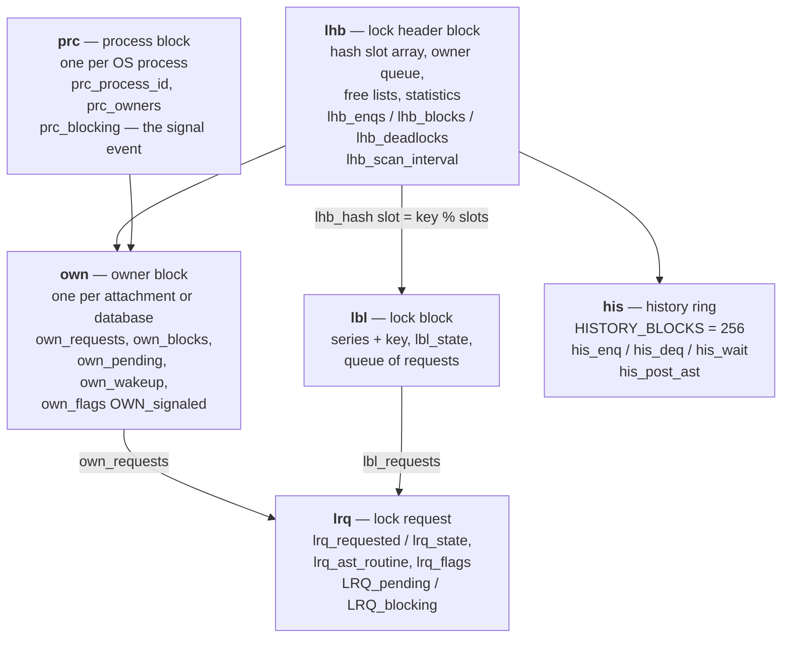
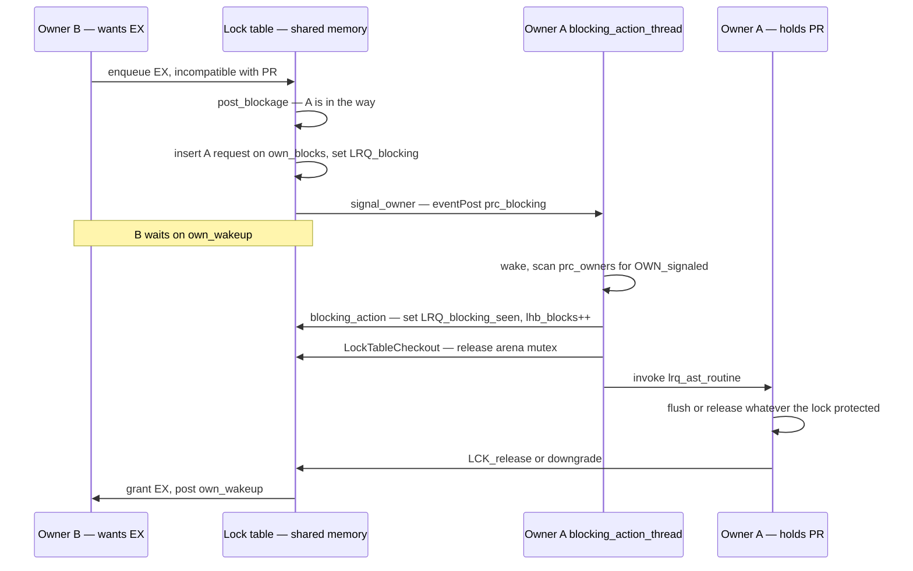

# The Lock Manager and the Lock Protocol

The lock manager is the most-referenced and least-explained subsystem in this collection. The [request trace](request-lifecycle-code-trace.md#stage-8-the-lock-handler-and-the-lock-manager) meets it at Stage 8 as the thing that serializes `CREATE TABLE`; the [page-cache coherency document](page-cache-coherency.md) leans on it for `LCK_bdb` page locks; [garbage collection](garbage-collection-and-sweep.md) uses it to serialize record cleanup and to elect a single sweeper; [transactions](transactions-and-concurrency.md) surface its errors as `-913 deadlock` and `-901 lock conflict`. Each of those documents treats it as infrastructure and moves on.

This document treats it as the subject. Firebird's lock manager is a **general-purpose distributed lock manager (DLM)** in the VMS tradition — a shared-memory arena, a six-level compatibility lattice, asynchronous blocking notifications, and a wait-for-graph deadlock detector — arbitrating between *owners* that may be threads of one process or entirely separate processes. It is not a row-lock manager bolted onto a transaction system; it is a general locking service that the transaction system, the buffer cache, the metadata cache, the backup subsystem and the encryption thread all happen to be clients of. That generality is the design decision worth studying, and it is why one subsystem can carry loads as different as "one sweeper at a time" and "thousands of page locks per second".

Everything below is grounded in [`src/lock/lock.cpp`](https://github.com/FirebirdSQL/firebird/blob/master/src/lock/lock.cpp) (4 068 lines), [`src/lock/lock_proto.h`](https://github.com/FirebirdSQL/firebird/blob/master/src/lock/lock_proto.h) and [`src/jrd/lck.cpp`](https://github.com/FirebirdSQL/firebird/blob/master/src/jrd/lck.cpp), and demonstrated live at the end — including all three wait outcomes measured to the millisecond and a real deadlock caught by the scanner.

**Table of Contents**

* [Two layers: the Lock object and the lock table](#two-layers-the-lock-object-and-the-lock-table)
* [The shared-memory arena](#the-shared-memory-arena)
* [The compatibility matrix](#the-compatibility-matrix)
* [Enqueue: the request path](#enqueue-the-request-path)
* [Blocking ASTs: how a knock crosses a process boundary](#blocking-asts-how-a-knock-crosses-a-process-boundary)
* [Waiting, timeouts and deadlock detection](#waiting-timeouts-and-deadlock-detection)
* [The thirty-six series: what the engine actually locks](#the-thirty-six-series-what-the-engine-actually-locks)
* [Case study: the nbackup state lock](#case-study-the-nbackup-state-lock)
* [The protocol in action (validated)](#the-protocol-in-action-validated)
* [Comparison: PostgreSQL, MySQL, SQLite](#comparison-postgresql-mysql-sqlite)
* [Discussion](#discussion)
* [Further research](#further-research)

## Two layers: the Lock object and the lock table

The engine never touches the lock table directly. Two layers separate a caller's intent from the shared memory that records it.

**Layer 1 — the Lock handler** ([`lck.cpp`](https://github.com/FirebirdSQL/firebird/blob/master/src/jrd/lck.cpp), [`lck.h`](https://github.com/FirebirdSQL/firebird/blob/master/src/jrd/lck.h)) is JRD's in-process façade, and its currency is the **`Lock` object**: a *series* from `enum lck_t`, a variable-length *key* identifying the object within that series, a requested and a granted *level* (`lck_logical` / `lck_physical`), an owner backlink, and `lck_ast` — the blocking-AST callback. Callers write `LCK_lock(tdbb, lock, LCK_EX, LCK_WAIT)` and think in terms of "an exclusive lock on relation 42".

Owners come in exactly two flavours ([`lck.h`](https://github.com/FirebirdSQL/firebird/blob/master/src/jrd/lck.h)):

```c
LCK_OWNER_database = 1,     // A database is the owner of the lock
LCK_OWNER_attachment        // An attachment is the owner of the lock
```

**Layer 2 — the lock manager** ([`lock.cpp`](https://github.com/FirebirdSQL/firebird/blob/master/src/lock/lock.cpp)) is the paper's "Lock" component: a `LockManager` instance per database, owning a shared-memory section visible on disk as `/tmp/firebird/fb_lock_<hash>`. This is the boundary where in-process bookkeeping becomes cross-process arbitration — and the reason [Classic processes and embedded attachments can share one database file](embedded-architecture-comparison.md) at all.

The split matters because the two layers have different failure modes. Layer 1 is ordinary C++ under the engine's own synchronization. Layer 2 is a relocatable arena in shared memory that several processes mutate concurrently, where a participant can *die holding state* — which is why so much of `lock.cpp` is concerned with detecting and purging dead owners.

## The shared-memory arena

The lock table is a 1980s-vintage relocatable arena. Because it is mapped at different base addresses in different processes, nothing inside it may be a pointer: every reference is an `SRQ_PTR`, a `LONG` byte-offset from the header, dereferenced through `SRQ_ABS_PTR` and produced by `SRQ_REL_PTR`. Self-relative circular queues (`srq`) link everything.



_Figure 1: The lock table arena — everything addressed by `SRQ_PTR` offsets, never pointers_

The block types divide the work cleanly. A **`lbl`** is *the resource*: one per (series, key) pair actually locked, holding `lbl_state` — the strongest level currently granted. An **`lrq`** is *one owner's claim on that resource*, carrying both what it wants (`lrq_requested`) and what it holds (`lrq_state`), plus the AST callback to invoke if it ever stands in someone's way. Every `lrq` is on two queues at once: its lock's `lbl_requests` and its owner's `own_requests`. An **`own`** is *a participant*, and a **`prc`** is *the OS process* hosting one or more owners — the distinction that lets SuperServer run many attachment-owners inside a single process while Classic runs one per process.

Sizing comes from [`config.h`](https://github.com/FirebirdSQL/firebird/blob/master/src/common/config/config.h) and is confirmed live below:

| Setting | Default | Meaning |
|---|---|---|
| `LockMemSize` | 1 048 576 bytes | initial arena size (it grows by remapping) |
| `LockHashSlots` | 8 191 | hash slots, clamped to `HASH_MIN_SLOTS` 101 … `HASH_MAX_SLOTS` 65 521 |
| `LockAcquireSpins` | 0 | spin count before blocking on the table mutex |
| `DeadlockTimeout` | 10 seconds | becomes `lhb_scan_interval` — the deadlock scan period |

The arena is not the only shared-memory region in Firebird — the [event manager](firebird-events.md) has its own `fb_event_*` section with a near-identical `IpcObject` design. The two are siblings, and reading them together makes the house style obvious.

## The compatibility matrix

Levels form the classic DLM six-step ladder — `LCK_none`, `LCK_null`, `LCK_SR` (shared read), `LCK_PR` (protected read), `LCK_SW` (shared write), `LCK_PW` (protected write), `LCK_EX` (exclusive) — and the entire arbitration rule is one static table in [`lock.cpp`](https://github.com/FirebirdSQL/firebird/blob/master/src/lock/lock.cpp):

```c
static constexpr bool compatibility[LCK_max][LCK_max] =
{
/*                      Shared  Prot    Shared  Prot
            none  null  Read    Read    Write   Write   Exclusive */

/* none */  {true,  true,  true,  true,  true,  true,  true},
/* null */  {true,  true,  true,  true,  true,  true,  true},
/* SR */    {true,  true,  true,  true,  true,  true,  false},
/* PR */    {true,  true,  true,  true,  false, false, false},
/* SW */    {true,  true,  true,  false, true,  false, false},
/* PW */    {true,  true,  true,  false, false, false, false},
/* EX */    {true,  true,  false, false, false, false, false}
};
```

The matrix is symmetric, and reading it by row explains the level names. `SR` is the promiscuous level — compatible with everything except `EX` — because a shared reader tolerates even a protected writer. `PR` excludes all writers but admits other readers. `SW` admits other shared writers and shared readers but not protected readers, because a protected reader is asking for a stable view that a concurrent writer would spoil. `PW` is nearly exclusive: it permits only `SR` alongside it, not even another `PW`. And `EX` permits nothing but `none`/`null`.

Every arbitration decision in the manager is a lookup in this table. `grant_or_que` consults `compatibility[request->lrq_requested][lock->lbl_state]` to decide whether a claim can be granted immediately; `post_blockage` consults it to decide which existing holders are genuinely in the way; the deadlock walker consults it to decide whether a waiter is truly blocked. One 7×7 array of booleans is the whole policy.

Two levels do most of the work in practice. The page cache aliases them in [`lock_proto.h`](https://github.com/FirebirdSQL/firebird/blob/master/src/lock/lock_proto.h) as `LCK_read = LCK_PR` and `LCK_write = LCK_EX`, which is why the [coherency document](page-cache-coherency.md#the-page-lock-protocol-pr-ex-and-the-blocking-ast) only ever discusses two states — it is using a two-level subset of a six-level lattice.

## Enqueue: the request path

`LCK_lock` bottoms out in `LockManager::enqueue`, which under a `LockTableGuard` (the arena mutex, held for the duration):

1. bumps `lhb_enqs`, and if a prior request for this Lock exists, dequeues it — a *conversion* rather than a fresh claim;
2. takes an `lrq` from `lhb_free_requests` or allocates one, and fills in the requested level plus `lrq_ast_routine` / `lrq_ast_argument`;
3. records `post_history(his_enq, ...)` into the 256-entry ring;
4. hashes (series, key) via `find_lock`, bumping the per-series counter `lhb_operations[series]`;
5. if the `lbl` exists, appends the `lrq` to `lbl_requests` and calls `grant_or_que`; if it does not, allocates one and grants immediately.

When the claim cannot be granted, the caller's wait preference — carried all the way down as `lck_wait` — decides the outcome, in a single expression that appears twice in the file:

```c
Arg::Gds(lck_wait > 0 ? isc_deadlock : lck_wait < 0 ? isc_lock_timeout :
    isc_lock_conflict).copyTo(statusVector);
```

That one line is the whole user-visible contract of the lock manager, and it maps directly onto SQL:

| `lck_wait` | SQL | Behaviour | Error |
|---|---|---|---|
| `> 0` (`LCK_WAIT`) | `SET TRANSACTION WAIT` | wait indefinitely; only a detected cycle ends it | `isc_deadlock` (−913) |
| `< 0` | `SET TRANSACTION LOCK TIMEOUT n` | wait `n` seconds, then give up | `isc_lock_timeout` |
| `== 0` (`LCK_NO_WAIT`) | `SET TRANSACTION NO WAIT` | fail immediately | `isc_lock_conflict` (−901) |

All three are measured live [below](#the-protocol-in-action-validated).

## Blocking ASTs: how a knock crosses a process boundary

The blocking AST is the mechanism that makes the whole design work, and it is worth being precise about, because "asynchronous trap" suggests signals and interrupts while the reality is a dedicated thread and a shared-memory event.

When a request cannot be granted, `post_blockage` walks the lock's request queue looking for holders genuinely in the way. Four conditions cause a holder to be skipped:

```c
if (block == request ||
    blocking_owner == owner ||
    compatibility[request->lrq_requested][block->lrq_state] ||
    !block->lrq_ast_routine ||
    (block->lrq_flags & LRQ_blocking_seen))
{
    continue;
}
```

Not oneself, not one's own owner, not a compatible holder, not a holder without an AST routine (there is no point notifying someone who cannot respond) — and, the interesting one, not a holder already flagged `LRQ_blocking_seen`. The comment states the contract exactly: *"the blocking AST has been delivered and the owner promises to release the lock as soon as possible (so don't bug the owner)."* Notification is idempotent by design; a holder is knocked on once, not once per waiter. The scan also stops early on encountering an `LCK_EX` holder, since nothing behind it can matter.

Each blocking holder is appended to its owner's `own_blocks` queue, then `signal_owner` delivers the knock:

```c
blocking_owner->own_flags |= OWN_signaled;
prc* const process = (prc*) SRQ_ABS_PTR(blocking_owner->own_process);

// Deliver signal either locally or remotely
if (process->prc_process_id == PID)
{
    blocking_action(callbacks, SRQ_REL_PTR(blocking_owner));
    return true;
}

if (m_sharedMemory->eventPost(&process->prc_blocking) == FB_SUCCESS)
    return true;
```

Three things are happening here. The `OWN_signaled` flag is a second layer of deduplication at owner granularity ("if a process, other than ourselves, hasn't yet seen a signal that was sent, don't bother to send another one"). If the target owner lives in *this* process, the AST is invoked inline — no IPC at all, which is the common case under SuperServer. Otherwise the manager posts `prc_blocking`, a shared-memory event on the *process* block. And if the post fails, the return value is `false`, which the caller turns into `purge_process` — a dead participant is reaped rather than blocking the table forever.

On the receiving side, every process runs a dedicated `blocking_action_thread` (started at `THREAD_high` priority) that waits on `prc_blocking`, then scans its own `prc_owners` for any owner flagged `OWN_signaled` and runs `blocking_action` for it.

`blocking_action` drains the owner's `own_blocks` queue, and the detail that matters most is what surrounds the callback:

```c
if (routine)
{
    owner->own_ast_count++;

    { // checkout scope
        LockTableCheckout checkout(this, FB_FUNCTION);

        callbacks.checkoutRun([&] {
            try {
                (*routine)(arg);
            }
            catch (const Exception& ex) {
                iscLogException("Exception from AST routine - this should never happen", ex);
            }
            ...
        });
    }

    owner = (own*) SRQ_ABS_PTR(blocking_owner_offset);
    owner->own_ast_count--;
}
```

**`LockTableCheckout` releases the arena mutex for the duration of the AST.** This is essential rather than merely polite: an AST can do arbitrary, slow work — `down_grade` may have to *write a dirty page to disk* under [careful-write precedence](careful-writes-and-crash-safety.md) before it can release a page lock. Holding the global lock-table mutex across a disk write would serialize the entire database on every coherency event. The price is that the arena may be remapped while the AST runs, which is exactly why `owner` is re-derived from its offset after the call returns — a vivid illustration of why the arena uses offsets rather than pointers.

Note also that exceptions escaping an AST are caught and logged, never propagated. An AST runs on a thread that has no relationship to whatever caused it; there is nowhere sensible to throw.



_Figure 2: A blocking AST from claim to grant — note the arena mutex is released around the callback_

## Waiting, timeouts and deadlock detection

`wait_for_request` is where an ungranted claim parks. It bumps `lhb_waits`, marks the request `LRQ_pending` and links it onto `own_pending`, clears the owner's `own_wakeup` event, calls `post_blockage` to knock on the holders, and then loops.

One small fairness detail: a conversion sitting at `LCK_none` is moved to the *tail* of `lbl_requests` first, with the comment *"put the lock to the end of the list so it's not taking cuts in the lineup."*

The loop is driven by two independent deadlines. If a lock timeout was requested, `lock_timeout = current_time + (-lck_wait)`. Independently, `deadlock_timeout = current_time + scan_interval`, reset every time real work happens. The code is candid about the messiness of waiting on real systems, treating unexplained wakeups as expected:

```c
// Bogus reasons for wakeups include signal reception on some
// platforms (eg: SUN4) and remapping notification.
// Note: we allow a 1 second leaway on declaring a bogus
// wakeup due to timing differences
```

A spurious wakeup that did *not* come with a grant re-runs `post_blockage` — because the lock may meanwhile have been handed to a different request, and the *new* holder has to be told it is now blocking someone.

When the deadlock deadline expires, the scanner runs. `deadlock_clear` resets the `LRQ_deadlock` and `LRQ_scanned` flags on all pending requests, then `deadlock_walk` performs a depth-first traversal of the wait-for graph. Encountering a request already marked `LRQ_deadlock` in this walk means the traversal has come back on itself — a cycle — and the request is returned as the victim.

The conservatism is deliberate. `deadlock_walk` maintains a `maybe_deadlock` flag, and:

```c
// Only when it is certain that this request is not part of a deadlock do we
// mark it scanned ... Note that this request might be part of multiple deadlocks.
```

An uncertain result declines to cache anything, so the next scan re-examines from scratch. The design accepts re-doing work rather than risk a false negative, which is the same posture as the `related()` bounded walk in the [careful-writes precedence graph](careful-writes-and-crash-safety.md) — when unsure, do the safe expensive thing.

The consequence users actually feel is latency. Detection is **periodic, not instantaneous**: a genuine cycle in `WAIT` mode sits there for up to `DeadlockTimeout` seconds before anyone notices. The measurement below shows exactly that.

## The thirty-six series: what the engine actually locks

`enum lck_t` in [`lck.h`](https://github.com/FirebirdSQL/firebird/blob/master/src/jrd/lck.h) has thirty-six members, and reading it is the fastest way to understand what the engine considers a shared resource. Grouped by purpose:

| Group | Series | Used for |
|---|---|---|
| Structural | `LCK_database`, `LCK_attachment`, `LCK_page_space`, `LCK_cancel` | root of the lock tree; the [EX-probe-then-SW dance](page-cache-coherency.md) at attach |
| Buffer cache | `LCK_bdb` | one per cached page — the [coherency protocol](page-cache-coherency.md), by far the highest-volume series |
| Transactions | `LCK_tra` | one per transaction; **waiting on a conflicting record means waiting on the blocking transaction's lock** — how MVCC conflicts become lock-manager waits |
| Metadata | `LCK_relation`, `LCK_rel_rescan`, `LCK_idx_rescan`, `LCK_prc_rescan`, `LCK_fun_rescan`, `LCK_package_rescan`, `LCK_cs_rescan`, `LCK_dbwide_triggers`, `LCK_rel_partners`, `LCK_alter_database` | DDL serialization and metadata-cache invalidation — the paper's [metadata lock](request-lifecycle-code-trace.md#stage-8-the-lock-handler-and-the-lock-manager); the six `*_rescan` series are one per cached object family, and what pulls them is [the metadata cache](metadata-cache.md#invalidation-across-processes) |
| Garbage collection | `LCK_record_gc`, `LCK_rel_gc`, `LCK_sweep`, `LCK_btr_dont_gc` | per-record GC serialization and single-sweeper election ([GC document](garbage-collection-and-sweep.md)) |
| Index | `LCK_idx_create` | held during an index build |
| Backup | `LCK_backup_alloc`, `LCK_backup_database`, `LCK_backup_end`, `LCK_shadow`, `LCK_update_shadow` | nbackup delta-file state and [shadow](high-availability.md) synchronization |
| Encryption | `LCK_crypt`, `LCK_crypt_status` | single crypt thread, encryption-status change notification ([security](security-architecture.md)) |
| Replication | `LCK_repl_state`, `LCK_repl_tables` | [replication](replication-architecture.md) state and publication set |
| Caches / misc | `LCK_dsql_cache`, `LCK_dsql_statement_cache`, `LCK_monitor`, `LCK_tpc_init`, `LCK_tpc_block`, `LCK_profiler_listener` | statement cache invalidation, [MON$ snapshot](monitoring-and-tuning.md) coordination, TIP cache, [profiler](monitoring-and-tuning.md) listener |

The table is the argument for the design. A single mechanism — hash a key, request a level, get an AST when you are in the way — serves "invalidate the cached procedure metadata everywhere" and "hold this data page for read" and "there must be only one sweeper". None of these needed a bespoke coordination mechanism, and adding a new one is a matter of appending an enum member. The lock manager's generality is the reason Firebird has so *few* other coordination mechanisms.

Note that the enum is append-only in practice, for the same reason the [catalog's relation ids are](catalog-bootstrap.md): series numbers appear in a shared-memory structure that mixed-version participants may read, and `fb_lock_print` reports them numerically.

## Case study: the nbackup state lock

A concrete client that is neither the cache nor the transaction system shows the protocol's reach. When `nbackup -b` or `ALTER DATABASE BEGIN BACKUP` flips a database into stalled mode, writes are diverted to a delta file and the main file freezes — the mechanics covered in [backup and recovery](backup-and-recovery.md). Every attached instance must agree about that switch, and no instance may hold dirty pages destined for the old target when it happens.

`NBackupStateLock::blockingAstHandler` in [`nbak.cpp`](https://github.com/FirebirdSQL/firebird/blob/master/src/jrd/nbak.cpp) is the AST that enforces it:

```c
// master instance should not try to acquire localStateLock or enter "flush" mode
if (backup_manager->isMaster())
{
    GlobalRWLock::blockingAstHandler(tdbb);
    return;
}

// Ensure we have no dirty pages in local cache before releasing
// of state lock
if (!backup_manager->databaseFlushInProgress())
{
    backup_manager->beginFlush();
    Firebird::MutexUnlockGuard counterGuard(counterMutex, FB_FUNCTION);
    CCH_flush_ast(tdbb);
}
```

`CCH_flush_ast` ([`cch.cpp`](https://github.com/FirebirdSQL/firebird/blob/master/src/jrd/cch.cpp)) is a *whole-cache* barrier — `CCH_flush(FLUSH_ALL)` when the cache is exclusive, otherwise a guarded sweep over every `BufferDesc` in `bcb_bdbBlocks` with the `BCB_keep_pages` flag set to stop pages being removed from the tree at AST level. Contrast it with `blocking_ast_bdb`, which flushes exactly one page.

That contrast is the point. The same primitive — a lock, a level, an AST — expresses both "hand me this one page" and "everybody get to a clean cache before the storage target changes underneath you". The granularity lives entirely in what the AST routine chooses to do; the manager neither knows nor cares. The `isMaster()` exemption and the `stateBlocking` / `localStateLock` re-entrancy dance are the messy real-world details of an AST that must not deadlock against its own subsystem's internal locks — a recurring hazard when AST handlers take locks of their own.

## The protocol in action (validated)

All results below are from a live Firebird 6 server (SuperServer) against a scratch database `/tmp/fblock/lk.fdb` with two tables. `RESERVING <table> FOR PROTECTED WRITE` was used to take a real `LCK_relation` lock at `LCK_EX` — [`tra.cpp`](https://github.com/FirebirdSQL/firebird/blob/master/src/jrd/tra.cpp) maps `isc_tpb_lock_write` + `isc_tpb_protected` straight onto `LCK_EX`, so this drives the actual lock manager rather than the MVCC conflict path.

**The lock table's own report.** With an attachment open, `fb_lock_print -f /tmp/firebird/fb_lock_<hash>`:

```
LOCK_HEADER BLOCK
	Version: 148, Creation timestamp: 2026-07-20 08:32:25
	Active owner:      0, Length: 1048576, Used:  90672
	Enqs:     84, Converts:      4, Rejects:      0, Blocks:      0
	Deadlock scans:      0, Deadlocks:      0, Scan interval:  10
	Acquires:    113, Acquire blocks:      0, Spin count:   0
	Mutex wait: 0.0%
	Hash slots: 8191, Hash lengths (min/avg/max):    0/   0/   9
	Owners (4):	forward:  78392, backward:  87960
```

Every documented default is confirmed in one dump: `Length: 1048576` is `LockMemSize`, `Hash slots: 8191` is `LockHashSlots`, `Spin count: 0` is `LockAcquireSpins`, and `Scan interval: 10` is `DeadlockTimeout` landing in `lhb_scan_interval`. The counters map one-to-one onto the code paths above — `Enqs` is `lhb_enqs` from `enqueue`, `Blocks` is `lhb_blocks` incremented in `blocking_action` (i.e. **ASTs actually delivered**, the same counter that reached 1 379 during the [page ping-pong](page-cache-coherency.md#coherency-in-action-validated)).

The owner dump distinguishes the two owner types and shows SuperServer's topology plainly — four owners, all in **one** process, on different threads:

```
OWNER BLOCK  78392
	Owner id: 466502167822341, Type: 1        <- LCK_OWNER_database
	Process id: 108616 (Alive), Thread id: 130327
	Requests (63):	forward:  78776, backward:  92080
OWNER BLOCK  87480
	Owner id: 466502167822343, Type: 2        <- LCK_OWNER_attachment
	Process id: 108616 (Alive), Thread id: 130310
	Requests (2):	forward:  87672, backward:  87816
```

Under Classic each of those would carry a distinct `Process id`, and every `signal_owner` would take the `eventPost` branch instead of the inline call.

**All three wait outcomes.** One session held `t1` at `LCK_EX`; probes then requested the same lock in each of the three modes:

| Mode | SQL | Measured | Result |
|---|---|---|---|
| `lck_wait == 0` | `SET TRANSACTION NO WAIT` | **0.061 s** | `SQLSTATE 40001` — *lock conflict on no wait transaction* |
| `lck_wait < 0` | `SET TRANSACTION LOCK TIMEOUT 3` | **3.060 s** | `SQLSTATE 40001` — *lock time-out on wait transaction* |
| `lck_wait > 0` | `SET TRANSACTION WAIT` | see below | *deadlock* (or waits indefinitely) |

The timings are the code made visible: 61 ms is `grant_or_que` failing and returning without ever entering `wait_for_request`; 3.060 s is `lock_timeout = current_time + (-lck_wait)` expiring to the second.

**A real deadlock, caught by the periodic scanner.** Two sessions updated the same two rows in opposite order, both in `WAIT` mode, with a 4-second pause between statements — building a genuine cycle through `LCK_tra` transaction locks:

```
Session A: UPDATE t1 ... ; sleep 4 ; UPDATE t2 ...
Session B: UPDATE t2 ... ; sleep 4 ; UPDATE t1 ...
```

Both sides came back with:

```
Statement failed, SQLSTATE = 40001
deadlock
-update conflicts with concurrent update
-concurrent transaction number is 81
```

The wall-clock is the interesting part: **08:18:26 → 08:18:40, about 14 seconds** for a cycle that formed after 4. The missing 10 seconds are `lhb_scan_interval` — the cycle existed and nobody looked until the scan deadline arrived. This is the practical cost of periodic detection, and the reason `DeadlockTimeout` is a tuning knob rather than a constant.

Running the same race with an idle attachment held open (so the lock table survives to be inspected) recorded it:

```
	Enqs:    157, Converts:      8, Rejects:      1, Blocks:      0
	Deadlock scans:      2, Deadlocks:      1, Scan interval:  10
```

**Two** scans, **one** deadlock, **one** reject. Two scans because each waiting owner independently reached its own deadlock deadline and walked the graph; one deadlock and one reject because the walk names a single victim. Both clients reported an error — the second as the downstream update conflict once the victim rolled back — while the table itself recorded exactly one detected cycle. `Blocks: 0` is consistent too, and pleasingly precise: the `Lock` constructor declares `lock_ast_t ast = NULL`, and [`tra.cpp`](https://github.com/FirebirdSQL/firebird/blob/master/src/jrd/tra.cpp) builds its `LCK_tra` locks as `Lock(tdbb, sizeof(TraNumber), LCK_tra)` — with no AST routine. `post_blockage`'s `!block->lrq_ast_routine` test therefore skips them, so **not one blocking AST is posted during a transaction-lock deadlock**. A transaction cannot be asked to release early; it can only be waited on, or rolled back. The AST machinery belongs to resources that *can* be surrendered on demand — pages, metadata, backup state — which is exactly the distinction the `lrq_ast_routine` check encodes.

## Comparison: PostgreSQL, MySQL, SQLite

| | **Firebird** | **PostgreSQL** | **MySQL / InnoDB** | **SQLite** |
|---|---|---|---|---|
| Lock manager scope | **general-purpose DLM** — cache, metadata, transactions, GC, backup, crypt, replication | transactional + relation locks; separate LWLocks for shared memory | transactional row/table locks (`lock_sys`); separate latches/mutexes | none |
| Cross-process | **yes** — shared-memory arena, `SRQ_PTR` offsets | yes, but all backends are one cluster's processes on one shared segment | no — single process, threads | OS file locks only |
| Levels | six-level lattice (`SR`/`PR`/`SW`/`PW`/`EX` + null) | 8 table-lock modes + row modes | S / X / IS / IX + gap variants | shared / reserved / pending / exclusive (file states) |
| Blocking notification | **asynchronous AST callbacks**, so a holder can flush and release | waiters block; no callback into the holder | waiters block; no callback into the holder | busy-handler retry |
| Deadlock detection | periodic wait-for-graph scan, `DeadlockTimeout` **10 s** | wait-for-graph on `deadlock_timeout` **1 s** | **immediate** wait-for-graph on wait (`innodb_deadlock_detect`) | none — `SQLITE_BUSY` |
| Page-cache coherency | uses the lock manager (`LCK_bdb`) | not applicable — one shared buffer pool | not applicable — one buffer pool | invalidate whole cache on change counter |

The structural difference is what the lock manager is *for*. PostgreSQL and InnoDB have lock managers dedicated to **transactional** concurrency; their buffer pools are physically shared, so cache coordination is a latching problem inside one address space and never reaches the lock manager. Firebird's DLM carries both jobs, because its caches may be in different processes — which is exactly the trade documented in [page-cache coherency](page-cache-coherency.md).

That generality is bought with latency. InnoDB detects deadlocks *the moment* a waiter joins the graph, and PostgreSQL scans after 1 second; Firebird waits 10 by default. A general DLM whose participants may crash mid-protocol cannot cheaply maintain an always-accurate global wait-for graph, so it samples instead. The knob exists because the right sampling period genuinely depends on the workload — and on high-conflict workloads, lowering `DeadlockTimeout` is one of the few tuning changes with an immediately visible effect.

## Discussion

The lock manager is the clearest instance of a pattern that recurs throughout this collection: **Firebird builds one general mechanism and reuses it everywhere, rather than specializing per problem.** The [BLR intermediate representation](request-lifecycle-code-trace.md) serves DSQL, GPRE and internal requests alike; [one library is both client and embedded server](client-apis-and-drivers.md); [plugins surround a single core](extensibility.md). Here, one shared-memory DLM serves cache coherency, DDL serialization, transaction conflict resolution, sweeper election, backup-state transitions and encryption coordination — thirty-six series that could each have been a bespoke mechanism.

The benefits are real and structural. Adding a coordination requirement costs an enum member and an AST routine. Everything coordinated this way is uniformly observable through one tool, `fb_lock_print`. And the cross-process capability that defines Firebird's [embedded story](embedded-architecture-comparison.md) comes free to every client, which is why an embedded worker, a Classic connection and a running `gbak` can all coordinate without any of them knowing about the others.

The costs are equally structural, and the code is honest about them. Deadlock detection is periodic, so the worst case is `DeadlockTimeout` seconds of a hung cycle. The arena is a fixed-format relocatable region that must be defended against participants dying at any instant — the reason for `purge_process`, `probe_processes`, dead-process reaping in `post_blockage`, and the re-derivation of pointers after every checkout. And the AST contract is genuinely difficult to program against: a callback that may fire on an unrelated thread at an arbitrary moment, that must not throw, that must not deadlock against its own subsystem's locks, and that may need to perform disk I/O before it can answer. The `isMaster()` exemption in the nbackup handler and the `LockTableCheckout` around every AST invocation are both scar tissue from that difficulty.

Read against the [page-cache coherency document](page-cache-coherency.md), which shows the highest-volume client, and the [transactions document](transactions-and-concurrency.md), which shows the most user-visible one, this completes the picture: a 1980s VMS-lineage distributed lock manager, still load-bearing, still the reason several independent processes can write one Firebird database at once.

## Hands-on: samples, tests and debugging

### C++ sample — [`samples/cpp/lock_manager.cpp`](samples/cpp/lock_manager.cpp)

The [validated section's](#the-protocol-in-action-validated) measurements, reproducible in one run. `SET TRANSACTION ... RESERVING t1 FOR PROTECTED WRITE` (executed through `IAttachment::execute`, which returns the new `ITransaction`) takes a real `LCK_relation` lock at `LCK_EX`, so the three probes exercise `enqueue`/`grant_or_que`/`wait_for_request` directly rather than the MVCC record path; a second act builds a genuine wait-for cycle through `LCK_tra` locks and clocks the periodic scanner. One correctness detail the sample had to learn the hard way: the deadlock victim's *statement* fails, but its *transaction* stays alive holding its locks — the victim must roll back before the survivor can proceed (the first version of this sample deadlocked its own client threads by rolling back too late).

```sh
cmake -B build samples && cmake --build build
./build/lock_manager        # default: inet://localhost//tmp/fbhandson/lock_manager.fdb
```

Verified output:

```text
holder: t1 reserved FOR PROTECTED WRITE (LCK_relation at LCK_EX)
NO WAIT:         failed after 0.000 s: lock conflict on no wait transaction
LOCK TIMEOUT 3:  failed after 3.000 s: lock time-out on wait transaction
holder: committed (2 s later) -> lock released
WAIT:            granted after 2.001 s
building deadlock: A updates row 1, B updates row 2, then cross...
deadlock: A failed after 10.0 s: deadlock
deadlock: B's update proceeded after 10.0 s (A was the victim)
the wait is DeadlockTimeout (10 s default): the cycle sat undetected until the scan.
```

Each line is a row of the [`lck_wait` table](#enqueue-the-request-path) with a stopwatch on it: 0.000 s is `grant_or_que` failing without entering `wait_for_request`; 3.000 s is `lock_timeout = current_time + (-lck_wait)` expiring; 2.001 s is a wait ending the instant the holder's release grants the pending request; and 10.0 s — for a cycle complete after 0.3 s — is `lhb_scan_interval`, the cost of periodic detection measured from client code.

### fb-cpp sample — [`samples/fb-cpp/lock_manager.cpp`](samples/fb-cpp/lock_manager.cpp)

The same three probes and the same deadlock through [fb-cpp](https://github.com/asfernandes/fb-cpp) (vendored at [`extern/fb-cpp`](extern/fb-cpp)), the modern C++20 wrapper over the OO API. The instructive diff is the reservation idiom: the OO-API sample reaches `SET TRANSACTION ... RESERVING` through the raw `IAttachment::execute` trick (execute with no current transaction hands back the new `ITransaction`); fb-cpp has that exact idiom as a first-class constructor — `Transaction{attachment, "SET TRANSACTION ..."}` — so each probe reads as an object construction that either succeeds (granted) or throws a typed `DatabaseException` (NO WAIT, LOCK TIMEOUT). The deadlock act runs on default-constructed transactions — empty TPB, engine-default SNAPSHOT WAIT — exactly as in the OO-API version.

```sh
cmake -B build samples && cmake --build build   # needs libboost-dev + libboost-filesystem-dev
./build/fbcpp_lock_manager
```

Verified: NO WAIT failed after 0.001 s (`lock conflict on no wait transaction`), `LOCK TIMEOUT 3` after 3.000 s, WAIT granted after 2.001 s — the instant the holder committed — and the cross-update cycle again sat until the scan: A failed after 10.0 s with `deadlock`, and B's update proceeded once the victim rolled back.

### JavaScript sample — [`samples/nodejs/lock_manager.js`](samples/nodejs/lock_manager.js)

node-firebird cannot express `RESERVING` — its table-reservation TPB code is commented out as a TODO — so the twin reaches the same three `lck_wait` modes through **row** conflicts instead: waiting on a locked record is waiting on the blocker's `LCK_tra` lock (the [thirty-six-series table](#the-thirty-six-series-what-the-engine-actually-locks)'s point about MVCC conflicts becoming lock waits). The driver's transaction options map straight onto TPB items (`{wait: false}` → `isc_tpb_nowait`, `{waitTimeout: 3}` → `isc_tpb_lock_timeout`). Run `cd samples/nodejs && node lock_manager.js`:

```text
NO WAIT:         failed after 0.001 s: Deadlock, Update conflicts with concurrent update, ...
LOCK TIMEOUT 3:  failed after 3.001 s: Deadlock, Update conflicts with concurrent update, ...
holder: committed (2 s later) -> lock released
WAIT:            granted after 2.002 s
```

Identical timings, different error text — the record-conflict path reports the `isc_deadlock`/`isc_update_conflict` chain naming the concurrent transaction, where the reservation path reported the bare `isc_lock_conflict`/`isc_lock_timeout`. Same arbitration, two client-visible dialects.

### Rust sample — [`samples/rust/src/bin/lock_manager.rs`](samples/rust/src/bin/lock_manager.rs)

The same scenario through [rsfbclient](https://github.com/fernandobatels/rsfbclient), Rust's Firebird client (`cd samples/rust && cargo run --bin lock_manager`). rsfbclient shares node-firebird's gap — no `RESERVING`, no custom TPB — so it probes the three `lck_wait` modes through the same row conflicts, but the mapping is a typed enum rather than an options object: `TrLockResolution::NoWait` → `isc_tpb_nowait`, `Wait(Some(3))` → `isc_tpb_lock_timeout`, `Wait(None)` → `isc_tpb_wait`, set in a `TransactionConfiguration` per `SimpleTransaction`. Where this sample goes past both twins is a fourth act: two SNAPSHOT/WAIT transactions cross-update rows 1 and 2 from two threads, building a genuine wait-for cycle through `LCK_tra` locks, and the clock measures how long the cycle sits undetected until the periodic scan (`DeadlockTimeout`, 10 s default) finds it and picks a victim.

Verified: NO WAIT fails after 0.002 s and LOCK TIMEOUT 3 after 3.001 s, both with `sql error -913: deadlock; update conflicts with concurrent update; concurrent transaction number is 33` — the record-conflict dialect, with the blocker's transaction number; WAIT is granted after 1.997 s, right when the holder commits. The manufactured deadlock resolves at 10.0 s on the dot: B fails with the same `-913` chain (naming transaction 38) while A's update proceeds — the scan interval, not the cycle, set the price.

### Free Pascal sample — [`samples/fpc/lock_manager.pas`](samples/fpc/lock_manager.pas)

The same probes through [fbintf](https://github.com/MWASoftware/fbintf) (vendored at [`extern/fbintf`](extern/fbintf)), MWA Software's Firebird Pascal API — the layer under IBX — driving the same libfbclient behind COM-style reference-counted interfaces (`make -C samples/fpc bin/lock_manager && samples/fpc/bin/lock_manager`). This is the one wrapper in the set that expresses table reservation *in the TPB itself*: where even the C++ twins reach `RESERVING t1 FOR PROTECTED WRITE` through SQL (`SET TRANSACTION ...` via `execute`, or fb-cpp's SQL-string `Transaction` constructor), fbintf's `ITPB` takes `Add(isc_tpb_lock_write).AsString := 'T1'` followed by `Add(isc_tpb_protected)` — the string-argument and bare TPB items the C API defines, as typed builder calls — plus `Add(isc_tpb_lock_timeout).AsInteger := 3` for the timed probe. So the reservation is the same genuine `LCK_relation` lock at `LCK_EX`, taken without a line of SQL, and each failed probe surfaces as `EIBInterBaseError` with the gds code in `IBErrorCode`. The deadlock act crosses two SNAPSHOT WAIT updates from a `TThread` and clocks the periodic scanner.

Verified: NO WAIT failed after 0.001 s with `gds 335544345: lock conflict on no wait transaction`, LOCK TIMEOUT 3 after 3.000 s with `gds 335544510: lock time-out on wait transaction` — the bare reservation-path dialect, not the record-conflict chain — and WAIT granted after 2.001 s, the moment the holder committed. The cross-update cycle sat until the scan: A failed after 10.0 s with `gds 335544336: deadlock / update conflicts with concurrent update / concurrent transaction number ...`, and B's update proceeded once the victim rolled back.

### Things to try

- While the C++ holder has `t1` reserved, run `fb_lock_print -d /tmp/fbhandson/lock_manager.fdb -o -r` *(or `-f` on the `fb_lock_*` file)*: the reservation appears as an `LCK_relation`-series request at state 6 (EX), and the LOCK TIMEOUT probe shows up as `Pending` for exactly three seconds.
- Change `FOR PROTECTED WRITE` to `FOR SHARED WRITE` in both the holder and the probes: SW is compatible with SW in the [matrix](#the-compatibility-matrix), so every probe is granted instantly.
- Ask an admin to set `DeadlockTimeout = 3` in `firebird.conf` (server restart required) and rerun: the deadlock is found in ~3 s — the scan interval, not the cycle, dominates.
- In the JS sample, switch the probe isolation from `[15, 17]` (rec_version) to SNAPSHOT (`[2]`): the WAIT probe now *fails* after 2 s with an update conflict — the wait outcome is the lock manager's, but what happens after the grant belongs to the [isolation level](transactions-and-concurrency.md#locking-waiting-and-conflicts).

### Debugging this in C++ (gdb)

With a [debug build](debugging-firebird.md) (embedded, so the lock manager runs in your process), the whole protocol from this document is six breakpoints in `src/lock/lock.cpp`:

```gdb
break LockManager::enqueue           # lock.cpp:452  — every claim enters here
break LockManager::grant_or_que      # lock.cpp:2208 — the compatibility[][] lookup
break LockManager::wait_for_request  # lock.cpp:3745 — an ungranted claim parks
break LockManager::post_blockage     # lock.cpp:2644 — choosing whom to knock on
break LockManager::blocking_action   # lock.cpp:1361 — the AST actually delivered
break LockManager::deadlock_walk     # lock.cpp:1906 — the periodic cycle hunt
```

Run the C++ sample's first act: the NO WAIT probe hits `enqueue` → `grant_or_que` and returns without ever reaching `wait_for_request` — the 0.000 s measured above, visible as a missing stack frame. At `grant_or_que`, `request->lrq_requested` and `lock->lbl_state` are the two indices into the compatibility matrix (print `compatibility[request->lrq_requested][lock->lbl_state]`). During the deadlock act, `deadlock_walk` fires only when a waiter's scan deadline expires — timestamp the hit and compare with when the cross updates were issued to see the detection latency with your own eyes. Note that `LCK_tra` locks carry no AST (`!block->lrq_ast_routine` in `post_blockage`), so `blocking_action` stays silent during the deadlock — exactly the [validated section's](#the-protocol-in-action-validated) `Blocks: 0`.

## Further research

* [`src/lock/lock.cpp`](https://github.com/FirebirdSQL/firebird/blob/master/src/lock/lock.cpp) — the manager itself; read `enqueue` → `grant_or_que` → `wait_for_request` in order, then `post_blockage` → `signal_owner` → `blocking_action` for the notification half.
* [`src/lock/lock_proto.h`](https://github.com/FirebirdSQL/firebird/blob/master/src/lock/lock_proto.h) — the arena's block layouts (`lhb`, `lbl`, `lrq`, `own`, `prc`, `his`) and the `SRQ_PTR` discipline.
* [`src/jrd/lck.cpp`](https://github.com/FirebirdSQL/firebird/blob/master/src/jrd/lck.cpp) / [`lck.h`](https://github.com/FirebirdSQL/firebird/blob/master/src/jrd/lck.h) — the `Lock` object, the thirty-six series, and `LCK_lock` / `LCK_release` / `LCK_convert`.
* [`src/lock/print.cpp`](https://github.com/FirebirdSQL/firebird/blob/master/src/lock/print.cpp) — `fb_lock_print`; useful both as a tool and as a readable decoder of the arena. `-o` owners, `-l` locks, `-s <N>` one series, `-w` wait-for lists, `-h` history ring, `-i` interactive counters.
* [`src/jrd/nbak.cpp`](https://github.com/FirebirdSQL/firebird/blob/master/src/jrd/nbak.cpp) — `NBackupStateLock::blockingAstHandler`, an AST client that is neither cache nor transaction.
* Companion docs: [page-cache coherency](page-cache-coherency.md) (the highest-volume client) · [transactions and concurrency](transactions-and-concurrency.md) (where the errors surface) · [garbage collection and sweep](garbage-collection-and-sweep.md) (record-level and sweeper-election locks) · [request lifecycle trace](request-lifecycle-code-trace.md#stage-8-the-lock-handler-and-the-lock-manager) (the metadata lock in context) · [events](firebird-events.md) (the sibling shared-memory subsystem).
