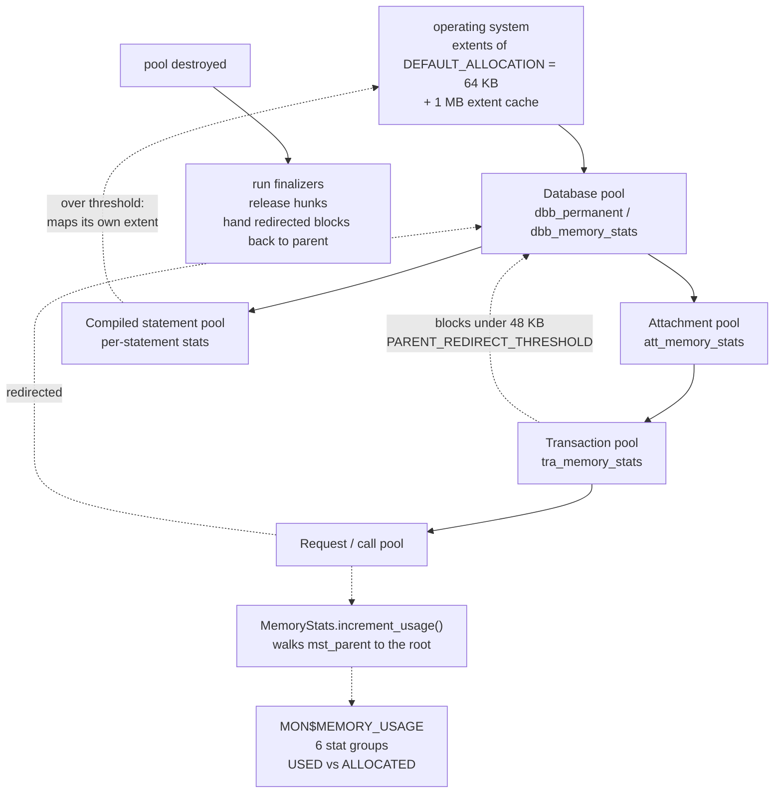

# Memory Management — pools as lifetimes, and the allocator underneath

*A companion to [Conceptual Architecture of Firebird](README.md). Grounded in the vendored [`extern/firebird`](extern/firebird) source (Firebird 6, `master`) and verified against a live Firebird 6 server.*

---

## Table of contents

* [Why memory management deserves its own document](#why-memory-management-deserves-its-own-document)
* [The pool is the lifetime](#the-pool-is-the-lifetime)
* [Three size classes and an extent cache](#three-size-classes-and-an-extent-cache)
* [Parent redirection](#parent-redirection)
* [Six levels of attribution](#six-levels-of-attribution)
* [The context pool and the two storage base classes](#the-context-pool-and-the-two-storage-base-classes)
* [Live demonstrations](#live-demonstrations)
* [Comparison: PostgreSQL, MySQL, SQLite](#comparison-postgresql-mysql-sqlite)
* [Further reading](#further-reading)

---

## Why memory management deserves its own document

`MemoryPool&` appears in the signature of almost every constructor quoted anywhere in this collection. It is in `BaseQualifiedName` in [schemas](schemas-and-name-resolution.md), in `MetadataCache` in [the metadata cache](metadata-cache.md), in `TraceSession` in [trace](trace-and-audit.md), in the `CacheVector`s, in `thread_db`. [The threading document](threading-and-synchronization.md) lists "memory pool" among the things a thread carries and moves on. Thirty-nine documents lean on it; none opens it.

In most C++ codebases that would be fine, because memory management would be an implementation detail. In Firebird it is not a detail, because **the pool hierarchy is a model of the object hierarchy**. Pools are created per database, per attachment, per transaction, per compiled statement, per request — and the reason is not allocation speed. It is that freeing a pool frees everything allocated in it, so the engine can dispose of a whole transaction's or request's memory in one operation, without tracking individual objects and without leaking when an exception unwinds an incomplete structure.

Everything else in this document follows from that one decision: the custom allocator that makes pools cheap, the redirection that keeps child pools from fragmenting the process, and the six-level statistics that make `MON$MEMORY_USAGE` meaningful.

It is also a case of convergent design worth seeing. PostgreSQL made the same decision, independently, at roughly the same time, and called it `MemoryContext`. The comparison at the end is unusually close.

---

## The pool is the lifetime

Pools are created with an explicit parent, in [`alloc.h`](extern/firebird/src/common/classes/alloc.h#L201):

```cpp
static MemoryPool* createPool(MemoryPool* parent = NULL, MemoryStats& stats = *default_stats_group ALLOC_PARAMS);
```

and the engine's own wrapper, [`Database::createPool()`](extern/firebird/src/jrd/Database.cpp#L159), shows the standard pattern — parent is the database's permanent pool, statistics are a fresh group whose parent is the database's:

```cpp
MemoryPool* const pool = MemoryPool::createPool(dbb_permanent, dbb_memory_stats ALLOC_PASS_ARGS);

if (separateStats)
{
    auto stats = FB_NEW_POOL(*pool) MemoryStats(&dbb_memory_stats);
    pool->setStatsGroup(*stats);
}
```

Call sites across the engine create one per major object: `tra.cpp` for transactions, `Statement.cpp` for compiled statements, `cmp.cpp` for compilation, `Attachment.cpp` for attachments, `Relation.cpp` for relations. Destroying that object destroys its pool.

The destruction path is the point of the whole design. [`MemPool::~MemPool()`](extern/firebird/src/common/classes/alloc.cpp#L2014) does not walk a list of live objects:

```cpp
// release big objects
while (bigHunks)
{
    MemBigHunk* hunk = bigHunks;
    bigHunks = hunk->next;
    releaseRaw(pool_destroying, hunk, hunk->length, extentsCache);
}
```

It releases *hunks* — the raw extents the pool obtained from the OS — and every object that lived inside them ceases to exist without anyone visiting it. That is why a rolled-back transaction, an aborted compile or a failed DDL leaves nothing behind: none of their allocations are individually tracked, and none of them need to be.

The obvious cost is that **destructors do not run**. Firebird's answer is opt-in: an object that genuinely needs cleanup registers a finalizer, and [`MemoryPool::deletePool()`](extern/firebird/src/common/classes/alloc.cpp#L2777) runs those first:

```cpp
while (pool->finalizers)
{
    auto finalizer = pool->finalizers;
    ...
    finalizer->finalize();
}

MemPool::deletePool(pool->pool);
```

So the rule is: pool memory is reclaimed in bulk, and the small minority of objects that own something outside the pool — a file handle, a lock, a shared-memory mapping — say so explicitly. This is the same bargain PostgreSQL strikes with `palloc` and context reset callbacks.

---

## Three size classes and an extent cache

Underneath the pools is a hand-written allocator, about 3,000 lines in [`alloc.cpp`](extern/firebird/src/common/classes/alloc.cpp). It sorts every request into one of three classes, each with its own hunk type:

| Class | Hunk | Served from |
|---|---|---|
| Small | [`MemSmallHunk`](extern/firebird/src/common/classes/alloc.cpp#L539) | slot-indexed free lists (`lowLimits`, tiny slots) |
| Medium | [`MemMediumHunk`](extern/firebird/src/common/classes/alloc.cpp#L578) | 36 size slots up to 64512 bytes (`mediumLimits`) |
| Big | [`MemBigHunk`](extern/firebird/src/common/classes/alloc.cpp#L650) | its own mapping, one hunk per allocation |

Extents come from the OS in units of [`DEFAULT_ALLOCATION`](extern/firebird/src/common/classes/alloc.cpp#L143):

```cpp
constexpr size_t DEFAULT_ALLOCATION = 65536;
```

64 KB, with a small cache of recently freed extents (`MAP_CACHE_SIZE = 16`, one megabyte) so that a pool churning through extents does not hammer `mmap`/`munmap`. This constant is directly observable in `MON$MEMORY_USAGE`, as the live section shows.

The size-class dispatch is the body of [`MemPool::allocateInternal2()`](extern/firebird/src/common/classes/alloc.cpp#L2171): try the small free lists, then consider redirection to the parent, then the medium slots, and finally fall through to a dedicated big hunk. That middle step is the interesting one.

---

## Parent redirection

Here is the branch, at [`alloc.cpp`](extern/firebird/src/common/classes/alloc.cpp#L2187):

```cpp
if (parent_redirect && flagRedirect && length < PARENT_REDIRECT_THRESHOLD)
{
    guard.leave();
    block = parent->allocateInternal(from, length, false);
    guard.enter();

    if (block)
    {
        if (parent_redirect)    // someone else redirected block in this pool?
        {
            block->setRedirect();

            parentRedirected.push(block);
            if (parentRedirected.getCount() == parentRedirected.getCapacity())
                parent_redirect = false;

            return block;
        }
        ...
```

with the threshold at [48 KB](extern/firebird/src/common/classes/alloc.cpp#L1376):

```cpp
constexpr size_t PARENT_REDIRECT_THRESHOLD = 48 * 1024;
```

A medium-sized allocation in a child pool is satisfied out of the **parent's** extents rather than by mapping a fresh extent for the child. The child remembers the block in `parentRedirected` so it can hand it all back when it dies, and once that tracking vector fills, redirection switches off and the child starts managing its own medium hunks.

The motivation is the shape of Firebird's pool tree. A busy database has many short-lived children — a pool per transaction, per request, per compiled statement — and most of them allocate modestly. If each mapped its own 64 KB extent on first use, a thousand concurrent short-lived pools would pin 64 MB of largely empty extents and fragment the address space. Redirection means the common case costs nothing beyond bookkeeping: the child borrows from the parent's already-warm extents and returns the blocks in bulk at destruction.

This has a striking consequence that makes the mechanism visible from SQL, and it is the finding this document's live section leads with: **a child pool that never exceeds the threshold never maps any memory of its own**, so its reported *allocated* figure stays at zero while its *used* figure is real.

---

## Six levels of attribution

Two counters per pool, defined in [`MemoryStats`](extern/firebird/src/common/classes/alloc.h#L82):

```cpp
// Currently allocated memory (without allocator overhead)
// Useful for monitoring engine memory leaks
AtomicCounter mst_usage;
// Amount of memory mapped (including all overheads)
// Useful for monitoring OS memory consumption
AtomicCounter mst_mapped;
```

`mst_usage` is what callers asked for; `mst_mapped` is what the process actually took from the OS. The gap between them is allocator overhead and internal fragmentation, and both surface in `MON$MEMORY_USAGE` as `MON$MEMORY_USED` and `MON$MEMORY_ALLOCATED`.

The nesting comes from [`increment_usage()`](extern/firebird/src/common/classes/alloc.h#L117), which walks the statistics parent chain:

```cpp
void increment_usage(size_t size) noexcept
{
    for (MemoryStats* statistics = this; statistics; statistics = statistics->mst_parent)
    {
        const size_t temp = statistics->mst_usage.exchangeAdd(size) + size;
        if (temp > statistics->mst_max_usage)
            statistics->mst_max_usage = temp;
    }
}
```

Every allocation increments its own group *and every ancestor*, so a byte allocated in a request pool is counted in the request, the transaction, the attachment and the database. The maxima are updated without synchronization, and the source says why in a comment that is refreshingly direct: *"We don't particularily care about extreme precision of these max values."*

The engine hangs one `MemoryStats` on each level of its own hierarchy — [`dbb_memory_stats`](extern/firebird/src/jrd/Database.h#L432), [`att_memory_stats`](extern/firebird/src/jrd/Attachment.h#L512), [`tra_memory_stats`](extern/firebird/src/jrd/tra.h#L275), plus per-statement groups — and [`Monitoring.cpp`](extern/firebird/src/jrd/Monitoring.cpp#L1044) publishes them under the six group codes from [`constants.h`](extern/firebird/src/jrd/constants.h#L305):

```cpp
stat_database = 0,
stat_attachment = 1,
stat_transaction = 2,
stat_statement = 3,
stat_call = 4,
stat_cmp_statement = 5
```

This is the same four-simultaneous-pointers idea the [threading document](threading-and-synchronization.md) describes for `thread_db`'s runtime statistics, applied to memory: one allocation, several counters, no aggregation pass.

---

## The context pool and the two storage base classes

Not every allocation can name its pool. Firebird's answer is a thread-local *current* pool plus an RAII holder, [`ContextPoolHolder`](extern/firebird/src/common/classes/alloc.h#L329):

```cpp
explicit ContextPoolHolder(MemoryPool* newPool)
{
    savedPool = MemoryPool::setContextPool(newPool);
}
~ContextPoolHolder()
{
    MemoryPool::setContextPool(savedPool);
}
```

Entering a scope switches the pool that `FB_NEW` and `getDefaultMemoryPool()` resolve to; leaving it restores the previous one. `Jrd::ContextPoolHolder` is the engine-side variant that also swaps the pool on `tdbb`, which is why so much engine code can allocate correctly without threading a pool parameter through every call.

The two base classes in [`alloc.h`](extern/firebird/src/common/classes/alloc.h#L430) encode the discipline around that:

```cpp
// Permanent storage is used as base class for all objects,
// performing memory allocation in methods other than
// constructors of this objects. Permanent means that pool,
// which will be later used for such allocations, must
// be explicitly passed in all constructors of such object.
class PermanentStorage
```

```cpp
// Automatic storage is used as base class for objects,
// that may have constructors without explicit MemoryPool
// parameter. ... To ensure this operation to be safe
// such trick possible only for local (on stack) variables.
class AutoStorage : public PermanentStorage
```

`PermanentStorage` demands an explicit pool because it will outlive the current scope. [`AutoStorage`](extern/firebird/src/common/classes/alloc.h#L447) takes the context pool implicitly — and because that is only safe for stack objects, debug builds verify it:

```cpp
AutoStorage()
    : PermanentStorage(getAutoMemoryPool())
{
#if defined(DEV_BUILD)
    ProbeStack();
#endif
}
```

`ProbeStack()` checks that `this` really is on the stack. A convention that could have been a comment is instead an assertion, in the one place where getting it wrong would produce a dangling pool reference that outlives its scope.



*Figure 1: Pools mirror the object hierarchy. Allocations flow down to the parent's extents; statistics flow up to the root; destruction is bulk.*

---

## Live demonstrations

Captured against a running Firebird 6 server (`LI-T6.0.0.2076`, engine 6.0.0, `ServerMode` default `Super`).

### The hierarchy, and the redirection signature

One query over `MON$MEMORY_USAGE`, grouped by level:

```sql
SELECT MON$STAT_GROUP AS GRP,
       COUNT(*) AS POOLS,
       SUM(MON$MEMORY_USED) AS SUM_USED,
       SUM(MON$MEMORY_ALLOCATED) AS SUM_ALLOC,
       COUNT(NULLIF(MON$MEMORY_ALLOCATED,0)) AS POOLS_WITH_OWN_EXTENTS
  FROM MON$MEMORY_USAGE GROUP BY 1 ORDER BY 1;
```

| GRP | Level | POOLS | SUM_USED | SUM_ALLOC | POOLS_WITH_OWN_EXTENTS |
|---|---|---|---|---|---|
| 0 | database | 1 | 19,763,824 | 20,680,704 | 1 |
| 1 | attachment | 3 | 225,328 | **0** | **0** |
| 2 | transaction | 2 | 110,464 | **0** | **0** |
| 3 | statement | 1 | 20,976 | **0** | **0** |
| 5 | cmp_statement | 1 | 34,800 | 65,536 | 1 |

Read the two right-hand columns together. Every attachment, transaction and statement pool reports real *used* memory and **zero** *allocated* memory — not one of them has mapped a single byte from the operating system. That is `PARENT_REDIRECT_THRESHOLD` made visible: their allocations all fell under 48 KB, so every block came out of the database pool's extents, and `mst_mapped` never incremented for them.

The one child pool that did map memory is the compiled-statement pool at group 5, and it mapped **exactly 65,536 bytes** — one `DEFAULT_ALLOCATION` extent, the constant from `alloc.cpp` observable from SQL.

At the database level the gap between the two counters is the allocator's overhead: 20,680,704 mapped against 19,763,824 requested, about 4.6%.

### Statistics really are nested

The database row is not a separate accounting of database-level objects — it is the root of the roll-up in `increment_usage()`. Its 19.7 MB includes the attachment, transaction and statement figures above it in the table, which is why summing the groups would double-count. This is worth stating because the column name invites the opposite reading.

### Where sort memory does *not* appear

A negative result worth recording, because it took a failed experiment to find. Running a large sort (300,000 rows, `ORDER BY` on a 200-byte column) in one attachment and watching that attachment's `MON$MEMORY_USED` from another connection shows almost no movement — the figure stayed in the 29–82 KB band throughout:

```
=== worker idle ===             GRP 1  USED 29536   ALLOC 0
=== worker running a big sort === GRP 1  USED 29376   ALLOC 0
```

Sort workspace does not come from the attachment pool. It is managed by `sort.cpp` and `TempSpace`, which allocate their own buffers and spill to scratch files — the subject of [sorting and temporary space](sorting-and-temp-space.md), where a 448 MB invisible scratch file is captured. So `MON$MEMORY_USAGE` is an accurate picture of *pool* memory and a misleading one of total server memory: the two largest consumers in a real workload, the page cache and sort space, are accounted elsewhere.

---

## Comparison: PostgreSQL, MySQL, SQLite

| | **Firebird** | **PostgreSQL** | **MySQL / InnoDB** | **SQLite** |
|---|---|---|---|---|
| **Unit** | `MemoryPool`, hierarchical with explicit parent | `MemoryContext`, hierarchical with explicit parent | `MEM_ROOT` arenas per THD/statement; per-component allocators | Single heap via `sqlite3_mem_methods` |
| **Allocation call** | `FB_NEW_POOL(pool)` / context pool | `palloc()` into `CurrentMemoryContext` | `alloc_root()` | `sqlite3_malloc()` |
| **Bulk free** | `deletePool()` — releases hunks | `MemoryContextReset()` / `Delete()` | `free_root()` | None — per-object `sqlite3_free()` |
| **Destructors** | Opt-in `Finalizer` registration | Reset/delete callbacks; `palloc` is POD-oriented | — | — |
| **Underlying allocator** | Own arena: 3 size classes, 64 KB extents, extent cache | Own: `aset.c` blocks and chunks, power-of-two freelists | System allocator / jemalloc, plus arenas | Pluggable; default system malloc |
| **Attribution** | `MON$MEMORY_USAGE`, 6 nested levels | `pg_backend_memory_contexts` (PG 14+), `MemoryContextStats()` | `performance_schema` memory instruments | `sqlite3_status()` counters |
| **Cross-request sharing** | Parent redirection of medium blocks | None — contexts own their blocks | — | — |

The genuine peer is **PostgreSQL**, and the convergence is the interesting part. Two engines of the same generation independently concluded that a database server should not use `malloc`/`free` directly, for the same reason: query execution has a natural lifetime, and tying memory to that lifetime turns a class of leaks and cleanup bugs into a non-problem. `palloc` into `CurrentMemoryContext` and `FB_NEW` into the context pool are the same idea with different spelling, down to the thread/backend-local "current" context and the RAII-or-`PG_TRY` discipline for restoring it.

Where they differ is instructive. PostgreSQL contexts each own their blocks outright; Firebird adds parent redirection so that a short-lived child never maps its own extent, which matters more for Firebird because its pool tree is deeper and busier (a pool per compiled statement and per request, not just per query). PostgreSQL, on the other hand, has richer introspection at the context level — `pg_backend_memory_contexts` names individual contexts, whereas `MON$MEMORY_USAGE` reports six fixed levels.

**MySQL**'s `MEM_ROOT` is the same arena-with-bulk-free pattern applied more narrowly — per statement and per connection, alongside components that simply use the system allocator. **SQLite** is the deliberate opposite: one pluggable allocator, per-object frees, and no hierarchy at all, which is the right answer when the whole library must run in an embedded environment with a fixed memory budget and no server-side lifetimes to model.

Firebird's distinguishing choice, stated plainly: **it is the only one of the four where a child allocator routinely satisfies requests out of its parent's extents rather than its own** — visible from SQL as a pool that reports real usage and zero allocation.

---

## Hands-on: samples, tests and debugging

### C++ sample — [`samples/cpp/memory_pools.cpp`](samples/cpp/memory_pools.cpp)

The [live demonstrations](#live-demonstrations) as one program: the six-group summary with the redirection signature, one connection's own database → attachment → transaction chain, and a transaction pool growing and dying in real time. The growth phase is an uncommitted 3000-row `UPDATE` watched from a *second* attachment — necessarily, because a `MON$` snapshot is frozen per transaction, so a pool cannot watch itself change.

```sh
cmake -B build samples && cmake --build build
./build/memory_pools        # default: inet://localhost//tmp/fbhandson/memory_pools.fdb
```

Verified output:

```text
-- per-level summary (note used > 0 with allocated = 0: parent redirection)
MON$STAT_GROUP COUNT SUM      SUM      COUNT
-------------- ----- -------- -------- -----
0              1     22569840 28086272 1
1              4     285824   0        0
2              2     110464   0        0
3              1     20976    0        0
5              1     34800    65536    1

-- worker's pool chain (before the update)
  database pool:           used=22683488   allocated=28413952
  worker attachment pool:  used=71216      allocated=0
  worker transaction pool: used=13520      allocated=0

-- after an uncommitted 3000-row UPDATE in that transaction
  worker attachment pool:  used=78464      allocated=0
  worker transaction pool: used=20768      allocated=0

-- after rollback (transaction pool destroyed with its undo log)
  worker attachment pool:  used=57696      allocated=0
```

Three of this document's claims, measured. Every group-1/2/3 pool shows `allocated = 0` — [parent redirection](#parent-redirection) live — while the one `cmp_statement` pool that crossed the threshold mapped exactly **65 536** bytes, one `DEFAULT_ALLOCATION` extent. The rollback line is the [bulk-free design](#the-pool-is-the-lifetime) *and* the [nested statistics](#six-levels-of-attribution) in a single subtraction: the attachment's `used` fell from 78 464 to 57 696 — by **20 768 bytes, exactly the dead transaction pool's total** — because `increment_usage()` had counted every transaction-pool byte in the attachment group too. And a negative result echoing [where sort memory does not appear](#where-sort-memory-does-not-appear): 3000 old record versions grew the transaction pool by only ~7 KB, because undo *bookkeeping* lives in the pool while the undo record *data* rides in `TempSpace`-backed buffers accounted elsewhere.

### fb-cpp sample — [`samples/fb-cpp/memory_pools.cpp`](samples/fb-cpp/memory_pools.cpp)

The same walk through [fb-cpp](https://github.com/asfernandes/fb-cpp) (vendored at [`extern/fb-cpp`](extern/fb-cpp)), the modern C++20 wrapper over the OO API. Where the OO-API version splices attachment and transaction ids into the SQL text, fb-cpp binds them as typed parameters — a `std::tuple` against the `?` placeholders — and each usage row lands directly in a struct via `queryFirstRowAs<PoolUsage>()`. One cursor idiom is worth learning from this sample: fb-cpp's `Statement::execute()` already fetches a SELECT's first row (its return value says whether one arrived), so row loops are written `for (bool more = stmt.execute(t); more; more = stmt.fetchNext())` — the `execute` + `while (fetchNext())` shape silently drops the first row, and this sample's first version lost the group-0 summary line exactly that way.

```sh
cmake -B build samples && cmake --build build   # needs libboost-dev + libboost-filesystem-dev
./build/fbcpp_memory_pools
```

Verified: the redirection signature holds — every group-1/2/3 pool shows `allocated = 0` while the one `cmp_statement` pool that crossed the threshold mapped exactly 65 536 bytes — and the rollback subtraction repeats with this run's numbers: the worker attachment's `used` fell from 78 880 to 58 112, by 20 768 bytes, exactly the dead transaction pool's total.

### JavaScript sample — [`samples/nodejs/memory_pools.js`](samples/nodejs/memory_pools.js)

The same walk from node-firebird (`cd samples/nodejs && node memory_pools.js`), which computes the roll-up arithmetic itself:

```text
-- after rollback (whole transaction pool freed at once)
  worker attachment pool:  used=57904      allocated=0
  attachment used fell by 20848; the dead transaction pool held 20848 — the nested roll-up, live
```

Exact to the byte, on an independent run with its own database.

### Things to try

- Prepare (without executing) twenty distinct statements on one connection and re-run the group summary: group 5 (`cmp_statement`) pools multiply, and each that grows past ~48 KB maps its own 64 KB extent — `PARENT_REDIRECT_THRESHOLD` found empirically.
- Replace the 3000-row UPDATE with `UPDATE` + `SAVEPOINT` + another `UPDATE` of the same rows: the transaction pool grows more per row, since each savepoint level keeps its own undo.
- Run the [threading sample](threading-and-synchronization.md)'s twelve attachments first, then the group summary here: group 1 grows to thirteen pools — every one at `allocated = 0`.
- Watch the database pool's `used`/`allocated` gap (~4–20 % in the runs above): allocator overhead plus extents kept in the free lists and the 1 MB extent cache.

### Debugging this in C++ (gdb)

Under an embedded run ([debugging guide](debugging-firebird.md)) the allocator itself is steppable:

```gdb
break MemoryPool::createPool      # common/classes/alloc.cpp:2127 — every pool's birth; caller = which object
break Database::createPool        # jrd/Database.cpp:159 — the engine wrapper adding the stats group
break MemPool::allocateInternal2  # common/classes/alloc.cpp:2171 — the size-class dispatch + redirection branch
break MemPool::~MemPool           # common/classes/alloc.cpp:2014 — bulk release of hunks, no object walk
break MemoryPool::deletePool      # common/classes/alloc.cpp:2777 — finalizers first, then the pool
```

`MemoryPool::createPool`'s backtraces reproduce the hierarchy empirically — hits from `TRA_start`, `DsqlStatement`/`Statement` machinery and attachment setup are the pool-per-object claim as call stacks. In `allocateInternal2`, watch the `parent_redirect && flagRedirect && length < PARENT_REDIRECT_THRESHOLD` branch: for a transaction-pool allocation it forwards to the parent — set a condition `length > 49152` to catch the first allocation that forces a child to map its own extent instead. Breaking on `~MemPool` during the sample's rollback shows the whole undo log vanishing in a loop over `bigHunks`/extents with not one record visited — the destruction path that makes rollback cleanup O(extents), not O(objects).

---

## Further reading

- [`src/common/classes/alloc.h`](https://github.com/FirebirdSQL/firebird/blob/master/src/common/classes/alloc.h) — `MemoryPool`, `MemoryStats`, `ContextPoolHolder`, `PermanentStorage` / `AutoStorage` and the `FB_NEW*` macros.
- [`src/common/classes/alloc.cpp`](https://github.com/FirebirdSQL/firebird/blob/master/src/common/classes/alloc.cpp) — the allocator: size classes, `DEFAULT_ALLOCATION`, `PARENT_REDIRECT_THRESHOLD`, and the pool destructor.
- [`src/jrd/Database.cpp`](https://github.com/FirebirdSQL/firebird/blob/master/src/jrd/Database.cpp) — `Database::createPool()`, the standard parent-and-stats pattern.
- [`src/jrd/Monitoring.cpp`](https://github.com/FirebirdSQL/firebird/blob/master/src/jrd/Monitoring.cpp) — `putMemoryUsage()` and the six stat groups behind `MON$MEMORY_USAGE`.
- [PostgreSQL: memory context internals](https://github.com/postgres/postgres/blob/master/src/backend/utils/mmgr/README) · [`pg_backend_memory_contexts`](https://www.postgresql.org/docs/current/view-pg-backend-memory-contexts.html)
- [MySQL: `MEM_ROOT` and memory instrumentation](https://dev.mysql.com/doc/refman/8.4/en/performance-schema-memory-summary-tables.html)
- [SQLite: memory allocation](https://www.sqlite.org/malloc.html)

---

*Companion documents: [Threading and Synchronization](threading-and-synchronization.md) · [Monitoring and Performance Tuning](monitoring-and-tuning.md) · [Sorting and Temporary Space](sorting-and-temp-space.md) · [The Metadata Cache](metadata-cache.md) · [The Page Cache and Cross-Process Coherency](page-cache-coherency.md) · [Reading Guide](READING-GUIDE.md)*
