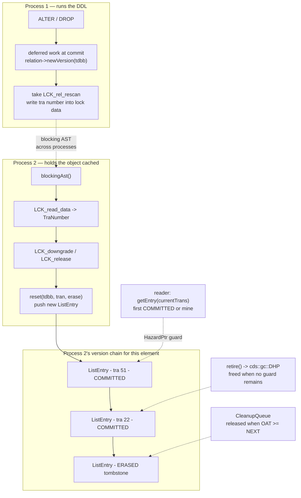

# The Metadata Cache — versioned objects, hazard pointers, and an invalidation that crosses processes

*A companion to [Conceptual Architecture of Firebird](README.md). Grounded in the vendored [`extern/firebird`](extern/firebird) source (Firebird 6, `master`) and verified against a live Firebird 6 server.*

---

## Table of contents

* [Why the metadata cache deserves its own document](#why-the-metadata-cache-deserves-its-own-document)
* [What is cached](#what-is-cached)
* [A cached object is a chain of versions](#a-cached-object-is-a-chain-of-versions)
* [The visibility rule, and what it deliberately is not](#the-visibility-rule-and-what-it-deliberately-is-not)
* [Reclamation: hazard pointers and the OAT barrier](#reclamation-hazard-pointers-and-the-oat-barrier)
* [Invalidation across processes](#invalidation-across-processes)
* [Formats: the on-disk half of the same idea](#formats-the-on-disk-half-of-the-same-idea)
* [Live demonstrations](#live-demonstrations)
* [Comparison: PostgreSQL, MySQL, SQLite](#comparison-postgresql-mysql-sqlite)
* [Further reading](#further-reading)

---

## Why the metadata cache deserves its own document

Six documents in this collection carry fifty-six references to `MET_*`, "metadata cache" or "deferred work", and none of them opens the subsystem. The closest coverage is two *hops* in [the request trace](request-lifecycle-code-trace.md) — `Stage 7: EXE and the DDL path into MET` and `Stage 9: commit — deferred work` — which describe passing through, not what is being passed through.

It also sits on a hand-off that several documents leave dangling. [Catalog bootstrap](catalog-bootstrap.md) explains how the engine reads `RDB$RELATIONS` before it knows that table's format, then hands the result to a cache it never describes. [Schemas and name resolution](schemas-and-name-resolution.md) resolves every unqualified name in the engine without saying what the resolved name points *at*. [Page cache coherency](page-cache-coherency.md) solves cross-process coherency for data pages and notes that metadata has its own answer. This document is that answer.

The reason it is worth reading, though, is a specific piece of engineering. Every database with a server-side cache of catalog objects faces the same question: **what happens to a cached table definition when someone else changes it?** The obvious answers are to lock the object so nobody can change it while it is in use (MySQL), or to invalidate the cache at transaction boundaries and make catalog reads snapshot-consistent (PostgreSQL). Firebird does neither. It **versions the cache** — the same multi-generational shape it uses for records on disk — and reclaims the dead versions with lock-free hazard pointers borrowed from an external concurrent-data-structures library.

The shape is borrowed. The visibility rule, as the live demonstrations below show, is deliberately *not*, and understanding why is understanding the subsystem.

---

## What is cached

Seven object families, declared as typedefs in [`Resources.h`](extern/firebird/src/jrd/Resources.h#L51):

```cpp
typedef CacheElement<jrd_rel, RelationPermanent>    Relation;
typedef CacheElement<jrd_prc, RoutinePermanent>     Procedure;
typedef CacheElement<CharSetVers, CharSetContainer> CharSet;
typedef CacheElement<Function, RoutinePermanent>    Function;
typedef CacheElement<DbTriggers, DbTriggersHeader>  Triggers;
typedef CacheElement<IndexVersion, IndexPermanent>  Index;
typedef CacheElement<Package, PackagePermanent>     Package;
```

The `CacheElement<V, P>` split is the first thing to notice: every cached object has a **`Versioned`** part and a **`Permanent`** part. The permanent part — the relation's identity, its id, its lock — exists once and lives as long as the object does. The versioned part — the format, the field list, the compiled triggers — is what DDL replaces, and it is what gets a version chain.

These live in the [`MetadataCache`](extern/firebird/src/jrd/met.h#L229), one per database, as a `CacheVector` per family:

```cpp
CacheVector<Cached::Relation>   mdc_relations;
CacheVector<Cached::Procedure>  mdc_procedures;
CacheVector<Cached::Function>   mdc_functions;
CacheVector<Cached::CharSet>    mdc_charsets;
CacheVector<Cached::Package>    mdc_packages;
```

A `CacheVector` is indexed by `MetaId` — the object's catalog id — which is why relation ids matter so much in this engine and why they are allocated append-only, the theme [the reading guide](READING-GUIDE.md#ideas-that-recur-across-the-collection) draws out of `lck_t` series, BLR opcodes and system relation ids. The cache is an array subscripted by the very ids the catalog hands out.

---

## A cached object is a chain of versions

Each element points at a linked list of [`ListEntry`](extern/firebird/src/jrd/CacheVector.h#L161) nodes:

```cpp
template <class Versioned>
class ListEntry : public HazardObject
{
public:
    enum State { INITIAL, RELOAD, MISSING, SCANNING, READY };

    ListEntry(Versioned* object, TraNumber traNumber, ObjectBase::Flag fl, ListEntry* link = nullptr)
```

Three fields carry the whole idea: a pointer to the versioned object, the **transaction number** that created this version, and a flag word. New versions are pushed at the head and link to the previous one, so walking `next` walks backwards in time — structurally identical to walking a record's back-version chain in [the on-disk structure](on-disk-structure.md).

The flags are in [`CacheFlag`](extern/firebird/src/jrd/CacheVector.h#L111), and two of them do most of the work:

```cpp
static constexpr ObjectBase::Flag COMMITTED = 0x001;  // version already committed
static constexpr ObjectBase::Flag ERASED    = 0x002;  // object erased / return erased objects
...
static constexpr ObjectBase::Flag RETIRED   = 0x040;  // object is in a process of GC
```

`ERASED` is a **tombstone**: a `DROP` does not remove the element, it pushes a version whose object pointer is null and whose flag says "gone". That is exactly how a deleted record works in the multi-generational model — the delete is a new version, not an erasure — and it is what lets a concurrent transaction keep using an object another transaction has dropped. `RETIRED` names the state in the vocabulary of garbage collection, because that is what this is.

---

## The visibility rule, and what it deliberately is not

Here is the whole rule, from [`ListEntry::getEntry()`](extern/firebird/src/jrd/CacheVector.h#L216):

```cpp
for (; listEntry; listEntry.set(listEntry->next))
{
    ObjectBase::Flag f(listEntry->getFlags());

    if ((f & CacheFlag::COMMITTED) ||
            // committed (i.e. confirmed) objects are freely available
        (listEntry->traNumber == currentTrans))
            // transaction that created an object can always access it
    {
        if (f & CacheFlag::ERASED)
        {
            // object does not exist
            ...
            return HazardPtr<ListEntry>(nullptr);        // object dropped
        }
        ...
        return listEntry;
    }
}

return HazardPtr<ListEntry>(nullptr);    // object created (not by us) and not committed yet
```

Read it carefully, because it is easy to over-read. Walking from newest to oldest, the loop returns the first version that is **either committed or created by me**, and skips versions belonging to other transactions that have not committed.

What it does *not* do is compare `traNumber` against the caller's snapshot. A version committed by a transaction that started *after* the caller is still `COMMITTED`, so it is still the first match, and the caller gets it. This is **read-committed semantics for metadata** — not the snapshot isolation that the same engine gives to records.

That distinction is the single most important fact about this subsystem, and the live demonstrations below prove it in both directions: an uncommitted `ALTER` is invisible to another connection and visible to its own, and a committed `ALTER` becomes visible immediately to a statement prepared inside an *older, still-open* snapshot transaction.

So the version chain is not there to give transactions a stable view of the schema. It is there for two narrower jobs:

1. **Isolating uncommitted DDL.** Your own `ALTER` must be visible to you and to nobody else, and must vanish cleanly on rollback. A version stamped with your transaction number does exactly that.
2. **Keeping old versions alive while they are still in use.** A request compiled against the old shape of a table may still be executing. The old version must not be freed underneath it — which is the next section.

Firebird made the schema read-committed on purpose: it is the choice that lets DDL proceed without blocking readers, at the cost of a long-running transaction not having a stable schema. MySQL makes the opposite trade with metadata locks, and PostgreSQL a third with genuinely MVCC catalogs. That is the comparison at the end.

---

## Reclamation: hazard pointers and the OAT barrier

If readers never take a lock — and they do not; `getEntry()` walks an atomic linked list — then freeing a version is the hard part. Firebird solves it twice over, at two different timescales.

**At the instruction timescale, hazard pointers.** [`HazardPtr.h`](extern/firebird/src/jrd/HazardPtr.h#L63) is a thin wrapper over the Dynamic Hazard Pointer collector from **libcds**, the Concurrent Data Structures library, which Firebird vendors in `extern/libcds` and builds as part of its own build ([`Makefile.in`](extern/firebird/builds/posix/Makefile.in#L341)):

```cpp
template <typename T>
class HazardPtr : private cds::gc::DHP::Guard
```

A reader holding a `HazardPtr<ListEntry>` has published "I am looking at this pointer." A writer that replaces a version calls [`HazardObject::retire()`](extern/firebird/src/jrd/HazardPtr.h#L44):

```cpp
cds::gc::DHP::retire<Disposer>(this);
```

which does not free anything — it hands the object to the collector, which deletes it only once no guard protects it. This is why the metadata cache can be read on the hottest path in the engine without a latch, and it is worth pausing on: the [threading document](threading-and-synchronization.md)'s latch-versus-lock table has two columns, and this is neither. It is a third thing, and it arrived in a forty-year-old codebase by way of an external C++ library.

**At the transaction timescale, the oldest-active barrier.** Hazard pointers protect a pointer being dereferenced right now. They say nothing about a compiled request that will touch the old version again in a minute. For that, [`MetadataCache`](extern/firebird/src/jrd/met.h#L249) keeps a queue, and the comment above it states the rule:

```cpp
// Objects are placed here after DROP OBJECT and wait for current OAT >= NEXT when DDL committed
void objectCleanup(TraNumber traNum, ElementBase* toClean);
```

**OAT** is the Oldest Active Transaction. A dropped object is not destroyed when the DDL commits; it is enqueued, and released only once the oldest active transaction in the database has advanced past the DDL's transaction — at which point no transaction can still be running a request compiled against it. [`TransactionNumber::oldestActive()`](extern/firebird/src/jrd/CacheVector.cpp#L49) is a straight read of `dbb_oldest_active`, the same database-header counter that governs record-version garbage collection in [garbage collection and sweep](garbage-collection-and-sweep.md).

So the same barrier that decides when a dead record version may be reclaimed decides when a dead *table definition* may be reclaimed. One idea, two subsystems — the pattern the [lock manager](lock-manager.md) document names as Firebird's habit of building one general mechanism and reusing it everywhere.

The [`CleanupQueue`](extern/firebird/src/jrd/met.h#L586) itself carries a nice piece of honesty about lock-free reasoning:

```cpp
// We check transaction number w/o lock - that's OK here cause even in
// hardly imaginable case when correctly aligned memory read is not de-facto atomic
// the worst result we get is skipped check (will be corrected by next transaction)
// or taken extra lock for precise check. Not tragical.
```

---

## Invalidation across processes

Everything so far is within one process. Under [`Classic`](threading-and-synchronization.md) each attachment is its own process with its own `MetadataCache`, and a `DROP TABLE` in one must reach all of them. The mechanism is the [lock manager](lock-manager.md), used in a way that will be familiar from [page cache coherency](page-cache-coherency.md).

Every cache element owns a lock, created in `ElementBase`'s constructor with a lock type supplied by the family. Each `Versioned` class declares its own series — [`Relation.h`](extern/firebird/src/jrd/Relation.h#L681) is the template:

```cpp
static const enum lck_t LOCKTYPE = LCK_rel_rescan;
```

The six `*_rescan` series in [`lck.h`](extern/firebird/src/jrd/lck.h#L66) — `LCK_rel_rescan`, `LCK_idx_rescan`, `LCK_prc_rescan`, `LCK_fun_rescan`, `LCK_cs_rescan`, `LCK_package_rescan` — are exactly one per cached family, and the lock-manager document's tour of the thirty-six series names them without saying what pulls them. This does.

The interesting part is the blocking AST, in [`CacheVector.cpp`](extern/firebird/src/jrd/CacheVector.cpp#L122):

```cpp
int ElementBase::blockingAst(void* ast_object)
{
    ElementBase* const cacheElement = static_cast<ElementBase*>(ast_object);
    ...
        TraNumber tran = LCK_read_data(tdbb, cacheElement->lock);
        fb_assert(tran);

        LCK_downgrade(tdbb, cacheElement->lock);
        const bool erase = (cacheElement->lock->lck_physical < LCK_SR);
        if (!erase)
        {
            LCK_release(tdbb, cacheElement->lock);
            cacheElement->locked = false;
        }

        cacheElement->reset(tdbb, tran, erase);
    ...
}
```

The protocol is the same flush-and-downgrade shape the page cache uses, with a different payload. Another process commits DDL and takes the object's lock; our AST fires asynchronously; we read **the DDL's transaction number out of the lock's data word** with `LCK_read_data`; we downgrade or release; and then `reset(tdbb, tran, erase)` pushes a new entry onto our local version chain stamped with that transaction.

That last step is what makes the design coherent. A remote DDL does not flush our cache — it *appends a version to it*, carrying the transaction number that lets the visibility rule above do the rest. The lock's data word is the entire cross-process payload: one transaction number, and everything else is reconstructed locally by re-reading the catalog.



*Figure 1: A DDL in one process becomes a new version in another's chain. The lock carries one transaction number; the receiving process rebuilds everything else locally.*

---

## Formats: the on-disk half of the same idea

The in-memory version chain has a persistent counterpart, and they are easy to confuse. Every relation keeps a set of **record formats** — `rel_formats` on the relation, catalogued in `RDB$FORMATS` — and each stored record carries the number of the format it was written under.

This is why `ALTER TABLE ... ADD` is nearly instantaneous on a large table in Firebird: it does not rewrite a single row. It appends a new format, bumps the relation's current format number, and leaves every existing record physically untouched under its old format. Records are converted to the current format lazily, on read, which is why a row written before a column existed comes back with `NULL` in it.

The two versionings answer different questions and both are needed: the in-memory chain answers *which definition should this transaction compile against*, and the on-disk format number answers *how do I decode these bytes*. The live demonstration below shows three formats in use simultaneously in one small table.

---

## Live demonstrations

Captured against a running Firebird 6 server (`LI-T6.0.0.2076`, engine 6.0.0, `ServerMode` default `Super`), using a scratch database.

### Three formats, live at once

A table altered twice, with a row inserted under each shape:

```sql
CREATE TABLE T (A INT);              INSERT INTO T VALUES (1);
ALTER TABLE T ADD B INT;             INSERT INTO T VALUES (2,2);
ALTER TABLE T ADD C INT;             INSERT INTO T VALUES (3,3,3);
```

`gstat` reports the physical truth:

```
$ gstat localhost:/tmp/mdc.fdb -r -t T -u SYSDBA -p masterkey

"PUBLIC"."T" (128)
    Primary pointer page: 290, Index root page: 291
    Total formats: 3, used formats: 3
    Average record length: 12.33, total records: 3
```

**Three formats, all three in use** — the three rows are physically stored under three different layouts in the same table, on the same data page. Reading them converts on the fly:

```
           A            B            C
============ ============ ============
           1       <null>       <null>
           2            2       <null>
           3            3            3
```

Note also `"PUBLIC"."T" (128)` — `gstat` prints the [schema-qualified](schemas-and-name-resolution.md) name and the relation id `128`, which is the `MetaId` this object occupies in `mdc_relations`. That id reappears below.

### Uncommitted DDL is visible to its creator and to nobody else

This is the `(f & CacheFlag::COMMITTED) || (traNumber == currentTrans)` test, exercised from both sides. Session A runs an `ALTER` with `AUTODDL OFF` and does **not** commit:

```
A> SET AUTODDL OFF;
A> ALTER TABLE T ADD E INT;
A> SELECT E FROM T ROWS 1;
A_SEES_OWN_UNCOMMITTED   <null>
```

A sees its own new column — the second half of the disjunction, `traNumber == currentTrans`. Meanwhile, on a separate connection, with A's DDL still uncommitted:

```
B> SELECT E FROM T ROWS 1;
Statement failed, SQLSTATE = 42S22
-Column unknown
-"E"
```

B walks past A's uncommitted entry and finds the older committed version, in which `E` does not exist. The moment A commits, the same query on B succeeds:

```
B> SELECT E FROM T ROWS 1;
B_SEES_E   <null>
```

### Committed DDL is *not* held back by an open snapshot

The result that constrains how this subsystem may be described. Session B opens an explicit snapshot transaction and reads the table, materializing its snapshot:

```
B> SET TRANSACTION SNAPSHOT;
B> SELECT COUNT(*) FROM T;
B_OPENED_SNAPSHOT   3
```

Session A then adds a column and commits. Back in B — **still inside the same open snapshot transaction, never having committed** — a newly prepared statement sees the new column:

```
B> SELECT D FROM T;
B_SEES_D   <null>
B_SEES_D   <null>
B_SEES_D   <null>
```

Had metadata been snapshot-isolated the way records are, this would have failed with "Column unknown". It does not, because `COMMITTED` short-circuits the visibility test without consulting the caller's snapshot. The precise statement of the behaviour is worth care: **a statement prepared after the DDL commits sees the new definition, even inside an older open transaction**, because resolution happens at prepare time against whatever the chain's head then is.

### The `newVersion` conflict, in the engine's own words

Two connections attempting DDL on the same object. A holds an uncommitted `ALTER TABLE T ADD F`; B tries its own:

```
B> ALTER TABLE T ADD G INT;
Statement failed, SQLSTATE = 42000
unsuccessful metadata update
-ALTER TABLE "PUBLIC"."T" failed
-newVersion: table 128 is used by transaction 51
```

That message is not a translation of the internal state — it *is* the internal state. It comes verbatim from [`ElementBase::newVersionBusy()`](extern/firebird/src/jrd/CacheVector.cpp#L104):

```cpp
Firebird::fatal_exception::raiseFmt("newVersion: %s %d is used by transaction %d\n",
    family, id, traNum);
```

`table` is the object family, `128` is the `MetaId` — the same id `gstat` printed — and `51` is the transaction holding the uncommitted head of the version chain. The "object in use" error every Firebird DBA has met is the `OCCUPIED` branch of [`CacheElement::newVersion()`](extern/firebird/src/jrd/CacheVector.h#L946) surfacing unmodified.

*(One limitation worth stating: the shipped binaries are stripped, so libcds could not be confirmed by symbol inspection at runtime. Its presence rests on the vendored `extern/libcds` tree, the `#include <cds/gc/dhp.h>` in `HazardPtr.h`, and the `libcds` target in the POSIX makefile.)*

---

## Comparison: PostgreSQL, MySQL, SQLite

| | **Firebird** | **PostgreSQL** | **MySQL / InnoDB** | **SQLite** |
|---|---|---|---|---|
| **Cache unit** | `CacheElement` per object, version chain | `relcache` / `syscache` entries per backend | Table definition cache + data dictionary (8.0) | Per-connection parsed schema |
| **Concurrency control for metadata** | Versioned, read-committed | MVCC catalog scans under a snapshot | **Metadata locks (MDL)** held to end of transaction | Schema cookie in the DB header |
| **Does DDL block concurrent readers?** | No — readers keep the old version | `ACCESS EXCLUSIVE` lock blocks | Yes — MDL waits for open transactions | Writer lock only |
| **Reclaiming old definitions** | Hazard pointers (libcds) + OAT queue | Backend-local, freed at invalidation | Reference-counted dictionary objects | Freed on re-prepare |
| **Cross-process invalidation** | Blocking AST on `LCK_*_rescan`, carrying a transaction number | Shared invalidation queue (SI messages), read at transaction boundaries | Within one server process | Cookie mismatch detected on next statement |
| **Effect on a running statement** | Old version stays alive until OAT passes | Statement holds its lock; DDL waits | DDL waits on MDL | `SQLITE_SCHEMA` → automatic re-prepare |

The three server engines make three genuinely different trades on the same problem.

**MySQL** takes the conservative one. Metadata locks are held for the duration of a transaction, so a long-running transaction that touched a table will block `ALTER TABLE` on it until it finishes. Nothing ever sees an inconsistent definition, and the failure mode is a DDL statement stuck behind a forgotten transaction — a well-known operational hazard. Firebird's equivalent situation resolves the other way: the DDL succeeds and the old readers keep the old version.

**PostgreSQL** is the one that genuinely does what this document's thesis might tempt you to claim about Firebird. PostgreSQL's catalogs are ordinary tables under MVCC, and catalog scans run under a snapshot, so a transaction really can have a stable view of catalog rows. What it does *not* do is let DDL proceed concurrently — most `ALTER TABLE` forms take `ACCESS EXCLUSIVE`, so the isolation is achieved partly by exclusion. Invalidation between backends goes through a shared queue of invalidation messages consumed at transaction boundaries, rather than an asynchronous callback.

**SQLite** is the honest degenerate case and clarifies what the machinery is for. There is one integer — the schema cookie in the database header. Any connection whose parsed schema was built under an older cookie gets `SQLITE_SCHEMA` on its next statement and silently re-prepares. No versions, no reclamation problem, no cross-process callback, because there is no server and a re-prepare is cheap. Everything elaborate in Firebird's design exists because re-preparing every cached object in every attached process on every DDL would not be.

Firebird's distinguishing choice, stated plainly: **it is the only one of the four where a committed DDL neither blocks the readers of the old definition nor invalidates their cached copy — it simply adds a newer version alongside.**

---

## Hands-on: samples, tests and debugging

### C++ sample — [`samples/cpp/metadata_cache.cpp`](samples/cpp/metadata_cache.cpp)

The [visibility rule](#the-visibility-rule-and-what-it-deliberately-is-not) exercised from two programmatic attachments, A and B — the same four demonstrations as the [live section](#live-demonstrations), but reproducible in one run. Demo 1 is the `traNumber == currentTrans` half of the disjunction (A selects its own uncommitted column; B gets `Column unknown`); demo 2 is the `COMMITTED` half short-circuiting B's open SNAPSHOT (records are snapshot-isolated, metadata is not); demo 3 provokes the [`newVersion` collision](#the-newversion-conflict-in-the-engines-own-words); demo 4 counts `RDB$FORMATS` rows and reads a shape-1 record through the current format — the [on-disk half](#formats-the-on-disk-half-of-the-same-idea).

```sh
cmake -B build samples && cmake --build build
./build/metadata_cache        # default: inet://localhost//tmp/fbhandson/mdc.fdb
```

Verified output:

```text
== 1. uncommitted ALTER: visible to creator only ==
A (same tx)  : select e from t -> <null>
B            : select e from t -> ERROR: Dynamic SQL Error -SQL error code = -206 -Column unknown -"E" -At line 1, column 8

== 2. committed ALTER: seen even inside B's open SNAPSHOT tx ==
B (snapshot) : select count(*) from t -> 1
B (same  tx) : select d from t -> <null>
   (records are snapshot-isolated; metadata is read-committed —
    the new statement was prepared against the chain's current head)

== 3. two uncommitted DDLs on one object ==
B: ALTER failed:
unsuccessful metadata update
-ALTER TABLE "PUBLIC"."T" failed
-newVersion: table 128 is used by transaction 10

== 4. RDB$FORMATS after the committed DDL ==
formats stored for T: 3 (T has lived through that many shapes)
A E      D
- ------ ------
1 <null> <null>
done.
```

Demo 3's message is, verbatim, `ElementBase::newVersionBusy`'s `raiseFmt` — family `table`, `MetaId` 128, and the transaction number holding the uncommitted head of the chain.

### fb-cpp sample — [`samples/fb-cpp/metadata_cache.cpp`](samples/fb-cpp/metadata_cache.cpp)

The same four demonstrations from two attachments A and B through [fb-cpp](https://github.com/asfernandes/fb-cpp) (vendored at [`extern/fb-cpp`](extern/fb-cpp)), the modern C++20 wrapper over the OO API. The instructive diff is on both sides of the errors: B's open SNAPSHOT in demo 2 is declared as a typed transaction option rather than a raw `isc_tpb_concurrency` byte, and every failure arrives as a typed `DatabaseException` whose `what()` already carries the formatted status chain — no `IUtil::formatStatus` plumbing — with the numeric code available separately through `getErrorCode()`.

```sh
cmake -B build samples && cmake --build build   # needs libboost-dev + libboost-filesystem-dev
./build/fbcpp_metadata_cache
```

Verified: line-for-line agreement with the OO-API run — the same `-206` `Column unknown "E"` for B, the same `newVersion: table 128 is used by transaction 10`, the same three `RDB$FORMATS` shapes — plus one typed extra: the demo-3 failure also reports `gds 335544351` (`unsuccessful metadata update`) from `getErrorCode()`.

### JavaScript sample — [`samples/nodejs/metadata_cache.js`](samples/nodejs/metadata_cache.js)

The same two-attachment script over the wire protocol (`cd samples/nodejs && node metadata_cache.js`), using node-firebird's explicit transactions for the uncommitted DDL and `ISOLATION.SNAPSHOT` for demo 2. Verified output matches the C++ run line for line — same `-206 Column unknown`, same `newVersion: table 128 is used by transaction 10`, same three formats — which is itself the point: the visibility rule lives in the server's cache, and every client sees the same one.

### Rust sample — [`samples/rust/src/bin/metadata_cache.rs`](samples/rust/src/bin/metadata_cache.rs)

The same four demonstrations through [rsfbclient](https://github.com/fernandobatels/rsfbclient), Rust's Firebird client (`cd samples/rust && cargo run --bin metadata_cache`). Everything runs through explicit `SimpleTransaction` objects for a reason specific to this topic: rsfbclient connections carry a hidden default transaction, and letting a query silently ride it would blur exactly the transaction boundaries the visibility rule is about — which prepare happened inside which transaction *is* the experiment. B's open SNAPSHOT in demo 2 is a `TransactionConfiguration` with `TrIsolationLevel::Concurrency`, and the probe helper treats both outcomes as data, printing either the fetched `Option<i64>` or the flattened `FbError` — whose string already carries the full status chain, `newVersion` line included.

Verified: the same story with this run's own numbers — B's probe fails with `sql error -206: ... Column unknown "E"` while A sees `<null>` in the same uncommitted transaction; B's open SNAPSHOT then reads `d` from an ALTER committed after the snapshot began; demo 3 fails with `sql error -607: unsuccessful metadata update / ALTER TABLE "PUBLIC"."T" failed / newVersion: table 130 is used by transaction 35` (note the schema-qualified `"PUBLIC"."T"` — Firebird 6's spelling of the same error the other samples got for table 128); and `RDB$FORMATS` holds 3 shapes, with the shape-1 row decoding as `a=1, e=<null>, d=<null>`.

### Things to try

- In demo 2, move the `SELECT d FROM t` *before* A's second ALTER commits, keep the statement handle, and re-execute it after the commit: an already-prepared statement keeps running against the version it was compiled with — resolution is at *prepare* time, which is the precise wording the document insists on.
- Roll back A's DDL in demo 1 instead of committing: B never saw E, and now A's next transaction doesn't either — the version stamped with A's transaction number vanished cleanly.
- Run demo 3 against a *procedure* instead of a table (`create procedure p ... ; alter procedure p ...`): the error names the `procedure` family — same `CacheElement`, different typedef from `Resources.h`.
- Keep a SNAPSHOT transaction open in a third connection while dropping the table in A: the DROP succeeds (tombstone version), and the old definition survives until the [OAT barrier](#reclamation-hazard-pointers-and-the-oat-barrier) passes it.

### Debugging this in C++ (gdb)

With a [debug build of the engine](debugging-firebird.md), the cache's three moments — read, collide, invalidate — each have a function:

```gdb
break ElementBase::newVersionBusy       # src/jrd/CacheVector.cpp:102 — demo 3's error being raised
break ElementBase::blockingAst          # src/jrd/CacheVector.cpp:122 — cross-process invalidation arriving
break TransactionNumber::oldestActive   # src/jrd/CacheVector.cpp:49  — the OAT barrier consulted
break HazardObject::retire              # src/jrd/HazardPtr.h:44      — a dead version handed to libcds
break Jrd::ListEntry<Jrd::jrd_rel>::getEntry   # CacheVector.h:209 — the visibility walk (template: use rbreak getEntry to catch every family)
```

Run the sample's demo 3 under the debugger and `newVersionBusy`'s backtrace climbs from the DDL statement through `CacheElement::newVersion` (`CacheVector.h:946`) — the `OCCUPIED` branch surfacing as the user-visible error, with `traNum` in scope holding the very number the message prints. `getEntry` is the hottest of these (it runs for every name resolution), so make it conditional or watch it briefly: the walk over `listEntry->next` with `f & COMMITTED` checks in the loop *is* the code excerpt this document opens with. `blockingAst` only fires under Classic or from a second process — attach two Classic processes to see `LCK_read_data` pull the DDL's transaction number out of the lock word. See the [debugging guide](debugging-firebird.md).

---

## Further reading

- [`src/jrd/CacheVector.h`](https://github.com/FirebirdSQL/firebird/blob/master/src/jrd/CacheVector.h) — `ListEntry`, `CacheElement`, `CacheVector`, the `CacheFlag` set and the visibility rule in `getEntry()`.
- [`src/jrd/CacheVector.cpp`](https://github.com/FirebirdSQL/firebird/blob/master/src/jrd/CacheVector.cpp) — `TransactionNumber`, `ElementBase::blockingAst()` and the `newVersion` conflict errors.
- [`src/jrd/HazardPtr.h`](https://github.com/FirebirdSQL/firebird/blob/master/src/jrd/HazardPtr.h) — the libcds DHP wrapper: `HazardObject::retire()` and `HazardPtr<T>`.
- [`src/jrd/met.h`](https://github.com/FirebirdSQL/firebird/blob/master/src/jrd/met.h) — `MetadataCache`, the per-family `CacheVector`s and the `CleanupQueue` with its OAT rule.
- [`src/jrd/Resources.h`](https://github.com/FirebirdSQL/firebird/blob/master/src/jrd/Resources.h) — the seven cached families and the `Versioned`/`Permanent` split.
- [libcds](https://github.com/khizmax/libcds) — the Concurrent Data Structures library Firebird vendors for its hazard-pointer collector.
- [PostgreSQL: system catalog cache invalidation](https://github.com/postgres/postgres/blob/master/src/backend/utils/cache/inval.c) · [`ALTER TABLE` locking](https://www.postgresql.org/docs/current/explicit-locking.html)
- [MySQL: metadata locking](https://dev.mysql.com/doc/refman/8.4/en/metadata-locking.html) · [the data dictionary](https://dev.mysql.com/doc/refman/8.4/en/data-dictionary.html)
- [SQLite: `SQLITE_SCHEMA` and schema cookies](https://www.sqlite.org/rescode.html#schema)

---

*Companion documents: [How the Engine Bootstraps Its Own Catalog](catalog-bootstrap.md) · [Schemas and Name Resolution](schemas-and-name-resolution.md) · [The Page Cache and Cross-Process Coherency](page-cache-coherency.md) · [The Lock Manager and the Lock Protocol](lock-manager.md) · [Garbage Collection, Sweep and the Record-Version Lifecycle](garbage-collection-and-sweep.md) · [Threading and Synchronization](threading-and-synchronization.md) · [Reading Guide](READING-GUIDE.md)*
