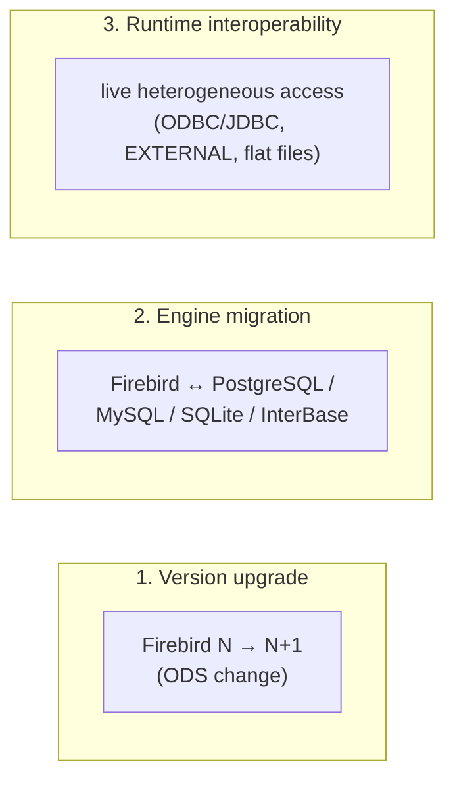

# Migration and Interoperability

Databases rarely live in isolation: you upgrade Firebird from one version to the next, you move data between Firebird and PostgreSQL/MySQL/SQLite, and you run heterogeneous queries that reach across engines. This document covers all three for Firebird 6 — version upgrades, engine-to-engine migration, and live interoperability — grounded in the vendored compatibility docs and demonstrated with a working flat-file interchange table on a live server, then compares the migration/interoperability story with PostgreSQL, MySQL and SQLite.

It draws on several companions: [backup and recovery](backup-and-recovery.md) (`gbak` as the migration engine), [SQL dialect and data types](sql-dialect-and-types.md) (type mapping), [client APIs and drivers](client-apis-and-drivers.md) (ETL connectivity), and [connection pooling](connection-pooling.md) (`EXECUTE STATEMENT ON EXTERNAL` for federation).

**Table of Contents**

* [Three kinds of migration](#three-kinds-of-migration)
* [Firebird version upgrades](#firebird-version-upgrades)
* [Migrating between Firebird and other engines](#migrating-between-firebird-and-other-engines)
* [Type mapping](#type-mapping)
* [Runtime interoperability](#runtime-interoperability)
* [Flat-file interchange (validated)](#flat-file-interchange-validated)
* [Comparison: PostgreSQL, MySQL, SQLite](#comparison-postgresql-mysql-sqlite)
* [Discussion](#discussion)
* [Further research](#further-research)

## Three kinds of migration

"Migration" means three different things; the tools and difficulty differ for each:



_Figure 1: Three kinds of migration — upgrading a Firebird version, moving between engines, and interoperating live_

- **Version upgrade** — same engine, newer release; the on-disk structure (ODS) may change, requiring a backup/restore.
- **Engine migration** — moving schema and data between *different* databases; needs SQL-dialect translation, type mapping, and an ETL path.
- **Runtime interoperability** — querying across engines while both run, via bridges (ODBC/JDBC), Firebird's `EXECUTE STATEMENT ON EXTERNAL`, or flat-file exchange.

## Firebird version upgrades

Firebird's on-disk structure (ODS) is versioned (see the [on-disk structure document](on-disk-structure.md#ods-versions)): ODS 12 = FB3, 13.0 = FB4, 13.1 = FB5, 14.0 = FB6. The upgrade rule follows from that:

- A **minor** ODS bump (e.g. 13.0 → 13.1) can be applied in place — a newer server opens the older database with some new features unavailable.
- A **major** ODS change (e.g. 13.x → 14.0) requires a **`gbak` backup/restore** cycle: back up on the old version, restore on the new one, which rebuilds every page in the new format (see [backup and recovery](backup-and-recovery.md#gbak-logical-backup)). This is the canonical, always-available upgrade path — and because a restore also defragments and rebuilds indexes, it doubles as maintenance.

Beyond the file format, each release documents its **behavioural incompatibilities** ([`README.incompatibilities.txt`](https://github.com/FirebirdSQL/firebird/blob/master/doc/README.incompatibilities.txt), [`README.incompatibilities.3to4.txt`](https://github.com/FirebirdSQL/firebird/blob/master/doc/README.incompatibilities.3to4.txt)) — SQL-syntax tightening, reserved words, API changes, and security hardening. The archetypal example is the **deprecation of UDF** in Firebird 4 (`UdfAccess = None` by default; the `ib_udf`/`fbudf` libraries removed), pushing users to the safer [UDR](extensibility.md) mechanism. Reading the incompatibilities list before a major upgrade is the standard discipline. Firebird's **InterBase heritage** also makes migration *from* legacy InterBase straightforward — the two share a lineage, and dialect 1 (see [SQL dialect](sql-dialect-and-types.md#firebird-sql-dialects)) exists precisely for that continuity.

## Migrating between Firebird and other engines

Moving between Firebird and a different engine is a schema + data + logic problem:

- **Schema and DDL** — mostly standard SQL, but each engine has proprietary syntax (identity/generators, computed columns, domains). Because Firebird targets the SQL standard in dialect 3, portable schema translates cleanly; the engine-specific parts (PSQL vs PL/pgSQL, packages, triggers — see the [PSQL document](psql-and-stored-procedures.md)) must be rewritten.
- **Data** — the bulk-transfer problem, solved with one of: a driver-based ETL script ([any language](client-apis-and-drivers.md)), an ODBC/JDBC bridge feeding a migration tool, `gbak` (Firebird↔Firebird only), or flat-file interchange (below).
- **Types** — mapped per the table in the next section.

The common tools: **JDBC** (via [Jaybird](https://github.com/FirebirdSQL/jaybird)) or **ODBC** (via the [Firebird ODBC driver](https://github.com/FirebirdSQL/firebird-odbc-driver)) let generic migration tools (ESF Database Migration Toolkit, DBeaver, Pentaho, and the like) read or write Firebird; going the other way, tools like [ora2pg](https://ora2pg.darold.net/) exemplify the engine-specific converters that exist for popular source databases. There is no single universal converter; the practical path is a bridge plus a tool, or a small script over a [driver](client-apis-and-drivers.md).

## Type mapping

The core type correspondences when migrating (see [SQL dialect and data types](sql-dialect-and-types.md) for detail; ⚠ marks a lossy or attention-needing mapping):

| Firebird | PostgreSQL | MySQL | SQLite |
|---|---|---|---|
| `SMALLINT`/`INTEGER`/`BIGINT` | same | same | `INTEGER` |
| `INT128` | `numeric` ⚠ | `DECIMAL` ⚠ | `INTEGER`/`TEXT` ⚠ |
| `NUMERIC`/`DECIMAL(p,s)` | `numeric` | `DECIMAL` | `NUMERIC` (affinity) |
| `DECFLOAT` | `numeric` ⚠ | `DECIMAL` ⚠ | `REAL`/`TEXT` ⚠ |
| `FLOAT`/`DOUBLE PRECISION` | `real`/`double precision` | `FLOAT`/`DOUBLE` | `REAL` |
| `BOOLEAN` | `boolean` | `TINYINT(1)` | `INTEGER` |
| `VARCHAR(n) CHARACTER SET …` | `varchar(n)` (+ DB encoding) ⚠ | `VARCHAR(n)` charset | `TEXT` ⚠ |
| `BLOB SUB_TYPE TEXT` | `text` | `LONGTEXT` | `TEXT` |
| `BLOB SUB_TYPE BINARY` | `bytea` | `LONGBLOB` | `BLOB` |
| `TIMESTAMP [WITH TIME ZONE]` | `timestamp[tz]` | `DATETIME`/`TIMESTAMP` ⚠ | `TEXT` ⚠ |
| `CHAR(16) CHARACTER SET OCTETS` (UUID) | `uuid` | `BINARY(16)` | `BLOB` |

The lossy cases cluster around the types Firebird has and the target lacks — `INT128`/`DECFLOAT` (only PostgreSQL/MySQL arbitrary-precision `numeric` approximates them), named-zone timestamps, and per-column character sets — mirroring the [type-system comparison](sql-dialect-and-types.md#data-type-mapping-across-the-four-systems).

## Runtime interoperability

For *live* cross-engine access without a full migration, Firebird offers:

- **ODBC / JDBC bridges** — a JDBC or ODBC connection lets ETL tools and application frameworks treat Firebird as one of several interchangeable sources/targets. This is the universal integration surface.
- **`EXECUTE STATEMENT ... ON EXTERNAL DATA SOURCE`** — run SQL on another Firebird database from PSQL, with results streamed back and connections pooled (see [connection pooling](connection-pooling.md#firebirds-external-connections-pool)). It is primarily Firebird↔Firebird.
- **External-file tables** — a table whose rows are stored in a flat OS file (`CREATE TABLE … EXTERNAL FILE '…'`), for bulk import/export interchange, demonstrated below.

Firebird deliberately does *not* have PostgreSQL's rich foreign-data-wrapper ecosystem (arbitrary remote engines as local tables); its heterogeneous story is ODBC/JDBC at the edges plus Firebird-to-Firebird `EXECUTE STATEMENT` and flat files.

## Flat-file interchange (validated)

Firebird's **external-file tables** map a SQL table onto a plain fixed-width OS file — usable simultaneously as a table and as an interchange file. Verified on a live server (with `ExternalFileAccess` enabled):

```sql
CREATE TABLE ext_people EXTERNAL FILE '/tmp/fbext/people.dat'
  (id CHAR(5), name CHAR(20), nl CHAR(1));
INSERT INTO ext_people VALUES ('1', 'Ada Lovelace', ascii_char(10));
INSERT INTO ext_people VALUES ('2', 'Grace Hopper', ascii_char(10));
SELECT count(*) FROM ext_people;   -- 2
```

The rows inserted through SQL appeared as a fixed-width flat file on disk (real output):

```text
$ cat /tmp/fbext/people.dat
1    Ada Lovelace
2    Grace Hopper
```

The same file is a SQL table to Firebird and a flat file to any other tool — a simple, dependency-free interchange for bulk load/unload. (It requires `ExternalFileAccess` to be configured, off by default for security — see [deployment](deployment-and-operations.md).)

## Comparison: PostgreSQL, MySQL, SQLite

| Aspect | **Firebird** | **PostgreSQL** | **MySQL** | **SQLite** |
|---|---|---|---|---|
| Version upgrade | `gbak` restore (major ODS) / in place (minor) | `pg_upgrade` / dump-restore | in-place / dump-restore | **None** (stable file format) |
| Logical dump | `gbak` (binary) + `isql` DDL | [`pg_dump`](https://www.postgresql.org/docs/current/app-pgdump.html) (portable SQL) | [`mysqldump`](https://dev.mysql.com/doc/refman/8.4/en/mysqldump.html) (SQL) | [`.dump`](https://sqlite.org/cli.html) (SQL) |
| Bulk load/unload | External-file tables | [`COPY`](https://www.postgresql.org/docs/current/sql-copy.html) | [`LOAD DATA`](https://dev.mysql.com/doc/refman/8.4/en/load-data.html) | [`.import`/`.dump`](https://sqlite.org/cli.html) |
| Foreign engines (live) | ODBC/JDBC; `EXECUTE … ON EXTERNAL` (FB↔FB) | **[Foreign data wrappers](https://wiki.postgresql.org/wiki/Foreign_data_wrappers)** (many engines) | FEDERATED (MySQL↔MySQL) | [`ATTACH`](https://sqlite.org/lang_attach.html) (SQLite files) |
| Bridges | ODBC / JDBC / .NET | ODBC / JDBC / libpq | ODBC / JDBC | bindings only |
| File portability | `.fdb` cross-platform (same ODS) | data dir not portable | data dir not portable | **`.sqlite` fully portable** |
| Migration in tools | via ODBC/JDBC | pg_dump / [ora2pg](https://ora2pg.darold.net/) etc. | [Workbench migration](https://dev.mysql.com/doc/workbench/en/wb-migration.html) | trivial (copy file) |
| Standards target | SQL:2016 (dialect 3) | SQL:2016 | SQL (with modes) | SQL subset |

## Discussion

**Firebird's version-migration story is `gbak`, and it is a genuine strength doing double duty.** A logical backup/restore is the always-available cross-version *and* cross-platform path, and because the restore rebuilds every page and index it simultaneously upgrades the ODS, defragments, and reclaims space — one operation where PostgreSQL might use `pg_upgrade` for speed or `pg_dump` for portability as separate choices. The trade-off is that `gbak` is Firebird-specific and binary; there is no portable-SQL dump equivalent to `pg_dump`'s text output, so *engine-to-engine* migration falls back to ODBC/JDBC + tools rather than a native dump the other engine can read.

**Live foreign-engine access is where PostgreSQL pulls decisively ahead.** PostgreSQL's foreign-data-wrapper ecosystem turns almost any remote system — other PostgreSQL, Oracle, MySQL, files, REST APIs — into local tables, a breadth no other engine here matches (it flows from the same [extensibility](extensibility.md#comparison-postgresql-mysql-sqlite) that makes PostgreSQL the extension champion). Firebird's heterogeneous story is narrower and more pragmatic: ODBC/JDBC at the boundary, `EXECUTE STATEMENT ON EXTERNAL` for Firebird-to-Firebird, and external-file tables for flat interchange. MySQL's FEDERATED engine is similarly MySQL-to-MySQL; SQLite's `ATTACH` reaches only other SQLite files. So for building a federated query layer, PostgreSQL is the clear pick; for the common cases (upgrade, dump/restore, ETL through a driver), all four are workable.

**SQLite's `.sqlite` file is the portability champion, by having almost nothing to migrate.** Because the [file format is stable and self-contained](embedded-architecture-comparison.md) across versions and architectures, "migration" for SQLite is usually copying a file — no ODS upgrade, no server, no dump. Firebird's `.fdb` is likewise cross-platform within an ODS, but a major version can require the `gbak` cycle. This is the [embedded-vs-server split](embedded-architecture-comparison.md) once more: the server engines invest in migration tooling because their formats and features evolve; SQLite optimizes for the file just working everywhere, forever.

## Hands-on: samples, tests and debugging

### C++ sample — [`samples/cpp/migration.cpp`](samples/cpp/migration.cpp)

The [type-mapping table](#type-mapping) made concrete. The sample creates a probe table holding exactly the types migrations trip over — `INT128`, `NUMERIC(38,8)`, `DECFLOAT(34)`, `TIMESTAMP WITH TIME ZONE`, `BOOLEAN`, `CHAR(16) CHARACTER SET OCTETS` (UUID) — and inspects it the two ways a migration tool does: first the **described metadata** (`IMessageMetadata::getType()` — the raw `SQL_*` wire codes a driver must recognize or fail on), then the **text face** (every column fetched with the output coerced to `VARCHAR`, the engine's own rendering that a generic "select strings, copy strings" ETL receives).

```sh
cmake -B build samples && cmake --build build
./build/migration        # default: inet://localhost//tmp/fbhandson/migration.fdb
```

Verified output:

```text
described output metadata of SELECT * FROM TYPE_PROBE:

column     code wire type                length scale
C_INT128  32752 SQL_INT128                   16     0
C_NUM     32752 SQL_INT128                   16    -8
C_DEC     32762 SQL_DEC34 (DECFLOAT 34)      16     0
C_TSTZ    32754 SQL_TIMESTAMP_TZ             12     0
C_BOOL    32764 SQL_BOOLEAN                   1     0
C_UUID      452 SQL_TEXT (CHAR)              16     0
C_VC        448 SQL_VARYING (VARCHAR)        80     0

same row fetched with every column coerced to VARCHAR:

  C_INT128 = 170141183460469231731687303715884105727
  C_NUM    = 123456789012345678901234567890.12345678
  C_DEC    = 12345678901.23456789012345678901234
  C_TSTZ   = 2026-07-21 12:00:00.0000 Europe/Bucharest
  C_BOOL   = TRUE
  C_VC     = naïve ütf8 text
  C_UUID   = CB72F3B3-0D88-4278-8C6F-5BAA11F6CE48   (rendered via UUID_TO_CHAR)
```

Two details reward attention. `NUMERIC(38,8)` describes as `SQL_INT128` with scale −8 — high-precision numerics ride on the INT128 carrier, so a driver that "supports NUMERIC" but not `SQL_INT128` fails on wide columns. And the text face preserves everything, named time zone included — which is why "cast to text on the way out" is the universal fallback in the [flat-file and ETL paths](#runtime-interoperability) above.

### fb-cpp sample — [`samples/fb-cpp/migration.cpp`](samples/fb-cpp/migration.cpp)

The same `TYPE_PROBE` table through [fb-cpp](https://github.com/asfernandes/fb-cpp) (vendored at [`extern/fb-cpp`](extern/fb-cpp)), the modern C++20 wrapper over the OO API, probed on both faces. The DESCRIBE face comes from fb-cpp's cached `Descriptor` structs — the same `SQL_*` codes `IMessageMetadata` reports, one struct per column instead of five interface calls — and for the text face, where the OO-API sample coerced every column to `VARCHAR` so the server's CVT rules rendered the strings, `getString()` converts client-side from the native wire value; `getBoostInt128()` then reads the same column as a native 128-bit Boost.Multiprecision integer, proving the value never rode through text at all.

```sh
cmake -B build samples && cmake --build build   # needs libboost-dev + libboost-filesystem-dev
./build/fbcpp_migration
```

Verified: identical wire codes — `C_NUM` still describes as `32752 SQL_INT128` with scale `-8` — and identical digits for every value (`C_INT128` = `170141183460469231731687303715884105727` both as a string and as a native int128), with two client-side deltas worth noticing: `C_BOOL` renders as lowercase `true` (fb-cpp's own rendering, not the server's `TRUE`), and `C_VC` describes as length 20 where the OO-API run showed 80, because the fb-cpp helper attaches with no connection charset to a database created with engine defaults, so the `VARCHAR(20)` travels at one byte per character instead of in a UTF8-coerced 4-bytes-per-char buffer.

### JavaScript sample — [`samples/nodejs/migration.js`](samples/nodejs/migration.js)

The same table probed column by column through node-firebird (`cd samples/nodejs && node migration.js`) — a pure-JavaScript driver forced to map each wire type onto JavaScript's few value types, exactly the downcasting problem every migration faces. Verified results, which are the document's ⚠ marks reproduced live:

```text
  C_INT128 -> string  0.170141183460469231731687303715884105727
  C_NUM    -> string  123456789012345678901234567890.12345678
  C_DEC    -> ERROR: SQL error code = -804, SQLDA missing or incorrect ...
  C_TSTZ   -> Date  2026-07-21T09:00:00.000Z
  C_BOOL   -> boolean  true
  C_UUID   -> ERROR: Malformed string
  C_VC     -> string  naïve ütf8 text
```

Every line teaches something: `NUMERIC(38,8)` arrives as a correct string, but scale-0 `INT128` hits a driver formatting bug (a spurious `0.` prefix — node-firebird 2.11's scale handling); `DECFLOAT(34)` cannot be described by the driver at all; `TIMESTAMP WITH TIME ZONE` becomes a JS `Date` holding the correct *instant* (12:00 Bucharest = 09:00 UTC) with the zone name lost — the classic lossy mapping; and OCTETS data fails UTF-8 decoding (with `encoding: 'NONE'` it arrives as a raw `Buffer` instead). The sample closes with the fallback that always works: the same values `CAST` to `VARCHAR` server-side, all of them intact.

### Rust sample — [`samples/rust/src/bin/migration.rs`](samples/rust/src/bin/migration.rs)

The same probe through [rsfbclient](https://github.com/fernandobatels/rsfbclient), Rust's Firebird client (`cd samples/rust && cargo run --bin migration`). Where the C++ sample reads wire type codes off `IMessageMetadata` and node-firebird at least *attempts* every type, rsfbclient maps each column onto its seven-variant `SqlType` enum (`Text` / `Integer` / `Floating` / `Timestamp` / `Boolean` / `Binary` / `Null`) and returns an error for anything that doesn't fit — a mapping even coarser than JavaScript's, which is precisely the migration story: the modern types don't just downcast, they don't arrive. The sample prints each column's `SqlType` variant next to its `raw_type` wire code, then shows the two escapes: a `NUMERIC(18,4)` the driver *can* reach (the client library coerces `SQL_INT64` scale −4 to DOUBLE — lossy past 2^53) and the universal CAST-to-VARCHAR fallback.

Verified: `C_INT128`, `C_NUM`, `C_DEC` and `C_TSTZ` all fail with `Unsupported column type (32752 0)` / `(32752 1)` / `(32762 0)` / `(32754 0)` — the raw wire codes for INT128 (with and without scale), DECFLOAT(34) and TIMESTAMP_TZ, rejected before any value crosses; `C_UUID` (CHAR OCTETS) does arrive but dies in the mandatory UTF-8 decode with `invalid utf-8 sequence of 1 bytes from index 0`; only `C_BOOL` → `Boolean true` and `C_VC` → `Text "naïve ütf8 text"` survive natively. `NUMERIC(18,4) 12345.6789` comes back as `Floating 12345.6789` on wire type 580 `SQL_INT64`, and the server-side CASTs deliver every value intact, `170141183460469231731687303715884105727` and `2026-07-21 12:00:00.0000 Europe/Bucharest` included.

### Things to try

- Change the connection `encoding` to `'NONE'` in the JS sample and re-probe `C_UUID` — a 16-byte `Buffer` now, no error: charset coercion happens client-side, per connection.
- Add a `DECFLOAT(16)` column: fbclient describes it as `SQL_DEC16` (32760); check whether the JS driver's column-by-column probe treats it like `DECFLOAT(34)`.
- Round-trip the probe table through gbak (`./build/backup` shows the Services route) and re-run the C++ probe on the restored copy — the transportable format preserves every wire type exactly.
- Export the table through an [external-file table](#flat-file-interchange-validated) (all columns CAST to CHAR) and re-import — measure what the flat-file path keeps and what it flattens.

### Debugging this in C++ (gdb)

With a [debug build of the engine](debugging-firebird.md), the type machinery behind both samples is a handful of well-named functions:

```gdb
break CVT_move                        # src/common/cvt.cpp:3843 — every conversion, incl. the coercion to VARCHAR
break Int128::toString                # src/common/Int128.cpp:123 — INT128/NUMERIC(38) rendered to text (note the scale arg)
break Decimal128::toString            # src/common/DecFloat.cpp:711 — DECFLOAT(34)'s text face
break TimeZoneUtil::format            # src/common/TimeZoneUtil.cpp:543 — the zone name/offset appended to a TZ timestamp
break TimeZoneUtil::localTimeStampToUtc  # TimeZoneUtil.cpp:703 — named zone -> UTC on input (the instant JS receives)
```

Run the C++ sample's text-face query under these: each row fetch descends from the cursor into `CVT_move` once per column, and for `C_NUM` you can watch `Int128::toString` receive scale −8 — the single integer that turns `12345678901234567890123456789012345678` into `123456789012345678901234567890.12345678`, i.e. the exact place where the [type-mapping table's](#type-mapping) "INT128-backed NUMERIC" row is implemented. `TimeZoneUtil::format` shows the named-zone id (a small integer indexing the tzdata tables) being expanded to `Europe/Bucharest` — the information a `Date`-shaped driver type has nowhere to put, which is why that mapping is marked lossy.

## Further research

**Firebird**

- [`README.incompatibilities.txt`](https://github.com/FirebirdSQL/firebird/blob/master/doc/README.incompatibilities.txt) and [`README.incompatibilities.3to4.txt`](https://github.com/FirebirdSQL/firebird/blob/master/doc/README.incompatibilities.3to4.txt) — the per-version behavioural changes to review before upgrading.
- The [backup and recovery document](backup-and-recovery.md) (`gbak` as the migration engine), [SQL dialect and data types](sql-dialect-and-types.md) (type mapping), [client APIs and drivers](client-apis-and-drivers.md) (ETL connectivity, [Jaybird](https://github.com/FirebirdSQL/jaybird), [ODBC](https://github.com/FirebirdSQL/firebird-odbc-driver)), and [connection pooling](connection-pooling.md) (`EXECUTE STATEMENT ON EXTERNAL`).

**PostgreSQL, MySQL, SQLite**

- PostgreSQL: [`pg_dump`](https://www.postgresql.org/docs/current/app-pgdump.html), [`COPY`](https://www.postgresql.org/docs/current/sql-copy.html), [foreign data wrappers](https://wiki.postgresql.org/wiki/Foreign_data_wrappers) / [`postgres_fdw`](https://www.postgresql.org/docs/current/postgres-fdw.html), [ora2pg](https://ora2pg.darold.net/).
- MySQL: [`mysqldump`](https://dev.mysql.com/doc/refman/8.4/en/mysqldump.html), [`LOAD DATA`](https://dev.mysql.com/doc/refman/8.4/en/load-data.html), [Workbench migration](https://dev.mysql.com/doc/workbench/en/wb-migration.html).
- SQLite: [command-line shell (`.dump`/`.import`)](https://sqlite.org/cli.html), [`ATTACH DATABASE`](https://sqlite.org/lang_attach.html).

**Standards / bridges**

- [ODBC overview](https://learn.microsoft.com/en-us/sql/odbc/reference/odbc-overview) and [SQL:2016](https://en.wikipedia.org/wiki/SQL:2016) — the common ground migration leans on.
