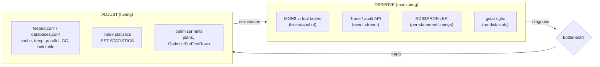
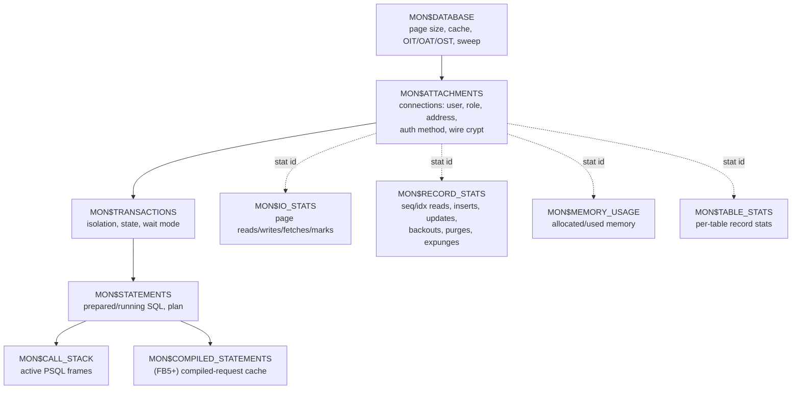

# Monitoring and Performance Tuning Architecture

Every database gives operators two things: a way to **see** what the engine is doing right now (monitoring) and a set of **knobs** to change how it does it (tuning). This document describes how Firebird 6 exposes its internal state and what its performance-relevant configuration controls — grounded in the vendored source (`doc/README.monitoring_tables`, `doc/README.parallel_features`, `src/common/config/config.h`) and verified against a live server — then compares the approach with PostgreSQL, MySQL and SQLite.

It is a companion to the [main paper](README.md) and the other comparison documents. It draws on several of them: the [on-disk-structure document](on-disk-structure.md) for the page and transaction concepts the monitor surfaces, the [architecture comparison](architecture-comparison.md) for the optimizer and MVCC background, and the [security document](security-architecture.md) for the privileges that gate the monitoring tools.

**Table of Contents**

* [Two jobs: observe and adjust](#two-jobs-observe-and-adjust)
* [Firebird monitoring: the MON$ tables](#firebird-monitoring-the-mon-tables)
* [Firebird: trace, profiler and statistics](#firebird-trace-profiler-and-statistics)
* [Reading the optimizer: query plans](#reading-the-optimizer-query-plans)
* [Firebird performance tuning knobs](#firebird-performance-tuning-knobs)
* [Tuning workflow (validated walk-through)](#tuning-workflow-validated-walk-through)
* [Comparison: PostgreSQL, MySQL, SQLite](#comparison-postgresql-mysql-sqlite)
* [Discussion](#discussion)
* [Further research](#further-research)

## Two jobs: observe and adjust



_Figure 1: The monitor/tune loop — observe with MON$/trace/profiler/gstat, adjust with configuration and statistics, re-measure_

## Firebird monitoring: the MON$ tables

Firebird's primary monitoring surface is a set of **virtual tables** (`MON$*`) that you query with ordinary SQL. The key architectural property, from [`doc/README.monitoring_tables`](https://github.com/FirebirdSQL/firebird/blob/master/doc/README.monitoring_tables): the data does not exist until you select it, and the first select in a transaction takes a **stable snapshot** that is preserved until the transaction ends — so a master/detail set of queries always sees a consistent picture, regardless of the host transaction's isolation level. To refresh, commit and re-query. Access is privilege-gated (see the [security document](security-architecture.md)): SYSDBA and the database owner see everything; a regular user sees only their own attachments.



_Figure 2: The MON$ tables form a hierarchy (database → attachment → transaction → statement → call stack), with I/O, record, memory and table statistics hanging off each level by a stat id_

The design is deliberately relational: `MON$IO_STATS`, `MON$RECORD_STATS`, `MON$MEMORY_USAGE` and `MON$TABLE_STATS` are joined to the database/attachment/transaction/statement rows through a `MON$STAT_ID`, so you can ask "how many page reads has *this connection* done" or "how many index vs sequential reads has *this table* served" with a join. `CURRENT_CONNECTION` and `CURRENT_TRANSACTION` match the id columns for self-inspection. You can even **cancel** a runaway query by `DELETE`-ing its row from `MON$STATEMENTS`.

Verified live on Firebird 6 — `MON$DATABASE` reporting page size, cache and the transaction markers from the [on-disk structure](on-disk-structure.md#mvcc-on-disk-the-transaction-inventory):

```text
PS     8192      -- page size
CACHE  2048      -- page buffers (cache pages)
OIT    236       -- oldest interesting transaction
OAT    237       -- oldest active
NXT    238       -- next transaction
```

The OIT→OAT→NXT spread is the single most important health number: a large OIT–OAT gap means old record versions cannot be garbage-collected (a long-running transaction is holding the floor), the direct Firebird analogue of PostgreSQL vacuum pressure.

## Firebird: trace, profiler and statistics

The MON$ tables are a *snapshot*; three other facilities give the time dimension:

- **Trace / audit API** ([`doc/README.trace_services`](https://github.com/FirebirdSQL/firebird/blob/master/doc/README.trace_services)) — an event stream. A **system audit** session, configured in a text file and started by the engine, logs connects, statement executions, and their performance counters; a **user trace** session is started on demand with `fbtracemgr`. This is how you capture "every statement slower than N ms" without polling.
- **SQL/PSQL profiler** (Firebird 5) — the `RDB$PROFILER` system package plus `PLG$PROF_*` tables record per-statement and per-record-source timings, so you can see *where inside a plan* the time went. Verified present on the live server (`RDB$PROFILER` package exists).
- **Index statistics** — the optimizer is cost-based and relies on per-index **selectivity** stored in `RDB$STATISTICS`. `SET STATISTICS INDEX <name>` recomputes it; stale statistics are a classic cause of a good index being ignored, and recomputing them is the cheapest tuning action there is.

## Reading the optimizer: query plans

Firebird's cost-based optimizer ([`doc/README.Optimizer.txt`](https://github.com/FirebirdSQL/firebird/blob/master/doc/README.Optimizer.txt)) chooses access paths and join methods; you inspect its decisions with the textual **PLAN**. Real output from the live Firebird 6 server:

```text
-- PK lookup uses the primary-key index:
select last_name, first_name from employee e where e.emp_no = 5;
PLAN ("E" INDEX ("PUBLIC"."RDB$PRIMARY7"))

-- a join the optimizer costs as a hash join (a Firebird 5 feature):
select count(*) from employee e join department d on e.dept_no = d.dept_no;
PLAN HASH ("E" NATURAL, "D" NATURAL)
```

The first plan shows index access via the primary key; the second shows the **hash join** the cost-based optimizer introduced in Firebird 5 (older versions had only nested-loop joins), reading both sides with a NATURAL (full) scan and hashing them. `NATURAL` in a plan where you expected an index is the flag to investigate — a missing index, stale statistics, or a non-sargable predicate. The compiled plan is also visible in `MON$STATEMENTS.MON$EXPLAINED_PLAN` for statements running right now.

## Firebird performance tuning knobs

The performance-relevant settings live in `firebird.conf` (global) and `databases.conf` (per database); the defaults below are from `src/common/config/config.h`.

| Setting | Default | What it tunes |
|---|---|---|
| `DefaultDbCachePages` | −1 (mode-dependent) | Page-cache size (buffers). The biggest single lever; too small ⇒ disk thrash, too large ⇒ RAM pressure. Also settable per database and via the header (`gfix -buffers`). |
| `ServerMode` | (Super) | Threading/cache model: `Super` (shared cache, threads), `SuperClassic`, `Classic` (process per connection) — see the [main paper](README.md#architectural-evolution-firebird-3-to-6). |
| `TempCacheLimit` | −1 | RAM for sorts/temporary data before spilling to `TempBlockSize` disk blocks. |
| `ParallelWorkers` / `MaxParallelWorkers` | 1 / 1 | Parallel sweep, index build and backup/restore (Firebird 5). Raising `MaxParallelWorkers` and requesting workers (config, DPB, or `gfix -parallel N`) speeds maintenance on multi-core hosts. |
| `GCPolicy` | mode-dependent | Garbage collection: `cooperative`, `background`, or `combined` — who reclaims dead record versions. |
| `MaxStatementCacheSize` | 2 MiB | Per-attachment compiled-statement cache (Firebird 5; visible in `MON$COMPILED_STATEMENTS`). |
| `LockHashSlots` / `LockMemSize` | 8191 / 1 MiB | The lock table (`src/lock/`); enlarge for very high concurrency. |
| `MaxUnflushedWrites` | 100 / −1 | How many writes accumulate before a forced flush (durability vs throughput). |
| `ReadConsistency` | true | READ COMMITTED statement-level read consistency (Firebird 4+ commit-order snapshots). |
| `InlineSortThreshold` | 1000 (bytes) | When record data is carried inside the sort vs referenced. |
| `OptimizeForFirstRows` | false | Bias the optimizer toward fast first rows (OLTP) vs total throughput. |
| `TipCacheBlockSize` / `SnapshotsMemSize` | 4 MiB / 64 KiB | In-memory transaction-state caches that speed visibility checks. |

Beyond the config file: **page size** is chosen at creation (see [on-disk structure](on-disk-structure.md#setup-and-administration)); **sweep** (`gfix -sweep`, `gfix -housekeeping N`) controls dead-version cleanup; and **`nbackup`**/**parallel `gbak`** control backup impact.

## Tuning workflow (validated walk-through)

A concrete loop, using facilities verified above:

1. **Find the cost.** Query `MON$STATEMENTS` joined to `MON$IO_STATS`/`MON$RECORD_STATS` for the current activity, or run a trace session to capture slow statements over time. High `MON$RECORD_STATS.MON$RECORD_SEQ_READS` on a large table is the classic "missing index / full scan" signature.
2. **Explain it.** Look at the `PLAN`: a `NATURAL` scan where you expected an index, or a join order that reads the big table first, points at the fix.
3. **Fix statistics or indexes.** `SET STATISTICS INDEX <name>` to refresh selectivity; add or adjust an index; rewrite a non-sargable predicate.
4. **Check the transaction health.** In `MON$DATABASE`, watch the OIT–OAT gap; if it grows, hunt the long-running transaction in `MON$TRANSACTIONS` and consider `gfix -sweep`.
5. **Size the cache.** If `MON$IO_STATS` shows page reads dominating fetches, raise `DefaultDbCachePages` (or per-database buffers) so the working set stays in cache.
6. **Parallelize maintenance.** On multi-core hosts raise `MaxParallelWorkers` and run `gfix -sweep -parallel N` / parallel `gbak` to cut maintenance windows (Firebird 5).
7. **Re-measure** in a fresh transaction (remember MON$ snapshots are per-transaction).

## Comparison: PostgreSQL, MySQL, SQLite

All four expose internal state and offer tuning knobs, but the *shape* of the monitoring surface differs.

| Aspect | **Firebird** | **PostgreSQL** | **MySQL** | **SQLite** |
|---|---|---|---|---|
| Live activity | `MON$*` virtual tables (per-tx snapshot) | [`pg_stat_activity`](https://www.postgresql.org/docs/current/monitoring-stats.html) + cumulative stats views | [`performance_schema`](https://dev.mysql.com/doc/refman/8.4/en/performance-schema.html) + [`sys`](https://dev.mysql.com/doc/refman/8.4/en/sys-schema.html) schema; `SHOW ENGINE INNODB STATUS` | None built-in (single process) |
| Per-statement history | Trace API; [`RDB$PROFILER`](https://github.com/FirebirdSQL/firebird/blob/master/doc/README.parallel_features) (FB5) | [`pg_stat_statements`](https://www.postgresql.org/docs/current/pgstatstatements.html) | `performance_schema` events; slow query log | — |
| Query plan | `PLAN` / `MON$EXPLAINED_PLAN` | [`EXPLAIN [ANALYZE]`](https://www.postgresql.org/docs/current/using-explain.html) | [`EXPLAIN [ANALYZE]`](https://dev.mysql.com/doc/refman/8.4/en/explain.html) | [`EXPLAIN QUERY PLAN`](https://sqlite.org/eqp.html) |
| Optimizer statistics | `RDB$STATISTICS` selectivity; `SET STATISTICS` | `ANALYZE` → `pg_statistic` | `ANALYZE TABLE` | [`ANALYZE`](https://sqlite.org/lang_analyze.html) → `sqlite_stat*` |
| Cache knob | `DefaultDbCachePages` | [`shared_buffers`](https://www.postgresql.org/docs/current/runtime-config-resource.html) | [`innodb_buffer_pool_size`](https://dev.mysql.com/doc/refman/8.4/en/innodb-buffer-pool-resize.html) | [`PRAGMA cache_size`](https://sqlite.org/pragma.html) |
| Config surface | `firebird.conf` / `databases.conf` | `postgresql.conf` | `my.cnf` / system variables | `PRAGMA` (per-connection) |
| Dead-version upkeep | sweep / cooperative GC | [autovacuum](https://www.postgresql.org/docs/current/routine-vacuuming.html) | InnoDB purge | `VACUUM` (compaction) |
| Parallelism control | `MaxParallelWorkers` (FB5: sweep/index/backup) | `max_parallel_workers*` (query parallelism) | thread pool; parallel read | none |
| Access control | SYSDBA/owner see all; users see own | superuser vs `pg_monitor` role | `SELECT`/`PROCESS` privileges | N/A |

## Discussion

**Firebird and PostgreSQL monitor through SQL; MySQL through a dedicated schema; SQLite barely at all.** Firebird's MON$ tables and PostgreSQL's `pg_stat_*` views share a philosophy — internal state *is* queryable relational data, joinable and filterable with ordinary SQL — which makes ad-hoc diagnosis natural and scriptable. MySQL's `performance_schema`/`sys` is the richest instrumentation of the three (per-wait, per-stage, per-memory-allocator events) but is a larger, more specialized surface with its own overhead controls. SQLite, being an in-process library with one writer, has almost nothing to monitor at runtime: `EXPLAIN QUERY PLAN` and `ANALYZE` are about the extent of it, which is exactly right for its niche (see the [embedded comparison](embedded-architecture-comparison.md)).

**The snapshot vs stream distinction matters.** Firebird's MON$ tables are a consistent point-in-time snapshot (great for "what is happening right now, coherently"); its trace API and PostgreSQL's `pg_stat_statements` and MySQL's `performance_schema` provide the accumulated-over-time view (great for "what has been expensive"). A complete tuning practice needs both, and all three servers provide both — Firebird via MON$ + trace/profiler.

**The tuning knobs rhyme, because the engines face the same physics.** Every server's single biggest lever is the page/buffer cache (`DefaultDbCachePages` ≈ `shared_buffers` ≈ `innodb_buffer_pool_size` ≈ `PRAGMA cache_size`), every MVCC engine has a dead-version cleanup process to keep healthy (Firebird sweep, PostgreSQL autovacuum, InnoDB purge — see the [on-disk structure comparison](on-disk-structure.md#comparison-postgresql-mysqlinnodb-sqlite)), and every cost-based optimizer depends on fresh statistics. Firebird's distinctive additions are the OIT/OAT transaction-gap health signal that falls out of its multi-generational architecture, and the Firebird 5 arrival of hash joins, a compiled-statement cache and parallel maintenance — features the others had earlier, now closing the gap.

## Further research

**Firebird**

- [`doc/README.monitoring_tables`](https://github.com/FirebirdSQL/firebird/blob/master/doc/README.monitoring_tables) — every MON$ table and column, by the feature's author.
- [`doc/README.trace_services`](https://github.com/FirebirdSQL/firebird/blob/master/doc/README.trace_services) — trace/audit sessions and configuration.
- [`doc/README.parallel_features`](https://github.com/FirebirdSQL/firebird/blob/master/doc/README.parallel_features) — parallel sweep/index/backup (FB5).
- [`doc/README.Optimizer.txt`](https://github.com/FirebirdSQL/firebird/blob/master/doc/README.Optimizer.txt) — the cost-based optimizer; and the [on-disk structure document](on-disk-structure.md) and [`gstat` section](on-disk-structure.md#inspecting-the-structure-validated-with-gstat) for physical statistics.

**PostgreSQL**

- [Monitoring statistics](https://www.postgresql.org/docs/current/monitoring-stats.html), [`pg_stat_statements`](https://www.postgresql.org/docs/current/pgstatstatements.html), [Using EXPLAIN](https://www.postgresql.org/docs/current/using-explain.html), [Resource-consumption config](https://www.postgresql.org/docs/current/runtime-config-resource.html), [Routine vacuuming](https://www.postgresql.org/docs/current/routine-vacuuming.html).

**MySQL**

- [Performance Schema](https://dev.mysql.com/doc/refman/8.4/en/performance-schema.html), [sys schema](https://dev.mysql.com/doc/refman/8.4/en/sys-schema.html), [EXPLAIN](https://dev.mysql.com/doc/refman/8.4/en/explain.html), [InnoDB buffer pool sizing](https://dev.mysql.com/doc/refman/8.4/en/innodb-buffer-pool-resize.html); MariaDB's [Performance Schema](https://mariadb.com/kb/en/performance-schema/).

**SQLite**

- [EXPLAIN QUERY PLAN](https://sqlite.org/eqp.html), [ANALYZE](https://sqlite.org/lang_analyze.html), [PRAGMA statements](https://sqlite.org/pragma.html), [Query optimizer overview](https://sqlite.org/optoverview.html).
