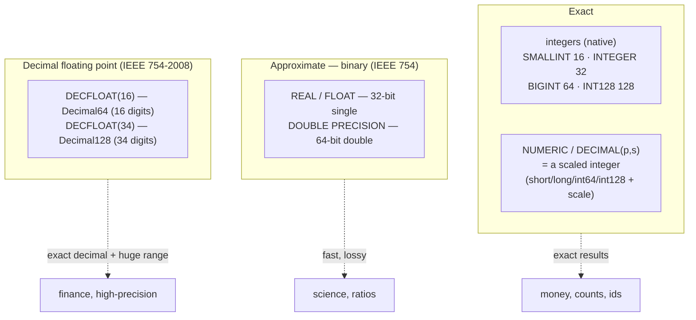

# Numeric and Exact-Precision Arithmetic

`0.1 + 0.2` should equal `0.3`, and money should never quietly lose a cent — but binary floating point breaks both, so databases offer *exact* numeric types alongside the fast, lossy binary ones. This document describes Firebird 6's numeric type family — exact integers (including 128-bit), scaled-integer `NUMERIC`/`DECIMAL`, binary floats, and the distinctive **DECFLOAT** decimal floating-point types — with their internal representation, rounding and traps, grounded in the vendored source and demonstrated live, then compares exact arithmetic with PostgreSQL, MySQL and SQLite.

It extends the [SQL dialect and data types document](sql-dialect-and-types.md) (which introduced `INT128` and `DECFLOAT` in the type-system overview) with the arithmetic internals, and sits in the [reading guide](READING-GUIDE.md)'s Storage & data track.

**Table of Contents**

* [The numeric type family](#the-numeric-type-family)
* [Exact integers and scaled NUMERIC](#exact-integers-and-scaled-numeric)
* [Binary vs decimal floating point](#binary-vs-decimal-floating-point)
* [DECFLOAT: rounding and traps](#decfloat-rounding-and-traps)
* [Numeric arithmetic in action (validated)](#numeric-arithmetic-in-action-validated)
* [Comparison: PostgreSQL, MySQL, SQLite](#comparison-postgresql-mysql-sqlite)
* [Discussion](#discussion)
* [Further research](#further-research)

## The numeric type family

Firebird's numeric types split along two axes — **exact vs approximate**, and **integer vs fractional** (`dsc.h` classifies them with `DTYPE_IS_EXACT`, `DTYPE_IS_APPROX`, `DTYPE_IS_DECFLOAT`):



_Figure 1: Firebird's numeric types — exact integers and scaled NUMERIC, approximate binary floats, and the DECFLOAT decimal floating-point types_

## Exact integers and scaled NUMERIC

The exact integer types are stored as native machine integers of 16, 32, 64 and — since Firebird 4 — **128 bits** (`INT128`). A native 128-bit integer is rare (PostgreSQL and MySQL cap at 64-bit `BIGINT` in core), useful for very large identifiers and high-precision fixed-point intermediates.

**`NUMERIC(p, s)` / `DECIMAL(p, s)` are stored as a *scaled integer*.** The value is kept as an ordinary integer and the descriptor's `dsc_scale` records the decimal-point position: `NUMERIC(18, 4)` holding `12345.6789` is stored as the integer `123456789` with scale `-4`, so the true value is `123456789 × 10⁻⁴`. The backing integer widens with the precision — `short`/`long`/`int64`/`int128` — so `NUMERIC` supports up to **38 significant digits** (backed by `INT128`). This scaled-integer scheme is what makes `NUMERIC` **exact**: every value is an integer under the hood, so addition and subtraction are exact and multiplication scales predictably — no binary rounding.

## Binary vs decimal floating point

Firebird has *two* families of floating point ([`README.floating_point_types.md`](https://github.com/FirebirdSQL/firebird/blob/master/doc/sql.extensions/README.floating_point_types.md)):

- **Approximate / binary** — `REAL`/`FLOAT` (32-bit IEEE single) and `DOUBLE PRECISION` (64-bit IEEE double), plus `FLOAT(p)` selecting single or double by significand bits. Fast, hardware-accelerated, but **base-2**: values like `0.1` have no exact binary representation, so `0.1 + 0.2 ≠ 0.3` exactly — fine for science, wrong for money.
- **Decimal floating point (DECFLOAT)** — `DECFLOAT(16)` is **IEEE 754-2008 Decimal64** (16 significant digits) and `DECFLOAT(34)` is **Decimal128** (34 significant digits, exponent range to ±6144). These represent numbers in **base 10**, so `0.1`, `0.2`, `0.3` are exact, *and* they float — combining the exactness of decimal with an enormous dynamic range that a fixed-scale `NUMERIC` can't match.

DECFLOAT is the distinctive one: it is **exact decimal arithmetic that also floats**. `NUMERIC` is exact but fixed-scale (bounded precision, fixed decimal places); binary `DOUBLE` floats but is inexact in decimal; DECFLOAT is exact-in-decimal *and* floating — ideal for financial and scientific values where both correctness and range matter. Firebird implements it via the IBM decNumber/decimal library.

## DECFLOAT: rounding and traps

Because DECFLOAT is a full IEEE decimal implementation, Firebird exposes its **rounding mode** and **exception traps** as session settings (`SET DECFLOAT`, parsed in `parse.y`):

- **`SET DECFLOAT ROUND <mode>`** — the rounding applied when a result exceeds the available digits: `CEILING`, `FLOOR`, `UP`, `DOWN`, `HALF_UP`, `HALF_DOWN`, `HALF_EVEN` (banker's rounding, the default), and `REROUND`. This is far more explicit control than most databases offer.
- **`SET DECFLOAT TRAPS TO <list>`** — which IEEE conditions raise an error instead of returning a special value: `Division_by_zero`, `Inexact`, `Invalid_operation`, `Overflow`, `Underflow`. The default trap set is `Division_by_zero, Invalid_operation, Overflow` (`doc/sql.extensions/README.data_types`), so a division by zero *raises* out of the box; clearing the traps (`SET DECFLOAT TRAPS TO` with an empty list) lets the same operation yield `Infinity`/`NaN` instead.

These are per-session (settable in an `ON CONNECT` trigger for a database-wide default), giving applications precise, auditable control over financial rounding behavior.

## Numeric arithmetic in action (validated)

Real output from a live Firebird 6 server:

```sql
-- DECFLOAT is exact decimal; binary DOUBLE is not:
SELECT CAST(0.1 AS DECFLOAT(34)) + CAST(0.2 AS DECFLOAT(34));   -- 0.3   (exact)
SELECT CAST(1 AS DECFLOAT(34)) / 3;    -- 0.3333333333333333333333333333333333  (34 digits)

-- NUMERIC as a scaled integer:
SELECT CAST(12345.6789 AS NUMERIC(18,4)),      -- 12345.6789  (int 123456789, scale -4)
       CAST(123456789 AS NUMERIC(18,4));        -- 123456789.0000

-- INT128 full 128-bit range, NUMERIC up to 38 digits:
SELECT CAST(170141183460469231731687303715884105727 AS INT128),   -- 2^127 - 1
       CAST(99999999999999999999999999999999999999 AS NUMERIC(38,0));  -- 38 nines

-- rounding mode changes the result:
SET DECFLOAT ROUND CEILING;
SELECT CAST(1 AS DECFLOAT(16)) / 3 * 3;   -- 1.000000000000001  (rounded up)

-- traps turn IEEE special values into errors:
SET DECFLOAT TRAPS TO Division_by_zero;
SELECT CAST(1 AS DECFLOAT(16)) / CAST(0 AS DECFLOAT(16));
--   SQLSTATE 22012: Decimal float divide by zero
```

Every behavior held: `DECFLOAT` summed `0.1 + 0.2` to exactly `0.3`, produced 34 digits of `1/3`, `NUMERIC` round-tripped its scaled value, `INT128` reached `2¹²⁷−1`, the `CEILING` rounding mode pushed an inexact result up, and the `Division_by_zero` trap raised SQLSTATE 22012 instead of returning infinity. This is a complete IEEE decimal arithmetic system with application-controlled rounding.

## Comparison: PostgreSQL, MySQL, SQLite

| Aspect | **Firebird** | **PostgreSQL** | **MySQL** | **SQLite** |
|---|---|---|---|---|
| 128-bit integer | **`INT128`** (native) | No (use `numeric`) | No (use `DECIMAL`) | No |
| Exact fixed decimal | `NUMERIC/DECIMAL` (≤38, scaled int) | [`numeric`](https://www.postgresql.org/docs/current/datatype-numeric.html) (arbitrary, ≤~131072 digits) | [`DECIMAL`](https://dev.mysql.com/doc/refman/8.4/en/fixed-point-types.html) (≤65 digits) | **None native** ([decimal ext](https://sqlite.org/src/doc/trunk/ext/misc/decimal.c)) |
| **Decimal floating point** | **`DECFLOAT(16/34)`** (IEEE decimal64/128) | No | No | No |
| Binary float | `REAL`/`DOUBLE` | `real`/`double precision` | `FLOAT`/`DOUBLE` | `REAL` |
| Default numeric storage | typed columns | typed columns | typed columns | **`INTEGER`/`REAL` only** (affinity) |
| Rounding control | **`SET DECFLOAT ROUND`** (8 modes) | round-half-to-even (fixed) | round-half-up (fixed) | fixed |
| Exception traps | **`SET DECFLOAT TRAPS`** | errors on overflow | errors/warnings by mode | none |
| Exact money out of the box | **Yes** (`NUMERIC`/`DECFLOAT`) | Yes (`numeric`/`money`) | Yes (`DECIMAL`) | **No** (`REAL` rounding) |
| Backing implementation | decNumber (decimal); native ints | arbitrary-precision `numeric` | packed `DECIMAL` | C `double` |

## Discussion

**DECFLOAT is Firebird's standout numeric feature — none of the other three have it.** PostgreSQL, MySQL and SQLite all offer *exact fixed-scale* decimal (`numeric`/`DECIMAL`) but none offers **decimal *floating* point**. The difference matters when you need both exactness *and* a wide dynamic range: a `NUMERIC(18,2)` money column is exact but capped in magnitude and fixed at two places, whereas `DECFLOAT(34)` is exact in decimal *and* floats across 34 significant digits with a vast exponent — the natural type for aggregating values that span from fractions of a cent to trillions, or for scientific computation that must not accumulate binary rounding error. Firebird (following the IEEE 754-2008 decimal standard and IBM's decimal work) brought this into SQL where the others rely on their fixed-scale decimal or lose exactness in `double`.

**On the common cases the four converge, with SQLite the exception.** For ordinary exact decimal — money, invoices, ledgers — Firebird's scaled-integer `NUMERIC`, PostgreSQL's arbitrary-precision `numeric`, and MySQL's packed `DECIMAL` are all correct and interchangeable in spirit (PostgreSQL wins on maximum precision, Firebird on the native `INT128` backing and the `DECFLOAT` option). **SQLite is the odd one out: it has no native exact decimal type at all** — its numeric storage classes are 64-bit `INTEGER` and IEEE `REAL` (`double`), so storing money as a number invites the classic binary-rounding bug, and exact decimal requires the loadable decimal extension or storing scaled integers/text by hand. This is the [embedded-vs-server trade-off](embedded-architecture-comparison.md) surfacing in arithmetic: the tiny library ships the two numeric types the CPU has, and pushes exact decimal to an extension.

**Firebird's explicit rounding and trap control is a quiet differentiator.** `SET DECFLOAT ROUND` (eight IEEE modes) and `SET DECFLOAT TRAPS` (raise on division-by-zero, inexact, overflow, …) give financial applications auditable, per-session control over exactly how rounding and exceptional results behave — where PostgreSQL and MySQL bake in a fixed rounding rule and SQLite offers nothing. Combined with `INT128` and `DECFLOAT`, it makes Firebird one of the stronger engines for high-precision and financial arithmetic — a domain where "close enough" is a bug.

## Hands-on: samples, tests and debugging

### C++ sample — [`samples/cpp/numerics.cpp`](samples/cpp/numerics.cpp)

Four experiments, one per section of this document: the residue of `(0.1 + 0.2) − 0.3` in binary vs decimal floating point; a **raw fetch** of `NUMERIC(18,4)` that prints the untouched output metadata (`IMessageMetadata::getType`/`getScale`) and the actual message bytes, proving the [scaled-integer claim](#exact-integers-and-scaled-numeric) on the wire; `INT128` at `2¹²⁷−1` and the overflow one step beyond; and the [`Division_by_zero` trap](#decfloat-rounding-and-traps) — on by default, then cleared with `SET DECFLOAT TRAPS TO` so the same query returns `Infinity`.

```sh
cmake -B build samples && cmake --build build
./build/numerics         # default: inet://localhost//tmp/fbhandson/numerics.fdb
```

Verified output:

```text
(0.1+0.2)-0.3 in DOUBLE PRECISION : 5.551115123125783e-17
(0.1+0.2)-0.3 in DECFLOAT(34)     : 0.0

NUMERIC(18,4) wire format: type=580 (SQL_INT64), length=8, scale=-4
message bytes (little-endian)  : 15 cd 5b 07 00 00 00 00
raw integer                    : 123456789
value = raw * 10^scale         : 123456789 * 10^-4 = 12345.6789

INT128 max  : 170141183460469231731687303715884105727
INT128 max+1: arithmetic exception, numeric overflow, or string truncation
-Integer overflow.  The result of an in

1/0 with default traps : Decimal float divide by zero.  The code attempted to divide
1/0 with traps cleared : Infinity
```

`0x075bcd15` = 123456789: the message really carries an ordinary little-endian `int64` plus `scale=-4` in the metadata — `NUMERIC` *is* an integer with a decimal-point annotation.

### JavaScript sample — [`samples/nodejs/numerics.js`](samples/nodejs/numerics.js)

The twin (`cd samples/nodejs && node numerics.js`) adds a trap the C++ sample cannot show: **JavaScript itself only has IEEE binary doubles**, so node-firebird's decoding of scaled `NUMERIC` into a JS `Number` re-introduces the rounding problem the type exists to avoid. Verified:

```text
NUMERIC(18,4) 12345.6789    : 12345.6789   (JS number, exact — scaled int fits in 2^53)
NUMERIC(18,2) as JS number  : 90071992547409.92  <- off by a cent (raw int 9007199254740993 > 2^53)
NUMERIC(18,2) server text   : 90071992547409.93  <- the value the server actually stores
1/0 with default traps      : Decimal float divide by zero. ...
1/0 after SET DECFLOAT TRAPS TO : Infinity
```

The stored scaled integer `9007199254740993` exceeds `2⁵³`, so the driver's `Number` is off by a cent while the server-side `CAST(... AS VARCHAR)` shows the exact value. `DECFLOAT` cannot be fetched raw at all (−804, as in [the types sample](sql-dialect-and-types.md#javascript-sample--samplesnodejstypesjs)); the CAST route also demonstrates the exact `0.0`. `SET DECFLOAT TRAPS TO` is session-level, so it persists across the driver's per-query transactions on the same attachment.

### Things to try

- Add `SET DECFLOAT ROUND CEILING` before a `SELECT CAST(1 AS DECFLOAT(16))/3*3` in either sample — the result becomes `1.000000000000001` (the doc's rounding-mode demo).
- Change the C++ raw-fetch query to `NUMERIC(4,2)` and `NUMERIC(9,2)`: `getType` steps down to `SQL_SHORT` (length 2) and `SQL_LONG` (4) — the backing integer widens with precision exactly as [described above](#exact-integers-and-scaled-numeric).
- Compute `SELECT CAST(1 AS DECFLOAT(16)) / 3` and the same in `DECFLOAT(34)` — 16 vs 34 significant digits of the same quotient.
- In the JS sample, sum a column of `NUMERIC(18,2)` cents in JS vs with `SUM()` server-side and watch the drift appear once totals pass 2⁵³.

### Debugging this in C++ (gdb)

With a [debug build of the engine](debugging-firebird.md):

```gdb
break ArithmeticNode::execute       # src/dsql/ExprNodes.cpp:2023 — every +,-,*,/ lands here
break ArithmeticNode::addDialect3   # ExprNodes.cpp:2169 — dialect-3 exact addition, scale math
break Firebird::Decimal128::add     # src/common/DecFloat.cpp:910 — DECFLOAT(34) addition (decNumber)
break Firebird::Decimal128::div     # DecFloat.cpp:934 — the division that traps or yields Infinity
break Firebird::Int128::overflow    # src/common/Int128.cpp:249 — fires on the INT128 max+1 step
```

`ArithmeticNode::addDialect3` receives the two operand descriptors; printing `desc1->dsc_dtype`/`dsc_scale` shows the scaled-integer alignment (matching scales before an int add) that makes `NUMERIC` exact. Inside `Decimal128::div` the `DecimalContext` destructor calls `checkForExceptions()` (`DecFloat.cpp:98`) — that is the exact point where the session's trap mask (this document's `SET DECFLOAT TRAPS`) decides between raising `isc_decfloat_divide_by_zero` and returning the `Infinity` the untrapped run prints. `Int128::overflow` raises the `isc_exception_integer_overflow` seen in the sample's output. See the [debugging guide](debugging-firebird.md) for running the sample embedded so these fire in-process.

## Further research

**Firebird**

- [`doc/sql.extensions/README.floating_point_types.md`](https://github.com/FirebirdSQL/firebird/blob/master/doc/sql.extensions/README.floating_point_types.md) — approximate vs decimal floating point, `FLOAT(p)`, `DECFLOAT(16/34)`; [`README.management_statements_psql.md`](https://github.com/FirebirdSQL/firebird/blob/master/doc/sql.extensions/README.management_statements_psql.md) — `SET DECFLOAT ROUND`/`TRAPS`; [`README.set_bind.md`](https://github.com/FirebirdSQL/firebird/blob/master/doc/sql.extensions/README.set_bind.md) — coercing `DECFLOAT`/`INT128` for older clients.
- The [SQL dialect and data types document](sql-dialect-and-types.md) for these types in the wider type system.

**PostgreSQL, MySQL, SQLite**

- PostgreSQL: [Numeric types](https://www.postgresql.org/docs/current/datatype-numeric.html) (arbitrary-precision `numeric`).
- MySQL: [Fixed-point (DECIMAL)](https://dev.mysql.com/doc/refman/8.4/en/fixed-point-types.html), [Floating-point](https://dev.mysql.com/doc/refman/8.4/en/floating-point-types.html), [Precision math](https://dev.mysql.com/doc/refman/8.4/en/precision-math.html); MariaDB's [DECIMAL](https://mariadb.com/kb/en/decimal/).
- SQLite: [Datatypes](https://sqlite.org/datatype3.html), [Floating point](https://sqlite.org/floatingpoint.html), the [decimal extension](https://sqlite.org/src/doc/trunk/ext/misc/decimal.c).

**Standards**

- [IEEE 754](https://en.wikipedia.org/wiki/IEEE_754) and [Decimal128](https://en.wikipedia.org/wiki/Decimal128_floating-point_format), and the [General Decimal Arithmetic](https://speleotrove.com/decimal/) specification behind DECFLOAT.
