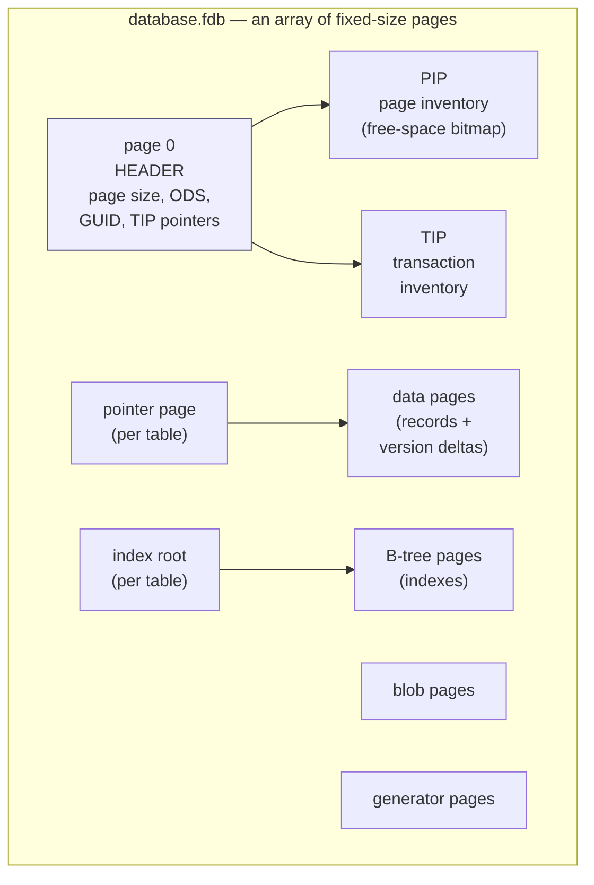
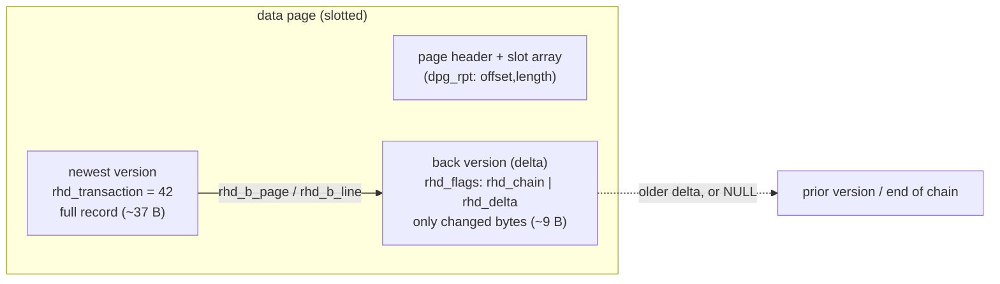
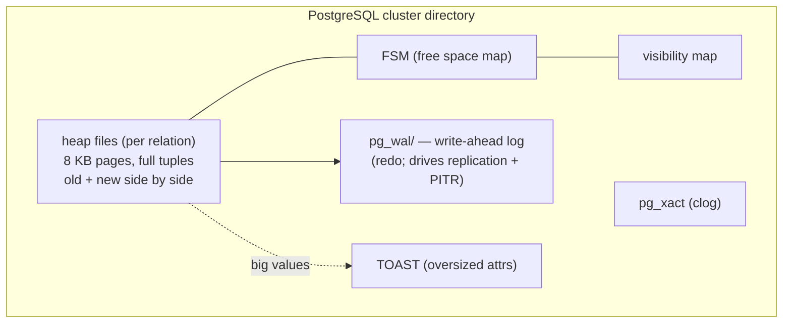
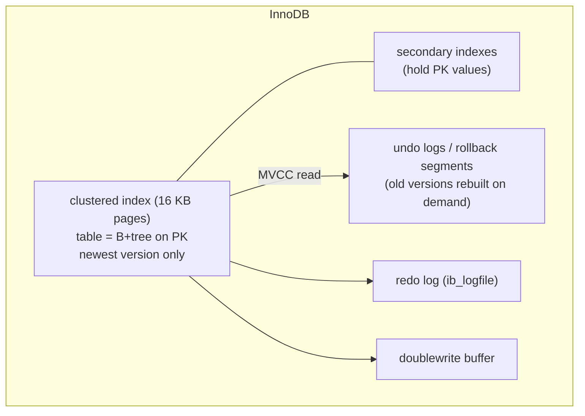
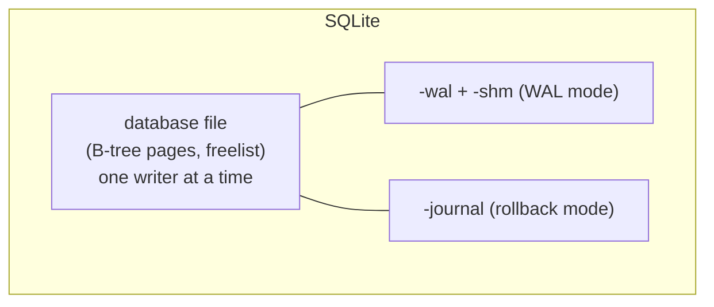

# On-Disk Structure of Firebird Databases

A Firebird database is a **single file** built from fixed-size **pages**, and almost everything distinctive about Firebird — multi-generational concurrency, crash safety without a write-ahead log, self-contained portability — is visible in how those pages are laid out. This document describes the Firebird on-disk structure (ODS), grounded in the authoritative header [`src/jrd/ods.h`](https://github.com/FirebirdSQL/firebird/blob/master/src/jrd/ods.h) of the vendored source and in real `gstat` output from a live Firebird 6 database, and then contrasts it with how PostgreSQL (heap + WAL), MySQL/InnoDB (clustered index + redo/undo) and SQLite (single-file B-tree) store data — with the specific advantages that fall out of Firebird's choices.

It is a companion to the [main paper](README.md) and the other comparison documents: [architecture comparison](architecture-comparison.md), [wire protocol](firebird-wire-protocol.md), [embedded comparison](embedded-architecture-comparison.md) and [replication](replication-architecture.md). The runnable [`samples/`](samples/) programs create and read the very page structures described here.

**Table of Contents**

* [The big picture: one file, many pages](#the-big-picture-one-file-many-pages)
* [The page types](#the-page-types)
* [Inside a data page: records and version deltas](#inside-a-data-page-records-and-version-deltas)
* [MVCC on disk: the transaction inventory](#mvcc-on-disk-the-transaction-inventory)
* [ODS versions](#ods-versions)
* [Inspecting the structure (validated with gstat)](#inspecting-the-structure-validated-with-gstat)
* [Setup and administration](#setup-and-administration)
* [Comparison: PostgreSQL, MySQL/InnoDB, SQLite](#comparison-postgresql-mysqlinnodb-sqlite)
* [Advantages of the Firebird on-disk structure](#advantages-of-the-firebird-on-disk-structure)
* [Further research](#further-research)

## The big picture: one file, many pages

The entire database — data, indexes, metadata (the `RDB$`/`MON$` system tables are just ordinary tables), transaction state, generators, BLOBs, even the encryption plugin name — lives in one file, divided into pages of a single fixed size chosen at creation. In Firebird 6 the page size is **8 KB to 32 KB** (`MIN_PAGE_SIZE = 8192`, `MAX_PAGE_SIZE = 32768`, `DEFAULT_PAGE_SIZE = 8192` in `ods.h`; the 8 KB floor is new in ODS 14 — older versions allowed 4 KB). Page 0 is always the **header page**.



_Figure 1: A Firebird database is one file of fixed-size pages; the header page (page 0) anchors everything_

Every page starts with the same 16-byte header (`struct pag` in `ods.h`): a one-byte **page type**, flags, a **generation** counter, an **SCN** (system change number, used by `nbackup` for incremental backup), and the page's own number for validation. That uniform header is what lets the cache manager and the validation/backup tools treat every page generically.

## The page types

`ods.h` enumerates exactly ten page types (`pag_*`), each a small C struct followed by a variable payload:

| Type | `pag_*` | Role |
|---|---|---|
| Header | `pag_header` (1) | Page 0: page size, ODS version, database GUID, dialect, the four TIP markers, encryption plugin, backup/shutdown/replica mode |
| Page inventory (PIP) | `pag_pages` (2) | A bitmap of free vs used pages — Firebird's free-space map |
| Transaction inventory (TIP) | `pag_transactions` (3) | Two bits per transaction: active / committed / rolled back / limbo |
| Pointer page | `pag_pointer` (4) | Per table: the vector of data-page numbers making up the table, plus per-page state bits |
| Data page | `pag_data` (5) | The records themselves, with their back-version chains |
| Index root | `pag_root` (6) | Per table: one slot per index, pointing at each B-tree's root |
| Index (B-tree) | `pag_index` (7) | The index buckets — prefix-compressed keys, with jump nodes |
| Blob | `pag_blob` (8) | BLOB data (large BLOBs get their own page chains) |
| Generator | `pag_ids` (9) | Sequence (generator) values |
| SCN inventory | `pag_scns` (10) | System-change-number vector for incremental (`nbackup`) backup |

A table is reached by: header page → `PAGES` (the pointer-page directory) → the table's **pointer page(s)** → **data pages**; and its indexes by header → **index root page** → **B-tree pages**. Free space is found through the **PIP** bitmap. There is no separate catalog file, no separate free-space file, no separate log file — it is all pages in the one file.

## Inside a data page: records and version deltas

A data page (`struct data_page`) holds a small header and a **slot array** (`dpg_rpt[]` — each entry an offset + length) that grows from the front, while record data is packed from the back, exactly like a classic slotted page. Each stored record begins with a **record header** (`struct rhd`, 16 bytes):

```
rhd_transaction   -- the transaction that created this version
rhd_b_page        -- back pointer: page of the PRIOR version
rhd_b_line        -- back pointer: slot of the prior version
rhd_flags         -- rhd_deleted, rhd_chain, rhd_delta, rhd_long_tranum, ...
rhd_format        -- table format (schema) version this record was written under
rhd_data[]        -- the (RLE-compressed) record body
```

The crucial fields are `rhd_b_page`/`rhd_b_line` and the `rhd_delta` flag. When a row is updated, Firebird writes the **new** version in place and chains the **old** version behind it via the back pointer — and if `rhd_delta` is set, the old version is stored as **only the bytes that differed**, not a full copy. This is the on-disk form of the multi-generational architecture (MGA) described in the [main paper](README.md#jrd) and the [architecture comparison](architecture-comparison.md#firebird-recap).



_Figure 2: A record and its back-version chain on a data page — old versions are stored as deltas, usually on the same page_

This is why `gstat` below reports an **average version length of 9 bytes against a 37-byte record**: the back-versions really are small deltas. Records too big for a page are split into **fragments** (`rhd_fragment`) chained across pages; very large objects and BLOBs spill to blob pages.

## MVCC on disk: the transaction inventory

Firebird decides which version a transaction may see using state kept entirely on disk, not in a separate log. The **header page** holds four 64-bit markers (`ods.h`, `struct header_page`):

- `hdr_next_transaction` — the next transaction id to hand out.
- `hdr_oldest_transaction` (OIT) — oldest "interesting" (not yet known committed) transaction.
- `hdr_oldest_active` (OAT) — oldest still-running transaction.
- `hdr_oldest_snapshot` (OST) — oldest snapshot still needed; versions older than this are collectible garbage.

The **TIP** stores two bits of state per transaction (active / committed / rolled back / limbo). To check whether a given record version is visible, the engine reads the version's `rhd_transaction`, looks up that transaction's state in the TIP, and compares against its own snapshot — walking the back-version chain until it finds the newest version it is allowed to see. Dead versions (older than the OST) are reclaimed **cooperatively** (any reader that trips over them) and by the background garbage collector / `sweep`. The gap between OIT and OAT is the health signal DBAs watch, and closing it is what `sweep` does.

The headline consequence: **the old versions themselves serve as the "undo" information**, so Firebird needs no undo log — and because pages are written in a careful order that always leaves the file consistent, it needs no redo (write-ahead) log either.

## ODS versions

The ODS major version is stamped in the header page (`hdr_ods_version`) and pins the file to an engine generation (`ods.h`):

| ODS | Engine | Notable |
|---|---|---|
| 12 | Firebird 3 | Unified engine, new page-level features |
| 13.0 | Firebird 4 | Commit-order snapshots, replication, 64-bit transaction ids |
| 13.1 | Firebird 5 | Minor bump (inline upgrade from 13.0) |
| 14.0 | Firebird 6 | Schemas, 8 KB minimum page size, current `ODS_VERSION = ODS_VERSION14` |

A **major** ODS change requires a logical backup/restore cycle (`gbak`) to migrate; a **minor** bump (e.g. 13.0 → 13.1) can be applied inline. The file also records the CPU/OS/compiler it was created on (`hdr_db_impl`) for cross-platform transfer checks — but the on-disk format is otherwise portable across architectures.

## Inspecting the structure (validated with gstat)

Everything above is observable with `gstat`. The following is **real output** from a Firebird 6 database created for this document (a `PEOPLE` table of ~300 rows, each updated twice to create back-versions).

The **header page** (`gstat -h`) shows the page size, ODS 14.0, and the live TIP markers:

```text
    Page size               8192
    ODS version             14.0
    Oldest transaction      8
    Oldest active           9
    Oldest snapshot         9
    Next transaction        10
    Implementation          HW=ARM64 little-endian OS=Linux CC=gcc
    Database GUID:          {C629421E-71E1-43A6-8C30-1B457069BDC6}
    Attributes              force write
```

The **page analysis** (`gstat -a -r`) shows the data-page and index structure — note the FB6 `PUBLIC` schema, the back-versions, and the tell-tale **delta version length**:

```text
"PUBLIC"."PEOPLE" (128)
    Primary pointer page: 293, Index root page: 294
    Total formats: 2, used formats: 1
    Average record length: 37.15, total records: 297
    Average version length: 9.00, total versions: 297, max versions: 1
    Average unpacked length: 332.00, compression ratio: 8.94
    Pointer pages: 1, data page slots: 5
    Data pages: 5, average fill: 62%
    Primary pages: 3, secondary pages: 2

    Index "PUBLIC"."RDB$PRIMARY1" (0)
        Root page: 295, depth: 1, leaf buckets: 1, nodes: 297
        Average key length: 3.00, compression ratio: 0.91
        Average prefix length: 1.72, average data length: 1.00
```

Three things to read here. **`Average version length: 9.00`** against `Average record length: 37.15` is the delta chain in action — the back-versions cost a quarter of a full record. **`compression ratio: 8.94`** (332 bytes unpacked → 37 stored) is Firebird's run-length record compression. And the index's **`Average prefix length: 1.72`** shows B-tree prefix compression: each key stores only the bytes by which it differs from the previous key.

## Setup and administration

Practical knobs, all touching the on-disk structure:

**Choose the page size at creation** (it cannot be changed later without backup/restore):

```sql
CREATE DATABASE 'inet://localhost/data/app.fdb'
    USER 'SYSDBA' PASSWORD 'masterkey'
    PAGE_SIZE 8192           -- 8192..32768; larger pages suit wide rows / big indexes
    DEFAULT CHARACTER SET UTF8;
```

Larger pages reduce B-tree depth and index overhead for big tables and allow larger keys, at the cost of more cache memory per page and more read amplification for tiny random lookups. 8 KB is a sound default; 16–32 KB helps large analytic tables.

**Inspect** with `gstat`:

- `gstat -h <db>` — header page: page size, ODS, TIP markers, GUID, attributes.
- `gstat -a -r <db>` — per-table data-page and index analysis (record/version/fragment lengths, fill distribution, compression, index depth). Needs the `USE_GSTAT_UTILITY` privilege or SYSDBA.
- `gfix -sweep <db>` — force a sweep: collect dead versions and advance the OIT toward the OAT.

**Control version space and garbage.** Data pages normally reserve space so a back-version can be written **in place** (minimising fragmentation); `gfix -use full` / `-use reserve` toggles this, and the header flag `hdr_no_reserve` records it. The **sweep interval** (`gfix -housekeeping N`) sets how large the OIT–OAT gap may grow before an automatic sweep runs; long-running transactions that hold the OAT back are the usual cause of version accumulation (Firebird's analogue of PostgreSQL vacuum pressure).

**Back up and migrate.** `gbak` performs a **logical** backup (portable, and the way to move across a major ODS change); `nbackup` performs a **physical**, page-level incremental backup using the per-page SCN and the header's difference-file mechanism (`hdr_backup_mode`). The [replication document](replication-architecture.md) covers using `nbackup` to seed a replica.

## Comparison: PostgreSQL, MySQL/InnoDB, SQLite

All four are page-oriented, but they differ sharply in *where old versions and recovery information live*.

**PostgreSQL** — 8 KB heap pages in per-relation files, plus a **separate write-ahead log** and side files:



PostgreSQL keeps MVCC old versions as **whole extra tuples in the heap**, tracked by `xmin`/`xmax` against the clog, and reclaimed by **VACUUM**; durability is the classic **ARIES WAL** (see the [architecture comparison](architecture-comparison.md#postgresql)). Every page change is written twice — once to the heap, once to the WAL — and the WAL doubles as the replication and point-in-time-recovery stream.

**MySQL / InnoDB** — the table **is** a clustered B+tree keyed by the primary key, in a tablespace, with old versions in **undo logs** and durability from a **redo log** plus a **doublewrite buffer**:



InnoDB stores only the **newest** row version in the clustered index and **reconstructs** older ones by walking undo logs, which a **purge** thread later reclaims (see the [architecture comparison](architecture-comparison.md#mysql) and [Jeremy Cole's InnoDB series](https://blog.jcole.us/innodb/)). It maintains *two* logs — redo and the server-layer binlog — plus the doublewrite buffer against torn pages.

**SQLite** — one file of B-tree pages, plus a transient rollback journal or WAL:



SQLite's file is a pure B-tree store (tables and indexes as B-trees, a freelist for reuse) with **no per-row version chains** — MVCC-style snapshot isolation exists only at the whole-file level in WAL mode (see the [embedded comparison](embedded-architecture-comparison.md)).

| Aspect | **Firebird** | **PostgreSQL** | **InnoDB** | **SQLite** |
|---|---|---|---|---|
| On-disk unit | 8–32 KB page, one file | 8 KB page, many files | 16 KB page, tablespaces | page (def. 4 KB), one file |
| Table layout | Heap: pointer page → data pages | Heap files | Clustered B+tree on PK | B-tree per table |
| Where old versions live | **Deltas chained in-page** | Whole tuples in the heap | Undo logs (rebuilt on read) | None (whole-file WAL snapshots) |
| Redo / WAL | **None** (careful writes) | WAL (ARIES) | Redo log | Rollback journal or WAL |
| Undo log | **None** (versions are the undo) | None (no-undo MVCC) | Undo logs + purge | N/A |
| Extra durability files | None (one file) | WAL, clog, FSM, VM | Redo, undo, doublewrite, binlog | -wal, -shm, -journal |
| Version cleanup | Cooperative GC + sweep | VACUUM | Purge thread | N/A |
| Free space map | PIP bitmap (in file) | FSM (side file) | Segment/extent metadata | Freelist (in file) |
| Self-contained single file? | **Yes** | No | No | **Yes** |

## Advantages of the Firebird on-disk structure

Against **PostgreSQL's WAL** design:

- **No write-ahead log to write, checkpoint, or tune.** Firebird achieves crash safety by *careful write ordering* — pages are flushed in an order that always leaves the file consistent — so there is no WAL write-amplification (every change hitting both heap and log), no checkpoint storms, no `full_page_writes`, and no WAL volume to provision. (The trade-off: Firebird had no log-based physical replication/PITR, which is exactly why the [journal was added in v4](replication-architecture.md#firebird-evolution-3--4--5--6--future) — a purpose-built change stream rather than repurposing a recovery log.)
- **Back-versions are deltas, in place.** Where PostgreSQL writes a full new tuple per update and leaves the old one to bloat the heap until VACUUM, Firebird stores the prior version as just the changed bytes (the 9-vs-37-byte result above), usually on the same page in reserved space. Less write volume, less bloat per update.

Against **MySQL/InnoDB**:

- **No separate redo log, undo log, or doublewrite buffer.** InnoDB needs all three (plus the binlog); Firebird's multi-generational data pages *are* the undo, and careful writes replace the redo, so there is dramatically less on-disk machinery and no purge-lag from a shared undo tablespace.
- **Old versions don't have to be reconstructed.** InnoDB rebuilds a historical row by applying undo records; Firebird just follows the back-pointer to a version already sitting on the page.

Against **SQLite**:

- **A full multi-writer MVCC format, still in one file.** Firebird keeps SQLite's single-file portability but adds the page types (TIP, per-record version chains, PIP) that let many transactions — and many processes — read and write concurrently without a whole-file lock (see the [embedded comparison](embedded-architecture-comparison.md#the-decisive-difference-concurrency)).

Common to all three comparisons:

- **One self-describing file.** The header page carries the page size, ODS version, GUID, dialect, transaction markers, backup and encryption state — copy the file and you have copied the whole database, its history, and its configuration. No cluster directory, no separate log/undo/catalog files to keep in sync.
- **Uniform page header** (type, generation, SCN, page number) gives every page validation, careful-write ordering, and incremental (`nbackup`) backup for free.

Honest trade-offs: careful-write MGA means **dead versions accumulate and must be swept** (Firebird's version of VACUUM pressure), and the **heap layout is not clustered on the primary key**, so PK range scans can do more random I/O than InnoDB's clustered index. The design optimises for cheap updates, cheap MVCC and operational simplicity over log-based replication and clustered locality — a coherent set of choices, not an accident.

## Hands-on: samples, tests and debugging

### C++ sample — [`samples/cpp/ods_header.cpp`](samples/cpp/ods_header.cpp)

The document's claim is that the file *is* the database — so the sample reads the file. It creates a scratch database through the server, asks `MON$DATABASE` for the server's view of the header numbers, detaches, then opens `/tmp/fbhandson/ods.fdb` directly and decodes page 0 at the exact byte offsets `ods.h` pins with `static_assert`s: the [uniform page header](#the-big-picture-one-file-many-pages) (`pag_type` = 1), `hdr_page_size` at offset 16, the ODS version word at 18 (note the `ODS_FIREBIRD_FLAG` high bit), the [four TIP markers](#mvcc-on-disk-the-transaction-inventory) as 64-bit values at offsets 40–64, and the database GUID. It finishes with a page-type census — byte 0 of every page in the file — reproducing the [page-type table](#the-page-types) from live bytes. Run it on the machine the server runs on (it reads the file the server wrote).

```sh
cmake -B build samples && cmake --build build
./build/ods_header        # default: inet://localhost//tmp/fbhandson/ods.fdb
```

Verified output (every value cross-checked against `gstat -h`, including the GUID):

```text
-- server's view (MON$DATABASE) --
MON$PAGE_SIZE MON$ODS_MAJOR MON$ODS_MINOR MON$OLDEST_TRANSACTION MON$OLDEST_ACTIVE MON$OLDEST_SNAPSHOT MON$NEXT_TRANSACTION
8192          14            0             4                      5                 5                   5

-- header page, parsed from /tmp/fbhandson/ods.fdb (offsets per ods.h) --
pag_type      @0   = 1 (pag_header)
hdr_page_size @16  = 8192
hdr_ods_version @18 = 0x800e -> ODS 14 (FIREBIRD flag 0x8000 set), minor @20 = 0
hdr_flags     @22  = 0x12 (force_write SQL_dialect_3)
hdr_PAGES     @28  = 3   <- pointer page of RDB$PAGES (catalog bootstrap anchor)
hdr_next_transaction   @40 = 5
hdr_oldest_transaction @48 = 4 (OIT)
hdr_oldest_active      @56 = 5 (OAT)
hdr_oldest_snapshot    @64 = 5 (OST)
hdr_guid      @84  = {51592637-C077-4903-8754-42BE2595A5DB}

-- page-type census: 294 pages of 8192 bytes --
  type  1  pag_header                 1
  type  2  pag_pages (PIP)            1
  type  3  pag_transactions (TIP)     1
  type  4  pag_pointer               40
  type  5  pag_data                  97
  type  6  pag_root                  40
  type  7  pag_index (b-tree)       106
  type  9  pag_ids (generators)       1
  type 10  pag_scns                   1
done.
```

The census is the catalog bootstrap made visible: 40 pointer pages and 40 index roots — one pair per on-disk system relation, allocated by `DPM_create_relation` at creation (see [catalog bootstrap](catalog-bootstrap.md); the remaining system relations are virtual `MON$`/`SEC$`-style tables with no pages) — and exactly one TIP, one PIP, one generator page and one SCN page, matching the [page-type table](#the-page-types) row for row.

### JavaScript sample — [`samples/nodejs/ods_header.js`](samples/nodejs/ods_header.js)

The same parse is arguably *more* natural in Node — `Buffer.readUInt16LE(18)`, `readBigUInt64LE(48)` — with no C structs anywhere (`cd samples/nodejs && node ods_header.js`). Two instructive deltas in its verified output: node-firebird creates its scratch database with a **32 KB** page size (the driver's own creation default, unlike `fb_sample.h`'s 8 KB), and the census shows ten pages of **type 0** — pages preallocated by file extension but not yet formatted, a page state the C++ run's smaller file didn't happen to exhibit:

```text
hdr_page_size @16  = 32768
...
-- page-type census: 234 pages of 32768 bytes --
  type  0  ?                         10
  type  1  pag_header                 1
  ...
```

### Things to try

- Point both samples at a copy of `employee.fdb` (`gbak` it, or use any restored copy) and compare the census: user data changes the data/index page mix, not the fixed skeleton.
- Update a few rows in the scratch database, then re-run: watch `hdr_next_transaction` advance while the OIT lags — the OIT–OAT gap this document and the [tuning document](monitoring-and-tuning.md) discuss.
- Extend the parser by one field: `hdr_attachment_id` at offset 72 (compare with `gstat -h`'s "Next attachment ID"), or decode `hdr_db_impl` at 80 (the CPU/OS/CC bytes behind gstat's "Implementation" line).
- Break the file on purpose (on a throwaway copy): flip the page-size word and watch `gstat`/attach reject it with "bad database format"-class errors.

### Debugging this in C++ (gdb)

With a [debug build of the engine](debugging-firebird.md), the read path of this document is a handful of breakpoints:

```gdb
break PAG_header_init      # src/jrd/pag.cpp:1077 — attach reads+validates page 0 (ODS check)
break PAG_init             # src/jrd/pag.cpp:1173 — seeds relation 0's pages from hdr_PAGES
break CCH_fetch            # src/jrd/cch.cpp:778  — every page read; watch page_type arg
break DPM_store            # src/jrd/dpm.epp:2349 — a record landing on a data page
break VIO_chase_record_version  # src/jrd/vio.cpp:1137 — the back-version chain walk
```

`PAG_header_init` fires once per attach: step through it and you watch the engine do exactly what the samples do — read 152 bytes and check `hdr_ods_version` — before anything else touches the file. At `CCH_fetch` the `page_type` argument names which of the ten page types the caller expects (the same constants as the census), and in `DPM_store` the `rpb` (record parameter block) carries the record header fields — `rpb_transaction_nr`, `rpb_b_page`/`rpb_b_line` — that this document's [data-page section](#inside-a-data-page-records-and-version-deltas) describes on disk; `VIO_chase_record_version`'s loop over those back pointers is the MVCC visibility walk itself. See the [debugging guide](debugging-firebird.md) for attaching to the embedded engine so the breakpoints land in your own process.

## Further research

**Firebird**

- [`src/jrd/ods.h`](https://github.com/FirebirdSQL/firebird/blob/master/src/jrd/ods.h) — the authoritative on-disk structure: every page type and record header, with static asserts pinning the byte layout.
- [`doc/README.DiskSpaceAllocation`](https://github.com/FirebirdSQL/firebird/blob/master/doc/README.DiskSpaceAllocation) — how the engine allocates pages and reserves version space.
- The [main paper](README.md#jrd) (JRD, virtual IO) and the [architecture comparison](architecture-comparison.md#firebird-recap) (MGA, careful writes) for the engine side of these pages.
- `gstat` and `gfix` are documented in the Firebird [language and utilities reference](https://firebirdsql.org/file/documentation/pdf/en/refdocs/fblangref50/firebird-50-language-reference.pdf).

**PostgreSQL**

- [Database page layout](https://www.postgresql.org/docs/current/storage-page-layout.html), [Database file layout](https://www.postgresql.org/docs/current/storage-file-layout.html), [WAL internals](https://www.postgresql.org/docs/current/wal-internals.html), [TOAST](https://www.postgresql.org/docs/current/storage-toast.html).

**MySQL / InnoDB**

- [InnoDB file-space management](https://dev.mysql.com/doc/refman/8.4/en/innodb-file-space.html), [redo log](https://dev.mysql.com/doc/refman/8.4/en/innodb-redo-log.html), [undo logs](https://dev.mysql.com/doc/refman/8.4/en/innodb-undo-logs.html), [doublewrite buffer](https://dev.mysql.com/doc/refman/8.4/en/innodb-doublewrite-buffer.html); Jeremy Cole's [InnoDB on-disk series](https://blog.jcole.us/innodb/).

**SQLite**

- [The SQLite database file format](https://sqlite.org/fileformat2.html), [Atomic commit](https://sqlite.org/atomiccommit.html).

**Background**

- [Architecture of a Database System](https://dsf.berkeley.edu/papers/fntdb07-architecture.pdf) (Hellerstein, Stonebraker, Hamilton) — slotted pages, heap vs clustered storage, and recovery, the theory beneath every layout above.
