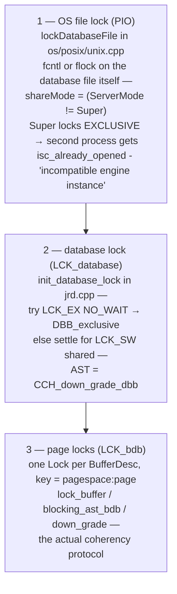
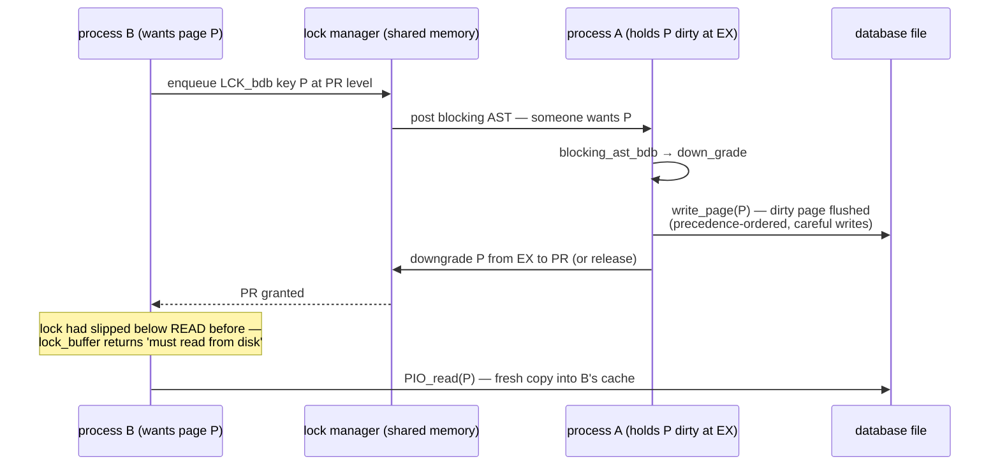

# The Page Cache and Cross-Process Coherency

The [request-trace document](request-lifecycle-code-trace.md#stage-9-commit--deferred-work-and-the-write-to-disk) met the page cache (CCH) as the write path's staging area; the [on-disk structure document](on-disk-structure.md) explained careful writes. This document covers the cache's hardest job, and the deepest use of the [lock manager](request-lifecycle-code-trace.md#stage-8-the-lock-handler-and-the-lock-manager) in the whole engine: keeping **multiple private page caches coherent across OS processes**. In Classic mode — and whenever embedded attachments from different processes open the same file — every process has its *own* buffer cache of the *same* database, and a page one process modifies must not be stale in another. Firebird solves this with per-buffer **`LCK_bdb` page locks** and the **blocking-AST protocol**: a distributed cache-coherency machine of the kind otherwise found in cluster databases, running quietly inside every multi-process Firebird setup since the 1980s. All of it is demonstrated live below — including a lock-table snapshot showing **two processes holding 106 shared page locks on the same pages**, and 1 379 blocking ASTs fired during a page ping-pong.

SuperServer sidesteps the machinery (one process, one cache, threads and latches) — the Classic-vs-Super contrast is the [ServerMode story](deployment-and-operations.md) at its lowest level.

**Table of Contents**

* [Why coherency is a problem at all](#why-coherency-is-a-problem-at-all)
* [Three layers of arbitration](#three-layers-of-arbitration)
* [The page-lock protocol: PR, EX and the blocking AST](#the-page-lock-protocol-pr-ex-and-the-blocking-ast)
* [Data travels through the disk](#data-travels-through-the-disk)
* [Latches vs locks: the two-level design](#latches-vs-locks-the-two-level-design)
* [Coherency in action (validated)](#coherency-in-action-validated)
* [Comparison: PostgreSQL, MySQL, SQLite](#comparison-postgresql-mysql-sqlite)
* [Discussion](#discussion)
* [Further research](#further-research)

## Why coherency is a problem at all

A Classic-mode server runs **one process per connection**; embedded applications are separate processes by definition. Each such process instantiates the full engine with a private `BufferControl` and its own `BufferDesc` array — there is no shared page memory between them. Yet all of them read and write one file, under [MVCC](transactions-and-concurrency.md) rules that assume everyone sees committed page states. Without a protocol, process A could modify a data page in its cache while process B keeps serving the old copy from its own. The protocol is the subject of this document; the alternative — a single shared cache — is what SuperServer chooses, at the price of all connections living in one process.

## Three layers of arbitration

Coexistence is negotiated at three levels, each visible in the sources:



_Figure 1: Three nested layers — a kernel file lock gates whole engine instances, the database lock detects whether anyone else is present, and page locks arbitrate individual buffers_

Layer 1 explains an error every Firebird operator eventually meets (and which the [GC document's demos](garbage-collection-and-sweep.md#gc-internals-in-action-validated) hit live): with `ServerMode = Super` the engine takes an **exclusive** `fcntl`/`flock` write-lock on the file at open, so a second process — `gstat -a`, an embedded tool, another server — is refused at the kernel with *"Database already opened with engine instance, incompatible with current"*. Classic, SuperClassic and embedded builds lock **shared**, and coexistence proceeds to layer 2.

Layer 2 is opportunistic: every attaching engine first tries the `LCK_database` lock at `LCK_EX` with no wait ([`jrd.cpp`](https://github.com/FirebirdSQL/firebird/blob/master/src/jrd/jrd.cpp), `init_database_lock`). Success means *nobody else is here* (`DBB_exclusive`); failure drops to `LCK_SW` and shared operation. The lock's AST is `CCH_down_grade_dbb`: when a lone holder is knocked on by a newcomer, it flushes and downgrades, clearing the cache's `BCB_exclusive` flag — the design intent being that a process which *knows* it is alone can skip page locks entirely. (A wrinkle of the current FB6 master: the line *setting* `BCB_exclusive` at cache init is commented out — `// TODO detect real state using LM` — so this branch presently maintains page locks even when alone, pending rework; the downgrade path and the assertion `fb_assert(!(bcb_flags & BCB_exclusive))` in `lock_buffer` still document the intended fast path.)

## The page-lock protocol: PR, EX and the blocking AST

Layer 3 is the machine itself ([`cch.cpp`](https://github.com/FirebirdSQL/firebird/blob/master/src/jrd/cch.cpp)). Every in-cache page owns a `Lock` of series **`LCK_bdb`** keyed by (page space, page number). Only two levels are used, aliased in [`lock_proto.h`](https://github.com/FirebirdSQL/firebird/blob/master/src/lock/lock_proto.h): **`LCK_read = LCK_PR`** (protected read — any number of caches may hold the page for reading, none may write) and **`LCK_write = LCK_EX`** (exclusive — one cache holds the page to modify it).

* **`lock_buffer`** — called under `CCH_fetch`: acquires PR (or EX if the fetch intends to write). Its return value encodes the coherency insight: *"If the lock ever slipped below READ, indicate that the page must be read"* — a buffer whose lock was taken away is by definition possibly stale, so re-acquiring the lock forces a fresh disk read. Lock possession *is* cache validity.
* **`blocking_ast_bdb`** — fires inside the holding process (on its [AST thread](request-lifecycle-code-trace.md#stage-8-the-lock-handler-and-the-lock-manager)) when another cache wants an incompatible level. It establishes engine context and calls:
* **`down_grade`** — the heart. If the buffer is clean, downgrade/release the lock immediately. If **dirty**: *write the page to disk first*, honoring [careful-write precedence](on-disk-structure.md) (the `high` recursion parameter handles the case where this page can't go out before a higher-precedence page does), then downgrade. If the buffer is momentarily latched by a local thread, mark it `BDB_blocking` and let the release path finish the job.



_Figure 2: The coherency round trip — B's request triggers an AST in A, A flushes and downgrades, and B reads the current page from the file_

## Data travels through the disk

Figure 2 contains the design's quietest profundity: there is **no cache-to-cache page shipping**. The medium through which a modified page moves from A's cache to B's cache is *the database file itself*. A's obligation on downgrade is exactly its normal durability obligation — write the dirty page (in precedence order) — and B's recovery action is exactly its normal miss action — read the page. Coherency introduces no new data path, no sockets between processes, no shared page memory; the lock manager carries only *permissions*, never pages. Compare Oracle RAC, whose Cache Fusion ships blocks between node caches over a dedicated interconnect precisely to avoid this disk round trip: Firebird takes the simple half of that trade — slower page migration, zero additional infrastructure — which is proportionate for processes that share a local disk anyway. The same protocol is also why a [no-WAL engine](on-disk-structure.md) can allow multi-process writes at all: any page another process can see has, by protocol, already been carefully written.

## Latches vs locks: the two-level design

Cross-process locks are expensive (shared-memory mutex, hash lookup, possible AST). So the cache runs **two concurrency layers**: within a process, threads coordinate on each `BufferDesc` with plain `SyncObject` latches (`bdb_syncPage`, `bdb_syncIO` — microseconds, no lock manager); the `LCK_bdb` lock is touched only at cache-entry, cache-exit and coherency events. SuperServer's shared cache is thus the degenerate case where *only* the latch layer does real work — and Classic's per-process caches are the case where both layers earn their keep. One codebase, one `cch.cpp`, both topologies — the [single-binary ServerMode design](deployment-and-operations.md) reaching all the way down to the buffer pool.

## Coherency in action (validated)

The live server runs SuperServer (whose exclusive file lock forbids visitors), so the demo builds a private embedded sandbox: a `FIREBIRD=/tmp/fbemb` root — symlinks to the real `plugins/`, `intl/`, `tzdata/`, plus a copied `firebird.conf` with **`ServerMode = SuperClassic`** — giving every process that inherits the variable a shared-mode engine. Two `isql` processes then attach **embedded** (local path, no server) to one fresh database.

**No lost updates across private caches.** Process A ran repeated `UPDATE t SET v = v + 1 WHERE id = 1; COMMIT;` while process B did the same for `id = 2` — different rows, *same data page*, so the page ping-pongs between the two caches. A first pass of 300 rounds each ended with both rows at **exactly 300** — not one update lost between two independent full engines writing the same page; a heavier 2 000-round pass (error-free on both sides) produced the lock-table numbers below.

**The lock table, mid-flight** (`fb_lock_print -f /tmp/firebird/fb_lock_…`):

```
Owners (2):  Process id: 123823 (Alive) ... Process id: 123824 (Alive)
Enqs:   7376, Converts:     12, Rejects:      7, Blocks:   1379
Mutex wait: 6.0%
```

Two owner processes; 7 376 lock enqueues; and **1 379 blocks** — each one a blocking event posting an AST that asks the other cache to flush-and-downgrade a page. The 6 % mutex wait is the shared lock table itself feeling the ping-pong.

**Two caches holding the same pages.** With both attachments held open after touching data, the lock listing (`-l`) shows 106 `LCK_bdb` blocks like:

```
Series: 3, State: 3, ...
Key: 0001:000003, Pending request count: 0
Requests (2):
    Request 100216, Owner: 78392, State: 3 (3)
    Request 101288, Owner: 79704, State: 3 (3)
```

Series 3 is `LCK_bdb`; the key is page space 1, page 3; state 3 is `LCK_PR` — **both processes hold the same page, for read, simultaneously**, each copy validated by its granted lock. Every cached page in either process has such an entry; the one `LCK_database` lock (series 1) shows both owners at SW, exactly as `init_database_lock`'s fallback predicts.

(Practical notes: `fb_lock_print -d` can fail with *"Unable to access lock table"* while owners are actively remapping the section — pointing `-f` at the `fb_lock_*` file directly is more reliable; and the SuperServer refusal that forces the sandbox is layer 1's `fcntl` lock, not policy — the same `isc_already_opened` seen when `gstat -a` meets a running Super server.)

## Comparison: PostgreSQL, MySQL, SQLite

| | **Firebird (Classic/embedded)** | **PostgreSQL** | **MySQL / InnoDB** | **SQLite** |
|---|---|---|---|---|
| Cache topology | **one private cache per process** | one `shared_buffers` pool mapped by every backend | one buffer pool, one process | one private page cache per connection |
| Coherency mechanism | DLM page locks + blocking ASTs, data via disk | none needed — physically shared memory | none needed — shared address space | none — whole-file/WAL locking serializes; readers detect the file changed and **drop their entire cache** |
| Cross-process writers | yes, full MVCC concurrency | yes (shared cache makes it moot) | no (single process) | one writer at a time, page-level sharing impossible |
| Analog in the wider world | VMS DLM heritage; the single-node ancestor of Oracle RAC-style cache coherency (minus block shipping) | classic shared-memory design | classic single-process design | file-lock design |

The framing that makes Firebird's position clear: **PostgreSQL and InnoDB avoid the coherency problem by construction** — one shared cache, so there is nothing to keep coherent; their engineering effort goes into latching *within* that cache. **SQLite hits the same problem Firebird does** — genuinely private caches over one file — and solves it with a sledgehammer: a connection that detects the database changed under it (via the header's change counter) invalidates *everything* and rereads, and only one writer may exist at all. **Firebird is alone in this group** in running a real page-granular multi-cache coherency protocol — the kind of machinery that elsewhere only appears in cluster databases — which is precisely what lets N independent *processes* (a web app's embedded workers, Classic connections, a `gbak` run) write one database concurrently with full MVCC semantics. That capability, inherited from InterBase's VMS days, remains the architectural moat of the [embedded story](embedded-architecture-comparison.md).

## Discussion

This document shows the lock manager under its heaviest load: the [trace document](request-lifecycle-code-trace.md) showed the lock table's structure, the [GC document](garbage-collection-and-sweep.md) its record-level uses, the [events document](firebird-events.md) its shared-memory sibling, and the [lock-manager document](lock-manager.md) dissects the protocol itself — and here is the load it was actually built to carry: thousands of page locks, AST traffic on every cache conflict, all invisible to SQL. The protocol's elegance is its economy — cache validity *is* lock possession, cache-to-cache transfer *is* the ordinary flush-and-read, and the whole thing degrades to nearly free when a process discovers it is alone. Its cost is equally honest: every Classic page miss talks to a shared-memory table, and hot-page ping-pong turns commits into forced writes — the fundamental reason SuperServer's shared cache is the default and Classic is the choice for isolation over throughput.

## Hands-on: samples, tests and debugging

### C++ sample — [`samples/cpp/page_cache.cpp`](samples/cpp/page_cache.cpp)

The same hot-page ping-pong run against both cache topologies, with per-attachment `MON$IO_STATS` as the referee. The parent process never touches Firebird — it only forks/execs children, because each **phase 2 child is a full embedded engine**: the sample builds the [SuperClassic sandbox](#coherency-in-action-validated) itself (`/tmp/fbhandson/fbemb` — symlinks to the real `plugins/`, `intl/`, `tzdata/`, plus a one-line `firebird.conf`), so the two workers attach by local path with shared file locks and *private* page caches. Rows 1 and 2 share one data page; each worker commits 300 updates to its own row.

```sh
cmake -B build samples && cmake --build build
./build/page_cache
```

Verified output:

```text
phase 1: two client processes, ONE SuperServer shared cache
  worker pid 203824 row 1: 300 commits | page fetches=8435   reads=53   writes=879
  worker pid 203825 row 2: 300 commits | page fetches=13089  reads=57   writes=893
  final: id=1 v=300 (expected 300)
  final: id=2 v=300 (expected 300)
phase 2: two EMBEDDED engine processes, PRIVATE page caches
  worker pid 203876 row 1: 300 commits | page fetches=17444  reads=1044 writes=913
  worker pid 203877 row 2: 300 commits | page fetches=17272  reads=1038 writes=912
  final: id=1 v=300 (expected 300)
  final: id=2 v=300 (expected 300)
same workload — the private caches paid for coherency in disk I/O.
```

The `reads` column is the protocol made visible: ~55 physical reads per worker under the shared cache (startup metadata only) versus **~1 040** under private caches — every ping-pong is a blocking AST, a flush in the holder, a downgrade, and a forced re-read in the requester, exactly Figure 2's round trip, because [data travels through the disk](#data-travels-through-the-disk). And both phases end at `v=300`/`v=300`: not one update lost between two independent engines writing one page. (Writes are similar in both phases — the created databases run with forced writes on, so commits flush either way; coherency's own price shows up as *reads*.)

### fb-cpp sample — [`samples/fb-cpp/page_cache.cpp`](samples/fb-cpp/page_cache.cpp)

The same two-topology experiment through [fb-cpp](https://github.com/asfernandes/fb-cpp) (vendored at [`extern/fb-cpp`](extern/fb-cpp)), the modern C++20 wrapper over the OO API. The instructive diff is the referee query: the three `MON$IO_STATS` counters land directly in a plain struct via `att.queryFirstRowAs<IoStats>(...)` — no message buffer, no per-column extraction — and the check phase reads its rows as `std::optional` through `getInt32(i).value_or(-1)`. The fork/exec choreography and the self-built SuperClassic sandbox are unchanged, because cache topology is decided by the connection string, not by the wrapper.

```sh
cmake -B build samples && cmake --build build   # needs libboost-dev + libboost-filesystem-dev
./build/fbcpp_page_cache
```

Verified: the same coherency price as the OO-API run — phase 1 (shared cache) reads=36 and 78 per worker, phase 2 (private caches) reads=1053 and 1047, with writes near 900 in both phases and the checker reporting `id=1 v=300` and `id=2 v=300` — no lost updates in either topology. (The first cut of the check loop called `fetchNext()` straight after `execute()` and silently skipped row 1 — `Statement::execute()` already lands on the first row, a real fb-cpp idiom difference worth remembering; reported upstream as [fb-cpp#59](https://github.com/asfernandes/fb-cpp/issues/59).)

### JavaScript sample — [`samples/nodejs/page_cache.js`](samples/nodejs/page_cache.js)

node-firebird is a wire-protocol client, so it can only reach the server's one shared cache — it is the twin of phase 1, and phase 2 is C++-only by nature (you cannot run an embedded engine from a socket). Two connections, same 300-round ping-pong (`cd samples/nodejs && node page_cache.js`):

```text
  conn A (row 1): page fetches=16048 reads=87 writes=908
  conn B (row 2): page fetches=4932 reads=0 writes=924
  A sees B's row: v=300; B sees A's row: v=300 (expected 300)
```

Conn B performed **zero** physical reads — thousands of logical fetches all served from buffers conn A's writes kept hot. That is what "coherency by shared memory" means: the SuperServer case has nothing to keep coherent.

### Things to try

- Give the two rows their own pages (`create table t (id int primary key, v int, pad char(4000))` forces ~one row per 8K page) and rerun: phase 2's `reads` collapse — no shared page, no ping-pong, the protocol goes quiet.
- Point `fb_lock_print -f` at the sandbox's lock table (under `/tmp/firebird*` for the `/tmp/fbhandson/fbemb` root) mid-run of phase 2: series-3 (`LCK_bdb`) locks with two owners, plus a climbing `Blocks:` counter — each block one AST, as in the [validated section](#coherency-in-action-validated).
- Change the sandbox's `firebird.conf` to `ServerMode = Super` and rerun phase 2: the second worker fails with `isc_already_opened` — layer 1's exclusive `fcntl` lock, live.
- Raise `ROUNDS` to 2000 and watch reads scale linearly in phase 2 but stay flat in phase 1.

### Debugging this in C++ (gdb)

The C++ sample's phase-2 workers run the whole engine in-process, so attach gdb to one worker (or run one under gdb with the other free-running) per the [debugging guide](debugging-firebird.md):

```gdb
break lock_buffer         # cch.cpp:4071 — page entering the cache; return value says "reread needed"
break blocking_ast_bdb    # cch.cpp:2592 — fires in the HOLDER when the other process wants the page
break down_grade          # cch.cpp:3367 — the heart: flush-if-dirty, then downgrade
break CCH_fetch           # cch.cpp:778  — every page access funnels here
break init_database_lock  # jrd.cpp:7732 — layer 2's EX-probe-then-SW dance at attach
```

`blocking_ast_bdb` is the one worth sitting on: it fires on the AST thread, *not* on any thread running your SQL — the backtrace shows the lock manager's delivery path instead of a statement, which is the clearest possible demonstration that coherency runs beside the query engine, not inside it. Once in `down_grade`, `bdb->bdb_flags & BDB_dirty` decides whether you'll see a `write_page` call before the lock is released (the careful-writes handoff), and stepping to the *other* process shows its next `lock_buffer` returning "lock slipped below READ — page must be read". `lockDatabaseFile` (`os/posix/unix.cpp:969`) is layer 1 if you want to watch the `fcntl` itself.

## Further research

* [`src/jrd/cch.cpp`](https://github.com/FirebirdSQL/firebird/blob/master/src/jrd/cch.cpp) — `lock_buffer`, `blocking_ast_bdb`, `down_grade`, `CCH_down_grade_dbb`; read `down_grade`'s precedence handling against the [careful-writes section](on-disk-structure.md).
* [`src/jrd/os/posix/unix.cpp`](https://github.com/FirebirdSQL/firebird/blob/master/src/jrd/os/posix/unix.cpp) — `lockDatabaseFile`: layer 1 in thirty lines.
* [`src/jrd/jrd.cpp`](https://github.com/FirebirdSQL/firebird/blob/master/src/jrd/jrd.cpp) — `init_database_lock`: the EX-probe-then-SW dance.
* `fb_lock_print` — the observability tool this document's demos lean on; `-o` for owners, `-l` for locks, `-h` for recent lock-table history.
* Companion docs: [request trace](request-lifecycle-code-trace.md) (the lock manager itself) · [deployment](deployment-and-operations.md) (ServerMode) · [embedded comparison](embedded-architecture-comparison.md) (why multi-process matters) · [on-disk structure](on-disk-structure.md) (careful writes, the protocol's durability half).
