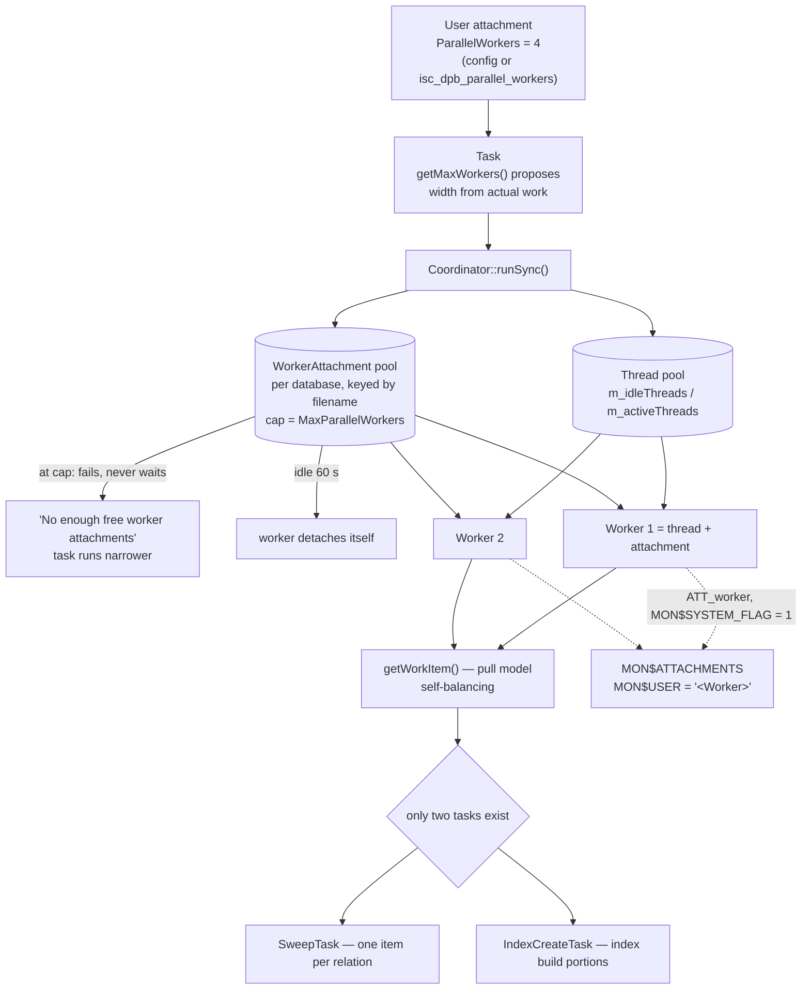

# Parallel Workers — parallelism built out of attachments

*A companion to [Conceptual Architecture of Firebird](README.md). Grounded in the vendored [`extern/firebird`](extern/firebird) source (Firebird 6, `master`) and verified against a live Firebird 6 server.*

---

## Table of contents

* [Why parallel workers deserve their own document](#why-parallel-workers-deserve-their-own-document)
* [The unit of parallelism is an attachment](#the-unit-of-parallelism-is-an-attachment)
* [Two pools, not one](#two-pools-not-one)
* [The task framework](#the-task-framework)
* [What is actually parallelized](#what-is-actually-parallelized)
* [Two knobs, both defaulting to off](#two-knobs-both-defaulting-to-off)
* [Live demonstrations](#live-demonstrations)
* [Comparison: PostgreSQL, MySQL, SQLite](#comparison-postgresql-mysql-sqlite)
* [Further reading](#further-reading)

---

## Why parallel workers deserve their own document

Firebird 5's headline engine feature is named in six documents in this collection and explained in a subsection of [the main paper](README.md#firebird-5-2024-parallel-execution-inside-the-engine). It is the last item on the list of things this collection leans on without opening.

It is worth opening because of *how* Firebird did it. When an engine gains parallelism, the expected shape is a thread pool and a work queue — threads are the cheap unit, and a query executor hands them slices of work. Firebird's answer is different and characteristic: the unit of parallel work is a full internal **database attachment**, pooled per database and borrowed for the duration of a task. Threads are involved, but they are the secondary abstraction.

That choice is the same instinct the [lock manager](lock-manager.md) document identifies as Firebird's habit — build one general mechanism and reuse it everywhere, rather than specialize per problem. An attachment already carries everything a unit of engine work needs: a `thread_db` context, a [memory pool](memory-management.md), transaction context, lock ownership, statistics groups, and a slot in the [monitoring tables](monitoring-and-tuning.md). Making the worker an attachment means none of that has to be reinvented, and it means parallel workers are visible to a DBA through the same `MON$` tables as everything else — which the live section below shows directly.

---

## The unit of parallelism is an attachment

A worker is created by [`WorkerStableAttachment::create()`](extern/firebird/src/jrd/WorkerAttachment.cpp#L468)'s sibling path, and the flag it sets says what it is — [`ATT_worker`](extern/firebird/src/jrd/Attachment.h#L171):

```cpp
inline constexpr ULONG ATT_worker = 0x800000L; // Worker attachment, managed by the engine
```

There are two creation routes, and which one runs depends on [ServerMode](threading-and-synchronization.md). Under `Super` the engine builds a lightweight system attachment directly in-process. Under `Classic` it performs a genuine attach, with a DPB that is worth reading, from [`WorkerAttachment::doAttach()`](extern/firebird/src/jrd/WorkerAttachment.cpp#L481):

```cpp
ClumpletWriter dpb(ClumpletReader::Tagged, MAX_DPB_SIZE, isc_dpb_version1);
dpb.insertString(isc_dpb_trusted_auth, DBA_USER_NAME);
dpb.insertInt(isc_dpb_worker_attach, 1);

JAttachment* jAtt = jInstance->attachDatabase(status, dbb->dbb_filename.c_str(),
    dpb.getBufferLength(), dpb.getBuffer());
```

A real connection to the database, authenticated as `SYSDBA` through trusted auth, tagged as a worker. Note what this does *not* do: it does not spawn a server process. Even in Classic architectures, worker attachments are embedded in the process that created them, so parallelism never multiplies the process count.

---

## Two pools, not one

The subsystem maintains two independent pools, and keeping them distinct is the key to reading the code.

**Attachments** are pooled by [`WorkerAttachment`](extern/firebird/src/jrd/WorkerAttachment.h#L83), one pool per database, held in a static map keyed by database filename. [`getAttachment()`](extern/firebird/src/jrd/WorkerAttachment.cpp#L276) pops an idle worker if one exists and creates a new one otherwise:

```cpp
StableAttachmentPart* sAtt = NULL;
while (!item->m_idleAtts.isEmpty())
{
    ...
    sAtt = item->m_idleAtts.pop();
    if (sAtt->getHandle())
    {
        status->init();
        break;
    }
    ...
}

if (!sAtt)
{
    if (item->m_activeAtts.getCount() >= maxWorkers)
    {
        (Arg::Gds(isc_random) << Arg::Str("No enough free worker attachments")).copyTo(status);
        return NULL;
    }
```

At the cap the call **fails rather than waits**. That is a deliberate choice: a task that cannot get its full complement of workers proceeds with fewer, or with none, rather than blocking behind another task's parallelism. Parallel execution is an optimization, and an optimization that can stall is worse than one that quietly declines.

Idle workers do not live forever — [`WORKER_IDLE_TIMEOUT`](extern/firebird/src/jrd/WorkerAttachment.cpp#L49) is 60 seconds, after which the attachment detaches itself. In Classic architectures the pool is also torn down as soon as the last user connection leaves the database.

**Threads** are pooled separately, by [`Coordinator`](extern/firebird/src/common/Task.h#L110), which holds `m_idleThreads` and `m_activeThreads` alongside its worker list — with a candid `// todo: move to thread pool` comment marking the seam where this would be generalized.

So a running parallel worker is the pairing of a borrowed thread with a borrowed attachment, and the two are reclaimed on different schedules.

---

## The task framework

The generic half lives in [`Task.h`](extern/firebird/src/common/Task.h#L48), and its comment describes the whole design:

```cpp
// Task (probably big one), contains parameters, could break whole task by
// smaller items (WorkItem), handle items, track common running state, track
// results and error happens.
class Task
{
public:
    class WorkItem { ... };

    virtual bool handler(WorkItem&) = 0;
    virtual bool getWorkItem(WorkItem**) = 0;
    virtual bool getResult(IStatus* status) = 0;

    // evaluate task complexity and recommend number of parallel workers
    virtual int getMaxWorkers() { return 1; }
};
```

Three layers, cleanly separated:

| Layer | Responsibility |
|---|---|
| [`Task`](extern/firebird/src/common/Task.h#L48) | Knows the work. Splits itself into `WorkItem`s, handles one, collects results. |
| `Worker` | Executes items from a task; bound to a thread. |
| [`Coordinator`](extern/firebird/src/common/Task.h#L110) | Allocates workers and threads, binds them, runs the task to completion via `runSync()`. |
| [`WorkerThread`](extern/firebird/src/common/Task.h#L163) | The OS thread, with its own `STARTING / IDLE / RUNNING / STOPPING / SHUTDOWN` lifecycle. |

The line worth dwelling on is [`getMaxWorkers()`](extern/firebird/src/common/Task.h#L73), whose comment reads *"evaluate task complexity and recommend number of parallel workers."* **The task decides how much parallelism it deserves**, not the coordinator and not the configuration. The configuration sets a ceiling; the task proposes a number under it based on how much work it actually has. `SweepTask`'s implementation is as direct as it gets — one worker per relation it has to sweep:

```cpp
int getMaxWorkers()
{
    return m_items.getCount();
}
```

This is a pull model. `getWorkItem()` hands out the next unit on demand, so workers that finish early come back for more and the work self-balances without the coordinator estimating anything.

---

## What is actually parallelized

Two tasks in the engine, and that is the complete list:

| Task | Source | Unit of work |
|---|---|---|
| [`SweepTask`](extern/firebird/src/jrd/vio.cpp#L193) | `vio.cpp` | One relation per work item |
| [`IndexCreateTask`](extern/firebird/src/jrd/idx.cpp#L211) | `idx.cpp` | Portions of an index build |

Sweep covers both manual (`gfix -sweep`) and automatic sweep, tying into [garbage collection and sweep](garbage-collection-and-sweep.md). Index creation covers `CREATE INDEX`, `ALTER INDEX ... ACTIVE`, and — the case with the most practical impact — the index rebuilds that `gbak` performs during a restore.

Note what is *not* here: **there is no parallel query execution.** A `SELECT` runs in one thread regardless of these settings. The [optimizer](query-optimizer-and-execution.md) does not produce parallel plans, and no record source distributes itself across workers. This is the sharpest difference from PostgreSQL and the point most likely to be misread from the feature's name.

The utilities expose the setting through their own switches — `gfix -parallel n` (documented for `-sweep` and `-icu`) and `gbak -parallel n` — which reach the engine as the SPB items `isc_spb_rpr_par_workers` and `isc_spb_bkp_parallel_workers`, and ultimately as `isc_dpb_parallel_workers` on the attachment.

---

## Two knobs, both defaulting to off

From [`config.h`](extern/firebird/src/common/config/config.h#L300):

```cpp
{TYPE_INTEGER,  "ParallelWorkers",      true,   1},
{TYPE_INTEGER,  "MaxParallelWorkers",   true,   1},
```

- **`ParallelWorkers`** — the default number of workers a single attachment may use. Overridable per attachment via `isc_dpb_parallel_workers`, which takes priority.
- **`MaxParallelWorkers`** — a per-process, per-database ceiling on simultaneously active workers.

Both default to **1**, which means no additional workers. Parallelism in Firebird is opt-in twice over: raising `ParallelWorkers` alone achieves nothing if `MaxParallelWorkers` still caps the pool at one, which the live section demonstrates by accident.

The counting convention is the other thing to get right, and the [feature documentation](https://github.com/FirebirdSQL/firebird/blob/master/doc/README.parallel_features) states it plainly: with `ParallelWorkers = 4` the engine uses *three additional* worker attachments — four attachments in four threads, the user's included. The number is the total width, not the number of helpers.



*Figure 1: A worker is a borrowed thread paired with a borrowed attachment. The task proposes the width; the configuration caps it; the pool declines rather than blocks.*

---

## Live demonstrations

Captured against a running Firebird 6 server (`LI-T6.0.0.2076`, engine 6.0.0, `ServerMode` default `Super`), on a 600,000-row table. `firebird.conf` was modified for these runs and restored to its original state afterwards.

**An important limitation, stated up front: the test machine has one CPU core (`nproc` = 1).** Every measurement below is therefore an architectural observation, not a scaling result. No speedup from parallelism is demonstrable on this hardware, and none is claimed.

### Workers are attachments, and you can watch them appear

With `MaxParallelWorkers = 8` and `ParallelWorkers = 4`, polling `MON$ATTACHMENTS` while a `CREATE INDEX` runs:

```
                      ATTS   SYSTEM_ATTS
before the build         4             2
during the build         7             5      <-- three appeared
during the build         7             5
after the build          3             2      <-- and went away
```

Three additional system attachments for the duration of the build, then gone. Three workers plus the user's own attachment is four — exactly `ParallelWorkers`, confirming the counting convention.

Looking at them individually while the build runs:

| ATT | MON$USER | SYS | PROTOCOL |
|---:|---|---:|---|
| 77 | `SYSDBA` | 0 | TCPv4 |
| 78 | `Cache Writer` | 1 | `<null>` |
| 79 | `Garbage Collector` | 1 | `<null>` |
| 80 | `<Worker>` | 1 | `<null>` |
| 81 | `<Worker>` | 1 | `<null>` |
| 82 | `<Worker>` | 1 | `<null>` |

`MON$USER = '<Worker>'`, `MON$SYSTEM_FLAG = 1`, and no remote protocol because there is no network connection behind them. They sit in the table beside `Cache Writer` and `Garbage Collector` — the same system-attachment census [the threading document](threading-and-synchronization.md) takes, now with three transient additions. This is the architectural claim of this document, visible in a monitoring table: **parallel workers are not threads with a work queue, they are connections.**

### Both knobs must be raised

Before changing anything, with both settings at their default of 1:

```
$ gfix -sweep -parallel 4 localhost:/tmp/par.fdb -user SYSDBA -password masterkey
  sweep: 4.07 s
```

`gfix -parallel 4` sets `isc_dpb_parallel_workers` on its attachment, but `MaxParallelWorkers = 1` caps the pool at a single worker, so the request has no effect. The DPB value takes priority over `ParallelWorkers`, not over `MaxParallelWorkers` — the ceiling is a ceiling.

### The timings, and why they prove nothing about scaling

Same index, same data, same server, varying only `ParallelWorkers` (three runs each):

| `ParallelWorkers` | Index build |
|---|---|
| 4 | 1.01 s · 1.06 s · 1.34 s |
| 1 | 1.36 s · 1.38 s · 1.38 s |

And `gbak` restore of the same database at three widths, two runs each:

| `gbak -parallel` | Restore |
|---|---|
| 1 | 2.85 s · 2.86 s |
| 4 | 2.84 s · 2.89 s |
| 8 | 2.99 s · 2.99 s |

The restore figures are flat to within noise, and the index-build figures differ by less than the spread of the four-worker runs. On a single core this is exactly what should happen: three extra workers cannot execute concurrently, and the small apparent gain in the build is as likely to be I/O overlap or cache state as anything else. Reporting these as a parallelism benefit would be wrong, and they are included precisely so the limitation is visible rather than hidden behind a chart from a better machine.

What the runs *do* establish is that the mechanism engages: the workers are created, they attach, they appear in monitoring, they do the work, and they are reclaimed. On multi-core hardware the [feature documentation](https://github.com/FirebirdSQL/firebird/blob/master/doc/README.parallel_features) is the place to look for what the scaling actually is.

---

## Comparison: PostgreSQL, MySQL, SQLite

| | **Firebird** | **PostgreSQL** | **MySQL / InnoDB** | **SQLite** |
|---|---|---|---|---|
| **Parallel query execution** | **No** | Yes — parallel seq scan, join, aggregate | Limited — parallel read-only scans (8.0.14+) | No |
| **Parallel index build** | Yes | Yes (`max_parallel_maintenance_workers`) | Yes (8.0.31, `innodb_ddl_threads`) | No |
| **Parallel vacuum / sweep** | Yes | Yes (`VACUUM (PARALLEL n)`, indexes) | Purge threads (`innodb_purge_threads`) | No |
| **Unit of parallelism** | **Worker attachment** (pooled per database) | Background worker *process* | Thread | — |
| **Visible in monitoring** | Yes — `MON$ATTACHMENTS` as `<Worker>` | Yes — `pg_stat_activity` as `parallel worker` | `performance_schema` threads | — |
| **Behaviour at the cap** | Fails, runs narrower | Falls back to serial | — | — |
| **Backup/restore parallelism** | `gbak -parallel` | `pg_dump -j` / `pg_restore -j` (client-side) | — | — |

The comparison turns on one row. **PostgreSQL has parallel query execution and Firebird does not** — this is the honest headline. PostgreSQL's planner can produce a Gather node above parallel-aware scans, joins and aggregates, and a large analytical query will use multiple workers automatically. Firebird's parallelism is confined to two maintenance tasks. A reader who takes "parallel features in Firebird 5" to mean their reporting queries will now use four cores will be disappointed, and no amount of tuning these settings changes that.

Where the designs converge interestingly is the *unit*. PostgreSQL's parallel workers are background **processes** that attach to the same shared buffers and are visible in `pg_stat_activity`; Firebird's are **attachments** that are visible in `MON$ATTACHMENTS`. Both engines concluded that a parallel worker should be a first-class participant in the database's existing bookkeeping rather than an anonymous thread — and both did so for the same practical reason, which is that a DBA needs to see it. PostgreSQL's choice is forced by its process-per-connection model; Firebird's is a choice, since under `Super` it could have used bare threads and did not.

**MySQL** parallelizes narrowly and mostly invisibly — purge threads, parallel scans for a few operations, DDL threads for index builds — without a general worker abstraction exposed to users. **SQLite** has none of this and wants none: parallelism across a single-file embedded database with no server would require coordination machinery that would contradict the design, and the honest answer there is to run more processes over more databases.

Firebird's distinguishing choice, stated plainly: **it is the only one of the four whose parallel workers are ordinary database connections, borrowed from a pool and returned** — which is why they cost nothing to monitor and why they were possible to add without a new execution model.

---

## Further reading

- [`doc/README.parallel_features`](https://github.com/FirebirdSQL/firebird/blob/master/doc/README.parallel_features) — the authoritative feature description: settings, precedence, ServerMode differences and worked examples.
- [`src/common/Task.h`](https://github.com/FirebirdSQL/firebird/blob/master/src/common/Task.h) / [`.cpp`](https://github.com/FirebirdSQL/firebird/blob/master/src/common/Task.cpp) — `Task`, `WorkItem`, `Worker`, `Coordinator`, `WorkerThread`.
- [`src/jrd/WorkerAttachment.h`](https://github.com/FirebirdSQL/firebird/blob/master/src/jrd/WorkerAttachment.h) / [`.cpp`](https://github.com/FirebirdSQL/firebird/blob/master/src/jrd/WorkerAttachment.cpp) — the per-database attachment pool, the DPB used for worker attachments, and the 60-second idle timeout.
- [`src/jrd/vio.cpp`](https://github.com/FirebirdSQL/firebird/blob/master/src/jrd/vio.cpp) — `SweepTask` and its one-worker-per-relation sizing.
- [`src/jrd/idx.cpp`](https://github.com/FirebirdSQL/firebird/blob/master/src/jrd/idx.cpp) — `IndexCreateTask`.
- [PostgreSQL: parallel query](https://www.postgresql.org/docs/current/parallel-query.html) · [parallel maintenance](https://www.postgresql.org/docs/current/sql-vacuum.html)
- [MySQL: `innodb_parallel_read_threads`](https://dev.mysql.com/doc/refman/8.4/en/innodb-parameters.html) · [parallel DDL](https://dev.mysql.com/doc/refman/8.4/en/online-ddl-parallel.html)

---

*Companion documents: [Threading and Synchronization](threading-and-synchronization.md) · [Garbage Collection, Sweep and the Record-Version Lifecycle](garbage-collection-and-sweep.md) · [Indexing and Full-Text Search](indexing-and-full-text-search.md) · [Backup and Recovery](backup-and-recovery.md) · [Monitoring and Performance Tuning](monitoring-and-tuning.md) · [Deployment and Operations](deployment-and-operations.md) · [Reading Guide](READING-GUIDE.md)*
