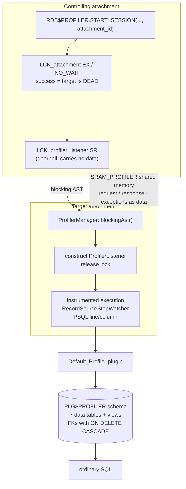

# The Profiler — where the time went, measured from inside

*A companion to [Conceptual Architecture of Firebird](README.md). Grounded in the vendored [`extern/firebird`](extern/firebird) source (Firebird 6, `master`) and verified against a live Firebird 6 server.*

---

## Table of contents

* [Why the profiler deserves its own document](#why-the-profiler-deserves-its-own-document)
* [Snapshot, stream, accumulation](#snapshot-stream-accumulation)
* [Instrumenting from inside](#instrumenting-from-inside)
* [Measuring the observer](#measuring-the-observer)
* [The plugin, and why the output is a schema](#the-plugin-and-why-the-output-is-a-schema)
* [Profiling somebody else's attachment](#profiling-somebody-elses-attachment)
* [Live demonstrations](#live-demonstrations)
* [Comparison: PostgreSQL, MySQL, SQLite](#comparison-postgresql-mysql-sqlite)
* [Further reading](#further-reading)

---

## Why the profiler deserves its own document

Eight documents in this collection name the profiler. Its entire explanation is one bullet in [monitoring and tuning](monitoring-and-tuning.md), and a cell in [the trace document](trace-and-audit.md)'s comparison table that lists it as Firebird's answer to `pg_stat_statements`. That is the last of the gaps the trace and metadata-cache documents were written to close.

It also completes an argument the collection has been making in pieces. [Monitoring](monitoring-and-tuning.md) explains the `MON$` tables; [trace](trace-and-audit.md) opens with the distinction between a snapshot and a stream and says explicitly that neither substitutes for the other. There is a third thing, and this is it.

The reason it is worth a document rather than a paragraph is a design problem the other two do not have. Trace's entire architecture, as that document puts it, is a sequence of refusals to let the observer matter — a `needs()` gate that costs one branch, a log that never blocks, a plugin that ejects itself on error. **A profiler cannot make those refusals.** It has to be inside the thing it measures, holding a clock across the exact operation whose cost it is reporting. So it strikes the opposite bargain: accept that the observation costs something, measure how much, subtract that from the numbers it reports, and be honest that the wall-clock cost remains. The most interesting forty lines in the subsystem are the ones that do this.

---

## Snapshot, stream, accumulation

Three views of a running engine, and they answer three different questions:

| | Mechanism | Question it answers | Form |
|---|---|---|---|
| **Snapshot** | [`MON$` tables](monitoring-and-tuning.md) | What is happening right now, coherently? | SQL, materialized per transaction |
| **Stream** | [Trace](trace-and-audit.md) | What happened, in what order, and what did each cost? | Ordered text events, as they occur |
| **Accumulation** | `RDB$PROFILER` | Where did the time go, totalled over many executions? | SQL tables, aggregated |

The profiler is the only one of the three that is *per-operator*. Trace can tell you a statement took 400 ms and print its plan; it cannot tell you that 70% of that was one full scan inside the plan. `MON$` can tell you a statement is running now; it cannot total anything across executions. The profiler counts and times every record-source open and fetch, and every PSQL line, and stores the totals where SQL can reach them.

---

## Instrumenting from inside

The engine-side half is [`ProfilerManager`](extern/firebird/src/jrd/ProfilerManager.h#L50), and its declaration states the design in one line:

```cpp
class ProfilerManager final : public Firebird::PerformanceStopWatch
```

The manager *is* a stopwatch. Instrumentation points are RAII objects, the same idiom trace uses for its event sites — [`RecordSourceStopWatcher`](extern/firebird/src/jrd/ProfilerManager.h#L73) takes a reading in its constructor and reports in its destructor:

```cpp
RecordSourceStopWatcher(thread_db* tdbb, ProfilerManager* aProfilerManager,
            const AccessPath* recordSource, Event aEvent)
    : request(tdbb->getRequest()), profilerManager(aProfilerManager),
      recordSource(recordSource), event(aEvent)
{
    if (profilerManager)
    {
        lastTicks = profilerManager->queryTicks();
        ...
        lastAccumulatedOverhead = profilerManager->getAccumulatedOverhead();
    }
}

~RecordSourceStopWatcher()
{
    if (profilerManager)
    {
        const SINT64 currentTicks = profilerManager->queryTicks();
        const SINT64 elapsedTicks = profilerManager->getElapsedTicksAndAdjustOverhead(
            currentTicks, lastTicks, lastAccumulatedOverhead);
        Stats stats(elapsedTicks);
        ...
    }
}
```

Two events per record source — `OPEN` and `GET_RECORD` — with matching [`beforeRecordSourceOpen` / `afterRecordSourceOpen`](extern/firebird/src/jrd/ProfilerManager.h#L216) pairs on the manager, plus `beforePsqlLineColumn` / `afterPsqlLineColumn` for procedural code. Everything is gated on `profilerManager` being non-null, which it is only when a session is active on this attachment — the same "cost nothing when nobody is listening" principle as trace's `needs()`, expressed as a null check.

Note what is captured alongside the timing: `request` and `recordSource`. That is what makes the output a *tree* rather than a list — each measurement is tagged with its position in the plan, so the stored rows reassemble into the access path the [optimizer](query-optimizer-and-execution.md) chose.

---

## Measuring the observer

Here is the part worth the document. [`PerformanceStopWatch`](extern/firebird/src/common/PerformanceStopWatch.h#L35) does not just read a clock — it periodically measures **how long reading the clock takes**, and keeps a running total of how much of the elapsed time is its own fault.

[`queryTicks()`](extern/firebird/src/common/PerformanceStopWatch.h#L43):

```cpp
SINT64 queryTicks()
{
    const auto initialTicks = fb_utils::query_performance_counter();

    if ((initialTicks - lastMeasuredTicks) * 1000 / fb_utils::query_performance_frequency() >
            OVERHEAD_CALC_FREQUENCY_MS)
    {
        const auto currentTicks = lastMeasuredTicks = fb_utils::query_performance_counter();
        lastOverhead = currentTicks - initialTicks;
        accumulatedOverhead += lastOverhead + lastOverhead;
        return currentTicks;
    }
    else
    {
        accumulatedOverhead += lastOverhead;
        return initialTicks;
    }
}
```

Every [30 seconds](extern/firebird/src/common/PerformanceStopWatch.h#L82) it calibrates: read the counter twice in succession, and the difference *is* the cost of one read. That figure becomes `lastOverhead`, and every subsequent call adds it to `accumulatedOverhead` — an estimate of how much of the wall clock has been consumed by measurement rather than by work.

Then [`getElapsedTicksAndAdjustOverhead()`](extern/firebird/src/common/PerformanceStopWatch.h#L67) removes it:

```cpp
SINT64 getElapsedTicksAndAdjustOverhead(SINT64 currentTicks, SINT64 previousTicks,
    SINT64 previousAccumulatedOverhead)
{
    const SINT64 overhead = MAX(accumulatedOverhead - previousAccumulatedOverhead, 0);
    const SINT64 elapsedTicks = currentTicks - previousTicks - overhead;

    if (elapsedTicks >= 0)
        return elapsedTicks;

    accumulatedOverhead += elapsedTicks;

    return 0;
}
```

The subtrahend is the overhead accumulated *between* the two readings — which, for a record source, means all the clock reads performed by every nested record source beneath it. Without this, a parent operator would be charged for the instrumentation of all its children, and the deeper an operator sat in the plan the more inflated its ancestors would look.

The last three lines are the honest part. If subtracting the overhead would make elapsed time negative, the function returns zero and carries the negative remainder *back* into `accumulatedOverhead` as a debt to be worked off against later measurements. It is a correction ledger, not a clamp — the error is deferred, not discarded.

Two things this does not do, and the live section quantifies the second. It does not make the profiling free: the reported per-operator numbers are corrected, but the statement still takes longer with a session active. And the calibration is a 30-second sample of one machine's clock behaviour, so the correction is an estimate, not an accounting.

---

## The plugin, and why the output is a schema

The engine measures; it does not decide where the numbers go. As with [trace](trace-and-audit.md) and the nine other plugin types in [extensibility](extensibility.md), the storage side is a plugin — `IProfilerPlugin` producing `IProfilerSession` instances — and Firebird ships one, `Default_Profiler` (`libDefault_Profiler.so`), configured by `DefaultProfilerPlugin` in `firebird.conf`.

What that plugin does with the data is the interesting choice: it creates **an ordinary relational schema** and writes rows into it. On first use it builds `PLG$PROFILER` — a [schema](schemas-and-name-resolution.md) in the Firebird 6 sense — containing seven `*_DATA` tables and a set of aggregating views. The finest-grained table, [`plg$prof_record_source_stats_data`](extern/firebird/src/plugins/profiler/Profiler.cpp#L1349), is worth reading as an artefact:

```sql
create table plg$profiler.plg$prof_record_source_stats_data (
    user_name char(63) character set utf8 default current_user not null,
    profile_id bigint not null,
    statement_id bigint not null,
    request_id bigint not null,
    cursor_id integer not null,
    record_source_id integer not null,
    open_counter bigint not null,
    open_min_elapsed_time bigint not null,
    open_max_elapsed_time bigint not null,
    open_total_elapsed_time bigint not null,
    fetch_counter bigint not null,
    ...
    constraint plg$prof_record_source_stats_data_pk
        primary key (profile_id, statement_id, request_id, cursor_id, record_source_id)
```

A compound primary key down to the individual record source, foreign keys back to sessions, statements and requests with `on delete cascade`, and min/max/total for both open and fetch. [The views](extern/firebird/src/plugins/profiler/Profiler.cpp#L1560) then do the aggregation in SQL — summing totals, deriving averages with `nullif` guards, and joining to `plg$prof_record_sources` for `access_path`, `level` and `parent_record_source_id` so the result reassembles into an indented plan.

This is a different answer from trace's, and the contrast is deliberate. Trace produces a text stream for a human or a log file. The profiler produces **normalized data with referential integrity**, because the questions people ask of profiling data — rank operators by total time, compare two runs, find the statement whose average fetch regressed — are queries. Dropping a session is `delete from plg$prof_sessions_data`, and the cascades clean up everything beneath it.

The `user_name` column defaulting to `current_user`, and appearing in every foreign key, is the multi-tenancy story: profiling data is partitioned by whoever collected it.

---

## Profiling somebody else's attachment

`RDB$PROFILER.START_SESSION` takes an optional attachment id, and the machinery behind that parameter is the most intricate part of the subsystem. From [`ProfilerManager.cpp`](extern/firebird/src/jrd/ProfilerManager.cpp#L99):

```cpp
void startRemoteProfiler(thread_db* tdbb, AttNumber attachmentId)
{
    ThreadStatusGuard tempStatus(tdbb);

    Lock tempLock(tdbb, sizeof(SINT64), LCK_attachment);
    tempLock.setKey(attachmentId);

    // Check if attachment is alive.
    if (LCK_lock(tdbb, &tempLock, LCK_EX, LCK_NO_WAIT))
    {
        LCK_release(tdbb, &tempLock);
        (Arg::Gds(isc_random) << "Cannot start remote profile session - attachment is not active").raise();
    }

    // Ask remote attachment to initialize the profile listener.

    tempLock.lck_type = LCK_profiler_listener;

    if (LCK_lock(tdbb, &tempLock, LCK_SR, LCK_WAIT))
        LCK_release(tdbb, &tempLock);
}
```

Two uses of the [lock manager](lock-manager.md), neither of them for mutual exclusion.

The first is a **liveness probe**, and it reads backwards until you see it: taking the target's `LCK_attachment` lock exclusively *succeeding* means nobody holds it, which means the attachment is gone. Success is the error case. This is the same trick [page cache coherency](page-cache-coherency.md) uses with `LCK_database` to detect whether any other process has the database open.

The second is a **doorbell**. Taking `LCK_profiler_listener` on the target's key conflicts with the lock the target holds, which fires the target's blocking AST — [`ProfilerManager::blockingAst()`](extern/firebird/src/jrd/ProfilerManager.cpp#L409) — which constructs a `ProfilerListener` inside that attachment and releases the lock. The lock carries no data; its only job is to make something happen in another process, exactly as the metadata cache's [invalidation ASTs](metadata-cache.md#invalidation-across-processes) do.

From there the two attachments talk over a shared-memory region of type `SRAM_PROFILER`, exchanging request and response messages. Exceptions cross the boundary as data — an `ExceptionResponse` in the reply is unpacked and re-raised in the caller — so a failure inside the target surfaces as an error on the connection that asked for it rather than as a silent no-op.

Authorization is the fine-grained system privilege `PROFILE_ANY_ATTACHMENT`, sitting alongside `TRACE_ANY_ATTACHMENT` in [`SystemPrivileges.h`](extern/firebird/src/jrd/SystemPrivileges.h#L68) — the same pattern [trace](trace-and-audit.md#two-authorization-questions) uses, and grantable to a role in the same way.

One detail that recurs throughout the manager: while the profiler does its own work — starting a session, flushing — it sets `AutoSetRestore<bool> pauseProfiler(&paused, true)`. The profiler excludes itself from its own measurements.



*Figure 1: Remote profiling. The lock manager supplies liveness detection and a doorbell; shared memory carries the conversation; the plugin lands the results in queryable tables.*

---

## Live demonstrations

Captured against a running Firebird 6 server (`LI-T6.0.0.2076`, engine 6.0.0), on a scratch database with 200,000 orders and 5,000 customers.

### A plan tree with per-operator timings

```sql
SELECT RDB$PROFILER.START_SESSION('demo session') FROM RDB$DATABASE;
SELECT COUNT(*) FROM ORDERS o JOIN CUST c ON c.ID = o.CUST WHERE o.AMT > 100000;
EXECUTE PROCEDURE RDB$PROFILER.FINISH_SESSION(TRUE);
```

Then reading `PLG$PROF_RECORD_SOURCE_STATS_VIEW`, indented by its `LEVEL` column:

| Access path | Opens | Fetches | Total ns |
|---|---:|---:|---:|
| `Select Expression` | 1 | 2 | 45,304,131 |
| `  -> Aggregate` | 1 | 2 | 45,303,772 |
| `    -> Filter` | 1 | 133,334 | 44,664,234 |
| `      -> Hash Join (inner) (keys: 1, total key length: 4)` | 1 | 133,334 | 43,491,156 |
| `        -> Filter` | 1 | 133,334 | 34,822,584 |
| `          -> Table "PUBLIC"."ORDERS" as "O" Full Scan` | 1 | 200,001 | 31,313,885 |
| `        -> Record Buffer (record length: 25)` | 1 | 138,334 | 4,597,795 |
| `          -> Table "PUBLIC"."CUST" as "C" Full Scan` | 1 | 5,001 | 705,782 |

This is the thing trace cannot give you. The statement took 45 ms; the full scan of `ORDERS` accounts for 31 ms of it, and the hash join's build side — `CUST` through a `Record Buffer` — for under 5 ms. The fetch counts are the row counts flowing through each operator: 200,001 rows scanned from `ORDERS`, 133,334 surviving the filter, 5,001 from `CUST`.

The two rows at the very top of the capture are the profiler observing its own start:

| Access path | Opens | Fetches | Total ns |
|---|---:|---:|---:|
| `Select Expression` | 0 | 1 | 2,949 |
| `  -> Table "SYSTEM"."RDB$DATABASE" Full Scan` | 0 | 1 | 1,058 |

that being the `SELECT RDB$PROFILER.START_SESSION(...) FROM RDB$DATABASE` statement itself. Note also `"SYSTEM"."RDB$DATABASE"` and `"PUBLIC"."ORDERS"` — [schema-qualified](schemas-and-name-resolution.md) throughout, as everything in Firebird 6 now is.

### PSQL hotspots, by line and column

A procedure with a deliberate hot loop:

```sql
1  CREATE PROCEDURE HOTSPOT RETURNS (TOTAL BIGINT) AS
2    DECLARE I INT = 0;
3    DECLARE X BIGINT;
4  BEGIN
5    TOTAL = 0;
6    WHILE (I < 50000) DO
7    BEGIN
8      SELECT COUNT(*) FROM CUST WHERE ID = :I INTO :X;
9      TOTAL = TOTAL + COALESCE(X, 0);
10     I = I + 1;
11   END
12   SUSPEND;
13 END
```

`PLG$PROF_PSQL_STATS_VIEW`, ordered by total time:

| Line | Col | Counter | Total ns | Avg ns |
|---:|---:|---:|---:|---:|
| 8 | 5 | 50,000 | 3,910,837 | 78 |
| 10 | 5 | 50,000 | 1,354,611 | 27 |
| 9 | 5 | 50,000 | 28,693 | 0 |
| 6 | 3 | 50,001 | 3,316 | 0 |
| 3 | 3 | 1 | 2,288 | 2,288 |
| 5 | 3 | 1 | 112 | 112 |

Every line maps to the source exactly. Line 8 — the singleton `SELECT` — is the hotspot at 3.9 ms across 50,000 executions, roughly three times line 10 and two orders of magnitude above line 9. The `WHILE` on line 6 shows **50,001** executions: the loop test runs one extra time to decide to stop, which is the kind of detail that tells you the counter is real rather than derived.

These per-line figures cover the PSQL statement nodes; work done inside a cursor is accounted separately in the record-source tables, so the two views answer "which line" and "which operator" rather than double-counting.

### The observer effect, measured

The same procedure, timed end to end with and without a session (three runs each):

| Condition | Elapsed |
|---|---|
| No profiler session | 0.14 s · 0.14 s · 0.14 s |
| Profiler session active | 0.25 s · 0.26 s · 0.26 s |

Roughly **80% overhead** on a workload chosen to be nearly worst case — 50,000 iterations of a tight PSQL loop, so almost every instruction executed passes through an instrumentation point. The overhead subtraction in `PerformanceStopWatch` corrects the *reported* per-operator times for the cost of the clock reads; it cannot and does not remove the cost from the run. Profile on a workload, not on production peak.

### Profiling another connection

Session B connects and reports its attachment id (35). Session A, a different connection, starts a profiler session against it:

```sql
-- in session A
SELECT RDB$PROFILER.START_SESSION('remote session', NULL, 35) FROM RDB$DATABASE;
REMOTE_PROFILE_ID   6
```

Session B then runs `SELECT TOTAL FROM HOTSPOT`, and session A finishes the session and reads the results:

```sql
-- in session A
EXECUTE PROCEDURE RDB$PROFILER.FINISH_SESSION(TRUE, 35);

SELECT PROFILE_ID, DESCRIPTION, ATTACHMENT_ID FROM PLG$PROFILER.PLG$PROF_SESSIONS;
PROFILE_ID 6   DESCRIPTION  remote session   ATTACHMENT_ID  35
```

The session is recorded against **attachment 35** — the target, not the controller — and its captured data is session B's execution:

| Profile | Routine | Line | Counter | Total ns |
|---:|---|---:|---:|---:|
| 6 | `HOTSPOT` | 8 | 50,000 | 9,339,974 |
| 6 | `HOTSPOT` | 10 | 50,000 | 458,931 |
| 6 | `HOTSPOT` | 9 | 50,000 | 425,547 |

One connection profiled another connection's stored procedure, line by line, without touching the application that was running it — the lock-manager doorbell and the shared-memory conversation doing their work invisibly. (The absolute times differ from the local run above; these are separate executions under different cache conditions, and the profiler measures what actually happened, not a normalized figure.)

---

## Comparison: PostgreSQL, MySQL, SQLite

| | **Firebird** | **PostgreSQL** | **MySQL** | **SQLite** |
|---|---|---|---|---|
| **Per-operator timings** | Yes — open/fetch counters, min/max/total per record source | `EXPLAIN ANALYZE` per node; `auto_explain` to the log | `EXPLAIN ANALYZE` (8.0.18+) | `EXPLAIN QUERY PLAN` — structure only, no timings |
| **Accumulated over many executions** | Yes — rows persist and aggregate | `pg_stat_statements`, statement level only | `performance_schema` statement summaries | — |
| **Per-operator *and* accumulated** | **Yes** | No — node timings are per execution | No | No |
| **Procedural profiling** | Built in — per line and column | `plprofiler` extension | — | — |
| **Profile another session** | Yes — attachment id + `PROFILE_ANY_ATTACHMENT` | No; `auto_explain` logs everyone | `performance_schema` per thread | N/A |
| **Output form** | SQL tables in `PLG$PROFILER`, FKs and views | Text/JSON plan, log lines, catalog views | Tables | `sqlite3_profile()` callback |
| **Corrects for its own overhead** | **Yes** — calibrated and subtracted | No | No | No |
| **Pluggable storage** | Yes — `IProfilerPlugin` | No | No | Callback is the storage |

Two rows carry the argument.

**Per-operator *and* accumulated.** PostgreSQL gives excellent per-node timings through `EXPLAIN ANALYZE`, but for one execution, as text you read once; and it gives excellent accumulation through `pg_stat_statements`, but only at whole-statement granularity. Getting "which operator, totalled across 10,000 executions of this statement" out of PostgreSQL means sampling `auto_explain` output and parsing it. Firebird's profiler is built to answer exactly that question, which is why its output is a normalized schema rather than a plan dump.

**Overhead correction.** None of the other three attempts it. `EXPLAIN ANALYZE`'s timing overhead is well known — enough that PostgreSQL added `EXPLAIN (ANALYZE, TIMING OFF)` so you can measure row counts without paying for `gettimeofday` on every node, and `pg_test_timing` so you can find out how bad your platform's clock is. That is the honest alternative approach: let the user decide whether to pay, and give them a tool to measure the cost. Firebird instead pays the cost always and subtracts an estimate of it, which produces more usable numbers for nested operators and a slightly less auditable relationship to the wall clock. Neither is obviously right; they are different answers to a real problem that most systems simply do not address.

**MySQL**'s `performance_schema` is the strongest accumulation story of the four but does not decompose a plan into per-operator totals. **SQLite**'s `sqlite3_profile()` is a per-statement callback with a nanosecond count — the degenerate case again, and reasonably so: with one connection, no server and no other sessions to observe, there is nothing for a session registry or a remote-control protocol to do.

Firebird's distinguishing choice, stated plainly: **it is the only one of the four that measures the cost of its own measurement and removes it from what it reports.**

---

## Hands-on: samples, tests and debugging

### C++ sample — [`samples/cpp/profiler.cpp`](samples/cpp/profiler.cpp)

The [accumulation view](#snapshot-stream-accumulation) driven end to end from client code, on a scratch database. One `RDB$PROFILER.START_SESSION` brackets two workloads — a self-join over a 5,000-row table and a 20,000-iteration PSQL loop — then `FINISH_SESSION(TRUE)` flushes and the sample queries `PLG$PROFILER` like any other schema: the record-source view reassembled into an indented plan tree via its `LEVEL` column, and the PSQL view ranked by total time. One subtlety earned a comment in the code: the plugin [flushes through an autonomous transaction](#the-plugin-and-why-the-output-is-a-schema), so a *retained* SNAPSHOT transaction sees none of it — the sample must hard-commit and start a fresh transaction before reading the views (the first version used `commitRetaining` and read back nothing at all).

```sh
cmake -B build samples && cmake --build build
./build/profiler        # default: inet://localhost//tmp/fbhandson/profiler.fdb
```

Verified output:

```text
profile session 4 finished and flushed

record sources of the join (PLG$PROF_RECORD_SOURCE_STATS_VIEW):
CAST                                                      OPEN_COUNTER FETCH_COUNTER OPEN_FETCH_TOTAL_ELAPSED_TIME
--------------------------------------------------------- ------------ ------------- -----------------------------
Select Expression                                         1            2             4906553
  -> Aggregate                                            1            2             4906781
    -> Filter                                             1            5001          5316535
      -> Hash Join (inner) (keys: 1, total key length: 4) 1            5001          5308724
        -> Table "PUBLIC"."NUMS" as "A" Full Scan         1            5001          1291149
        -> Record Buffer (record length: 25)              1            10001         3220893
          -> Table "PUBLIC"."NUMS" as "B" Full Scan       1            5001          1325379

hotspot procedure, per PSQL line (PLG$PROF_PSQL_STATS_VIEW):
LINE_NUM COLUMN_NUM COUNTER TOTAL_ELAPSED_TIME AVG_ELAPSED_TIME
-------- ---------- ------- ------------------ ----------------
8        5          20000   46002043           2300
10       5          20000   4059811            202
6        3          20001   1325393            66
9        5          20000   21725              1
3        3          1       2381               2381
5        3          1       335                335
2        3          1       43                 43
12       3          1       0                  0

done.
```

The signatures from the [live demonstrations](#live-demonstrations) reappear on this fresh database: line 8 (the singleton `SELECT` in the loop) dominates at 46 ms over 20,000 executions, and line 6 — the `WHILE` — counts **20,001**, the loop test that runs once more to decide to stop.

### fb-cpp sample — [`samples/fb-cpp/profiler.cpp`](samples/fb-cpp/profiler.cpp)

The same session through [fb-cpp](https://github.com/asfernandes/fb-cpp) (vendored at [`extern/fb-cpp`](extern/fb-cpp)), the modern C++20 wrapper over the OO API — and because the control surface is a SQL package and the output a SQL schema, nothing is lost in the wrapper; what changes is only the fetch idiom. `START_SESSION` returns through `queryScalar<std::int64_t>`, the `PROFILE_ID` is bound with `setInt64(0, profileId)`, and the two views come back through `Statement` loops with `std::optional` column getters. The autonomous-transaction pitfall applies unchanged: the sample must hard-`commit()` and open a genuinely new `Transaction` before reading `PLG$PROFILER`, exactly as the OO-API version discovered.

```sh
cmake -B build samples && cmake --build build   # needs libboost-dev + libboost-filesystem-dev
./build/fbcpp_profiler
```

Verified: the same shapes on its own scratch database — the identical seven-operator hash-join tree (`Hash Join (inner) (keys: 1, total key length: 4)`, 5001/10001 fetch counters), line 8 dominating the PSQL ranking at 8,714,739 ns over 20,000 executions, and the `WHILE` on line 6 counting 20,001; this warmer run is faster than the OO-API sample's documented one (8.7 ms vs 46 ms for line 8), which reshuffles the time-ordered ranking below the hotspot — the counters, not the times, are the reproducible part.

### JavaScript sample — [`samples/nodejs/profiler.js`](samples/nodejs/profiler.js)

The twin (`cd samples/nodejs && node profiler.js`) profiles its own `hotspot_js` procedure and reads the same per-line ranking back (verified: line 8 at 41 ms / 20,000 executions, line 6 at 20,001). As with [extensibility](extensibility.md), the pure-JS driver loses nothing, and that is the payoff of [the plugin's central choice](#the-plugin-and-why-the-output-is-a-schema): the control surface is a SQL package and the output is a SQL schema, so *any* client that can run queries can profile — no native API, no log-file access, no special protocol. (node-firebird's one-transaction-per-query style also sidesteps the snapshot subtlety the C++ sample had to handle explicitly.)

### Things to try

- Add an index on `nums.val`, rerun, and watch the `Hash Join` in the captured plan tree become a nested loop with an `Index Scan` — the profiler as a before/after harness for the [optimizer](query-optimizer-and-execution.md).
- Time `select total from hotspot` with and without an active session to reproduce the [observer-effect measurement](#the-observer-effect-measured); then check `cat /sys/devices/system/clocksource/clocksource0/current_clocksource` — the profiler README warns that a non-`tsc` clock source inflates exactly this overhead.
- Start a second session without finishing the first: the first is implicitly finished *without* flushing (`FINISH_SESSION(FALSE)` semantics) and its unflushed data is gone — sessions do not nest.
- Profile the C++ sample from a second connection: take `MON$ATTACHMENT_ID` from the running sample, call `START_SESSION('remote', NULL, <id>)` there, and reproduce the [remote-profiling walk-through](#profiling-somebody-elses-attachment).

### Debugging this in C++ (gdb)

With a [debug build of the engine](debugging-firebird.md) and the sample pointed at a local path (embedded), the whole measurement chain is in one process:

```gdb
break ProfilerManager::startSession       # src/jrd/ProfilerManager.cpp:434 — the SQL package call arriving in the engine
break Jrd::RecordSourceStopWatcher::~RecordSourceStopWatcher   # src/jrd/ProfilerManager.h:73 — a reading taken (inline; resolves to many sites)
break PerformanceStopWatch::queryTicks    # src/common/PerformanceStopWatch.h:43 — the clock read, and every 30 s the self-calibration
break ProfilerManager::flush              # src/jrd/ProfilerManager.cpp:639 — engine-side accumulation handed to the plugin
break ProfilerPlugin::flush               # src/plugins/profiler/Profiler.cpp:424 — the plugin writing PLG$PROF_* rows
break ProfilerManager::blockingAst        # src/jrd/ProfilerManager.cpp:409 — the remote-profiling doorbell ringing in the target
```

`RecordSourceStopWatcher`'s destructor is the busiest place in the subsystem — one hit per operator per fetch — so make it conditional (or just `tbreak`) before running the join. Inside it, `getElapsedTicksAndAdjustOverhead` is where the [overhead ledger](#measuring-the-observer) is applied; `print accumulatedOverhead` before and after a deep fetch shows children's clock reads being charged away from the parent. `ProfilerPlugin::flush`'s backtrace is the schema argument in one frame: an ordinary `IAttachment::execute` inserting rows, inside the engine, on behalf of the profiler.

---

## Further reading

- [`doc/sql.extensions/README.profiler.md`](https://github.com/FirebirdSQL/firebird/blob/master/doc/sql.extensions/README.profiler.md) — the `RDB$PROFILER` package, its procedures and the shipped views.
- [`src/jrd/ProfilerManager.h`](https://github.com/FirebirdSQL/firebird/blob/master/src/jrd/ProfilerManager.h) / [`.cpp`](https://github.com/FirebirdSQL/firebird/blob/master/src/jrd/ProfilerManager.cpp) — the manager, `RecordSourceStopWatcher`, the session lifecycle and the remote-profiler protocol.
- [`src/common/PerformanceStopWatch.h`](https://github.com/FirebirdSQL/firebird/blob/master/src/common/PerformanceStopWatch.h) — overhead calibration and subtraction, in about fifty lines.
- [`src/plugins/profiler/Profiler.cpp`](https://github.com/FirebirdSQL/firebird/blob/master/src/plugins/profiler/Profiler.cpp) — the `Default_Profiler` plugin: the `PLG$PROFILER` schema, its seven data tables and its views.
- [PostgreSQL: `EXPLAIN ANALYZE` and timing overhead](https://www.postgresql.org/docs/current/using-explain.html) · [`pg_stat_statements`](https://www.postgresql.org/docs/current/pgstatstatements.html) · [`plprofiler`](https://github.com/bigsql/plprofiler)
- [MySQL: `EXPLAIN ANALYZE`](https://dev.mysql.com/doc/refman/8.4/en/explain.html) · [`performance_schema` statement summaries](https://dev.mysql.com/doc/refman/8.4/en/performance-schema-statement-summary-tables.html)
- [SQLite: `sqlite3_profile()`](https://www.sqlite.org/c3ref/profile.html)

---

*Companion documents: [Monitoring and Performance Tuning](monitoring-and-tuning.md) · [Trace and Audit](trace-and-audit.md) · [Query Optimizer and Execution Engine](query-optimizer-and-execution.md) · [PSQL, Stored Procedures and Triggers](psql-and-stored-procedures.md) · [Extensibility](extensibility.md) · [The Lock Manager and the Lock Protocol](lock-manager.md) · [Reading Guide](READING-GUIDE.md)*
