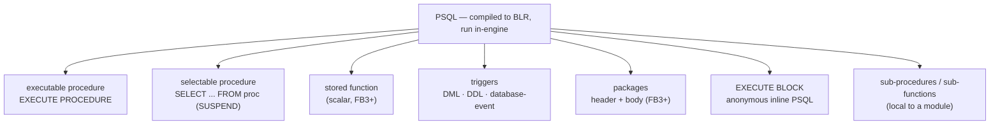
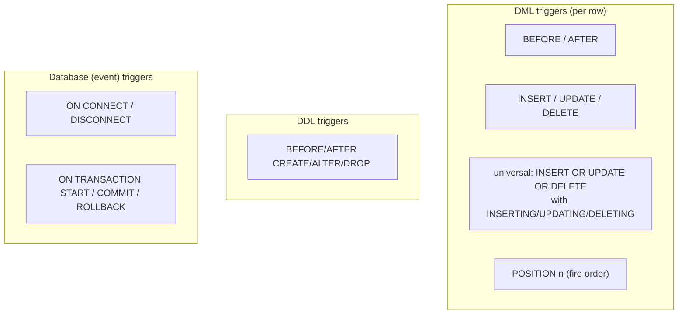

# PSQL, Stored Procedures and Triggers

A database's **procedural language** decides how much application logic can live inside the engine — stored procedures, functions, triggers, exception handling, cursors. Firebird's is called **PSQL** (Procedural SQL). This document describes PSQL and its module types, grounded in the vendored `doc/sql.extensions/` reference set and demonstrated with working code on a live Firebird 6 server, then compares it — with side-by-side examples for the same tasks — against PostgreSQL's PL/pgSQL, MySQL's stored routines, and SQLite (which has no stored-procedure language at all).

It is a companion to the [main paper](README.md) and pairs with the [SQL dialect and data types document](sql-dialect-and-types.md) (the types PSQL variables use) and the [grammar document](grammar-and-parser.md) (PSQL is part of the same grammar). External (non-PSQL) routines — UDR and plugins — are a distinct topic touched on only briefly here.

**Table of Contents**

* [What PSQL is](#what-psql-is)
* [The PSQL module types](#the-psql-module-types)
* [Selectable procedures: SUSPEND](#selectable-procedures-suspend)
* [Triggers: DML, DDL and database](#triggers-dml-ddl-and-database)
* [Exception handling and other features](#exception-handling-and-other-features)
* [Worked examples (validated on Firebird 6)](#worked-examples-validated-on-firebird-6)
* [Side-by-side: the same procedure in four systems](#side-by-side-the-same-procedure-in-four-systems)
* [Side-by-side: the same trigger](#side-by-side-the-same-trigger)
* [Comparison table](#comparison-table)
* [Discussion](#discussion)
* [Further research](#further-research)

## What PSQL is

PSQL is Firebird's built-in procedural extension to SQL: a block-structured language with variables, control flow (`IF`, `WHILE`, `FOR`), cursors, exception handling and transaction-aware statements, compiled — like every request — to **BLR** and executed by the engine (see the [architecture comparison](architecture-comparison.md#firebird-recap) and [grammar document](grammar-and-parser.md)). It is a *single, dedicated* in-engine language: unlike PostgreSQL, Firebird does not host multiple procedural languages in the server; logic that PSQL cannot express is written as an external **UDR** routine instead.

Every PSQL body shares the same shape: an optional variable-declaration section, then a `BEGIN ... END` block, with `:variable` referencing PSQL variables inside SQL statements.

## The PSQL module types



_Figure 1: PSQL module types — procedures (executable and selectable), functions, triggers, packages, anonymous blocks and local subroutines_

- **Executable procedure** — called with `EXECUTE PROCEDURE`; may take inputs and return a single set of output parameters.
- **Selectable procedure** — queried with `SELECT ... FROM proc(args)`; streams a result set via `SUSPEND` (see below).
- **Stored function** (FB3+) — returns a scalar with `RETURN`; usable in expressions.
- **Triggers** — fire on DML, DDL or database events.
- **Packages** (FB3+) — a header declaring procedures/functions and a body implementing them, grouping related routines with a public/private boundary (an Oracle-style feature).
- **`EXECUTE BLOCK`** — an anonymous PSQL block run ad hoc, as if it were a procedure body inline in a query.
- **Sub-procedures / sub-functions** — routines declared locally inside another PSQL module.

## Selectable procedures: SUSPEND

Firebird's most distinctive PSQL feature is the **selectable procedure**: a procedure that produces a *result set* you `SELECT` from, one row at a time, using `SUSPEND` to yield each row. The engine drives it like a table:

```sql
CREATE PROCEDURE raises (pct NUMERIC(5,2))
RETURNS (id INTEGER, name VARCHAR(30), new_salary NUMERIC(10,2))
AS
BEGIN
  FOR SELECT id, name, salary FROM emp INTO :id, :name, :new_salary DO
  BEGIN
    new_salary = new_salary * (1 + pct/100);
    SUSPEND;              -- emit this row to the caller
  END
END
```

`SELECT * FROM raises(10)` then returns a computed row per employee. This turns a procedure into a parameterized, composable view — you can join it, filter it, order it. PostgreSQL expresses the same idea with set-returning functions (`RETURNS SETOF ... RETURN NEXT/RETURN QUERY`); MySQL cannot (a MySQL procedure emits a result set only as a side effect of a bare `SELECT`, not composably); SQLite has no equivalent.

## Triggers: DML, DDL and database

Firebird triggers are unusually broad. Beyond ordinary row triggers, it fires on schema changes and on connection/transaction lifecycle events:



_Figure 2: Firebird trigger kinds — row-level DML (with universal multi-action and POSITION), DDL triggers, and database-event triggers_

- **DML triggers** — `BEFORE`/`AFTER` `INSERT`/`UPDATE`/`DELETE`, with the `NEW.` and `OLD.` context records. **Universal triggers** (`INSERT OR UPDATE OR DELETE`) handle several actions in one body using the `INSERTING`/`UPDATING`/`DELETING` booleans, and **`POSITION n`** orders multiple triggers on the same event.
- **DDL triggers** ([`README.ddl_triggers.txt`](https://github.com/FirebirdSQL/firebird/blob/master/doc/sql.extensions/README.ddl_triggers.txt)) — fire on `CREATE`/`ALTER`/`DROP` of objects, for schema-change auditing or policy enforcement.
- **Database triggers** ([`README.db_triggers.txt`](https://github.com/FirebirdSQL/firebird/blob/master/doc/sql.extensions/README.db_triggers.txt)) — fire `ON CONNECT`, `ON DISCONNECT`, and on transaction `START`/`COMMIT`/`ROLLBACK` — e.g. to set up session context or log connections. PostgreSQL has DDL/event triggers but not connection triggers in core; MySQL and SQLite have neither.

## Exception handling and other features

- **Custom exceptions** — `CREATE EXCEPTION name 'message'`, raised with `EXCEPTION name` (optionally with a runtime message), and caught with `WHEN <condition> DO` blocks that can match a named exception, a SQLCODE/GDSCODE/SQLSTATE, or `ANY`. `WHEN ... DO` can retry, log, or re-raise.
- **Cursors** — explicit `DECLARE ... CURSOR`, `FOR SELECT` loops, scrollable cursors, and cursor variables.
- **Autonomous transactions** — `IN AUTONOMOUS TRANSACTION DO ...` runs a nested unit that commits independently (audit rows that survive an outer rollback) — see the [transactions document](transactions-and-concurrency.md#savepoints-explicit-locks-and-autonomous-transactions).
- **`RETURNING`** — DML inside PSQL (and at the SQL level) can return generated values (`INSERT ... RETURNING id INTO :var`).
- **Stack traces** — uncaught exceptions carry a PSQL stack trace (`At procedure "…" line: N, col: M`), shown in the exception demo below.

## Worked examples (validated on Firebird 6)

The following were created and run on a live server. An **executable procedure** with a custom exception and `RETURNING`:

```sql
CREATE EXCEPTION low_salary 'salary below minimum';

CREATE PROCEDURE hire (p_name VARCHAR(30), p_salary NUMERIC(10,2))
RETURNS (new_id INTEGER)
AS
BEGIN
  IF (p_salary < 1000) THEN EXCEPTION low_salary;
  INSERT INTO emp (name, salary) VALUES (:p_name, :p_salary) RETURNING id INTO :new_id;
END
```

A **BEFORE INSERT trigger** for audit, and a **package** with a function:

```sql
CREATE TRIGGER emp_bi BEFORE INSERT ON emp AS
BEGIN
  INSERT INTO audit_log VALUES (CURRENT_TIMESTAMP, 'insert emp ' || COALESCE(NEW.name,'?'));
END;

CREATE PACKAGE hr AS BEGIN
  FUNCTION fulltime_bonus(sal NUMERIC(10,2)) RETURNS NUMERIC(10,2);
END;
CREATE PACKAGE BODY hr AS BEGIN
  FUNCTION fulltime_bonus(sal NUMERIC(10,2)) RETURNS NUMERIC(10,2) AS
  BEGIN
    RETURN sal * 0.10;
  END
END;
```

Exercising them produced (real output):

```text
EXECUTE PROCEDURE hire('Ada', 5000);      -- NEW_ID = 1
EXECUTE PROCEDURE hire('Grace', 6000);    -- NEW_ID = 2

SELECT * FROM raises(10);                  -- Ada 5500.00 / Grace 6600.00  (selectable proc)
SELECT name, hr.fulltime_bonus(salary) FROM emp;  -- Ada 500.00 / Grace 600.00  (package fn)
SELECT count(*) FROM audit_log;           -- 2   (trigger fired twice)

EXECUTE PROCEDURE hire('Poorpay', 500);   -- raises the exception:
--   SQLSTATE = HY000, exception 1, "PUBLIC"."LOW_SALARY", salary below minimum
--   At procedure "PUBLIC"."HIRE" line: 6, col: 29
```

Every feature worked as written: the selectable procedure streamed computed rows, the trigger audited each insert, the package function evaluated in a `SELECT`, and the exception propagated with a schema-qualified (FB6 `PUBLIC`) stack trace.

## Side-by-side: the same procedure in four systems

The `hire` procedure — insert an employee, reject a too-low salary, return the new id — in each system's language:

**Firebird (PSQL):**

```sql
CREATE PROCEDURE hire (p_name VARCHAR(30), p_salary NUMERIC(10,2))
RETURNS (new_id INTEGER) AS
BEGIN
  IF (p_salary < 1000) THEN EXCEPTION low_salary;
  INSERT INTO emp (name, salary) VALUES (:p_name, :p_salary) RETURNING id INTO :new_id;
END
```

**PostgreSQL (PL/pgSQL):**

```sql
CREATE FUNCTION hire(p_name text, p_salary numeric) RETURNS integer AS $$
DECLARE new_id integer;
BEGIN
  IF p_salary < 1000 THEN RAISE EXCEPTION 'salary below minimum'; END IF;
  INSERT INTO emp (name, salary) VALUES (p_name, p_salary) RETURNING id INTO new_id;
  RETURN new_id;
END;
$$ LANGUAGE plpgsql;
```

**MySQL (SQL/PSM):**

```sql
DELIMITER //
CREATE PROCEDURE hire(IN p_name VARCHAR(30), IN p_salary DECIMAL(10,2), OUT new_id INT)
BEGIN
  IF p_salary < 1000 THEN
    SIGNAL SQLSTATE '45000' SET MESSAGE_TEXT = 'salary below minimum';
  END IF;
  INSERT INTO emp (name, salary) VALUES (p_name, p_salary);
  SET new_id = LAST_INSERT_ID();
END //
DELIMITER ;
```

**SQLite:** *not possible* — SQLite has no stored-procedure language. The logic must live in the application, or be approximated with a `BEFORE INSERT` trigger that `RAISE(ABORT, ...)`s on a low salary (validation only, no return value).

The shapes rhyme (declare, guard-with-exception, insert-returning) but differ in detail: Firebird returns via `RETURNS (...)` output parameters, PL/pgSQL via a function `RETURN`, MySQL via an `OUT` parameter + `LAST_INSERT_ID()`. Firebird and PL/pgSQL both have `INSERT ... RETURNING`; MySQL does not and uses `LAST_INSERT_ID()`.

## Side-by-side: the same trigger

An audit trigger that logs each insert:

**Firebird:**

```sql
CREATE TRIGGER emp_bi BEFORE INSERT ON emp AS
BEGIN
  INSERT INTO audit_log VALUES (CURRENT_TIMESTAMP, 'insert ' || NEW.name);
END;
```

**PostgreSQL** (a trigger *function* plus a `CREATE TRIGGER` binding — PostgreSQL's two-step model):

```sql
CREATE FUNCTION emp_audit() RETURNS trigger AS $$
BEGIN
  INSERT INTO audit_log VALUES (now(), 'insert ' || NEW.name);
  RETURN NEW;
END; $$ LANGUAGE plpgsql;
CREATE TRIGGER emp_bi BEFORE INSERT ON emp FOR EACH ROW EXECUTE FUNCTION emp_audit();
```

**MySQL:**

```sql
CREATE TRIGGER emp_bi BEFORE INSERT ON emp FOR EACH ROW
  INSERT INTO audit_log VALUES (NOW(), CONCAT('insert ', NEW.name));
```

**SQLite:**

```sql
CREATE TRIGGER emp_bi AFTER INSERT ON emp
BEGIN
  INSERT INTO audit_log VALUES (datetime('now'), 'insert ' || NEW.name);
END;
```

All four support row triggers with `NEW`/`OLD`, but note PostgreSQL's distinctive **two-object model** (a reusable trigger *function* bound by `CREATE TRIGGER`), where Firebird, MySQL and SQLite put the body directly in the trigger. SQLite's trigger body is limited to SQL statements (no variables or control flow); Firebird's and PostgreSQL's are full procedural bodies.

## Comparison table

| Feature | **Firebird (PSQL)** | **PostgreSQL** | **MySQL** | **SQLite** |
|---|---|---|---|---|
| Procedural language | PSQL (built-in) | PL/pgSQL (+ PL/Python, PL/Perl, …) | SQL/PSM | **None** |
| Stored procedures | Yes (executable) | Yes ([`CREATE PROCEDURE`](https://www.postgresql.org/docs/current/sql-createprocedure.html), v11+) | Yes | No |
| Stored functions | Yes (FB3+) | Yes (rich) | Yes | App-defined C functions only |
| Result-set procedure | **Selectable proc (`SUSPEND`)** | SETOF functions / `RETURN QUERY` | Result set via bare `SELECT` | No |
| Packages | **Yes** (header + body) | No (schemas/extensions instead) | No | No |
| Anonymous block | `EXECUTE BLOCK` | `DO` | No | No |
| DML triggers | BEFORE/AFTER, universal, POSITION | BEFORE/AFTER/INSTEAD OF, row/statement | BEFORE/AFTER row | BEFORE/AFTER/INSTEAD OF row |
| DDL triggers | **Yes** | Event triggers | No | No |
| Connection/tx triggers | **Yes** (database triggers) | No (core) | No | No |
| Trigger model | Body in trigger | **Function + binding** | Body in trigger | Body (SQL only) in trigger |
| Exception handling | `EXCEPTION` + `WHEN...DO` | `RAISE` + `EXCEPTION` block | `SIGNAL` + `DECLARE HANDLER` | `RAISE()` in triggers only |
| Autonomous tx | Yes | Via extension/dblink | No | No |
| Multiple languages | No (UDR for external) | **Yes** (pluggable PLs) | No | No (C extensions) |

## Discussion

**Firebird is one of the most capable in-engine procedural platforms — with two standout features.** Its **selectable procedures** turn a procedure into a composable, parameterized result set (join it, filter it) in a way only PostgreSQL's set-returning functions match and MySQL and SQLite cannot; and its **packages** bring Oracle-style grouping with a public/private boundary that neither PostgreSQL nor MySQL offers natively. Add DDL and database (connection/transaction) triggers, and Firebird lets you push more kinds of logic into the engine than any of the three comparators except in PostgreSQL's one dimension below.

**PostgreSQL's differentiator is pluralism, not any single feature.** It hosts *many* procedural languages (PL/pgSQL, PL/Python, PL/Perl, PL/v8, …) and uses a two-object trigger model (reusable trigger functions), which is more flexible for sharing logic across triggers. Where Firebird gives you one deep built-in language plus external UDR, PostgreSQL gives you a marketplace of in-engine languages. Both are valid answers to "how much logic belongs in the database" — Firebird bets on a single strong language, PostgreSQL on extensibility (a theme running through the whole [architecture comparison](architecture-comparison.md#discussion-what-the-contrasts-illuminate)).

**MySQL is competent but conservative, and SQLite opts out entirely.** MySQL's SQL/PSM routines cover the basics (procedures, functions, `SIGNAL`/`HANDLER` error handling, row triggers) but lack packages, selectable procedures, `RETURNING`, and DDL/connection triggers, and historically restricted triggers more than the others. SQLite has *no* procedural language at all — only SQL-only triggers — which is entirely consistent with its embedded, application-owns-the-logic design (see the [embedded comparison](embedded-architecture-comparison.md)): the application *is* the procedural layer. The split is the recurring one — server databases invest in in-engine logic; the embedded library deliberately does not.

## Hands-on: samples, tests and debugging

### C++ sample — [`samples/cpp/psql.cpp`](samples/cpp/psql.cpp)

The sample rebuilds the [worked examples](#worked-examples-validated-on-firebird-6) on a scratch database and drives one of each module type from the client. The API mechanics mirror the language distinctions: the **executable procedure** `hire` returns its output parameters as a *single message* read straight from `IStatement::execute` — there is no cursor to open, which is exactly the executable-vs-[selectable](#selectable-procedures-suspend) divide; the **selectable procedure** `raises` is fetched through `openCursor` like a table, each row a `SUSPEND`; the **BEFORE INSERT trigger** is observed only by its effect (two audit rows for two hires); and the **custom exception** arrives as an `FbException` whose status vector, rendered with `IUtil::formatStatus`, carries the schema-qualified exception name and the PSQL stack trace with line and column. Idempotency needed a PSQL-specific trick worth reading in the source: the procedures are first reduced to body-less stubs with `CREATE OR ALTER` so that `RECREATE TABLE emp` is not blocked by their stored dependencies.

```sh
cmake -B build samples && cmake --build build
./build/psql                     # default: inet://localhost//tmp/fbhandson/psql.fdb
```

Verified output:

```text
EXECUTE PROCEDURE hire('Ada', 5000)        -> NEW_ID = 1
EXECUTE PROCEDURE hire('Grace', 6000)      -> NEW_ID = 2
audit_log rows (trigger emp_bi):              2

SELECT * FROM raises(10):
ID NAME  NEW_SALARY 
-- ----- ---------- 
1  Ada   5500.00    
2  Grace 6600.00    

EXECUTE PROCEDURE hire('Poorpay', 500) ->
exception 1
-"PUBLIC"."LOW_SALARY"
-salary below minimum
-At procedure "PUBLIC"."HIRE" line: 4, col: 29
done.
```

### fb-cpp sample — [`samples/fb-cpp/psql.cpp`](samples/fb-cpp/psql.cpp)

The same four module types through [fb-cpp](https://github.com/asfernandes/fb-cpp) (vendored at [`extern/fb-cpp`](extern/fb-cpp)), the modern C++20 wrapper over the OO API. The executable-vs-selectable divide the OO-API sample expresses as `execute` versus `openCursor` surfaces here as a queryable property: `Statement::getType()` returns `StatementType::EXEC_PROCEDURE` for `EXECUTE PROCEDURE hire(...)` (one output message — `execute()` fills it, `getInt32(0)` reads it, no cursor anywhere) and `StatementType::SELECT` for the `SUSPEND`-streaming `raises(10)`, where `execute()` opens the cursor and fetches the first row and `fetchNext()` walks the rest. Output values come back as `std::optional`, `NUMERIC(10,2)` renders its scale through `getString()`, and the failing hire throws a typed `DatabaseException` whose `getErrorCode()` and `what()` carry the status vector the OO-API version formats by hand with `IUtil::formatStatus`.

```sh
cmake -B build samples && cmake --build build   # needs libboost-dev + libboost-filesystem-dev
./build/fbcpp_psql
```

Verified: `NEW_ID = 1` and `2` both tagged `[type=EXEC_PROCEDURE]`, 2 audit rows from the trigger, `raises(10)` streaming `5500.00` / `6600.00`, and the exception surfacing as `gds 335544517 = isc_except` with the identical four-line chain — `"PUBLIC"."LOW_SALARY"`, `salary below minimum`, `At procedure "PUBLIC"."HIRE" line: 4, col: 29`.

### JavaScript sample — [`samples/nodejs/psql.js`](samples/nodejs/psql.js)

The same objects called through node-firebird (`cd samples/nodejs && node psql.js`). The driver surfaces the same distinctions in JavaScript shapes: `EXECUTE PROCEDURE hire(?, ?)` resolves to a **plain object** (`{ NEW_ID: 1 }` — one output message, no cursor) while `SELECT ... FROM raises(10)` resolves to an **array of rows**; and the failing call rejects with an `Error` whose message is the identical status vector, stack trace included: `Exception 1, "PUBLIC"."LOW_SALARY", salary below minimum, At procedure "PUBLIC"."HIRE" line: 4, col: 29`.

### Rust sample — [`samples/rust/src/bin/psql.rs`](samples/rust/src/bin/psql.rs)

The same four module types through [rsfbclient](https://github.com/fernandobatels/rsfbclient), Rust's Firebird client (`cd samples/rust && cargo run --bin psql`). The executable-vs-selectable divide gets its cleanest expression yet in the type system: `tr.execute_returnable(call, ())` maps the single output message of `EXECUTE PROCEDURE hire(...)` straight into a typed tuple `(i64,)` — no cursor, no plain-object convention — while the `SUSPEND`-streaming `raises(10)` is just `tr.query(...)` collecting a `Vec<(i64, String, f64)>` like any table. The `f64` in that tuple is rsfbclient's coarse type surface showing: `NUMERIC(10,2)` arrives as a float, where the OO-API and fb-cpp samples keep the scale exact through string rendering. The custom exception comes back as an `FbError` whose `Display` is the whole status vector, stack trace included.

Verified: `NEW_ID = 1` and `2` from the two hires, 2 audit rows from the trigger, `raises(10)` streaming `5500.00` / `6600.00`, and the failing hire printing `sql error -836: exception 1` followed by the identical chain — `"PUBLIC"."LOW_SALARY"`, `salary below minimum`, `At procedure "PUBLIC"."HIRE" line: 4, col: 29` — the one delta being that rsfbclient leads with the SQLCODE where the C++ samples lead with the `exception 1` line.

### Free Pascal sample — [`samples/fpc/psql.pas`](samples/fpc/psql.pas)

The same four module types through [fbintf](https://github.com/MWASoftware/fbintf) (vendored at [`extern/fbintf`](extern/fbintf)), MWA Software's Firebird Pascal API — the layer under IBX — driving the same libfbclient as the C++ samples behind COM-style reference-counted interfaces (`make -C samples/fpc bin/psql && samples/fpc/bin/psql`). The executable-vs-selectable divide maps onto two interface types: `A.Prepare` + `IStatement.Execute` returns the one output message of `EXECUTE PROCEDURE hire(...)` as an `IResults` read by name (`Res.ByName('NEW_ID').AsInteger` — no cursor), while the `SUSPEND`-streaming `raises(10)` is `OpenCursor` + `IResultSet.FetchNext` like any table. Where rsfbclient's coarse type surface degrades `NUMERIC(10,2)` to an `f64`, fbintf reaches the value exactly: `AsCurrency` maps the scaled integer onto Pascal's fixed-point `Currency` type. The custom exception arrives as `EIBInterBaseError` whose `IBErrorCode` is the gds code and whose `Message` carries the full status-vector chain, PSQL stack trace included.

Verified: `NEW_ID = 1` and `2` from the two hires, 2 audit rows from the trigger, `raises(10)` streaming `5500.00` / `6600.00`, and the failing hire raising `gds 335544517` with the identical chain — `exception 1`, `"PUBLIC"."LOW_SALARY"`, `salary below minimum`, `At procedure "PUBLIC"."HIRE" line: 4, col: 29` — fbintf's one rendering delta being an `Engine Code: 335544517` line prefixed above the chain.

### Things to try

- Add a nested call (`hire` invoked from an `EXECUTE BLOCK`, or from a second procedure) and watch the stack trace grow to multiple `At procedure ... At block` lines — the `dbginfo` machinery described in the [BLR document](blr-intermediate-language.md#both-directions-of-translation).
- Wrap the low-salary case in `WHEN EXCEPTION low_salary DO` inside a caller and confirm the error no longer reaches the client.
- Add `WHERE new_salary > 6000` to the `raises(10)` query: the filter composes over the SUSPENDed stream — a procedure used as a view.
- A quirk found while writing the sample: calling the failing `EXECUTE PROCEDURE` through `IAttachment::execute` (execute-immediate) with *no output metadata* returns success to this client even though the row is rejected — the prepared path raises correctly. Reproduce it, then trace where the status is lost.
- Read `RDB$PROCEDURES.RDB$PROCEDURE_BLR` for `raises` with the [BLR sample](blr-intermediate-language.md#hands-on-samples-tests-and-debugging) and find the `blr_stall` opcode — `SUSPEND` in its stored form.

### Debugging this in C++ (gdb)

With a [debug build of the engine](debugging-firebird.md), PSQL execution is a set of `StmtNode::execute` methods dispatched by the EXE looper:

```gdb
break EXE_start                        # src/jrd/exe.cpp:1185 — a request (proc/trigger body) activated
break Jrd::ExecProcedureNode::execute  # src/dsql/StmtNodes.cpp:4315 — EXECUTE PROCEDURE entering hire
break Jrd::SuspendNode::execute        # src/dsql/StmtNodes.cpp:10359 — each SUSPEND in raises
break Jrd::ExceptionNode::execute      # src/dsql/StmtNodes.cpp:5866 — EXCEPTION low_salary raised
break EXE_execute_triggers             # src/jrd/exe.cpp:1346 — emp_bi fired around the INSERT
break stuff_stack_trace                # src/jrd/exe.cpp:1668 — the "At procedure ... line:" being built
```

Fetching from `raises(10)` stops in `SuspendNode::execute` once per row, and the backtrace shows the caller's fetch pulling the procedure like any record source — the selectable-procedure design visible as a call stack. The failing `hire` stops in `ExceptionNode::execute`, then in `stuff_stack_trace`, where the line/column pair the client later prints is looked up from the debug info stored beside the procedure's BLR; `p request->getStatement()->sqlText` at `EXE_start` shows which body is running when triggers and procedures nest. The [debugging guide](debugging-firebird.md) covers attaching to the engine serving the sample.

## Further research

**Firebird**

- [`doc/sql.extensions/`](https://github.com/FirebirdSQL/firebird/tree/master/doc/sql.extensions) — the PSQL feature set, including [`README.packages.txt`](https://github.com/FirebirdSQL/firebird/blob/master/doc/sql.extensions/README.packages.txt), [`README.execute_block`](https://github.com/FirebirdSQL/firebird/blob/master/doc/sql.extensions/README.execute_block), [`README.exception_handling`](https://github.com/FirebirdSQL/firebird/blob/master/doc/sql.extensions/README.exception_handling), [`README.universal_triggers`](https://github.com/FirebirdSQL/firebird/blob/master/doc/sql.extensions/README.universal_triggers), [`README.ddl_triggers.txt`](https://github.com/FirebirdSQL/firebird/blob/master/doc/sql.extensions/README.ddl_triggers.txt), [`README.db_triggers.txt`](https://github.com/FirebirdSQL/firebird/blob/master/doc/sql.extensions/README.db_triggers.txt), [`README.subroutines.txt`](https://github.com/FirebirdSQL/firebird/blob/master/doc/sql.extensions/README.subroutines.txt), [`README.autonomous_transactions.txt`](https://github.com/FirebirdSQL/firebird/blob/master/doc/sql.extensions/README.autonomous_transactions.txt).
- The [SQL dialect and data types document](sql-dialect-and-types.md) and the [transactions document](transactions-and-concurrency.md) for the types and transaction semantics PSQL uses.

**PostgreSQL**

- [PL/pgSQL](https://www.postgresql.org/docs/current/plpgsql.html), [Control structures](https://www.postgresql.org/docs/current/plpgsql-control-structures.html), [`CREATE PROCEDURE`](https://www.postgresql.org/docs/current/sql-createprocedure.html), [Triggers](https://www.postgresql.org/docs/current/triggers.html), [Event triggers](https://www.postgresql.org/docs/current/event-triggers.html), [Server programming](https://www.postgresql.org/docs/current/xproc.html).

**MySQL**

- [Stored routines](https://dev.mysql.com/doc/refman/8.4/en/stored-routines.html), [`CREATE PROCEDURE`](https://dev.mysql.com/doc/refman/8.4/en/create-procedure.html), [Triggers](https://dev.mysql.com/doc/refman/8.4/en/triggers.html), [`DECLARE ... HANDLER`](https://dev.mysql.com/doc/refman/8.4/en/declare-handler.html); MariaDB's [stored procedures](https://mariadb.com/kb/en/stored-procedures/).

**SQLite**

- [`CREATE TRIGGER`](https://sqlite.org/lang_createtrigger.html), [Application-defined functions](https://sqlite.org/appfunc.html), [Core functions](https://sqlite.org/lang_corefunc.html) — the extent of SQLite's in-database logic.
