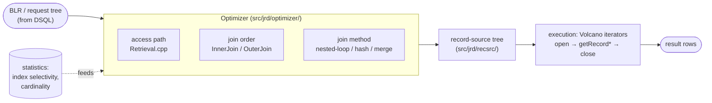
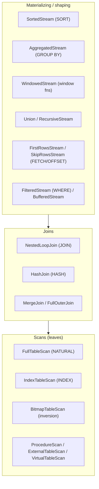

# Query Optimizer and Execution Engine

Once a query has been parsed (see the [grammar and parser document](grammar-and-parser.md)), two things must happen before results come back: the **optimizer** decides *how* to run it — which indexes to use, in what order to join tables, which join algorithm — and the **execution engine** actually runs that plan against the data. This document describes both for Firebird 6, grounded in the vendored source (`src/jrd/optimizer/`, `src/jrd/recsrc/`, `doc/README.Optimizer.txt`) and verified with real query plans from a live server, then compares them with PostgreSQL, MySQL and SQLite.

It closes the query-lifecycle arc: the [grammar document](grammar-and-parser.md) covered text → parse tree → BLR, and this one covers BLR → plan → rows. It also pairs with the [monitoring and tuning document](monitoring-and-tuning.md) (reading plans and statistics operationally) and the [on-disk structure document](on-disk-structure.md) (the pages the executor reads).

**Table of Contents**

* [Where optimization and execution sit](#where-optimization-and-execution-sit)
* [The cost-based optimizer](#the-cost-based-optimizer)
* [Access-path selection](#access-path-selection)
* [Join order and join methods](#join-order-and-join-methods)
* [The execution engine: a Volcano iterator tree](#the-execution-engine-a-volcano-iterator-tree)
* [Reading plans (validated output)](#reading-plans-validated-output)
* [Comparison: PostgreSQL, MySQL, SQLite](#comparison-postgresql-mysql-sqlite)
* [Discussion](#discussion)
* [Further research](#further-research)

## Where optimization and execution sit



_Figure 1: BLR enters the cost-based optimizer, which emits a record-source tree that the engine executes as a pull-based iterator pipeline_

The optimizer's output is a tree of **record sources** (`src/jrd/recsrc/`) — the physical operators. The executor runs that tree in the classic **Volcano / iterator** model: each operator exposes `open()`, `getRecord()` (pull one row) and `close()`, and a parent pulls rows from its children on demand. The textual `PLAN` you can print is a serialization of this record-source tree.

## The cost-based optimizer

Firebird's optimizer is **cost-based**: it estimates the cost of alternative plans and picks the cheapest, rather than following fixed syntactic rules. The cost model lives in `src/jrd/optimizer/Optimizer.h`, and its constants reveal the model's shape:

| Constant | Value | Meaning |
|---|---|---|
| `DEFAULT_INDEX_COST` | 3.0 | Baseline cost of an index scan (≈ page accesses to descend a B-tree) |
| `COST_FACTOR_MEMCOPY` | 0.5 | CPU work is cheaper than a page access (the unit cost) |
| `COST_FACTOR_HASHING` | 0.5 | Per-row cost of building/probing a hash table |
| `COST_FACTOR_QUICKSORT` | 0.1 | Per-row cost of an in-memory sort comparison |
| `DEFAULT_SELECTIVITY` | 0.1 | Assumed fraction of rows a predicate keeps when unknown |
| `DEFAULT_CARDINALITY` | 1000.0 | Assumed row count when statistics are absent |
| `MINIMUM_CARDINALITY` / `THRESHOLD_CARDINALITY` | 1.0 / 5.0 | Floors used in estimates |

Two quantities drive every decision: **cardinality** (how many rows a stream produces) and **selectivity** (what fraction a predicate keeps). Selectivity comes from per-index statistics stored in `RDB$STATISTICS` (and per-segment selectivity since ODS 11), recomputed with `SET STATISTICS INDEX <name>` — stale statistics are the classic reason a good index is passed over (see the [tuning document](monitoring-and-tuning.md#firebird-trace-profiler-and-statistics)). The optimizer combines predicate selectivities the standard way — `s1 * s2` for AND, `s1 + s2 - s1*s2` for OR (visible in `Optimizer.h`).

## Access-path selection

For each table (stream), the optimizer decides how to fetch rows — the job of `Retrieval.cpp`. The candidates, in roughly increasing sophistication:

- **Natural (full table) scan** — read every data page via the pointer page; the fallback when no useful index exists, and cheapest when a query touches most of the table.
- **Index scan** — descend a B-tree to find matching rows; chosen when a predicate is *sargable* (matches an index) and selective enough to beat a full scan.
- **Bitmap / inversion** — Firebird can build a **bitmap of record numbers** from one or more indexes and combine them with AND/OR before touching data pages. This lets it use *several* indexes for one table in a single query (an "inversion" of index conditions). A **unique index fully matched by equality** short-circuits the search — nothing can be cheaper than one row.

The choice is the cost comparison: `index cost (≈3 + descent) × rows returned` versus `natural cost ≈ pages in table`. When a predicate is not selective, the full scan wins — which is why the `salary = 1234` query below chose `NATURAL` even though every column *could* have had an index.

## Join order and join methods

For multi-table queries the optimizer makes two coupled decisions:

**Join order** (`InnerJoin.cpp` for inner joins, `OuterJoin.cpp` for outer) — which table to drive from and the sequence to join the rest. This is the combinatorially expensive part; Firebird evaluates orderings by estimated cost, preferring to drive from the stream that produces the fewest rows after its local predicates, so an index on the *inner* table of each step can be used.

**Join method** — the physical algorithm:

- **Nested-loop join** (`NestedLoopJoin.cpp`) — for each outer row, look up matches in the inner (ideally via an index). Best when the outer side is small and the inner has a selective index; shown as `PLAN JOIN (...)`.
- **Hash join** (`HashJoin.cpp`, Firebird 5) — build a hash table on the smaller side, probe it with the larger. Best for equi-joins where neither side has a useful index and both are scanned; shown as `PLAN HASH (...)`. This was the headline optimizer addition in Firebird 5.
- **Merge join** (`MergeJoin.cpp`) — sort both inputs on the join key and merge. Used for equality joins on expressions where sorting is worthwhile.

The FB5 arrival of hash joins is significant: before it, Firebird had only nested-loop joins, so a join with no usable index degraded badly; now the optimizer costs a hash join as an alternative and picks it when appropriate (verified below).

## The execution engine: a Volcano iterator tree

The optimizer's plan is materialized as a tree of **record sources** — the physical operators in `src/jrd/recsrc/`. Each derives from `RecordSource` and implements the pull-based iterator interface (`RecordSource.h`): `internalOpen()`, `internalGetRecord()` (produce the next row or signal end), and `close()`. A parent operator repeatedly pulls from its children, so rows flow up the tree one at a time without materializing intermediate results (except where an operator must, like sort).

The operator taxonomy (each a file in `recsrc/`):



_Figure 2: Firebird's execution operators (`src/jrd/recsrc/`) — scans at the leaves, joins in the middle, shaping/materializing operators above; the executor pulls rows up this tree_

A plan like `SORT (JOIN (D NATURAL, E INDEX (EMP_DEPT)))` is exactly this tree: a `SortedStream` on top of a `NestedLoopJoin` whose outer is a `FullTableScan` of `D` and whose inner is an `IndexTableScan` of `E`. Reading a `PLAN` is reading the operator tree.

## Reading plans (validated output)

All of the following are **real `PLAN` output** from a live Firebird 6 server (an `emp`/`dept` schema, 5,000 employees across 20 departments, statistics refreshed):

```text
-- 1. PK equality -> unique index (nothing cheaper than one row)
select name from emp where id = 42;
PLAN ("PUBLIC"."EMP" INDEX ("PUBLIC"."RDB$PRIMARY2"))

-- 2. non-indexed, non-selective predicate -> full scan
select name from emp where salary = 1234;
PLAN ("PUBLIC"."EMP" NATURAL)

-- 3. selective indexed predicate -> index scan
select name from emp where dept_id = 5;
PLAN ("PUBLIC"."EMP" INDEX ("PUBLIC"."EMP_DEPT"))

-- 4. join, driven from the filtered small table, index on the inner
select e.name, d.name from emp e join dept d on e.dept_id = d.id where d.id = 3;
PLAN JOIN ("D" INDEX ("PUBLIC"."RDB$PRIMARY1"), "E" INDEX ("PUBLIC"."EMP_DEPT"))

-- 5. join + ORDER BY -> a sort on top of the join
select e.name, d.name from emp e join dept d on e.dept_id = d.id order by e.salary;
PLAN SORT (JOIN ("D" NATURAL, "E" INDEX ("PUBLIC"."EMP_DEPT")))

-- 6. GROUP BY -> read in index order to group without a separate sort
select dept_id, count(*), avg(salary) from emp group by dept_id;
PLAN ("PUBLIC"."EMP" ORDER "PUBLIC"."EMP_DEPT")

-- 7. equi-join, neither side indexed, both scanned -> HASH join (FB5)
select count(*) from a join b on a.v = b.v;
PLAN HASH ("PUBLIC"."A" NATURAL, "PUBLIC"."B" NATURAL)
```

Every optimizer decision above is legible: equality on a unique key → that index (1); an unindexed predicate → `NATURAL` (2); a selective indexed predicate → that index (3); a join steered by a selective filter → nested-loop with an index on the inner (4); an `ORDER BY` the join can't satisfy for free → a `SORT` node (5); grouping served by reading in index order to avoid a sort (6); and an indexless equi-join → a `HASH` join (7). The plan is also available for a *running* statement in `MON$STATEMENTS.MON$EXPLAINED_PLAN` (see [monitoring](monitoring-and-tuning.md#reading-the-optimizer-query-plans)).

## Comparison: PostgreSQL, MySQL, SQLite

| Aspect | **Firebird** | **PostgreSQL** | **MySQL** | **SQLite** |
|---|---|---|---|---|
| Optimizer type | Cost-based | Cost-based | Cost-based | Cost-based (NGQP) |
| Join-order search | Cost-driven ordering (`InnerJoin`) | System-R dynamic programming; **GEQO** genetic search for many joins | Greedy cost-based search | Heuristic + N-nearest-neighbour ([NGQP](https://sqlite.org/queryplanner-ng.html)) |
| Join methods | Nested-loop, **hash (FB5)**, merge | Nested-loop, hash, merge | Nested-loop, **hash (8.0)** | Nested-loop only |
| Multi-index per table | **Bitmap/inversion** | Bitmap index scan | Index merge | Rarely (one index/table) |
| Statistics | `RDB$STATISTICS` selectivity; `SET STATISTICS` | `ANALYZE` → `pg_statistic` (histograms, MCV) | `ANALYZE TABLE` (histograms 8.0) | `ANALYZE` → `sqlite_stat` |
| Execution model | Volcano iterators (`recsrc/`) | Volcano iterators | Iterator executor (8.0) | Bytecode VM (VDBE) |
| Plan output | `PLAN` / `MON$EXPLAINED_PLAN` | [`EXPLAIN [ANALYZE]`](https://www.postgresql.org/docs/current/using-explain.html) | [`EXPLAIN [ANALYZE]`](https://dev.mysql.com/doc/refman/8.4/en/execution-plan-information.html) | [`EXPLAIN QUERY PLAN`](https://sqlite.org/eqp.html) |
| Optimizer hints | Explicit `PLAN` clause; `OPTIMIZE FOR` | None (by design) | [Optimizer hints](https://dev.mysql.com/doc/refman/8.4/en/optimizer-hints.html) | Limited (`INDEXED BY`) |

## Discussion

**Firebird, PostgreSQL and MySQL 8 all converged on the same executor shape.** All three run a **Volcano/iterator** pipeline of physical operators pulling rows on demand — Firebird always did (its `recsrc/` operators are a textbook set), PostgreSQL always did, and MySQL 8.0 rebuilt its executor into this form (replacing the old bespoke nested-loop machinery). SQLite is the deliberate outlier: it compiles the plan to **VDBE bytecode** and runs it on a register virtual machine (see the [architecture comparison](architecture-comparison.md#sqlite)), a different execution model that suits its tiny, embedded design.

**Hash joins mark Firebird's and MySQL's maturation.** For years both had only nested-loop joins, which punish any join lacking a usable index. MySQL added hash joins in 8.0 and Firebird in 5.0 — and the effect is visible in plan #7 above, where an indexless equi-join that would once have been a slow nested loop is now a `HASH` join. PostgreSQL has had the full trio (nested-loop, hash, merge) for decades; the others have caught up.

**Join-order search is where the philosophies differ most.** PostgreSQL uses classic System-R dynamic programming, falling back to a **genetic algorithm** ([GEQO](https://www.postgresql.org/docs/current/geqo.html)) when the number of joined tables makes exhaustive search explode. SQLite's [NGQP](https://sqlite.org/queryplanner-ng.html) uses a nearest-neighbour heuristic tuned for its use case. Firebird and MySQL use cost-driven ordering that is effective for typical query sizes without PostgreSQL's genetic machinery. All four ultimately depend on the same fuel — fresh statistics — which is why "run ANALYZE / SET STATISTICS" is the universal first tuning step.

**Plans are the shared diagnostic language.** Every system exposes its chosen plan (`PLAN`, `EXPLAIN`, `EXPLAIN QUERY PLAN`), and reading it is reading the physical operator tree. Firebird's textual `PLAN` is terse but complete — `SORT (JOIN (...))` is a full description of the record-source tree — and the seven plans above show the whole decision space in one screen.

## Further research

**Firebird**

- [`doc/README.Optimizer.txt`](https://github.com/FirebirdSQL/firebird/blob/master/doc/README.Optimizer.txt) — optimizer behaviour and enhancements by ODS/version.
- [`src/jrd/optimizer/`](https://github.com/FirebirdSQL/firebird/tree/master/src/jrd/optimizer) — `Optimizer.cpp` (driver and cost model), `Retrieval.cpp` (access paths), `InnerJoin.cpp` / `OuterJoin.cpp` (join ordering).
- [`src/jrd/recsrc/`](https://github.com/FirebirdSQL/firebird/tree/master/src/jrd/recsrc) — every execution operator (`RecordSource.h` for the iterator interface).
- The [monitoring and tuning document](monitoring-and-tuning.md) for reading plans and refreshing statistics, and the [grammar document](grammar-and-parser.md) for the parse step before optimization.

**PostgreSQL, MySQL, SQLite**

- PostgreSQL: [Planner/optimizer](https://www.postgresql.org/docs/current/planner-optimizer.html), [Genetic query optimizer](https://www.postgresql.org/docs/current/geqo.html), [Using EXPLAIN](https://www.postgresql.org/docs/current/using-explain.html).
- MySQL: [Optimizer hints](https://dev.mysql.com/doc/refman/8.4/en/optimizer-hints.html), [Hash joins](https://dev.mysql.com/doc/refman/8.4/en/hash-joins.html), [Execution-plan information](https://dev.mysql.com/doc/refman/8.4/en/execution-plan-information.html); MariaDB's [query optimizations](https://mariadb.com/kb/en/query-optimizations/).
- SQLite: [Query optimizer overview](https://sqlite.org/optoverview.html), [The next-generation query planner](https://sqlite.org/queryplanner-ng.html), [How the query planner works](https://sqlite.org/queryplanner.html).

**Background**

- [CMU 15-445 Database Systems](https://15445.courses.cs.cmu.edu/) — lectures on cost-based optimization, join algorithms and the iterator (Volcano) execution model that underpin every optimizer here.
