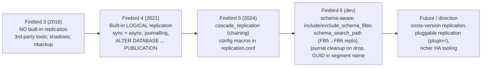
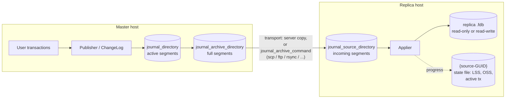
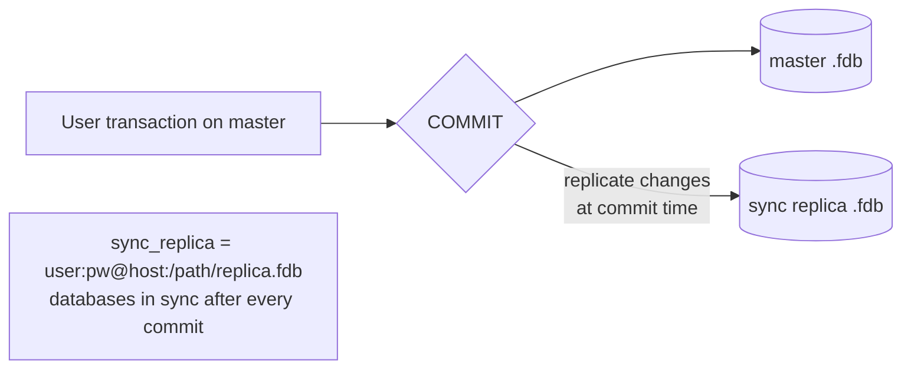
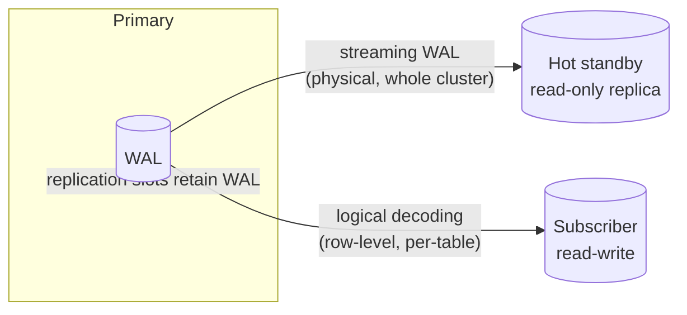
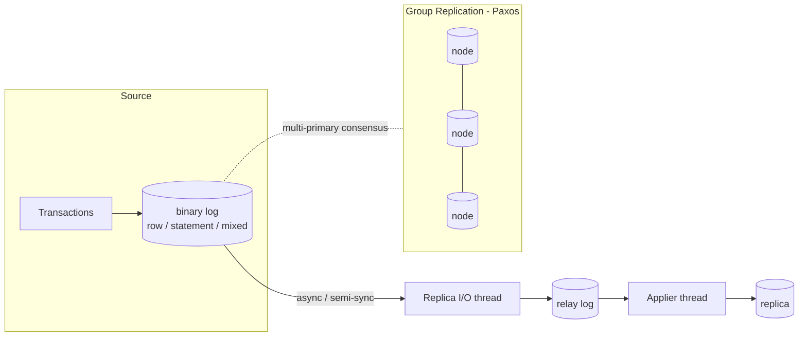
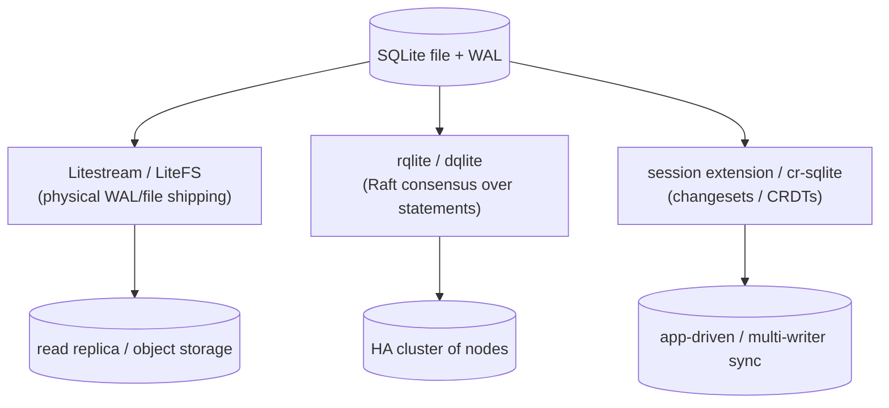

# Replication Architecture: Firebird, PostgreSQL, MySQL and SQLite

Replication — keeping a second copy of a database in step with the first — is where a database engine's transaction, logging and storage architecture all surface at once. This document traces how replication evolved in Firebird across versions 3, 4, 5, 6 and beyond, documents how to set it up (with a walk-through validated against a live Firebird 6 server), and compares Firebird's approach with PostgreSQL, MySQL and SQLite.

It is a companion to the [main paper](README.md) and to the other comparison documents: [architecture comparison](architecture-comparison.md) (storage and transactions across the four engines), the [wire-protocol document](firebird-wire-protocol.md) (the networked client protocol), and the [embedded comparison](embedded-architecture-comparison.md). The Firebird facts are grounded in the vendored source — [`doc/README.replication.md`](https://github.com/FirebirdSQL/firebird/blob/master/doc/README.replication.md), [`src/jrd/replication/`](https://github.com/FirebirdSQL/firebird/tree/master/src/jrd/replication) and the shipped `replication.conf` — and in the Firebird 5 and 6 release notes.

**Table of Contents**

* [Two kinds of replication](#two-kinds-of-replication)
* [Firebird: evolution 3 → 4 → 5 → 6 → future](#firebird-evolution-3--4--5--6--future)
* [Firebird replication architecture](#firebird-replication-architecture)
* [Setting up Firebird replication (validated walk-through)](#setting-up-firebird-replication-validated-walk-through)
* [PostgreSQL replication](#postgresql-replication)
* [MySQL replication](#mysql-replication)
* [SQLite: replication as a bolt-on](#sqlite-replication-as-a-bolt-on)
* [Side-by-side comparison](#side-by-side-comparison)
* [Discussion](#discussion)
* [Further research](#further-research)

## Two kinds of replication

One distinction runs through the whole comparison:

- **Physical (page/block-level) replication** ships the low-level changes to storage — data pages, or the write-ahead log records that describe page edits. The replica is a byte-for-byte copy and can usually only be opened read-only (or not at all) while replicating. It is simple, fast and exact, but the two databases must be the same engine version and architecture, and you cannot replicate a *subset*.
- **Logical (row-level) replication** ships the logical effects of transactions — "row X inserted", "row Y updated", DDL statements — reconstructed and re-applied as operations on the replica. It can be selective (some tables), can cross versions, and can leave the replica writable, at the cost of more machinery and the possibility of conflicts.

Firebird's built-in replication is **logical**. PostgreSQL offers **both** (physical streaming *and* logical). MySQL's native replication is **logical** (from the binary log). SQLite has **neither** built in and relies on external tools that mostly work at the **physical** (file/WAL) level, or on consensus wrappers.

## Firebird: evolution 3 → 4 → 5 → 6 → future



_Figure 1: Firebird replication timeline_

**Firebird 3 and earlier — no built-in replication.** Firebird 3 had no engine-level replication at all. High availability was achieved with third-party products (IBReplicator, the FBReplicator/replication triggers approach, SymmetricDS) or with Firebird's older built-in mechanisms that are *replication-adjacent* but not logical replication: **database shadows** (a synchronous, page-level local mirror maintained by the engine — good against disk failure, but same host / same file lineage) and **`nbackup`** physical incremental backups (a manual, physical ship-the-delta scheme). None of these gave transactional, network, row-level replication out of the box.

**Firebird 4 (2021) — built-in logical replication.** This is the watershed. Firebird 4 introduced engine-native, uni-directional (master → replica) **logical** replication, in a new subsystem [`src/jrd/replication/`](https://github.com/FirebirdSQL/firebird/tree/master/src/jrd/replication) whose parts map directly to the pipeline in Figure 2: `Publisher`, `ChangeLog`, `Replicator`, `Applier`, `Manager`. It tracks inserts/updates/deletes, sequence (generator) changes and DDL; it is transactional and preserves commit order; it offers **synchronous** and **asynchronous** modes and **read-only** or **read-write** replicas; and replicated tables must have a primary or unique key. Configuration is a single `replication.conf` plus DDL (`ALTER DATABASE ENABLE PUBLICATION`).

**Firebird 5 (2024) — cascading and macros.** Firebird 5 added [`cascade_replication`](https://www.firebirdsql.org/file/documentation/release_notes/html/en/5_0/rlsnotes50.html): changes *applied* to a replica can themselves be replicated onward, enabling replication chains (A → B → C). It also allowed configuration-file macros in `replication.conf`. The core architecture was unchanged; these are operability improvements.

**Firebird 6 (in development) — schema awareness and housekeeping.** Because Firebird 6 introduced SQL schemas (see the [main paper](README.md#firebird-6-in-development-schemas-and-ods-14)), replication became schema-aware: the new [`include_schema_filter` / `exclude_schema_filter`](https://github.com/FirebirdSQL/firebird-documentation/tree/master/src/docs/asciidoc/en/rlsnotes/rlsnotes60) settings filter by schema, and **`schema_search_path`** (configured on the replica only) lets a schema-less **Firebird 5 primary replicate into a Firebird 6 replica** — an explicitly supported cross-version path. Two housekeeping changes also landed: journal segment files are now **deleted when the database is dropped** (with pending data archived first), and the **database GUID is embedded in the segment filename** to avoid collisions when a database is deleted and recreated (verified below: the segment was named `master.fdb_{F122BE1B-…}.journal-000000001`).

**Future direction.** The trajectory is clear from the code and release notes: broader cross-version support (6.0 already replicates from 5.0), a `plugin=` setting in `replication.conf` pointing to pluggable replication back-ends, and continued investment in HA operability. Bi-directional / multi-master replication is *not* a built-in Firebird feature and the documentation is careful to frame built-in replication as uni-directional master-replica; read-write replicas exist but conflict resolution is left to the user.

## Firebird replication architecture

Firebird replication has two modes that share the same change-capture front end but differ in transport.

**Asynchronous (journal-based).** Committed changes are written to a local **journal** made of fixed-size **segments**. Segments are numbered sequentially and, combined with the database UUID, are globally unique. A full segment is **archived** (copied by the server, or by a custom `journal_archive_command` — compression, FTP, `scp`, anything); the archived segments are transported to the replica host, where the server scans a **source directory**, applies each segment in order via the `Applier`, and records progress in a per-source state file named `{source-GUID}`. Once a segment is applied and no straddling transactions remain, it is deleted.



_Figure 2: Firebird asynchronous (journalling) replication — segments are produced, archived, transported, and applied in commit order_

**Synchronous.** The master holds a live connection to each replica (`sync_replica = user:password@host:/path/replica.fdb`) and pushes changes at commit time, so the databases are in step after every commit — at the cost of network round-trips on the commit path. Multiple synchronous replicas are allowed.



_Figure 3: Firebird synchronous replication — the replica is updated inside the commit path_

Both modes are **logical**: they carry record-level operations, not pages. This is why a replicated table needs a primary/unique key (to identify the row to update or delete on the replica) and why DDL is replicated as statements.

## Setting up Firebird replication (validated walk-through)

The steps below were run against a live Firebird 6.0 server; the outputs are real. They set up **asynchronous** replication between two databases on one host (the source directory stands in for the transported archive).

**1. On the master — enable publication and choose tables** (DDL, over a normal connection):

```sql
ALTER DATABASE ENABLE PUBLICATION;
ALTER DATABASE INCLUDE ALL TO PUBLICATION;   -- or: INCLUDE TABLE t1, t2 TO PUBLICATION
COMMIT;
```

**2. On the master — configure the journal** in `replication.conf` (per-database section, full path required):

```
database = /data/master.fdb
{
    journal_directory = /data/journal/
    journal_archive_directory = /data/archive/
    journal_archive_command = "test ! -f $(archivepathname) && cp $(pathname) $(archivepathname)"
    journal_archive_timeout = 5
}
```

Master-side changes take effect after all users reconnect. The server begins producing segments; a full/timed-out segment is archived. Verified segment name (note the embedded database GUID — the Firebird 6 change):

```
/data/archive/master.fdb_{F122BE1B-19CE-4307-BF07-7B3CAB2216EE}.journal-000000001
```

**3. Create the replica** from a physical copy of the master, then flag it. `nbackup` is the clean way:

```sh
nbackup -b 0 /data/master.fdb /data/replica.fdb -user SYSDBA -password masterkey
nbackup -f      /data/replica.fdb -user SYSDBA -password masterkey   # fixup
gfix -replica read_only /data/replica.fdb -user SYSDBA -password masterkey
```

`gstat -h` then shows the replica flag:

```
Attributes    force write, read-only replica
```

**4. On the replica — point at the incoming segments** in `replication.conf`:

```
database = /data/replica.fdb
{
    journal_source_directory = /data/archive/     # where transported segments arrive
    # source_guid = "{F122BE1B-19CE-4307-BF07-7B3CAB2216EE}"   # optional: pin the accepted source
}
```

Replica-side changes require a **server restart** (the master side only needs a reconnect).

**5. Verify.** Insert on the master, wait for the archive timeout plus the replica scan, and read the replica. Real result after inserting rows 2–4 on the master:

```text
=== MASTER rows ===          === REPLICA rows ===
 ID NAME                      ID NAME
  1 before-replication         1 before-replication
  2 replicated-row-two         2 replicated-row-two
  3 replicated-row-three       3 replicated-row-three
  4 live-change                4 live-change
```

And the read-only replica correctly refuses direct writes:

```text
insert into t1 values (99, 'nope');
Statement failed, SQLSTATE = 25006
attempted update during read-only transaction
```

To promote a replica to a normal database (e.g. after failover) or stop replication: `gfix -replica none /data/replica.fdb`.

## PostgreSQL replication

PostgreSQL offers **both** physical and logical replication, both built on the write-ahead log (see the [main paper's storage discussion](architecture-comparison.md#postgresql) — PostgreSQL is an ARIES-style WAL system, unlike Firebird's no-WAL design).

- **Physical / streaming replication** ([high availability docs](https://www.postgresql.org/docs/current/high-availability.html), [warm standby](https://www.postgresql.org/docs/current/warm-standby.html)) ships the raw WAL byte stream from the primary to one or more **standbys**, which replay it. Standbys can serve read-only queries (*hot standby*); replication can be asynchronous or synchronous; **replication slots** ensure the primary retains WAL a standby still needs; and standbys can cascade. The replica is an exact physical copy, same version and architecture, whole-cluster only.
- **Logical replication** ([logical replication](https://www.postgresql.org/docs/current/logical-replication.html), built on [logical decoding](https://www.postgresql.org/docs/current/logicaldecoding.html)) decodes the WAL into row-level changes and re-applies them via a **publication/subscription** model (`CREATE PUBLICATION` on the source, `CREATE SUBSCRIPTION` on the target). It is selective (per-table), can cross major versions, and the subscriber is a full read-write database — the direct analogue of Firebird's logical replication, with pub/sub DDL that closely parallels Firebird's `... TO PUBLICATION`.



_Figure 4: PostgreSQL — physical streaming and logical (pub/sub) replication, both derived from the WAL_

Minimal logical setup: on the publisher `CREATE PUBLICATION mypub FOR ALL TABLES;` (with `wal_level = logical`); on the subscriber `CREATE SUBSCRIPTION mysub CONNECTION '...' PUBLICATION mypub;`. HA orchestration (failover, promotion) is typically handled by external tools (Patroni, repmgr).

## MySQL replication

MySQL's native replication is **logical**, driven by the **binary log (binlog)** — and this is architecturally central: unlike Firebird (which had to *add* a journal in v4) MySQL has always written a binlog as the server-layer change stream, which is exactly why replication has been MySQL's signature strength (see the [architecture comparison](architecture-comparison.md#mysql)). The binlog records changes in `STATEMENT`, `ROW`, or `MIXED` format; the replica's I/O thread copies binlog events into a relay log and an applier (SQL) thread replays them.

- **Asynchronous** by default; **semi-synchronous** available via plugin (the primary waits for at least one replica to acknowledge receipt before committing).
- **GTIDs** (global transaction identifiers, [since 5.6](https://dev.mysql.com/doc/refman/8.4/en/replication-gtids.html)) give every transaction a cluster-unique id, making failover and replica repositioning reliable.
- **Group Replication** ([since 5.7.17](https://dev.mysql.com/doc/refman/8.4/en/group-replication.html)) is a Paxos-based, fault-tolerant, optionally multi-primary layer — the foundation of InnoDB Cluster — that brings consensus-based HA into the product itself.



_Figure 5: MySQL — binlog-based replication (async / semi-sync) and consensus-based Group Replication_

Minimal classic setup: enable the binlog and a unique `server_id` on the source, create a replication user, then on the replica `CHANGE REPLICATION SOURCE TO ... ; START REPLICA;` (GTID-based auto-positioning is recommended).

## SQLite: replication as a bolt-on

SQLite has **no built-in replication** — consistent with its serverless, single-writer design (see the [embedded comparison](embedded-architecture-comparison.md)). Replication is provided by external projects that wrap the file or the WAL, and they fall into three families:

- **Physical WAL/file shipping (disaster recovery, read replicas).** [Litestream](https://litestream.io/) ([repo](https://github.com/benbjohnson/litestream)) continuously streams the WAL to object storage (S3, etc.) for point-in-time restore. [LiteFS](https://fly.io/docs/litefs/) ([repo](https://github.com/superfly/litefs)) is a FUSE filesystem that replicates transactions from a single writable primary to read-only followers.
- **Consensus-based distributed SQLite (HA clusters).** [rqlite](https://rqlite.io/) ([repo](https://github.com/rqlite/rqlite)) and [dqlite](https://dqlite.io/) ([repo](https://github.com/canonical/dqlite)) put a **Raft** consensus layer over SQLite so a cluster of nodes agrees on an ordered log of statements — turning SQLite into a small, fault-tolerant distributed store.
- **Change-set / CRDT sync (application-driven, multi-writer).** The built-in [session extension](https://www.sqlite.org/sessionintro.html) records **changesets/patchsets** an application can transport and apply elsewhere (a manual, logical sync primitive). [cr-sqlite](https://github.com/vlcn-io/cr-sqlite) adds CRDTs for conflict-free multi-writer merge.



_Figure 6: SQLite has no native replication — external tools add it at the file/WAL, consensus, or change-set level_

## Side-by-side comparison

| Aspect | **Firebird** | **PostgreSQL** | **MySQL** | **SQLite** |
|---|---|---|---|---|
| Built-in replication? | **Yes, since v4** (2021) | Yes (physical since 9.x, logical since 10) | **Yes** (always, via binlog) | **No** (external tools) |
| Kind | Logical (row-level) | **Both** physical (WAL streaming) + logical | Logical (binlog) | Physical file/WAL, or consensus, or changesets (all external) |
| Underlying stream | Journal segments (added for replication) | The **WAL** (also used for crash recovery) | The **binlog** (server-layer change log) | The WAL / file (shipped by external tools) |
| Topology | Master → replica, uni-directional; cascading (v5) | Primary → standby(s); cascading; logical pub/sub | Source → replica(s); chained; Group Replication (multi-primary) | Depends on tool: leader/follower (LiteFS) or Raft cluster (rqlite/dqlite) |
| Sync modes | Synchronous & asynchronous | Synchronous & asynchronous | Async, semi-sync, group (consensus) | Tool-dependent (Litestream async; Raft synchronous-ish) |
| Selective (per-table) | Yes (publication set) | Logical: yes; physical: no | Yes (replicate/ignore filters) | changesets: yes; others: no |
| Replica writable? | Read-only or read-write | Physical: read-only; logical: read-write | Read-write (care needed) | Tool-dependent |
| Cross-version | v5 → v6 supported (`schema_search_path`) | Logical: across majors; physical: no | Across adjacent versions | N/A |
| Conflict resolution | User's responsibility (no auto-merge) | Logical: basic, else user | User / Group Replication certification | cr-sqlite CRDTs; else user |
| Config surface | `replication.conf` + `ALTER DATABASE ... PUBLICATION` | `postgresql.conf` + `CREATE PUBLICATION/SUBSCRIPTION` | `my.cnf` + `CHANGE REPLICATION SOURCE` + GTID | The chosen tool's config |
| Reference | [`README.replication.md`](https://github.com/FirebirdSQL/firebird/blob/master/doc/README.replication.md) | [HA docs](https://www.postgresql.org/docs/current/high-availability.html) | [replication docs](https://dev.mysql.com/doc/refman/8.4/en/replication.html) | [Litestream](https://litestream.io/) / [rqlite](https://rqlite.io/) / [session](https://www.sqlite.org/sessionintro.html) |

## Discussion

**The change stream you already have decides the replication you get.** MySQL wrote a binlog from the start as a server-layer change log, so logical replication was essentially free and became its defining strength. PostgreSQL had a WAL for crash recovery, so *physical* streaming came naturally, and *logical* replication arrived later by teaching the system to **decode** that same WAL. Firebird's multi-generational engine deliberately has **no** write-ahead log (crash safety comes from careful write ordering — see the [architecture comparison](architecture-comparison.md#firebird-recap)), so when the project wanted replication it had to add a **new** stream, the journal — which is exactly what Firebird 4 did. Four engines, and in each case the replication design falls out of what the engine was already writing to disk.

**Logical is the industry's centre of gravity, and Firebird landed squarely on it.** Firebird 4's built-in logical replication put it in the same design family as PostgreSQL logical replication and MySQL binlog replication: transactional, row-level, commit-ordered, selective, key-dependent, with user-resolved conflicts on writable replicas. The subsequent versions refined operability (v5 cascading, v6 schema-awareness and cross-version) rather than changing the model — a mature, incremental path.

**SQLite's absence is a design statement, not a gap.** A serverless, single-writer engine has no process to run a replication protocol and no shared log to stream, so replication is necessarily something you wrap around it — and the ecosystem obliged with three distinct answers (WAL shipping, Raft consensus, changesets/CRDTs). This mirrors the [embedded comparison's](embedded-architecture-comparison.md) conclusion: SQLite pushes cross-node concerns outside the engine on purpose, where Firebird (even embedded) brings the full machinery with it.

## Hands-on: samples, tests and debugging

### C++ sample — [`samples/cpp/replication.cpp`](samples/cpp/replication.cpp)

The client-visible half of the [walk-through](#setting-up-firebird-replication-validated-walk-through) — everything that needs no `replication.conf` and no restart. On a scratch database it walks the publication through its states with plain DDL and reads the system tables that record each step: `ALTER DATABASE ENABLE PUBLICATION` flips `RDB$PUBLICATIONS.RDB$ACTIVE_FLAG`, `INCLUDE TABLE` adds a row to `RDB$PUBLICATION_TABLES` (schema-qualified — the Firebird 6 `RDB$TABLE_SCHEMA_NAME` column from the [evolution section](#firebird-evolution-3--4--5--6--future)), and `INCLUDE ALL` additionally sets `RDB$AUTO_ENABLE` so future tables join by themselves. `MON$DATABASE.MON$REPLICA_MODE` shows the other end of the relationship: this database is a publishing primary, not a replica.

```sh
cmake -B build samples && cmake --build build
./build/replication        # default: inet://localhost//tmp/fbhandson/replication.fdb
```

Verified output (trimmed to the state changes):

```text
-- initial state (publication exists but is inactive)
RDB$DEFAULT   ACTIVE_FLAG 0   AUTO_ENABLE 0    published: (none)
-- after ENABLE PUBLICATION
RDB$DEFAULT   ACTIVE_FLAG 1   AUTO_ENABLE 0    published: (none)
-- after INCLUDE TABLE REPL_ORDERS
RDB$DEFAULT   ACTIVE_FLAG 1   AUTO_ENABLE 0    published: PUBLIC.REPL_ORDERS
-- after INCLUDE ALL (auto-enable: future tables join automatically)
RDB$DEFAULT   ACTIVE_FLAG 1   AUTO_ENABLE 1    published: PUBLIC.REPL_ORDERS, PUBLIC.REPL_SCRATCH

MON$REPLICA_MODE
----------------
0
```

Note what it demonstrates about the model: there is exactly **one** publication per database (`RDB$DEFAULT` — unlike PostgreSQL's named `CREATE PUBLICATION` sets), it pre-exists in every database waiting to be enabled, and membership is per-table metadata. What the sample deliberately cannot show is a segment being produced: with no `journal_directory` configured for this database, the Publisher has nowhere to write — the transport half genuinely lives in server-side configuration, as the walk-through above describes.

### fb-cpp sample — [`samples/fb-cpp/replication.cpp`](samples/fb-cpp/replication.cpp)

The same publication state walk through [fb-cpp](https://github.com/asfernandes/fb-cpp) (vendored at [`extern/fb-cpp`](extern/fb-cpp)), the modern C++20 wrapper over the OO API. There is no replication-specific API on either side — the instructive diff is how little client code the walk needs once the plumbing is absorbed: each DDL step is a one-line `Statement{att, tra, sql}.execute(tra)`, the `RDB$PUBLICATIONS` / `RDB$PUBLICATION_TABLES` read-backs are `execute()` + `fetchNext()` loops, and every column arrives as `std::optional<std::string>` (`value_or("<null>")` making the nullable system columns explicit) instead of hand-decoded fetch buffers. The idempotent reset also shows typed error handling as control flow: each `DROP` / `DISABLE` is wrapped in `try { ... } catch (const DatabaseException&) {}`.

```sh
cmake -B build samples && cmake --build build   # needs libboost-dev + libboost-filesystem-dev
./build/fbcpp_replication
```

Verified: the same four-state progression — `RDB$DEFAULT` with `ACTIVE_FLAG 0 / AUTO_ENABLE 0` and nothing published, through `ACTIVE_FLAG 1`, then `PUBLIC.REPL_ORDERS`, then both tables with `AUTO_ENABLE 1` — ending in `MON$REPLICA_MODE = 0`. One rendering delta worth noticing: `getString()` returns the `CHAR(63)` system columns blank-padded to their full declared length (the OO-API sample trims them by hand), so the raw output shows `RDB$DEFAULT` and the table names trailed by spaces — a reminder that these identifier columns really are fixed-length `CHAR`, not `VARCHAR`.

### JavaScript sample — [`samples/nodejs/replication.js`](samples/nodejs/replication.js)

The same state walk through node-firebird (`cd samples/nodejs && node replication.js`), output as compact lines per state. Verified: identical progression ending in `MON$REPLICA_MODE = 0 (0 = not a replica: this is a publishing primary)`. Both samples reset the publication on entry (`EXCLUDE ALL FROM PUBLICATION` + `DISABLE PUBLICATION`), so they double as a demonstration that the whole publication lifecycle is reversible from a client.

### Rust sample — [`samples/rust/src/bin/replication.rs`](samples/rust/src/bin/replication.rs)

The same state walk through [rsfbclient](https://github.com/fernandobatels/rsfbclient), Rust's Firebird client (`cd samples/rust && cargo run --bin replication`). With no replication-specific API anywhere, what shows is the driver's shape for a DDL-heavy script: one explicit `SimpleTransaction` carries all four states, `tr.commit_retaining()` publishing each DDL step without giving up the transaction, and the idempotent reset leans on Firebird's statement-level atomicity — each `DROP` / `DISABLE` is a discarded `let _ = tr.execute(sql, ())`, because a failed statement dooms only itself, not the transaction (where fb-cpp needed `try`/`catch` per statement). The read-backs land in typed tuples — `Vec<(String, i64, i64)>` for `RDB$PUBLICATIONS` — and the `CHAR(63)` blank-padding the fb-cpp section flags is dealt with at the source, `TRIM(...)` in the query rather than in client code.

Verified: the identical four-state progression — `RDB$DEFAULT` at `active=0 auto_enable=0` with no published tables, then `active=1`, then `PUBLIC.REPL_ORDERS`, then `PUBLIC.REPL_ORDERS, PUBLIC.REPL_SCRATCH` with `auto_enable=1` after `INCLUDE ALL` — ending in `MON$REPLICA_MODE = 0` (this side publishes; it is not a replica).

### Free Pascal sample — [`samples/fpc/replication.pas`](samples/fpc/replication.pas)

The same publication state walk through [fbintf](https://github.com/MWASoftware/fbintf) (vendored at [`extern/fbintf`](extern/fbintf)), MWA Software's Firebird Pascal API — the layer under IBX — driving the same libfbclient as the C++ samples behind COM-style reference-counted interfaces (`make -C samples/fpc bin/replication && samples/fpc/bin/replication`). With no replication-specific API in any wrapper, the sample is pure plumbing choices: one `ITransaction` carries all four states with `Tr.CommitRetaining` publishing each DDL step (rsfbclient's `commit_retaining` pattern), each `ALTER DATABASE` is a one-line `A.ExecImmediate(Tr, sql)`, the idempotent reset wraps each `DROP` / `DISABLE` in `try ... except on EIBInterBaseError do ;` (fb-cpp's per-statement catch, in Pascal syntax), and the `CHAR(63)` blank-padding fb-cpp's section flags is handled the Rust way — `TRIM(...)` in the read-back queries, walked through `IResultSet.FetchNext`.

Verified: the identical four-state progression — `RDB$DEFAULT` at `active=0 auto_enable=0` with `(no tables in the publication)`, then `active=1`, then `published table: PUBLIC.REPL_ORDERS`, then both `PUBLIC.REPL_ORDERS` and `PUBLIC.REPL_SCRATCH` with `auto_enable=1` after `INCLUDE ALL` — ending in `MON$DATABASE.MON$REPLICA_MODE = 0` (not a replica: this side publishes).

### Things to try

- Create a new table *after* `INCLUDE ALL` and re-read `RDB$PUBLICATION_TABLES` — `RDB$AUTO_ENABLE` means it appears without any further DDL.
- Try `ALTER DATABASE INCLUDE TABLE REPL_SCRATCH TO PUBLICATION` alone: the DDL succeeds even though the table has no key — then check `firebird.log` after configuring a journal; the key requirement is enforced by the replication machinery, not the DDL.
- Read `RDB$PUBLICATIONS` on the `employee` database: the inactive `RDB$DEFAULT` row is there too — every Firebird 4+ database carries the publication machinery, enabled or not.
- If you can edit `replication.conf` on your own server (not the shared demo one), add a `journal_directory` for the scratch database and watch `<db>_{GUID}.journal-000000001` appear after the first committed change to `REPL_ORDERS`.

### Debugging this in C++ (gdb)

With a [debug build of the engine](debugging-firebird.md), the pipeline of [Figure 2](#firebird-replication-architecture) is breakpointable stage by stage:

```gdb
break AlterDatabaseNode::execute     # src/dsql/DdlNodes.epp:17626 — the PUBLICATION DDL itself
break REPL_store                     # src/jrd/replication/Publisher.cpp:506 — an INSERT entering the publisher
break REPL_modify                    # Publisher.cpp:540 — UPDATE: old + new record versions captured
break REPL_trans_commit              # Publisher.cpp:433 — commit-order preservation happens here
break ChangeLog::switchActiveSegment # src/jrd/replication/ChangeLog.cpp:792 — journal segment rollover
break Applier::process               # src/jrd/replication/Applier.cpp:327 — replica side: applying a segment
```

`REPL_store`/`REPL_modify` sit directly in the engine's record-writing path (`VIO`), which is the cleanest possible proof that Firebird replication is **logical**: what is captured is the record image (`rpb`), not the page. With only a publication enabled and no journal configured, these functions return early — single-step from `REPL_store` to watch the "is this table published?" check consult the same `RDB$PUBLICATION_TABLES` state the samples print. `REPL_trans_commit` is where the commit-order guarantee from the [architecture section](#firebird-replication-architecture) is enforced, and `Applier::process` (reached only on a replica) is the mirror image: segment operations re-executed as ordinary engine calls.

## Further research

**Firebird**

- [`doc/README.replication.md`](https://github.com/FirebirdSQL/firebird/blob/master/doc/README.replication.md) — the authoritative setup and architecture guide (the basis of the walk-through above).
- [`src/jrd/replication/`](https://github.com/FirebirdSQL/firebird/tree/master/src/jrd/replication) — the implementation: `Publisher`, `ChangeLog`, `Replicator`, `Applier`, `Manager`.
- Release notes: [Firebird 5](https://www.firebirdsql.org/file/documentation/release_notes/html/en/5_0/rlsnotes50.html) (cascading, macros) and [Firebird 6](https://github.com/FirebirdSQL/firebird-documentation/tree/master/src/docs/asciidoc/en/rlsnotes/rlsnotes60) (schema filters, `schema_search_path`, journal cleanup).

**PostgreSQL**

- [High availability, load balancing, replication](https://www.postgresql.org/docs/current/high-availability.html), [Log-shipping standby servers](https://www.postgresql.org/docs/current/warm-standby.html), [Logical replication](https://www.postgresql.org/docs/current/logical-replication.html), [Logical decoding](https://www.postgresql.org/docs/current/logicaldecoding.html).

**MySQL**

- [Replication](https://dev.mysql.com/doc/refman/8.4/en/replication.html), [Replication with GTIDs](https://dev.mysql.com/doc/refman/8.4/en/replication-gtids.html), [Group Replication](https://dev.mysql.com/doc/refman/8.4/en/group-replication.html); MariaDB's accessible [standard replication](https://mariadb.com/kb/en/standard-replication/) guide.

**SQLite**

- [Litestream](https://litestream.io/) and [LiteFS](https://fly.io/docs/litefs/) (physical shipping); [rqlite](https://rqlite.io/) and [dqlite](https://dqlite.io/) (Raft); the [session extension](https://www.sqlite.org/sessionintro.html) and [cr-sqlite](https://github.com/vlcn-io/cr-sqlite) (changesets / CRDTs).

**Background**

- [Architecture of a Database System](https://dsf.berkeley.edu/papers/fntdb07-architecture.pdf) (Hellerstein, Stonebraker, Hamilton) — logging, recovery and replication foundations.
