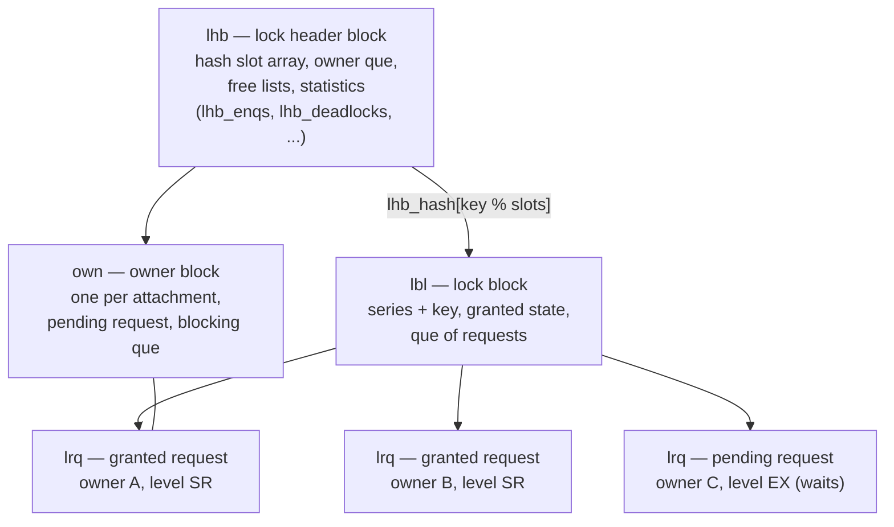
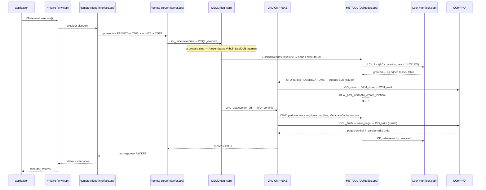
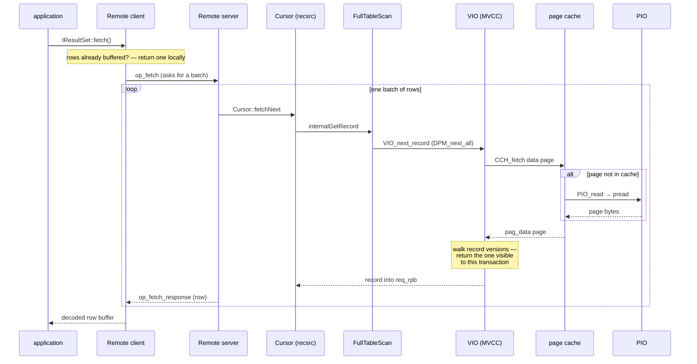
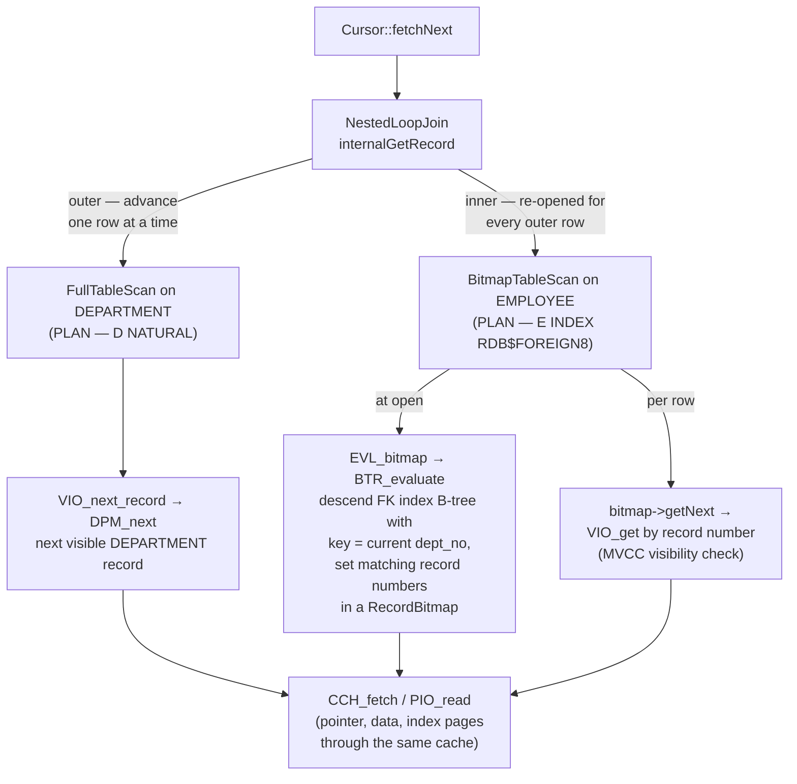

# Tracing a Request Through the Firebird Source Code

The original paper closes its use-scenario section with a request that **modifies database metadata** — thirteen prose steps that travel from the user application through the Remote module, DSQL, JRD, MET, the Lock manager, and the IO layer, and back. This document replays that exact scenario against the real Firebird 6 sources vendored at `extern/firebird`, module by module, function by function, structure by structure. The concrete example is a `CREATE TABLE` statement arriving over TCP/IP, because table creation exercises every hop the paper names: parsing, compilation, metadata writes, metadata locks, and the flush to disk.

It builds on the [grammar and parser document](grammar-and-parser.md) (what happens inside the parse step), the [query optimizer and execution document](query-optimizer-and-execution.md) (what happens when the request is DML rather than DDL), the [wire-protocol document](firebird-wire-protocol.md) (what the packets look like on the network), the [transactions document](transactions-and-concurrency.md) (what commit means), and the [on-disk structure document](on-disk-structure.md) (what the written pages contain).

**Table of Contents**

* [The paper's scenario, mapped to today's code](#the-papers-scenario-mapped-to-todays-code)
* [Stage 1: the user application and the Y-valve](#stage-1-the-user-application-and-the-y-valve)
* [Stage 2: the Remote module, client side](#stage-2-the-remote-module-client-side)
* [Stage 3: packaging the request for the network](#stage-3-packaging-the-request-for-the-network)
* [Stage 4: the Remote module, server side](#stage-4-the-remote-module-server-side)
* [Stage 5: DSQL — from SQL text to executable form](#stage-5-dsql--from-sql-text-to-executable-form)
* [Stage 6: CMP — compiling BLR into a runnable Statement](#stage-6-cmp--compiling-blr-into-a-runnable-statement)
* [Stage 7: EXE and the DDL path into MET](#stage-7-exe-and-the-ddl-path-into-met)
* [Stage 8: the Lock handler and the Lock manager](#stage-8-the-lock-handler-and-the-lock-manager)
* [Stage 9: commit — deferred work and the write to disk](#stage-9-commit--deferred-work-and-the-write-to-disk)
* [Stage 10: unlocking and the response path](#stage-10-unlocking-and-the-response-path)
* [The full round trip as a sequence](#the-full-round-trip-as-a-sequence)
* [The DML counterpart: a simple SELECT and a join](#the-dml-counterpart-a-simple-select-and-a-join)
* [Structure atlas](#structure-atlas)
* [What changed since the paper](#what-changed-since-the-paper)
* [Further research](#further-research)

## The paper's scenario, mapped to today's code

The paper's thirteen steps still describe Firebird accurately — but every step now has a name, a file, and a data structure. The table below is the skeleton of this whole document:

| # | Paper step | Where it happens in Firebird 6 |
|---|---|---|
| 1 | Request originates in the user application, passed to Remote client side | OO API call → `Dispatcher`/`YAttachment` ([`src/yvalve/why.cpp`](https://github.com/FirebirdSQL/firebird/blob/master/src/yvalve/why.cpp)) → `Statement::execute` ([`src/remote/client/interface.cpp`](https://github.com/FirebirdSQL/firebird/blob/master/src/remote/client/interface.cpp)) |
| 2 | Request is packaged depending on the network used and sent | `PACKET` + XDR serialization ([`src/remote/protocol.cpp`](https://github.com/FirebirdSQL/firebird/blob/master/src/remote/protocol.cpp)) over INET ([`src/remote/inet.cpp`](https://github.com/FirebirdSQL/firebird/blob/master/src/remote/inet.cpp)) or XNET ([`src/remote/os/win32/xnet.cpp`](https://github.com/FirebirdSQL/firebird/blob/master/src/remote/os/win32/xnet.cpp)) |
| 3 | DSQL transforms the request from SQL to BLR | `DSQL_prepare` → `prepareStatement` → `Parser::parse` → `GEN_statement` ([`src/dsql/dsql.cpp`](https://github.com/FirebirdSQL/firebird/blob/master/src/dsql/dsql.cpp), [`gen.cpp`](https://github.com/FirebirdSQL/firebird/blob/master/src/dsql/gen.cpp)) |
| 4 | JRD is called, CMP compiles the request | `CMP_compile` → `PAR_parse` → `Statement::makeStatement` ([`src/jrd/cmp.cpp`](https://github.com/FirebirdSQL/firebird/blob/master/src/jrd/cmp.cpp)) |
| 5 | EXE executes the request, MET is called | `DSQL_execute` → `DsqlDdlRequest::execute` → `DdlNode::executeDdl` ([`src/dsql/DsqlRequests.cpp`](https://github.com/FirebirdSQL/firebird/blob/master/src/dsql/DsqlRequests.cpp)) |
| 6 | Request executes in MET, modifying metadata | `CreateRelationNode::execute` stores into `RDB$RELATIONS` ([`src/dsql/DdlNodes.epp`](https://github.com/FirebirdSQL/firebird/blob/master/src/dsql/DdlNodes.epp), [`src/jrd/met.epp`](https://github.com/FirebirdSQL/firebird/blob/master/src/jrd/met.epp)) |
| 7 | Lock handler obtains a lock on the metadata | `LCK_lock(tdbb, lock, LCK_EX, LCK_WAIT)` on an `LCK_relation` lock ([`src/jrd/lck.cpp`](https://github.com/FirebirdSQL/firebird/blob/master/src/jrd/lck.cpp)) |
| 8 | Lock adds the lock to the lock table | `LockManager::enqueue` inserts an `lrq` into the shared-memory `lhb` table ([`src/lock/lock.cpp`](https://github.com/FirebirdSQL/firebird/blob/master/src/lock/lock.cpp)) |
| 9 | Virtual IO commits changes to disk | `TRA_commit` → `DFW_perform_work` → `CCH_flush` → `PIO_write` ([`src/jrd/tra.cpp`](https://github.com/FirebirdSQL/firebird/blob/master/src/jrd/tra.cpp), [`cch.cpp`](https://github.com/FirebirdSQL/firebird/blob/master/src/jrd/cch.cpp)) |
| 10 | Disk-handling routine depends on the file system | per-OS PIO implementations: [`src/jrd/os/posix/unix.cpp`](https://github.com/FirebirdSQL/firebird/blob/master/src/jrd/os/posix/unix.cpp) vs [`src/jrd/os/win32/winnt.cpp`](https://github.com/FirebirdSQL/firebird/blob/master/src/jrd/os/win32/winnt.cpp) |
| 11 | Lock handler removes the lock from the table | `LCK_release` → `LockManager::dequeue` |
| 12 | JRD returns success through the Remote module | `rem_port::send_response` builds an `op_response` packet ([`src/remote/server/server.cpp`](https://github.com/FirebirdSQL/firebird/blob/master/src/remote/server/server.cpp)) |
| 13 | Remote moves the message back to the user application | XDR over the wire → `receive_response` in the client → Y-valve → application |

One overview picture before the details. Function names sit on the arrows; each box is a module treated in its own stage below:

```mermaid
flowchart LR
    subgraph CLIENT["client process"]
        APP["user application"]
        YV["Y-valve<br/>why.cpp<br/>Dispatcher, YAttachment,<br/>YStatement"]
        RC["Remote client<br/>interface.cpp<br/>Rdb, Rsr, PACKET"]
    end
    subgraph WIRE["network"]
        NET["XDR + zlib + wire crypt<br/>protocol.cpp, inet.cpp<br/>(or xnet.cpp shared memory)"]
    end
    subgraph SERVER["server process"]
        RS["Remote server<br/>server.cpp<br/>process_packet"]
        JRD["JRD engine provider<br/>jrd.cpp<br/>JAttachment, JStatement"]
        DSQL["DSQL<br/>dsql.cpp, parse.y, gen.cpp<br/>DsqlStatement"]
        CMP["CMP<br/>cmp.cpp, par.cpp<br/>Statement, Request"]
        EXE["EXE<br/>exe.cpp, DsqlRequests.cpp"]
        MET["MET / DDL nodes<br/>DdlNodes.epp, met.epp, dfw.epp"]
        LCK["Lock handler<br/>lck.cpp - Lock"]
        LM["Lock manager<br/>lock.cpp<br/>shared lock table lhb"]
        CCH["page cache CCH<br/>cch.cpp - BufferDesc"]
        PIO["physical IO<br/>os/posix/unix.cpp<br/>os/win32/winnt.cpp"]
        DISK[("database file")]
    end
    APP -->|"IStatement::execute"| YV
    YV -->|"provider dispatch"| RC
    RC -->|"op_execute PACKET"| NET
    NET --> RS
    RS -->|"rsr_iface->execute"| JRD
    JRD -->|"DSQL_prepare / DSQL_execute"| DSQL
    DSQL -->|"BLR"| CMP
    CMP -->|"Statement"| EXE
    EXE -->|"executeDdl"| MET
    MET -->|"LCK_lock / LCK_release"| LCK
    LCK -->|"enqueue / dequeue"| LM
    MET -->|"VIO_store → DPM_store"| CCH
    CCH -->|"PIO_write"| PIO
    PIO --> DISK
```



_Figure 1: The thirteen paper steps as modules and calls in the Firebird 6 source tree_

## Stage 1: the user application and the Y-valve

The application talks to the [OO API](client-apis-and-drivers.md): it holds an `IAttachment`, prepares an `IStatement` with `IAttachment::prepare()`, and runs it with `IStatement::execute()`. What it actually holds are **Y-valve** objects from [`src/yvalve/why.cpp`](https://github.com/FirebirdSQL/firebird/blob/master/src/yvalve/why.cpp) — `YAttachment`, `YStatement`, `YTransaction`. The Y-valve is the dispatcher layer inside `libfbclient`: at attach time, `Dispatcher::attachDatabase` walks the list of **providers** (plugins implementing `IProvider`) and asks each to attach the given database string. For a remote connection string like `inet://localhost/employee` the **Remote provider** succeeds; for a plain local path the **engine provider** (`Engine14`) attaches directly in-process — that single fork is the whole [embedded-vs-server story](embedded-architecture-comparison.md).

Every `Y*` object is a thin shell holding the *next* provider's interface plus bookkeeping (status, child-object lists for cleanup). `YStatement::execute` does validity checks and forwards to the underlying provider's `IStatement::execute`. From here on, our request belongs to the Remote provider.

## Stage 2: the Remote module, client side

The Remote client lives in [`src/remote/client/interface.cpp`](https://github.com/FirebirdSQL/firebird/blob/master/src/remote/client/interface.cpp) and mirrors the whole OO API with classes whose job is to turn each call into a packet. Its state lives in a small family of structures from [`src/remote/remote.h`](https://github.com/FirebirdSQL/firebird/blob/master/src/remote/remote.h), shared — this is worth noticing — by client *and* server, since both ends speak the same protocol:

* **`struct Rdb`** — the remote view of one database attachment. Holds `rdb_port` (the communication port), `rdb_iface` (on the server side, the real engine attachment it proxies), linked lists of live objects on this attachment — `rdb_transactions` (`Rtr`), `rdb_requests` (compiled BLR requests, `Rrq`), `rdb_sql_requests` (SQL statements, `Rsr`), `rdb_events` — and, embedded right in the struct, `rdb_packet`: the reusable `PACKET` this attachment serializes into.
* **`struct Rsr`** — one remote SQL statement. Points back to its `Rdb` and its transaction `Rtr`, and carries the message plumbing: `rsr_bind_format` and `rsr_select_format` (parsed input/output message formats), `rsr_message`/`rsr_buffer` (a ring of `RMessage` buffers for batched fetches), `rsr_rows_pending`/`rsr_msgs_waiting` (pipelining counters), and a flag word whose values tell the story of remote statement life: `FETCHED`, `EOF_SET`, `LAZY` (allocate on first use), `DEFER_EXECUTE` (the packet may be held back and sent together with the next one).
* **`struct rem_port`** — the connection itself, and the paper's phrase "*packaged depending on the network used*" made literal: the port carries a table of function pointers — `port_receive_packet`, `port_send_packet`, `port_send_partial`, `port_connect`, `port_accept` — that INET and XNET fill differently. It also owns the socket (`port_handle`), the negotiated protocol version (`port_protocol`), the XDR streams (`port_send`, `port_receive`), the [wire-crypt plugin](firebird-wire-protocol.md) (`port_crypt_plugin`), the authentication block, a queue of deferred packets (`port_deferred_packets`), and `port_type` — an enum with exactly two values, `INET` and `XNET`.

`Statement::execute` (the remote one) assembles the call: it converts the caller's `IMessageMetadata` into BLR message descriptions with `BlrFromMessage` (the wire still describes messages in BLR, whatever API the app used), validates lengths against the port buffer size, fills the packet's `P_SQLDATA` payload — statement id, transaction id, BLR of the input message, the input message itself, output format — sets `p_operation = op_execute` (opcode 63 in [`src/remote/protocol.h`](https://github.com/FirebirdSQL/firebird/blob/master/src/remote/protocol.h)), and calls `send_packet`. For statements flagged `DEFER_EXECUTE`, `defer_packet` queues it instead, to ride along with the next round trip — one of several latency tricks (statement pipelining via `rsr_reorder_level` is another) invisible to the API user.

## Stage 3: packaging the request for the network

The `PACKET` (a big tagged union in `protocol.h` — `p_operation` plus one payload struct per operation family) is serialized by **XDR**, Sun's canonical external data representation, in [`src/remote/protocol.cpp`](https://github.com/FirebirdSQL/firebird/blob/master/src/remote/protocol.cpp). `xdr_protocol` is one giant switch over opcodes that reads or writes each field in network byte order — the same function encodes on one end and decodes on the other, driven by the stream direction. On top of that sit two optional wrappers negotiated at [connect time](firebird-wire-protocol.md): zlib compression (`REMOTE_deflate`) and protocol-native wire encryption (`port_crypt_plugin` — ChaCha or Arc4, keyed from the SRP session).

For INET, `send_full` (installed as `port_send_packet` in `inet.cpp`) drives `xdr_protocol` into the port buffer, then `inet_write` → `packet_send` pushes it into the TCP socket. On Windows, a local client may instead ride **XNET** — the same PACKET/XDR discipline over shared-memory sections instead of a socket. That is the entire meaning of "the network used": one line of function-pointer assignment per transport.

## Stage 4: the Remote module, server side

On the server ([`src/remote/server/server.cpp`](https://github.com/FirebirdSQL/firebird/blob/master/src/remote/server/server.cpp)), `SRVR_multi_thread` (the [SuperServer](deployment-and-operations.md) loop; `SRVR_main` is the classic single-threaded variant) receives packets and hands each to **`process_packet`** — the server's grand dispatch switch. Our packet hits:

```cpp
case op_execute:
case op_execute2:
    port->execute_statement(op, &receive->p_sqldata, sendL);
```

`rem_port::execute_statement` looks up the `Rsr` by statement id, finds its transaction, rebuilds `IMessageMetadata` from the transmitted BLR, and makes the pivotal call of the whole trace:

```cpp
statement->rsr_iface->execute(...)
```

`rsr_iface` is an `IStatement` — the *same interface the application called in Stage 1*, but this instance is bound to the **engine provider**. The remote server is a pure proxy: every object the client holds (`Rdb`, `Rtr`, `Rsr`) wraps a real engine object on the server, and the OO API is the seam on both sides of the wire. The request has now left the Remote module and entered JRD.

## Stage 5: DSQL — from SQL text to executable form

The engine provider's entry points are in [`src/jrd/jrd.cpp`](https://github.com/FirebirdSQL/firebird/blob/master/src/jrd/jrd.cpp): `JAttachment::prepare` and `JStatement::execute`. Both establish the engine's ambient context — a **`thread_db`** (`tdbb`), the per-call structure carried through virtually every engine function, pointing at the current `Database`, `Attachment`, `jrd_tra` (transaction) and `Request` — then call into DSQL ([`src/dsql/dsql.cpp`](https://github.com/FirebirdSQL/firebird/blob/master/src/dsql/dsql.cpp)).

Preparation flows `DSQL_prepare` → `prepareRequest` → `prepareStatement`. There the SQL text meets the **parser**: a `Parser` object wrapping the 10,576-line BtYacc grammar [`parse.y`](grammar-and-parser.md), whose `parse()` returns a tree of typed C++ nodes and wraps it in a **`DsqlStatement`** subclass chosen by statement kind:

| Class ([`DsqlStatements.h`](https://github.com/FirebirdSQL/firebird/blob/master/src/dsql/DsqlStatements.h)) | Statements | What `dsqlPass` does |
|---|---|---|
| `DsqlDmlStatement` | SELECT, INSERT, UPDATE, DELETE, MERGE, EXECUTE PROCEDURE | semantic pass, then `GEN_statement` **generates BLR**, then compiles it (Stage 6) |
| `DsqlDdlStatement` | CREATE/ALTER/DROP … | semantic pass over the `DdlNode`, checks (read-only DB, replica, dialect), **keeps the node tree** — no BLR for the DDL itself |
| `DsqlTransactionStatement` | COMMIT, ROLLBACK, SET TRANSACTION | keeps a `TransactionNode` |
| `DsqlSessionManagementStatement` | SET TIME ZONE, ALTER SESSION RESET, … | keeps the node |

Here the paper's step 3 — "*DSQL is called to transform request from SQL to BLR*" — earns a modern footnote. For DML it is exactly right: `GEN_statement` in [`gen.cpp`](https://github.com/FirebirdSQL/firebird/blob/master/src/dsql/gen.cpp) walks the node tree emitting BLR bytes, the engine's [stable intermediate representation](README.md#sql-translator). For DDL, modern Firebird skips the historic DYN byte-code entirely (see [What changed](#what-changed-since-the-paper)) and executes the parsed `DdlNode` tree directly — yet BLR still appears twice on the DDL path: the wire described the request's messages in BLR (Stage 2), and the metadata writes will run through BLR-compiled internal requests (Stage 7). Prepared statements are cached per attachment in the `DsqlStatementCache`, keyed by text — a repeated `CREATE TABLE`-style text is rare, but for DML this cache is hot.

## Stage 6: CMP — compiling BLR into a runnable Statement

For DML (and for every *internal* request — hold that thought), the generated BLR goes to **CMP** in [`src/jrd/cmp.cpp`](https://github.com/FirebirdSQL/firebird/blob/master/src/jrd/cmp.cpp):

```cpp
Statement* CMP_compile(thread_db* tdbb, const UCHAR* blr, ULONG blrLength, ...)
{
    const auto csb = PAR_parse(tdbb, blr, blrLength, ...);   // BLR → node tree
    statement = Statement::makeStatement(tdbb, csb, ...);     // resolve, optimize
```

`PAR_parse` ([`par.cpp`](https://github.com/FirebirdSQL/firebird/blob/master/src/jrd/par.cpp)) decodes BLR back into engine execution nodes inside a **`CompilerScratch`** (`csb`) — stream numbers, message formats, access lists. `Statement::makeStatement` ([`Statement.cpp`](https://github.com/FirebirdSQL/firebird/blob/master/src/jrd/Statement.cpp)) resolves metadata references against the [metadata cache](#stage-7-exe-and-the-ddl-path-into-met), runs the [cost-based optimizer](query-optimizer-and-execution.md) to pick access paths, and produces the two-tier runtime pair that structures all execution:

* **`Statement`** — the compiled, shareable artifact: the node tree, the record-source (plan) tree, formats, required privileges. One per distinct compiled text/BLR.
* **`Request`** ([`req.h`](https://github.com/FirebirdSQL/firebird/blob/master/src/jrd/req.h)) — one *activation* of a Statement: per-invocation impure state (message buffers, record parameter blocks, savepoint stack), cloned cheaply so recursive procedures and concurrent uses don't collide.

## Stage 7: EXE and the DDL path into MET

Execution enters at `DSQL_execute`, which virtual-dispatches on the `DsqlRequest` subclass. A DML request starts the Volcano iterator machine — `EXE_start` then `EXE_looper` in [`exe.cpp`](https://github.com/FirebirdSQL/firebird/blob/master/src/jrd/exe.cpp), pulling rows through the [record-source tree](query-optimizer-and-execution.md). Our DDL request instead runs `DsqlDdlRequest::execute` ([`DsqlRequests.cpp`](https://github.com/FirebirdSQL/firebird/blob/master/src/dsql/DsqlRequests.cpp)): under savepoint protection it calls `node->executeDdl(...)`, replicates the original SQL text if [replication](replication-architecture.md) is on, and finishes with `JRD_autocommit_ddl`.

`CreateRelationNode::execute` in [`DdlNodes.epp`](https://github.com/FirebirdSQL/firebird/blob/master/src/dsql/DdlNodes.epp) is the paper's "*request begins execution in MET since it modifies metadata*" in the flesh. In order it: fires `BEFORE CREATE TABLE` [DDL triggers](psql-and-stored-procedures.md), checks name uniqueness, **takes the metadata lock** (next stage), and then writes the new table's definition into the system tables:

```cpp
AutoCacheRequest requestStore(tdbb, drq_s_rels2, DYN_REQUESTS);

STORE(REQUEST_HANDLE requestStore TRANSACTION_HANDLE transaction)
    REL IN RDB$RELATIONS
```

That `STORE … IN RDB$RELATIONS` block is not C++ — `DdlNodes.epp`, `met.epp` and `dfw.epp` are **GPRE-preprocessed** files: the preprocessor turns each embedded FOR/STORE/MODIFY block into a cached **internal request** — BLR compiled by the very `CMP_compile` of Stage 6 and executed by the very EXE machinery of this stage. The engine updates its own catalog with its own query engine; a system-table insert travels `EXE` → `VIO_store` ([`vio.cpp`](https://github.com/FirebirdSQL/firebird/blob/master/src/jrd/vio.cpp), which creates the [MVCC record version](transactions-and-concurrency.md)) → `DPM_store` ([`dpm.epp`](https://github.com/FirebirdSQL/firebird/blob/master/src/jrd/dpm.epp), which places it on a [data page](on-disk-structure.md)) exactly like a user's INSERT.

Around this sit the two halves of classic MET:

* **`met.epp`** (5,656 lines) — metadata *read* and bookkeeping: `MET_get_relation_field`, `MET_lookup_generator`, `MET_load_trigger`, `MET_store_dependencies`, `MET_get_dependencies`, … Everything the engine knows about schemas at runtime flows through here into the in-memory **`MetadataCache`** (a major FB6 refactor — cached `Cached::Relation` etc. objects with MVCC-style visibility of their own).
* **`dfw.epp`** — **deferred work**. Changing a catalog row must not take effect mid-transaction, so `DFW_post_work` records a work item (`dfw_create_relation`, `dfw_delete_relation`, `dfw_create_index`, …) on the transaction, to be performed at commit (Stage 9).

## Stage 8: the Lock handler and the Lock manager

Right before generating the new relation id, `CreateRelationNode::execute` does precisely what the paper's steps 7–8 describe:

```cpp
// Take a relation lock on id == -1 before actually generating a relation id.
AutoLock lock(tdbb, FB_NEW_RPT(*tdbb->getDefaultPool(), 0)
    Lock(tdbb, sizeof(SLONG), LCK_relation));
lock->setKey(-1);
LCK_lock(tdbb, lock, LCK_EX, LCK_WAIT);
```

Two layers implement this:

**The Lock handler**, [`src/jrd/lck.cpp`](https://github.com/FirebirdSQL/firebird/blob/master/src/jrd/lck.cpp), is JRD's in-process façade. Its currency is the **`Lock`** object ([`lck.h`](https://github.com/FirebirdSQL/firebird/blob/master/src/jrd/lck.h)): a lock *type* from `enum lck_t` (36 series today — `LCK_database`, `LCK_relation`, `LCK_bdb` for cache buffers, `LCK_tra` for transactions, `LCK_attachment`, up through FB6's `LCK_dbwide_triggers`), a variable-length *key* identifying the object within the series (here the relation id), requested/granted *levels* (`lck_logical`/`lck_physical`, the classic six-step ladder `LCK_null` → `LCK_SR` shared read → `LCK_PR` protected read → `LCK_SW` shared write → `LCK_PW` protected write → `LCK_EX` exclusive), an owner backlink, and — the mechanism that makes shared caches coherent — `lck_ast`, a **blocking AST callback** invoked when someone else wants an incompatible level, so the holder can downgrade after flushing whatever the lock protected.

**The Lock manager**, [`src/lock/lock.cpp`](https://github.com/FirebirdSQL/firebird/blob/master/src/lock/lock.cpp), is the paper's "Lock" component: `LCK_lock` calls `dbb->lockManager()->enqueue(...)`, and `LockManager` maintains the **lock table** — a shared-memory section (visible on disk as `fb_lock_*` files) so that in Classic mode *separate server processes* arbitrate through the same table; this is [the design that lets embedded and server attachments coexist](embedded-architecture-comparison.md). Its layout ([`lock_proto.h`](https://github.com/FirebirdSQL/firebird/blob/master/src/lock/lock_proto.h)) is a 1980s-vintage relocatable arena addressed by offsets (`SRQ_PTR`), not pointers:



_Figure 2: The shared-memory lock table — `lhb` header, hashed `lbl` lock blocks, per-owner `own` blocks, and `lrq` requests linking the two_

`enqueue` hashes the (series, key) pair, finds or allocates the `lbl`, appends an `lrq` for this owner at the requested level, and grants immediately if compatible with all granted requests. If not, it posts blocking ASTs to the holders and the caller waits (`LCK_WAIT`), subject to periodic **deadlock scans** (`lhb_scan_interval`, default 10 s) that walk the owner/request graph — the mechanism behind the [-913 deadlock error](transactions-and-concurrency.md). Our `LCK_EX` on key −1 serializes concurrent `CREATE TABLE`s across all attachments and processes; the `AutoLock` wrapper releases it when the node's `execute` scope ends.

## Stage 9: commit — deferred work and the write to disk

`DsqlDdlRequest::execute` ends with `JRD_autocommit_ddl`, and (with default autocommit-DDL) the transaction commits: **`TRA_commit`** in [`tra.cpp`](https://github.com/FirebirdSQL/firebird/blob/master/src/jrd/tra.cpp). On the way it calls `DFW_perform_work` — the deferred-work engine of [`dfw.epp`](https://github.com/FirebirdSQL/firebird/blob/master/src/jrd/dfw.epp), which runs every posted item through a numbered **phase machine** (checks first, then irreversible actions, so multi-object DDL fails atomically). For `dfw_create_relation` in FB6 the interesting work happens in phase 7: `MetadataCache::getPerm<Cached::Relation>(...)->commit(tdbb)` publishes the new relation in the shared metadata cache — earlier phases became no-ops when the MetadataCache refactor moved existence-tracking out of DFW.

Then comes the paper's "virtual IO library": commit calls `CCH_flush(tdbb, flush_flag, tra_number)`. **CCH** ([`cch.cpp`](https://github.com/FirebirdSQL/firebird/blob/master/src/jrd/cch.cpp)) is the page cache: a `BufferControl` per database owning an array of **`BufferDesc`** (`bdb`) buffer descriptors — each records its page number (`bdb_page`), dirty state, the transactions that touched it (`bdb_transactions`, `bdb_mark_transaction`), latches, and two precedence queues, `bdb_higher`/`bdb_lower`. Those queues implement [**careful writes**](on-disk-structure.md): "write page A before page B" edges (a pointer page must not reference a data page that isn't on disk yet), so flushing walks pages in dependency order and the database on disk is *always consistent* — the design that lets Firebird recover from a crash with no write-ahead log and no replay. Every system-table row and every new page our `CREATE TABLE` dirtied was marked via `CCH_mark`; `CCH_flush` drains them through `write_page` → **`PIO_write`**.

PIO is the per-OS bottom: the build links exactly one implementation of the interface in [`os/pio.h`](https://github.com/FirebirdSQL/firebird/blob/master/src/jrd/os/pio.h) — the paper's "appropriate disk handling routine … depending on the file system". On POSIX ([`os/posix/unix.cpp`](https://github.com/FirebirdSQL/firebird/blob/master/src/jrd/os/posix/unix.cpp)) `PIO_write` computes the byte offset from the page number and calls `os_utils::pwrite` on the **`jrd_file`** (a tiny struct: descriptor `fil_desc`, flags, expanded filename `fil_string`); `PIO_flush` forces it out. The Windows implementation (`os/win32/winnt.cpp`) does the same with overlapped `HANDLE` IO. Page-by-page, the new table's catalog records — and the [TIP bits marking our transaction committed](transactions-and-concurrency.md) — reach the single database file.

## Stage 10: unlocking and the response path

Unwinding mirrors the way in. The `AutoLock` from Stage 8 released the relation-creation lock at the end of `CreateRelationNode::execute` — `LCK_release` → `LockManager::dequeue` unlinks the `lrq` from the `lbl`, grants any compatible waiters, and returns the block to the free list (paper step 11). Commit releases the transaction's own `LCK_tra` lock the same way.

Control returns through `DsqlDdlRequest::execute` → `DSQL_execute` → `JStatement::execute` to the remote server's `execute_statement`, which answers with `port->send_response(sendL, …)` — an **`op_response`** packet carrying the object id, and the status vector (success, or the full [error chain](transactions-and-concurrency.md) if anything above threw). XDR serializes it, zlib and the crypt plugin wrap it, TCP carries it (steps 12–13). In the client, `receive_response` decodes it into the waiting `Statement::execute`, which returns the transaction interface up through `YStatement::execute` to the application. If the statement had been sent with `DEFER_EXECUTE`, even this wait is elided — the response is collected before the *next* round trip needs the wire.

## The full round trip as a sequence



_Figure 3: The complete metadata-update round trip — the paper's thirteen steps with today's function names_

## The DML counterpart: a simple SELECT and a join

Everything up to Stage 5 and after Stage 10 is identical for a query: the same Y-valve dispatch, the same `op_execute` packet, the same `process_packet` switch. A SELECT diverges in the middle — `prepareStatement` builds a `DsqlDmlStatement`, so `GEN_statement` **does** emit BLR, CMP compiles and optimizes it, and instead of one `executeDdl` call the server runs a **pull loop**: the client sends `op_fetch` (opcode 65), the server answers with batches of `op_fetch_response` rows. Two live examples against the `employee` database make the executor concrete.

**A full table scan.** `SELECT * FROM employee` optimizes to the simplest possible record-source tree — one node:

```
PLAN ("PUBLIC"."EMPLOYEE" NATURAL)
```

`DsqlDmlRequest::openCursor` starts the request (`EXE_start`) and wraps the plan in a `Cursor`. Every row the client asks for now travels down and back up this chain:



_Figure 4: The fetch loop for `SELECT * FROM employee` — PLAN NATURAL means `FullTableScan` pulling pages through the cache, with the Remote layers batching rows so most fetches never touch the wire_

Three details worth noticing. First, batching: the server pipelines many rows per `op_fetch` round trip (the client's `Rsr` tracks them in `rsr_rows_pending`/`rsr_msgs_waiting`), so the sequence's inner loop usually runs entirely server-side. Second, `FullTableScan::internalGetRecord` ([`recsrc/FullTableScan.cpp`](https://github.com/FirebirdSQL/firebird/blob/master/src/jrd/recsrc/FullTableScan.cpp)) delegates visibility to `VIO_next_record` — the [MVCC version walk](transactions-and-concurrency.md) happens per record, on read, with no shared lock taken on the table's rows. Third, the read path is the exact mirror of Stage 9's write path: `CCH_fetch` → (miss) → `CCH_fetch_page` → `PIO_read` → `os_utils::pread`, same `BufferDesc`, same per-OS file.

**A simple join.** `SELECT e.last_name, d.department FROM employee e JOIN department d ON e.dept_no = d.dept_no` gets a two-node plan:

```
PLAN JOIN ("D" NATURAL, "E" INDEX ("PUBLIC"."RDB$FOREIGN8"))
```

The [optimizer](query-optimizer-and-execution.md) chose a **nested-loop join**: scan `DEPARTMENT` naturally (it's tiny), and for each department probe `EMPLOYEE` through `RDB$FOREIGN8` — the index that enforces the foreign key. The record-source tree and the per-row mechanics:



_Figure 5: The nested-loop join as a record-source tree — the outer `FullTableScan` drives the loop, and each outer row re-opens the inner `BitmapTableScan`, whose open builds a fresh bitmap from the B-tree before records are fetched by number_

The division of labor in the inner branch is the signature of Firebird's [index architecture](indexing-and-full-text-search.md): the B-tree walk (`BTR_evaluate` in [`btr.cpp`](https://github.com/FirebirdSQL/firebird/blob/master/src/jrd/btr.cpp)) produces only a **bitmap of record numbers**, and `BitmapTableScan::internalGetRecord` then fetches each candidate with `VIO_get` — index pages say *where records might be*, but visibility is always decided on the record itself. This split is also what lets the optimizer AND/OR multiple indexes into one bitmap before touching any data page. Had the tables been large and unindexed, the same tree shape would appear with a `HashJoin` node instead (FB5+); `EXE_looper`, `Cursor`, and the whole fetch loop above are indifferent to which operators fill the tree.

## Structure atlas

The structures met along the way, as a quick reference:

| Structure | File | Role |
|---|---|---|
| `YAttachment`, `YStatement` | `yvalve/YObjects.h` | Y-valve shells routing API calls to a provider |
| `Rdb` / `Rtr` / `Rsr` / `Rrq` | `remote/remote.h` | remote proxies: attachment / transaction / SQL statement / BLR request |
| `rem_port` | `remote/remote.h` | one connection: transport function-pointer table, XDR streams, crypt, deferred-packet queue |
| `PACKET`, `P_SQLDATA` | `remote/protocol.h` | tagged union serialized by XDR — one payload per opcode family |
| `thread_db` (`tdbb`) | `jrd/jrd.h` | per-call engine context: database, attachment, transaction, request |
| `DsqlStatement` family | `dsql/DsqlStatements.h` | prepared SQL: DML (→ BLR) vs DDL (node tree) vs transaction/session |
| `CompilerScratch` (`csb`) | `jrd/exe.h` | BLR-parse workspace: streams, messages, access items |
| `Statement` / `Request` | `jrd/Statement.h`, `jrd/req.h` | compiled shareable plan / one activation with impure state |
| `jrd_tra` | `jrd/tra.h` | transaction: savepoints, deferred-work queue, snapshot |
| `DeferredWork` | `jrd/dfw.epp` | posted DDL side-effect, performed at commit in phases |
| `Lock` | `jrd/lck.h` | in-process lock handle: series, key, level, blocking AST |
| `lhb` / `lbl` / `lrq` / `own` | `lock/lock_proto.h` | shared-memory lock table: header, lock, request, owner |
| `BufferControl` / `BufferDesc` | `jrd/cch.h` | page cache and per-buffer state incl. careful-write precedence queues |
| `jrd_file` | `jrd/os/pio.h` | open database file: descriptor + name, per-OS |

## What changed since the paper

Tracing the 2001 scenario through 2026 code surfaces every big architectural shift, which makes it a fine summary of this whole document collection:

* **The Y-valve and providers.** The paper's client library is now a plugin dispatcher; Remote and the engine are peer providers behind one [OO API](client-apis-and-drivers.md), which is why the same seam appears in the application, in the remote server, and at the engine boundary.
* **DYN is gone.** Classic InterBase turned DDL into DYN byte-code interpreted inside MET. Modern Firebird executes typed C++ `DdlNode` trees directly — but the GPRE-era `.epp` internal-request machinery survives untouched, still compiling catalog access through CMP like any user query.
* **MetadataCache (FB6).** The freshest change on this path: shared cached metadata objects with their own commit/rollback visibility, which hollowed out several DFW phases into the single `Cached::Relation::commit` call we saw.
* **The lock table is the durable heart.** `lhb`/`lbl`/`lrq` in shared memory are essentially unchanged in shape since the paper — the piece that lets Classic processes, SuperServer threads, and [embedded attachments](embedded-architecture-comparison.md) coexist on one database.
* **The wire grew layers, not shape.** Opcodes and XDR would be recognizable to the paper's authors; [SRP auth, wire crypt, and zlib](firebird-wire-protocol.md) wrap them. XNET replaced the old IPC mapping and is now Windows-only.
* **No log, still.** The commit path writes pages in precedence order and flips TIP bits — the [careful-write design](on-disk-structure.md) the paper could already rely on, still doing recovery's job without a WAL.

## Further research

* [`src/remote/client/interface.cpp`](https://github.com/FirebirdSQL/firebird/blob/master/src/remote/client/interface.cpp), [`src/remote/server/server.cpp`](https://github.com/FirebirdSQL/firebird/blob/master/src/remote/server/server.cpp) — the two ends of the proxy; `process_packet` is the best single map of the protocol.
* [`src/dsql/DdlNodes.epp`](https://github.com/FirebirdSQL/firebird/blob/master/src/dsql/DdlNodes.epp) — every DDL statement's `execute` in one 18,757-line file; `CreateRelationNode::execute` is the walkthrough above.
* [`src/jrd/dfw.epp`](https://github.com/FirebirdSQL/firebird/blob/master/src/jrd/dfw.epp) — the deferred-work phase machine; read `DFW_perform_work` to see commit-time DDL ordering.
* [`src/lock/lock.cpp`](https://github.com/FirebirdSQL/firebird/blob/master/src/lock/lock.cpp) — `LockManager::enqueue`, the deadlock scanner, and the AST posting logic; the shared section's file name pattern `fb_lock_%s` is in [`src/common/file_params.h`](https://github.com/FirebirdSQL/firebird/blob/master/src/common/file_params.h).
* [`src/jrd/cch.cpp`](https://github.com/FirebirdSQL/firebird/blob/master/src/jrd/cch.cpp) — `CCH_flush` and `write_page`; the precedence-queue walk is the careful-write algorithm itself.
* Companion docs continuing each stage: [wire protocol](firebird-wire-protocol.md) · [grammar and parser](grammar-and-parser.md) · [optimizer and execution](query-optimizer-and-execution.md) · [transactions](transactions-and-concurrency.md) · [on-disk structure](on-disk-structure.md).
