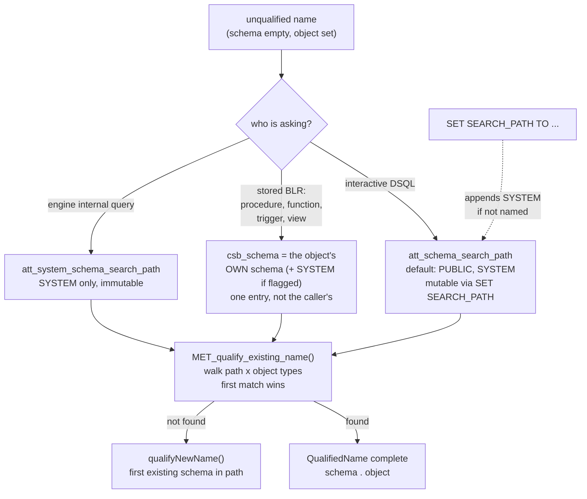

# Schemas and Name Resolution — the namespace Firebird 6 retrofitted into a forty-year-old catalog

*A companion to [Conceptual Architecture of Firebird](README.md). Grounded in the vendored [`extern/firebird`](extern/firebird) source (Firebird 6, `master`) and verified against a live Firebird 6 server.*

---

## Table of contents

* [Why schemas deserve their own document](#why-schemas-deserve-their-own-document)
* [What a name became](#what-a-name-became)
* [Two schemas that always exist](#two-schemas-that-always-exist)
* [The search path, and the entry you cannot remove](#the-search-path-and-the-entry-you-cannot-remove)
* [Two resolution regimes](#two-resolution-regimes)
* [Creating a name versus referencing one](#creating-a-name-versus-referencing-one)
* [What it cost the catalog](#what-it-cost-the-catalog)
* [Why BLR did not need a new version](#why-blr-did-not-need-a-new-version)
* [Live demonstrations](#live-demonstrations)
* [Shadowing, and the hazard search paths always carry](#shadowing-and-the-hazard-search-paths-always-carry)
* [Comparison: PostgreSQL, MySQL, SQLite](#comparison-postgresql-mysql-sqlite)
* [Further reading](#further-reading)

---

## Why schemas deserve their own document

Thirteen documents in this collection mention schemas. None explains them. The only heading anywhere is a three-bullet subsection in [the main paper](README.md#firebird-6-in-development-schemas-and-ods-14), and at least one companion already points elsewhere for an explanation that does not exist — [the BLR document](blr-intermediate-language.md) writes "in FB6 [schemas](sql-dialect-and-types.md)", and `sql-dialect-and-types.md` gives the subject one clause inside a feature list.

That is the same gap shape that motivated the [lock manager](lock-manager.md), [BLR](blr-intermediate-language.md) and [trace](trace-and-audit.md) documents, with an aggravating factor: schemas are the defining change of Firebird 6, the version this entire collection targets. Evidence of them is already scattered through the other documents without commentary. The [trace](trace-and-audit.md#what-a-captured-statement-actually-looks-like) document captures `"PUBLIC"."EMPLOYEE"` and `PLAN ("PLG$SRP"."PLG$SRP" INDEX ("PLG$SRP"."RDB$PRIMARY2"))` in live output; [replication](replication-architecture.md) documents a `schema_search_path` that lets a Firebird 5 primary feed a Firebird 6 replica. Readers meet the feature repeatedly before meeting its explanation.

It is also worth opening on its own merits, because retrofitting a namespace into a catalog that never had one is a genuinely hard problem, and the interesting engineering is not in what Firebird made configurable. It is in what it refused to.

A search path is late binding: it makes the meaning of a name depend on session state. Late binding is exactly what you want when a human is typing, and exactly what you do not want anywhere else — not in stored code, not in the engine's own queries, not in the catalog. Firebird's design can be read as a single rule applied three times: **the search path is consulted only where a human is typing; everywhere else it is replaced by something fixed.**

---

## What a name became

Before Firebird 6 an object name was a string. Now it is a triple, defined by [`BaseQualifiedName`](extern/firebird/src/common/classes/QualifiedMetaString.h#L43):

```cpp
template <typename T>
concept IsQualifiedName = requires(T t)
{
    { t.schema };
    { t.object };
    { t.package };
};
```

Schema, object, package — carried together through the parser, the compiler, the metadata cache and the catalog. `Jrd::QualifiedName` is this template bound to `MetaName`, and it is the type in nearly every `MET_*` signature in [`met_proto.h`](extern/firebird/src/jrd/met_proto.h): `MET_lookup_generator`, `MET_load_trigger`, `MET_delete_dependencies`, `MET_get_domain` and the rest all take a `QualifiedName` where Firebird 5 passed a bare name.

The consequence worth noticing is that **an unqualified name is not a name yet**. It is an unresolved reference, and something has to supply the missing schema before it can mean anything. The entire subsystem is the answer to *what supplies it*.

---

## Two schemas that always exist

Every Firebird 6 database contains two schemas, named by constants in [`constants.h`](extern/firebird/src/jrd/constants.h#L136):

```cpp
inline constexpr const char* SYSTEM_SCHEMA = "SYSTEM";
inline constexpr const char* PUBLIC_SCHEMA = "PUBLIC";
inline constexpr const char* PLG_LEGACY_SEC_SCHEMA = "PLG$LEGACY_SEC";
```

`SYSTEM` holds the `RDB$` and `MON$` objects; `PUBLIC` is where user objects go by default. The third constant is a reminder that the retrofit had to cover Firebird's own plugins: the legacy security database gets a schema of its own.

The schemas themselves are catalogued in `RDB$SCHEMAS`, which is **relation 56** in [`relations.h`](extern/firebird/src/jrd/relations.h#L814):

```cpp
// Relation 56 (RDB$SCHEMAS)
RELATION(nam_schemas, rel_schemas, ODS_14_0, rel_persistent)
    FIELD(f_sch_schema, nam_sch_name, fld_sch_name, 1, ODS_14_0)
    FIELD(f_sch_owner, nam_owner, fld_user, 1, ODS_14_0)
    FIELD(f_sch_charset, nam_charset_name, fld_charset_name, 1, ODS_14_0)
    ...
```

Relation 56 — appended at the end, not slotted in beside the other namespace-ish tables. That is the **append-only durability** theme [the reading guide](READING-GUIDE.md#ideas-that-recur-across-the-collection) draws out of `lck_t` series numbers, BLR opcodes and system relation ids, holding once more: relation ids are burned into compiled code and existing databases, so the catalog grows at the end even when tidier placement exists.

Note also that a schema carries an owner, a default character set, an SQL security mode and a security class. It is not a naming prefix; it is a grantable, ownable object, which is what makes it useful to the [security architecture](security-architecture.md) rather than merely to the parser.

---

## The search path, and the entry you cannot remove

An attachment carries **three** search paths, declared together in [`Attachment.h`](extern/firebird/src/jrd/Attachment.h#L597):

```cpp
RefPtr<AnyRef<ObjectsArray<MetaString>>> att_schema_search_path;
RefPtr<AnyRef<ObjectsArray<MetaString>>> att_blr_request_schema_search_path;
RefPtr<AnyRef<ObjectsArray<MetaString>>> att_system_schema_search_path;
```

The first is the one users think about. Absent a DPB override it is initialized in [`jrd.cpp`](extern/firebird/src/jrd/jrd.cpp#L1229) to exactly two entries:

```cpp
schemaSearchPath->push(PUBLIC_SCHEMA);
schemaSearchPath->push(SYSTEM_SCHEMA);
```

The second exists for legacy BLR requests arriving over the wire, and by default is [the same object](extern/firebird/src/jrd/jrd.cpp#L1239) as the first. The third is the interesting one, built once in the `Attachment` constructor in [`Attachment.cpp`](extern/firebird/src/jrd/Attachment.cpp#L244) and never changed:

```cpp
att_system_schema_search_path->push(SYSTEM_SCHEMA);
```

One entry, `SYSTEM`, immutable. This is the path the engine uses for its own internal queries — see [`PreparedStatement::init()`](extern/firebird/src/jrd/PreparedStatement.cpp#L427):

```cpp
auto newSchemaSearchPath = isInternalRequest ?
    attachment->att_system_schema_search_path :
    attachment->att_schema_search_path;
```

When the engine runs a query on its own behalf, the user's search path is swapped out for a SYSTEM-only one, restored on scope exit by an `AutoSetRestore`. **The engine cannot be confused by a user's search path**, because it never uses it. That is the first of the three refusals.

`SET SEARCH_PATH TO ...` is real grammar ([`parse.y`](extern/firebird/src/dsql/parse.y#L6353)) producing a `SetSearchPathNode`, and its `execute()` contains the second refusal, in [`StmtNodes.cpp`](extern/firebird/src/dsql/StmtNodes.cpp#L10970):

```cpp
if (!hasSystem)
    newSearchPath->add(SYSTEM_SCHEMA);
```

If you do not mention `SYSTEM`, it is appended. If you do mention it, your position is honored. So `SYSTEM` can be moved but never removed: **system objects are always reachable by unqualified name, whatever the session does.** A user cannot render the catalog invisible to themselves — including, usefully, cannot break the tooling that is about to run `SELECT ... FROM RDB$RELATIONS` in their session.

---

## Two resolution regimes

This is the heart of the design, and it is where a reader's intuition is most likely to be wrong.

**Interactive DSQL** resolves through the session search path. [`MET_qualify_existing_name()`](extern/firebird/src/jrd/met.epp#L5227) is the workhorse — 337 lines handling every object type — and its shape is a [loop over the path](extern/firebird/src/jrd/met.epp#L5238), first match wins:

```cpp
for (const auto& searchSchema : *schemaSearchPath)
{
    bool found = false;

    for (const auto objType : objTypes)
    {
        switch (objType)
        {
            case obj_charset:
            ...
```

Note that the object *type* participates: resolution asks "is there a relation named `CUSTOMERS` in `APP`?", not merely "is there anything called `CUSTOMERS`?". A schema early in the path holding a procedure of that name does not block a table of that name later.

**Stored code does not work this way at all.** When the engine compiles a routine's BLR it does not use the caller's search path, and it does not use a search path stored with the routine. It builds a synthetic one, in [`CompilerScratch::qualifyExistingName()`](extern/firebird/src/jrd/exe.h#L533):

```cpp
if (csb_schema.hasData())
{
    ObjectsArray<MetaString> schemaSearchPath;

    if (csb_g_flags & csb_search_system_schema)
        schemaSearchPath.push(SYSTEM_SCHEMA);

    schemaSearchPath.push(csb_schema);

    attachment->qualifyExistingName(tdbb, name, {objType}, &schemaSearchPath);
}
```

A path of **one entry** — `csb_schema` — optionally preceded by `SYSTEM`. And `csb_schema` is set from the routine's own name, in [`Routine.cpp`](extern/firebird/src/jrd/Routine.cpp#L182):

```cpp
csb->csb_schema = getName().schema;
```

So an unqualified name inside a stored procedure means *"in my own schema"*. Not "in the caller's search path", not "in the search path that was active when I was created". This is the third refusal, and the most consequential: it makes stored code immune to search-path manipulation entirely. [`PAR_blr()`](extern/firebird/src/jrd/par.cpp#L194) takes the schema as an explicit parameter for exactly this reason, so every re-parse of stored BLR is anchored the same way.

DSQL implements the identical rule for DDL compilation, in [`DsqlCompilerScratch::qualifyExistingName()`](extern/firebird/src/dsql/DsqlCompilerScratch.cpp#L78), where a `ddlSchema` becomes a one-entry path plus `SYSTEM`. That symmetry is why creating a routine and later re-parsing it agree — a point the live demonstrations below check directly, because a divergence there would be a serious bug.



*Figure 1: The three resolution regimes. Only the leftmost path is late-bound; the other two replace the search path with something the session cannot influence.*

---

## Creating a name versus referencing one

Resolution splits by direction, and the two halves are pleasingly asymmetric. [`Attachment::qualifyNewName()`](extern/firebird/src/jrd/Attachment.cpp#L937) handles `CREATE`:

```cpp
if (name.schema.isEmpty() && schemaSearchPath->hasData())
{
    for (const auto& searchSchema : *schemaSearchPath)
    {
        if (MET_check_schema_exists(tdbb, searchSchema))
        {
            name.schema = searchSchema;
            return true;
        }
    }
}
```

A new object goes into **the first schema on the path that exists** — no lookup of the object itself, because it does not exist yet. Referencing is the other case, and `Attachment::qualifyExistingName()` composes the two: try `MET_qualify_existing_name()`, and if nothing matched, fall back to `qualifyNewName()` so the name is at least qualified for whatever comes next.

There is a failure mode worth naming. If the search path contains no schema that exists, creation raises `isc_dyn_cannot_infer_schema` — a session can be configured into a state where it cannot create anything unqualified. This is the price of making the namespace a first-class mutable session setting rather than a static prefix.

---

## What it cost the catalog

The retrofit is not confined to one new table. Counting `fld_sch_name`-typed fields in [`relations.h`](extern/firebird/src/jrd/relations.h):

| | Count |
|---|---|
| Relations defined in `relations.h` | 60 |
| Relations that gained at least one schema field | **32** |
| Schema-typed fields in total | 45 |

Over half the catalog changed shape. Some relations gained more than one, because an object can reference another object's schema as well as living in its own: `RDB$SCHEMAS` itself carries both `f_sch_schema` and `f_sch_charset_schema`, since a schema's default character set is a qualified name too. `RDB$DEPENDENCIES` gained `RDB$DEPENDED_ON_SCHEMA_NAME`, which is how dependency tracking stays correct once two schemas can hold same-named objects — a point the live demonstrations exercise.

The `MON$` tables were not exempt: `MON$COMPILED_STATEMENTS` gained `f_mon_cmp_sch_name`, and the two new `MON$LOCAL_TEMPORARY_TABLE*` relations (57 and 58) carry schema columns from birth. This is why the [monitoring](monitoring-and-tuning.md) and [trace](trace-and-audit.md) output in this collection shows qualified names.

All of it is gated on `ODS_14_0` — the [ODS 14](extern/firebird/src/jrd/ods.h#L76) that Firebird 6 introduces, which is the mechanism by which an older database simply does not have these fields. Schemas are not a runtime option; they arrive with the on-disk structure, and [migration](migration-and-interoperability.md) is therefore a backup-and-restore, not a flag.

---

## Why BLR did not need a new version

[The BLR document](blr-intermediate-language.md) makes a headline claim: across Firebird 3 through 6 the language gained `BOOLEAN`, `INT128`, `DECFLOAT`, time zones, window frames, packages and schemas, and *none of it required a new BLR version* — `blr_version6` is still commented out. Schemas are the most surprising item on that list, because a namespace sounds like exactly the kind of change that would break a stored-code format.

It did not, and the two resolution regimes are why. Because unqualified names in stored BLR resolve against the object's own schema, **the BLR does not have to record the schema at all**. The disassembly below shows a procedure body compiled under a two-schema search path emitting a bare `blr_relation` — the same byte sequence Firebird 5 would have produced. The schema comes from the routine's catalog row at parse time, not from the byte stream.

What BLR did gain is small and additive, in [`blr.h`](extern/firebird/src/include/firebird/impl/blr.h#L530):

```c
#define blr_current_schema          (unsigned char) 233
#define blr_flags_search_system_schema  (unsigned char) 1
```

`blr_current_schema` (opcode 233) is the `CURRENT_SCHEMA` expression — a new leaf, appended, exactly as the append-only discipline predicts. [`blr_flags_search_system_schema`](extern/firebird/src/include/firebird/impl/blr.h#L534) is the flag bit that puts `SYSTEM` ahead of `csb_schema` in the synthetic path above. Schema-qualified variants of the invocation opcodes (`blr_invoke_function_id_schema` and siblings) exist for the cases that do need to name a schema explicitly. Additions at the end, no renumbering, no version bump.

---

## Live demonstrations

All of the following was captured against a running Firebird 6 server (`LI-T6.0.0.2076`, engine version 6.0.0), using a scratch database created for the purpose.

### The two schemas, and the default path

```
$ isql -u SYSDBA -p masterkey inet://localhost/employee
SQL> SELECT RDB$SCHEMA_NAME, RDB$OWNER_NAME, RDB$SYSTEM_FLAG FROM RDB$SCHEMAS;

RDB$SCHEMA_NAME   PUBLIC     RDB$OWNER_NAME  SYSDBA     RDB$SYSTEM_FLAG  0
RDB$SCHEMA_NAME   SYSTEM     RDB$OWNER_NAME  SYSDBA     RDB$SYSTEM_FLAG  1

SQL> SELECT RDB$GET_CONTEXT('SYSTEM','SEARCH_PATH') FROM RDB$DATABASE;

SEARCH_PATH   "PUBLIC", "SYSTEM"
```

Two schemas, and the search path is readable as a context variable — matching the `jrd.cpp` initialization exactly.

### Resolution follows the path, in order

Two tables of the same name in different schemas, distinguishable by content:

```sql
CREATE SCHEMA APP;
CREATE TABLE PUBLIC.CUSTOMERS (ID INT, ORIGIN VARCHAR(20));
CREATE TABLE APP.CUSTOMERS    (ID INT, ORIGIN VARCHAR(20));
INSERT INTO PUBLIC.CUSTOMERS VALUES (1, 'from PUBLIC');
INSERT INTO APP.CUSTOMERS    VALUES (2, 'from APP');
```

```
SQL> SELECT ORIGIN FROM CUSTOMERS;              -- default path
RESOLVED_DEFAULT     from PUBLIC

SQL> SET SEARCH_PATH TO APP, PUBLIC;
SQL> SELECT ORIGIN FROM CUSTOMERS;
RESOLVED_AFTER_SET   from APP
```

### `SYSTEM` cannot be removed, only moved

```
SQL> SET SEARCH_PATH TO APP;
SQL> SELECT RDB$GET_CONTEXT('SYSTEM','SEARCH_PATH') FROM RDB$DATABASE;
TRIED_APP_ONLY   "APP", "SYSTEM"

SQL> SET SEARCH_PATH TO SYSTEM, APP;
SQL> SELECT RDB$GET_CONTEXT('SYSTEM','SEARCH_PATH') FROM RDB$DATABASE;
SYSTEM_FIRST     "SYSTEM", "APP"
```

Asking for `APP` alone yields `"APP", "SYSTEM"` — the append in `SetSearchPathNode::execute()`, observable. Naming `SYSTEM` explicitly puts it exactly where you asked.

### Stored code ignores the caller's search path

This is the claim most worth checking, because getting it wrong in either direction would be a bug. A procedure is created while `APP` leads the path, so it lands in `APP` and binds `APP.CUSTOMERS`:

```
SQL> SET SEARCH_PATH TO APP, PUBLIC;
SQL> CREATE PROCEDURE WHICH_ONE RETURNS (SRC VARCHAR(20)) AS
   >   BEGIN SELECT ORIGIN FROM CUSTOMERS INTO :SRC; SUSPEND; END

SQL> SELECT SRC FROM WHICH_ONE;
CREATED_UNDER_APP_PATH   from APP
```

Now flip the session path and call it again:

```
SQL> SET SEARCH_PATH TO PUBLIC;
SQL> SELECT ORIGIN FROM CUSTOMERS;        -- direct query follows the new path
DIRECT_QUERY_NOW         from PUBLIC

SQL> SELECT SRC FROM APP.WHICH_ONE;       -- the procedure does not
PROC_AFTER_PATH_CHANGE   from APP
```

The unqualified `CUSTOMERS` inside the procedure body still means `APP.CUSTOMERS`, while the identical text typed at the prompt now means `PUBLIC.CUSTOMERS`. That is `csb_schema` doing its job.

The catalog agrees, and records the resolution rather than the text:

```
SQL> SELECT RDB$DEPENDED_ON_SCHEMA_NAME, RDB$DEPENDED_ON_NAME
   >   FROM RDB$DEPENDENCIES WHERE RDB$DEPENDENT_NAME = 'WHICH_ONE';

ON_SCHEMA   APP        ON_NAME   CUSTOMERS
```

### The rule is the object's own schema — not the creation-time path

A sharper test, because the two hypotheses ("frozen creation-time search path" vs "own schema") only diverge here. A procedure is placed explicitly in `PUBLIC` while `APP` still leads the session path:

```
SQL> SET SEARCH_PATH TO APP, PUBLIC;
SQL> CREATE PROCEDURE PUBLIC.WHICH_TWO RETURNS (SRC VARCHAR(20)) AS
   >   BEGIN SELECT ORIGIN FROM CUSTOMERS INTO :SRC; SUSPEND; END

SQL> SELECT RDB$DEPENDED_ON_SCHEMA_NAME FROM RDB$DEPENDENCIES
   >   WHERE RDB$DEPENDENT_NAME = 'WHICH_TWO';
DEPENDENCY_RECORDED   PUBLIC

SQL> SELECT SRC FROM PUBLIC.WHICH_TWO;
CALLED_NOW            from PUBLIC
```

`APP` led the search path at creation, yet the body bound `PUBLIC.CUSTOMERS` — the procedure's *own* schema. Creation-time DSQL and later BLR re-parse reach the same answer, which is the symmetry between `DsqlCompilerScratch::qualifyExistingName()` and `CompilerScratch::qualifyExistingName()` paying off. Had these disagreed, a routine would have quietly changed meaning the first time it was evicted from the metadata cache and re-parsed.

### The schema is absent from the BLR

Dumping the procedure's stored BLR with `SET BLOB ALL`:

```
SQL> SELECT RDB$PROCEDURE_BLR FROM RDB$PROCEDURES
   >   WHERE RDB$PROCEDURE_NAME = 'WHICH_ONE';

    blr_version5,
    blr_begin,
       ...
             blr_for,
                blr_singular,
                   blr_rse, 1,
                      blr_relation, 9, 'C','U','S','T','O','M','E','R','S', 0,
```

`blr_relation` with a bare nine-character name and no schema — byte-for-byte what Firebird 5 would emit. The binding to `APP.CUSTOMERS` demonstrated above is nowhere in this stream; it is reconstructed at parse time from the routine's own catalog row. This is the concrete reason the schema retrofit did not force `blr_version6`.

### Plans and errors

```
SQL> SET SEARCH_PATH TO APP, PUBLIC;
SQL> SELECT COUNT(*) FROM CUSTOMERS;
PLAN ("APP"."CUSTOMERS" NATURAL)
```

The [optimizer](query-optimizer-and-execution.md)'s plan output is schema-qualified, which is why plans throughout this collection read `"PUBLIC"."EMPLOYEE"`. Resolution failure, by contrast, reports the name as typed:

```
SQL> SELECT * FROM NO_SUCH_TABLE;
Statement failed, SQLSTATE = 42S02
-Table unknown
-"NO_SUCH_TABLE"
```

And schemas are dropped under `RESTRICT` semantics — there is no cascade:

```
SQL> DROP SCHEMA APP;
-DROP SCHEMA "APP" failed
-Cannot DROP schema "APP" because it has objects
```

---

## Shadowing, and the hazard search paths always carry

Every search path mechanism carries the same hazard: if an attacker can create objects in a schema that precedes the intended one, unqualified references can be captured. Firebird is not exempt, and the default configuration is worth understanding precisely.

The default path is `"PUBLIC", "SYSTEM"` — user schema **first**. A user with DDL rights on `PUBLIC` can therefore create an object whose name collides with a system table, and unqualified references in ordinary SQL will find theirs:

```
SQL> CREATE TABLE PUBLIC."RDB$DATABASE" (X INT);
SQL> INSERT INTO PUBLIC."RDB$DATABASE" VALUES (99);
SQL> COMMIT;
```

Then, on a **fresh connection that issues no `SET SEARCH_PATH` at all**:

```
SQL> SELECT RDB$GET_CONTEXT('SYSTEM','SEARCH_PATH') FROM RDB$DATABASE;
PATH                   "PUBLIC", "SYSTEM"

SQL> SELECT X FROM RDB$DATABASE;
SHADOWED_BY_DEFAULT    99
```

The user's table, not the catalog's. This is the same shape as PostgreSQL's [CVE-2018-1058](https://www.postgresql.org/support/security/CVE-2018-1058/), the search-path capture issue that led PostgreSQL to remove `public` from the default privileges in version 15 and to recommend `SET search_path` on every `SECURITY DEFINER` function.

Two things bound the blast radius here, and both are the refusals described above rather than accidents:

- **The engine is unaffected.** Internal queries run on `att_system_schema_search_path`, which is `SYSTEM` alone and immutable. The server does not start behaving strangely; only user-written unqualified SQL is redirected.
- **Stored code is unaffected.** A procedure, trigger or view resolves against its own schema, so existing application logic does not change meaning when someone plants a shadowing table.

What remains exposed is ad-hoc SQL and any tooling that queries the catalog by unqualified name. The mitigations are the familiar ones: qualify catalog references explicitly (`SYSTEM.RDB$RELATIONS`), put `SYSTEM` first in the search path for administrative sessions (`SET SEARCH_PATH TO SYSTEM, PUBLIC`, which the engine honors exactly), and do not grant `CREATE` on `PUBLIC` broadly. That Firebird permits `SYSTEM` to be moved to the front is precisely what makes the first two available.

---

## Comparison: PostgreSQL, MySQL, SQLite

| | **Firebird 6** | **PostgreSQL** | **MySQL** | **SQLite** |
|---|---|---|---|---|
| **Namespace object** | `SCHEMA`, owned, grantable, with default charset and SQL security | `SCHEMA`, owned, grantable | "Schema" is a synonym for *database* | `main` / `temp` / `ATTACH`ed files |
| **System objects** | `SYSTEM` schema | `pg_catalog` schema | `information_schema`, `mysql` | `sqlite_*` tables per database |
| **Search path** | `SET SEARCH_PATH`, session-scoped; `SYSTEM` auto-appended if omitted | `SET search_path`, session-scoped; `pg_catalog` implicitly first unless named | None — `USE db`, plus qualified names | None — `main` then `temp`, then attached in order |
| **Default path** | `PUBLIC, SYSTEM` | `"$user", public` | n/a | n/a |
| **Can system objects be hidden?** | No — `SYSTEM` cannot be removed | No — `pg_catalog` is implicit | n/a | n/a |
| **Stored code resolution** | The routine's **own schema** — caller's path never used | The path **at call time**, unless the function pins `SET search_path` | n/a | n/a |
| **Introduced** | Firebird 6 (ODS 14) | Long-standing | n/a | n/a |

The real peer is **PostgreSQL**, and the comparison is instructive because Firebird arrived at the same feature two decades later and chose differently on the one point that has caused PostgreSQL the most trouble.

PostgreSQL resolves unqualified names inside a `SECURITY DEFINER` function using the *caller's* `search_path` at call time. That is flexible, and it is the direct cause of CVE-2018-1058: a caller who controls their own search path can influence what a privileged function's unqualified references mean, which is why PostgreSQL's documentation now tells you to attach `SET search_path` to every such function. Firebird makes that choice unavailable — stored code binds to its own schema, full stop. The cost is a loss of flexibility that PostgreSQL users occasionally want (a function that deliberately operates on whichever schema the caller selected must qualify explicitly, or take the name as a parameter). The benefit is that the dangerous default is not reachable.

Firebird also keeps `SYSTEM` in the path implicitly, matching PostgreSQL's treatment of `pg_catalog`, but with the same escape hatch: name it explicitly and its position is yours.

**MySQL** does not have this concept at all; `SCHEMA` is a synonym for `DATABASE`, so there is exactly one level of namespace and cross-namespace references are simply qualified. **SQLite**'s `ATTACH` gives a small fixed namespace list searched in a defined order, which is a search path in miniature — and the fact that it, too, resolves unqualified names by walking a list shows that the mechanism is not really about size. It is about what happens when two objects can share a name.

Firebird's distinguishing choice, stated plainly: **it is the only one of the four where stored code cannot be made to resolve names through the caller's namespace.**

---

## Hands-on: samples, tests and debugging

### C++ sample — [`samples/cpp/schemas.cpp`](samples/cpp/schemas.cpp)

Replays the [live demonstrations](#live-demonstrations) as one idempotent program: it lists `RDB$SCHEMAS`, reads the default path from the context variable, creates the two same-named `CUSTOMERS` tables, and then watches a single unqualified `SELECT` change meaning as `SET SEARCH_PATH` changes — including the [`SYSTEM` auto-append](#the-search-path-and-the-entry-you-cannot-remove) and the [stored-code refusal](#two-resolution-regimes): a procedure created while `APP` leads the path keeps binding `APP.CUSTOMERS` after the session flips to `PUBLIC`, with `RDB$DEPENDENCIES` recording the resolution.

```sh
cmake -B build samples && cmake --build build
./build/schemas          # default: inet://localhost//tmp/fbhandson/schemas.fdb
```

Verified output:

```text
schemas in RDB$SCHEMAS      : APP  PUBLIC  SYSTEM
default search path         : "PUBLIC", "SYSTEM"

SELECT ORIGIN FROM CUSTOMERS, as the path changes:
  path PUBLIC,SYSTEM        -> from PUBLIC
  path APP,PUBLIC           -> from APP

SET SEARCH_PATH TO APP      -> "APP", "SYSTEM"   (SYSTEM auto-appended)

procedure created with path APP,PUBLIC (lands in APP, binds APP.CUSTOMERS)
  after SET SEARCH_PATH TO PUBLIC:
    direct SELECT ... FROM CUSTOMERS -> from PUBLIC
    SELECT SRC FROM APP.WHICH_ONE    -> from APP   <- unmoved
    RDB$DEPENDENCIES records         -> APP.CUSTOMERS

plan for unqualified SELECT :
PLAN ("PUBLIC"."CUSTOMERS" NATURAL)
```

The final `getPlan()` line is the [plans-and-errors observation](#plans-and-errors) from client code: the optimizer reports the *resolved* qualified name, so the plan itself documents which schema won.

### fb-cpp sample — [`samples/fb-cpp/schemas.cpp`](samples/fb-cpp/schemas.cpp)

The same five demonstrations through [fb-cpp](https://github.com/asfernandes/fb-cpp) (vendored at [`extern/fb-cpp`](extern/fb-cpp)), the modern C++20 wrapper over the OO API. Nothing schema-specific needs the API — the search path is session state the engine keeps — so the twin is a near-straight port whose diffs are all plumbing: every one-row probe is a `Statement` whose answer comes back as `std::optional<std::string>`, the idempotent cleanup catches typed `DatabaseException`s instead of checking status vectors, and the plan arrives via `StatementOptions().setPrefetchLegacyPlan(true)` + `getLegacyPlan()` where the OO-API version calls `IStatement::getPlan()`. Same resolution rules, same engine state, observed through a typed surface.

```sh
cmake -B build samples && cmake --build build   # needs libboost-dev + libboost-filesystem-dev
./build/fbcpp_schemas
```

Verified: identical resolution story — `from PUBLIC` then `from APP` as the path changes, `"APP", "SYSTEM"` after the auto-append, `APP.WHICH_ONE` still answering `from APP` (with `RDB$DEPENDENCIES` recording `APP.CUSTOMERS`) after the session flips to `PUBLIC`, and the plan reporting the resolved name `PLAN ("PUBLIC"."CUSTOMERS" NATURAL)`.

### JavaScript sample — [`samples/nodejs/schemas.js`](samples/nodejs/schemas.js)

The twin (`cd samples/nodejs && node schemas.js`) needs no special driver support — resolution is entirely server-side — but it demonstrates one architectural point the C++ sample cannot: node-firebird wraps every `query()` in its own short transaction, and `SET SEARCH_PATH` *still* carries over to the next call, proving the search path is **attachment** state, not transaction state (`att_schema_search_path` lives on the [`Attachment`](extern/firebird/src/jrd/Attachment.h#L597), as described above). Verified:

```text
search path (default)  : "PUBLIC", "SYSTEM"
unqualified CUSTOMERS  : from PUBLIC
after SET ... APP,PUBLIC: from APP
SET ... TO APP shows   : "APP", "SYSTEM"  (SYSTEM auto-appended)

path now PUBLIC; direct: from PUBLIC
APP.WHICH_ONE returns  : from APP  <- still its own schema
dependency recorded    : APP.CUSTOMERS
```

### Rust sample — [`samples/rust/src/bin/schemas.rs`](samples/rust/src/bin/schemas.rs)

The same five demonstrations through [rsfbclient](https://github.com/fernandobatels/rsfbclient), Rust's Firebird client (`cd samples/rust && cargo run --bin schemas`), with two driver-shaped twists worth the run on their own. First, rsfbclient keeps a client-side cache of prepared statements per connection, and names bind at *prepare* time — so after `SET SEARCH_PATH TO APP, PUBLIC`, re-running the byte-identical `SELECT ORIGIN FROM CUSTOMERS` still answers with the old resolution, because the cached statement bound `PUBLIC.CUSTOMERS` when it was prepared; appending a comment (`/* fresh */`) changes the cache key, forces a fresh prepare, and the same query flips to `APP`. The resolution-happens-at-prepare rule, demonstrated by a driver optimization. Second, rsfbclient has no `getPlan()` surface at all, so the plans-and-errors observation goes through Firebird 6's `RDB$SQL.EXPLAIN` table function instead — plain SQL replacing the missing API.

Verified: `from PUBLIC` for the cached text under the new path, `from APP` for the freshly-prepared text; `"APP", "SYSTEM"` after the auto-append; `APP.WHICH_ONE` still answering `from APP` with `RDB$DEPENDENCIES` recording `APP.CUSTOMERS` after the session flips to `PUBLIC`; and the explain output resolving the unqualified name to `Table "PUBLIC"."CUSTOMERS" Full Scan` — the schema-qualified access path, from SQL rather than from `getPlan()`.

### Free Pascal sample — [`samples/fpc/schemas.pas`](samples/fpc/schemas.pas)

The same five demonstrations through [fbintf](https://github.com/MWASoftware/fbintf) (vendored at [`extern/fbintf`](extern/fbintf)), MWA Software's Firebird Pascal API — the layer under IBX — driving the same libfbclient as the C++ samples behind COM-style reference-counted interfaces (`make -C samples/fpc bin/schemas && samples/fpc/bin/schemas`). Resolution being server-side, the sample is `ExecuteSQL` for each `SET SEARCH_PATH` and `OpenCursorAtStart` one-row probes for each answer — but the plans-and-errors observation is where the wrapper families diverge: rsfbclient has no plan surface at all (its twin fell back to `RDB$SQL.EXPLAIN`), while fbintf exposes the plan directly as `IStatement.GetPlan`, no info-buffer decoding. One quirk to know: fbintf's `GetPlan` returns only the *detailed* (explained) plan form — the legacy one-line `PLAN (...)` the OO-API and fb-cpp twins print is not offered — so the same resolved name arrives as an indented operation tree.

Verified: identical resolution story — `from PUBLIC` then `from APP` as the path changes, `"APP", "SYSTEM"` after the auto-append, `APP.WHICH_ONE` still answering `from APP` (with `RDB$DEPENDENCIES` recording `APP.CUSTOMERS`) after the session flips to `PUBLIC` — and `GetPlan` reporting the resolved name in its explained form, `Select Expression -> Aggregate -> Table "PUBLIC"."CUSTOMERS" Full Scan`.

### Things to try

- Add the [shadowing experiment](#shadowing-and-the-hazard-search-paths-always-carry): `CREATE TABLE PUBLIC."RDB$DATABASE" (X INT)` and watch an unqualified `SELECT ... FROM RDB$DATABASE` on a fresh connection find yours; then `SET SEARCH_PATH TO SYSTEM, PUBLIC` to defuse it.
- Set the path to a schema that does not exist (`SET SEARCH_PATH TO GHOST`) and try an unqualified `CREATE TABLE` — the `isc_dyn_cannot_infer_schema` failure mode [named above](#creating-a-name-versus-referencing-one).
- In either sample, create `APP.WHICH_TWO` explicitly in `PUBLIC` while `APP` leads the path (the document's [sharper test](#the-rule-is-the-objects-own-schema--not-the-creation-time-path)) and check `RDB$DEPENDENCIES`.
- Attach with `isc_dpb_search_path` in the DPB (add `dpb->insertString(&status, isc_dpb_search_path, "APP")` to the C++ sample) and confirm the session starts with your path instead of the default.

### Debugging this in C++ (gdb)

With a [debug build of the engine](debugging-firebird.md), the three resolution regimes of Figure 1 are four breakpoints:

```gdb
break MET_qualify_existing_name     # src/jrd/met.epp:5227 — the walk over the path, per object type
break Attachment::qualifyNewName    # src/jrd/Attachment.cpp:937 — CREATE choosing its schema
break Attachment::qualifyExistingName   # Attachment.cpp:957 — reference resolution entry point
break SetSearchPathNode::execute    # src/dsql/StmtNodes.cpp:10953 — SET SEARCH_PATH (SYSTEM append)
```

Run the sample's unqualified `SELECT` and `MET_qualify_existing_name` fires with `name.schema` empty and the session's `schemaSearchPath` as the loop bound — step the outer `for` to watch `PUBLIC` tried before `SYSTEM`, first match filling in `name.schema`. Call `APP.WHICH_ONE` and the same breakpoint fires *from the BLR parse path* with a **one-entry** synthetic path (`CompilerScratch::qualifyExistingName`, `src/jrd/exe.h:533`) — the caller's path is nowhere in the backtrace, which is this document's central claim made visible in a debugger. In `SetSearchPathNode::execute`, watch the `hasSystem` check append `SYSTEM` to the new path before it is stored on the attachment. See the [debugging guide](debugging-firebird.md) for the embedded-attach recipe.

---

## Further reading

- [`doc/sql.extensions/README.schemas.md`](https://github.com/FirebirdSQL/firebird/blob/master/doc/sql.extensions/README.schemas.md) — the feature documentation: syntax, search path, and the rules for each object type.
- [`src/common/classes/QualifiedMetaString.h`](https://github.com/FirebirdSQL/firebird/blob/master/src/common/classes/QualifiedMetaString.h) — `BaseQualifiedName`, the schema/object/package triple and its parsing helpers.
- [`src/jrd/met.epp`](https://github.com/FirebirdSQL/firebird/blob/master/src/jrd/met.epp) — `MET_qualify_existing_name()` and `MET_check_schema_exists()`.
- [`src/jrd/Attachment.cpp`](https://github.com/FirebirdSQL/firebird/blob/master/src/jrd/Attachment.cpp) — `qualifyNewName()` / `qualifyExistingName()` and the three search paths.
- [`src/jrd/exe.h`](https://github.com/FirebirdSQL/firebird/blob/master/src/jrd/exe.h) — `CompilerScratch::qualifyExistingName()`, where stored code gets its one-entry path.
- [`src/dsql/StmtNodes.cpp`](https://github.com/FirebirdSQL/firebird/blob/master/src/dsql/StmtNodes.cpp) — `SetSearchPathNode::execute()` and the `SYSTEM` append.
- [`src/jrd/relations.h`](https://github.com/FirebirdSQL/firebird/blob/master/src/jrd/relations.h) — `RDB$SCHEMAS` (relation 56) and the 45 schema-typed fields across the catalog.
- [PostgreSQL: schemas and the search path](https://www.postgresql.org/docs/current/ddl-schemas.html) · [CVE-2018-1058](https://www.postgresql.org/support/security/CVE-2018-1058/)
- [MySQL: `CREATE DATABASE` / schema synonym](https://dev.mysql.com/doc/refman/8.4/en/create-database.html)
- [SQLite: `ATTACH DATABASE` and name resolution](https://www.sqlite.org/lang_attach.html)

---

*Companion documents: [BLR, the Binary Language Representation](blr-intermediate-language.md) · [How the Engine Bootstraps Its Own Catalog](catalog-bootstrap.md) · [SQL Dialect and Data Types](sql-dialect-and-types.md) · [Security Architecture](security-architecture.md) · [Migration and Interoperability](migration-and-interoperability.md) · [Reading Guide](READING-GUIDE.md)*
