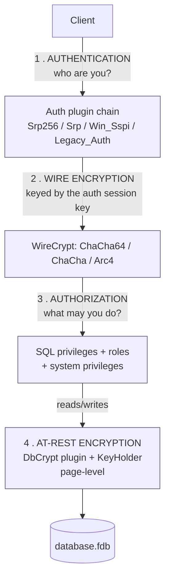
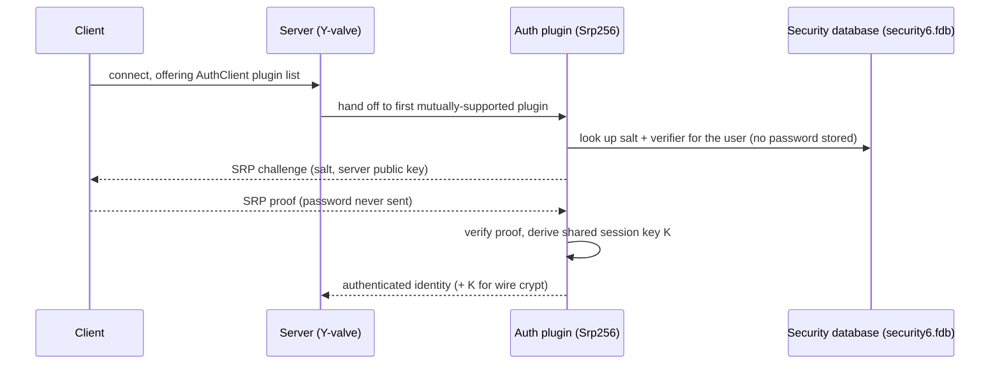
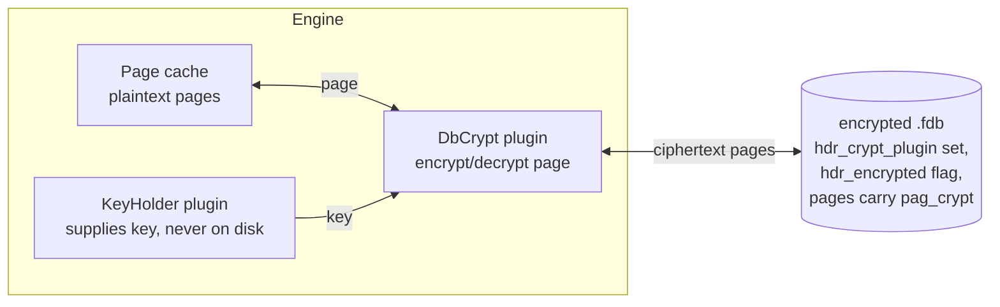

# Security Architecture: Authentication, Encryption and Authorization

Database security has four largely independent layers: **who you are** (authentication), **what you may do** (authorization), **can anyone read the wire** (transport encryption), and **can anyone read the file** (at-rest encryption). This document describes how Firebird 6 implements all four — grounded in the vendored source (`src/auth/`, `src/plugins/crypt/`, `src/jrd/SystemPrivileges.h`, `examples/dbcrypt/`) and verified against a live server — and compares each layer with PostgreSQL, MySQL and SQLite.

It is a companion to the [main paper](README.md) and the other comparison documents. The authentication and wire-encryption material overlaps with the [wire-protocol document](firebird-wire-protocol.md), which covers the SRP handshake and the `op_crypt` cipher negotiation byte-by-byte; this document takes the architectural view across all four security layers and all four database systems, and adds at-rest encryption and authorization, which the wire document does not cover.

**Table of Contents**

* [The four layers](#the-four-layers)
* [Firebird authentication](#firebird-authentication)
* [Firebird wire encryption](#firebird-wire-encryption)
* [Firebird at-rest (database) encryption](#firebird-at-rest-database-encryption)
* [Firebird authorization](#firebird-authorization)
* [Setup (validated walk-through)](#setup-validated-walk-through)
* [Comparison: PostgreSQL, MySQL, SQLite](#comparison-postgresql-mysql-sqlite)
* [Discussion](#discussion)
* [Further research](#further-research)

## The four layers



_Figure 1: Firebird's four security layers — each is a distinct, pluggable mechanism_

A distinctive Firebird trait, visible in Figure 1 and developed below, is that layers 1 and 2 are **coupled**: authentication (SRP) produces a shared secret that *becomes* the wire-encryption key, so encryption is native to the database protocol rather than delegated to TLS. Layers 3 and 4 are fully independent and pluggable.

## Firebird authentication

Authentication is **plugin-based** and negotiated between client and server. The relevant configuration (defaults from `src/common/config/config.h`):

- `AuthServer = Srp256` — what the server accepts.
- `AuthClient = Srp256, Srp, Win_Sspi, Legacy_Auth` — what the client will try, in order.
- `UserManager = Srp` — which plugin's store `CREATE USER` writes to.

The shipped plugins (`src/auth/`):

- **Srp / Srp256 / Srp512** — [Secure Remote Password](https://www.rfc-editor.org/rfc/rfc2945) (SRP-6a), a **password-authenticated key exchange**: the password never crosses the wire, the server stores only a salted verifier, and both sides derive a shared session key. `Srp256` (SHA-256 client proof) is the default since Firebird 3.0.4. The full handshake and the differences from the SRP RFCs are documented in the [wire-protocol document](firebird-wire-protocol.md#srp-authentication-in-depth).
- **Legacy_Auth** — the pre-3.0 DES-based hashed password. Weak, off by default on the server, kept only for old clients.
- **Win_Sspi** — Windows trusted authentication via SSPI (NTLM/Kerberos): the OS identity is used, no password prompt (see [`doc/README.trusted_authentication`](https://github.com/FirebirdSQL/firebird/blob/master/doc/README.trusted_authentication)).



_Figure 2: Firebird authentication flow — a plugin verifies the user against the security database and yields the wire-encryption key_

**The security database.** User credentials live in a separate database (`security6.fdb` in Firebird 6), managed by the `Srp` user manager. Since Firebird 3 it ships **with no predefined users** — there is no built-in SYSDBA with a known password ([`doc/README.security_database.txt`](https://github.com/FirebirdSQL/firebird/blob/master/doc/README.security_database.txt)); the installer or an embedded `CREATE USER` establishes the first administrator. A database can even use its own per-database security database.

**Identity mapping.** `CREATE [GLOBAL] MAPPING` maps external identities (a Windows/Kerberos principal from `Win_Sspi`, a user from another database, a group) onto Firebird users and roles — the federation mechanism that lets OS or domain identities become database identities.

**Embedded mode has no authentication** at all (client and engine share an address space, so any check is theatre) — but *authorization is still enforced*, a subtlety covered in the [embedded comparison](embedded-architecture-comparison.md#firebird-embedded-a-full-engine-in-your-process).

## Firebird wire encryption

Once authenticated, the client and server can encrypt the connection using the SRP **session key** as the symmetric key — no certificates, no TLS stack. Configuration: `WireCrypt` (default `Enabled`) and `WireCryptPlugin = ChaCha64, ChaCha, Arc4`. The plugins (`src/plugins/crypt/`):

- **ChaCha64 / ChaCha** — the modern stream cipher (preferred); stretches the session key with SHA-256.
- **Arc4** — RC4, using the 20-byte session key directly (legacy).

The mechanics — the `op_crypt` packet, why encryption begins right after authentication, and why the cipher's strength rests on the SRP exchange — are in the [wire-protocol document](firebird-wire-protocol.md#wire-encryption-from-the-session-key-to-the-cipher). Verified live on this server: a client that authenticated with `Srp256` was running `ChaCha64` wire encryption (`MON$ATTACHMENTS.MON$AUTH_METHOD = 'Srp256'`, `MON$WIRE_CRYPT_PLUGIN = 'ChaCha64'`). `WireCrypt = Required` refuses any unencrypted connection.

## Firebird at-rest (database) encryption

Firebird encrypts the database **at the page level** through two cooperating plugins (`examples/dbcrypt/` is the reference implementation):

- A **DbCrypt** plugin (`IDbCryptPlugin`) that encrypts/decrypts each page as it moves between cache and disk.
- A **KeyHolder** plugin (`IKeyHolderPlugin`) that supplies the key. The key is deliberately **never stored in the database** — the key holder fetches it from a file, a callback, a hardware module, or the client at attach time.



_Figure 3: Firebird at-rest encryption — pages are encrypted between cache and disk; the key comes from a separate KeyHolder plugin and is never written to the file_

Encryption is turned on with DDL and proceeds page by page in the background:

```sql
ALTER DATABASE ENCRYPT WITH DbCrypt KEY "myKey";   -- start encrypting
ALTER DATABASE DECRYPT;                             -- reverse it
```

The header page records the plugin name (`hdr_crypt_plugin`), the `hdr_encrypted` flag and an in-progress marker (`hdr_crypt_process`); each data-bearing page is flagged `pag_crypt` (see the [on-disk structure document](on-disk-structure.md#the-page-types)). Because the key lives outside the file, a stolen `.fdb` is useless without the key holder — and reading the crypt configuration itself requires the `GET_DBCRYPT_INFO` system privilege.

## Firebird authorization

Authorization is standard SQL plus two Firebird refinements:

- **Object privileges** — `GRANT SELECT/INSERT/UPDATE/DELETE/REFERENCES/EXECUTE ... TO ...` on tables, views, procedures, etc., with `WITH GRANT OPTION`.
- **Roles** — `CREATE ROLE`, `GRANT role TO user`; a user activates a role at connect time. The built-in `RDB$ADMIN` role confers administrative rights.
- **System privileges** (Firebird 4+) — fine-grained capabilities that used to be all-or-nothing under SYSDBA, now grantable to roles individually. The full set (`src/jrd/SystemPrivileges.h`): `USER_MANAGEMENT`, `READ_RAW_PAGES`, `CREATE_USER_TYPES`, `USE_NBACKUP_UTILITY`, `CHANGE_SHUTDOWN_MODE`, `TRACE_ANY_ATTACHMENT`, `MONITOR_ANY_ATTACHMENT`, `ACCESS_SHUTDOWN_DATABASE`, `CREATE_DATABASE`, `DROP_DATABASE`, `USE_GBAK_UTILITY`, `USE_GSTAT_UTILITY`, `USE_GFIX_UTILITY`, `IGNORE_DB_TRIGGERS`, `CHANGE_HEADER_SETTINGS`, `SELECT_ANY_OBJECT_IN_DATABASE`, `ACCESS_ANY_OBJECT_IN_DATABASE`, `MODIFY_ANY_OBJECT_IN_DATABASE`, `CHANGE_MAPPING_RULES`, `USE_GRANTED_BY_CLAUSE`, `GRANT_REVOKE_ON_ANY_OBJECT`, `GRANT_REVOKE_ANY_DDL_RIGHT`, `CREATE_PRIVILEGED_ROLES`, `GET_DBCRYPT_INFO`, `MODIFY_EXT_CONN_POOL`, `REPLICATE_INTO_DATABASE`, `PROFILE_ANY_ATTACHMENT`.

The `SELECT_ANY_OBJECT_IN_DATABASE`-style privileges and grantable roles let you build a least-privilege operator (e.g. a monitoring account that can read `MON$` and run `gstat` but touch no data) without handing out full SYSDBA — a meaningful hardening step.

## Setup (validated walk-through)

The steps below were run against a live Firebird 6 server; the observations are real.

**1. Create the first administrator** (embedded, no auth required, but must be SYSDBA to write the security database):

```sh
isql -user SYSDBA employee
SQL> CREATE USER SYSDBA PASSWORD 'a-strong-password';   -- first-time init
```

**2. Create users** (the server-side `UserManager` is `Srp`):

```sql
CREATE USER app_user PASSWORD 'secret' USING PLUGIN Srp;
```

Verified: `SEC$USERS` then reports `SEC$PLUGIN = Srp` for the new user.

**3. Roles, object and system privileges:**

```sql
CREATE ROLE gstat_role SET SYSTEM PRIVILEGES TO USE_GSTAT_UTILITY;  -- FB4+
GRANT gstat_role TO app_user;
GRANT SELECT ON some_table TO app_user;
```

Verified: `RDB$ROLES.RDB$SYSTEM_PRIVILEGES` for `gstat_role` was the bitmask `0010000000000000` — the single `USE_GSTAT_UTILITY` bit, confirming the privilege was recorded (this is exactly the privilege whose absence blocked `gstat -a` in the [on-disk-structure walk-through](on-disk-structure.md#inspecting-the-structure-validated-with-gstat)).

**4. Require wire encryption** in `firebird.conf`:

```
AuthServer = Srp256
WireCrypt = Required
WireCryptPlugin = ChaCha64, ChaCha
```

Verified on a live attachment: `MON$ATTACHMENTS` reported `MON$AUTH_METHOD = Srp256`, `MON$WIRE_CRYPT_PLUGIN = ChaCha64`.

**5. Map an external identity** (e.g. a Windows domain group to a role):

```sql
CREATE MAPPING win_admins USING PLUGIN Win_Sspi FROM GROUP "DOMAIN\DBAs" TO ROLE rdb$admin;
```

**6. Enable at-rest encryption** (requires a DbCrypt + KeyHolder plugin installed and configured; `examples/dbcrypt/` is the template):

```sql
ALTER DATABASE ENCRYPT WITH DbCrypt KEY "myKey";
```

## Comparison: PostgreSQL, MySQL, SQLite

```mermaid
flowchart TB
    subgraph FB[Firebird]
        FBa["auth: SRP plugins (PAKE)"] --> FBw["wire: native, keyed by SRP"] --> FBr["at-rest: DbCrypt plugin (page-level)"]
    end
    subgraph PG[PostgreSQL]
        PGa["auth: pg_hba.conf methods<br/>(scram-sha-256, cert, gss, ldap, peer)"] --> PGw["wire: TLS"] --> PGr["at-rest: none native<br/>(pgcrypto / filesystem / forks)"]
    end
    subgraph MY[MySQL]
        MYa["auth: plugins<br/>(caching_sha2_password, PAM, LDAP)"] --> MYw["wire: TLS"] --> MYr["at-rest: InnoDB TDE + keyring"]
    end
    subgraph SL[SQLite]
        SLa["auth: none (filesystem)"] --> SLw["wire: none (in-process)"] --> SLr["at-rest: none native<br/>(SEE / SQLCipher)"]
    end
```



_Figure 4: Where each system places its security mechanisms — note only Firebird keys wire encryption from authentication, and only Firebird and MySQL ship native at-rest encryption_

| Layer | **Firebird** | **PostgreSQL** | **MySQL** | **SQLite** |
|---|---|---|---|---|
| Auth mechanism | **SRP-6a** (PAKE), pluggable | [SCRAM-SHA-256](https://www.postgresql.org/docs/current/auth-methods.html), cert, GSS, LDAP, peer — via `pg_hba.conf` | [caching_sha2_password](https://dev.mysql.com/doc/refman/8.4/en/pluggable-authentication.html) (default), PAM, LDAP — pluggable | **None** (filesystem permissions) |
| Password on wire | Never (PAKE) | Never (SCRAM) | Never on fast path; else needs TLS/RSA | N/A |
| Auth yields session key? | **Yes** (used for wire crypt) | No | No | N/A |
| Credential store | `security6.fdb` (no default users) | `pg_authid` in the catalog | `mysql.user` table | N/A |
| External identity mapping | `CREATE MAPPING` (SSPI/Kerberos/cross-db) | `pg_ident.conf`, GSS/LDAP | PAM/LDAP plugins, proxy users | N/A |
| Wire encryption | **Protocol-native**, keyed by SRP (ChaCha/Arc4) | [TLS](https://www.postgresql.org/docs/current/ssl-tcp.html) | [TLS](https://dev.mysql.com/doc/refman/8.4/en/encrypted-connections.html) | N/A (in-process) |
| At-rest encryption | **Page-level** DbCrypt + KeyHolder plugins | [None native](https://www.postgresql.org/docs/current/encryption-options.html) (pgcrypto column-level; TDE in forks) | [InnoDB TDE](https://dev.mysql.com/doc/refman/8.4/en/innodb-data-encryption.html) + keyring | None native ([SEE](https://sqlite.org/see/doc/trunk/www/readme.wiki) / [SQLCipher](https://www.zetetic.net/sqlcipher/)) |
| Key management | External KeyHolder plugin (key never in DB) | External (pgcrypto keys app-managed) | Keyring plugins (file/KMS/HSM) | Passphrase / app-managed |
| Authorization | GRANT + roles + **fine-grained system privileges** | GRANT + roles + [row-level security](https://www.postgresql.org/docs/current/ddl-priv.html) | GRANT + [roles (8.0)](https://dev.mysql.com/doc/refman/8.4/en/access-control.html) | **None** |
| Superuser model | SYSDBA / owner / `RDB$ADMIN`; not required to exist | `postgres` superuser; `NOLOGIN` roles | `root` + `SUPER`/dynamic privileges | N/A |

## Discussion

**Firebird couples authentication and encryption; everyone else keeps them separate.** Because SRP is a PAKE, logging in *produces* a shared secret, and Firebird builds its wire cipher directly on it — so an authenticated connection is an encrypted connection with no certificate infrastructure. PostgreSQL and MySQL keep the two orthogonal: SCRAM / caching_sha2_password prove identity, and TLS (a separate, certificate-based stack) provides confidentiality. Each approach has a clear trade-off. Firebird gets encryption "for free" the instant you authenticate, with no CA to run — but its cipher strength is bounded by the SRP exchange (the fixed 1024-bit group, historically the SHA-1 proof that motivated `Srp256`), and it maintains its own crypto plugins instead of inheriting a hardened TLS library. PostgreSQL and MySQL pay TLS's operational cost but gain its maturity, its independence from the auth method, and features like channel binding and certificate-based client auth.

**At-rest encryption sorts the four cleanly.** Firebird and MySQL ship **native, transparent** encryption (Firebird page-level via DbCrypt/KeyHolder; MySQL InnoDB tablespace TDE via keyring) where the key lives outside the data and a stolen file is inert. PostgreSQL has historically left full-database TDE to filesystem encryption or commercial forks, offering only column-level `pgcrypto` in core. SQLite has nothing native — encryption is the domain of the commercial SEE extension or third-party SQLCipher. In all cases the hard part is the same: key management, which every serious implementation pushes to an external holder (Firebird's KeyHolder plugin, MySQL's keyring, an HSM/KMS).

**Authorization has converged, with Firebird's system privileges a notable refinement.** All three server databases have SQL `GRANT`/roles; PostgreSQL adds row-level security, MySQL added roles in 8.0, and Firebird 4 broke the monolithic SYSDBA into individually grantable **system privileges** — letting you build least-privilege operator roles (backup-only, monitor-only) without handing over the keys to the kingdom. SQLite, true to its serverless design, has no authorization layer at all: access control is the file system's job (see the [embedded comparison](embedded-architecture-comparison.md)).

## Further research

**Firebird**

- [`doc/README.security_database.txt`](https://github.com/FirebirdSQL/firebird/blob/master/doc/README.security_database.txt) — the security database and first-user bootstrap.
- [`doc/README.trusted_authentication`](https://github.com/FirebirdSQL/firebird/blob/master/doc/README.trusted_authentication) — Windows SSPI trusted auth and mapping.
- [`examples/dbcrypt/`](https://github.com/FirebirdSQL/firebird/tree/master/examples/dbcrypt) — reference DbCrypt + KeyHolder plugins.
- [`src/jrd/SystemPrivileges.h`](https://github.com/FirebirdSQL/firebird/blob/master/src/jrd/SystemPrivileges.h) — the full system-privilege list; [`src/auth/`](https://github.com/FirebirdSQL/firebird/tree/master/src/auth) — the auth plugins.
- The [wire-protocol document](firebird-wire-protocol.md) for the SRP handshake and `op_crypt` details, and [SRP RFC 2945](https://www.rfc-editor.org/rfc/rfc2945).

**PostgreSQL**

- [Authentication methods](https://www.postgresql.org/docs/current/auth-methods.html), [Client authentication](https://www.postgresql.org/docs/current/client-authentication.html), [Securing TCP/IP with TLS](https://www.postgresql.org/docs/current/ssl-tcp.html), [Encryption options](https://www.postgresql.org/docs/current/encryption-options.html), [Privileges](https://www.postgresql.org/docs/current/ddl-priv.html).

**MySQL**

- [Pluggable authentication](https://dev.mysql.com/doc/refman/8.4/en/pluggable-authentication.html), [Encrypted connections](https://dev.mysql.com/doc/refman/8.4/en/encrypted-connections.html), [InnoDB data-at-rest encryption](https://dev.mysql.com/doc/refman/8.4/en/innodb-data-encryption.html), [Access control](https://dev.mysql.com/doc/refman/8.4/en/access-control.html); MariaDB's [authentication plugins](https://mariadb.com/kb/en/authentication-plugins/).

**SQLite**

- [Security](https://sqlite.org/security.html), the [SQLite Encryption Extension (SEE)](https://sqlite.org/see/doc/trunk/www/readme.wiki), and third-party [SQLCipher](https://www.zetetic.net/sqlcipher/).

**Standards**

- [RFC 2945 (SRP)](https://www.rfc-editor.org/rfc/rfc2945), [RFC 8446 (TLS 1.3)](https://www.rfc-editor.org/rfc/rfc8446), [FIPS 197 (AES)](https://csrc.nist.gov/pubs/fips/197/final).
