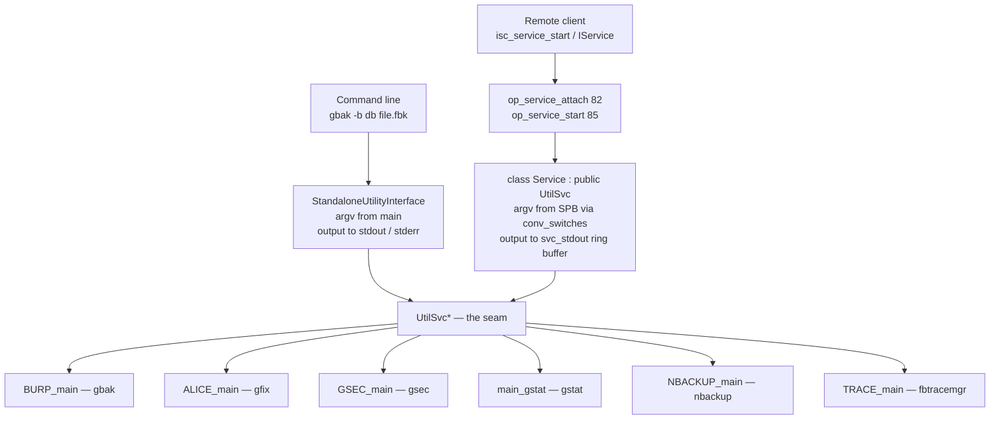
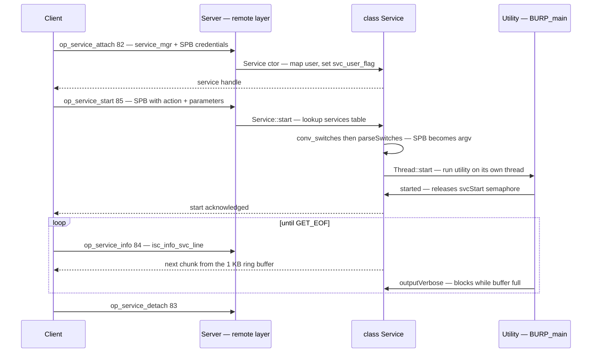

# The Services API: One Utility, Two Front Doors

Every Firebird administrative task — backup, restore, repair, statistics, user management, tracing, validation, reading the server log — can be driven two ways: by running a command-line utility, or by calling the **Services API** over the network. The [backup document](backup-and-recovery.md) uses `gbak` and `nbackup`; the [monitoring document](monitoring-and-tuning.md) uses the trace API; the [GC document](garbage-collection-and-sweep.md) reaches for `fbsvcmgr action_db_stats` when a direct `gstat` attach collides with the running server. Each treats these as separate tools that happen to overlap.

They are not separate. **`gbak -b` and `fbsvcmgr action_backup` execute the identical function in the identical binary.** The Services API is not a reimplementation of the utilities for remote use; it is a second *front door* onto the same code, and the seam that makes this work — an abstract class called `UtilSvc` — is one of the tidiest pieces of design in the codebase.

This document is deliberately operational. The interesting questions here are not about algorithms but about *where work happens, who is allowed to ask for it, and what that means for your runbooks* — most importantly the fact that a service backup writes its file **on the server, as the server's user**, which is the single most common source of confusion when people first automate Firebird administration.

Grounded in [`src/jrd/svc.cpp`](https://github.com/FirebirdSQL/firebird/blob/master/src/jrd/svc.cpp) (3 360 lines), [`src/jrd/svc.h`](https://github.com/FirebirdSQL/firebird/blob/master/src/jrd/svc.h) and [`src/common/UtilSvc.h`](https://github.com/FirebirdSQL/firebird/blob/master/src/common/UtilSvc.h), and validated live throughout.

**Table of Contents**

* [Why a services API exists](#why-a-services-api-exists)
* [The dispatch table](#the-dispatch-table)
* [UtilSvc: the seam](#utilsvc-the-seam)
* [From service parameter block to argv](#from-service-parameter-block-to-argv)
* [The service thread and the 1 KB pipe](#the-service-thread-and-the-1-kb-pipe)
* [Authorization: two independent layers](#authorization-two-independent-layers)
* [Over the wire](#over-the-wire)
* [What this means operationally](#what-this-means-operationally)
* [Services in action (validated)](#services-in-action-validated)
* [Comparison: PostgreSQL, MySQL, SQLite](#comparison-postgresql-mysql-sqlite)
* [Discussion](#discussion)
* [Further research](#further-research)

## Why a services API exists

A database utility usually needs three things the network does not readily provide: direct file access to the database, direct file access to its output (a backup file, a statistics report), and privileges beyond those of an ordinary SQL user. Running `gbak` on your laptop against a remote server means the *client* must reach the database file — which, for a networked server, it cannot.

Firebird's answer is to let the client ask the **server** to run the utility, and stream the utility's console output back. The client needs no filesystem access at all; it needs a TCP connection and credentials. That is the Services API, reached through a reserved attachment name: `service_mgr`.

The consequence, stated once here because everything else follows from it: **every file path in a service request is interpreted on the server, by the server process.**

## The dispatch table

The whole API is anchored by one table in [`svc.cpp`](https://github.com/FirebirdSQL/firebird/blob/master/src/jrd/svc.cpp):

```c
inline constexpr serv_entry services[] =
{
	{ isc_action_svc_backup, "Backup Database", BURP_main },
	{ isc_action_svc_restore, "Restore Database", BURP_main },
	{ isc_action_svc_repair, "Repair Database", ALICE_main },
	{ isc_action_svc_add_user, "Add User", GSEC_main },
	{ isc_action_svc_delete_user, "Delete User", GSEC_main },
	{ isc_action_svc_modify_user, "Modify User", GSEC_main },
	{ isc_action_svc_display_user, "Display User", GSEC_main },
	{ isc_action_svc_properties, "Database Properties", ALICE_main },
	{ isc_action_svc_db_stats, "Database Stats", main_gstat },
	{ isc_action_svc_get_fb_log, "Get Log File", Service::readFbLog },
	{ isc_action_svc_nbak, "Incremental Backup Database", NBACKUP_main },
	{ isc_action_svc_nrest, "Incremental Restore Database", NBACKUP_main },
	{ isc_action_svc_nfix, "Fixup Database after FS Copy", NBACKUP_main },
	{ isc_action_svc_trace_start, "Start Trace Session", TRACE_main },
	...
	{ isc_action_svc_validate, "Validate Database", VAL_service},
	{ 0, NULL, NULL }
};
```

Read the third column. `BURP_main` *is* gbak. `ALICE_main` *is* gfix. `GSEC_main` *is* gsec. `main_gstat` *is* gstat. `NBACKUP_main` *is* nbackup. `TRACE_main` *is* fbtracemgr. These are not service-flavoured variants — they are the entry points the command-line binaries call.

The table also explains the utilities' historical names, which otherwise look arbitrary: BURP (backup and restore), ALICE (the repair utility), GSEC (security). And it shows the pairings — backup and restore are one function distinguished by a switch; the four trace actions all land in `TRACE_main`.

The signature that makes this possible is a single typedef in [`svc.h`](https://github.com/FirebirdSQL/firebird/blob/master/src/jrd/svc.h):

```c
typedef int ServiceEntry(Firebird::UtilSvc*);

struct serv_entry
{
	USHORT				serv_action;		// isc_action_svc_....
	const TEXT*			serv_name;			// service name
	ServiceEntry*		serv_thd;			// thread to execute
};
```

Every utility's real entry point takes exactly one argument: a `UtilSvc*`.

## UtilSvc: the seam

[`UtilSvc.h`](https://github.com/FirebirdSQL/firebird/blob/master/src/common/UtilSvc.h) states its own purpose in the file header — *"Interface making it possible to use same code as both utility or service"*. It is an abstract class whose virtuals are, almost entirely, about **input and output**:

```c
virtual bool isService() = 0;
virtual void started() = 0;
virtual void outputVerbose(const char* text) = 0;
virtual void outputError(const char* text) = 0;
virtual void outputData(const void* text, FB_SIZE_T size) = 0;
virtual void printf(bool err, const SCHAR* format, ...) = 0;
virtual void putLine(char, const char*) = 0;
...
virtual void hidePasswd(ArgvType&, int) = 0;
virtual bool finished() = 0;
virtual unsigned int getAuthBlock(const unsigned char** bytes) = 0;
```

plus one public data member — `ArgvType argv` — which is a plain array of `const char*`. That is the entire contract: **a utility receives an argv and a set of output sinks.** It never knows which front door it came through, except by asking `isService()`.

Two implementations exist. `StandaloneUtilityInterface` in [`UtilSvc.cpp`](https://github.com/FirebirdSQL/firebird/blob/master/src/common/UtilSvc.cpp) is the command-line one, and it is exactly as thin as you would hope:

```c
StandaloneUtilityInterface(int ac, char** av)
{
    while (ac--) { argv.push(*av++); }
}

void outputVerbose(const char* text) override
{
    outputFile(usvcDataMode ? stderr : stdout, text);
}

bool isService() override { return false; }
```

The other implementation is the `Service` class itself — `class Service : public Firebird::UtilSvc` — whose `outputVerbose` writes into a buffer destined for the network rather than to a terminal.

So the command-line path is, in full ([`burpMain.cpp`](https://github.com/FirebirdSQL/firebird/blob/master/src/burp/main/burpMain.cpp)):

```c
int CLIB_ROUTINE main(int argc, char* argv[])
{
    ...
    Firebird::AutoPtr<Firebird::UtilSvc> uSvc(Firebird::UtilSvc::createStandalone(argc, argv));
    return gbak(uSvc);
}
```

The `gbak` binary is a wrapper of about forty lines around `BURP_main`. Everything gbak actually does is reachable from the server with no code duplication whatsoever.



_Figure 1: Two front doors, one set of utilities — the only difference is where argv comes from and where output goes_

One detail worth noting because it shows up in process listings: `hidePasswd` is a `UtilSvc` virtual, and the standalone implementation copies the password out of `argv` and then overwrites the original in place with asterisks. That is why a running `gbak -password secret` shows `-password ******` in `ps` — a deliberate scrub, done through the same abstraction.

## From service parameter block to argv

A client does not send a command line. It sends a **service parameter block** (SPB) — a tagged binary clumplet buffer, the same encoding style as the DPB used for [database attachments](client-apis-and-drivers.md). `Service::start` reads the first tag as the action id, looks it up in `services[]`, and then does the conversion that ties the two worlds together:

```c
const UCHAR svc_id = spb.getClumpTag();
const serv_entry* serv;
for (serv = services; serv->serv_action; serv++)
{
    if (serv->serv_action == svc_id)
        break;
}
...
// If svc_perm_sw is not used -- call a command-line parsing utility
conv_switches(spb, svc_switches);
...
// Break up the command line into individual arguments.
parseSwitches();
```

`conv_switches` turns SPB tags into a **command-line switch string**, and `parseSwitches` splits that string back into `argv`. The server literally reconstructs a command line for the utility to parse. It is not the most elegant possible design — one could imagine the utilities consuming the SPB directly — but it is what guarantees byte-for-byte behavioural identity between the two front doors, since both ultimately run the same switch parser.

String arguments are delimited by `SVC_TRMNTR` (ASCII 255) rather than spaces, with embedded terminators doubled, so that paths containing spaces survive the round trip. Authentication is spliced on the same way: if the action needs a database connection, `-user <name>` and, when a role is set, `-role <role>` are prepended to the switch string.

There is one bypass. If `svc_perm_sw` holds data, it is used verbatim instead of converting the SPB — and the source names the sole case:

```c
// Command line options (isc_spb_options) is used.
// Currently the only case in which it might happen is -- gbak utility
// is called with a "-server" switch.
```

That is the `gbak -service` path: the CLI binary hands its own already-parsed command line to the server for execution. Demonstrated [below](#services-in-action-validated).

## The service thread and the 1 KB pipe

Services run **asynchronously on their own thread**:

```c
Thread::start(run, this, THREAD_medium, &svc_thread);
...
while (!(svc_flags & SVC_detached))
{
    if (svcStart.tryEnter(60))
    {
        // started() was called
        break;
    }
}
```

`isc_service_start` does not return as soon as the thread is spawned — it waits (up to 60 seconds per iteration) on a semaphore released by the utility's own call to `started()`. The comment explains why: *"This is needed since `Thread::start()` will almost always succeed."* Without it, a request that fails immediately — bad path, missing privilege — would still report a successful start, and the error would only surface later. This is the mechanism behind the fact that `fbsvcmgr` reports "file not found" style errors right away rather than on the first output poll.

Output flows back through a **circular buffer** whose size is declared in [`svc.h`](https://github.com/FirebirdSQL/firebird/blob/master/src/jrd/svc.h):

```c
inline constexpr int SVC_STDOUT_BUFFER_SIZE	= 1024;
```

One kilobyte, with `svc_stdout_head` and `svc_stdout_tail` indices. The service thread is the producer; the client's `isc_service_query` calls are the consumer. And crucially, the producer **blocks when the buffer is full**:

```c
while (len)
{
    // Wait for space in buffer
    bool flagFirst = true;
    while (full())
    {
        if (flagFirst) { unblockQueryGet(true); flagFirst = false; }
        svc_sem_empty.tryEnter(1, 0);
        if (checkForShutdown() || (svc_flags & SVC_detached))
        {
            unblockQueryGet();
            return;
        }
    }
    ...
}
```

This has a direct operational consequence that is easy to miss: **a client that starts a verbose service and then stops reading its output will stall the operation.** The backup does not run to completion and buffer its log somewhere; it blocks in `outputVerbose` waiting for you to drain 1 KB at a time. Long-running service jobs must be polled. (The escape hatch is not to request verbose output — a non-verbose backup produces almost nothing until it finishes.)

The loop also polls `checkForShutdown()` and the detached flag, so a client that disconnects mid-backup does not leave a thread wedged forever.

## Authorization: two independent layers

Service authorization is coarser than SQL authorization, and it is worth understanding that there are **two separate checks**, enforced in different places.

**Layer 1 — the service-level DBA gate.** The `Service` constructor establishes a user flag:

```c
// Check that the validated user has the authority to access this service
if (svc_username != DBA_USER_NAME && !svc_trusted_role)
    user_flag = SVC_user_any;
else
    user_flag = SVC_user_dba | SVC_user_any;
```

You are either the DBA (or mapped to `RDB$ADMIN` via the [mapping machinery](security-architecture.md)) or you are not. A few actions test this flag directly — reading the server log is the clearest:

```c
// Do not let everyone look at server log
if (svc_id == isc_action_svc_get_fb_log && !(svc_user_flag & SVC_user_dba))
{
    status_exception::raise(Arg::Gds(isc_adm_task_denied) << Arg::Gds(isc_not_dba));
}
```

For a remote connection the username is not taken at face value: `svc_auth_block` is run through `Mapping::mapUser` against the configured security database, exactly as an ordinary attachment would be. For an embedded connection with no auth block, the OS user is adopted (`ISC_get_user`, defaulting to the DBA name) — the same trust-the-OS posture the [embedded architecture](embedded-architecture-comparison.md) takes generally.

**Layer 2 — the utility's own privilege checks.** Because the service runs the real utility, the utility's ordinary authorization applies unchanged. `gstat` requires the `USE_GSTAT_UTILITY` [system privilege](security-architecture.md) whether you invoke it from a shell or through `action_db_stats`; the service layer never learns what that privilege is.

Both layers are demonstrated live below, and they produce visibly different errors — which is a useful diagnostic in itself.

## Over the wire

Services get four opcodes of their own in [`protocol.h`](https://github.com/FirebirdSQL/firebird/blob/master/src/remote/protocol.h), sitting alongside the database opcodes covered in the [wire protocol document](firebird-wire-protocol.md):

```c
op_service_attach		= 82,
op_service_detach		= 83,
op_service_info			= 84,
op_service_start		= 85,
```

The shape of a session mirrors a database attachment — attach, do work, detach — with the notable difference that `op_service_info` is called repeatedly to pump output.



_Figure 2: A service session — attach, start, pump output, detach_

Service starts are also visible to the [trace subsystem](monitoring-and-tuning.md): `Service::start` fires `event_service_start` on both the success and failure paths, tagging unauthorized attempts as `RESULT_UNAUTHORIZED`. Administrative actions are auditable without touching the utilities themselves.

## What this means operationally

The design decisions above cash out as a short list of rules worth internalizing before automating anything.

| Rule | Why |
|---|---|
| **Every path is a server path** | The utility runs in the server process. `bkp_file /backups/x.fbk` means `/backups` *on the server*. |
| **Files are created as the server's user** | Typically `firebird`. The directory must be writable by that account, and the resulting file will not be owned by you. |
| **The client needs no filesystem access** | The entire point — remote administration over one TCP connection. |
| **Verbose output must be drained** | The 1 KB ring buffer blocks the worker thread when full. |
| **DBA-level credentials are usually required** | Plus whatever [system privileges](security-architecture.md) the underlying utility demands. |
| **Behaviour matches the CLI exactly** | Same code, same switch parser. A CLI repro of a service problem is a valid repro. |
| **`gbak -service` gives CLI syntax with server-side execution** | Useful when you know gbak's switches but need the work to happen server-side. |

The first two are where people get hurt. A backup script that works locally and "stops working" when pointed at a remote server usually has not stopped working at all — it is writing the file to the *server's* `/backups`, perhaps successfully, and the operator is looking on the wrong machine.

## Services in action (validated)

All results below are live against the Firebird 6 server, on a scratch database `/tmp/fbsvc/svc.fdb` (cleaned up afterwards). The client tool is `fbsvcmgr`, which is a thin CLI over the Services API.

**The service manager answers before any database is named:**

```
$ fbsvcmgr localhost:service_mgr -user SYSDBA -password masterkey \
    info_server_version info_implementation
Server version: LI-T6.0.0.2076 Firebird 6.0 fd83f03
Server implementation: Firebird/Linux/ARM64
```

**Same code, different front door.** The same backup was taken twice — once through the service manager, once with the `gbak` binary directly:

```
$ fbsvcmgr localhost:service_mgr -user SYSDBA -password masterkey \
    action_backup dbname /tmp/fbsvc/svc.fdb bkp_file /tmp/fbsvc/via_service.fbk verbose
gbak:writing SQL roles
gbak:writing names mapping
gbak:writing publications
gbak:writing constants
gbak:closing file, committing, and finishing. 3072 bytes written

$ gbak -b -user SYSDBA -password masterkey /tmp/fbsvc/svc.fdb /tmp/fbsvc/via_cli.fbk -v
gbak:writing publications
gbak:writing constants
gbak:closing file, committing, and finishing. 3072 bytes written
```

Two things to notice. The service output is **prefixed `gbak:`** — that is `BURP_main`'s own message formatting, flowing through `Service::outputVerbose` instead of `StandaloneUtilityInterface::outputVerbose`. And both produced **exactly 3 072 bytes**. The proof of who did the work is in the ownership:

```
-rw-rw-r-- 1 ubuntu   ubuntu   3072 via_cli.fbk        <- I ran gbak
-rw-r--r-- 1 firebird firebird 3072 via_service.fbk    <- the server ran BURP_main
```

Identical output, identical size, different owner. This is the operational rule "every path is a server path", visible in one `ls`.

**The `-service` switch confirms the `svc_perm_sw` bypass.** Invoking the *CLI binary* but routing through the service manager:

```
$ gbak -b -user SYSDBA -password masterkey -service localhost:service_mgr \
    /tmp/fbsvc/svc.fdb /tmp/fbsvc/via_svcswitch.fbk -v
gbak:closing file, committing, and finishing. 3072 bytes written

-rw-r--r-- 1 firebird firebird 3072 via_svcswitch.fbk
```

Firebird-owned — the CLI parsed the switches and handed them to the server, exactly the `isc_spb_options` path the source comment describes.

**Both authorization layers, with distinguishable errors.** A non-DBA user (`svcuser`) was created and pointed at two different actions:

```
$ fbsvcmgr ... -user svcuser -password svcpass action_get_fb_log
Unable to perform operation
-You must have SYSDBA rights at this server

$ fbsvcmgr ... -user svcuser -password svcpass action_db_stats dbname /tmp/fbsvc/svc.fdb sts_hdr_pages
Unable to perform operation
-System privilege USE_GSTAT_UTILITY is missing
```

The first is layer 1 — `Service::start`'s explicit `SVC_user_dba` test on `isc_action_svc_get_fb_log`, raising `isc_adm_task_denied`/`isc_not_dba`. The second never reaches a DBA check at all: the service started, `main_gstat` ran, and *gstat's own* privilege check rejected it. Same rejection you would get from a shell — which is the whole thesis restated as an error message.

**Four different entry points, all reached through one API.** `GSEC_main`:

```
$ fbsvcmgr ... action_display_user
Login          Full name     uid  gid adm
SYSDBA                         0    0  no
SVCUSER                        0    0  no
```

`ALICE_main` (gfix) setting a database property, then `main_gstat` reading it back — two separate service actions, two separate utilities, cross-confirming through the database header:

```
$ fbsvcmgr ... action_properties dbname /tmp/fbsvc/svc.fdb prp_sweep_interval 5000
$ isql -e "SELECT MON$SWEEP_INTERVAL FROM MON$DATABASE"
              5000

$ fbsvcmgr ... action_db_stats dbname /tmp/fbsvc/svc.fdb sts_hdr_pages
	ODS version		14.0
	Attributes		force write
	Sweep interval:		5000
```

`VAL_service`, the online validator:

```
$ fbsvcmgr ... action_validate dbname /tmp/fbsvc/svc.fdb
09:23:29.91 Relation 128 ("PUBLIC"."T") is ok
09:23:29.92 Validation finished
```

**A full round trip, entirely server-side.** Backup and restore through the service manager, with the client never touching either file:

```
$ fbsvcmgr ... action_restore bkp_file /tmp/fbsvc/via_service.fbk \
    dbname /tmp/fbsvc/restored.fdb res_replace
$ isql -e "SELECT id, v FROM t ORDER BY id"   # against restored.fdb
           1 alpha
           2 beta
```

## Comparison: PostgreSQL, MySQL, SQLite

| | **Firebird** | **PostgreSQL** | **MySQL** | **SQLite** |
|---|---|---|---|---|
| Unified admin API | **yes** — `service_mgr`, versioned, protocol-level | no single equivalent | no single equivalent | no (library) |
| Backup executes | **server-side** (or client-side via the same binary) | `pg_dump` client-side; `pg_basebackup` streams from server | `mysqldump` client-side; CLONE plugin server-side | in-process |
| Backup file written | **on the server**, as the server's user | on the client (`pg_dump`) | on the client (`mysqldump`) | wherever the process is |
| Admin operations exposed as | service actions (backup, repair, stats, users, trace, validate) | SQL functions + client programs + server-side COPY | SQL statements + client programs + plugins | SQL + C API |
| Code shared with CLI tools | **the same functions** (`BURP_main` etc.) | separate client programs | separate client programs | n/a |
| Remote admin without file access | **yes** | partially (`pg_basebackup`, SQL functions) | partially | n/a |

The distinguishing property is not that Firebird can back up remotely — several systems can, one way or another. It is that Firebird exposes **one general administrative channel** whose actions are the utilities themselves, so anything the command line can do, a remote client can do, with identical behaviour and no duplicated implementation.

PostgreSQL's model is the instructive contrast. `pg_dump` is an ordinary client speaking ordinary SQL: it is portable, scriptable, and needs no special server support — but it runs on the client, writes on the client, and cannot be invoked *by* the server on request. PostgreSQL's server-side administrative surface is instead a large set of SQL functions and, for physical backup, the dedicated replication protocol behind `pg_basebackup`. Both designs are coherent; Firebird's trades PostgreSQL's "everything is SQL or an ordinary client" uniformity for "one admin channel that runs the real tools".

MySQL sits closer to PostgreSQL — `mysqldump` is a client, administration is largely SQL — with the 8.0 CLONE plugin as a server-side exception. SQLite, having no server, has nothing to compare: its backup API runs in whatever process opened the database.

## Discussion

The Services API is the collection's clearest example of a theme visible everywhere in Firebird: **one implementation, several front doors.** The [client API document](client-apis-and-drivers.md) shows one library serving as both client and embedded engine; the [lock manager](lock-manager.md) shows one DLM serving thirty-six unrelated coordination needs; here, one set of utility functions serves both the command line and the network, mediated by an abstract class with a dozen virtuals that are almost all about where text goes.

What makes it work is the modesty of the abstraction. `UtilSvc` does not attempt to model "an administrative operation". It models *argv and output streams* — the two things a command-line program actually consumes and produces — and lets the utilities remain command-line programs internally. The SPB-to-command-line conversion in `conv_switches` looks like a wart, and in isolation it is; but it is also precisely what guarantees the two front doors cannot drift apart, because both end up in the same switch parser. A more "correct" design in which utilities consumed SPBs directly would have created two input paths to keep in sync forever.

The costs are real. The 1 KB output buffer is a genuine constraint that surprises people writing automation, and it makes long verbose operations chatty by construction. The service authorization model is coarse — essentially DBA or not — with anything finer delegated to whatever the utility itself checks, which means the security story is only as good as each utility's own checks. And running administrative code inside the server process is a meaningful attack surface, which is why the service manager sits behind DBA credentials and feeds the [trace/audit subsystem](monitoring-and-tuning.md).

For day-to-day work the practical takeaway is the smallest of the architectural facts: because the service and the command line are the same code, **anything you can reproduce with the CLI is a valid reproduction of a service problem**, and vice versa. That is a debugging shortcut you get for free from a design decision made for entirely different reasons.

## Hands-on: samples, tests and debugging

### C++ sample — [`samples/cpp/services.cpp`](samples/cpp/services.cpp)

The [wire session of Figure 2](#over-the-wire) in code: `IProvider::attachServiceManager` with an `SPB_ATTACH` of credentials, an information request (`isc_info_svc_server_version`) that needs no action at all, then `isc_action_svc_backup` started with an SPB naming *server* paths — and the polling loop this document's [pipe section](#the-service-thread-and-the-1-kb-pipe) is about: repeated `IService::query(isc_info_svc_line)` calls draining the 1 KB `svc_stdout` ring buffer while `BURP_main` runs on its server thread. The sample creates its scratch database first, so it is self-contained and idempotent.

```sh
cmake -B build samples && cmake --build build
./build/services                 # backs up /tmp/fbhandson/services.fdb server-side
```

Verified output (middle trimmed):

```text
server version: LI-T6.0.0.2076 Firebird 6.0 fd83f03
backup started (verbose) — draining the 1 KB ring buffer:
  gbak:readied database /tmp/fbhandson/services.fdb for backup
  gbak:creating file /tmp/fbhandson/services.fbk
  gbak:starting transaction
  ...
  gbak:closing file, committing, and finishing. 3072 bytes written
done: 74 gbak lines drained in 75 query() polls
the file /tmp/fbhandson/services.fbk now exists on the SERVER, owned by the server's user
```

74 verbose lines took 75 round-trips — one `op_service_info` per line — and the resulting file proves the operational rule (`ls -l`: `-rw-r--r-- firebird firebird 3072 /tmp/fbhandson/services.fbk`): the client never touched the filesystem.

### fb-cpp sample — [`samples/fb-cpp/services.cpp`](samples/fb-cpp/services.cpp)

The same session through [fb-cpp](https://github.com/asfernandes/fb-cpp) (vendored at [`extern/fb-cpp`](extern/fb-cpp)), the modern C++20 wrapper over the OO API, which models service *actions* as objects: `ServiceManagerOptions` replaces the hand-built `SPB_ATTACH`, `BackupOptions().setDatabase(...).setBackupFile(...)` replaces the `isc_action_svc_backup` start tags, and the ring-buffer polling loop disappears inside `BackupManager::backup()` — each drained gbak line surfaces through a `std::function` callback passed to `setVerboseOutput`. The boundary of the wrapper is itself instructive: fb-cpp wraps actions (backup, restore, properties, repair), not raw info queries, so the `isc_info_svc_server_version` request drops down to the underlying `IService` via the `getHandle()` escape hatch. Every path in the options is still a *server* path.

```sh
cmake -B build samples && cmake --build build   # needs libboost-dev + libboost-filesystem-dev
./build/fbcpp_services
```

Verified: same server version `LI-T6.0.0.2076 Firebird 6.0 fd83f03`, and the same 74 gbak lines — `gbak:readied database ... for backup` through `gbak:closing file, committing, and finishing. 3072 bytes written` — now arriving as callback invocations instead of hand-run `query()` polls, with `/tmp/fbhandson/services_fbcpp.fbk` written on the server.

### JavaScript sample — [`samples/nodejs/services.js`](samples/nodejs/services.js)

node-firebird speaks the four service opcodes natively: `Firebird.attach({ manager: true })` sends `op_service_attach` instead of `op_attach` and returns a `ServiceManager` (`lib/wire/service.js`) whose `backup()` assembles the same SPB tags the C++ `IXpbBuilder` does. The idiomatic difference is what it does with the pipe: verbose output is exposed as a Node **`Readable` stream** whose `_read()` issues one `isc_info_svc_line` query per line — the ring-buffer polling loop re-expressed as stream backpressure, so a paused stream stalls the server-side gbak exactly as an unpolled C++ client does. Run: `cd samples/nodejs && node services.js`. Verified output:

```text
server version : LI-T6.0.0.2076 Firebird 6.0 fd83f03
implementation : Firebird/Linux/ARM64
backup done: 74 gbak lines streamed
last line   : gbak:closing file, committing, and finishing. 3072 bytes written
(/tmp/fbhandson/services_js.fbk was written on the SERVER, by the server's user)
service detached. done.
```

Same 74 lines as the C++ run — `BURP_main` neither knows nor cares which client, or which language, is on the other end of the pipe.

### Things to try

- Drop `isc_spb_verbose` from the C++ start block: the backup completes in a handful of polls with almost no lines — the non-verbose escape hatch from [the pipe section](#the-service-thread-and-the-1-kb-pipe).
- Insert a `sleep(30)` between two `query()` calls mid-backup and watch the backup *not* finish until you resume — the producer really does block on the full buffer (compare timestamps in `MON$ATTACHMENTS` or just the wall clock).
- Point `bkPath` at an unwritable server directory (`/root/x.fbk`): the error comes back on `start()`, not on the first poll — the `svcStart` semaphore handshake at work.
- In `services.js`, replace `backup` with `getStats({ database: DB, options: { hdrpages: true } })` — `main_gstat` through the same channel, matching the doc's `fbsvcmgr action_db_stats` transcript.

### Debugging this in C++ (gdb)

Server-side breakpoints (a [debug server](debugging-firebird.md), or run the sample against a *local* path with `FIREBIRD=<debug root>` — the embedded engine hosts the same `Service` class in-process). All verified in the vendored tree:

```gdb
break Service::start             # src/jrd/svc.cpp:1969 — SPB in hand, services[] lookup
break Service::conv_switches     # svc.cpp:2571 — SPB tags become a gbak command line
break BURP_main                  # src/burp/burp.cpp:143 — gbak proper, called with a UtilSvc*
break Service::started           # svc.cpp:454 — releases the svcStart semaphore
break Service::enqueue           # svc.cpp:2277 — producer side of the 1 KB ring buffer
break Service::query             # svc.cpp:1557 — consumer side: your poll arrives
```

The backtrace at `BURP_main` is this document's thesis in one frame stack: `Service::start` → thread start → `BURP_main(UtilSvc*)` — the same entry point the `gbak` binary reaches through `StandaloneUtilityInterface`, distinguishable only by `isService()`. At `Service::conv_switches`, print `switches` before returning and you can read the reconstructed command line (`-b /tmp/... -v -user ...`, `SVC_TRMNTR`-delimited). Set `Service::enqueue` and `Service::query` together and alternate continues: the producer parks in `enqueue`'s full-buffer wait whenever more than 1 KB of gbak chatter is pending and your client hasn't polled — the blocking pipe of the [operational rules](#what-this-means-operationally), observed from both ends.

## Further research

* [`src/jrd/svc.cpp`](https://github.com/FirebirdSQL/firebird/blob/master/src/jrd/svc.cpp) — the `services[]` table, the `Service` constructor's authorization, `Service::start`, and the `svc_stdout` ring buffer with its producer-side blocking.
* [`src/common/UtilSvc.h`](https://github.com/FirebirdSQL/firebird/blob/master/src/common/UtilSvc.h) / [`UtilSvc.cpp`](https://github.com/FirebirdSQL/firebird/blob/master/src/common/UtilSvc.cpp) — the seam itself; `StandaloneUtilityInterface` is the shortest possible illustration of what a `UtilSvc` has to provide.
* [`src/burp/main/burpMain.cpp`](https://github.com/FirebirdSQL/firebird/blob/master/src/burp/main/burpMain.cpp) — forty lines showing how little a CLI binary is.
* [`src/utilities/fbsvcmgr/fbsvcmgr.cpp`](https://github.com/FirebirdSQL/firebird/blob/master/src/utilities/fbsvcmgr/fbsvcmgr.cpp) — a complete Services API client, and the best reference for the SPB tag names used throughout this document.
* [`src/include/firebird/impl/consts_pub.h`](https://github.com/FirebirdSQL/firebird/blob/master/src/include/firebird/impl/consts_pub.h) — the `isc_action_svc_*` codes and every action's parameter tags.
* Companion docs: [backup and recovery](backup-and-recovery.md) (what the backup actions actually do) · [monitoring and tuning](monitoring-and-tuning.md) (the trace actions and audit of service starts) · [security architecture](security-architecture.md) (mappings, `RDB$ADMIN`, system privileges) · [client APIs and drivers](client-apis-and-drivers.md) (`IService` in the OO API) · [deployment and operations](deployment-and-operations.md) (where the server's own paths and permissions come from).
