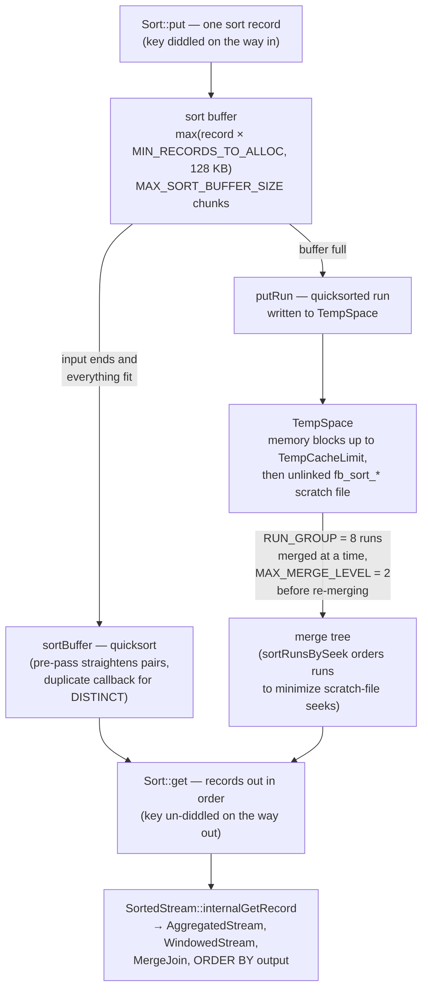
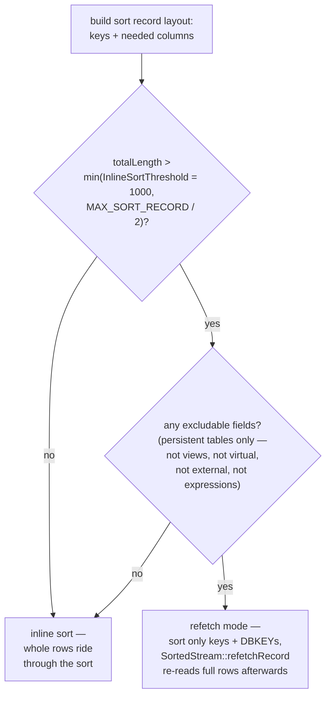

# Sorting and Temporary Space

The [optimizer and execution document](query-optimizer-and-execution.md) shows `SORT (...)` appearing in plans and `SortedStream` sitting in record-source trees — but treats the sort itself as a black box. This document opens the box: the external merge sort in [`src/jrd/sort.cpp`](https://github.com/FirebirdSQL/firebird/blob/master/src/jrd/sort.cpp) (key mangling, 128 KB buffers, runs, `RUN_GROUP` merges), the **TempSpace** layer that keeps sort data in memory up to `TempCacheLimit` and then spills to unlinked scratch files, and the **refetch** optimization (`InlineSortThreshold`) that keeps wide rows out of the sort entirely. Everything is demonstrated live — including catching a **448 MB `fb_sort_*` scratch file** in the server's file-descriptor table while its resident memory stayed pinned at the configured 64 MB — and compared with PostgreSQL's `work_mem`, MySQL's filesort and SQLite's sorter.

It completes the executor story of the [optimizer document](query-optimizer-and-execution.md) and the [aggregate/window document](aggregate-and-window-functions.md) (whose `SortedStream → AggregatedStream/WindowedStream` pipelines all begin here), and touches the [configuration story](deployment-and-operations.md) (three `firebird.conf` knobs) and [indexing](indexing-and-full-text-search.md) (index builds are sorts too).

**Table of Contents**

* [When a sort happens at all](#when-a-sort-happens-at-all)
* [Inside sort.cpp: diddled keys, runs and merges](#inside-sortcpp-diddled-keys-runs-and-merges)
* [TempSpace: memory first, then unlinked scratch files](#tempspace-memory-first-then-unlinked-scratch-files)
* [The refetch optimization: keeping wide rows out of the sort](#the-refetch-optimization-keeping-wide-rows-out-of-the-sort)
* [Sorting in action (validated)](#sorting-in-action-validated)
* [Comparison: PostgreSQL, MySQL, SQLite](#comparison-postgresql-mysql-sqlite)
* [Discussion](#discussion)
* [Further research](#further-research)

## When a sort happens at all

Firebird sorts in more places than `ORDER BY`. A `Sort` object is created for:

* **`ORDER BY`** that the optimizer can't satisfy by index navigation — `PLAN SORT (...)` instead of `PLAN ORDER (...)` ([the choice itself](query-optimizer-and-execution.md) is the optimizer's, weighing index walk vs sort cost);
* **`GROUP BY` and `DISTINCT`** — both are sort-then-scan in Firebird ([`SortedStream` feeding `AggregatedStream`](aggregate-and-window-functions.md)); `DISTINCT` uses the sort's built-in duplicate elimination callback;
* **window functions** — `WindowedStream` partitions and orders via sorts;
* **`MERGE JOIN`** inputs;
* **index creation** — `CREATE INDEX` sorts every key in the table before building the B-tree bottom-up (in FB5+ this sort is parallelized across `ParallelWorkers`).

Captured live: `SELECT FIRST 3 last_name FROM employee ORDER BY phone_ext` → `PLAN SORT ("PUBLIC"."EMPLOYEE" NATURAL)` — no index on `phone_ext`, so the executor's `SortedStream::internalOpen` pulls *every* row through the sort before the first row comes out. The sort is the classic **pipeline breaker**: `Sort::put()` all input, `Sort::sort()`, then `Sort::get()` one record at a time.

## Inside sort.cpp: diddled keys, runs and merges

`Sort` ([`sort.cpp`](https://github.com/FirebirdSQL/firebird/blob/master/src/jrd/sort.cpp), \~2 400 lines descended straight from the InterBase tape-sort) stores fixed-length **sort records**: the key fields first, then whatever data must ride along, rounded up to longword alignment, capped at `MAX_SORT_RECORD` = 1 MB per record.

The first trick is **`diddleKey`** — called on every `put()` and undone on every `get()`. Each key field is *mangled in place* into a byte string whose plain `memcmp` order equals its SQL order: integers get their sign bit flipped, doubles get the IEEE bit-pattern transform, multi-byte integers are byte-swapped on little-endian machines, text is run through the [collation's](internationalization.md) string-to-key transform, NULLs are given a sortable prefix. After diddling, the entire comparison loop — quicksort and merge alike — is a single `memcmp` over the key bytes, with no per-type dispatch anywhere in the hot path.

The machinery around it is textbook external merge sort with Firebird-specific constants:



_Figure 1: The external merge sort — diddled keys make every comparison a memcmp, full buffers become quicksorted runs in TempSpace, and runs merge eight at a time_

When input overflows the buffer, each buffer-full is quicksorted and flushed as a **run** (`putRun`); at `get()` time the runs are merged **eight at a time** (`RUN_GROUP = 8`), at most **two merge levels** deep (`MAX_MERGE_LEVEL = 2`) before intermediate re-merges are forced, and `sortRunsBySeek` orders run reads to keep scratch-file seeks sequential. None of this is novel — which is the point: the interesting engineering was pushed down a layer, into where the runs live.

## TempSpace: memory first, then unlinked scratch files

Runs are not written to files directly; they are written to a **`TempSpace`** ([`TempSpace.cpp`](https://github.com/FirebirdSQL/firebird/blob/master/src/jrd/TempSpace.cpp)) — a virtual byte space, allocated in `TempBlockSize` chunks (default 1 MB), that is transparently **memory until a process-wide budget is exhausted, and disk after**. Three `firebird.conf` knobs govern it:

* **`TempCacheLimit`** — the total in-memory budget for all temp space in the process, shared across all attachments and sorts: default **64 MB** for SuperServer, **8 MB** for Classic/SuperClassic (same `ServerMode`-keyed defaulting as [`GCPolicy`](garbage-collection-and-sweep.md)), per-database overridable in `databases.conf`. Sorts small enough to fit under it never touch disk *even after overflowing their 128 KB sort buffers* — the "runs" live in RAM.
* **`TempBlockSize`** — the allocation granularity.
* **`TempDirectories`** — where scratch files land when the budget runs out: a semicolon-separated list tried in order, defaulting to `$FIREBIRD_TMP`, then the OS temp dir, then `/tmp`.

The scratch files are named `fb_sort_XXXXXX` (`SCRATCH` prefix in `sort.cpp`, created by [`TempFile`](https://github.com/FirebirdSQL/firebird/blob/master/src/common/classes/TempFile.cpp)) — and **unlinked immediately after creation** (`do_unlink = true`). The file exists only as an open descriptor: invisible to `ls`, impossible to leak across a crash, reclaimed by the kernel the moment the sort ends. The flip side, demonstrated below, is that observing one requires reading the server's `/proc/<pid>/fd` table — and that `df` can show a full temp partition with no visible file to blame.

## The refetch optimization: keeping wide rows out of the sort

Sorting `SELECT * ... ORDER BY one_column` naïvely drags every column through the sort records, the runs and the merges. Firebird's answer (the decision sits in [`Optimizer.cpp`](https://github.com/FirebirdSQL/firebird/blob/master/src/jrd/optimizer/Optimizer.cpp), where `SortedStream`'s field map is built):



_Figure 2: The refetch decision — wide rows are sorted as key + record address, then re-read in sorted order_

If the projected sort record exceeds **`InlineSortThreshold`** (default 1 000 bytes), only the keys plus each contributing stream's **DBKEY** (physical record address) go through the sort; after sorting, `SortedStream::refetchRecord` fetches the full rows by address. The trade is explicit: much less data through buffer, runs and merges, in exchange for random re-reads in sorted order (and a subtle [read-committed caveat](transactions-and-concurrency.md): the refetched row is re-read *after* the sort, so it may be newer than the version sorted). The `FIRST ROWS` optimization mode forces refetch unconditionally — for a `FIRST 10 ORDER BY`, re-reading ten rows beats sorting wide records every time.

## Sorting in action (validated)

All against the live SuperServer (default config: `TempCacheLimit = 64M` confirmed in `firebird.conf`). The workload: a three-way cartesian join of `RDB$TYPES` (297 rows) generating 600 000 rows of ~820 bytes each — roughly **470 MB of sort data** — with `ORDER BY` on the padded string, so the key *is* the wide column and refetch can't help:

```
PLAN SORT (JOIN ("A" NATURAL, "B" NATURAL, "C" NATURAL))
```

Watching the engine process (not `fbguard` — the guardian is the parent; the engine is its `firebird` child) while the query ran, sampling `VmRSS` and the file-descriptor table every 150 ms:

```
RSS before 38856 kB, peak 112924 kB   (delta 72 MB)
peak fb_sort files: 1
peak scratch bytes: 469762048         (448 MB)
leftover files after query: none
```

The whole design in four numbers: resident memory grew by **72 MB** — the 64 MB `TempCacheLimit` plus working overhead — while **one** `fb_sort_*` descriptor (pointing at an already-deleted file) grew to **448 MB** of spilled runs, and vanished without cleanup the instant the query finished. The same query with `ROWS 25000` (~20 MB of sort data, under the budget): **zero scratch files** — runs stayed entirely in TempSpace's memory cache. Ordinary `ls /tmp` showed nothing in either case; only `/proc/<pid>/fd` reveals the spill.

## Comparison: PostgreSQL, MySQL, SQLite

| | **Firebird** | **PostgreSQL** | **MySQL** | **SQLite** |
|---|---|---|---|---|
| Memory knob | `TempCacheLimit` — **one process-wide budget** (64 MB SS default) | `work_mem` — **per sort node** (4 MB default), multiplied by every concurrent sort in every query | `sort_buffer_size` — per session (256 KB default) | heuristic; `SQLITE_CONFIG` / cache size |
| Spill | unlinked `fb_sort_*` in `TempDirectories` | `base/pgsql_tmp/*` files (visible, cleaned on restart) | files in `tmpdir` | temp files per `PRAGMA temp_store` / `SQLITE_TMPDIR` |
| Algorithm | quicksort runs + 8-way merge, memcmp on pre-mangled keys | quicksort / external merge; **top-N heapsort** under `LIMIT` | filesort: quicksort runs + merge | incremental merge sorter, multi-threaded with `PRAGMA threads` |
| Wide-row strategy | **refetch**: keys + DBKEY, re-read after (`InlineSortThreshold` 1000 B) | none — full tuples always travel through the sort | the same idea: rowid sort vs packed "addon fields" (old `max_length_for_sort_data`) | rowid+key sort natural to its B-tree design |
| Observability | plan `SORT` prefix; `/proc` for spill | `EXPLAIN ANALYZE`: "Sort Method: external merge Disk: … kB" — the gold standard | `filesort` in `EXPLAIN`, status counters | `EXPLAIN QUERY PLAN` "USE TEMP B-TREE" |

Three contrasts carry the story:

* **Budget shape.** PostgreSQL's `work_mem` is per-operator: a query with four sorts may use 4×, a hundred connections may use 400× — under-provisioning is the default posture and DBAs tune it endlessly. Firebird's `TempCacheLimit` is one global pot: no multiplication surprise, but a single huge sort can eat the whole budget and push every other concurrent sort to disk. Neither shape dominates; they fail differently.
* **Wide rows.** MySQL's rowid-sort-vs-addon-fields choice is exactly Firebird's refetch-vs-inline choice under another name (both engines even default the threshold near 1 KB) — convergent evolution on a real trade-off. PostgreSQL, notably, never refetches: its sorts always carry full tuples, one reason its `work_mem` pressure is felt so keenly.
* **Top-N.** PostgreSQL's heapsort under `LIMIT` keeps only N tuples in memory — Firebird has no equivalent (the `Sort` class carries a `max_records` field annotated *"assigned but unused"*); a `FIRST 1 ... ORDER BY` over 600 k rows sorts all 600 k, as the demo's scratch file proves. The refetch fast-path under `FIRST ROWS` mitigates the width, not the count. This is Firebird's clearest missing sort optimization.

## Discussion

The sort subsystem shows its lineage more openly than any other corner of the engine — `RUN_GROUP`, tape-merge vocabulary, a comment citing the VAX — and yet its architecture is exactly where a modern engine would land: comparisons reduced to `memcmp` by pre-transforming keys (the same idea as PostgreSQL's abbreviated keys or an LSM's key encoding), spill managed by a dedicated caching layer rather than the sort itself, and row width attacked *before* the sort rather than endured inside it. The one visible gap is top-N. For the operator's day-to-day: `PLAN SORT` vs `PLAN ORDER` tells you a sort exists; `TempCacheLimit` decides whether it stays silent in RAM; and when a temp partition mysteriously fills with nothing in `ls`, this document's `/proc` trick is the diagnosis.

## Hands-on: samples, tests and debugging

### C++ sample — [`samples/cpp/sorting.cpp`](samples/cpp/sorting.cpp)

The [TempCacheLimit threshold](#tempspace-memory-first-then-unlinked-scratch-files) reproduced at a size kind to a small machine: 200,000 rows with a 400-byte ASCII key (~82 MB of sort data — the key *is* the wide column, so [refetch](#the-refetch-optimization-keeping-wide-rows-out-of-the-sort) can't shrink it), against a 20,000-row (~8 MB) variant of the same `ORDER BY`. While each query runs, a watcher thread samples both sides of the story: the server's `/proc/<pid>/fd` table (via `sudo`) for the **unlinked** `fb_sort_*` scratch files that `ls` can never show, and database-level `MON$MEMORY_USAGE` from a second attachment — one fresh transaction per poll, because MON$ snapshots are per-transaction. The server pid comes from `MON$ATTACHMENTS.MON$SERVER_PID`; run it on the server machine with passwordless sudo.

```sh
cmake -B build samples && cmake --build build
./build/sorting        # default: inet://localhost//tmp/fbhandson/sorting.fdb
```

Verified output:

```text
bulk: 200000 rows, 400-byte ASCII key -> ~82 MB of sort data
server pid 215035, database memory allocated while idle: 28151808 bytes

big sort (200k rows, ~82 MB)
  PLAN SORT ("PUBLIC"."BULK" NATURAL)
  top row id = 195722
  peak fb_sort_* scratch: 1 file(s), 73400320 bytes
  peak database MON$MEMORY_ALLOCATED: 96116736 bytes (+67964928 over idle)

small sort (20k rows, ~8 MB)
  PLAN SORT ("PUBLIC"."BULK" NATURAL)
  top row id = 65950
  peak fb_sort_* scratch: 0 file(s), 0 bytes
  peak database MON$MEMORY_ALLOCATED: 47923200 bytes (+19771392 over idle)

done.
```

The same four-number story as the [448 MB demonstration](#sorting-in-action-validated), at one-sixth scale: the big sort's allocated memory grows by **+68 MB** — the 64 MB `TempCacheLimit` plus block overhead — and *one* scratch descriptor absorbs the remaining **70 MB** of runs; the small sort stays under budget, and the scratch count is **zero** even though it, too, overflowed its 128 KB sort buffers — runs live in TempSpace's memory cache. Both queries print the same `PLAN SORT (...)`, which is the point: the plan tells you a sort exists, only the volume decides where it lives.

### fb-cpp sample — [`samples/fb-cpp/sorting.cpp`](samples/fb-cpp/sorting.cpp)

The same two-eyed experiment through [fb-cpp](https://github.com/asfernandes/fb-cpp) (vendored at [`extern/fb-cpp`](extern/fb-cpp)), the modern C++20 wrapper over the OO API. The `/proc/<pid>/fd` half is untouched — no wrapper can abstract the server's fd table, so the scratch-file watcher is the same `popen` over `find`/`stat` — but the MON$ half is where the wrapper shows: each poll opens a fresh RAII `Transaction` (new transaction, new MON$ snapshot), `MON$MEMORY_ALLOCATED` comes back as `std::optional<int64_t>` from `getInt64` instead of a string fed to `atol`, and the plans arrive prefetched via `StatementOptions().setPrefetchLegacyPlan(true)` rather than a separate info call.

```sh
cmake -B build samples && cmake --build build   # needs libboost-dev + libboost-filesystem-dev
./build/fbcpp_sorting
```

Verified: the same threshold signature — the big sort peaks at 1 unlinked `fb_sort_*` file of exactly 73400320 bytes (70 MB of runs) with MON$ growth of +68358144 over a 26255360-byte idle; the small sort shows 0 scratch files and +20099072 of memory growth; both print the identical `PLAN SORT ("PUBLIC"."BULK" NATURAL)`.

### JavaScript sample — [`samples/nodejs/sorting.js`](samples/nodejs/sorting.js)

The MON$ half of the same experiment through the wire protocol (`cd samples/nodejs && node sorting.js`; it reuses the C++ sample's `bulk` table, building it if missing). One connection sorts, a second polls `MON$MEMORY_USAGE` — node-firebird runs each `db.query` in its own transaction, so every poll is a fresh MON$ snapshot with no extra code. Verified peaks: `+67506176 over idle` for the big sort, `+19378176` for the small one — the same threshold signature, without the `/proc` half (a browser-less Node process could run remotely; the fd table only exists on the server box).

### Things to try

- Drop the `desc` and `first 1` and fetch everything: the numbers barely move — the sort is a pipeline breaker, so the *open* pays for the whole sort whether you fetch one row or all 200,000.
- Change the query to `select first 1 pad from bulk order by id` after `create index bulk_id on bulk (id)`: the plan flips to `ORDER` (index navigation), and both the memory delta and the scratch file vanish — no `Sort` object is ever created.
- Sort `select id, pad from bulk order by id` (key = 4-byte int, payload = 400-byte pad, total > `InlineSortThreshold`): watch whether refetch mode kicks in — the scratch volume should collapse to keys + DBKEYs.
- Halve the workload (`where mod(id, 2) = 0`, ~41 MB): still under the 64 MB budget plus overhead? Find the row count where the first `fb_sort_*` file appears — that *is* `TempCacheLimit`, measured from outside.

### Debugging this in C++ (gdb)

With a [debug build of the engine](debugging-firebird.md), the whole pipeline of Figure 1 is breakpointable:

```gdb
break SortedStream::internalOpen  # src/jrd/recsrc/SortedStream.cpp:60 — the pipeline break: put-all, sort, then get
break Sort::put                   # src/jrd/sort.cpp:333  — one sort record in (key just diddled)
break Sort::putRun                # src/jrd/sort.cpp:2008 — a full buffer quicksorted and flushed as a run
break TempSpace::setupFile        # src/jrd/TempSpace.cpp:504 — TempCacheLimit exhausted: the spill moment
break TempFile::create            # src/common/classes/TempFile.cpp:126 — fb_sort_* created (and unlinked)
break Sort::get                   # src/jrd/sort.cpp:299  — records out in order (key un-diddled)
```

Run the sample's big sort and the breakpoints fire in exactly that order; the small sort never reaches `TempSpace::setupFile` — the threshold behavior as a breakpoint that does or doesn't hit. At `Sort::put`, the record at `*record_address` shows the diddled key bytes (compare a negative and positive integer key to see the sign-bit flip); at `Sort::putRun` the run being flushed goes to `m_space` — a `TempSpace` whose `head` chain is memory blocks until `setupFile`'s backtrace shows the budget check failing; and `TempFile`'s `doUnlink` handling (`TempFile.cpp:250`) is the two-line reason `ls /tmp` shows nothing while `/proc/<pid>/fd` shows hundreds of megabytes. See the [debugging guide](debugging-firebird.md).

## Further research

* [`src/jrd/sort.cpp`](https://github.com/FirebirdSQL/firebird/blob/master/src/jrd/sort.cpp) / [`sort.h`](https://github.com/FirebirdSQL/firebird/blob/master/src/jrd/sort.h) — `put`/`sort`/`get`, `diddleKey`, `putRun`, the merge tree; the header comments are a history lesson.
* [`src/jrd/TempSpace.cpp`](https://github.com/FirebirdSQL/firebird/blob/master/src/jrd/TempSpace.cpp) / [`src/common/classes/TempFile.cpp`](https://github.com/FirebirdSQL/firebird/blob/master/src/common/classes/TempFile.cpp) — the memory/disk split and the unlink-on-create discipline.
* [`src/jrd/recsrc/SortedStream.cpp`](https://github.com/FirebirdSQL/firebird/blob/master/src/jrd/recsrc/SortedStream.cpp) — the executor face: `internalOpen` (the pipeline break), `mapData`, `refetchRecord`.
* [`src/jrd/optimizer/Optimizer.cpp`](https://github.com/FirebirdSQL/firebird/blob/master/src/jrd/optimizer/Optimizer.cpp) — the refetch decision and sort-vs-index-order costing.
* PostgreSQL docs: [Resource Consumption — work_mem](https://www.postgresql.org/docs/current/runtime-config-resource.html) · MySQL docs: [ORDER BY Optimization](https://dev.mysql.com/doc/refman/8.4/en/order-by-optimization.html) (the filesort variants).
* Companion docs: [optimizer and execution](query-optimizer-and-execution.md) (who decides to sort) · [aggregates and windows](aggregate-and-window-functions.md) (who consumes sorts) · [deployment](deployment-and-operations.md) (where the knobs live) · [internationalization](internationalization.md) (collation keys feeding `diddleKey`).
