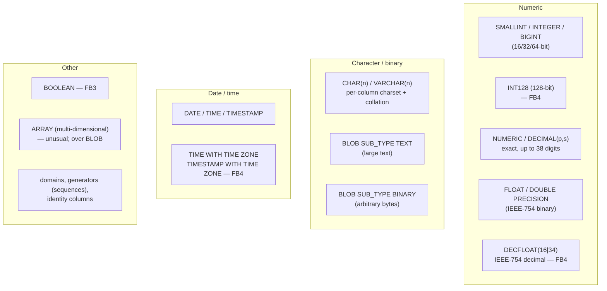
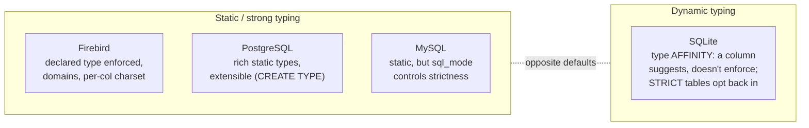

# SQL Dialect and Data Types

Every relational database speaks a variant of SQL and offers a set of data types, and the differences between them decide how portable an application is and how faithfully it can model a domain. This document describes Firebird 6's SQL dialect and type system — grounded in the vendored source (`src/common/dsc.h`, the `doc/sql.extensions/` reference set) and verified with a live server — and compares them with PostgreSQL, MySQL and SQLite.

It is a companion to the [main paper](README.md) and the other comparison documents; it pairs naturally with the [on-disk-structure document](on-disk-structure.md) (how these types are stored) and the [architecture comparison](architecture-comparison.md) (the engines behind them).

**Table of Contents**

* [Two questions: which SQL, and how strict about types](#two-questions-which-sql-and-how-strict-about-types)
* [Firebird SQL dialects](#firebird-sql-dialects)
* [Firebird's type system](#firebirds-type-system)
* [Firebird data types in depth](#firebird-data-types-in-depth)
* [Procedural SQL and other language features](#procedural-sql-and-other-language-features)
* [Data type mapping across the four systems](#data-type-mapping-across-the-four-systems)
* [Typing philosophy: strict vs dynamic](#typing-philosophy-strict-vs-dynamic)
* [Discussion](#discussion)
* [Further research](#further-research)

## Two questions: which SQL, and how strict about types

A SQL comparison really has two axes. First, **which dialect** — how close is the grammar to the ISO SQL standard, and what proprietary extensions does it add? All four systems target the standard (SQL:2016/2023) and all four extend it, but they diverge on strictness and on which features they implement. Second, **how strict is the type system** — does the database enforce a column's declared type on every value (static/strong typing), or does it store whatever you give it and coerce on use (dynamic typing)? Firebird, PostgreSQL and MySQL are statically typed; SQLite is famously dynamic. These two axes structure the rest of the document.

## Firebird SQL dialects

Firebird has a concept none of the others share: an explicit **SQL dialect** number (1, 2, 3), a compatibility mechanism inherited from the InterBase transition. It is recorded per database (`hdr_flags` `hdr_SQL_dialect_3`, see the [on-disk structure](on-disk-structure.md)) and selectable per client connection:

- **Dialect 1** — legacy InterBase behaviour: `"double quotes"` mean string literals, `DATE` includes a time component, exact-numeric precision is limited, and identifiers are case-insensitive and cannot be delimited.
- **Dialect 2** — a client-only diagnostic mode that flags constructs whose meaning differs between 1 and 3.
- **Dialect 3** — the modern, standard-conforming dialect and the only one to use for new work: `"double quotes"` are **delimited identifiers** (per the SQL standard), `'single quotes'` are strings, `DATE`/`TIME`/`TIMESTAMP` are distinct types, and `DECIMAL`/`NUMERIC` keep full precision. Verified live: a Firebird 6 database created with defaults reports `MON$SQL_DIALECT = 3`.

The dialect exists purely for backward compatibility; every current feature (and everything below) assumes dialect 3. It is worth knowing about mainly because a dialect-1 legacy database behaves surprisingly until migrated.

## Firebird's type system

Firebird is **statically and strongly typed**: every column and PSQL variable has a declared type, checked at compile and run time, with well-defined implicit conversions. Internally each value carries a descriptor (`struct dsc` in `src/common/dsc.h`) with a `dtype` code, length, scale and character set — the same descriptor the [on-disk record header](on-disk-structure.md#inside-a-data-page-records-and-version-deltas) references. Two Firebird-specific type-system features stand out:

- **Domains** — named, reusable type definitions with an optional default, `NOT NULL`, and `CHECK` constraint (`CREATE DOMAIN email AS VARCHAR(255) CHECK (VALUE LIKE '%@%')`). Columns declared `AS <domain>` inherit all of it. PostgreSQL has the same feature; MySQL and SQLite do not.
- **Character sets and collations per column** — every text column has a character set (UTF8, WIN1252, NONE, …) and collation, independent of other columns; `NONE` means "bytes, uninterpreted" (the source of the [node-firebird charset gotcha](firebird-wire-protocol.md#worked-examples) and issue [#422](https://github.com/hgourvest/node-firebird/issues/422)).

## Firebird data types in depth

The type set, with the version each arrived (verified live on Firebird 6 unless noted):



_Figure 1: Firebird's data types, grouped, with the version each was introduced_

Verified live in one insert: `BOOLEAN` (`<true>`), `INT128` holding its maximum `170141183460469231731687303715884105727`, `DECIMAL(34,4)`, `DECFLOAT(34)` at `9.99…E+6144`, `TIMESTAMP WITH TIME ZONE` as `2026-07-18 12:00:00 Europe/Bucharest` (named IANA zone, not just an offset), and `TIME WITH TIME ZONE`. Two entries deserve emphasis:

- **DECFLOAT** (IEEE-754 decimal floating point, 16 or 34 significant digits) — exact decimal arithmetic with a vast range, ideal for money and scientific values where binary `DOUBLE` rounding is unacceptable. Firebird and (via its `DECFLOAT`/`NUMERIC`) a few others expose this; it is not universal.
- **INT128** — a true 128-bit integer, useful for high-precision fixed-point and large identifiers; PostgreSQL and MySQL top out at 64-bit `BIGINT` in core.
- **ARRAY** — Firebird has had a multi-dimensional array column type since InterBase (implemented over BLOBs). It is unusual among SQL databases (PostgreSQL is the other notable one) and rarely used, but it is there.

What Firebird lacks natively: a dedicated **JSON** type (JSON is stored as text and manipulated with functions) and a native **UUID** type (a `CHAR(16) CHARACTER SET OCTETS` with `GEN_UUID()` is the idiom).

## Procedural SQL and other language features

Firebird's procedural language, **PSQL**, runs stored procedures, functions, triggers, packages and `EXECUTE BLOCK` anonymous blocks inside the engine. The `doc/sql.extensions/` set documents a modern feature list: common table expressions (including recursive), `MERGE`, window functions, `FILTER` on aggregates, `LISTAGG`, `OFFSET/FETCH`, boolean expressions, packages, computed/identity columns, global and (FB6) created local temporary tables, and — new in Firebird 6 — **SQL schemas** (every object now lives in a schema such as `PUBLIC`, visible in the [monitoring](monitoring-and-tuning.md) and [on-disk](on-disk-structure.md#inspecting-the-structure-validated-with-gstat) output; the namespace, the search path and the resolution rules are the subject of [Schemas and Name Resolution](schemas-and-name-resolution.md)). This puts Firebird's SQL surface broadly on par with the other server databases; the [architecture comparison](architecture-comparison.md) covers the execution engine behind it.

## Data type mapping across the four systems

A practical cross-reference (core types; each system has more):

| Concept | **Firebird** | **PostgreSQL** | **MySQL** | **SQLite** |
|---|---|---|---|---|
| 16/32/64-bit int | `SMALLINT` / `INTEGER` / `BIGINT` | same | same | `INTEGER` (dynamic width) |
| 128-bit int | **`INT128`** | `numeric` (no native int128) | `DECIMAL` (no native) | — |
| Exact decimal | `NUMERIC`/`DECIMAL` (≤38) | `numeric` (arbitrary) | `DECIMAL` (≤65 digits) | `NUMERIC` affinity (dynamic) |
| Decimal float | **`DECFLOAT(16\|34)`** | — (use `numeric`) | — | — |
| Binary float | `FLOAT` / `DOUBLE PRECISION` | `real` / `double precision` | `FLOAT` / `DOUBLE` | `REAL` |
| Boolean | `BOOLEAN` (FB3) | `boolean` | `TINYINT(1)` / `BOOL` alias | `INTEGER` (0/1) |
| Variable text | `VARCHAR(n)` (per-col charset) | `varchar`/`text` | `VARCHAR`/`TEXT` | `TEXT` (affinity) |
| Large text/binary | `BLOB SUB_TYPE TEXT/BINARY` | `text` / `bytea` | `TEXT`/`BLOB` families | `TEXT` / `BLOB` |
| Date / time | `DATE`/`TIME`/`TIMESTAMP` | same | same | text/numeric + functions |
| With time zone | **`TIMESTAMP WITH TIME ZONE`** (named zones, FB4) | `timestamptz` | `TIMESTAMP` (UTC conv.) | — |
| JSON | text + functions | **`json` / `jsonb`** | **`JSON`** | text + [JSON functions](https://sqlite.org/json1.html) |
| Array | **`ARRAY`** (multi-dim) | **arrays** (rich) | — (use JSON) | — |
| UUID | `CHAR(16) OCTETS` + `GEN_UUID()` | **`uuid`** | `BINARY(16)` / `UUID()` | — |
| Domains | **`CREATE DOMAIN`** | **`CREATE DOMAIN`** | — | — |
| Auto-increment | `IDENTITY` / generators | `serial` / `identity` | `AUTO_INCREMENT` | `AUTOINCREMENT` rowid |
| Typing | static/strong | static/strong | static/strong | **dynamic (affinity)** |

## Typing philosophy: strict vs dynamic



_Figure 2: The typing spectrum — three statically typed servers vs SQLite's dynamic type affinity (with opt-in STRICT tables)_

The sharpest contrast is SQLite. In SQLite, a column has a **type affinity** (a preference), not a constraint: you can store a string in an `INTEGER` column and SQLite keeps it ([flexible typing](https://sqlite.org/flextypegood.html) is defended as a feature for its use case). Firebird, PostgreSQL and MySQL reject or coerce such a value according to strict rules. SQLite's [`STRICT` tables](https://sqlite.org/stricttables.html) let you opt into enforcement per table, and MySQL's [`sql_mode`](https://dev.mysql.com/doc/refman/8.4/en/sql-mode.html) conversely lets you *relax* strictness (historically MySQL silently truncated or zero-filled invalid values until strict mode became the default). Firebird and PostgreSQL are the two that are strict by default and by design, with no "lenient mode".

## Discussion

**Firebird's type set is quietly one of the richest for numbers and time.** Its `INT128` and `DECFLOAT` give it native high-precision integer and decimal-float types that PostgreSQL and MySQL lack in core (they reach for arbitrary-precision `numeric`/`DECIMAL` instead), and its `TIMESTAMP WITH TIME ZONE` stores **named IANA zones**, not just offsets. For financial and scientific modelling this is a genuine advantage. Where Firebird trails is the semi-structured and identity types that the web era popularised: no native `JSON`/`jsonb` (PostgreSQL's is the gold standard) and no native `uuid` — both are workable with functions and octet strings, but they are idioms rather than first-class types.

**The dialect number is a Firebird peculiarity worth understanding once.** No other system version-stamps its SQL grammar the way Firebird's dialect 1/2/3 does. It is almost always invisible (everything new is dialect 3), but it explains the otherwise-baffling behaviour of old databases where double quotes mean strings and `DATE` carries a time — a direct fossil of the InterBase lineage traced in the [main paper](README.md).

**Static-by-default is the server consensus; SQLite's dynamic typing is the deliberate outlier.** Three of the four enforce declared types because multi-user, long-lived databases benefit from the guarantee; SQLite relaxes it because a single-application embedded store benefits more from flexibility and small size (the same trade-off as its [single-writer concurrency](embedded-architecture-comparison.md#the-decisive-difference-concurrency) and its [lack of a server](embedded-architecture-comparison.md)). Both directions are now converging slightly — SQLite added `STRICT` tables, MySQL made strict `sql_mode` the default — but the defaults still tell you what each system optimises for.

## Hands-on: samples, tests and debugging

### C++ sample — [`samples/cpp/types.cpp`](samples/cpp/types.cpp)

One table round-trips the headline types [described above](#firebird-data-types-in-depth) — `BOOLEAN`, `INT128` at its maximum, `DECFLOAT(34)` holding an exact `0.1`, `TIMESTAMP WITH TIME ZONE` with a named IANA zone, and a `CHECK`-constrained [domain](#firebirds-type-system). The sample shows both faces of the type system: the **wire type codes** straight from `IMessageMetadata::getType` (the client-side reflection of `struct dsc`'s `dtype`), and the **engine's own text rendering** of every value (`fb_sample.h` coerces output columns to VARCHAR, so the server's CVT rules do the formatting). It also inserts an invalid value into the domain column to show the `CHECK` travelling with the type.

```sh
cmake -B build samples && cmake --build build
./build/types            # default: inet://localhost//tmp/fbhandson/types.fdb
```

Verified output:

```text
domain CHECK rejected 'not-an-address':
    validation error for column "PUBLIC"."SHOWCASE"."MAIL", value "not-an-address"

column  wire type (IMessageMetadata::getType)
------  --------------------------------------
FLAG    32764 = SQL_BOOLEAN
BIG     32752 = SQL_INT128
MONEY   32762 = SQL_DEC34 (DECFLOAT(34))
BORN    32754 = SQL_TIMESTAMP_TZ
MAIL    448 = SQL_VARYING (VARCHAR)

FLAG BIG                                     MONEY BORN                                      MAIL
---- --------------------------------------- ----- ----------------------------------------- ----------------
TRUE 170141183460469231731687303715884105727 0.1   2026-07-21 12:00:00.0000 Europe/Bucharest user@example.com
```

Note the round-trip fidelity: INT128's full 39 digits, `0.1` exactly, and the *named zone* `Europe/Bucharest` — not an offset.

### fb-cpp sample — [`samples/fb-cpp/types.cpp`](samples/fb-cpp/types.cpp)

The same showcase table through [fb-cpp](https://github.com/asfernandes/fb-cpp) (vendored at [`extern/fb-cpp`](extern/fb-cpp)), the modern C++20 wrapper over the OO API — with the coercion trick removed. Where the OO-API sample cast every column to VARCHAR and let the server's CVT rules render text, this one fetches each column *typed*: `getBool` yields a C++ `bool`, `getBoostInt128` a real 128-bit integer (Boost.Multiprecision, so the program can recompute `(1 << 127) - 1` and compare), `getBoostDecFloat34` a 34-digit decimal that equals `BoostDecFloat34{"0.1"}` exactly, and `getTimestampTz` a `{std::chrono UTC instant, zone name}` pair. The wire type codes come from fb-cpp's cached `Descriptor` per column (`originalType`) instead of raw `IMessageMetadata::getType` calls, and the domain violation arrives as a typed `DatabaseException` with `getErrorCode()`.

```sh
cmake -B build samples && cmake --build build   # needs libboost-dev + libboost-filesystem-dev
./build/fbcpp_types
```

Verified: the same wire codes (32764, 32752, 32762, 32754, 448) via `Descriptor.originalType`; the CHECK fires as gds 335544347 with the same `validation error for column "PUBLIC"."SHOWCASE"."MAIL"` text; and the typed round-trip adds what VARCHAR coercion could not show — `== (1 << 127) - 1 computed in Boost? yes`, `== exactly 0.1? yes`, and the zone split into `zone = "Europe/Bucharest", UTC instant = 2026-07-21 09:00`.

### JavaScript sample — [`samples/nodejs/types.js`](samples/nodejs/types.js)

The same table through node-firebird 2.11 (`cd samples/nodejs && node types.js`) is a study in driver coverage: a pure-JavaScript wire-protocol driver must decode every wire type itself, and the FB4 types are exactly where it shows. Verified:

```text
flag   -> true  [boolean]
born   -> "2026-07-21T09:00:00.000Z"  [Date]
mail   -> "user@example.com"  [string]
big    -> "0.170141183460469231731687303715884105727"  [string]
money  -> FETCH FAILED: SQL error code = -804, SQLDA missing or incorrect version, ...

server-side CAST(... AS VARCHAR) — the reliable route:
big    -> "170141183460469231731687303715884105727"  [string]
money  -> "0.1"  [string]
```

`BOOLEAN` maps to a native JS boolean and `TIMESTAMP WITH TIME ZONE` to a JS `Date` — the *instant* is correct (12:00 Bucharest = 09:00Z) but the zone name is gone, because a JS `Date` has nowhere to keep it. `INT128` is worse than unsupported: the driver returns a **wrong value** (`0.170…` — it mis-applies a scale), and `DECFLOAT` cannot be fetched at all (−804). The honest workaround is `CAST(... AS VARCHAR)`, making the server's CVT conversion do the work — the same route the C++ helper takes for every column. The domain `CHECK` fires over the wire identically in both languages.

### Rust sample — [`samples/rust/src/bin/types.rs`](samples/rust/src/bin/types.rs)

The same showcase through [rsfbclient](https://github.com/fernandobatels/rsfbclient), Rust's Firebird client (`cd samples/rust && cargo run --bin types`), where the story is what a driver *makes* of the wire codes: rsfbclient folds the whole type system onto seven `SqlType` variants. The sample's first table demonstrates the coarseness by declaration — every integer width lands in `Integer(i64)`, `NUMERIC(9,2)` and `DOUBLE PRECISION` both in `Floating(f64)` (the scaled exactness of dialect-3 NUMERIC is gone by the time Rust sees it), `CHAR` and `VARCHAR` both in `Text`. And where node-firebird half-decodes the FB4 types — a wrong INT128, an unfetchable DECFLOAT, a zone-stripped `Date` — rsfbclient refuses all three uniformly: `INT128`, `DECFLOAT` and `TIMESTAMP WITH TIME ZONE` fit no variant and fail to fetch, each error carrying the raw wire code the C++ sample read from `IMessageMetadata`. A wrong value versus a loud error is precisely the difference between those two driver postures. The domain violation arrives as a typed `FbError::Sql { code, msg }`, and the recovery route is the familiar one: `CAST(... AS VARCHAR)`, the server's own CVT rendering.

Verified: the coarse mapping prints `Integer(1_i64)`/`Integer(2_i64)`/`Integer(3_i64)` for the three integer widths and `Floating(4.5_f64)` for `NUMERIC(9,2)`; `SELECT * FROM showcase` dies on the first FB4 column with `Unsupported column type (32752 0)`, and column-by-column the three failures name their codes — 32752, 32762, 32754, the same `SQL_INT128`/`SQL_DEC34`/`SQL_TIMESTAMP_TZ` constants from the C++ wire-code table. The CHECK fires as `FbError::Sql, sqlcode -625` with the identical `validation error for column "PUBLIC"."SHOWCASE"."MAIL"` text, and the CAST route returns all 39 INT128 digits, `0.1` exactly, and `Europe/Bucharest` by name.

### Things to try

- Add an `INT128` overflow: insert `1.7e38` cast to `INT128`, or `SELECT 170141183460469231731687303715884105727 + 1` — watch dialect-3 exact arithmetic refuse instead of wrapping.
- Change the C++ `attach` charset from `UTF8` to `NONE` and re-run: the `TIMESTAMP_TZ` text is unchanged (dates don't transliterate) but accented text in `mail` would arrive as raw bytes — the [per-column charset](#firebirds-type-system) mechanics, explored fully in [internationalization.md](internationalization.md).
- Create a dialect-1 database (`isql -sqldialect 1`) and watch `"double quotes"` become string literals and `DATE` grow a time part.
- In `types.js`, try `SELECT big + 0 FROM showcase` — the sum comes back as INT128 too, so the CAST workaround is needed for computed columns as well.

### Debugging this in C++ (gdb)

With a [debug build of the engine](debugging-firebird.md), the type machinery is directly observable:

```gdb
break CVT_move_common      # src/common/cvt.cpp:1678 — every type conversion funnels here
break datetime_to_text     # cvt.cpp:2363 — fires when the TIMESTAMP_TZ column becomes text
break Firebird::Int128::toString   # src/common/Int128.cpp:123 — INT128 rendered to digits
break EVL_validate         # src/jrd/evl.cpp:599 — the domain CHECK being evaluated
```

`CVT_move_common` receives the two descriptors (`const dsc* from, dsc* to`) this document's [type-system section](#firebirds-type-system) describes — print `from->dsc_dtype` and `to->dsc_dtype` to watch the sample's VARCHAR coercion happen one column at a time. When the invalid `mail` insert runs, `EVL_validate` evaluates the domain's `CHECK` and its error path posts `isc_not_valid_for` (`evl.cpp:662`) — the backtrace shows the assignment node that carried the domain's validation expression into the INSERT. The [debugging guide](debugging-firebird.md) explains how to run the sample against an embedded engine so these breakpoints fire in-process.

## Further research

**Firebird**

- [`doc/sql.extensions/README.data_types`](https://github.com/FirebirdSQL/firebird/blob/master/doc/sql.extensions/README.data_types), [`README.floating_point_types.md`](https://github.com/FirebirdSQL/firebird/blob/master/doc/sql.extensions/README.floating_point_types.md) (DECFLOAT/INT128), [`README.time_zone.md`](https://github.com/FirebirdSQL/firebird/blob/master/doc/sql.extensions/README.time_zone.md), [`README.schemas.md`](https://github.com/FirebirdSQL/firebird/blob/master/doc/sql.extensions/README.schemas.md).
- The full [Firebird language reference](https://firebirdsql.org/file/documentation/pdf/en/refdocs/fblangref50/firebird-50-language-reference.pdf) (PDF) and the [`doc/sql.extensions/`](https://github.com/FirebirdSQL/firebird/tree/master/doc/sql.extensions) directory for every SQL feature.

**PostgreSQL**

- [Data types](https://www.postgresql.org/docs/current/datatype.html), [JSON types](https://www.postgresql.org/docs/current/datatype-json.html), [Arrays](https://www.postgresql.org/docs/current/arrays.html), [Domains](https://www.postgresql.org/docs/current/domains.html).

**MySQL**

- [Data types](https://dev.mysql.com/doc/refman/8.4/en/data-types.html), [Server SQL modes](https://dev.mysql.com/doc/refman/8.4/en/sql-mode.html), [JSON](https://dev.mysql.com/doc/refman/8.4/en/json.html); MariaDB's [data types](https://mariadb.com/kb/en/data-types/).

**SQLite**

- [Datatypes and type affinity](https://sqlite.org/datatype3.html), [Flexible typing as a feature](https://sqlite.org/flextypegood.html), [STRICT tables](https://sqlite.org/stricttables.html), [JSON functions](https://sqlite.org/json1.html).

**Standards**

- [SQL:2016](https://en.wikipedia.org/wiki/SQL:2016), [IEEE 754](https://en.wikipedia.org/wiki/IEEE_754) (the basis of `DOUBLE` and `DECFLOAT`).
