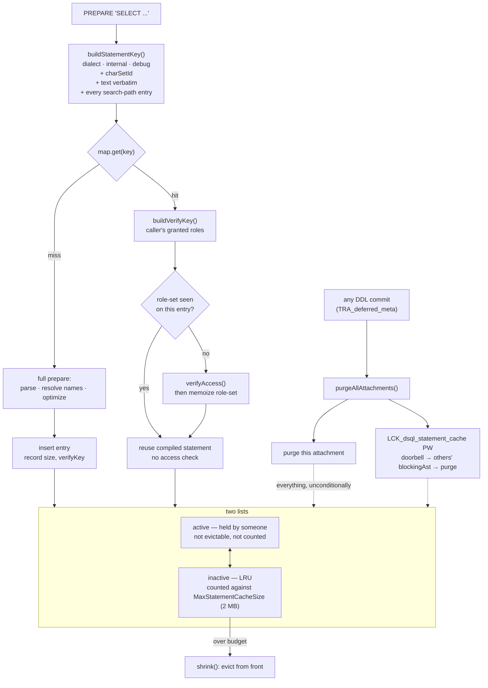

# The Compiled Statement Cache — what makes two statements the same

*A companion to [Conceptual Architecture of Firebird](README.md). Grounded in the vendored [`extern/firebird`](extern/firebird) source (Firebird 6, `master`) and verified against a live Firebird 6 server.*

---

## Table of contents

* [Why the statement cache deserves its own document](#why-the-statement-cache-deserves-its-own-document)
* [The key: what makes two statements the same](#the-key-what-makes-two-statements-the-same)
* [The second key: sharing across users without sharing privileges](#the-second-key-sharing-across-users-without-sharing-privileges)
* [Active, inactive, evicted](#active-inactive-evicted)
* [Invalidation is a sledgehammer](#invalidation-is-a-sledgehammer)
* [What MON$COMPILED_STATEMENTS is not](#what-moncompiled_statements-is-not)
* [Live demonstrations](#live-demonstrations)
* [Comparison: PostgreSQL, MySQL, SQLite](#comparison-postgresql-mysql-sqlite)
* [Further reading](#further-reading)

---

## Why the statement cache deserves its own document

Firebird 5 added a cache of compiled statements, and in this collection it is a single bullet in [the main paper](README.md#firebird-5-2024-parallel-execution-inside-the-engine). It is the last of the Firebird 5 features to go unexplained, and it earns a document for a reason that is easy to miss from the feature's name.

Caching compiled statements is not interesting. Every database does it. What is interesting is the question a statement cache is forced to answer precisely: **when are two SQL statements the same statement?** Get that wrong in the permissive direction and you hand one user a plan compiled for another user's privileges, or a plan compiled against a different table than the one the text now names. Get it wrong in the restrictive direction and the cache never hits.

Firebird's answer is unusually legible, because it builds the cache key by hand, byte by byte, in one function you can read in a minute. And the answer turns out to depend on something this collection documented three documents ago: the [schema search path](schemas-and-name-resolution.md). Two identical strings of SQL, prepared by the same user on the same connection, can be two different statements — and the cache knows it.

---

## The key: what makes two statements the same

[`DsqlStatementCache::buildStatementKey()`](extern/firebird/src/dsql/DsqlStatementCache.cpp#L256) packs the identity of a statement into a single byte string:

```cpp
key->resize(1 + sizeof(charSetId) + text.length() + 1 + searchPathLen + 1);

char* p = key->begin();
*p++ = (clientDialect << 2) | (int(isInternalRequest) << 1) | debugOptions;
memcpy(p, &charSetId, sizeof(charSetId));
p += sizeof(charSetId);
memcpy(p, text.c_str(), text.length() + 1);
p += text.length() + 1;

for (const auto& pathItem : *attachment->att_schema_search_path)
{
    memcpy(p, pathItem.c_str(), pathItem.length() + 1);
    p += pathItem.length() + 1;
}
```

Four components, in order:

1. **A flags byte** — the client [SQL dialect](sql-dialect-and-types.md), whether this is an internal engine request, and a debug option (`keepBlr`).
2. **The character set id** — because the same bytes of text mean different things under different [character sets](internationalization.md), and `CS_METADATA` is forced for internal requests.
3. **The statement text**, verbatim and null-terminated. No normalization: whitespace, case and comments all count. `SELECT 1` and `select 1` are different statements.
4. **Every entry of the schema search path**, null-terminated.

The fourth is the one worth stopping on. [The schemas document](schemas-and-name-resolution.md#two-resolution-regimes) established that an unqualified name in interactive SQL resolves through `att_schema_search_path`, so `SELECT ORIGIN FROM CUSTOMERS` means `APP.CUSTOMERS` under one path and `PUBLIC.CUSTOMERS` under another. A cache keyed only on text would happily return the first compilation to the second caller and silently query the wrong table.

Including the whole path in the key is the blunt, obviously-correct fix: change the path and every cached statement becomes unreachable, because the key changed. It costs cache entries — a session that flips its search path repeatedly gets a distinct cached entry per path per statement — but the failure mode of the alternative is silent wrong answers, which is not a trade worth making.

Note also what is *not* in the key: the user. That is the subject of the next section.

---

## The second key: sharing across users without sharing privileges

A compiled statement embeds decisions that depend on privileges. If the cache is shared across users — and it is, being per-database rather than per-user — then a hit by user B on an entry compiled for user A must not skip B's access checks.

Firebird handles this with a **second, separate key**, built by [`buildVerifyKey()`](extern/firebird/src/dsql/DsqlStatementCache.cpp#L294) from the caller's granted roles:

```cpp
const auto& roles = attachment->att_user->getGrantedRoles(tdbb);

string roleStr;

for (const auto& role : roles)
{
    roleStr.printf("%d,%s,", int(role.length()), role.c_str());
    key += roleStr;
}
```

and each cache entry carries a `verifyCache` — a sorted set of role-sets that have already been checked against this statement. The lookup in [`getStatement()`](extern/firebird/src/dsql/DsqlStatementCache.cpp#L72) uses both:

```cpp
if (const auto entryPtr = map.get(key))
{
    const auto entry = *entryPtr;
    auto dsqlStatement(entry->dsqlStatement);

    string verifyKey;
    buildVerifyKey(tdbb, verifyKey, isInternalRequest);

    FB_SIZE_T verifyPos;
    if (!entry->verifyCache.find(verifyKey, verifyPos))
    {
        dsqlStatement->getStatement()->verifyAccess(tdbb);
        entry->verifyCache.insert(verifyPos, verifyKey);
    }
```

The identity key finds the compiled statement; the verify key decides whether the access check can be skipped. A role-set seen before is trusted; a new one pays for a full `verifyAccess()` and is then memoized.

This is a genuinely careful piece of design. The expensive part of a prepare — parsing, name resolution, optimization — is shared across every user of the statement. The security-relevant part is re-run once per *distinct set of granted roles*, not once per user and not once per prepare. Two users with identical role sets share both the plan and the verification; a user with a different role set shares the plan and pays for their own check exactly once.

---

## Active, inactive, evicted

Entries live on two lists, and the distinction governs both eviction and accounting:

- **Active** — the statement is currently held by someone. It is in the cache but not evictable.
- **Inactive** — nobody holds it; it is retained purely in the hope of a future hit.

Only inactive entries count toward `cacheSize`; activating an entry subtracts its size, and releasing it adds the size back. Eviction, in [`shrink()`](extern/firebird/src/dsql/DsqlStatementCache.cpp#L314), therefore only ever touches statements nobody is using:

```cpp
while (cacheSize > maxCacheSize && !inactiveStatementList.isEmpty())
{
    const auto& front = inactiveStatementList.front();
    front.dsqlStatement->resetCacheKey();
    map.remove(front.key);
    cacheSize -= front.size;
    inactiveStatementList.erase(inactiveStatementList.begin());
}
```

Taking from the front while hits splice entries to the back makes this a straightforward LRU over unused statements. The budget comes from [`MaxStatementCacheSize`](extern/firebird/src/common/config/config.h#L299):

```cpp
{TYPE_INTEGER,  "MaxStatementCacheSize",    false,  2 * 1048576},   // bytes
```

**2 MB by default**, measured in bytes of cached statement rather than a statement count. The `false` in the third column is `is_global`, so unlike `ParallelWorkers` this one can be set per database in `databases.conf`. Setting it to zero disables the cache outright, since [`isActive()`](extern/firebird/src/dsql/DsqlStatementCache.h#L93) is just `maxCacheSize > 0`.

---

## Invalidation is a sledgehammer

A cached plan is only valid while the metadata it was compiled against is unchanged. [The metadata cache](metadata-cache.md) solves its own version of this problem with fine precision: per-object version chains, transaction-stamped, invalidated by a blocking AST carrying a single transaction number.

The statement cache does nothing of the kind. From [`dfw.epp`](extern/firebird/src/jrd/dfw.epp#L1458), in the deferred-work-at-commit path:

```cpp
auto* dsql = tdbb->getAttachment()->att_dsql_instance;
if (dsql && dsql->dbb_statement_cache)
    dsql->dbb_statement_cache->purgeAllAttachments(tdbb);
```

The guard above it is only that the transaction has deferred metadata work at all. **Any DDL commit purges the entire statement cache of every attachment** — no analysis of which statements depend on the changed object, no attempt at selective invalidation. Creating an unrelated table throws away the compiled form of every statement in the database.

[`purgeAllAttachments()`](extern/firebird/src/dsql/DsqlStatementCache.cpp#L242) reaches the other attachments the way everything else in this engine does:

```cpp
purge(tdbb, false);

Lock tempLock(tdbb, 0, LCK_dsql_statement_cache);

if (!LCK_lock(tdbb, &tempLock, LCK_PW, LCK_WAIT))   // notify others
    status_exception::raise(tdbb->tdbb_status_vector);

LCK_release(tdbb, &tempLock);
```

Purge locally, then take [`LCK_dsql_statement_cache`](extern/firebird/src/jrd/lck.h#L78) in protected-write to conflict with everyone else's lock and fire their blocking ASTs, each of which calls `purge()`. The lock carries no data — it is the same doorbell pattern as the [profiler's remote listener](profiler.md#profiling-somebody-elses-attachment) and the [metadata cache's invalidation](metadata-cache.md#invalidation-across-processes), used for the third time in this collection.

Is the bluntness defensible? On the evidence, mostly yes. Selective invalidation requires a dependency map from cached statements to metadata objects, which is exactly the bookkeeping `RDB$DEPENDENCIES` maintains for *stored* objects at considerable cost — and DDL on a production database is rare, while the recompilation it forces is bounded and self-healing. The cost, quantified in the live section below, is that a workload which interleaves DDL with queries gets no benefit from the cache at all. Schema-migration tooling and applications that create temporary tables are the cases to watch.



*Figure 1: Two keys on the way in, two lists in residence, and one indiscriminate purge on any DDL commit.*

---

## What `MON$COMPILED_STATEMENTS` is not

`MON$COMPILED_STATEMENTS` arrived in ODS 13.1 and is usually mentioned in the same breath as the statement cache. They are not the same thing, and conflating them will mislead you.

The table is populated in [`Monitoring.cpp`](extern/firebird/src/jrd/Monitoring.cpp#L1737) by walking `attachment->att_requests` — the JRD requests currently attached to each connection. It reports compiled `Statement` objects reachable from live requests, with their SQL text and explained plan. It does **not** enumerate `DsqlStatementCache`, and an entry sitting inactive in the cache waiting for a future hit does not appear in it.

This is confirmed by experiment below: after executing two statements whose compiled forms are certainly cached, `MON$COMPILED_STATEMENTS` contains only the monitoring query itself.

The practical consequence is worth stating plainly: **there is no monitoring view of the statement cache.** You cannot ask how many statements are cached, how much of the 2 MB budget is used, or what the hit rate is. The cache's behaviour has to be inferred from timing, which is how the demonstrations below work — and it is the clearest gap in this subsystem relative to its peers, all three of which expose their caches through some catalog or view.

---

## Live demonstrations

Captured against a running Firebird 6 server (`LI-T6.0.0.2076`, engine 6.0.0), default `MaxStatementCacheSize` of 2 MB. Because there is no view onto the cache, every measurement is a timing comparison run three times.

### Hits versus misses

The cache saves *compilation*, so the effect scales with how much compilation a statement needs. Two hundred executions of a six-way self-join — heavy to optimize, trivial to execute — prepared from one connection, comparing identical text against text that differs by one literal each time:

| 200 × six-way self-join | Elapsed |
|---|---|
| Identical text (all but the first prepare should hit) | 0.10 s · 0.10 s · 0.09 s |
| Distinct text (all misses) | 0.15 s · 0.15 s · 0.15 s |

Roughly 60% more work when every prepare must recompile. For a trivial statement (`SELECT COUNT(*) ... WHERE ID > 0`) the same comparison at 400 iterations gives 0.11 s against 0.13 s — real, but small. The cache is worth most exactly where compilation is expensive, which is the case it exists for.

### Unrelated DDL throws the cache away

The claim from `dfw.epp` is that *any* DDL commit purges *everything*. Three runs of 100 iterations each, on the same connection:

| Run | What it does | Elapsed |
|---|---|---|
| **A** | 100 × heavy statement, no DDL | 0.09 s · 0.08 s |
| **C** | 100 × `CREATE TABLE UNRELATED_n` + `COMMIT`, no queries | 3.61 s |
| **B** | 100 × (`CREATE TABLE` + `COMMIT` + heavy statement) | 4.23 s |

Subtracting the DDL's own cost, the 100 heavy statements cost about **0.62 s** in run B against **0.085 s** in run A — roughly seven times more, for identical statement text on the same connection. The only difference is that each prepare in B was preceded by a commit creating a table that the statement never references.

That is the unconditional purge, visible. (The subtraction is an approximation — B and C are separate runs and the catalog grows during both — but the effect is an order of magnitude larger than any plausible error in it.)

### The cache is invisible

After executing two statements on a connection, querying the monitoring table:

```sql
SELECT MON$COMPILED_STATEMENT_ID, MON$SQL_TEXT, MON$EXPLAINED_PLAN
  FROM MON$COMPILED_STATEMENTS ORDER BY 1;
```

returns exactly one row — the `SELECT ... FROM MON$COMPILED_STATEMENTS` query itself, complete with its own explained plan:

```
Select Expression
    -> Sort (record length: 52, key length: 12)
        -> Table "SYSTEM"."MON$COMPILED_STATEMENTS" Full Scan
```

The two statements executed a moment earlier, whose compiled forms are in the cache, are absent. `att_requests` is what the table walks, and nothing holds a request for them any more.

### A note on what could not be shown

The search-path component of the cache key is unambiguous in the source but could not be demonstrated live, precisely because of the gap above: with no view onto the cache, there is no way to observe that `SELECT ORIGIN FROM CUSTOMERS` under `APP, PUBLIC` and the same text under `PUBLIC` occupy two entries rather than one. The behavioural consequence — that the two resolve to different tables — is demonstrated in [the schemas document](schemas-and-name-resolution.md#resolution-follows-the-path-in-order); that they are separately cached rests on `buildStatementKey()` alone.

---

## Comparison: PostgreSQL, MySQL, SQLite

| | **Firebird** | **PostgreSQL** | **MySQL** | **SQLite** |
|---|---|---|---|---|
| **Scope** | Per database, shared across attachments | Per session (prepared statements); `plan_cache_mode` | Per server (prepared statements per session) | Per connection |
| **Keyed on raw text?** | Yes — verbatim, no normalization | Explicit `PREPARE` name, not text | Explicit `PREPARE`, plus text for the (removed) query cache | Explicit `sqlite3_prepare` handle |
| **Implicit text-based reuse** | **Yes** — any repeated text hits | No — you must `PREPARE` | No | No |
| **Namespace in the key** | **Yes** — full search path | `search_path` affects plan caching; revalidated on invalidation | — | — |
| **Cross-user sharing** | Yes, with per-role-set access re-verification | No — plans are session-local | No | No |
| **Invalidation** | **Any DDL purges everything, all attachments** | Selective, via relcache/syscache invalidation messages | — | `SQLITE_SCHEMA` → automatic re-prepare |
| **Budget** | `MaxStatementCacheSize`, 2 MB, per database | Per-session plan storage; no global cap | — | — |
| **Observable** | **No view** | `pg_prepared_statements` | `performance_schema` | — |

Two rows carry the argument, and they cut in opposite directions.

**Implicit reuse is Firebird's advantage.** PostgreSQL caches plans for statements you explicitly `PREPARE`, and for PL/pgSQL statements, but two identical ad-hoc queries sent by an application that does not use prepared statements are parsed and planned twice. Firebird hits its cache on the text alone, so a naive application that concatenates the same SQL repeatedly benefits without changing a line — which, given how much application code works exactly that way, is a real practical win. It is also why the key must be so careful: the cache is doing something the application never asked for, so it must be certain the reuse is safe. Hence the search path in the key and the role-set re-verification.

**Invalidation is Firebird's weakness.** PostgreSQL tracks dependencies and invalidates the affected cached plans, revalidating them on next use; the rest of the cache survives. Firebird discards everything, in every attachment, on any DDL commit. For a stable schema this never matters. For a workload that mixes DDL with queries — migrations, tooling, applications creating temporary tables — it means the cache contributes nothing, at a measured cost of roughly 7× on statement preparation in the demonstration above.

**MySQL** removed its text-keyed query cache in 8.0 for reasons of contention and invalidation cost, which is worth noting alongside Firebird's design: a shared, text-keyed cache is exactly the structure MySQL abandoned. Firebird's is a cache of *compiled statements*, not of *results*, so it does not carry the correctness burden that sank MySQL's — but the invalidation-is-hard lesson is the same one, and Firebird's answer to it is to not attempt precision at all. **SQLite** re-prepares on schema change and keeps nothing across connections, which for an embedded engine is the whole requirement.

Firebird's distinguishing choice, stated plainly: **it is the only one of the four that reuses a compiled statement on raw text alone, and the only one whose cache key contains the namespace search path — the two facts being the same fact, because implicit reuse is only safe if the key captures everything that changes what the text means.**

---

## Further reading

- [`src/dsql/DsqlStatementCache.h`](https://github.com/FirebirdSQL/firebird/blob/master/src/dsql/DsqlStatementCache.h) / [`.cpp`](https://github.com/FirebirdSQL/firebird/blob/master/src/dsql/DsqlStatementCache.cpp) — the whole subsystem in about 500 lines: both key builders, the two lists, `shrink()` and `purgeAllAttachments()`.
- [`src/jrd/dfw.epp`](https://github.com/FirebirdSQL/firebird/blob/master/src/jrd/dfw.epp) — `DFW_perform_work`, where any deferred metadata change triggers the purge.
- [`src/jrd/Monitoring.cpp`](https://github.com/FirebirdSQL/firebird/blob/master/src/jrd/Monitoring.cpp) — what `MON$COMPILED_STATEMENTS` actually walks.
- [Firebird 5 release notes](https://firebirdsql.org/file/documentation/release_notes/html/en/5_0/rlsnotes50.html) — the feature announcement and `MaxStatementCacheSize`.
- [PostgreSQL: plan caching and `plan_cache_mode`](https://www.postgresql.org/docs/current/sql-prepare.html) · [`pg_prepared_statements`](https://www.postgresql.org/docs/current/view-pg-prepared-statements.html)
- [MySQL: why the query cache was removed](https://dev.mysql.com/doc/refman/8.0/en/query-cache.html)
- [SQLite: `sqlite3_prepare_v2()` and schema changes](https://www.sqlite.org/c3ref/prepare.html)

---

*Companion documents: [Schemas and Name Resolution](schemas-and-name-resolution.md) · [The Metadata Cache](metadata-cache.md) · [Query Optimizer and Execution Engine](query-optimizer-and-execution.md) · [BLR, the Binary Language Representation](blr-intermediate-language.md) · [Monitoring and Performance Tuning](monitoring-and-tuning.md) · [Security Architecture](security-architecture.md) · [Reading Guide](READING-GUIDE.md)*
