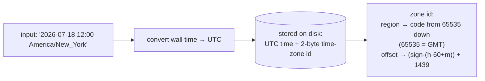

# Temporal Features and Time-Zone Handling

Dates and times look simple until time zones, daylight saving, and "what does *now* mean" enter — then they become one of the trickiest corners of any database. This document describes Firebird 6's temporal type system and its time-zone support (introduced in Firebird 4), grounded in the vendored `doc/sql.extensions/README.time_zone.md` and demonstrated live, then compares the temporal story with PostgreSQL, MySQL and SQLite.

It builds on the [SQL dialect and data types document](sql-dialect-and-types.md) (temporal types in the type system, where the live demo first showed `TIMESTAMP WITH TIME ZONE`), and touches the [internationalization](internationalization.md) subsystem (both rely on the bundled ICU/tzdata) and [deployment](deployment-and-operations.md) (the `DefaultTimeZone` setting).

**Table of Contents**

* [The temporal types](#the-temporal-types)
* [How WITH TIME ZONE is stored](#how-with-time-zone-is-stored)
* [The session time zone](#the-session-time-zone)
* [Conversions, EXTRACT and arithmetic](#conversions-extract-and-arithmetic)
* [DST, equality and edge cases](#dst-equality-and-edge-cases)
* [Temporal features in action (validated)](#temporal-features-in-action-validated)
* [Comparison: PostgreSQL, MySQL, SQLite](#comparison-postgresql-mysql-sqlite)
* [Discussion](#discussion)
* [Further research](#further-research)

## The temporal types

Firebird's temporal types, with time-zone awareness added in Firebird 4:

- **`DATE`** — a calendar date (no time, no zone).
- **`TIME [WITHOUT TIME ZONE]`** — a wall-clock time.
- **`TIMESTAMP [WITHOUT TIME ZONE]`** — date + time, no zone.
- **`TIME WITH TIME ZONE`** — a time plus a zone.
- **`TIMESTAMP WITH TIME ZONE`** — date + time plus a zone.
- **`EXTENDED TIME/TIMESTAMP WITH TIME ZONE`** — a wire-only variant (below).

The *without-zone* types (`DATE`, `TIME`, `TIMESTAMP`) are interpreted in the **session time zone** when converted to or from a *with-zone* type. `TIME`/`TIMESTAMP` are synonyms for their `WITHOUT TIME ZONE` forms. Firebird notably has **no `INTERVAL` type** — durations are handled with `DATEADD`/`DATEDIFF` functions rather than a first-class interval value (a difference from PostgreSQL).

## How WITH TIME ZONE is stored

The internal representation is the crux, and Firebird made a distinctive choice (`README.time_zone.md`, "Storage"):



_Figure 1: A `WITH TIME ZONE` value is stored as the UTC instant plus a 2-byte time-zone identifier — so Firebird preserves both the moment and which zone it was expressed in_

- The date/time part is stored **in UTC** (translated from the input zone), like most databases.
- But Firebird *also* stores a **2-byte time-zone identifier** — a region code (regions start at 65535 = GMT and decrease as zones are added) or an encoded offset (`(sign·(hours·60+minutes)) + 1439`, so `+00:00` = 1439). This is the distinctive part: Firebird **remembers which zone the value was in**, not just the instant.
- **`EXTENDED`** variants add another 2 bytes holding the absolute offset in minutes; they exist purely to serve clients that lack the ICU library (which otherwise couldn't resolve a region id to an offset), and can only be reached via [`SET BIND`](https://github.com/FirebirdSQL/firebird/blob/master/doc/sql.extensions/README.set_bind.md) coercion — never used in tables.

Storing the zone id (not just UTC) is the key architectural difference from PostgreSQL's `timestamptz`, which keeps only the instant. Region codes are resolved through the bundled IANA time-zone database (the [`tzdata/`](deployment-and-operations.md#the-firebird-install-layout) directory in the install), and the `RDB$TIME_ZONES` virtual table lists them (638 on the live server).

## The session time zone

Every attachment has a **session time zone** that governs how zoneless values are interpreted and how "now" is reported. Its initial value comes from (in priority order) the `isc_dpb_session_time_zone` DPB, the client `firebird.conf` `DefaultTimeZone`, the server `DefaultTimeZone`, or the engine's OS time zone. It is changed at runtime with:

- **`SET TIME ZONE '<region-or-offset>'`** — switch the session zone (e.g. `SET TIME ZONE 'Asia/Tokyo'`).
- **`SET TIME ZONE LOCAL`** — reset to the session's original zone.
- **`RDB$GET_CONTEXT('SYSTEM', 'SESSION_TIMEZONE')`** — read the current session zone.

A subtlety from the docs: inside a routine (procedure/function/trigger), the "original" zone that `SET TIME ZONE LOCAL` restores to is the zone current *at routine entry*, restored automatically at exit — so a routine can safely change the zone without leaking it to the caller.

## Conversions, EXTRACT and arithmetic

Firebird 4 added the SQL-standard conversion and extraction operators:

- **`AT TIME ZONE '<zone>'`** — convert a value to another zone; **`AT LOCAL`** — convert to the session zone.
- **`EXTRACT(TIMEZONE_HOUR | TIMEZONE_MINUTE | TIMEZONE_NAME FROM …)`** — pull out the zone displacement or region name.
- **`LOCALTIME` / `LOCALTIMESTAMP`** — the current time/timestamp as a *without-zone* value in the session zone (versus `CURRENT_TIME`/`CURRENT_TIMESTAMP`, which are *with*-zone).
- **Arithmetic** via `DATEADD(n <part> TO t)`, `DATEDIFF(<part> FROM a TO b)`, `EXTRACT(<part> FROM t)`, and helpers `FIRST_DAY`/`LAST_DAY` (`README.builtin_functions.txt`).
- The **`RDB$TIME_ZONE_UTIL`** package and **`RDB$TIME_ZONES`** table expose the zone database (transitions, offsets) to SQL.

## DST, equality and edge cases

Time-zone support is only as good as its handling of the hard cases, and Firebird defines them:

- **Equality is by UTC.** `TIME '10:00 -02:00' = TIME '09:00 -03:00'` because both are `12:00 GMT` — and this holds for `UNIQUE` constraints and sorting, not just `=`.
- **DST gaps and overlaps.** When DST starts, a non-existent local time (e.g. 2:30 AM on a spring-forward day) is interpreted at the pre-transition offset; when DST ends, a doubled hour resolves to the first (pre-transition) occurrence — both rules spelled out in the docs.
- **Region-based `TIME WITH TIME ZONE`** needs a date to know the offset (offsets change with DST), so Firebird pins the fixed date **2020-01-01** when constructing a `TIME WITH TIME ZONE` literal, while preserving the wall-clock time on `TIMESTAMP → TIME WITH TIME ZONE` conversions where sensible.

## Temporal features in action (validated)

Real output from a live Firebird 6 server (session zone `Etc/UTC`):

```sql
-- named IANA zone + AT conversions (DST-aware):
SELECT TIMESTAMP '2026-07-18 12:00:00 America/New_York' AT TIME ZONE 'Europe/Bucharest',
       TIMESTAMP '2026-07-18 12:00:00 America/New_York' AT LOCAL;
--   19:00:00 Europe/Bucharest      16:00:00 Etc/UTC     (NY 12:00 EDT = 16:00 UTC = 19:00 EEST)

-- equality is by UTC:
SELECT time '10:00:00 -02:00' = time '09:00:00 -03:00';           -- EQUAL (both 12:00 GMT)

-- EXTRACT the zone parts:
SELECT EXTRACT(TIMEZONE_HOUR FROM timestamp '2026-07-18 12:00 +05:30'),    -- 5
       EXTRACT(TIMEZONE_MINUTE FROM timestamp '2026-07-18 12:00 +05:30'),  -- 30
       EXTRACT(TIMEZONE_NAME FROM timestamp '2026-07-18 12:00 Asia/Kolkata'); -- Asia/Kolkata

-- change the session zone:
SET TIME ZONE 'Asia/Tokyo';
SELECT RDB$GET_CONTEXT('SYSTEM','SESSION_TIMEZONE'), LOCALTIMESTAMP;
--   Asia/Tokyo        2026-07-19 06:44:...   (Tokyo is UTC+9, next calendar day)

-- arithmetic + the zone catalog:
SELECT DATEADD(-1 DAY TO current_date),                       -- yesterday
       DATEDIFF(DAY FROM date '2026-01-01' TO date '2026-07-18'),  -- 198
       EXTRACT(WEEK FROM date '2026-07-18');                  -- 29 (ISO week)
SELECT count(*) FROM rdb$time_zones;                          -- 638
```

Every operation worked: named-region storage, DST-correct `AT` conversion (New York EDT to Bucharest EEST), UTC-based equality, zone extraction, a live session-zone switch to Tokyo (crossing midnight), interval arithmetic, and the 638-entry zone catalog. This is a complete IANA-aware temporal system.

## Comparison: PostgreSQL, MySQL, SQLite

| Aspect | **Firebird** | **PostgreSQL** | **MySQL** | **SQLite** |
|---|---|---|---|---|
| Dedicated date/time types | **Yes** (DATE/TIME/TIMESTAMP ± TZ) | **Yes** (rich) | **Yes** (DATE/TIME/DATETIME/TIMESTAMP) | **No** (TEXT/REAL/INTEGER + functions) |
| `WITH TIME ZONE` type | **Yes** (FB4) | Yes (`timestamptz`, `timetz`) | No (TIMESTAMP is UTC-normalized) | No |
| Stores which zone? | **Yes — the zone id** | No (instant only, renders in session TZ) | No | No |
| Named IANA zones in values | **Yes** (`America/New_York`) | Session/`AT TIME ZONE` only | Via `CONVERT_TZ`/session | Via `'localtime'` modifier |
| Session time zone | `SET TIME ZONE` | `SET TIME ZONE` / `TimeZone` | `time_zone` var | `'localtime'`/`'utc'` modifiers |
| Convert operator | `AT TIME ZONE` / `AT LOCAL` | `AT TIME ZONE` | `CONVERT_TZ()` | `strftime`/modifiers |
| `INTERVAL` type | **No** (`DATEADD`/`DATEDIFF`) | **Yes** (rich intervals) | No (INTERVAL in expressions) | No |
| Zone catalog in SQL | `RDB$TIME_ZONES` / `RDB$TIME_ZONE_UTIL` | `pg_timezone_names` | `mysql.time_zone*` tables | none |
| Y2038 concern | No (64-bit) | No | **TIMESTAMP historically 32-bit** | N/A |
| tz database | Bundled IANA (`tzdata/`) | System / IANA | Loadable IANA tables | System (via `'localtime'`) |

## Discussion

**Firebird preserves the zone; PostgreSQL preserves only the instant — a genuine architectural fork.** Both store the UTC moment, but Firebird's `TIMESTAMP WITH TIME ZONE` *also* records a 2-byte zone identifier, so `2026-07-18 12:00 America/New_York` round-trips as *New York* time, retaining the intent "this happened in New York". PostgreSQL's `timestamptz`, despite the name, does **not** keep the input zone: it normalizes to UTC and renders in the *session's* `TimeZone` on output. Neither is wrong — Firebird optimizes for "remember where this was", PostgreSQL for "one canonical instant" — but it is a real, testable difference that surprises people moving between the two. If you need to know that an appointment was booked in a *particular* zone (not just the instant), Firebird's model stores it natively where PostgreSQL needs a separate zone column.

**Firebird and PostgreSQL are the temporal heavyweights; MySQL is capable-but-quirky; SQLite opts out.** Firebird 4's time-zone support (named regions, `AT TIME ZONE`, `EXTRACT TIMEZONE_*`, DST rules, a SQL-visible zone catalog) is comprehensive and SQL-standard, matching PostgreSQL feature-for-feature except for the missing `INTERVAL` type (Firebird uses `DATEADD`/`DATEDIFF` instead — functionally sufficient but less composable than PostgreSQL's interval arithmetic). MySQL has no `WITH TIME ZONE` *type* at all — its `TIMESTAMP` is UTC-normalized and converted via the session `time_zone`, its `DATETIME` is a zoneless wall clock, and time-zone conversion is the `CONVERT_TZ()` function — workable but without a zone-carrying column. SQLite, true to form, has **no temporal types whatsoever**: dates are TEXT/REAL/INTEGER manipulated by `date()`/`datetime()`/`strftime()` functions with a `'localtime'`/`'utc'` modifier — minimal, and time-zone handling is essentially the application's job.

**The pattern is the series' recurring one, applied to time.** The two full server engines invest in a complete temporal type system with a bundled zone database; SQLite pushes it to functions and the application. Firebird's specific bet — store the named zone, skip the `INTERVAL` type — reflects a design that values *fidelity of the recorded value* (which zone, resolved through bundled IANA data) over the *algebra of durations*. For scheduling, calendaring and audit data where "which zone" matters, it is a notably strong native model.

## Hands-on: samples, tests and debugging

### C++ sample — [`samples/cpp/temporal.cpp`](samples/cpp/temporal.cpp)

The sample makes [Figure 1's storage claim](#how-with-time-zone-is-stored) physically visible: it fetches `TIMESTAMP '2026-07-18 12:00:00 America/New_York'` **raw** (no VARCHAR coercion), prints the on-wire `ISC_TIMESTAMP_TZ` struct — UTC instant plus 2-byte zone id — and then hands the same bytes to `IUtil::decodeTimeStampTz`, which resolves the id back to the *named* zone. A second literal written as a bare offset shows the other id encoding. It then runs the [DST conversion](#dst-equality-and-edge-cases) and [session-zone](#the-session-time-zone) demos.

```sh
cmake -B build samples && cmake --build build
./build/temporal         # default: inet://localhost//tmp/fbhandson/temporal.fdb
```

Verified output:

```text
named-zone literal:
  on the wire : UTC days=61239 time=576000000  zone id=65361
  decoded     : 2026-07-18 12:00:00 America/New_York
offset literal:
  on the wire : UTC days=61239 time=612000000  zone id=1139
  decoded     : 2026-07-18 12:00:00 -05:00

NY 12:00 in UTC, winter: 2026-01-18 17:00:00.0000 Etc/UTC
NY 12:00 in UTC, summer: 2026-07-18 16:00:00.0000 Etc/UTC
10:00 -02:00 = 09:00 -03:00 ? EQUAL

session zone: Etc/UTC   CURRENT_TIMESTAMP: 2026-07-21 07:35:13.2920 Etc/UTC
session zone: Asia/Tokyo     CURRENT_TIMESTAMP: 2026-07-21 16:35:13.2920 Asia/Tokyo
```

Every number matches the storage model: noon EDT is stored as `576000000` tenth-milliseconds = **16:00 UTC**, the same wall time at `-05:00` as **17:00 UTC**; zone id `65361` is a region code counting down from 65535, `1139 = −300 + 1439` is the encoded −05:00 offset; and the two `AT TIME ZONE 'Etc/UTC'` rows differ by the DST hour (EST 17:00Z vs EDT 16:00Z).

### fb-cpp sample — [`samples/fb-cpp/temporal.cpp`](samples/fb-cpp/temporal.cpp)

The same storage-model tour through [fb-cpp](https://github.com/asfernandes/fb-cpp) (vendored at [`extern/fb-cpp`](extern/fb-cpp)), the modern C++20 wrapper over the OO API. Where the OO-API sample had to fetch the raw message buffer, `memcpy` an `ISC_TIMESTAMP_TZ` out of it and call `IUtil::decodeTimeStampTz` by hand, fb-cpp offers both faces of the type as typed getters on the same column: `getOpaqueTimestampTz()` returns the wire struct — UTC instant plus 2-byte zone id — and `getTimestampTz()` returns a decoded pair of `std::chrono` UTC timestamp and zone *name* as a `std::string`. The DST-boundary, instant-equality and `SET TIME ZONE` demonstrations are pure SQL and port unchanged.

```sh
cmake -B build samples && cmake --build build   # needs libboost-dev + libboost-filesystem-dev
./build/fbcpp_temporal
```

Verified: the wire numbers are identical to the OO-API run — `days=61239 time=576000000 zone id=65361` for the named zone, `time=612000000 zone id=1139` for the offset — but the decoded line renders differently: fb-cpp reports the *UTC* instant plus the zone (`2026-07-18 16:00 UTC, zone "America/New_York"`) where `IUtil` re-derived the local wall time (`12:00:00 America/New_York`); same bytes, two honest presentations. The DST pair (`17:00` winter vs `16:00` summer), the `EQUAL` verdict, and the Tokyo session-zone shift all match.

### JavaScript sample — [`samples/nodejs/temporal.js`](samples/nodejs/temporal.js)

The twin (`cd samples/nodejs && node temporal.js`) demonstrates the driver-side half of the story: a JS `Date` is a bare UTC instant — exactly the thing `WITH TIME ZONE` is *more* than — so node-firebird returns correct instants and silently drops the zone:

```text
raw fetch          : 2026-07-18T16:00:00.000Z  <- correct instant (12:00 EDT = 16:00Z), zone name lost
zone, server-side  : America/New_York
TIME WITH TIME ZONE: 1970-01-01T12:00:00.000Z  <- 12:00Z instant, date pinned to epoch, zone gone
session zone after : Asia/Tokyo
CURRENT_TIMESTAMP  : 2026-07-21 16:35:59.3560 Asia/Tokyo
```

The zone survives only server-side — `EXTRACT(TIMEZONE_NAME FROM …)` or a `CAST` to VARCHAR — and a zoneless `TIMESTAMP` is materialized into a `Date` using the *Node process's* `TZ`, not the session zone: two different "local" notions in one program. `SET TIME ZONE` persists across the driver's per-query transactions because it is attachment-level, matching the [session-zone rules above](#the-session-time-zone).

### Rust sample — [`samples/rust/src/bin/temporal.rs`](samples/rust/src/bin/temporal.rs)

The third driver attitude to the zone, through [rsfbclient](https://github.com/fernandobatels/rsfbclient), Rust's Firebird client (`cd samples/rust && cargo run --bin temporal`). Where the C++ twins decode the wire struct and node-firebird silently drops the zone, rsfbclient *refuses*: a zoneless `TIMESTAMP` arrives as `chrono::NaiveDateTime` — a type whose very name admits it carries no zone, matching the SQL type exactly — but `TIMESTAMP WITH TIME ZONE` fits no `SqlType` variant at all, and a raw fetch of the New York literal errors out instead of degrading. So the sample runs everything zone-flavoured server-side — `EXTRACT(TIMEZONE_NAME FROM …)`, `CAST … AS VARCHAR`, `AT TIME ZONE` across the DST boundary, `SET TIME ZONE` — plain SQL the engine renders to text before any driver limitation can touch it.

Verified: the raw TZ fetch fails with `Unsupported column type (32754 0)` — 32754 is `SQL_TIMESTAMP_TZ`, the honest gap stated by error code — while the server-side path recovers everything: zone `America/New_York`, text `2026-07-18 12:00:00.0000 America/New_York`, the DST pair `17:00`/`16:00` UTC for the same NY noon in winter/summer, the `EQUAL` verdict for `10:00 -02:00` vs `09:00 -03:00`, and `CURRENT_TIMESTAMP` jumping nine hours (11:14 Etc/UTC to 20:14 Asia/Tokyo) after `SET TIME ZONE` on the same attachment.

### Things to try

- Change the C++ named-zone literal to `2026-11-01 01:30:00 America/New_York` — the doubled DST-overlap hour — and check which of the two possible UTC instants the wire struct holds (the docs promise the *first*, pre-transition occurrence).
- Print `EXTRACT(TIMEZONE_HOUR FROM ...)` for a *region* literal in January vs July: the displacement itself is DST-dependent.
- Run the C++ sample with `FIREBIRD` pointing at a root whose `tzdata/` is missing and watch region resolution fail — the dependence on the bundled IANA data in the [install layout](deployment-and-operations.md#the-firebird-install-layout).
- In the JS sample, set `TZ=Asia/Tokyo node temporal.js` — the zoneless `TIMESTAMP` fetch shifts while the `WITH TIME ZONE` fetch does not: driver-local vs server-stored interpretation.

### Debugging this in C++ (gdb)

With a [debug build of the engine](debugging-firebird.md):

```gdb
break TimeZoneUtil::parse               # src/common/TimeZoneUtil.cpp:456 — zone string in a literal -> id
break TimeZoneUtil::parseRegion         # TimeZoneUtil.cpp:505 — the region-name lookup specifically
break TimeZoneUtil::localTimeStampToUtc # TimeZoneUtil.cpp:689 — wall time -> stored UTC instant
break TimeZoneUtil::decodeTimeStamp     # TimeZoneUtil.cpp:758 — stored UTC + id -> local pieces (ICU)
break SetTimeZoneNode::execute          # src/dsql/StmtNodes.cpp:10980 — SET TIME ZONE changing the session
```

`parse` returns exactly the 2-byte ids the sample prints (`65361`, `1139`) — step out and watch the caller stamp it into the descriptor. `decodeTimeStamp` is where a region id meets ICU and the DST rules: when the `AT TIME ZONE 'Etc/UTC'` queries run, the backtrace passes through the CVT datetime-to-text path from the [types sample](sql-dialect-and-types.md#debugging-this-in-c-gdb), and its local variables hold the displacement chosen for that date — the winter/summer hour this document's DST section describes. `SetTimeZoneNode::execute` shows the session attribute being updated on the attachment. See the [debugging guide](debugging-firebird.md) for attaching to an embedded engine.

## Further research

**Firebird**

- [`doc/sql.extensions/README.time_zone.md`](https://github.com/FirebirdSQL/firebird/blob/master/doc/sql.extensions/README.time_zone.md) — the definitive time-zone reference (types, storage, session zone, DST rules); [`README.set_bind.md`](https://github.com/FirebirdSQL/firebird/blob/master/doc/sql.extensions/README.set_bind.md) — the `EXTENDED` coercion for ICU-less clients; [`README.builtin_functions.txt`](https://github.com/FirebirdSQL/firebird/blob/master/doc/sql.extensions/README.builtin_functions.txt) — `DATEADD`/`DATEDIFF`/`FIRST_DAY`/`LAST_DAY`.
- The [SQL dialect and data types document](sql-dialect-and-types.md) (temporal types in context), [internationalization](internationalization.md) (shared ICU/tzdata), and [deployment](deployment-and-operations.md) (`DefaultTimeZone`, the `tzdata/` install directory).

**PostgreSQL**

- [Date/time types](https://www.postgresql.org/docs/current/datatype-datetime.html) (and the [time-zones note](https://www.postgresql.org/docs/current/datatype-datetime.html#DATATYPE-TIMEZONES)), [Date/time functions and operators](https://www.postgresql.org/docs/current/functions-datetime.html).

**MySQL**

- [Date and time types](https://dev.mysql.com/doc/refman/8.4/en/date-and-time-types.html), [The DATETIME/TIMESTAMP types](https://dev.mysql.com/doc/refman/8.4/en/datetime.html), [Time-zone support](https://dev.mysql.com/doc/refman/8.4/en/time-zone-support.html); MariaDB's [date and time units](https://mariadb.com/kb/en/date-and-time-units/).

**SQLite**

- [Date and time functions](https://sqlite.org/lang_datefunc.html), [Datatypes](https://sqlite.org/datatype3.html).

**Standards**

- [IANA Time Zone Database](https://www.iana.org/time-zones) and [ISO 8601](https://en.wikipedia.org/wiki/ISO_8601) — the foundations all four build on.
