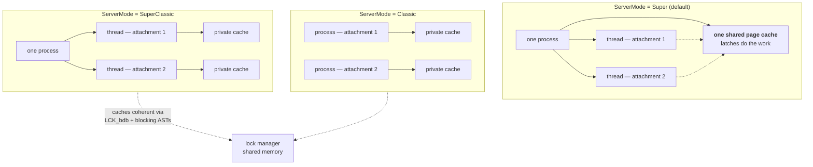

# Threading and Synchronization

Twenty-one documents in this collection mention threads — the [GC thread](garbage-collection-and-sweep.md), the [sweep thread](garbage-collection-and-sweep.md), the [service thread](services-api.md), the [event watcher thread](firebird-events.md), the [lock manager's blocking-action thread](lock-manager.md), [SuperServer's per-attachment threads](deployment-and-operations.md), [parallel workers](parallel-workers.md). Each document meets one thread, explains what it does, and moves on.

And there is a second, quieter gap. Nearly every code excerpt quoted anywhere in this collection begins the same way:

```c
void CCH_flush_ast(thread_db* tdbb)
CompilerScratch* PAR_parse(thread_db* tdbb, const UCHAR* blr, ...)
void Service::cancel(thread_db* tdbb)
```

`thread_db* tdbb` is the first parameter of what feels like half the engine, appears in five documents' worth of quoted code, and has never once been explained. It is the single most common identifier in the Firebird source, and a reader of this collection has been silently stepping over it for thirty-five documents.

This document covers both: the **thread topology** (what threads exist and why, and how one binary runs as either processes or threads), and the **thread context** (`tdbb` — what a thread carries with it, including a cooperative-scheduling counter that most readers will not expect to find). It closes with the synchronization ladder that arbitrates between them, completing a picture the [page-cache coherency](page-cache-coherency.md) and [lock manager](lock-manager.md) documents each saw half of.

Grounded in [`src/jrd/tdbb.h`](https://github.com/FirebirdSQL/firebird/blob/master/src/jrd/tdbb.h), [`src/common/ThreadData.h`](https://github.com/FirebirdSQL/firebird/blob/master/src/common/ThreadData.h), [`src/common/classes/SyncObject.h`](https://github.com/FirebirdSQL/firebird/blob/master/src/common/classes/SyncObject.h) and [`src/common/ThreadStart.cpp`](https://github.com/FirebirdSQL/firebird/blob/master/src/common/ThreadStart.cpp), and measured live against a running server.

**Table of Contents**

* [The topology is a configuration setting](#the-topology-is-a-configuration-setting)
* [tdbb: the thread's view of the engine](#tdbb-the-threads-view-of-the-engine)
* [Contexts nest](#contexts-nest)
* [Cooperative scheduling](#cooperative-scheduling)
* [The synchronization ladder](#the-synchronization-ladder)
* [Latches and locks, precisely](#latches-and-locks-precisely)
* [A census of engine threads](#a-census-of-engine-threads)
* [Threads in action (validated)](#threads-in-action-validated)
* [Comparison: PostgreSQL, MySQL, SQLite](#comparison-postgresql-mysql-sqlite)
* [Discussion](#discussion)
* [Further research](#further-research)

## The topology is a configuration setting

Most engines make the process-versus-thread decision once, architecturally. PostgreSQL forks a backend per connection. MySQL runs a thread per connection. Both are structural facts you cannot configure away.

Firebird's is a line in `firebird.conf`. The [deployment document](deployment-and-operations.md) covers `ServerMode` operationally; here is what it means to the code:



_Figure 1: One binary, three topologies — and only the shared-cache case avoids the lock manager for coherency_

The consequence developed in the [coherency document](page-cache-coherency.md) is that **SuperServer is the degenerate case**. With one shared cache, coordination is purely in-process latching and the [lock manager](lock-manager.md) never arbitrates page access. In SuperClassic and Classic, every cached page needs an `LCK_bdb` lock. Same `cch.cpp`, wildly different traffic.

That the same source supports all three is possible only because the engine never assumes it owns the address space. Everything shared between attachments is reached either through a latch (if same-process) or through the lock manager (if possibly not) — and the code path is chosen by which primitive the data structure uses, not by conditional compilation.

## tdbb: the thread's view of the engine

`thread_db` ([`src/jrd/tdbb.h`](https://github.com/FirebirdSQL/firebird/blob/master/src/jrd/tdbb.h)) is the per-thread engine context. Its private members are, essentially, "where am I":

```c
class thread_db final : public Firebird::ThreadData
{
	static constexpr int QUANTUM		= 100;	// Default quantum
	static constexpr int SWEEP_QUANTUM	= 10;	// Make sweeps less disruptive

private:
	MemoryPool*	defaultPool;
	Database*	database;
	Attachment*	attachment;
	jrd_tra*	transaction;
	Request*	request;
	RuntimeStatistics *reqStat, *traStat, *attStat, *dbbStat;

public:
	FbStatusVector*	tdbb_status_vector;
	SLONG		tdbb_quantum;		// Cycles remaining until voluntary schedule
	ULONG		tdbb_flags;
	...
	// BDB's held by thread
	Firebird::HalfStaticArray<BufferDesc*, 16> tdbb_bdbs;
	Firebird::ThreadSync* tdbb_thread;
```

This one struct explains why `tdbb` is threaded through every function signature. It carries:

- **The object stack** — database, attachment, transaction, request. Rather than passing four parameters everywhere, the engine passes one context that knows all four. A function deep in the storage layer can ask "which transaction am I serving?" without the call chain having handed it down.
- **The memory pool.** `defaultPool` is why allocation inside the engine is implicitly per-context; `PAR_parse`'s `MemoryPool& pool = *tdbb->getDefaultPool()` from the [BLR document](blr-intermediate-language.md) is the pattern everywhere. What that pool *is* — a node in a hierarchy that mirrors the object tree, freed in bulk rather than per object, and swapped by the RAII `ContextPoolHolder` this field cooperates with — is the subject of [memory management](memory-management.md).
- **Statistics at four levels simultaneously** — `reqStat`, `traStat`, `attStat`, `dbbStat`. Every counted operation increments all four, which is how [`MON$` tables](monitoring-and-tuning.md) can report I/O per request *and* per transaction *and* per attachment *and* per database without separate accounting passes.
- **The status vector** — thread-local error state, which is why the engine can use a C-style status vector without it being a global.
- **`tdbb_bdbs`** — the buffers this thread currently holds latched. The destructor asserts, in debug builds, that it is empty:

```c
~thread_db()
{
	resetStack();
#ifdef DEV_BUILD
	for (FB_SIZE_T n = 0; n < tdbb_bdbs.getCount(); ++n)
	{
		fb_assert(tdbb_bdbs[n] == NULL);
	}
#endif
}
```

That assertion is a **latch-leak detector**. A thread that exits still holding a page latch would deadlock the database; the debug build refuses to let that pass silently.

## Contexts nest

`thread_db` derives from `Firebird::ThreadData` ([`ThreadData.h`](https://github.com/FirebirdSQL/firebird/blob/master/src/common/ThreadData.h)), and the base class is more interesting than it looks:

```c
class ThreadData
{
public:
	enum ThreadDataType {
		tddGBL = 1,		// used by backup/restore
		tddDBB = 2,		// used in engine
		tddDBA = 3,		// used in gstat utility
		tddALICE = 4,	// used by gfix
		tddSEC = 5		// used by gsec
	};

private:
	ThreadData*		threadDataPriorContext;
	ThreadDataType	threadDataType;

public:
	static ThreadData*	getSpecific();
	void			putSpecific();
	static void		restoreSpecific();
};
```

Two things stand out.

**Contexts form a stack, not a slot.** `threadDataPriorContext` plus `putSpecific`/`restoreSpecific` means a thread can push a new context and later pop back. This is what makes re-entrancy work: an [AST firing on a thread](lock-manager.md) that is already inside the engine, a [trigger invoking nested requests](psql-and-stored-procedures.md), or an [autonomous transaction](transactions-and-concurrency.md) can each establish their own context without destroying the caller's.

**The utilities share the mechanism.** `tddGBL` is gbak, `tddDBA` is gstat, `tddALICE` is gfix, `tddSEC` is gsec. The [Services API document](services-api.md) showed that these utilities run *inside the server process* when invoked as services — and this enum is the other half of that story. Each utility has its own thread-context type occupying the same thread-local slot, so `BURP_main` running on a service thread gets its context exactly as it would running standalone. One thread-local mechanism, five kinds of occupant.

`SET_TDBB` — an inline function despite the shouting name ([`jrd.h`](https://github.com/FirebirdSQL/firebird/blob/master/src/jrd/jrd.h) : 306, `inline void SET_TDBB(Jrd::thread_db*& tdbb)`) — is the retrieval side, appearing at the top of engine functions to recover the current context from thread-local storage when one was not passed in. Its uppercase spelling is a fossil of the era when it was a macro, and a reliable marker of very old code.

## Cooperative scheduling

The two constants at the top of `thread_db` are easy to miss and say something surprising:

```c
static constexpr int QUANTUM		= 100;	// Default quantum
static constexpr int SWEEP_QUANTUM	= 10;	// Make sweeps less disruptive
...
SLONG		tdbb_quantum;		// Cycles remaining until voluntary schedule
```

Firebird does not rely solely on the OS scheduler. The engine decrements `tdbb_quantum` as it works and **voluntarily yields** when it reaches zero — cooperative scheduling points inside a preemptively-scheduled process.

The comment on `SWEEP_QUANTUM` is the tell. A [sweep](garbage-collection-and-sweep.md) is a long, low-priority scan that would otherwise monopolise its slice; giving it a quantum of 10 instead of 100 makes it yield ten times more often, so interactive work interleaves better. This is the mechanism behind the claim, made in the GC document, that background maintenance is designed not to disrupt foreground work — it is not merely a matter of thread priority, but of the engine choosing to step aside more often when it knows the work is background.

## The synchronization ladder

Firebird has its own synchronization primitives rather than using platform ones directly, layered roughly by cost:

| Primitive | Header | Use |
|---|---|---|
| `Spinlock` | `Spinlock.h` | very short critical sections, no blocking |
| `Mutex` | `locks.h` | ordinary mutual exclusion |
| `SyncObject` | `SyncObject.h` | **reader-writer latch** — the engine's workhorse |
| `RWLock` | `rwlock.h` | reader-writer lock with its own guards |
| `XThreadMutex` | `XThreadMutex.h` | cross-thread mutex for specialised cases |

`SyncObject` is the one worth reading, because it is what the [page cache](page-cache-coherency.md) uses for `bdb_syncPage` and `bdb_syncIO`:

```c
class SyncObject : public Reasons
{
	...
	bool lock(Sync* sync, SyncType type, const char* from, int timeOut);
	bool lockConditional(SyncType type, const char* from);
	void unlock(Sync* sync, SyncType type);
	...
private:
	AtomicCounter lockState;
	ThreadSync* volatile exclusiveThread;
	ThreadSync* volatile waitingThreads;
};
```

The whole state is one `AtomicCounter`: **positive means that many shared readers, `-1` means one exclusive writer, zero means free.** Uncontended acquisition is a single atomic operation; only contention touches `waitingThreads`, a linked list of blocked `ThreadSync` objects that get woken directly.

Two details reflect hard-won experience. `lockConditional` is a try-lock, which the cache uses to avoid blocking on a busy buffer — the [`BDB_blocking` deferral](page-cache-coherency.md) in `down_grade` exists because the AST path takes this route rather than waiting. And `SyncObject` inherits from `Reasons`, which records *why* a latch was taken (`const char* from`, supplied by the `FB_FUNCTION` macro at every call site) — deadlock debugging infrastructure baked into the primitive.

The RAII guards — `SyncLockGuard`, `SyncUnlockGuard`, `ReadLockGuard`, `WriteLockGuard` — are how these appear in practice. `SyncUnlockGuard` is the inverse-RAII pattern already met as `LockTableCheckout` in the [lock manager](lock-manager.md): release a held lock for the duration of a scope, then retake it.

## Latches and locks, precisely

The [coherency document](page-cache-coherency.md) introduced the two-level design; with the primitives in hand it can be stated exactly:

| | **Latch** (`SyncObject`) | **Lock** (lock manager) |
|---|---|---|
| Scope | one process | all processes on the machine |
| State lives in | process memory, one `AtomicCounter` | shared-memory arena (`fb_lock_*`) |
| Cost, uncontended | one atomic operation | hash lookup under a shared-memory mutex |
| Blocking notification | direct thread wakeup | [blocking AST](lock-manager.md), possibly cross-process |
| Held for | microseconds — one page operation | as long as the page is cached |
| Deadlock handling | avoided by discipline and try-locks | [periodic wait-for-graph scan](lock-manager.md) |

The rule the engine follows: **latches protect the in-memory representation, locks protect the right to have that representation at all.** A thread latches a `BufferDesc` to read its bytes safely against other threads in its process; the process holds an `LCK_bdb` lock to know its copy of that page is still valid at all. Under SuperServer only the first layer does real work — which is precisely why Super is the throughput default and Classic the isolation choice.

## A census of engine threads

Beyond one thread per attachment, the engine runs a set of long-lived workers. Gathered from `Thread::start` call sites and the subsystem documents:

Most are not started by a bare `Thread::start`. The prevailing idiom declares the thread as a *member* of the subsystem that owns it, bound at construction to its routine and priority, and started later with `.run(arg)`:

```c
// src/jrd/cch.h:84 — the cache writer belongs to the BufferControl
bcb_writer_fini(p, cache_writer, THREAD_medium),

// src/jrd/Database.cpp:870 — the collector belongs to the Database
dbb_gc_fini(*p, garbage_collector, THREAD_medium),

// src/lock/lock.cpp:173 — the AST deliverer belongs to the LockManager
m_cleanupSync(getPool(), blocking_action_thread, THREAD_high),
```

The wrapper (`ThreadFinishSync` and friends) owns startup, joining via `waitForCompletion()`, and cleanup — so a subsystem's thread has the same lifetime as the subsystem, by construction rather than by discipline.

| Thread | Declared in | Priority | Purpose |
|---|---|---|---|
| Attachment threads | remote server | — | one per connected attachment (Super/SuperClassic) |
| **Cache writer** | `cch.h` : 84, run at `cch.cpp` : 1676 | `THREAD_medium` | writes dirty pages in the background ([careful writes](careful-writes-and-crash-safety.md)) |
| **Garbage collector** | `Database.cpp` : 870 | `THREAD_medium` | background version cleanup ([GC document](garbage-collection-and-sweep.md)) |
| **Sweep** | `tra.cpp` : 2830 (`SweepSync`) | — | full-database sweep, runs with `SWEEP_QUANTUM` |
| **Blocking action** | `lock.cpp` : 173 | `THREAD_high` | delivers [blocking ASTs](lock-manager.md) arriving from other processes |
| **Event watcher** | `event.cpp` : 84 | `THREAD_medium` | fires [event callbacks](firebird-events.md) to clients |
| **Mapping delivery** | `Mapping.cpp` : 648 | `THREAD_high` | propagates [authentication mapping](security-architecture.md) changes |
| **Profiler watcher** | `ProfilerManager.cpp` : 734 | `THREAD_medium` | the [profiler](monitoring-and-tuning.md) listener |
| **Crypt** | `CryptoManager.cpp` : 986 | `THREAD_medium` | background database [encryption](security-architecture.md) |
| **Service** | `svc.cpp` : 2121 | `THREAD_medium` | one per running [service request](services-api.md) |
| **Shutdown** | `jrd.cpp` : 4704, 9853 | `THREAD_medium` / `THREAD_high` | orderly and forced shutdown paths |
| **Parallel workers** | `Task.cpp` : 45 | `THREAD_medium` | `Coordinator`/`WorkerThread` pool behind `ParallelWorkers` |

Three priorities exist — `THREAD_high`, `THREAD_medium`, `THREAD_low` — and only two threads claim `THREAD_high` in normal operation. Both are on someone *else's* critical path: the blocking-action thread holds up another process's lock request, and mapping delivery holds up authentication elsewhere. Everything routine, including the sweep and the collector, sits at medium and relies on `tdbb_quantum` rather than priority to stay out of the way.

`Task.cpp`'s `Coordinator`/`WorkerThread` pair is the newest addition — the general parallel-work framework behind FB5's parallel backup, sweep and index creation, and the `ParallelWorkers`/`MaxParallelWorkers` settings from the [tuning document](monitoring-and-tuning.md).

## Threads in action (validated)

Measured against the live Firebird 6 SuperServer. The engine process is the **child** of `fbguard`, not `firebird.service`'s `MainPID` — a trap the [sorting document](sorting-and-temp-space.md) also hit, so `pgrep -x firebird` is the reliable way to find it.

**Thread count tracks attachments.** Counting `/proc/<pid>/task`:

```
baseline (no user attachments):   4 threads
with 5 concurrent attachments:   12 threads
after all 5 disconnect:          10 threads
after a further 20s idle:        10 threads
```

Two findings. The rise from 4 to 12 is SuperServer's thread-per-attachment model, visible directly. More interesting is that it settles at **10, not back to 4, and stays there** — threads are **pooled and retained**, not created and destroyed per connection. That is the mechanism behind the [connection-pooling document](connection-pooling.md)'s claim that connections are cheap under SuperServer: the expensive part (thread creation) is amortised away by reuse.

**The background workers are visible from SQL.** They appear in `MON$ATTACHMENTS` as system attachments with human-readable names and no remote process:

```sql
SELECT MON$ATTACHMENT_ID, MON$SYSTEM_FLAG, TRIM(MON$USER),
       TRIM(COALESCE(MON$REMOTE_PROCESS,'<internal>'))
  FROM MON$ATTACHMENTS ORDER BY 1;
```

```
   ID  SYS  USR                  PROC
  176    0  SYSDBA               /opt/firebird/bin/isql
  177    1  Cache Writer         <internal>
  178    1  Garbage Collector    <internal>
```

Two entries from the census above — the cache writer and the garbage collector — with `MON$SYSTEM_FLAG = 1` marking them as engine-internal. The background machinery those documents describe is not hidden: it holds real attachments and can be inspected like any other.

**Threads are not individually named.** Every entry in `/proc/<pid>/task/*/comm` reads `firebird`; the engine does not call `prctl(PR_SET_NAME)`. Identifying which thread is the garbage collector requires `MON$ATTACHMENTS` (for those with attachments) or a debugger — a small observability gap worth knowing before trying to diagnose a busy server from `top -H`.

## Comparison: PostgreSQL, MySQL, SQLite

| | **Firebird** | **PostgreSQL** | **MySQL** | **SQLite** |
|---|---|---|---|---|
| Unit of concurrency | **configurable** — thread or process, by `ServerMode` | process per connection (forked by postmaster) | thread per connection | none of its own — uses the caller's thread |
| Chosen when | **deployment time**, one binary | architecturally fixed | architecturally fixed | compile/runtime threading mode |
| Shared state | shared cache (Super) or lock manager (Classic) | shared memory segment | process memory | the database file |
| In-process primitive | `SyncObject` RW latch, `Mutex`, `Spinlock` | LWLocks, spinlocks | mutexes, rw-locks, InnoDB latches | optional mutexes (`SQLITE_THREADSAFE`) |
| Cross-process primitive | **the lock manager (a full DLM)** | shared-memory lock manager | n/a — single process | OS file locks |
| Per-worker context | `thread_db` (`tdbb`), thread-local, nesting | globals per backend process | THD object | `sqlite3` connection handle |
| Background workers | cache writer, GC, sweep, crypt, AST, parallel | autovacuum, bgwriter, checkpointer, WAL writer | purge, page cleaner, IO threads | none |

The structural observation: **PostgreSQL gets `tdbb` for free.** Because each backend is its own process, "the current attachment" can be a global variable — process isolation does the work a thread context has to do explicitly. MySQL, being threaded, needs its `THD` object for exactly the same reason Firebird needs `thread_db`.

Firebird's distinctive position is that it must support *both* worlds from one codebase. That is why the context is an explicit parameter rather than a thread-local global consulted implicitly: passing `tdbb` makes the dependency visible and makes the same function correct whether it runs as one of many threads or as the only thread in a process. The verbosity of `thread_db* tdbb` in every signature is the price of `ServerMode` being a configuration line.

Note also that everyone converges on background workers. Firebird's cache writer and PostgreSQL's bgwriter, Firebird's sweep and PostgreSQL's autovacuum, Firebird's GC thread and InnoDB's purge threads — different storage architectures, same recognition that deferred maintenance needs its own execution context.

## Discussion

The threading model is where Firebird's oldest design commitment shows its cost and its payoff most clearly. The commitment is that **the engine may not assume it owns the address space.** Everything follows: the explicit `tdbb` parameter, the two-level latch/lock split, the fact that `cch.cpp` works unchanged whether its cache is shared by threads or private to a process.

The payoff is real optionality. A deployment can choose thread-per-attachment with a shared cache for throughput, or process-per-attachment for isolation and crash containment, by editing one configuration line — and get [embedded operation](embedded-architecture-comparison.md) from the same library as a bonus, because an embedded attachment is just another process the lock manager already knows how to arbitrate with. No other engine here offers that choice.

The cost is pervasive verbosity and a permanent discipline burden. Every engine function carries a context parameter. Every shared structure must be classified as latch-protected or lock-protected, and getting it wrong produces bugs that appear only in one `ServerMode`. The `tdbb_bdbs` debug assertion exists because latch leaks are a real enough failure mode to warrant a dedicated detector.

The cooperative `tdbb_quantum` is the detail that most rewards attention, because it is a piece of 1980s thinking that turned out to age well. In an era of reliable preemptive schedulers it looks redundant — until you notice that what it actually expresses is *priority the OS cannot infer*. The operating system cannot know that this thread is a sweep and that one is a user query; `SWEEP_QUANTUM = 10` encodes that knowledge where it is available. The same instinct appears throughout this collection: [`GCPolicy`](garbage-collection-and-sweep.md) choosing who pays for cleanup, [careful-write precedence](careful-writes-and-crash-safety.md) encoding ordering knowledge the filesystem lacks. Firebird consistently prefers to tell the system what it knows rather than hope the system guesses well.

## Hands-on: samples, tests and debugging

### C++ sample — [`samples/cpp/threading.cpp`](samples/cpp/threading.cpp)

The [validated section's](#threads-in-action-validated) measurements as a repeatable program. `MON$SERVER_PID` names the engine process from SQL; `/proc/<pid>/task` counts its threads from the client (same host); twelve `std::thread`s each open their own attachment and hold it for two seconds. The sample then lists `MON$ATTACHMENTS` to show the [census's](#a-census-of-engine-threads) background workers as system attachments.

```sh
cmake -B build samples && cmake --build build
./build/threading        # default: inet://localhost//tmp/fbhandson/threading.fdb
```

Verified output:

```text
engine process: pid 215035, 16 threads (1 attachment open)
with 12 extra attachments: 24 threads | 13 user attachments, 1 distinct server pid
after they detach:        22 threads (pooled, not destroyed)
MON$ATTACHMENT_ID MON$SYSTEM_FLAG TRIM              COALESCE
----------------- --------------- ----------------- ------------------------
17                0               SYSDBA            /tmp/fbhandson/threading
18                1               Cache Writer      <internal>
19                1               Garbage Collector <internal>
```

Three claims of this document in three lines: `1 distinct server pid` across thirteen attachments is `ServerMode = Super`'s one-process topology; 16 → 24 threads under load and **22 remaining after detach** is the thread *pool* retaining workers (the [connection-pooling](connection-pooling.md) argument, measured); and the `MON$SYSTEM_FLAG = 1` rows are the Cache Writer and Garbage Collector from the census holding real, queryable attachments. (On a warm server the baseline is higher than the doc's fresh-boot `4` — earlier samples' threads are still pooled; the *delta* is the signal.)

### fb-cpp sample — [`samples/fb-cpp/threading.cpp`](samples/fb-cpp/threading.cpp)

The same measurement through [fb-cpp](https://github.com/asfernandes/fb-cpp) (vendored at [`extern/fb-cpp`](extern/fb-cpp)), the modern C++20 wrapper over the OO API. Each of the twelve client threads builds its own `Client` + `Attachment` — four RAII objects per thread replacing the OO-API version's manual dispatcher/DPB/status lifecycle — and the one-value monitoring queries become `att.queryScalar<std::int64_t>(...)` returning `std::optional`. The isql-style `MON$ATTACHMENTS` table is printed generically: column names come from `getOutputDescriptors()`, every value from `getString(i)`.

```sh
cmake -B build samples && cmake --build build   # needs libboost-dev + libboost-filesystem-dev
./build/fbcpp_threading
```

Verified: 8 threads with one attachment open, 19 with the twelve extras (`13 user attachments, 1 distinct server pid`), and still 19 one second after they detach — this run kept *all* new workers pooled, an even starker retention than the OO-API run's 24 → 22; the final table shows both the `Cache Writer` and the `Garbage Collector` as `MON$SYSTEM_FLAG = 1` attachments alongside the sample's own SYSDBA row. (The first cut of the table printer called `fetchNext()` straight after `execute()` and silently dropped the first row — `Statement::execute()` already fetches it, an fb-cpp idiom the [page-cache twin](page-cache-coherency.md#fb-cpp-sample--samplesfb-cpppage_cachecpp) tripped over too.)

### JavaScript sample — [`samples/nodejs/threading.js`](samples/nodejs/threading.js)

The same measurement from node (`cd samples/nodejs && node threading.js`), with an instructive inversion: node opens its twelve concurrent attachments from **one** event-loop thread — all the concurrency in the experiment is server-side. Run immediately after the C++ sample it also completes the pooling story:

```text
engine process: pid 215035, 22 threads (1 attachment open)
with 12 extra attachments: 22 threads | 13 user attachments, 1 distinct server pid
after they detach:        22 threads (pooled)
```

Twelve new attachments, **zero** new threads — the pool left behind by the C++ run absorbed all of them. Thread creation is a first-connection cost, not a per-connection cost.

### Things to try

- Raise the worker count above the pool size (e.g. 40) and watch the thread count climb by exactly the shortfall.
- Run `top -H -p <server pid>` during the run: every thread is named `firebird` — the [observability gap](#threads-in-action-validated) about missing `prctl(PR_SET_NAME)` calls, live.
- Point the samples at the SuperClassic embedded sandbox from the [page-cache sample](page-cache-coherency.md#hands-on-samples-tests-and-debugging) (`FIREBIRD=/tmp/fbhandson/fbemb`, local path): the topology question disappears — each attachment is its own engine in *your* process.
- Query `MON$ATTACHMENTS` while a `gfix -sweep` runs against a scratch database: the sweeper appears as another system attachment.

### Debugging this in C++ (gdb)

Attach to an embedded run ([debugging guide](debugging-firebird.md)) and the topology machinery is directly observable:

```gdb
break Thread::start              # common/ThreadStart.cpp:285 (POSIX) — every engine thread is born here
break BufferControl::cache_writer      # jrd/cch.cpp:3017  — the census's cache writer body
break Database::garbage_collector      # jrd/vio.cpp:5699  — the GC thread body
break LockManager::blocking_action_thread  # lock/lock.cpp:1445 — the THREAD_high AST deliverer
break thread_db::reschedule      # jrd/jrd.cpp:9409 — the cooperative yield point
break SyncObject::lock           # common/classes/SyncObject.cpp:44 — the workhorse latch
```

`Thread::start`'s backtraces reproduce the [census table](#a-census-of-engine-threads) empirically — each hit's caller is a subsystem constructing its member thread. In `thread_db::reschedule`, `tdbb_quantum` has just run down to zero; the function re-arms it to `QUANTUM` or, if `tdbb_flags & TDBB_sweeper`, to `SWEEP_QUANTUM` — [cooperative scheduling](#cooperative-scheduling)'s two constants chosen live. `SyncObject::lock` is high-traffic (use it with a condition or briefly); its `from` argument carries the `FB_FUNCTION` string naming who wants the latch — the `Reasons` diagnostic baked into the primitive, readable straight off the stack.

## Further research

* [`src/jrd/tdbb.h`](https://github.com/FirebirdSQL/firebird/blob/master/src/jrd/tdbb.h) — `thread_db` in full, including the quantum constants and the debug latch-leak assertion.
* [`src/common/ThreadData.h`](https://github.com/FirebirdSQL/firebird/blob/master/src/common/ThreadData.h) — the nesting context stack and the five `ThreadDataType` occupants.
* [`src/common/classes/SyncObject.h`](https://github.com/FirebirdSQL/firebird/blob/master/src/common/classes/SyncObject.h) — the reader-writer latch; read `lockState`'s encoding and `lockConditional` against the cache's use of them.
* [`src/common/classes/locks.h`](https://github.com/FirebirdSQL/firebird/blob/master/src/common/classes/locks.h), [`rwlock.h`](https://github.com/FirebirdSQL/firebird/blob/master/src/common/classes/rwlock.h), `Spinlock.h` — the rest of the ladder.
* [`src/common/ThreadStart.cpp`](https://github.com/FirebirdSQL/firebird/blob/master/src/common/ThreadStart.cpp) — `Thread::start` and the priority mapping; grep for its call sites to regenerate the census.
* [`src/common/Task.cpp`](https://github.com/FirebirdSQL/firebird/blob/master/src/common/Task.cpp) — `Coordinator` and `WorkerThread`, the parallel-work framework.
* Companion docs: [page-cache coherency](page-cache-coherency.md) (latches vs locks in anger) · [lock manager](lock-manager.md) (the cross-process half) · [deployment](deployment-and-operations.md) (`ServerMode` operationally) · [garbage collection and sweep](garbage-collection-and-sweep.md) (the quantum's purpose) · [services API](services-api.md) (why the utilities have thread-context types) · [connection pooling](connection-pooling.md) (what thread reuse buys).
