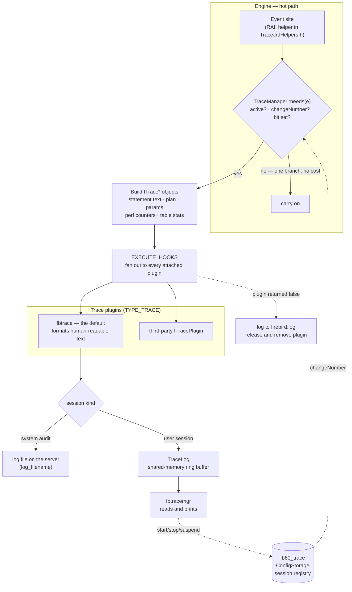
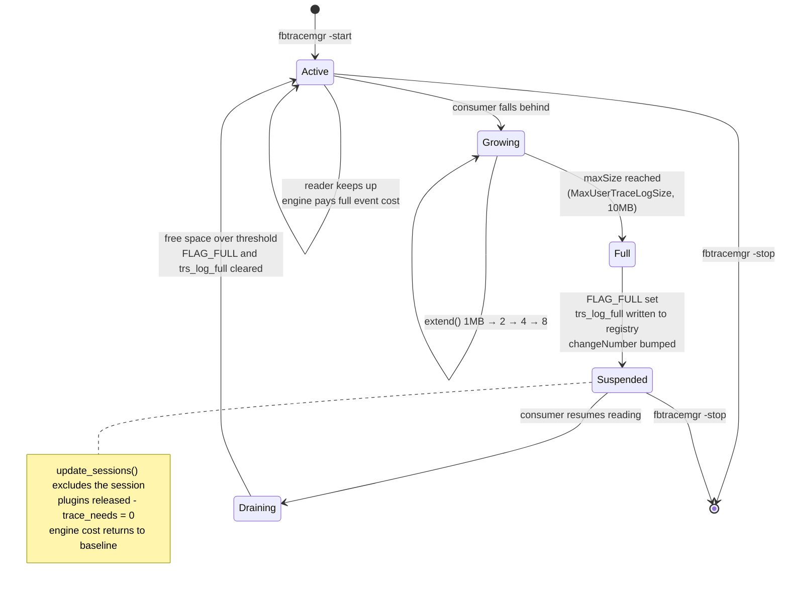

# Trace and Audit — the engine's event stream, and the discipline of watching without interfering

*A companion to [Conceptual Architecture of Firebird](README.md). Grounded in the vendored [`extern/firebird`](extern/firebird) source (Firebird 6, `master`) and verified against a live Firebird 6 server.*

---

## Table of contents

* [Why trace deserves its own document](#why-trace-deserves-its-own-document)
* [Snapshot versus stream](#snapshot-versus-stream)
* [The dispatch path: how an event reaches a plugin](#the-dispatch-path-how-an-event-reaches-a-plugin)
* [The event taxonomy](#the-event-taxonomy)
* [Where sessions live: the shared-memory registry](#where-sessions-live-the-shared-memory-registry)
* [The log, and what happens when nobody reads it](#the-log-and-what-happens-when-nobody-reads-it)
* [Two authorization questions](#two-authorization-questions)
* [Trace is a plugin, and a plugin that misbehaves is ejected](#trace-is-a-plugin-and-a-plugin-that-misbehaves-is-ejected)
* [Live demonstrations](#live-demonstrations)
* [Comparison: PostgreSQL, MySQL, SQLite](#comparison-postgresql-mysql-sqlite)
* [Further reading](#further-reading)

---

## Why trace deserves its own document

Trace is the most frequently *mentioned* subsystem in this collection that has never been its own subject. It turns up in the [services](services-api.md) document (service starts fire trace events), in [extensibility](extensibility.md) (trace is one of the ten plugin types), in [deployment](deployment-and-operations.md) (`fbtrace.conf` is one of the five configuration files), in [security](security-architecture.md) (audit sessions), in [events](firebird-events.md), in [catalog bootstrap](catalog-bootstrap.md), and in [monitoring and tuning](monitoring-and-tuning.md) — where it gets a single bullet point. Twenty-one of the thirty-six companions name it; none explains it.

That is the same gap shape that motivated the [lock manager](lock-manager.md) and [BLR](blr-intermediate-language.md) documents: a subsystem the collection leans on constantly and has never opened.

It is also worth opening on its own merits, because trace is where Firebird had to answer a question every database eventually faces and few answer cleanly: **how do you let someone watch the engine in detail without letting the watching become a liability?** An observation channel that can slow the server down, or stall it, or crash it when the observer misbehaves, is not an observability feature — it is an outage waiting for a busy afternoon. Firebird's answer is unusually explicit in the code, and the whole design can be read as a sequence of refusals to let the observer matter.

---

## Snapshot versus stream

Firebird gives you two ways to see inside a running engine, and they are complements rather than alternatives.

The [`MON$` tables](monitoring-and-tuning.md) are a **snapshot**: a consistent point-in-time picture of every attachment, transaction, statement and call frame, materialized per transaction. They answer *what is happening right now, coherently* — and they answer it in SQL, from any client, with no configuration.

Trace is a **stream**: an ordered sequence of events, each carrying the statement text, the plan, the parameters, the timings and the per-table record counters, delivered as they happen. It answers *what has been happening, in what order, and what did it cost* — which is the question you actually have when a nightly job got slow and the evidence is long gone.

Neither substitutes for the other. `MON$` cannot tell you about a statement that already finished; trace cannot tell you the coherent global state at an instant. The rest of this document is about the stream.

---

## The dispatch path: how an event reaches a plugin

Every traceable moment in the engine looks roughly the same: ask whether anyone is listening, and only if so do the expensive work of describing what happened.

The asking is [`TraceManager::needs()`](extern/firebird/src/jrd/trace/TraceManager.h#L135), and it is deliberately tiny:

```cpp
inline bool needs(unsigned e)
{
    if (!active)
        return false;

    if (changeNumber != getStorage()->getChangeNumber())
        update_sessions();

    return trace_needs & (FB_CONST64(1) << e);
}
```

Three steps, in increasing order of cost. A flag test rejects attachments that are not yet authenticated. A single integer comparison against the shared-memory registry's change counter detects whether the *set of sessions* has changed since this attachment last looked — this is the entire cache-invalidation protocol, and in the common case it is one load and one compare. Only then does a bit test against `trace_needs` — a 64-bit mask that is the **union of every event every active plugin asked for** — decide whether this particular event matters.

The consequence is that on a server with no trace sessions, a traceable event site costs a predictable-branch flag test. That is what makes it acceptable to put these sites on the hottest paths in the engine.

The event sites themselves are mostly RAII objects in [`TraceJrdHelpers.h`](extern/firebird/src/jrd/trace/TraceJrdHelpers.h) and [`TraceDSQLHelpers.h`](extern/firebird/src/jrd/trace/TraceDSQLHelpers.h) — `TraceProcExecute`, `TraceTrigExecute`, `TraceBlrCompile`, `TraceFuncExecute` and their siblings. Each captures `m_need_trace` in its constructor and fires the event from its destructor, so the timing measurement, the statistics snapshot and the delivery all attach to a scope rather than to scattered call sites, and all of it is skipped when nobody is listening.

When an event does fire, `TraceManager` fans it out to every plugin attached to this attachment through one macro, [`EXECUTE_HOOKS`](extern/firebird/src/jrd/trace/TraceManager.cpp#L412):

```cpp
#define EXECUTE_HOOKS(METHOD, PARAMS) \
    FB_SIZE_T i = 0; \
    while (i < trace_sessions.getCount()) \
    { \
        SessionInfo* plug_info = &trace_sessions[i]; \
        if (check_result(plug_info->plugin, plug_info->pluginName, #METHOD, \
            plug_info->plugin->METHOD PARAMS)) \
        { \
            i++; /* Move to next plugin */ \
        } \
        else { \
            plug_info->release(); \
            trace_sessions.remove(i); /* Remove broken plugin from the list */ \
        } \
    }
```

Note what happens on failure, because it recurs throughout this subsystem: the plugin is not retried, and the error is not propagated to the statement that happened to be executing. It is logged and the plugin is **removed from the list**. More on that below.



*Figure 1: The trace dispatch path. The `needs()` gate is the load-bearing element — everything expensive sits behind it, and the session registry reaches back into that gate through a single change counter.*

---

## The event taxonomy

The traceable events are enumerated as constants on `ITraceFactory` in [`IdlFbInterfaces.h`](extern/firebird/src/include/firebird/IdlFbInterfaces.h#L6790), and the list is worth reading in full because its *ordering* is informative:

| # | Event | # | Event |
|---|---|---|---|
| 0 | `ATTACH` | 12 | `DYN_EXECUTE` |
| 1 | `DETACH` | 13 | `SERVICE_ATTACH` |
| 2 | `TRANSACTION_START` | 14 | `SERVICE_START` |
| 3 | `TRANSACTION_END` | 15 | `SERVICE_QUERY` |
| 4 | `SET_CONTEXT` | 16 | `SERVICE_DETACH` |
| 5 | `PROC_EXECUTE` | 17 | `ERROR` |
| 6 | `TRIGGER_EXECUTE` | 18 | `SWEEP` |
| 7 | `DSQL_PREPARE` | 19 | `FUNC_EXECUTE` |
| 8 | `DSQL_FREE` | 20 | `PROC_COMPILE` |
| 9 | `DSQL_EXECUTE` | 21 | `FUNC_COMPILE` |
| 10 | `BLR_COMPILE` | 22 | `TRIGGER_COMPILE` |
| 11 | `BLR_EXECUTE` | | `TRACE_EVENT_MAX = 23` |

The first nineteen are grouped sensibly — connection, transaction, routine execution, SQL statement lifecycle, [BLR](blr-intermediate-language.md) and DYN, services, errors, sweep. Then the ordering breaks: `FUNC_EXECUTE` at 19 sits apart from `PROC_EXECUTE` at 5, and the three `*_COMPILE` events land at 20–22 rather than beside their `*_EXECUTE` counterparts.

This is the **append-only durability** theme that [the reading guide](READING-GUIDE.md#ideas-that-recur-across-the-collection) draws out of `lck_t` series numbers, system relation ids and BLR opcodes, showing up once more. These numbers are bit positions in `ntrace_mask_t` — a `UINT64` that plugins compile against and that crosses the plugin ABI boundary. Renumbering `FUNC_EXECUTE` to sit next to `PROC_EXECUTE` would silently change the meaning of every previously compiled plugin's `trace_needs()` return value. So the taxonomy grows at the end and the tidy grouping is sacrificed. With 23 of 64 bits used, there is room to keep doing that for a long time.

---

## Where sessions live: the shared-memory registry

A trace session is not owned by the attachment that started it, and it is not owned by the process that starts it either. It is registered in [`ConfigStorage`](extern/firebird/src/jrd/trace/TraceConfigStorage.h#L88) — an `IpcObject` backed by a shared-memory region of type `SRAM_TRACE_CONFIG`, which appears on disk as `fb60_trace` in the lock directory.

This is a design forced by [ServerMode](threading-and-synchronization.md). Under `Super` an attachment is a thread and a global variable would do. Under `Classic` each attachment is its own process, and a trace session started through one process must be seen by all of them. So the session registry goes where everything else that must cross process boundaries in Firebird goes: a shared-memory arena, reached under a guard, exactly as the [lock table](lock-manager.md) and the [monitoring snapshot](monitoring-and-tuning.md) do.

Each session carries a small flag set from [`TraceSession.h`](extern/firebird/src/jrd/trace/TraceSession.h#L39):

```cpp
inline constexpr int trs_admin    = 0x0001;  // session created by server administrator
inline constexpr int trs_active   = 0x0002;  // session is active
inline constexpr int trs_system   = 0x0004;  // session created by engine itself
inline constexpr int trs_log_full = 0x0008;  // session trace log is full
```

`trs_system` marks the **audit** session — the one the engine starts for itself at startup when `AuditTraceConfigFile` is set in `firebird.conf`. Audit and user trace are the same machinery throughout; they differ in who starts them, who may see them, and where the output goes. That is why this document does not treat them as two subsystems.

[`update_sessions()`](extern/firebird/src/jrd/trace/TraceManager.cpp#L132) is the reconciliation routine that runs whenever the change counter moves. It walks the registry, keeps sessions it already knows, instantiates plugins for new ones, releases plugins for sessions that have gone — and then rebuilds `trace_needs` from scratch as the union of the surviving plugins' declared interests, falling back to a hard zero when no sessions remain:

```cpp
// nothing to trace, clear needs
if (trace_sessions.getCount() == 0)
{
    trace_needs = 0;
}
else
{
    trace_needs = new_needs;
}
```

One line in its session-scanning loop matters more than it looks:

```cpp
if ((session.ses_flags & trs_active) && !(session.ses_flags & trs_log_full))
```

A session whose log is full is treated exactly like a session that does not exist. That is the subject of the next section.

---

## The log, and what happens when nobody reads it

Output from a **user** trace session does not go to a file on the server. It goes into a [`TraceLog`](extern/firebird/src/jrd/trace/TraceLog.h) — a second shared-memory region, one per session, named `fb_trace.{GUID}` — which `fbtracemgr` reads from the other side and prints. It is a classic single-producer/single-consumer ring buffer with `readPos`, `writePos`, `allocated` and `maxSize`.

It starts at `INIT_LOG_SIZE = 1MB` and grows geometrically via [`extend()`](extern/firebird/src/jrd/trace/TraceLog.cpp#L217), remapping the shared file, up to `Config::getMaxUserTraceLogSize()` — **10 MB by default**, from [`config.h`](extern/firebird/src/common/config/config.h#L257).

Now the interesting question. A trace session with `print_plan` and `print_perf` enabled against a busy server can generate output far faster than a human-facing tool can print it. What happens when the consumer falls behind?

The obvious answer — block the producer until there is room — is the answer the [Services API](services-api.md) gives for its own output buffer, where a client that starts a verbose backup and stops reading will stall the backup. That is defensible there: the backup is an operation *you asked for*, and pausing it is better than losing its output.

Trace refuses that answer, and refuses it three times over in about forty lines.

First, [`TraceLog::write()`](extern/firebird/src/jrd/trace/TraceLog.cpp#L142) never waits. If the reader has gone entirely, it discards and reports success:

```cpp
// if reader already gone, don't write anything
if (header->flags & FLAG_DONE)
    return size;

if (header->flags & FLAG_FULL)
    return 0;
```

Second, when a write genuinely does not fit even after extending to `maxSize`, the log sets `FLAG_FULL`, replaces the caller's data with a short "log is full" notice so the eventual reader learns why the stream stops, and returns zero.

Third — and this is the part that closes the loop — [`TraceLogWriterImpl::write()`](extern/firebird/src/jrd/trace/TraceObjects.cpp#L518) reaches back into the shared session registry and *suspends the session*:

```cpp
FB_SIZE_T TraceLogWriterImpl::write(const void* buf, FB_SIZE_T size)
{
    const FB_SIZE_T written = m_log.write(buf, size);
    if (written == size)
        return size;

    if (!m_log.isFull())
        return written;

    ConfigStorage* storage = TraceManager::getStorage();
    StorageGuard guard(storage);

    TraceSession session(*getDefaultMemoryPool());
    session.ses_id = m_sesId;
    if (storage->getSession(session, ConfigStorage::FLAGS))
    {
        if (!(session.ses_flags & trs_log_full))
        {
            // suspend session
            session.ses_flags |= trs_log_full;
            storage->updateFlags(session);
        }
    }

    // report successful write
    return size;
}
```

Setting `trs_log_full` bumps the registry's change counter. Every attachment's next `needs()` call sees the mismatch, runs `update_sessions()`, finds this session excluded by the `!(session.ses_flags & trs_log_full)` test, releases its plugin, and — if it was the only session — sets `trace_needs` back to zero. **A stalled consumer does not slow the engine down; within one change-counter check it stops costing the engine anything at all.**

And then the closing comment: `// report successful write`. The function returns `size` — a lie, told deliberately, so that a full log never surfaces as an error to whatever statement was unlucky enough to be executing when the buffer filled.

Recovery is symmetric. When `fbtracemgr` drains enough that a quarter of the buffer is free (`FREE_SPACE_THRESHOLD = INIT_LOG_SIZE / 4`), [`read()`](extern/firebird/src/jrd/trace/TraceLog.cpp#L95) clears `FLAG_FULL`; [`TraceService.cpp`](extern/firebird/src/jrd/trace/TraceService.cpp#L313) then clears `trs_log_full` in the registry, the change counter moves again, and attachments re-attach their plugins.



*Figure 2: The life of a user trace session. The engine never blocks on the consumer — it sheds the session instead, and takes it back when the consumer recovers.*

The trade-off is stated honestly: **you can lose trace records.** Firebird decides that a gap in an observation stream is a smaller harm than a stall in the thing being observed. For an audit session, where losing records may be exactly the wrong trade, the output goes to a server-side file instead of a consumer's ring buffer, and the question does not arise in the same form.

---

## Two authorization questions

Trace shows you other people's SQL, with parameter values. It is a privileged channel, and the code asks two separate questions.

**Who may manage a session?** [`TraceSvcJrd::checkPrivileges()`](extern/firebird/src/jrd/trace/TraceService.cpp#L343) governs `-list`, `-stop`, `-suspend` and `-resume`. You may manage your own sessions; `SYSDBA` and the `RDB$ADMIN` role may manage anyone's. The code carries a frank admission that this is coarser than the rest of Firebird's authorization model:

```cpp
// TODO: add privileges for list\manage sessions and check it here
if (s_user == DBA_USER_NAME || t_role == ADMIN_ROLE || s_user == session.ses_user)
    return true;
```

**Whose attachments may a session observe?** This is enforced somewhere more interesting — in [`update_session()`](extern/firebird/src/jrd/trace/TraceManager.cpp#L207), at the moment a plugin would be instantiated for a given attachment:

```cpp
// if this session is not from administrator, it may trace connections
// only created by the same user, or when it has TRACE_ANY_ATTACHMENT
// privilege in current context
```

If the check fails, the function simply returns before creating the plugin. There is no filtering later, no per-event permission test, no plugin that receives events and discards them: the plugin **is never created** for attachments this session may not see, so those attachments never set the corresponding bits in their `trace_needs` and never pay a cost for a session that could not have used their data anyway. Authorization and performance land on the same mechanism.

`TRACE_ANY_ATTACHMENT` is one of the fine-grained system privileges from [`SystemPrivileges.h`](extern/firebird/src/jrd/SystemPrivileges.h#L47), grantable to a role exactly as described in the [security architecture](security-architecture.md#firebird-authorization) document — which is how you give a performance analyst the ability to trace an application's traffic without making them `SYSDBA`.

The live capture below shows why this matters: a `SYSDBA` session with a default configuration sees the authentication plugin's own query against the security database, parameter values included.

---

## Trace is a plugin, and a plugin that misbehaves is ejected

Trace is one of the ten plugin types listed in [extensibility](extensibility.md): `IPluginManager::TYPE_TRACE`, with `ITraceFactory` producing `ITracePlugin` instances. Firebird ships one implementation — `libfbtrace.so`, the human-readable formatter whose output appears throughout this document — and a session may name others via the `plugins:` field.

The interface is wide but shallow: `trace_attach`, `trace_detach`, `trace_transaction_start`, `trace_dsql_execute` and the rest, each receiving read-only `ITrace*` accessor objects (`ITraceDatabaseConnection`, `ITraceSQLStatement` with `getText()`/`getPlan()`/`getExplainedPlan()`/`getPerf()`, `ITraceTransaction`, `ITraceSweepInfo`). A plugin cannot change what the engine does; it can only be told about it. Each method returns a boolean, and `false` means "I failed."

What the engine does with that `false` is the design's last refusal. From `check_result()`:

```cpp
gds__log("Trace plugin %s returned error on call %s.\n\tError details: %s",
    module, function, errorStr);
return false;
```

The failure is written to `firebird.log` and `EXECUTE_HOOKS` drops the plugin from the list. The statement that triggered the event is untouched. A trace plugin that throws on every call does not take a database down with it — it disables itself, one call in, with an explanation in the log.

The same posture appears one level up, in configuration. A malformed trace configuration does not fail the session or the attachment; the error is reported per database and the attachment proceeds untraced. The live run below shows exactly that, because the first configuration used was wrong.

Taken together — non-blocking writes, self-suspending sessions, plugin ejection on error, configuration errors that do not propagate, and a `needs()` gate that costs a branch — the subsystem has a single consistent rule: **nothing about being observed may become a dependency of the observed.**

---

## Live demonstrations

All of the following was captured against the running Firebird 6 server (`inet://localhost/employee`).

### Starting a session materializes both shared-memory regions

With no trace sessions, the lock directory holds the usual lock, monitor, TPC and snapshot regions. Starting one adds two more:

```
$ fbtracemgr -se localhost:service_mgr -user SYSDBA -password masterkey \
             -start -name demo -config /tmp/fbtrace/t.conf &
$ fbtracemgr -se localhost:service_mgr -user SYSDBA -password masterkey -list

Session ID: 1
  name:    demo
  user:    SYSDBA
  date:    2026-07-20 12:14:01
  flags:   active, trace
  plugins: <default>

$ ls -la /tmp/firebird/
-rw-rw---- 1 firebird firebird   65536 fb60_trace
-rw-rw---- 1 firebird firebird 1048576 fb_trace.{A97CA7E4-F8AF-49CD-B662-E7A73760F315}
```

`fb60_trace` is the `ConfigStorage` session registry — one per server, shared by every process. `fb_trace.{GUID}` is this session's `TraceLog`, and it is exactly `INIT_LOG_SIZE` = 1 MB, as the source says. Both disappear when the session stops.

### A configuration error does not break anything

The first configuration attempt used an element name that does not exist:

```
Trace session ID 1 started
Error creating trace session for database "/opt/firebird/security6.fdb":
error while parsing trace configuration
	line 7: element "log_transaction_start" is unknown
```

The session started. The parse failed per database. No plugin was created, no attachment failed, and the workload ran normally — untraced. (The correct element is `log_transactions`; the full vocabulary is commented out in `/opt/firebird/fbtrace.conf`.)

### What a captured statement actually looks like

With `log_connections`, `log_transactions`, `log_statement_prepare`, `log_statement_finish`, `print_plan`, `print_perf` and `time_threshold = 0`:

```
2026-07-20T12:15:03.2120 (108616:0xe409c1798940) ATTACH_DATABASE
	employee (ATT_185, SYSDBA:NONE, NONE, TCPv4:127.0.0.1/38194)
	/opt/firebird/bin/isql:136185

2026-07-20T12:15:03.2130 (108616:0xe409c1798940) START_TRANSACTION
	employee (ATT_185, SYSDBA:NONE, NONE, TCPv4:127.0.0.1/38194)
		(TRA_385, CONCURRENCY | WAIT | READ_WRITE)

2026-07-20T12:15:03.2140 (108616:0xe409c1798940) EXECUTE_STATEMENT_FINISH
	employee (ATT_185, SYSDBA:NONE, NONE, TCPv4:127.0.0.1/38194)
		(TRA_385, CONCURRENCY | WAIT | READ_WRITE)

Statement 494:
-------------------------------------------------------------------------------
SELECT e.last_name, d.department FROM employee e JOIN department d
  ON d.dept_no = e.dept_no WHERE e.emp_no = 8
PLAN JOIN ("E" INDEX ("PUBLIC"."RDB$PRIMARY7"), "D" INDEX ("PUBLIC"."RDB$PRIMARY5"))

1 records fetched
      0 ms, 4 fetch(es)

Table                              Natural     Index    Update    Insert    Delete
**********************************************************************************
"PUBLIC"."EMPLOYEE"                              1
"PUBLIC"."DEPARTMENT"                            1
```

Nearly every companion document in this collection is visible in that one record. `(108616:0xe409c1798940)` is process id and *thread* id — the [threading](threading-and-synchronization.md) topology of `Super` in one field. `CONCURRENCY | WAIT | READ_WRITE` is the decoded TPB from [transactions and concurrency](transactions-and-concurrency.md). `PLAN JOIN (... INDEX ...)` is the record-source tree from the [optimizer](query-optimizer-and-execution.md). The per-table `Natural`/`Index` counters are the same accounting that [`MON$` reports](monitoring-and-tuning.md) through `thread_db`'s four simultaneous statistics pointers.

### A default session sees the engine's own internal work

The very first record captured was not from the test workload at all:

```
2026-07-20T12:15:03.1970 (108616:0xe409c1797e40) EXECUTE_STATEMENT_FINISH
	/opt/firebird/security6.fdb (ATT_1321, SYSDBA:NONE, NONE, <internal>)
		(TRA_2368, READ_COMMITTED | READ_CONSISTENCY | WAIT | READ_ONLY)

SELECT PLG$VERIFIER, PLG$SALT FROM PLG$SRP WHERE PLG$USER_NAME = ? AND PLG$ACTIVE
PLAN ("PLG$SRP"."PLG$SRP" INDEX ("PLG$SRP"."RDB$PRIMARY2"))

param0 = varchar(63), "SYSDBA"
```

That is the [SRP authentication plugin](firebird-wire-protocol.md#srp-authentication-in-depth) reading the security database to authenticate the very connection being traced, marked `<internal>`, with its bound parameter printed. An unfiltered trace session run by an administrator observes the engine authenticating people. This is the concrete reason `TRACE_ANY_ATTACHMENT` exists as a separate grantable privilege, and the reason trace configurations in production normally carry a `database` pattern rather than relying on the default section.

### The reader stalls: growth, suspension, and recovery

This is the experiment the [log section](#the-log-and-what-happens-when-nobody-reads-it) predicts. `fbtracemgr`'s output was directed into a FIFO, its consumer was frozen with `SIGSTOP`, and a workload of statements each carrying a 4 KB comment was replayed to generate trace records far faster than the (frozen) reader could take them.

The log grew exactly as `extend()` describes, doubling toward the configured ceiling:

```
t=20s   fb_trace.{05A2...}  4194304
t=45s   fb_trace.{05A2...}  8388608
t=70s   fb_trace.{05A2...} 10485760   ← MaxUserTraceLogSize = 10 MB
```

And at the ceiling, the session took itself out:

```
$ fbtracemgr ... -list
Session ID: 5
  name:    stall
  flags:   active, trace, log full
```

Then the measurement that matters. The same 20,000-statement workload, timed three ways:

| Condition | Elapsed |
|---|---|
| No trace session at all | 2.611 s |
| Session suspended (`log full`) | **2.555 s** |
| Session active, reader keeping up | 3.365 s |

A suspended session costs the engine nothing measurable — it is indistinguishable from having no session at all, which is precisely what `trace_needs = 0` means. An active session with full plan and performance capture on every statement costs roughly 30% on a workload that is nothing *but* trivial statements, which is close to a worst case for trace overhead.

Releasing the frozen consumer completed the cycle. Within seconds of it draining the buffer past `FREE_SPACE_THRESHOLD`, the flag cleared on its own:

```
$ fbtracemgr ... -list
Session ID: 5
  flags:   active, trace
```

No operator intervention, no restart, no lost attachment — the session shed itself under pressure and picked itself back up when the pressure lifted.

---

## Comparison: PostgreSQL, MySQL, SQLite

| | **Firebird** | **PostgreSQL** | **MySQL** | **SQLite** |
|---|---|---|---|---|
| **Event stream API** | `ITracePlugin`, 23 events, runtime-loadable | C hooks (`ExecutorRun_hook`, `ProcessUtility_hook`) requiring `shared_preload_libraries` | Audit plugin API with event classes and subclasses | `sqlite3_trace_v2()` callback, in-process |
| **Started at runtime?** | Yes — `fbtracemgr -start`, no restart | Extension load needs a restart; `auto_explain` is settable per session | `INSTALL PLUGIN` at runtime; filters settable via SQL | N/A (a C call) |
| **Reaches other sessions?** | Yes — server-wide, gated by `TRACE_ANY_ATTACHMENT` | Yes, once preloaded | Yes | No — one connection only |
| **Output destination** | Server file (audit) or shared-memory ring read by a remote client (user session) | Server log file | Server file, or `performance_schema` tables | Whatever the callback does |
| **Slow consumer** | Log fills → **session self-suspends**, engine unaffected | Log writing is synchronous; a slow log device slows backends | Audit log writing is synchronous | Callback runs inline — a slow callback slows the query |
| **Accumulated statistics** | `MON$` + `RDB$PROFILER` (FB5) | `pg_stat_statements` | `performance_schema`, `sys` | — |

The genuine peer is **MySQL's audit plugin API**, which shares the essential shape: a runtime-loadable plugin, a taxonomy of event classes, and a per-plugin subscription mask so the server can skip dispatch when nothing subscribes. MySQL also has the richer accumulated-statistics story in `performance_schema`. Where Firebird differs is at the delivery end: MySQL audit plugins write where they write, synchronously, and a plugin that blocks blocks the server. Firebird interposes the shared-memory ring buffer precisely so that the consumer's problems stay the consumer's.

**PostgreSQL** takes the opposite approach to extensibility here, and it fits the pattern described in [extensibility](extensibility.md): PostgreSQL's seam is a set of C function pointers that an extension overwrites at load time — extremely powerful, since a hook can change behaviour and not merely observe it, and it is what `pgaudit` and `auto_explain` are built on. The costs are that hooks generally require `shared_preload_libraries` and therefore a restart, that they are a C ABI rather than a versioned interface, and that a buggy hook is running inside the backend with no equivalent of `check_result()` to eject it. PostgreSQL's *routine* observability is correspondingly file-and-view based: `log_statement`, `log_min_duration_statement`, `auto_explain` into the server log, `pg_stat_statements` for accumulation.

**SQLite**'s `sqlite3_trace_v2()` is the honest degenerate case and a good reminder of what the architecture is for. With no server, there is no cross-process registry to maintain, no consumer to fall behind, and no authorization question — the trace callback is a function pointer in your own process, invoked inline, seeing only your own connection. Everything elaborate in Firebird's design exists because the observer and the observed are in different processes, possibly on different machines, run by different people with different privileges.

Firebird's distinguishing choice, stated plainly: it is the only one of the four where **the observation channel is explicitly designed to fail before the engine does.**

---

## Further reading

- [`doc/README.trace_services`](https://github.com/FirebirdSQL/firebird/blob/master/doc/README.trace_services) — the trace and audit services, session management, and the full configuration vocabulary.
- [`src/jrd/trace/TraceManager.h`](https://github.com/FirebirdSQL/firebird/blob/master/src/jrd/trace/TraceManager.h) / [`.cpp`](https://github.com/FirebirdSQL/firebird/blob/master/src/jrd/trace/TraceManager.cpp) — the `needs()` gate, `update_sessions()`, and `EXECUTE_HOOKS`.
- [`src/jrd/trace/TraceLog.cpp`](https://github.com/FirebirdSQL/firebird/blob/master/src/jrd/trace/TraceLog.cpp) — the ring buffer, `extend()`, and the non-blocking `write()`.
- [`src/jrd/trace/TraceObjects.cpp`](https://github.com/FirebirdSQL/firebird/blob/master/src/jrd/trace/TraceObjects.cpp) — the `ITrace*` accessor implementations and the session-suspending log writer.
- [`src/jrd/trace/TraceService.cpp`](https://github.com/FirebirdSQL/firebird/blob/master/src/jrd/trace/TraceService.cpp) — the service-side implementation of `-list`/`-stop`/`-suspend`/`-resume` and `checkPrivileges()`.
- [`/opt/firebird/fbtrace.conf`](https://github.com/FirebirdSQL/firebird/blob/master/src/utilities/ntrace/fbtrace.conf) — the annotated configuration template.
- [PostgreSQL: hooks and `auto_explain`](https://www.postgresql.org/docs/current/auto-explain.html) · [`pgaudit`](https://github.com/pgaudit/pgaudit)
- [MySQL: writing audit plugins](https://dev.mysql.com/doc/extending-mysql/8.0/en/writing-audit-plugins.html)
- [SQLite: `sqlite3_trace_v2()`](https://www.sqlite.org/c3ref/trace_v2.html)

---

*Companion documents: [Monitoring and Performance Tuning](monitoring-and-tuning.md) · [Services API](services-api.md) · [Extensibility](extensibility.md) · [Security Architecture](security-architecture.md) · [Threading and Synchronization](threading-and-synchronization.md) · [Reading Guide](READING-GUIDE.md)*
