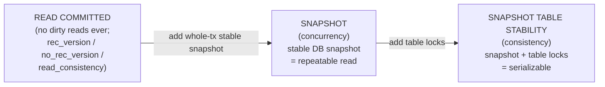
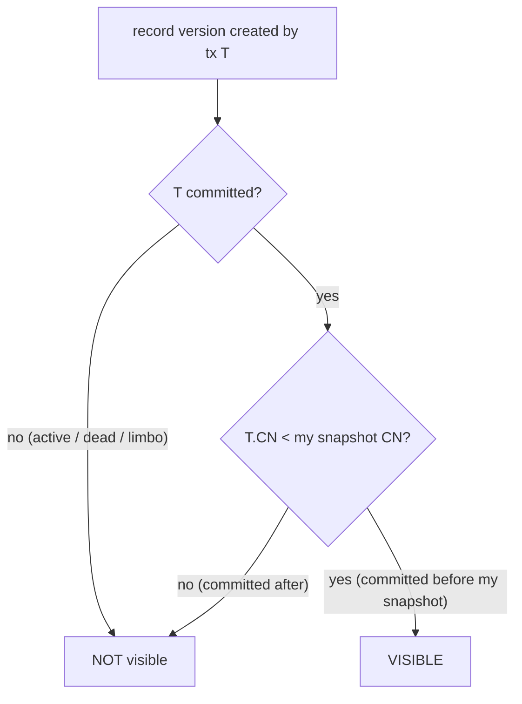

# Transactions, Concurrency and Isolation Levels

Transactions are the contract a database makes with concurrent users: each sees a consistent view, changes are all-or-nothing, and committed data survives. *How* a database keeps that contract while many sessions read and write at once — its concurrency-control machinery and the isolation levels it exposes — is one of the deepest architectural choices it makes. This document describes Firebird 6's transaction model, grounded in the vendored source (`doc/README.read_consistency.md`, `doc/README.transaction_at_snapshot.md`, `src/include/firebird/impl/consts_pub.h`) and verified with concurrent transactions against a live server, then compares it with PostgreSQL, MySQL and SQLite.

It builds on the [on-disk-structure document](on-disk-structure.md) (the TIP, the OIT/OAT markers, and how record versions live on the page) and the [architecture comparison](architecture-comparison.md) (the four MVCC designs), and pairs with [monitoring and tuning](monitoring-and-tuning.md) (watching transaction health) and [backup and recovery](backup-and-recovery.md) (crash recovery of in-flight transactions).

**Table of Contents**

* [The multi-generational foundation](#the-multi-generational-foundation)
* [Firebird's isolation levels](#firebirds-isolation-levels)
* [Commit-order snapshots (Firebird 4+)](#commit-order-snapshots-firebird-4)
* [Locking, waiting and conflicts](#locking-waiting-and-conflicts)
* [Savepoints, explicit locks and autonomous transactions](#savepoints-explicit-locks-and-autonomous-transactions)
* [Concurrency in action (validated)](#concurrency-in-action-validated)
* [Comparison: PostgreSQL, MySQL, SQLite](#comparison-postgresql-mysql-sqlite)
* [Discussion](#discussion)
* [Further research](#further-research)

## The multi-generational foundation

Firebird's concurrency rests on its **multi-generational architecture (MGA)** — a no-undo form of MVCC described physically in the [on-disk-structure document](on-disk-structure.md#inside-a-data-page-records-and-version-deltas). The essentials for this document:

- Every transaction has a number, handed out monotonically (`hdr_next_transaction`).
- An `UPDATE`/`DELETE` writes a **new record version** stamped with the writing transaction's number and chains the prior version behind it (as a delta) via a back-pointer; the old versions *are* the undo information.
- Each transaction's state — active, committed, rolled back, limbo — lives on the **Transaction Inventory Pages (TIP)**, two bits per transaction.
- To decide whether it may see a given record version, a transaction reads that version's creating-transaction number, looks up its state, and applies the visibility rule for its isolation level.

The headline consequences: **readers never block writers and writers never block readers** (each sees the version it is entitled to), and there is **no separate undo log** to manage. The cost is dead versions accumulating until garbage-collected, and the OIT/OAT "gap" that the [tuning document](monitoring-and-tuning.md#firebird-monitoring-the-mon-tables) watches.

## Firebird's isolation levels

Firebird exposes three isolation levels, selected in the Transaction Parameter Block (TPB) or with `SET TRANSACTION`. The TPB constants (`consts_pub.h`) map cleanly to the levels and, in turn, to the SQL standard:

| Firebird level | TPB item | SQL-standard analogue | Guarantees |
|---|---|---|---|
| **READ COMMITTED** | `isc_tpb_read_committed` (15) + `rec_version` (17) / `no_rec_version` (18) / `read_consistency` (22) | READ COMMITTED | Sees only committed data; each statement (or read) sees the latest committed state |
| **SNAPSHOT** | `isc_tpb_concurrency` (2) | REPEATABLE READ / snapshot | A stable snapshot of the whole database taken at transaction start; the same query returns the same rows all transaction long |
| **SNAPSHOT TABLE STABILITY** | `isc_tpb_consistency` (1) | SERIALIZABLE (via locking) | As SNAPSHOT, plus table-level locks so no other transaction can change the reserved tables — the strongest, least concurrent |

Two things stand out. First, Firebird has **no READ UNCOMMITTED** (dirty reads) at all — the weakest level it offers is READ COMMITTED, so uncommitted data is never visible. Second, READ COMMITTED has three sub-modes: `rec_version` (return the latest committed version immediately), `no_rec_version` (wait if a newer uncommitted version exists), and — since Firebird 4 — **`read_consistency`**, which gives every *statement* a stable snapshot so a single statement can't see rows shift under it even in READ COMMITTED (documented in [`doc/README.read_consistency.md`](https://github.com/FirebirdSQL/firebird/blob/master/doc/README.read_consistency.md)).



_Figure 1: Firebird's three isolation levels, weakest to strongest — there is no READ UNCOMMITTED_

## Commit-order snapshots (Firebird 4+)

How a SNAPSHOT is *defined* changed fundamentally in Firebird 4. Traditionally a SNAPSHOT transaction copied the entire TIP at start and kept it privately — expensive on busy systems. Firebird 4 introduced **commit-order snapshots** ([`doc/README.read_consistency.md`](https://github.com/FirebirdSQL/firebird/blob/master/doc/README.read_consistency.md)):

- A per-database **Commit Number (CN)** counter is incremented on every commit; each committed transaction gets a `transaction CN`. Special values mark states: `CN_ACTIVE = 0`, `CN_DEAD`, `CN_LIMBO`.
- A **database snapshot** is now just the value of the global CN at the moment it is created — a single number, not a TIP copy.
- **Visibility rule:** a record version created by *other* transaction T is visible to *my* snapshot if and only if T is committed **and** T's CN is *less than* my snapshot's CN (i.e. T committed before my snapshot). Active/dead/limbo → not visible; committed after my snapshot → not visible.



_Figure 2: The commit-order visibility rule — comparing two Commit Numbers replaces copying the whole TIP_

The CN-to-transaction map is kept in shared memory, spanning only the transactions between OIT and Next. This makes snapshots cheap to take and is the machinery behind statement-level `read_consistency` in READ COMMITTED, and behind commit-order-preserving [replication](replication-architecture.md).

## Locking, waiting and conflicts

MVCC removes read/write blocking, but two transactions writing the **same row** genuinely conflict, and Firebird resolves that with locks plus a configurable wait policy:

- **Wait mode** (`isc_tpb_wait`, default) — a writer that hits a row locked by another transaction **waits** until that transaction commits or rolls back. `isc_tpb_nowait` fails immediately instead, and `LOCK TIMEOUT n` (via `SET TRANSACTION`) waits at most *n* seconds.
- **What happens after the wait:** in READ COMMITTED, once the blocker commits, the waiter proceeds against the now-current version. In SNAPSHOT, the waiter's snapshot predates the blocker's commit, so it cannot safely apply its change → **update conflict**.
- **The error codes** (`src/include/firebird/impl/msg/jrd.h`): `deadlock` (gds −913), `update_conflict` "update conflicts with concurrent update" (−904), `lock_conflict` "lock conflict on no wait transaction" (−901), all SQLSTATE **40001**; plus `concurrent_transaction` reporting the offending transaction number.

Both behaviours are demonstrated live below. Deadlocks (a genuine cycle of waits) are detected and one transaction is chosen as the victim with −913.

## Savepoints, explicit locks and autonomous transactions

Firebird provides the finer-grained transaction controls too:

- **Savepoints** — `SAVEPOINT name` / `ROLLBACK TO SAVEPOINT name` for partial rollback within a transaction; every statement also runs inside an implicit savepoint so a failed statement rolls back cleanly ([`README.savepoints`](https://github.com/FirebirdSQL/firebird/blob/master/doc/sql.extensions/README.savepoints)).
- **Explicit locking** — `SELECT ... WITH LOCK` pessimistically locks the selected rows (Firebird's `FOR UPDATE` equivalent), and **`SKIP LOCKED`** (Firebird 5) lets a query skip rows another transaction has locked — the classic building block for work-queue/job-dispatch patterns ([`README.skip_locked.md`](https://github.com/FirebirdSQL/firebird/blob/master/doc/sql.extensions/README.skip_locked.md)).
- **Autonomous transactions** — `IN AUTONOMOUS TRANSACTION DO ...` in PSQL commits a nested unit of work independently of the outer transaction (useful for audit logging that must persist even if the caller rolls back).
- **`SET TRANSACTION` options** — `NO AUTO UNDO` (skip the undo log for bulk inserts), `IGNORE LIMBO`, `LOCK TIMEOUT`, read-only/read-write, and the reserved-table list for SNAPSHOT TABLE STABILITY.

## Concurrency in action (validated)

The following was run against a live Firebird 6 server with two concurrent connections (via the `node-firebird` driver; the driver's isolation constants confirm the mapping — `ISOLATION_REPEATABLE_READ = [2]` = `isc_tpb_concurrency`, `ISOLATION_SERIALIZABLE = [1]` = `isc_tpb_consistency`).

**SNAPSHOT isolation gives a stable view** — connection A does not see B's later commit:

```text
[SNAPSHOT] A reads bal = 100
[SNAPSHOT] B committed bal=999
[SNAPSHOT] A re-reads bal = 100      (unchanged: stable snapshot)
[SNAPSHOT] A new tx reads bal = 999  (now sees the commit)
```

A's SNAPSHOT transaction keeps returning `100` even after B commits `999`, and only a *new* transaction sees `999` — exactly repeatable-read semantics from the commit-order rule above.

**Write conflict** — two SNAPSHOT transactions updating the same row, in WAIT mode:

```text
[CONFLICT] t1 (SNAPSHOT) updated the row (uncommitted)
[CONFLICT] after 1.5s, t2 update is pending  - blocked on t1 write lock (WAIT)
[CONFLICT] committing t1 ...
[CONFLICT] t2 result: ERR: Deadlock, Update conflicts with concurrent update,
                           Concurrent transaction number is 9
```

t2's update **blocks** while t1 holds the row (WAIT mode); when t1 commits, t2's snapshot is now stale, so it fails with the **−904 update conflict** naming the concurrent transaction. In READ COMMITTED the same sequence instead lets t2 proceed against the freshly-committed version (verified separately) — the isolation level directly changes the outcome.

## Comparison: PostgreSQL, MySQL, SQLite

| Aspect | **Firebird** | **PostgreSQL** | **MySQL (InnoDB)** | **SQLite** |
|---|---|---|---|---|
| Concurrency model | MGA (no-undo MVCC) | MVCC (heap tuples) | MVCC (undo logs) | Single writer + [WAL snapshot reads](https://sqlite.org/isolation.html) |
| Readers block writers? | No | No | No | No (WAL) / readers block writer (rollback) |
| Lowest isolation | READ COMMITTED (**no dirty read**) | READ COMMITTED (READ UNCOMMITTED = RC) | READ UNCOMMITTED | — |
| Default isolation | (client choice; SNAPSHOT common) | READ COMMITTED | REPEATABLE READ | SERIALIZABLE (single writer) |
| Repeatable read | SNAPSHOT (`concurrency`) | REPEATABLE READ (snapshot) | REPEATABLE READ + [gap locks](https://dev.mysql.com/doc/refman/8.4/en/innodb-locking.html) | (serial) |
| Serializable | SNAPSHOT TABLE STABILITY (table locks) | **SSI** (true serializable) | SERIALIZABLE (locking) | Serial by construction |
| Statement read consistency | `read_consistency` (FB4) | Always in RC | Consistent read snapshot | Serial |
| Write conflict signal | −904 update conflict / −913 deadlock (40001) | serialization_failure (40001) | deadlock → rollback; lock wait timeout | `SQLITE_BUSY` |
| Wait policy | WAIT / NOWAIT / LOCK TIMEOUT | `lock_timeout`; `NOWAIT` on locks | `innodb_lock_wait_timeout` | `busy_timeout` |
| Explicit row lock | `SELECT ... WITH LOCK`; `SKIP LOCKED` (FB5) | `FOR UPDATE [SKIP LOCKED]` | `FOR UPDATE [SKIP LOCKED]` | (whole-database) |
| Savepoints | Yes | Yes | Yes | Yes |

## Discussion

**Firebird has no dirty read, and that is a deliberate strength.** Three of the four systems expose READ UNCOMMITTED in some form (PostgreSQL silently treats it as READ COMMITTED; MySQL genuinely allows dirty reads); Firebird simply does not offer it — its floor is READ COMMITTED. Combined with MGA, this means a Firebird reader never sees uncommitted data *and* never blocks a writer, which is a clean default for correctness.

**True serializability is where the four diverge most.** PostgreSQL's **Serializable Snapshot Isolation** is genuine serializability layered on MVCC with no blocking — the strongest and most concurrent design, at the cost of possible serialization-failure retries. Firebird's SNAPSHOT TABLE STABILITY and MySQL's SERIALIZABLE reach serializability the older way, through **locks** (table locks and gap/next-key locks respectively), trading concurrency for the guarantee. SQLite is serializable trivially because only one writer runs at a time (see the [embedded comparison](embedded-architecture-comparison.md#the-decisive-difference-concurrency)). If you need serializable *and* high concurrency, PostgreSQL's SSI is the outlier; the others make you choose.

**The snapshot mechanism reflects each engine's lineage.** Firebird's commit-order snapshots (FB4) and PostgreSQL's snapshot-from-`xmin`/`xmax`-and-`clog` both answer "which committed versions predate me" — Firebird now with a single Commit Number comparison, PostgreSQL with transaction-id bookkeeping. InnoDB reconstructs the visible version from undo logs instead. All three are MVCC, but the [on-disk-structure comparison](on-disk-structure.md#comparison-postgresql-mysqlinnodb-sqlite) shows why their visibility checks differ: the old versions live in different places (Firebird's page-local deltas, PostgreSQL's heap, InnoDB's undo). SQLite, with no per-row versions, sidesteps the whole question by serializing writers.

**Conflict handling is a shared, and shared-frustration, story.** Every MVCC system must tell a transaction "you conflicted; retry" — Firebird's −904/−913 (SQLSTATE 40001), PostgreSQL's serialization_failure (also 40001), InnoDB's deadlock rollback, SQLite's `SQLITE_BUSY`. Well-written applications treat 40001 as "retry the transaction", and the same wait-policy knobs (WAIT/NOWAIT/timeout) appear, differently spelled, in all four. `SKIP LOCKED` — now in Firebird 5, PostgreSQL and MySQL — has become the standard escape hatch for queue workloads that must *not* wait.

## Further research

**Firebird**

- [`doc/README.read_consistency.md`](https://github.com/FirebirdSQL/firebird/blob/master/doc/README.read_consistency.md) — commit-order snapshots and READ COMMITTED read consistency (the source for Figure 2).
- [`doc/README.transaction_at_snapshot.md`](https://github.com/FirebirdSQL/firebird/blob/master/doc/README.transaction_at_snapshot.md) — starting a transaction at a given snapshot.
- [`README.savepoints`](https://github.com/FirebirdSQL/firebird/blob/master/doc/sql.extensions/README.savepoints), [`README.explicit_locks`](https://github.com/FirebirdSQL/firebird/blob/master/doc/sql.extensions/README.explicit_locks), [`README.skip_locked.md`](https://github.com/FirebirdSQL/firebird/blob/master/doc/sql.extensions/README.skip_locked.md).
- The [on-disk-structure document](on-disk-structure.md#mvcc-on-disk-the-transaction-inventory) (TIP, OIT/OAT) and [monitoring document](monitoring-and-tuning.md) (watching transaction health) for the mechanics behind these levels.

**PostgreSQL**

- [Transaction isolation](https://www.postgresql.org/docs/current/transaction-iso.html) (including [Serializable/SSI](https://www.postgresql.org/docs/current/transaction-iso.html#XACT-SERIALIZABLE)), [Concurrency control (MVCC)](https://www.postgresql.org/docs/current/mvcc.html), [Explicit locking](https://www.postgresql.org/docs/current/explicit-locking.html).

**MySQL**

- [InnoDB transaction isolation levels](https://dev.mysql.com/doc/refman/8.4/en/innodb-transaction-isolation-levels.html), [InnoDB locking](https://dev.mysql.com/doc/refman/8.4/en/innodb-locking.html), [Deadlocks in InnoDB](https://dev.mysql.com/doc/refman/8.4/en/innodb-deadlocks.html); MariaDB's [SET TRANSACTION](https://mariadb.com/kb/en/set-transaction/).

**SQLite**

- [Isolation in SQLite](https://sqlite.org/isolation.html), [Transactions](https://sqlite.org/lang_transaction.html), [File locking and concurrency](https://sqlite.org/lockingv3.html).

**Background**

- [Isolation (database systems)](https://en.wikipedia.org/wiki/Isolation_(database_systems)) and [Multiversion concurrency control](https://en.wikipedia.org/wiki/Multiversion_concurrency_control) for the standard phenomena and MVCC theory.
